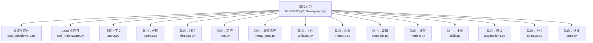
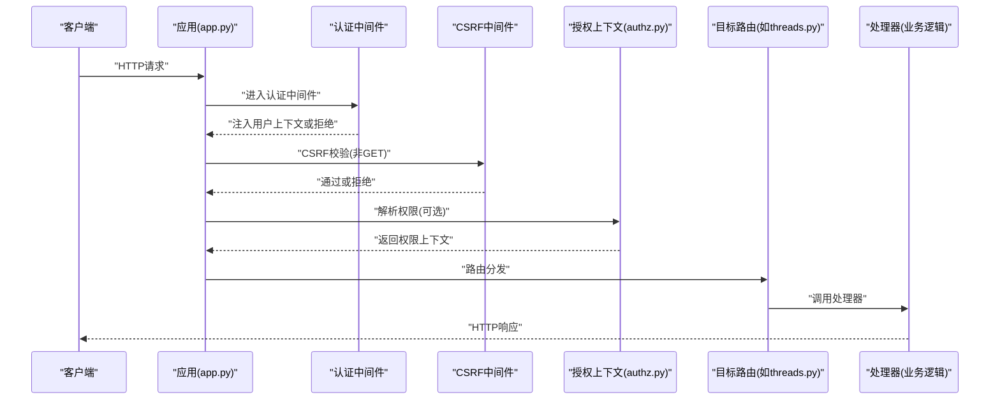
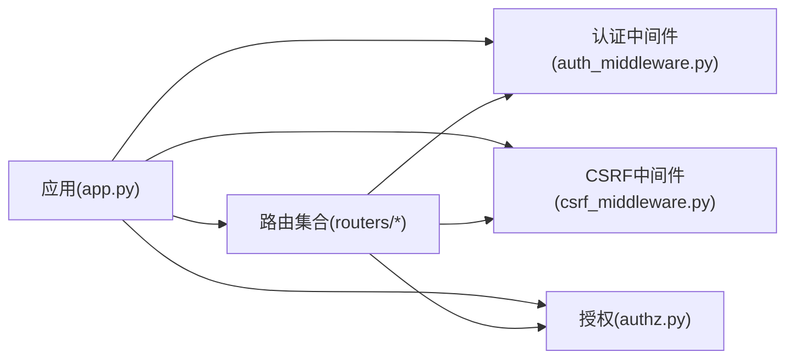

# API参考

<cite>
**本文引用的文件**
- [backend/app/gateway/app.py](file://backend/app/gateway/app.py)
- [backend/app/gateway/routers/agents.py](file://backend/app/gateway/routers/agents.py)
- [backend/app/gateway/routers/artifacts.py](file://backend/app/gateway/routers/artifacts.py)
- [backend/app/gateway/routers/auth.py](file://backend/app/gateway/routers/auth.py)
- [backend/app/gateway/routers/channels.py](file://backend/app/gateway/routers/channels.py)
- [backend/app/gateway/routers/memory.py](file://backend/app/gateway/routers/memory.py)
- [backend/app/gateway/routers/models.py](file://backend/app/gateway/routers/models.py)
- [backend/app/gateway/routers/runs.py](file://backend/app/gateway/routers/runs.py)
- [backend/app/gateway/routers/skills.py](file://backend/app/gateway/routers/skills.py)
- [backend/app/gateway/routers/suggestions.py](file://backend/app/gateway/routers/suggestions.py)
- [backend/app/gateway/routers/thread_runs.py](file://backend/app/gateway/routers/thread_runs.py)
- [backend/app/gateway/routers/threads.py](file://backend/app/gateway/routers/threads.py)
- [backend/app/gateway/routers/uploads.py](file://backend/app/gateway/routers/uploads.py)
- [backend/app/gateway/authz.py](file://backend/app/gateway/authz.py)
- [backend/app/gateway/auth_middleware.py](file://backend/app/gateway/auth_middleware.py)
- [backend/app/gateway/csrf_middleware.py](file://backend/app/gateway/csrf_middleware.py)
- [backend/docs/API.md](file://backend/docs/API.md)
- [backend/docs/FILE_UPLOAD.md](file://backend/docs/FILE_UPLOAD.md)
- [backend/docs/MEMORY_IMPROVEMENTS.md](file://backend/docs/MEMORY_IMPROVEMENTS.md)
- [backend/docs/STREAMING.md](file://backend/docs/STREAMING.md)
- [backend/tests/test_openapi_operation_ids.py](file://backend/tests/test_openapi_operation_ids.py)
- [backend/tests/test_auth_middleware.py](file://backend/tests/test_auth_middleware.py)
- [backend/tests/test_auth_type_system.py](file://backend/tests/test_auth_type_system.py)
</cite>

## 目录
1. [简介](#简介)
2. [项目结构](#项目结构)
3. [核心组件](#核心组件)
4. [架构总览](#架构总览)
5. [详细组件分析](#详细组件分析)
6. [依赖关系分析](#依赖关系分析)
7. [性能考量](#性能考量)
8. [故障排查指南](#故障排查指南)
9. [结论](#结论)
10. [附录](#附录)

## 简介
本API参考文档面向后端网关（Gateway）暴露的所有REST API端点，覆盖代理管理、线程与运行、工具与技能、文件上传、内存操作、渠道集成、模型与建议等API组。文档提供每个端点的HTTP方法、URL模式、请求/响应模式与认证方式说明，并补充协议示例、错误处理策略、安全考虑、速率限制与版本信息。同时给出常见用例、客户端实现要点与性能优化建议。

## 项目结构
后端网关基于FastAPI应用启动，路由按功能模块划分在routers目录下；认证与授权通过中间件与装饰器统一处理；OpenAPI规范由应用自动生成并在测试中确保operationId唯一性。

图表来源
- [backend/app/gateway/app.py](file://backend/app/gateway/app.py)
- [backend/app/gateway/auth_middleware.py](file://backend/app/gateway/auth_middleware.py)
- [backend/app/gateway/csrf_middleware.py](file://backend/app/gateway/csrf_middleware.py)
- [backend/app/gateway/authz.py](file://backend/app/gateway/authz.py)
- [backend/app/gateway/routers/agents.py](file://backend/app/gateway/routers/agents.py)
- [backend/app/gateway/routers/threads.py](file://backend/app/gateway/routers/threads.py)
- [backend/app/gateway/routers/runs.py](file://backend/app/gateway/routers/runs.py)
- [backend/app/gateway/routers/thread_runs.py](file://backend/app/gateway/routers/thread_runs.py)
- [backend/app/gateway/routers/artifacts.py](file://backend/app/gateway/routers/artifacts.py)
- [backend/app/gateway/routers/memory.py](file://backend/app/gateway/routers/memory.py)
- [backend/app/gateway/routers/channels.py](file://backend/app/gateway/routers/channels.py)
- [backend/app/gateway/routers/models.py](file://backend/app/gateway/routers/models.py)
- [backend/app/gateway/routers/skills.py](file://backend/app/gateway/routers/skills.py)
- [backend/app/gateway/routers/suggestions.py](file://backend/app/gateway/routers/suggestions.py)
- [backend/app/gateway/routers/uploads.py](file://backend/app/gateway/routers/uploads.py)
- [backend/app/gateway/routers/auth.py](file://backend/app/gateway/routers/auth.py)

章节来源
- [backend/app/gateway/app.py](file://backend/app/gateway/app.py)
- [backend/app/gateway/routers/agents.py](file://backend/app/gateway/routers/agents.py)
- [backend/app/gateway/routers/threads.py](file://backend/app/gateway/routers/threads.py)
- [backend/app/gateway/routers/runs.py](file://backend/app/gateway/routers/runs.py)
- [backend/app/gateway/routers/thread_runs.py](file://backend/app/gateway/routers/thread_runs.py)
- [backend/app/gateway/routers/artifacts.py](file://backend/app/gateway/routers/artifacts.py)
- [backend/app/gateway/routers/memory.py](file://backend/app/gateway/routers/memory.py)
- [backend/app/gateway/routers/channels.py](file://backend/app/gateway/routers/channels.py)
- [backend/app/gateway/routers/models.py](file://backend/app/gateway/routers/models.py)
- [backend/app/gateway/routers/skills.py](file://backend/app/gateway/routers/skills.py)
- [backend/app/gateway/routers/suggestions.py](file://backend/app/gateway/routers/suggestions.py)
- [backend/app/gateway/routers/uploads.py](file://backend/app/gateway/routers/uploads.py)
- [backend/app/gateway/routers/auth.py](file://backend/app/gateway/routers/auth.py)

## 核心组件
- 应用与路由注册：应用入口负责挂载各路由模块与中间件，统一暴露OpenAPI规范。
- 认证中间件：拦截请求，解析访问令牌，注入用户上下文。
- 授权上下文：解析用户权限，提供装饰器用于端点级权限校验。
- CSRF保护：对非GET请求进行CSRF校验，部分认证端点豁免。
- OpenAPI生成：应用自动生成接口规范，测试保障operationId全局唯一。

章节来源
- [backend/app/gateway/app.py](file://backend/app/gateway/app.py)
- [backend/app/gateway/auth_middleware.py](file://backend/app/gateway/auth_middleware.py)
- [backend/app/gateway/authz.py](file://backend/app/gateway/authz.py)
- [backend/app/gateway/csrf_middleware.py](file://backend/app/gateway/csrf_middleware.py)
- [backend/tests/test_openapi_operation_ids.py](file://backend/tests/test_openapi_operation_ids.py)

## 架构总览
下图展示从客户端到具体路由处理器的调用链路，以及认证、授权与CSRF保护的执行顺序。

图表来源
- [backend/app/gateway/app.py](file://backend/app/gateway/app.py)
- [backend/app/gateway/auth_middleware.py](file://backend/app/gateway/auth_middleware.py)
- [backend/app/gateway/csrf_middleware.py](file://backend/app/gateway/csrf_middleware.py)
- [backend/app/gateway/authz.py](file://backend/app/gateway/authz.py)
- [backend/app/gateway/routers/threads.py](file://backend/app/gateway/routers/threads.py)

## 详细组件分析

### 认证与授权API组
- 路由模块：认证相关端点位于routers/auth.py，包含登录、注销、注册与OAuth回调占位。
- 中间件：认证中间件负责令牌解析与用户注入；CSRF中间件对非GET请求进行校验，认证端点豁免。
- 授权：装饰器require_auth强制认证，装饰器require_permission进行权限校验；未知端点默认401。

章节来源
- [backend/app/gateway/routers/auth.py](file://backend/app/gateway/routers/auth.py)
- [backend/app/gateway/auth_middleware.py](file://backend/app/gateway/auth_middleware.py)
- [backend/app/gateway/csrf_middleware.py](file://backend/app/gateway/csrf_middleware.py)
- [backend/app/gateway/authz.py](file://backend/app/gateway/authz.py)
- [backend/tests/test_auth_middleware.py](file://backend/tests/test_auth_middleware.py)
- [backend/tests/test_auth_type_system.py](file://backend/tests/test_auth_type_system.py)

### 代理管理API组
- 功能范围：代理的创建、查询、更新与删除等管理操作。
- 认证要求：通常需要认证与相应权限。
- 响应格式：遵循统一的错误与成功响应结构。

章节来源
- [backend/app/gateway/routers/agents.py](file://backend/app/gateway/routers/agents.py)

### 线程与运行API组
- 线程管理：线程的创建、查询、更新与消息历史查询。
- 运行管理：启动、取消、查询运行状态与事件流。
- 流式输出：支持SSE/流式传输，便于实时反馈。

章节来源
- [backend/app/gateway/routers/threads.py](file://backend/app/gateway/routers/threads.py)
- [backend/app/gateway/routers/runs.py](file://backend/app/gateway/routers/runs.py)
- [backend/app/gateway/routers/thread_runs.py](file://backend/app/gateway/routers/thread_runs.py)
- [backend/docs/STREAMING.md](file://backend/docs/STREAMING.md)

### 工件与内存API组
- 工件：与任务产物相关的查询与管理。
- 内存：线程记忆的读写、更新与过滤策略。

章节来源
- [backend/app/gateway/routers/artifacts.py](file://backend/app/gateway/routers/artifacts.py)
- [backend/app/gateway/routers/memory.py](file://backend/app/gateway/routers/memory.py)
- [backend/docs/MEMORY_IMPROVEMENTS.md](file://backend/docs/MEMORY_IMPROVEMENTS.md)

### 渠道与模型API组
- 渠道：对接多种IM平台的消息通道。
- 模型：模型列表与配置查询。

章节来源
- [backend/app/gateway/routers/channels.py](file://backend/app/gateway/routers/channels.py)
- [backend/app/gateway/routers/models.py](file://backend/app/gateway/routers/models.py)

### 技能与建议API组
- 技能：技能的安装、卸载、权限与策略管理。
- 建议：根据上下文生成的建议列表。

章节来源
- [backend/app/gateway/routers/skills.py](file://backend/app/gateway/routers/skills.py)
- [backend/app/gateway/routers/suggestions.py](file://backend/app/gateway/routers/suggestions.py)

### 文件上传API组
- 支持多文件上传与附件关联。
- 上传流程：客户端发起上传请求，服务端返回临时凭证或直接存储，随后与线程/运行/工件关联。

章节来源
- [backend/app/gateway/routers/uploads.py](file://backend/app/gateway/routers/uploads.py)
- [backend/docs/FILE_UPLOAD.md](file://backend/docs/FILE_UPLOAD.md)

### 协议与版本
- 版本前缀：/api/v1
- 认证：Cookie中的access_token（JWT），或通过请求头携带（依实现而定）。
- 错误响应：统一结构，包含错误码与描述。
- OpenAPI：/openapi.json由应用自动生成，测试保证operationId唯一。

章节来源
- [backend/app/gateway/app.py](file://backend/app/gateway/app.py)
- [backend/tests/test_openapi_operation_ids.py](file://backend/tests/test_openapi_operation_ids.py)

## 依赖关系分析
- 组件耦合：路由模块仅依赖应用入口与中间件；授权上下文通过装饰器被路由复用。
- 外部依赖：OpenAPI生成依赖FastAPI；上传与内存模块依赖内部存储与工具集。
- 安全边界：认证中间件与CSRF中间件构成第一道防线；require_auth与require_permission提供细粒度权限控制。

图表来源
- [backend/app/gateway/app.py](file://backend/app/gateway/app.py)
- [backend/app/gateway/auth_middleware.py](file://backend/app/gateway/auth_middleware.py)
- [backend/app/gateway/csrf_middleware.py](file://backend/app/gateway/csrf_middleware.py)
- [backend/app/gateway/authz.py](file://backend/app/gateway/authz.py)
- [backend/app/gateway/routers/threads.py](file://backend/app/gateway/routers/threads.py)

章节来源
- [backend/app/gateway/app.py](file://backend/app/gateway/app.py)
- [backend/app/gateway/auth_middleware.py](file://backend/app/gateway/auth_middleware.py)
- [backend/app/gateway/csrf_middleware.py](file://backend/app/gateway/csrf_middleware.py)
- [backend/app/gateway/authz.py](file://backend/app/gateway/authz.py)

## 性能考量
- 流式输出：使用SSE/流式传输减少长轮询开销，提升交互体验。
- 内存优化：合理设置线程记忆大小与过期策略，避免无界增长。
- 并发与阻塞I/O：避免在请求处理中执行阻塞操作，必要时使用异步或后台任务。
- 上传优化：大文件采用分片上传与断点续传策略，结合进度回调。

章节来源
- [backend/docs/STREAMING.md](file://backend/docs/STREAMING.md)
- [backend/docs/MEMORY_IMPROVEMENTS.md](file://backend/docs/MEMORY_IMPROVEMENTS.md)

## 故障排查指南
- 401未认证：确认access_token是否正确传递与未过期；未知端点默认拒绝。
- CSRF校验失败：非GET请求需携带有效CSRF令牌；认证端点通常豁免。
- OpenAPI重复operationId：确保路由定义不共享相同operationId，测试已验证唯一性。
- OAuth回调：当前为占位实现，尚未完成。

章节来源
- [backend/tests/test_auth_middleware.py](file://backend/tests/test_auth_middleware.py)
- [backend/tests/test_auth_type_system.py](file://backend/tests/test_auth_type_system.py)
- [backend/tests/test_openapi_operation_ids.py](file://backend/tests/test_openapi_operation_ids.py)
- [backend/app/gateway/routers/auth.py](file://backend/app/gateway/routers/auth.py)

## 结论
本API参考文档梳理了后端网关的主要REST端点与配套机制，明确了认证、授权、CSRF与OpenAPI规范的落地方式。建议在生产环境中严格启用认证与权限控制，结合流式传输与内存优化策略提升性能，并通过测试保障接口稳定性与一致性。

## 附录
- 常见用例
  - 创建线程并发送消息，随后启动运行获取流式结果。
  - 使用技能工具执行外部命令或查询，将结果作为消息回写线程。
  - 上传文件并将其作为附件与线程或工件关联。
- 客户端实现要点
  - 统一处理401与403错误，自动刷新令牌或引导重新登录。
  - 对SSE连接进行重连与背压控制。
  - 在上传场景中实现断点续传与进度上报。
- 安全与合规
  - 严格启用HTTPS与安全Cookie属性。
  - 对敏感参数进行脱敏与审计日志记录。
  - 限制单IP并发与QPS，防止滥用。