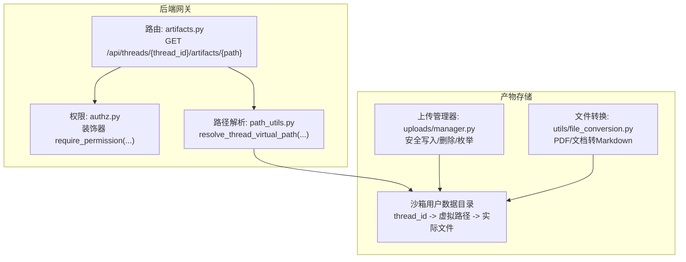
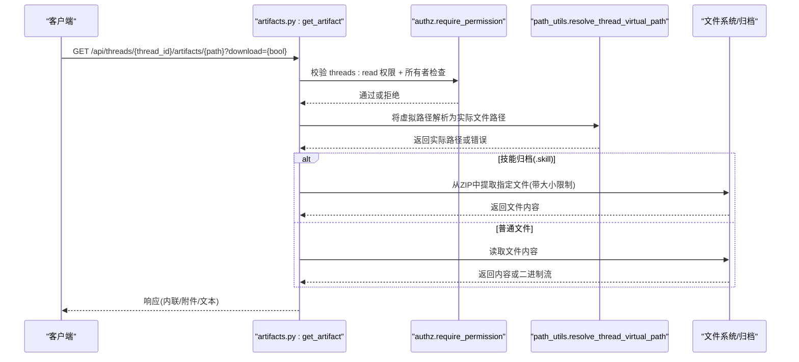
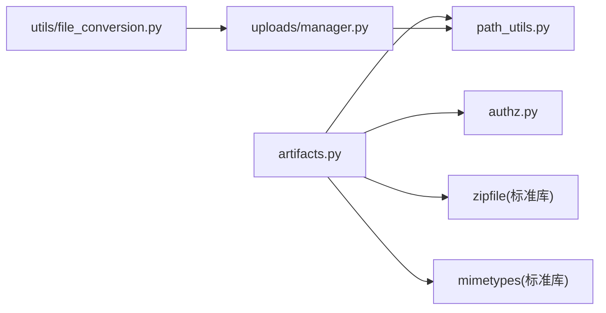

# 产物API

<cite>
**本文引用的文件**
- [artifacts.py](file://backend/app/gateway/routers/artifacts.py)
- [test_artifacts_router.py](file://backend/tests/test_artifacts_router.py)
- [authz.py](file://backend/app/gateway/authz.py)
- [path_utils.py](file://backend/app/gateway/path_utils.py)
- [manager.py](file://backend/packages/harness/deerflow/uploads/manager.py)
- [file_conversion.py](file://backend/packages/harness/deerflow/utils/file_conversion.py)
</cite>

## 目录
1. [简介](#简介)
2. [项目结构](#项目结构)
3. [核心组件](#核心组件)
4. [架构总览](#架构总览)
5. [详细组件分析](#详细组件分析)
6. [依赖分析](#依赖分析)
7. [性能考虑](#性能考虑)
8. [故障排查指南](#故障排查指南)
9. [结论](#结论)
10. [附录](#附录)

## 简介
本文件为“产物API”的完整技术规范与实现解析，覆盖AI生成产物的管理端点：产物创建、查询、下载、分享（通过URL）、类型识别与安全策略、虚拟路径解析、上传与转换、以及与权限系统、认证中间件的集成方式。文档同时给出产物类型分类、存储格式、访问权限、生命周期管理、元数据与版本控制、依赖追踪、质量评估、使用统计与归档清理等高级能力的落地建议与实现要点。

## 项目结构
产物API位于后端网关路由层，围绕线程（thread）维度提供产物访问能力，并通过虚拟路径解析到沙箱用户数据目录，结合上传管理器与文件转换工具实现上传、转换与产物展示。

图表来源
- [artifacts.py:15-203](file://backend/app/gateway/routers/artifacts.py#L15-L203)
- [authz.py:197-302](file://backend/app/gateway/authz.py#L197-L302)
- [path_utils.py:11-30](file://backend/app/gateway/path_utils.py#L11-L30)
- [manager.py:40-309](file://backend/packages/harness/deerflow/uploads/manager.py#L40-L309)
- [file_conversion.py:26-168](file://backend/packages/harness/deerflow/utils/file_conversion.py#L26-L168)

章节来源
- [artifacts.py:15-203](file://backend/app/gateway/routers/artifacts.py#L15-L203)
- [authz.py:197-302](file://backend/app/gateway/authz.py#L197-L302)
- [path_utils.py:11-30](file://backend/app/gateway/path_utils.py#L11-L30)
- [manager.py:40-309](file://backend/packages/harness/deerflow/uploads/manager.py#L40-L309)
- [file_conversion.py:26-168](file://backend/packages/harness/deerflow/utils/file_conversion.py#L26-L168)

## 核心组件
- 产物访问路由：提供按线程ID与虚拟路径获取产物文件的能力，自动识别内容类型并采取安全策略（如对活动内容强制下载），支持从技能归档中提取内部文件。
- 权限与认证：基于资源:动作模型的装饰器，支持所有者校验与线程级访问控制。
- 路径解析：将虚拟路径解析到线程用户数据目录，内置路径穿越防护。
- 上传管理：提供安全的上传写入、文件枚举、删除与URL构建，支持上传目录下的产物URL生成。
- 文件转换：针对PDF/文档类文件的转换与大纲抽取，支持大文件异步转换以避免阻塞事件循环。

章节来源
- [artifacts.py:99-203](file://backend/app/gateway/routers/artifacts.py#L99-L203)
- [authz.py:47-119](file://backend/app/gateway/authz.py#L47-L119)
- [path_utils.py:11-30](file://backend/app/gateway/path_utils.py#L11-L30)
- [manager.py:40-309](file://backend/packages/harness/deerflow/uploads/manager.py#L40-L309)
- [file_conversion.py:26-168](file://backend/packages/harness/deerflow/utils/file_conversion.py#L26-L168)

## 架构总览
产物API采用“路由层-权限层-路径解析层-存储层”的分层设计，确保产物访问的安全性与可扩展性。

图表来源
- [artifacts.py:105-203](file://backend/app/gateway/routers/artifacts.py#L105-L203)
- [authz.py:197-302](file://backend/app/gateway/authz.py#L197-L302)
- [path_utils.py:11-30](file://backend/app/gateway/path_utils.py#L11-L30)

## 详细组件分析

### 产物访问路由（GET /api/threads/{thread_id}/artifacts/{path}）
- 功能要点
  - 自动识别内容类型：文本、二进制、活动内容（HTML/XHTML/SVG）。
  - 对活动内容强制下载，防止在应用同源下执行脚本。
  - 支持查询参数download强制以附件形式返回。
  - 支持从技能归档（.skill）中提取内部文件，内置大小限制与分块读取，避免内存膨胀。
  - 对于未知类型但疑似文本的内容，尝试以文本方式读取并降级为纯文本响应。
- 安全策略
  - 使用虚拟路径解析与路径穿越检测，拒绝非法路径。
  - 对归档成员进行大小上限校验，超过阈值直接拒绝。
- 错误处理
  - 非法路径/越界：403；不存在/非文件：404；非文本解码失败：回退为二进制。
- 典型用例
  - 内联查看文本文件
  - 下载CSV/图片等二进制文件
  - 强制下载HTML/XHTML/SVG产物
  - 从技能归档中预览内部文档

章节来源
- [artifacts.py:99-203](file://backend/app/gateway/routers/artifacts.py#L99-L203)
- [test_artifacts_router.py:46-120](file://backend/tests/test_artifacts_router.py#L46-L120)

### 权限与认证（require_permission）
- 权限模型
  - 资源:动作：threads:read、threads:write、threads:delete、runs:create、runs:read、runs:cancel。
  - 可选所有者校验：要求线程存在且归属当前用户，用于保护敏感产物。
- 集成方式
  - 在路由上叠加装饰器链，先认证再授权，最后执行业务逻辑。
- 测试验证
  - 单测覆盖了活动内容强制下载、技能归档下载、下载参数行为等场景。

章节来源
- [authz.py:47-119](file://backend/app/gateway/authz.py#L47-L119)
- [authz.py:197-302](file://backend/app/gateway/authz.py#L197-L302)
- [test_artifacts_router.py:46-120](file://backend/tests/test_artifacts_router.py#L46-L120)

### 路径解析（resolve_thread_virtual_path）
- 作用
  - 将虚拟路径（如 mnt/user-data/outputs/...）解析为线程用户数据目录下的真实文件路径。
  - 内置路径穿越检测，异常时返回403/400状态码。
- 适用范围
  - 产物访问、上传写入、文件枚举等均依赖该解析函数。

章节来源
- [path_utils.py:11-30](file://backend/app/gateway/path_utils.py#L11-L30)

### 上传管理（uploads/manager.py）
- 能力概览
  - 安全写入：防符号链接、路径穿越、竞态窗口最小化。
  - 文件枚举：列出文件并补充虚拟路径与产物URL。
  - 删除操作：支持伴生Markdown清理与路径穿越校验。
  - URL构建：生成上传产物的访问URL。
- 产物URL
  - 通过上传管理器提供的URL模板，可将上传目录中的文件暴露为产物访问入口。

章节来源
- [manager.py:40-309](file://backend/packages/harness/deerflow/uploads/manager.py#L40-L309)

### 文件转换（utils/file_conversion.py）
- 支持类型
  - PDF、PPT、PPTX、XLS、XLSX、DOC、DOCX。
- 转换策略
  - 自动模式优先使用pymupdf4llm，若输出稀疏则回退MarkItDown；也可显式选择转换器。
  - 大文件（>1MB）在后台线程池转换，避免阻塞事件循环。
- 输出与辅助
  - 生成同名 .md 文件；可抽取文档大纲（最多N项），用于上下文增强。
- 与产物的关系
  - 上传的文档类产物可被转换为Markdown，便于检索与展示；同时保留原始文件作为二进制产物。

章节来源
- [file_conversion.py:26-168](file://backend/packages/harness/deerflow/utils/file_conversion.py#L26-L168)

## 依赖分析
- 组件耦合
  - artifacts路由依赖权限装饰器与路径解析；对上传管理器与文件转换工具为间接依赖（通过上传流程与转换流程集成）。
- 外部依赖
  - mimetypes用于类型推断；zipfile用于技能归档读取；FastAPI响应类型用于不同内容形态。
- 循环依赖
  - 当前模块间无循环导入迹象，职责清晰。

图表来源
- [artifacts.py:1-12](file://backend/app/gateway/routers/artifacts.py#L1-L12)
- [authz.py:30-45](file://backend/app/gateway/authz.py#L30-L45)
- [path_utils.py:3-9](file://backend/app/gateway/path_utils.py#L3-L9)
- [manager.py:14-16](file://backend/packages/harness/deerflow/uploads/manager.py#L14-L16)
- [file_conversion.py:22-24](file://backend/packages/harness/deerflow/utils/file_conversion.py#L22-L24)

## 性能考虑
- 归档读取
  - 分块读取与成员大小上限，避免单个成员占用过多内存。
- 文档转换
  - 大文件异步转换，减少主线程阻塞；pymupdf4llm优先，必要时回退MarkItDown。
- 响应策略
  - 文本文件直接读取并按MIME类型返回；二进制文件按需读取字节流；活动内容强制下载降低渲染风险。
- 缓存
  - 技能归档内部文件返回时设置短期缓存头，减少重复解压开销。

章节来源
- [artifacts.py:50-64](file://backend/app/gateway/routers/artifacts.py#L50-L64)
- [artifacts.py:161-162](file://backend/app/gateway/routers/artifacts.py#L161-L162)
- [file_conversion.py:155-158](file://backend/packages/harness/deerflow/utils/file_conversion.py#L155-L158)

## 故障排查指南
- 403/400错误
  - 可能原因：路径穿越、虚拟路径不合法、目标不是文件。
  - 排查步骤：确认请求路径是否以虚拟前缀开头；检查线程ID是否符合安全规则；确认目标为文件而非目录。
- 404错误
  - 可能原因：产物不存在或技能归档内未找到对应文件。
  - 排查步骤：核对归档路径与内部文件名；确认归档未损坏。
- 413错误（技能归档成员过大）
  - 可能原因：成员超出大小限制。
  - 排查步骤：检查归档成员压缩前大小；必要时拆分归档或调整阈值配置。
- 活动内容未内联显示
  - 行为正确：活动内容（HTML/XHTML/SVG）会被强制下载，防止脚本执行风险。
- 文本编码问题
  - 现象：在特定区域设置下读取文本文件出现乱码。
  - 处理：确保文件以UTF-8保存；服务端按UTF-8读取；测试覆盖了Windows GBK默认编码场景。

章节来源
- [artifacts.py:176-203](file://backend/app/gateway/routers/artifacts.py#L176-L203)
- [test_artifacts_router.py:108-120](file://backend/tests/test_artifacts_router.py#L108-L120)
- [test_artifacts_router.py:25-44](file://backend/tests/test_artifacts_router.py#L25-L44)

## 结论
产物API以安全为核心，结合权限控制、虚拟路径解析与活动内容强制下载策略，提供了稳定可靠的产物访问能力。通过上传管理与文件转换工具，实现了从上传到产物展示的完整闭环。建议在生产环境中配合严格的权限策略、归档大小限制与监控告警，持续优化转换性能与用户体验。

## 附录

### API定义（摘要）
- 路径
  - GET /api/threads/{thread_id}/artifacts/{path}
- 查询参数
  - download: 是否强制附件下载（布尔）
- 认证与权限
  - 需要 threads:read 权限；可启用所有者校验
- 响应类型
  - 文本文件：text/plain 或对应MIME类型
  - 二进制文件：application/octet-stream（可内联或附件）
  - 活动内容：强制附件下载
  - 技能归档内部文件：根据MIME类型返回，支持附件下载
- 错误码
  - 401：未认证
  - 403：路径穿越或权限不足
  - 404：产物不存在
  - 413：技能归档成员过大

章节来源
- [artifacts.py:99-203](file://backend/app/gateway/routers/artifacts.py#L99-L203)
- [authz.py:197-302](file://backend/app/gateway/authz.py#L197-L302)

### 产物类型与存储格式
- 类型识别
  - 依据MIME类型与内容探测决定响应形态（文本/二进制/活动内容）。
- 存储位置
  - 线程用户数据目录下的虚拟路径映射至实际文件系统路径。
- 技能归档
  - .skill文件作为ZIP归档，内部文件通过归档路径访问，受大小限制保护。

章节来源
- [artifacts.py:17-21](file://backend/app/gateway/routers/artifacts.py#L17-L21)
- [artifacts.py:66-97](file://backend/app/gateway/routers/artifacts.py#L66-L97)
- [path_utils.py:11-30](file://backend/app/gateway/path_utils.py#L11-L30)

### 访问权限与生命周期
- 权限模型
  - threads:read 用于产物访问；可结合所有者校验限制访问范围。
- 生命周期
  - 产物随线程生命周期存在；删除线程或文件即失效。
- 归档清理
  - 建议定期清理过期线程与不再需要的产物，结合删除接口与归档大小限制。

章节来源
- [authz.py:47-119](file://backend/app/gateway/authz.py#L47-L119)
- [manager.py:252-284](file://backend/packages/harness/deerflow/uploads/manager.py#L252-L284)

### 元数据管理、版本控制与依赖追踪
- 元数据
  - 建议在产物URL中携带时间戳、哈希等信息，便于溯源与去重。
- 版本控制
  - 通过文件名后缀或目录层级实现版本化存储；上传管理器支持唯一命名生成。
- 依赖追踪
  - 对于文档类产物，可利用转换后的大纲信息建立索引，辅助依赖关系可视化。

章节来源
- [manager.py:81-104](file://backend/packages/harness/deerflow/uploads/manager.py#L81-L104)
- [file_conversion.py:228-289](file://backend/packages/harness/deerflow/utils/file_conversion.py#L228-L289)

### 质量评估、使用统计与归档清理
- 质量评估
  - 利用转换后Markdown的字符密度与结构化标题进行质量打分。
- 使用统计
  - 通过访问日志统计产物下载次数、类型分布与热门文件。
- 归档清理
  - 定期扫描并删除超期产物；对可转换文件，可选择仅保留Markdown摘要以节省空间。

章节来源
- [file_conversion.py:138-168](file://backend/packages/harness/deerflow/utils/file_conversion.py#L138-L168)

### 产物消费示例与最佳实践
- 消费示例
  - 内联查看文本：GET /api/threads/{thread_id}/artifacts/mnt/user-data/outputs/notes.txt
  - 下载CSV：GET /api/threads/{thread_id}/artifacts/mnt/user-data/outputs/data.csv?download=true
  - 技能归档内部文档：GET /api/threads/{thread_id}/artifacts/mnt/user-data/outputs/sample.skill/SKILL.md
- 最佳实践
  - 对活动内容一律强制下载；
  - 上传前进行大小与类型校验；
  - 对大文件采用异步转换；
  - 为产物URL添加缓存头与ETag支持；
  - 定期清理过期产物与归档。

章节来源
- [artifacts.py:133-137](file://backend/app/gateway/routers/artifacts.py#L133-L137)
- [file_conversion.py:155-158](file://backend/packages/harness/deerflow/utils/file_conversion.py#L155-L158)