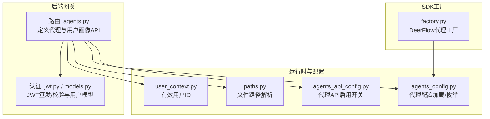
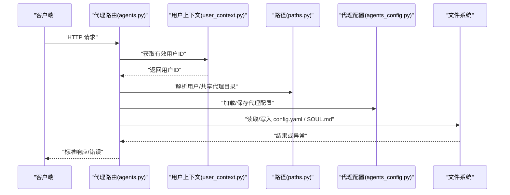
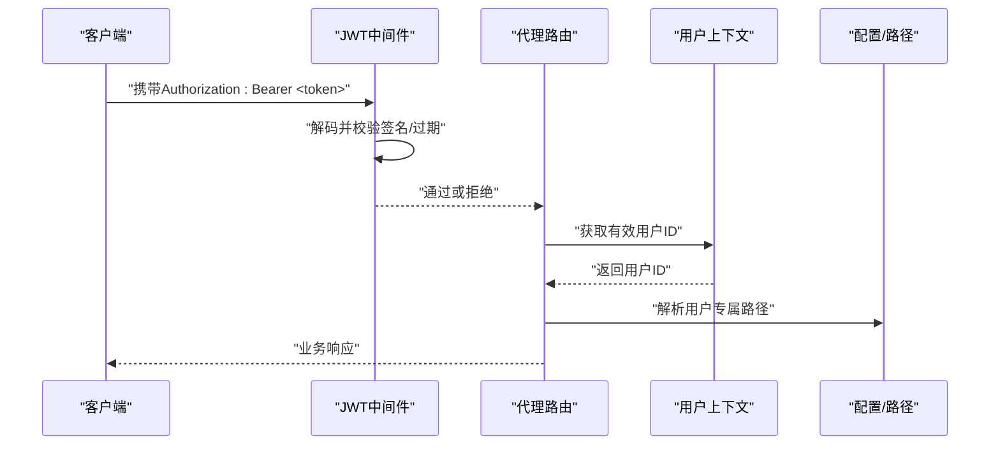
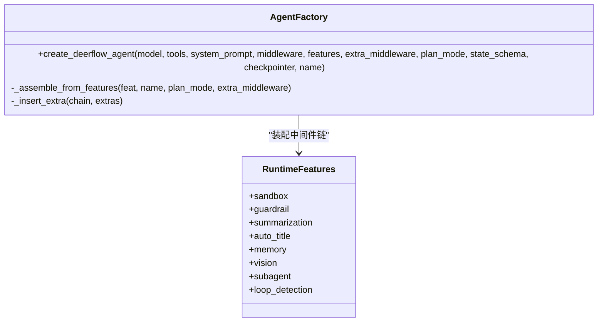
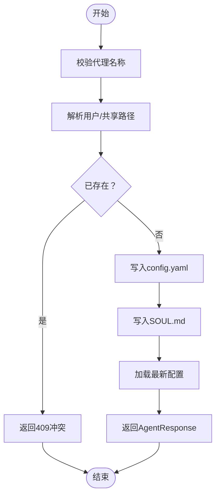
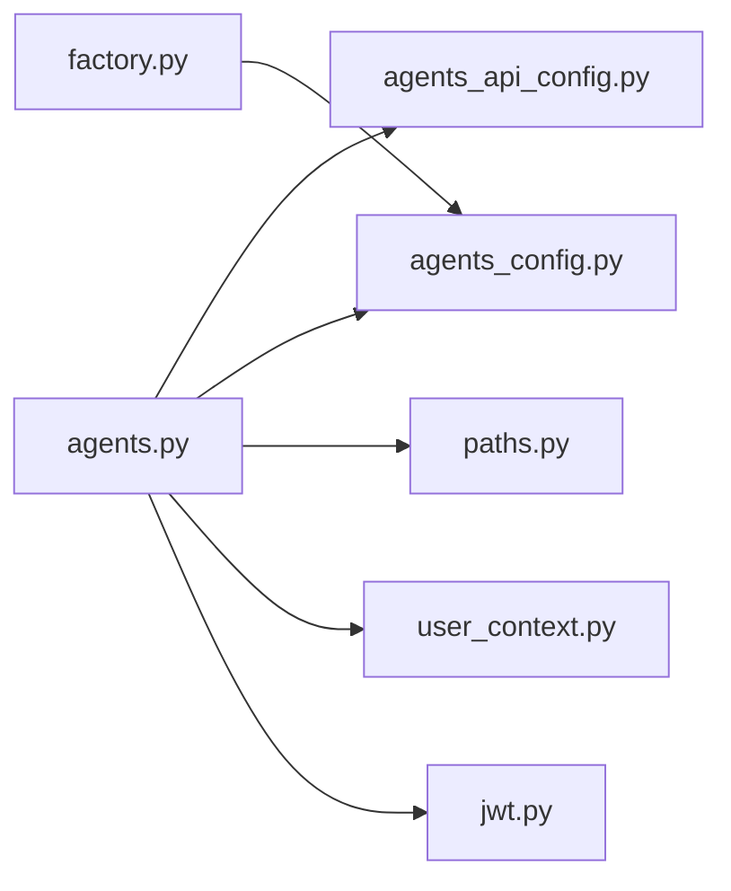

# 代理API

<cite>
**本文引用的文件**
- [agents.py](file://backend/app/gateway/routers/agents.py)
- [jwt.py](file://backend/app/gateway/auth/jwt.py)
- [models.py](file://backend/app/gateway/auth/models.py)
- [factory.py](file://backend/packages/harness/deerflow/agents/factory.py)
- [agents_api_config.py](file://backend/packages/harness/deerflow/config/agents_api_config.py)
- [agents_config.py](file://backend/packages/harness/deerflow/config/agents_config.py)
- [paths.py](file://backend/packages/harness/deerflow/config/paths.py)
- [user_context.py](file://backend/packages/harness/deerflow/runtime/user_context.py)
</cite>

## 目录
1. [简介](#简介)
2. [项目结构](#项目结构)
3. [核心组件](#核心组件)
4. [架构总览](#架构总览)
5. [详细组件分析](#详细组件分析)
6. [依赖分析](#依赖分析)
7. [性能考虑](#性能考虑)
8. [故障排查指南](#故障排查指南)
9. [结论](#结论)
10. [附录](#附录)

## 简介
本文件系统性梳理代理管理的HTTP API，覆盖代理的创建、查询、更新、删除与名称可用性检查等核心能力；明确请求/响应数据结构、认证与授权机制、代理配置参数（模型选择、工具组白名单、技能白名单、个性与行为守恒文件）、以及用户全局画像注入策略。同时给出典型调用序列图、流程图、错误码说明与客户端集成建议。

## 项目结构
代理API位于后端网关路由模块中，采用FastAPI定义REST接口，并通过配置与运行时模块实现代理持久化、命名校验、用户隔离与启用开关控制。

**图表来源**
- [agents.py:107-472](file://backend/app/gateway/routers/agents.py#L107-L472)
- [jwt.py:21-56](file://backend/app/gateway/auth/jwt.py#L21-L56)
- [models.py:15-42](file://backend/app/gateway/auth/models.py#L15-L42)
- [agents_api_config.py](file://backend/packages/harness/deerflow/config/agents_api_config.py)
- [agents_config.py](file://backend/packages/harness/deerflow/config/agents_config.py)
- [paths.py](file://backend/packages/harness/deerflow/config/paths.py)
- [user_context.py](file://backend/packages/harness/deerflow/runtime/user_context.py)
- [factory.py:61-148](file://backend/packages/harness/deerflow/agents/factory.py#L61-L148)

**章节来源**
- [agents.py:107-472](file://backend/app/gateway/routers/agents.py#L107-L472)

## 核心组件
- 代理路由与业务逻辑：提供代理列表、详情、创建、更新、删除、名称可用性检查，以及全局用户画像的读写。
- 认证与授权：基于JWT的访问令牌，支持过期与签名校验；用户上下文用于按用户隔离代理存储。
- 配置与持久化：代理配置由YAML文件与SOUL.md共同构成；路径解析区分用户级与共享级布局；支持迁移脚本以完成用户隔离。
- SDK工厂：提供纯参数化的代理工厂，用于在运行时组装代理（与API管理端点互补）。

**章节来源**
- [agents.py:107-472](file://backend/app/gateway/routers/agents.py#L107-L472)
- [jwt.py:21-56](file://backend/app/gateway/auth/jwt.py#L21-L56)
- [models.py:15-42](file://backend/app/gateway/auth/models.py#L15-L42)
- [factory.py:61-148](file://backend/packages/harness/deerflow/agents/factory.py#L61-L148)

## 架构总览
代理API的调用链路包括：客户端发起HTTP请求 → 网关路由处理 → 用户上下文解析 → 配置与路径解析 → 文件系统IO（读写代理配置与SOUL.md）→ 返回标准化响应。认证通过JWT中间件在进入路由前完成。

**图表来源**
- [agents.py:113-270](file://backend/app/gateway/routers/agents.py#L113-L270)
- [user_context.py](file://backend/packages/harness/deerflow/runtime/user_context.py)
- [paths.py](file://backend/packages/harness/deerflow/config/paths.py)
- [agents_config.py](file://backend/packages/harness/deerflow/config/agents_config.py)

## 详细组件分析

### 1) 代理管理API规范

- 基础路径
  - 前缀：/api
  - 标签：agents

- 启用开关
  - 仅当代理API启用开关开启时才允许访问代理相关端点。

- 认证与授权
  - 使用JWT访问令牌进行认证；令牌需包含用户标识、签发时间与过期时间，且与用户当前token版本一致。
  - 路由内部通过有效用户ID实现“按用户隔离”的代理存储布局。

- 数据模型
  - 代理响应体：包含名称、描述、可选模型覆盖、可选工具组白名单、可选技能白名单、可选SOUL内容。
  - 代理创建请求体：名称必填、描述可选、可选模型覆盖、可选工具组白名单、可选技能白名单、SOUL内容。
  - 代理更新请求体：各字段均为可选（空值表示不变更），其中技能白名单为特殊语义：None表示继承、空数组表示禁用全部、非空数组表示白名单。
  - 用户画像响应体：包含全局USER.md内容（不存在则为空）。
  - 用户画像更新请求体：包含新的USER.md内容。

- 端点一览
  - GET /api/agents
    - 功能：列出所有自定义代理（含SOUL内容）
    - 认证：需要有效JWT
    - 启用：agents_api.enabled=true
    - 响应：AgentsListResponse
  - GET /api/agents/check?name={name}
    - 功能：校验代理名称合法性并检查是否可用（大小写不敏感）
    - 认证：需要有效JWT
    - 启用：agents_api.enabled=true
    - 响应：{"available": true/false, "name": "<规范化名称>"}
  - GET /api/agents/{name}
    - 功能：获取指定代理详情（含SOUL内容）
    - 认证：需要有效JWT
    - 启用：agents_api.enabled=true
    - 响应：AgentResponse
  - POST /api/agents
    - 功能：创建新代理（写入config.yaml与SOUL.md）
    - 认证：需要有效JWT
    - 启用：agents_api.enabled=true
    - 请求体：AgentCreateRequest
    - 响应：AgentResponse
    - 状态码：201 Created；冲突409；校验失败422；其他500
  - PUT /api/agents/{name}
    - 功能：更新现有代理（可更新配置与/或SOUL.md）
    - 认证：需要有效JWT
    - 启用：agents_api.enabled=true
    - 请求体：AgentUpdateRequest
    - 响应：AgentResponse
    - 状态码：200 OK；未找到404；冲突409；其他500
  - DELETE /api/agents/{name}
    - 功能：删除代理（含config.yaml、SOUL.md、记忆等）
    - 认证：需要有效JWT
    - 启用：agents_api.enabled=true
    - 响应：204 No Content
    - 状态码：204 No Content；未找到404；冲突409；其他500
  - GET /api/user-profile
    - 功能：读取全局USER.md（注入到所有代理）
    - 认证：需要有效JWT
    - 启用：agents_api.enabled=true
    - 响应：UserProfileResponse
  - PUT /api/user-profile
    - 功能：创建或覆盖全局USER.md
    - 认证：需要有效JWT
    - 启用：agents_api.enabled=true
    - 请求体：UserProfileUpdateRequest
    - 响应：UserProfileResponse

- 名称与存储规则
  - 代理名称仅允许字母、数字与连字符，且必须唯一（大小写不敏感）。
  - 存储布局区分“用户级”与“共享级”。更新/删除前会检测是否存在仅共享级副本，若存在需先执行迁移脚本。

- 错误码与语义
  - 403：代理API未启用
  - 404：代理不存在
  - 409：代理已存在或仅存在共享级副本（需迁移）
  - 422：名称非法
  - 500：服务端异常（文件系统IO、解析异常等）

**章节来源**
- [agents.py:107-472](file://backend/app/gateway/routers/agents.py#L107-L472)

### 2) 认证与安全机制

- JWT令牌
  - 负载包含：sub（用户ID）、exp（过期时间）、iat（签发时间）、ver（用户token版本）
  - 签发与校验：使用对称密钥HS256算法
  - 过期处理：ExpiredSignatureError映射为特定错误类型
  - 签名无效：InvalidSignatureError映射为特定错误类型
  - 其他格式问题：MALFORMED

- 用户模型
  - 内部用户模型包含邮箱、密码哈希、系统角色、OAuth关联、生命周期标记与token版本等字段

- 授权与隔离
  - 通过有效用户ID确定用户专属代理目录，避免跨用户资源泄露
  - 删除/更新前检查是否仅存在共享级副本，防止破坏历史布局

**图表来源**
- [jwt.py:21-56](file://backend/app/gateway/auth/jwt.py#L21-L56)
- [models.py:15-42](file://backend/app/gateway/auth/models.py#L15-L42)
- [agents.py:113-189](file://backend/app/gateway/routers/agents.py#L113-L189)

**章节来源**
- [jwt.py:21-56](file://backend/app/gateway/auth/jwt.py#L21-L56)
- [models.py:15-42](file://backend/app/gateway/auth/models.py#L15-L42)
- [agents.py:113-189](file://backend/app/gateway/routers/agents.py#L113-L189)

### 3) 代理配置参数与中间件设置

- 配置参数
  - 名称：代理唯一标识（小写存储）
  - 描述：简要说明
  - 模型：可选覆盖默认模型
  - 工具组白名单：可选过滤工具来源
  - 技能白名单：特殊语义
    - None：继承父级（不改变）
    - []：禁用全部技能
    - ["a","b"]：仅允许指定技能
  - SOUL.md：代理个性与行为守恒文本

- 中间件装配（运行时）
  - 代理工厂支持三种装配方式：完全接管（传入中间件列表）、特性开关（RuntimeFeatures）、额外中间件插入（@Next/@Prev锚定）
  - 内置中间件顺序包含沙箱基础设施、工具调用清理、错误处理、总结、任务跟踪、自动标题、记忆、视觉、子代理限制、循环检测、澄清工具等
  - 特性开关与自定义中间件不可混用；额外中间件通过锚定插入，最终保证澄清中间件位于末尾

**图表来源**
- [factory.py:61-148](file://backend/packages/harness/deerflow/agents/factory.py#L61-L148)
- [factory.py:155-298](file://backend/packages/harness/deerflow/agents/factory.py#L155-L298)

**章节来源**
- [factory.py:61-148](file://backend/packages/harness/deerflow/agents/factory.py#L61-L148)
- [factory.py:155-298](file://backend/packages/harness/deerflow/agents/factory.py#L155-L298)

### 4) 生命周期与状态管理

- 创建
  - 校验名称 → 解析用户专属目录 → 写入config.yaml与SOUL.md → 加载并返回最新配置
  - 失败时回滚目录

- 更新
  - 仅允许更新用户专属副本；若仅存在共享副本，提示先迁移
  - 支持部分字段更新；技能白名单语义明确

- 删除
  - 仅允许删除用户专属副本；若仅存在共享副本，提示先迁移

- 名称可用性检查
  - 校验名称格式 → 检查用户专属与共享路径是否已占用 → 返回可用性与规范化名称

**图表来源**
- [agents.py:217-270](file://backend/app/gateway/routers/agents.py#L217-L270)

**章节来源**
- [agents.py:217-270](file://backend/app/gateway/routers/agents.py#L217-L270)

### 5) 客户端集成指南与最佳实践

- 认证
  - 在请求头中携带Authorization: Bearer <token>，确保令牌未过期且与用户token版本匹配
  - 建议在前端缓存用户ID与令牌，避免重复鉴权失败

- 名称规范
  - 使用字母、数字与连字符，避免大小写差异导致的冲突
  - 使用“/api/agents/check”预检可用性

- 配置策略
  - 初次创建时提供完整SOUL.md以明确代理个性
  - 技能白名单优先使用显式数组而非继承，便于审计
  - 模型覆盖仅在必要时使用，避免与平台默认策略冲突

- 用户画像
  - 通过“/api/user-profile”统一维护全局USER.md，确保所有代理具备一致背景信息

- 错误处理
  - 对403/404/409/422/500进行差异化处理
  - 409常见于共享布局迁移未完成，建议引导执行迁移脚本

- 性能建议
  - 批量操作时尽量合并请求，减少文件系统IO次数
  - 使用异步线程执行阻塞IO（如已内置），避免阻塞事件循环

**章节来源**
- [agents.py:107-472](file://backend/app/gateway/routers/agents.py#L107-L472)
- [jwt.py:21-56](file://backend/app/gateway/auth/jwt.py#L21-L56)

## 依赖分析

**图表来源**
- [agents.py:12-18](file://backend/app/gateway/routers/agents.py#L12-L18)
- [factory.py:13-21](file://backend/packages/harness/deerflow/agents/factory.py#L13-L21)

**章节来源**
- [agents.py:12-18](file://backend/app/gateway/routers/agents.py#L12-L18)
- [factory.py:13-21](file://backend/packages/harness/deerflow/agents/factory.py#L13-L21)

## 性能考虑
- 文件系统IO集中在创建/更新/删除阶段，采用异步线程执行以避免阻塞事件循环
- 名称检查与配置读取为轻量操作，适合在高频场景复用
- 建议在客户端侧缓存代理元数据与用户画像，降低网络往返

## 故障排查指南
- 403 代理API未启用
  - 检查agents_api.enabled配置项
- 404 代理不存在
  - 确认名称大小写与用户隔离布局
- 409 代理已存在或仅存在共享副本
  - 执行迁移脚本后再尝试更新/删除
- 422 名称非法
  - 仅允许字母、数字与连字符
- 500 服务端异常
  - 查看后端日志定位具体文件系统错误

**章节来源**
- [agents.py:82-88](file://backend/app/gateway/routers/agents.py#L82-L88)
- [agents.py:147-156](file://backend/app/gateway/routers/agents.py#L147-L156)
- [agents.py:267-268](file://backend/app/gateway/routers/agents.py#L267-L268)
- [agents.py:304-308](file://backend/app/gateway/routers/agents.py#L304-L308)
- [agents.py:463-469](file://backend/app/gateway/routers/agents.py#L463-L469)

## 结论
代理API提供了完整的自定义代理生命周期管理能力，结合JWT认证与用户隔离策略，确保安全性与一致性。通过清晰的配置参数与中间件装配机制，可在运行时灵活定制代理行为。建议在生产环境中配合迁移脚本与客户端缓存策略，提升稳定性与用户体验。

## 附录

### A. 请求/响应示例（路径参考）
- 创建代理
  - 请求：POST /api/agents
  - 请求体字段：name, description, model, tool_groups, skills, soul
  - 响应：AgentResponse
  - 参考路径：[agents.py:199-270](file://backend/app/gateway/routers/agents.py#L199-L270)
- 更新代理
  - 请求：PUT /api/agents/{name}
  - 请求体字段：description, model, tool_groups, skills, soul（均可选）
  - 响应：AgentResponse
  - 参考路径：[agents.py:279-357](file://backend/app/gateway/routers/agents.py#L279-L357)
- 删除代理
  - 请求：DELETE /api/agents/{name}
  - 响应：204 No Content
  - 参考路径：[agents.py:430-472](file://backend/app/gateway/routers/agents.py#L430-L472)
- 获取代理列表
  - 请求：GET /api/agents
  - 响应：AgentsListResponse
  - 参考路径：[agents.py:113-128](file://backend/app/gateway/routers/agents.py#L113-L128)
- 用户画像
  - 获取：GET /api/user-profile
  - 更新：PUT /api/user-profile
  - 参考路径：[agents.py:377-422](file://backend/app/gateway/routers/agents.py#L377-L422)

### B. 关键配置与路径
- 代理API启用开关：agents_api.enabled
- 代理配置加载：load_agent_config
- 路径解析：user_agent_dir / agent_dir / user_md_file
- 用户上下文：get_effective_user_id

**章节来源**
- [agents.py:12-18](file://backend/app/gateway/routers/agents.py#L12-L18)
- [agents.py:113-128](file://backend/app/gateway/routers/agents.py#L113-L128)
- [agents.py:377-422](file://backend/app/gateway/routers/agents.py#L377-L422)