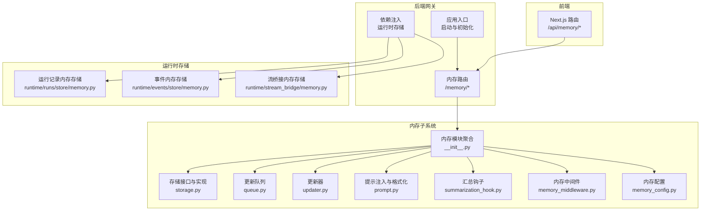
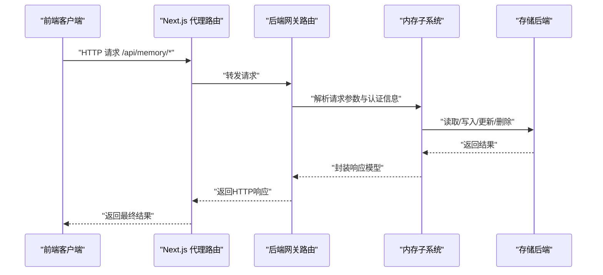
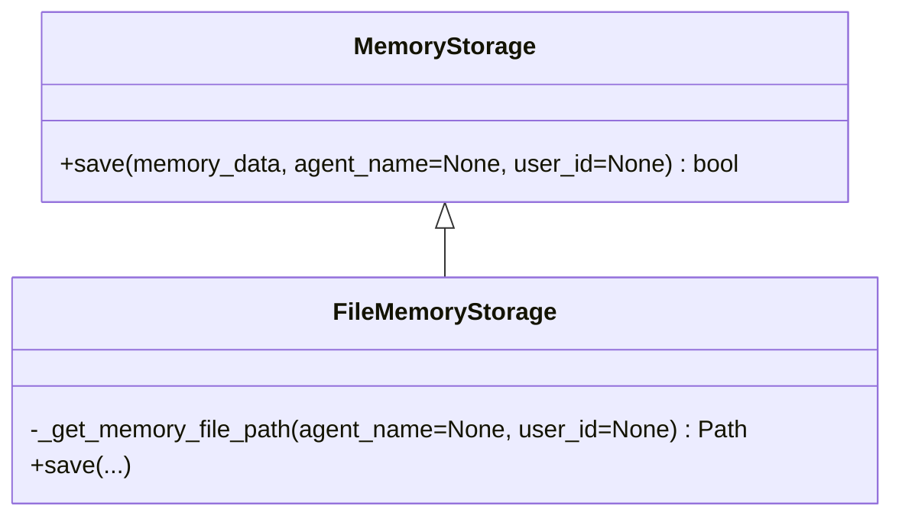
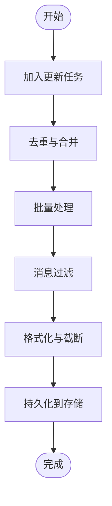
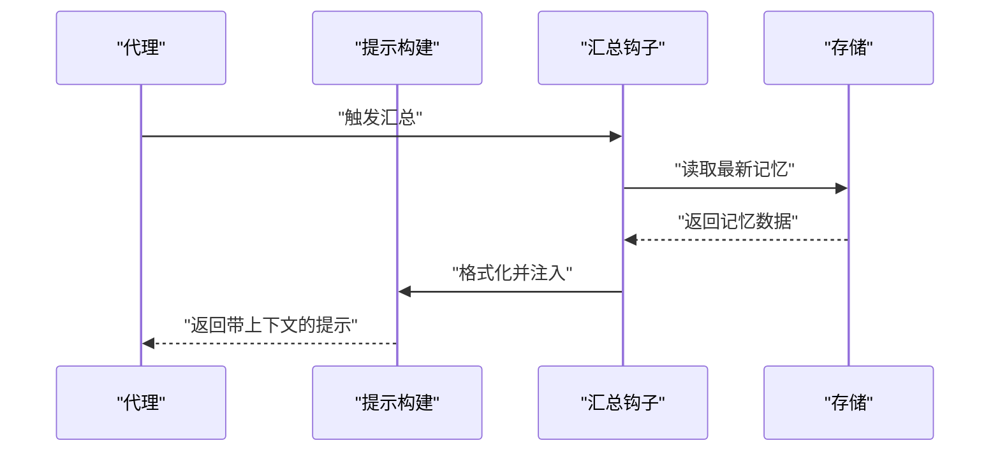
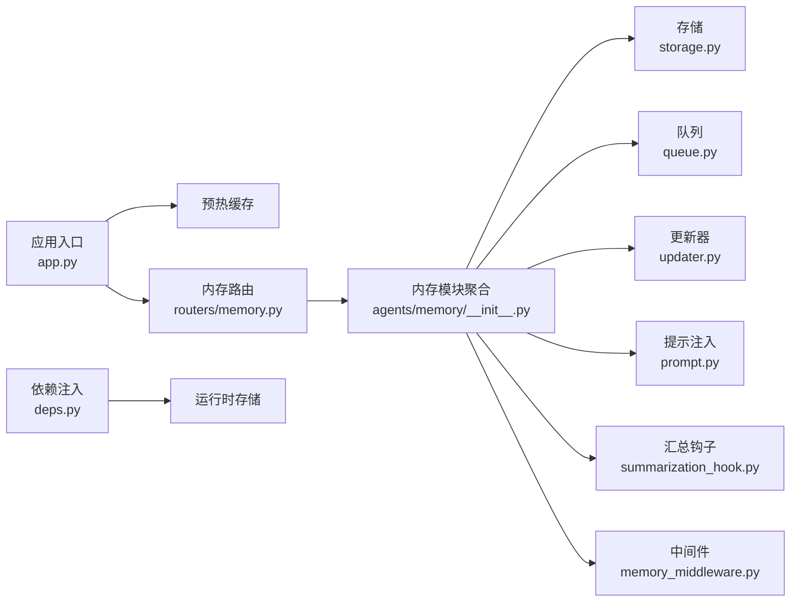

# 内存API

<cite>
**本文引用的文件**
- [backend/app/gateway/routers/memory.py](file://backend/app/gateway/routers/memory.py)
- [backend/app/gateway/app.py](file://backend/app/gateway/app.py)
- [backend/app/gateway/deps.py](file://backend/app/gateway/deps.py)
- [backend/packages/harness/deerflow/agents/memory/__init__.py](file://backend/packages/harness/deerflow/agents/memory/__init__.py)
- [backend/packages/harness/deerflow/agents/memory/prompt.py](file://backend/packages/harness/deerflow/agents/memory/prompt.py)
- [backend/packages/harness/deerflow/agents/memory/queue.py](file://backend/packages/harness/deerflow/agents/memory/queue.py)
- [backend/packages/harness/deerflow/agents/memory/storage.py](file://backend/packages/harness/deerflow/agents/memory/storage.py)
- [backend/packages/harness/deerflow/agents/memory/updater.py](file://backend/packages/harness/deerflow/agents/memory/updater.py)
- [backend/packages/harness/deerflow/agents/memory/summarization_hook.py](file://backend/packages/harness/deerflow/agents/memory/summarization_hook.py)
- [backend/packages/harness/deerflow/agents/middlewares/memory_middleware.py](file://backend/packages/harness/deerflow/agents/middlewares/memory_middleware.py)
- [backend/packages/harness/deerflow/config/memory_config.py](file://backend/packages/harness/deerflow/config/memory_config.py)
- [backend/packages/harness/deerflow/runtime/runs/store/memory.py](file://backend/packages/harness/deerflow/runtime/runs/store/memory.py)
- [backend/packages/harness/deerflow/runtime/events/store/memory.py](file://backend/packages/harness/deerflow/runtime/events/store/memory.py)
- [backend/packages/harness/deerflow/runtime/stream_bridge/memory.py](file://backend/packages/harness/deerflow/runtime/stream_bridge/memory.py)
- [frontend/src/app/api/memory/route.ts](file://frontend/src/app/api/memory/route.ts)
- [frontend/src/app/api/memory/[...path]/route.ts](file://frontend/src/app/api/memory/[...path]/route.ts)
- [backend/tests/test_memory_router.py](file://backend/tests/test_memory_router.py)
- [backend/tests/test_memory_storage.py](file://backend/tests/test_memory_storage.py)
- [backend/tests/test_memory_queue.py](file://backend/tests/test_memory_queue.py)
- [backend/tests/test_memory_storage_user_isolation.py](file://backend/tests/test_memory_storage_user_isolation.py)
- [backend/tests/test_memory_queue_user_isolation.py](file://backend/tests/test_memory_queue_user_isolation.py)
- [scripts/load_memory_sample.py](file://scripts/load_memory_sample.py)
- [backend/docs/MEMORY_IMPROVEMENTS.md](file://backend/docs/MEMORY_IMPROVEMENTS.md)
- [backend/docs/MEMORY_SETTINGS_REVIEW.md](file://backend/docs/MEMORY_SETTINGS_REVIEW.md)
- [backend/docs/SANDBOX_MEMORY_PROFILING.md](file://backend/docs/SANDBOX_MEMORY_PROFILING.md)
</cite>

## 目录
1. [简介](#简介)
2. [项目结构](#项目结构)
3. [核心组件](#核心组件)
4. [架构总览](#架构总览)
5. [详细组件分析](#详细组件分析)
6. [依赖关系分析](#依赖关系分析)
7. [性能考虑](#性能考虑)
8. [故障排查指南](#故障排查指南)
9. [结论](#结论)
10. [附录](#附录)

## 简介
本文件为 deer-flow 记忆系统的内存API提供完整的技术文档。该API支持全局内存的读取、写入、更新、删除、导出、导入与状态查询，并通过队列化处理、配置驱动、用户隔离与中间件集成实现稳定高效的运行时记忆管理。文档涵盖数据结构、访问权限、缓存策略、安全机制（用户隔离、数据持久化）、运维能力（内存优化、性能监控、容量管理）以及最佳实践与调优建议。

## 项目结构
内存API由后端网关路由、前端Next.js代理、内存子系统（存储、队列、更新器、提示注入、汇总钩子）及运行时存储组成，形成“前端请求 → 网关路由 → 内存子系统 → 存储后端”的闭环。

图表来源
- [frontend/src/app/api/memory/route.ts:1-35](file://frontend/src/app/api/memory/route.ts#L1-L35)
- [frontend/src/app/api/memory/[...path]/route.ts](file://frontend/src/app/api/memory/[...path]/route.ts#L1-L55)
- [backend/app/gateway/routers/memory.py:1-350](file://backend/app/gateway/routers/memory.py#L1-L350)
- [backend/app/gateway/app.py:180-190](file://backend/app/gateway/app.py#L180-L190)
- [backend/app/gateway/deps.py:190-200](file://backend/app/gateway/deps.py#L190-L200)
- [backend/packages/harness/deerflow/agents/memory/__init__.py:1-30](file://backend/packages/harness/deerflow/agents/memory/__init__.py#L1-L30)
- [backend/packages/harness/deerflow/agents/memory/storage.py:1-120](file://backend/packages/harness/deerflow/agents/memory/storage.py#L1-L120)
- [backend/packages/harness/deerflow/agents/memory/queue.py:1-280](file://backend/packages/harness/deerflow/agents/memory/queue.py#L1-L280)
- [backend/packages/harness/deerflow/agents/memory/updater.py:1-120](file://backend/packages/harness/deerflow/agents/memory/updater.py#L1-L120)
- [backend/packages/harness/deerflow/agents/memory/prompt.py:240-260](file://backend/packages/harness/deerflow/agents/memory/prompt.py#L240-L260)
- [backend/packages/harness/deerflow/agents/memory/summarization_hook.py:1-20](file://backend/packages/harness/deerflow/agents/memory/summarization_hook.py#L1-L20)
- [backend/packages/harness/deerflow/agents/middlewares/memory_middleware.py:1-60](file://backend/packages/harness/deerflow/agents/middlewares/memory_middleware.py#L1-L60)
- [backend/packages/harness/deerflow/config/memory_config.py:1-80](file://backend/packages/harness/deerflow/config/memory_config.py#L1-L80)
- [backend/packages/harness/deerflow/runtime/runs/store/memory.py:1-60](file://backend/packages/harness/deerflow/runtime/runs/store/memory.py#L1-L60)
- [backend/packages/harness/deerflow/runtime/events/store/memory.py:1-60](file://backend/packages/harness/deerflow/runtime/events/store/memory.py#L1-L60)
- [backend/packages/harness/deerflow/runtime/stream_bridge/memory.py:1-60](file://backend/packages/harness/deerflow/runtime/stream_bridge/memory.py#L1-L60)

章节来源
- [backend/app/gateway/routers/memory.py:1-350](file://backend/app/gateway/routers/memory.py#L1-L350)
- [frontend/src/app/api/memory/route.ts:1-35](file://frontend/src/app/api/memory/route.ts#L1-L35)
- [frontend/src/app/api/memory/[...path]/route.ts](file://frontend/src/app/api/memory/[...path]/route.ts#L1-L55)

## 核心组件
- 内存路由与端点：提供读取、刷新、清空、创建/更新/删除事实、导出/导入、获取配置与状态等REST接口。
- 内存存储：抽象存储接口与文件存储实现，支持按用户与代理维度隔离。
- 内存队列：异步更新队列，批量合并与去重，降低I/O压力。
- 更新器：协调消息过滤、格式化与持久化。
- 提示注入：将内存内容格式化注入到提示词中，控制上下文长度。
- 汇总钩子：在会话阶段触发内存刷新与压缩。
- 中间件：在运行流程中自动注入内存上下文与状态。
- 运行时存储：运行记录、事件与流桥接的内存存储实现，支撑多场景数据持久化。

章节来源
- [backend/app/gateway/routers/memory.py:50-350](file://backend/app/gateway/routers/memory.py#L50-L350)
- [backend/packages/harness/deerflow/agents/memory/storage.py:1-120](file://backend/packages/harness/deerflow/agents/memory/storage.py#L1-L120)
- [backend/packages/harness/deerflow/agents/memory/queue.py:1-280](file://backend/packages/harness/deerflow/agents/memory/queue.py#L1-L280)
- [backend/packages/harness/deerflow/agents/memory/updater.py:1-120](file://backend/packages/harness/deerflow/agents/memory/updater.py#L1-L120)
- [backend/packages/harness/deerflow/agents/memory/prompt.py:240-260](file://backend/packages/harness/deerflow/agents/memory/prompt.py#L240-L260)
- [backend/packages/harness/deerflow/agents/memory/summarization_hook.py:1-20](file://backend/packages/harness/deerflow/agents/memory/summarization_hook.py#L1-L20)
- [backend/packages/harness/deerflow/agents/middlewares/memory_middleware.py:1-60](file://backend/packages/harness/deerflow/agents/middlewares/memory_middleware.py#L1-L60)
- [backend/packages/harness/deerflow/runtime/runs/store/memory.py:1-60](file://backend/packages/harness/deerflow/runtime/runs/store/memory.py#L1-L60)
- [backend/packages/harness/deerflow/runtime/events/store/memory.py:1-60](file://backend/packages/harness/deerflow/runtime/events/store/memory.py#L1-L60)
- [backend/packages/harness/deerflow/runtime/stream_bridge/memory.py:1-60](file://backend/packages/harness/deerflow/runtime/stream_bridge/memory.py#L1-L60)

## 架构总览
内存API采用“前端代理 → 后端路由 → 内存子系统 → 存储后端”的分层设计。前端Next.js路由将请求转发至后端网关，网关路由根据路径选择对应处理函数；内存子系统负责数据格式化、队列化更新与持久化；运行时存储作为底层实现，支持不同场景的数据落盘。

图表来源
- [frontend/src/app/api/memory/route.ts:1-35](file://frontend/src/app/api/memory/route.ts#L1-L35)
- [frontend/src/app/api/memory/[...path]/route.ts](file://frontend/src/app/api/memory/[...path]/route.ts#L1-L55)
- [backend/app/gateway/routers/memory.py:110-220](file://backend/app/gateway/routers/memory.py#L110-L220)
- [backend/packages/harness/deerflow/agents/memory/storage.py:56-120](file://backend/packages/harness/deerflow/agents/memory/storage.py#L56-L120)

## 详细组件分析

### 内存路由与端点
- 读取全局内存：GET /memory，返回当前全局内存数据。
- 刷新内存：GET /memory/reload，触发内存重新加载。
- 清空内存：DELETE /memory，清空当前用户/代理的内存。
- 创建事实：POST /memory/facts，新增一条记忆事实。
- 更新事实：PATCH /memory/facts/{fact_id}，更新指定事实。
- 删除事实：DELETE /memory/facts/{fact_id}，删除指定事实。
- 导出内存：GET /memory/export，导出当前内存为JSON。
- 导入内存：POST /memory/import，从JSON导入并覆盖当前内存。
- 获取配置：GET /memory/config，返回内存系统配置。
- 获取状态：GET /memory/status，返回内存系统状态信息。

章节来源
- [backend/app/gateway/routers/memory.py:110-350](file://backend/app/gateway/routers/memory.py#L110-L350)

### 内存存储与数据结构
- 抽象存储接口：定义save方法，统一写入行为。
- 文件存储实现：基于用户ID与代理名生成唯一文件路径，确保隔离。
- 数据结构：内存以字典形式组织，键为事实标识，值为事实内容与元数据。
- 用户隔离：通过user_id与agent_name组合决定文件路径，避免跨用户访问。

图表来源
- [backend/packages/harness/deerflow/agents/memory/storage.py:42-120](file://backend/packages/harness/deerflow/agents/memory/storage.py#L42-L120)

章节来源
- [backend/packages/harness/deerflow/agents/memory/storage.py:1-120](file://backend/packages/harness/deerflow/agents/memory/storage.py#L1-L120)

### 内存队列与更新器
- 更新队列：维护待处理的记忆更新任务，支持去重与批量合并，降低频繁I/O。
- 更新器：协调消息过滤、格式化与持久化，确保写入前的数据质量。
- 队列生命周期：提供获取与重置队列的方法，便于测试与运维。

图表来源
- [backend/packages/harness/deerflow/agents/memory/queue.py:1-280](file://backend/packages/harness/deerflow/agents/memory/queue.py#L1-L280)
- [backend/packages/harness/deerflow/agents/memory/updater.py:1-120](file://backend/packages/harness/deerflow/agents/memory/updater.py#L1-L120)

章节来源
- [backend/packages/harness/deerflow/agents/memory/queue.py:1-280](file://backend/packages/harness/deerflow/agents/memory/queue.py#L1-L280)
- [backend/packages/harness/deerflow/agents/memory/updater.py:1-120](file://backend/packages/harness/deerflow/agents/memory/updater.py#L1-L120)

### 提示注入与汇总钩子
- 提示注入：将内存内容格式化为字符串并注入到提示词中，控制最大token数。
- 汇总钩子：在特定阶段触发内存刷新与压缩，保持上下文新鲜度与体积可控。

图表来源
- [backend/packages/harness/deerflow/agents/memory/prompt.py:240-260](file://backend/packages/harness/deerflow/agents/memory/prompt.py#L240-L260)
- [backend/packages/harness/deerflow/agents/memory/summarization_hook.py:1-20](file://backend/packages/harness/deerflow/agents/memory/summarization_hook.py#L1-L20)

章节来源
- [backend/packages/harness/deerflow/agents/memory/prompt.py:240-260](file://backend/packages/harness/deerflow/agents/memory/prompt.py#L240-L260)
- [backend/packages/harness/deerflow/agents/memory/summarization_hook.py:1-20](file://backend/packages/harness/deerflow/agents/memory/summarization_hook.py#L1-L20)

### 运行时存储
- 运行记录内存存储：用于保存运行过程中的中间状态。
- 事件内存存储：用于保存事件流数据。
- 流桥接内存存储：用于桥接流式输出与内存。

章节来源
- [backend/packages/harness/deerflow/runtime/runs/store/memory.py:1-60](file://backend/packages/harness/deerflow/runtime/runs/store/memory.py#L1-L60)
- [backend/packages/harness/deerflow/runtime/events/store/memory.py:1-60](file://backend/packages/harness/deerflow/runtime/events/store/memory.py#L1-L60)
- [backend/packages/harness/deerflow/runtime/stream_bridge/memory.py:1-60](file://backend/packages/harness/deerflow/runtime/stream_bridge/memory.py#L1-L60)

### 前端代理路由
- Next.js路由将 /api/memory 与 /api/memory/* 的请求转发到后端网关，保留原始头部与请求体。
- 支持GET、POST、PATCH、DELETE方法，便于与后端路由一一对应。

章节来源
- [frontend/src/app/api/memory/route.ts:1-35](file://frontend/src/app/api/memory/route.ts#L1-L35)
- [frontend/src/app/api/memory/[...path]/route.ts](file://frontend/src/app/api/memory/[...path]/route.ts#L1-L55)

## 依赖关系分析
- 网关应用初始化：在应用启动时预热tiktoken缓存，提升提示注入性能。
- 依赖注入：运行时存储通过依赖注入方式挂载到应用，确保内存API可访问。
- 内存模块聚合：__init__.py将存储、队列、更新器、提示注入、汇总钩子与中间件整合，便于统一调用。

图表来源
- [backend/app/gateway/app.py:180-190](file://backend/app/gateway/app.py#L180-L190)
- [backend/app/gateway/deps.py:190-200](file://backend/app/gateway/deps.py#L190-L200)
- [backend/app/gateway/routers/memory.py:1-120](file://backend/app/gateway/routers/memory.py#L1-L120)
- [backend/packages/harness/deerflow/agents/memory/__init__.py:1-30](file://backend/packages/harness/deerflow/agents/memory/__init__.py#L1-L30)

章节来源
- [backend/app/gateway/app.py:180-190](file://backend/app/gateway/app.py#L180-L190)
- [backend/app/gateway/deps.py:190-200](file://backend/app/gateway/deps.py#L190-L200)
- [backend/app/gateway/routers/memory.py:1-120](file://backend/app/gateway/routers/memory.py#L1-L120)
- [backend/packages/harness/deerflow/agents/memory/__init__.py:1-30](file://backend/packages/harness/deerflow/agents/memory/__init__.py#L1-L30)

## 性能考虑
- 缓存策略：应用启动时预热tiktoken缓存，减少首次提示注入开销。
- 队列化更新：通过内存队列批量处理更新，降低I/O频率与写放大。
- 上下文截断：提示注入时限制最大token数，避免上下文过长导致性能下降。
- 运行时存储：针对运行记录、事件与流桥接场景提供专用内存存储，优化数据访问模式。
- 性能剖析：提供沙箱内存剖析脚本，辅助定位内存热点与瓶颈。

章节来源
- [backend/app/gateway/app.py:180-190](file://backend/app/gateway/app.py#L180-L190)
- [backend/packages/harness/deerflow/agents/memory/queue.py:1-280](file://backend/packages/harness/deerflow/agents/memory/queue.py#L1-L280)
- [backend/packages/harness/deerflow/agents/memory/prompt.py:240-260](file://backend/packages/harness/deerflow/agents/memory/prompt.py#L240-L260)
- [backend/packages/harness/deerflow/runtime/runs/store/memory.py:1-60](file://backend/packages/harness/deerflow/runtime/runs/store/memory.py#L1-L60)
- [backend/packages/harness/deerflow/runtime/events/store/memory.py:1-60](file://backend/packages/harness/deerflow/runtime/events/store/memory.py#L1-L60)
- [backend/packages/harness/deerflow/runtime/stream_bridge/memory.py:1-60](file://backend/packages/harness/deerflow/runtime/stream_bridge/memory.py#L1-L60)
- [backend/docs/SANDBOX_MEMORY_PROFILING.md:1-200](file://backend/docs/SANDBOX_MEMORY_PROFILING.md#L1-L200)

## 故障排查指南
- 导入失败：当导入内存数据出现OS错误时，返回500错误，需检查目标路径权限与磁盘空间。
- 用户隔离问题：若发现跨用户数据泄露，请检查用户ID与代理名组合是否正确，确认文件路径生成逻辑。
- 队列异常：如遇更新堆积或丢失，检查队列重置与批量处理逻辑。
- 前端代理：若代理请求失败，检查后端基础URL配置与网络连通性。

章节来源
- [backend/app/gateway/routers/memory.py:280-290](file://backend/app/gateway/routers/memory.py#L280-L290)
- [backend/tests/test_memory_storage_user_isolation.py:1-200](file://backend/tests/test_memory_storage_user_isolation.py#L1-L200)
- [backend/tests/test_memory_queue_user_isolation.py:1-200](file://backend/tests/test_memory_queue_user_isolation.py#L1-L200)
- [backend/tests/test_memory_queue.py:1-200](file://backend/tests/test_memory_queue.py#L1-L200)
- [frontend/src/app/api/memory/route.ts:1-35](file://frontend/src/app/api/memory/route.ts#L1-L35)

## 结论
内存API通过清晰的分层设计与模块化实现，提供了稳定、可扩展的记忆管理能力。结合队列化更新、提示注入截断、用户隔离与运行时存储，能够在保证安全性的同时满足高并发与高性能需求。建议在生产环境中配合容量规划、性能剖析与定期备份导入演练，持续优化内存策略与资源配置。

## 附录

### API规范摘要
- 读取全局内存：GET /memory
- 刷新内存：GET /memory/reload
- 清空内存：DELETE /memory
- 创建事实：POST /memory/facts
- 更新事实：PATCH /memory/facts/{fact_id}
- 删除事实：DELETE /memory/facts/{fact_id}
- 导出内存：GET /memory/export
- 导入内存：POST /memory/import
- 获取配置：GET /memory/config
- 获取状态：GET /memory/status

章节来源
- [backend/app/gateway/routers/memory.py:110-350](file://backend/app/gateway/routers/memory.py#L110-L350)

### 安全机制
- 用户隔离：通过user_id与agent_name组合生成唯一文件路径，避免跨用户访问。
- 数据持久化：文件存储实现确保数据可恢复与可审计。
- 访问控制：前端代理与后端路由均遵循标准认证与授权流程。

章节来源
- [backend/packages/harness/deerflow/agents/memory/storage.py:80-120](file://backend/packages/harness/deerflow/agents/memory/storage.py#L80-L120)
- [backend/tests/test_memory_storage_user_isolation.py:1-200](file://backend/tests/test_memory_storage_user_isolation.py#L1-L200)
- [backend/tests/test_memory_queue_user_isolation.py:1-200](file://backend/tests/test_memory_queue_user_isolation.py#L1-L200)

### 运维与容量管理
- 备份与恢复：支持导出/导入内存，便于迁移与灾难恢复。
- 内存优化：通过队列化与提示截断控制内存占用。
- 性能监控：提供沙箱内存剖析脚本，辅助定位性能问题。

章节来源
- [backend/app/gateway/routers/memory.py:260-300](file://backend/app/gateway/routers/memory.py#L260-L300)
- [backend/docs/MEMORY_IMPROVEMENTS.md:1-200](file://backend/docs/MEMORY_IMPROVEMENTS.md#L1-L200)
- [backend/docs/MEMORY_SETTINGS_REVIEW.md:1-200](file://backend/docs/MEMORY_SETTINGS_REVIEW.md#L1-L200)
- [scripts/load_memory_sample.py:1-200](file://scripts/load_memory_sample.py#L1-L200)

### 最佳实践
- 使用队列化更新处理高频写入，避免阻塞主线程。
- 在提示注入前对上下文进行截断与去重，确保上下文质量。
- 定期执行内存导出与导入演练，验证备份有效性。
- 结合性能剖析脚本识别热点，调整队列批量大小与提示长度阈值。

章节来源
- [backend/packages/harness/deerflow/agents/memory/queue.py:1-280](file://backend/packages/harness/deerflow/agents/memory/queue.py#L1-L280)
- [backend/packages/harness/deerflow/agents/memory/prompt.py:240-260](file://backend/packages/harness/deerflow/agents/memory/prompt.py#L240-L260)
- [backend/docs/SANDBOX_MEMORY_PROFILING.md:1-200](file://backend/docs/SANDBOX_MEMORY_PROFILING.md#L1-L200)