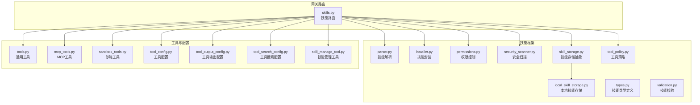
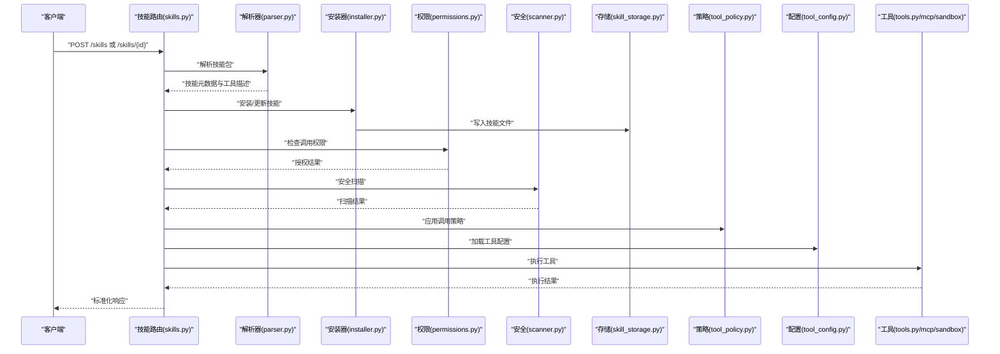
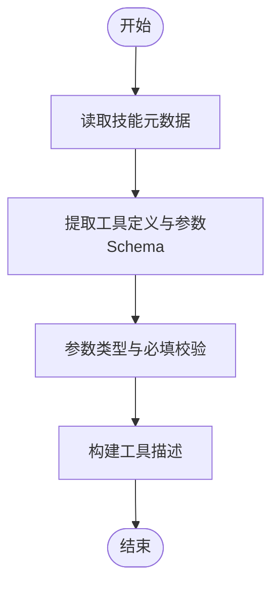
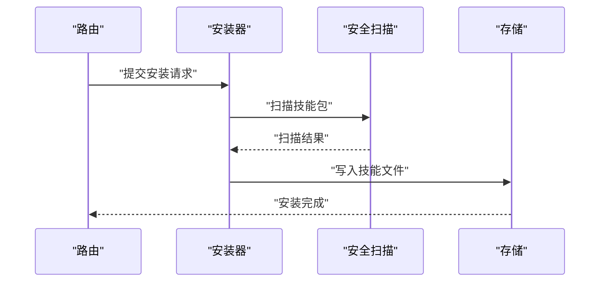
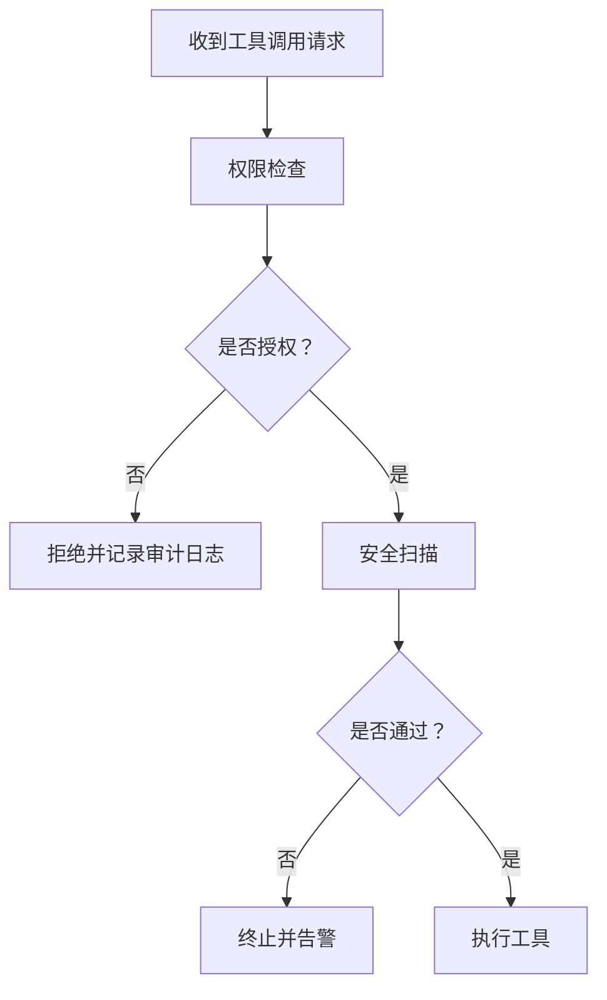
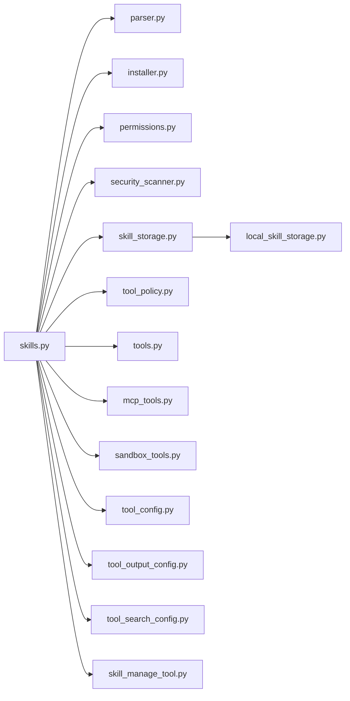

# 工具API

<cite>
**本文引用的文件**
- [skills.py](file://backend/app/gateway/routers/skills.py)
- [skills_config.py](file://backend/packages/harness/deerflow/config/skills_config.py)
- [installer.py](file://backend/packages/harness/deerflow/skills/installer.py)
- [parser.py](file://backend/packages/harness/deerflow/skills/parser.py)
- [permissions.py](file://backend/packages/harness/deerflow/skills/permissions.py)
- [security_scanner.py](file://backend/packages/harness/deerflow/skills/security_scanner.py)
- [slash.py](file://backend/packages/harness/deerflow/skills/slash.py)
- [skill_storage.py](file://backend/packages/harness/deerflow/skills/storage/skill_storage.py)
- [local_skill_storage.py](file://backend/packages/harness/deerflow/skills/storage/local_skill_storage.py)
- [tool_policy.py](file://backend/packages/harness/deerflow/skills/tool_policy.py)
- [types.py](file://backend/packages/harness/deerflow/skills/types.py)
- [validation.py](file://backend/packages/harness/deerflow/skills/validation.py)
- [tools.py](file://backend/packages/harness/deerflow/tools/tools.py)
- [mcp_tools.py](file://backend/packages/harness/deerflow/mcp/tools.py)
- [sandbox_tools.py](file://backend/packages/harness/deerflow/sandbox/tools.py)
- [tool_config.py](file://backend/packages/harness/deerflow/config/tool_config.py)
- [tool_output_config.py](file://backend/packages/harness/deerflow/config/tool_output_config.py)
- [tool_search_config.py](file://backend/packages/harness/deerflow/config/tool_search_config.py)
- [skill_manage_tool.py](file://backend/packages/harness/deerflow/tools/skill_manage_tool.py)
- [task_tool_core_logic.py](file://backend/packages/harness/deerflow/tools/task_tool.py)
- [task_tool_usage_recorder.py](file://backend/packages/harness/deerflow/tools/task_tool_usage_recorder.py)
- [guardrails_middleware.py](file://backend/packages/harness/deerflow/guardrails/middleware.py)
- [builtin_guardrails.py](file://backend/packages/harness/deerflow/guardrails/builtin.py)
- [test_skills_install.py](file://backend/tests/test_skills_installer.py)
- [test_skills_validation.py](file://backend/tests/test_skills_validation.py)
- [test_skills_parser.py](file://backend/tests/test_skills_parser.py)
- [test_skills_custom_router.py](file://backend/tests/test_skills_custom_router.py)
- [test_skill_permissions.py](file://backend/tests/test_skill_permissions.py)
- [test_skill_manage_tool.py](file://backend/tests/test_skill_manage_tool.py)
- [test_security_scanner.py](file://backend/tests/test_security_scanner.py)
- [test_task_tool_usage_recorder.py](file://backend/tests/test_task_tool_usage_recorder.py)
</cite>

## 目录
1. [简介](#简介)
2. [项目结构](#项目结构)
3. [核心组件](#核心组件)
4. [架构总览](#架构总览)
5. [详细组件分析](#详细组件分析)
6. [依赖关系分析](#依赖关系分析)
7. [性能考虑](#性能考虑)
8. [故障排除指南](#故障排除指南)
9. [结论](#结论)
10. [附录](#附录)

## 简介
本文件面向技能与工具管理的API规范，覆盖工具注册、调用、配置、权限管理、安全扫描、使用统计等能力。系统支持内置工具与自定义工具的统一管理，提供标准化的接口定义、参数校验、返回值格式与错误处理规范。同时给出工具开发指南、集成示例与调试方法。

## 项目结构
工具API相关代码主要分布在后端网关路由、技能框架与工具配置模块中：
- 网关路由：提供技能与工具的HTTP接口入口
- 技能框架：负责技能解析、安装、权限、安全扫描与存储
- 工具配置：定义工具行为、输出限制与搜索策略
- 内置工具与MCP/Sandbox工具：通过统一的工具类型与策略进行管理

**图表来源**
- [skills.py](file://backend/app/gateway/routers/skills.py)
- [parser.py](file://backend/packages/harness/deerflow/skills/parser.py)
- [installer.py](file://backend/packages/harness/deerflow/skills/installer.py)
- [permissions.py](file://backend/packages/harness/deerflow/skills/permissions.py)
- [security_scanner.py](file://backend/packages/harness/deerflow/skills/security_scanner.py)
- [skill_storage.py](file://backend/packages/harness/deerflow/skills/storage/skill_storage.py)
- [local_skill_storage.py](file://backend/packages/harness/deerflow/skills/storage/local_skill_storage.py)
- [tool_policy.py](file://backend/packages/harness/deerflow/skills/tool_policy.py)
- [types.py](file://backend/packages/harness/deerflow/skills/types.py)
- [validation.py](file://backend/packages/harness/deerflow/skills/validation.py)
- [tools.py](file://backend/packages/harness/deerflow/tools/tools.py)
- [mcp_tools.py](file://backend/packages/harness/deerflow/mcp/tools.py)
- [sandbox_tools.py](file://backend/packages/harness/deerflow/sandbox/tools.py)
- [tool_config.py](file://backend/packages/harness/deerflow/config/tool_config.py)
- [tool_output_config.py](file://backend/packages/harness/deerflow/config/tool_output_config.py)
- [tool_search_config.py](file://backend/packages/harness/deerflow/config/tool_search_config.py)
- [skill_manage_tool.py](file://backend/packages/harness/deerflow/tools/skill_manage_tool.py)

**章节来源**
- [skills.py](file://backend/app/gateway/routers/skills.py)
- [skills_config.py](file://backend/packages/harness/deerflow/config/skills_config.py)

## 核心组件
- 技能路由（skills.py）：提供技能注册、查询、更新、删除等REST接口；对接技能解析器、安装器、权限与安全扫描模块。
- 技能解析器（parser.py）：从技能包中提取元数据、参数Schema与执行脚本，生成可调用的工具描述。
- 技能安装器（installer.py）：负责技能包的下载、解压、校验与部署到存储后端。
- 权限控制（permissions.py）：基于角色与资源定义工具访问策略，支持细粒度授权。
- 安全扫描（security_scanner.py）：对技能与工具进行静态与运行时安全检查，阻断高风险操作。
- 技能存储（skill_storage.py、local_skill_storage.py）：抽象技能存储接口与本地实现，支持多后端扩展。
- 工具策略（tool_policy.py）：定义工具调用策略、超时、重试与熔断规则。
- 工具配置（tool_config.py、tool_output_config.py、tool_search_config.py）：统一管理工具行为、输出长度与搜索策略。
- 技能管理工具（skill_manage_tool.py）：提供技能生命周期管理的内部工具接口。
- 通用工具（tools.py）、MCP工具（mcp_tools.py）、沙箱工具（sandbox_tools.py）：三类工具的统一抽象与实现。

**章节来源**
- [skills.py](file://backend/app/gateway/routers/skills.py)
- [parser.py](file://backend/packages/harness/deerflow/skills/parser.py)
- [installer.py](file://backend/packages/harness/deerflow/skills/installer.py)
- [permissions.py](file://backend/packages/harness/deerflow/skills/permissions.py)
- [security_scanner.py](file://backend/packages/harness/deerflow/skills/security_scanner.py)
- [skill_storage.py](file://backend/packages/harness/deerflow/skills/storage/skill_storage.py)
- [local_skill_storage.py](file://backend/packages/harness/deerflow/skills/storage/local_skill_storage.py)
- [tool_policy.py](file://backend/packages/harness/deerflow/skills/tool_policy.py)
- [tool_config.py](file://backend/packages/harness/deerflow/config/tool_config.py)
- [tool_output_config.py](file://backend/packages/harness/deerflow/config/tool_output_config.py)
- [tool_search_config.py](file://backend/packages/harness/deerflow/config/tool_search_config.py)
- [skill_manage_tool.py](file://backend/packages/harness/deerflow/tools/skill_manage_tool.py)
- [tools.py](file://backend/packages/harness/deerflow/tools/tools.py)
- [mcp_tools.py](file://backend/packages/harness/deerflow/mcp/tools.py)
- [sandbox_tools.py](file://backend/packages/harness/deerflow/sandbox/tools.py)

## 架构总览
工具API采用“网关路由 + 技能框架 + 工具配置”的分层设计。技能通过解析器生成工具描述，经权限与安全检查后进入工具策略与配置层，最终由通用工具、MCP或沙箱工具执行。

**图表来源**
- [skills.py](file://backend/app/gateway/routers/skills.py)
- [parser.py](file://backend/packages/harness/deerflow/skills/parser.py)
- [installer.py](file://backend/packages/harness/deerflow/skills/installer.py)
- [permissions.py](file://backend/packages/harness/deerflow/skills/permissions.py)
- [security_scanner.py](file://backend/packages/harness/deerflow/skills/security_scanner.py)
- [skill_storage.py](file://backend/packages/harness/deerflow/skills/storage/skill_storage.py)
- [tool_policy.py](file://backend/packages/harness/deerflow/skills/tool_policy.py)
- [tool_config.py](file://backend/packages/harness/deerflow/config/tool_config.py)
- [tools.py](file://backend/packages/harness/deerflow/tools/tools.py)
- [mcp_tools.py](file://backend/packages/harness/deerflow/mcp/tools.py)
- [sandbox_tools.py](file://backend/packages/harness/deerflow/sandbox/tools.py)

## 详细组件分析

### 技能路由与API规范
- 路由职责：提供技能的增删改查、启用/禁用、版本管理、批量导入导出等接口。
- 请求参数：遵循OpenAPI Schema，支持分页、过滤与排序。
- 返回值：统一JSON格式，包含状态码、消息与数据体；错误时返回标准错误对象。
- 错误处理：按HTTP状态码映射业务错误，如400、401、403、404、422、500等。
- 认证与授权：通过中间件注入用户上下文，结合权限模块进行资源级授权。

**章节来源**
- [skills.py](file://backend/app/gateway/routers/skills.py)

### 技能解析与校验
- 解析流程：读取技能包元数据（名称、版本、作者、描述、依赖），提取工具定义与参数Schema。
- 参数校验：基于Pydantic模型校验输入参数类型与必填项；支持默认值与枚举约束。
- 兼容性：支持多种技能包格式（ZIP、TAR.GZ等），自动识别入口文件与脚本语言。

**图表来源**
- [parser.py](file://backend/packages/harness/deerflow/skills/parser.py)
- [validation.py](file://backend/packages/harness/deerflow/skills/validation.py)

**章节来源**
- [parser.py](file://backend/packages/harness/deerflow/skills/parser.py)
- [validation.py](file://backend/packages/harness/deerflow/skills/validation.py)

### 技能安装与存储
- 安装流程：下载/上传技能包 → 校验签名与哈希 → 解压到临时目录 → 安全扫描 → 写入持久化存储 → 清理临时文件。
- 存储抽象：通过skill_storage接口定义统一的读写、列表、删除等操作；本地实现支持文件系统与数据库后端。
- 多版本：同一技能允许多版本共存，支持回滚与切换。

**图表来源**
- [installer.py](file://backend/packages/harness/deerflow/skills/installer.py)
- [security_scanner.py](file://backend/packages/harness/deerflow/skills/security_scanner.py)
- [skill_storage.py](file://backend/packages/harness/deerflow/skills/storage/skill_storage.py)
- [local_skill_storage.py](file://backend/packages/harness/deerflow/skills/storage/local_skill_storage.py)

**章节来源**
- [installer.py](file://backend/packages/harness/deerflow/skills/installer.py)
- [security_scanner.py](file://backend/packages/harness/deerflow/skills/security_scanner.py)
- [skill_storage.py](file://backend/packages/harness/deerflow/skills/storage/skill_storage.py)
- [local_skill_storage.py](file://backend/packages/harness/deerflow/skills/storage/local_skill_storage.py)

### 权限管理与安全扫描
- 权限模型：基于角色（Role）与资源（Resource）的RBAC模型，支持按技能、工具、参数维度授权。
- 授权决策：在工具调用前进行权限检查，拒绝无权访问的请求。
- 安全扫描：静态扫描（语法/语义检查）与运行时扫描（进程、网络、文件系统访问监控），阻断高危操作。

**图表来源**
- [permissions.py](file://backend/packages/harness/deerflow/skills/permissions.py)
- [security_scanner.py](file://backend/packages/harness/deerflow/skills/security_scanner.py)

**章节来源**
- [permissions.py](file://backend/packages/harness/deerflow/skills/permissions.py)
- [security_scanner.py](file://backend/packages/harness/deerflow/skills/security_scanner.py)

### 工具配置与策略
- 工具配置：统一管理工具超时、并发、重试、熔断等行为；支持按技能/工具级别覆盖。
- 输出配置：限制工具输出大小与格式，防止内存与带宽滥用。
- 搜索配置：针对检索类工具设置分页、排序与过滤策略。
- 策略应用：在工具执行前合并全局配置与技能特定配置，形成最终执行参数。

**章节来源**
- [tool_config.py](file://backend/packages/harness/deerflow/config/tool_config.py)
- [tool_output_config.py](file://backend/packages/harness/deerflow/config/tool_output_config.py)
- [tool_search_config.py](file://backend/packages/harness/deerflow/config/tool_search_config.py)
- [tool_policy.py](file://backend/packages/harness/deerflow/skills/tool_policy.py)

### 内置工具与MCP/沙箱工具
- 通用工具：封装常见I/O、文件操作、网络请求等基础能力。
- MCP工具：通过MCP协议动态发现与调用远程工具服务器。
- 沙箱工具：在受限环境中执行高风险脚本与命令，提供隔离与审计。
- 统一抽象：所有工具均实现相同的接口契约，便于替换与扩展。

**章节来源**
- [tools.py](file://backend/packages/harness/deerflow/tools/tools.py)
- [mcp_tools.py](file://backend/packages/harness/deerflow/mcp/tools.py)
- [sandbox_tools.py](file://backend/packages/harness/deerflow/sandbox/tools.py)

### 技能管理工具与使用统计
- 技能管理工具：提供技能注册、更新、删除、启用/禁用等内部接口，供系统运维与自动化流程使用。
- 使用统计：记录工具调用次数、耗时、错误率与用户分布，支持仪表盘展示与告警。

**章节来源**
- [skill_manage_tool.py](file://backend/packages/harness/deerflow/tools/skill_manage_tool.py)
- [task_tool_usage_recorder.py](file://backend/packages/harness/deerflow/tools/task_tool_usage_recorder.py)

### 工具开发指南
- 创建技能包：编写元数据文件与工具脚本，确保参数Schema完整且类型正确。
- 单元测试：参考测试用例，覆盖安装、解析、权限与安全扫描等关键路径。
- 集成示例：通过技能路由提供的接口完成技能的注册与调用。
- 调试方法：开启详细日志，使用测试工具模拟请求，逐步定位问题。

**章节来源**
- [test_skills_install.py](file://backend/tests/test_skills_installer.py)
- [test_skills_validation.py](file://backend/tests/test_skills_validation.py)
- [test_skills_parser.py](file://backend/tests/test_skills_parser.py)
- [test_skills_custom_router.py](file://backend/tests/test_skills_custom_router.py)
- [test_skill_permissions.py](file://backend/tests/test_skill_permissions.py)
- [test_skill_manage_tool.py](file://backend/tests/test_skill_manage_tool.py)
- [test_security_scanner.py](file://backend/tests/test_security_scanner.py)
- [test_task_tool_usage_recorder.py](file://backend/tests/test_task_tool_usage_recorder.py)

## 依赖关系分析
工具API各模块之间存在清晰的依赖关系：路由依赖解析器、安装器、权限与安全扫描；存储抽象被安装器与路由共同依赖；工具层依赖配置与策略；测试用例覆盖关键路径。

**图表来源**
- [skills.py](file://backend/app/gateway/routers/skills.py)
- [parser.py](file://backend/packages/harness/deerflow/skills/parser.py)
- [installer.py](file://backend/packages/harness/deerflow/skills/installer.py)
- [permissions.py](file://backend/packages/harness/deerflow/skills/permissions.py)
- [security_scanner.py](file://backend/packages/harness/deerflow/skills/security_scanner.py)
- [skill_storage.py](file://backend/packages/harness/deerflow/skills/storage/skill_storage.py)
- [local_skill_storage.py](file://backend/packages/harness/deerflow/skills/storage/local_skill_storage.py)
- [tool_policy.py](file://backend/packages/harness/deerflow/skills/tool_policy.py)
- [tools.py](file://backend/packages/harness/deerflow/tools/tools.py)
- [mcp_tools.py](file://backend/packages/harness/deerflow/mcp/tools.py)
- [sandbox_tools.py](file://backend/packages/harness/deerflow/sandbox/tools.py)
- [tool_config.py](file://backend/packages/harness/deerflow/config/tool_config.py)
- [tool_output_config.py](file://backend/packages/harness/deerflow/config/tool_output_config.py)
- [tool_search_config.py](file://backend/packages/harness/deerflow/config/tool_search_config.py)
- [skill_manage_tool.py](file://backend/packages/harness/deerflow/tools/skill_manage_tool.py)

**章节来源**
- [skills.py](file://backend/app/gateway/routers/skills.py)
- [parser.py](file://backend/packages/harness/deerflow/skills/parser.py)
- [installer.py](file://backend/packages/harness/deerflow/skills/installer.py)
- [permissions.py](file://backend/packages/harness/deerflow/skills/permissions.py)
- [security_scanner.py](file://backend/packages/harness/deerflow/skills/security_scanner.py)
- [skill_storage.py](file://backend/packages/harness/deerflow/skills/storage/skill_storage.py)
- [local_skill_storage.py](file://backend/packages/harness/deerflow/skills/storage/local_skill_storage.py)
- [tool_policy.py](file://backend/packages/harness/deerflow/skills/tool_policy.py)
- [tools.py](file://backend/packages/harness/deerflow/tools/tools.py)
- [mcp_tools.py](file://backend/packages/harness/deerflow/mcp/tools.py)
- [sandbox_tools.py](file://backend/packages/harness/deerflow/sandbox/tools.py)
- [tool_config.py](file://backend/packages/harness/deerflow/config/tool_config.py)
- [tool_output_config.py](file://backend/packages/harness/deerflow/config/tool_output_config.py)
- [tool_search_config.py](file://backend/packages/harness/deerflow/config/tool_search_config.py)
- [skill_manage_tool.py](file://backend/packages/harness/deerflow/tools/skill_manage_tool.py)

## 性能考虑
- 并发与限流：通过工具策略与配置限制并发数与超时时间，避免资源争用。
- 缓存与预热：对常用技能与工具进行缓存，减少重复解析与初始化开销。
- 输出裁剪：严格控制工具输出大小，避免内存溢出与网络拥塞。
- 监控与告警：建立调用耗时、错误率与资源使用指标，及时发现性能瓶颈。

## 故障排除指南
- 安装失败：检查技能包完整性、签名与哈希；查看安装器日志与存储写入状态。
- 权限拒绝：确认用户角色与资源授权；核对权限策略配置。
- 安全拦截：审查安全扫描报告，修改高危操作或调整策略。
- 工具异常：启用详细日志，复现请求并定位具体工具实现；检查工具配置与策略。
- 使用统计异常：核对使用记录埋点与聚合逻辑，确保计数一致性。

**章节来源**
- [test_skills_install.py](file://backend/tests/test_skills_installer.py)
- [test_skills_validation.py](file://backend/tests/test_skills_validation.py)
- [test_skills_parser.py](file://backend/tests/test_skills_parser.py)
- [test_skills_custom_router.py](file://backend/tests/test_skills_custom_router.py)
- [test_skill_permissions.py](file://backend/tests/test_skill_permissions.py)
- [test_skill_manage_tool.py](file://backend/tests/test_skill_manage_tool.py)
- [test_security_scanner.py](file://backend/tests/test_security_scanner.py)
- [test_task_tool_usage_recorder.py](file://backend/tests/test_task_tool_usage_recorder.py)

## 结论
该工具API体系以技能为中心，通过解析、安装、权限与安全扫描实现对内置与自定义工具的统一管理。配合完善的配置与策略机制，能够满足生产环境对安全性、稳定性与可观测性的要求。建议在实际部署中结合监控与告警体系，持续优化工具性能与用户体验。

## 附录
- 标准化响应格式：包含状态码、消息与数据体；错误时返回统一错误对象。
- 参数验证：基于Schema的类型检查与必填校验；支持默认值与枚举约束。
- 权限控制：RBAC模型，支持按技能、工具、参数维度授权。
- 安全扫描：静态与运行时扫描，阻断高危操作。
- 使用统计：记录调用次数、耗时、错误率与用户分布。