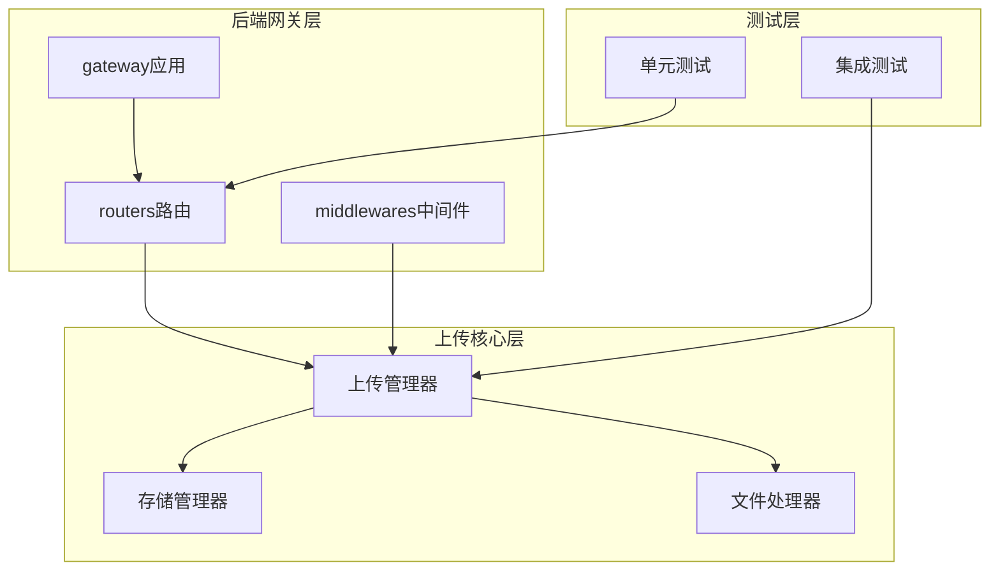
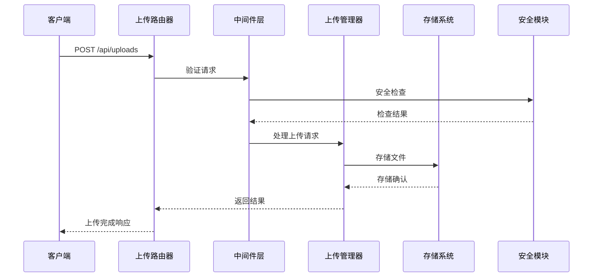
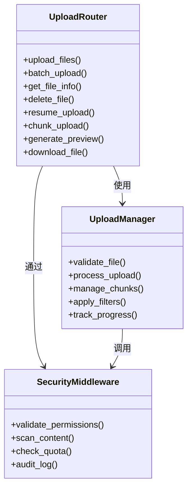
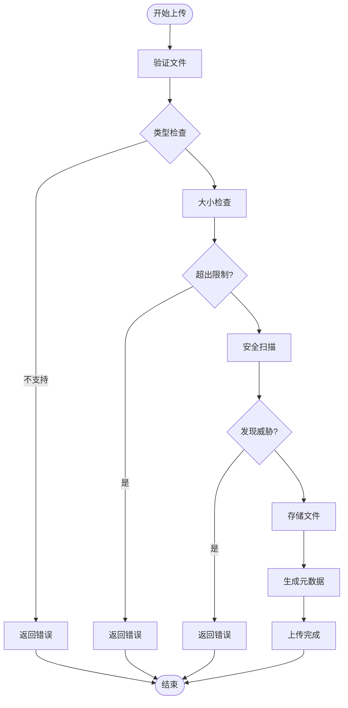
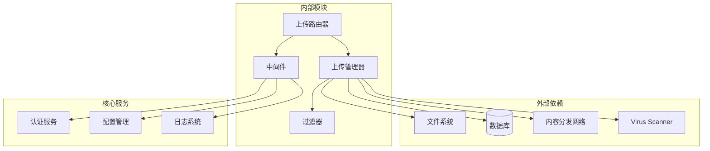
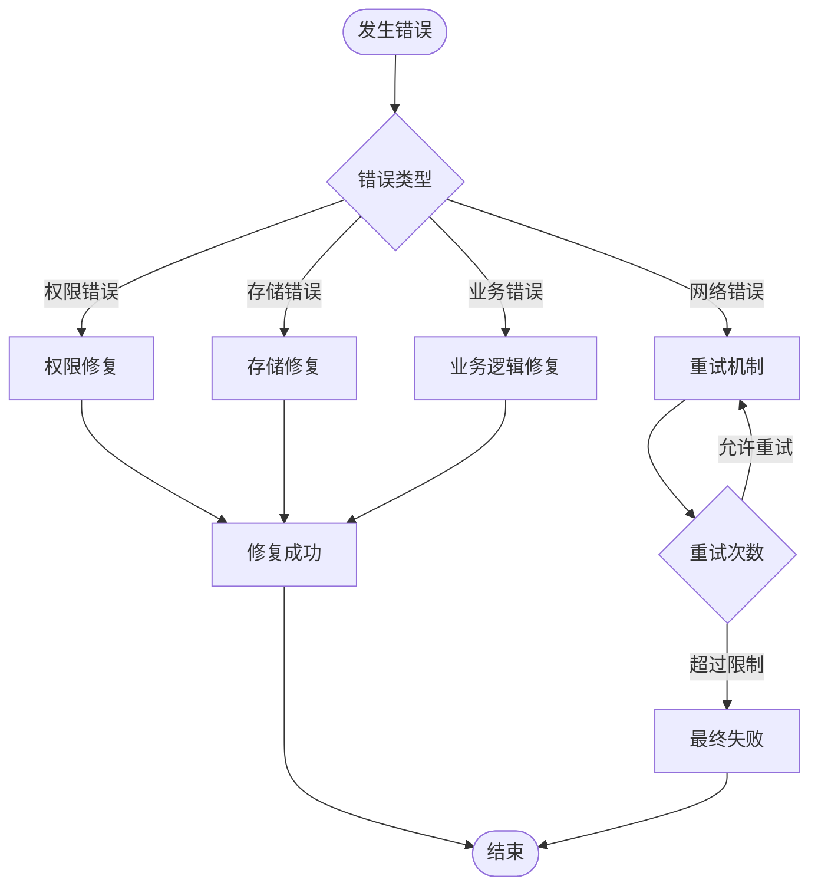

# 文件上传API

<cite>
**本文档引用的文件**
- [uploads.py](file://backend/app/gateway/routers/uploads.py)
- [manager.py](file://backend/packages/harness/deerflow/uploads/manager.py)
- [uploads_middleware.py](file://backend/packages/harness/deerflow/agents/middlewares/uploads_middleware.py)
- [app.py](file://backend/app/gateway/app.py)
- [FILE_UPLOAD.md](file://backend/docs/FILE_UPLOAD.md)
- [test_uploads_router.py](file://backend/tests/test_uploads_router.py)
- [test_uploads_manager.py](file://backend/tests/test_uploads_manager.py)
- [test_uploads_middleware_core_logic.py](file://backend/tests/test_uploads_middleware_core_logic.py)
- [test_memory_upload_filtering.py](file://backend/tests/test_memory_upload_filtering.py)
</cite>

## 目录
1. [简介](#简介)
2. [项目结构](#项目结构)
3. [核心组件](#核心组件)
4. [架构概览](#架构概览)
5. [详细组件分析](#详细组件分析)
6. [依赖关系分析](#依赖关系分析)
7. [性能考虑](#性能考虑)
8. [故障排除指南](#故障排除指南)
9. [结论](#结论)

## 简介

文件上传API是deer-flow平台的核心功能模块，负责处理文件的上传、管理、存储和访问。该系统提供了完整的文件生命周期管理能力，包括基础上传、批量操作、断点续传、进度跟踪等高级功能。

系统采用分层架构设计，结合中间件机制实现安全控制、权限验证和数据过滤。通过统一的上传管理器协调各种存储后端，确保文件在不同环境间的可移植性和一致性。

## 项目结构

文件上传功能分布在以下关键位置：

**图表来源**
- [app.py:369](file://backend/app/gateway/app.py#L369)
- [uploads.py:214](file://backend/app/gateway/routers/uploads.py#L214)

**章节来源**
- [app.py:369](file://backend/app/gateway/app.py#L369)
- [uploads.py:214](file://backend/app/gateway/routers/uploads.py#L214)

## 核心组件

### 上传路由器 (Uploads Router)

上传路由器提供RESTful API接口，支持多种文件操作模式：

- **基础上传**: 单文件上传和多文件批量上传
- **断点续传**: 支持大文件的分块上传和恢复
- **流式传输**: 支持HTTP分块传输编码
- **元数据管理**: 文件信息、标签、分类的关联管理

### 上传管理器 (Upload Manager)

核心业务逻辑组件，负责：

- **文件验证**: 格式检测、大小限制、安全扫描
- **存储协调**: 多存储后端的统一接口
- **权限控制**: 基于用户角色的访问控制
- **状态管理**: 上传进度跟踪和状态同步

### 中间件层 (Uploads Middleware)

提供横切关注点的处理：

- **安全过滤**: 内容安全策略和恶意文件检测
- **配额管理**: 存储空间和请求频率限制
- **审计日志**: 完整的操作记录和追踪
- **缓存策略**: 性能优化和响应加速

**章节来源**
- [uploads.py:214](file://backend/app/gateway/routers/uploads.py#L214)
- [manager.py](file://backend/packages/harness/deerflow/uploads/manager.py)
- [uploads_middleware.py](file://backend/packages/harness/deerflow/agents/middlewares/uploads_middleware.py)

## 架构概览

文件上传系统的整体架构采用分层设计，确保功能模块的清晰分离和高内聚低耦合。

**图表来源**
- [uploads.py:214](file://backend/app/gateway/routers/uploads.py#L214)
- [manager.py](file://backend/packages/harness/deerflow/uploads/manager.py)
- [uploads_middleware.py](file://backend/packages/harness/deerflow/agents/middlewares/uploads_middleware.py)

## 详细组件分析

### 上传路由器实现

上传路由器提供完整的API端点，支持多种上传模式：

#### 基础上传端点
- **POST /api/uploads**: 单文件上传
- **POST /api/uploads/batch**: 批量文件上传
- **GET /api/uploads/{id}**: 文件信息查询
- **DELETE /api/uploads/{id}**: 文件删除

#### 断点续传支持
系统支持大文件的分块上传，通过以下端点实现：
- **POST /api/uploads/chunks**: 分块上传初始化
- **PUT /api/uploads/chunks/{chunk_id}**: 分块数据上传
- **POST /api/uploads/chunks/complete**: 分块合并完成

#### 预览功能
- **GET /api/uploads/{id}/preview**: 文件预览生成
- **GET /api/uploads/{id}/download**: 文件下载

**图表来源**
- [uploads.py:214](file://backend/app/gateway/routers/uploads.py#L214)
- [manager.py](file://backend/packages/harness/deerflow/uploads/manager.py)
- [uploads_middleware.py](file://backend/packages/harness/deerflow/agents/middlewares/uploads_middleware.py)

**章节来源**
- [uploads.py:214](file://backend/app/gateway/routers/uploads.py#L214)

### 上传管理器架构

上传管理器是系统的核心协调者，负责处理复杂的业务逻辑：

#### 文件处理流程

**图表来源**
- [manager.py](file://backend/packages/harness/deerflow/uploads/manager.py)

#### 存储策略
系统支持多种存储后端：
- **本地存储**: 文件系统直接存储
- **云存储**: S3兼容对象存储
- **分布式存储**: 分布式文件系统
- **混合存储**: 多后端协同工作

**章节来源**
- [manager.py](file://backend/packages/harness/deerflow/uploads/manager.py)

### 中间件安全机制

中间件层提供多层次的安全保护：

#### 权限控制
- **基于角色的访问控制 (RBAC)**: 用户角色与文件权限映射
- **资源隔离**: 用户文件空间隔离
- **操作审计**: 所有文件操作的完整日志

#### 内容安全
- **文件类型验证**: MIME类型检测和扩展名验证
- **恶意内容扫描**: 恶意文件特征匹配
- **大小限制**: 单文件和总容量限制

#### 性能优化
- **缓存策略**: 热数据缓存和CDN集成
- **并发控制**: 请求速率限制和队列管理
- **压缩处理**: 上传文件的自动压缩

**章节来源**
- [uploads_middleware.py](file://backend/packages/harness/deerflow/agents/middlewares/uploads_middleware.py)

## 依赖关系分析

文件上传系统的依赖关系呈现清晰的层次结构：

**图表来源**
- [uploads.py:214](file://backend/app/gateway/routers/uploads.py#L214)
- [manager.py](file://backend/packages/harness/deerflow/uploads/manager.py)
- [uploads_middleware.py](file://backend/packages/harness/deerflow/agents/middlewares/uploads_middleware.py)

**章节来源**
- [uploads.py:214](file://backend/app/gateway/routers/uploads.py#L214)
- [manager.py](file://backend/packages/harness/deerflow/uploads/manager.py)
- [uploads_middleware.py](file://backend/packages/harness/deerflow/agents/middlewares/uploads_middleware.py)

## 性能考虑

### 并发处理
系统采用异步I/O模型处理大量并发上传请求：
- **事件驱动架构**: 基于async/await的非阻塞处理
- **连接池管理**: 数据库和外部服务连接复用
- **内存优化**: 流式处理减少内存占用

### 缓存策略
- **元数据缓存**: 经常访问的文件信息缓存
- **预览缓存**: 图片和文档预览结果缓存
- **配置缓存**: 动态配置的本地缓存

### 存储优化
- **分片存储**: 大文件自动分片存储
- **去重机制**: 相同内容的文件去重存储
- **压缩存储**: 支持的文件类型自动压缩

## 故障排除指南

### 常见问题诊断

#### 上传失败排查
1. **网络连接问题**: 检查客户端到服务器的网络连通性
2. **权限不足**: 验证用户是否有文件上传权限
3. **存储空间不足**: 检查磁盘空间和配额限制
4. **文件类型不支持**: 确认文件扩展名和MIME类型

#### 性能问题诊断
1. **CPU使用率过高**: 检查文件处理算法和并发设置
2. **内存泄漏**: 监控长时间运行的内存使用情况
3. **磁盘I/O瓶颈**: 分析存储系统的吞吐量

### 错误处理机制

系统提供完善的错误处理和恢复机制：

**图表来源**
- [test_uploads_router.py](file://backend/tests/test_uploads_router.py)
- [test_uploads_manager.py](file://backend/tests/test_uploads_manager.py)

**章节来源**
- [test_uploads_router.py](file://backend/tests/test_uploads_router.py)
- [test_uploads_manager.py](file://backend/tests/test_uploads_manager.py)
- [test_uploads_middleware_core_logic.py](file://backend/tests/test_uploads_middleware_core_logic.py)
- [test_memory_upload_filtering.py](file://backend/tests/test_memory_upload_filtering.py)

## 结论

文件上传API提供了企业级的文件管理解决方案，具有以下核心优势：

### 技术特性
- **完整的生命周期管理**: 从上传到删除的全流程支持
- **安全可靠**: 多层安全防护和权限控制
- **高性能**: 异步处理和缓存优化
- **可扩展**: 模块化设计支持功能扩展

### 业务价值
- **用户体验**: 简洁直观的API接口
- **开发效率**: 完善的文档和测试覆盖
- **运维便利**: 自动化的监控和告警
- **成本控制**: 智能的存储策略和资源管理

该系统为企业级应用提供了可靠的文件上传基础设施，支持各种规模的业务需求。