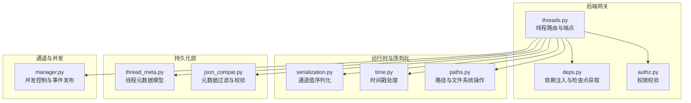
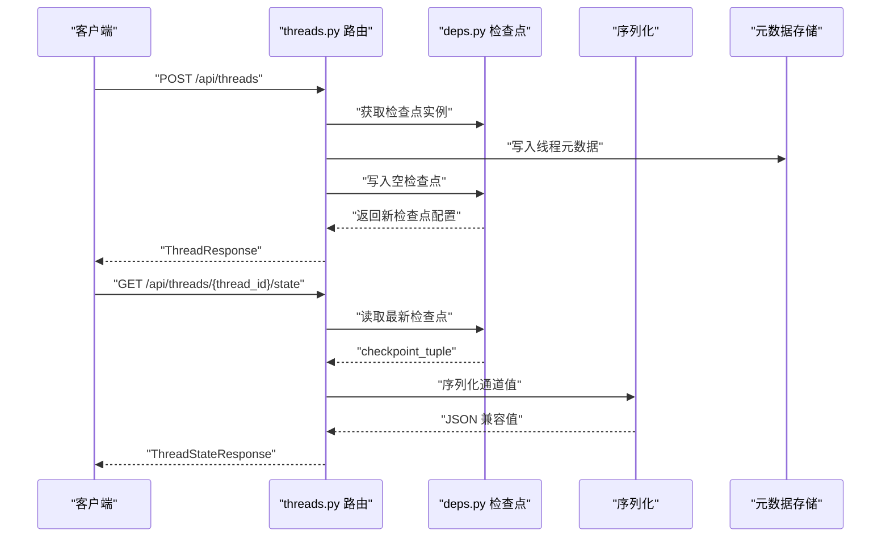
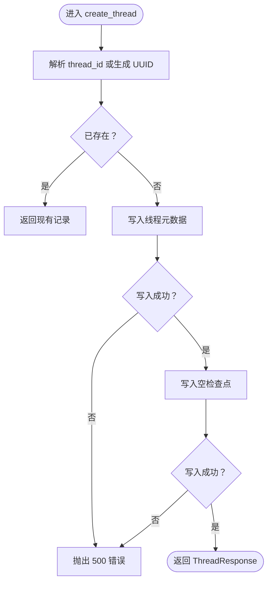
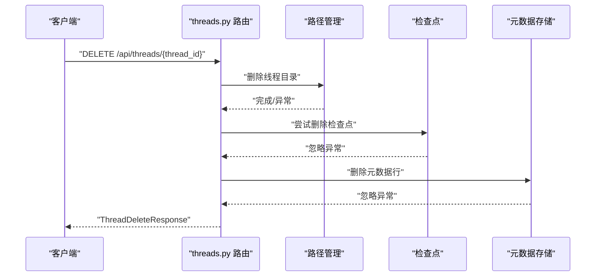
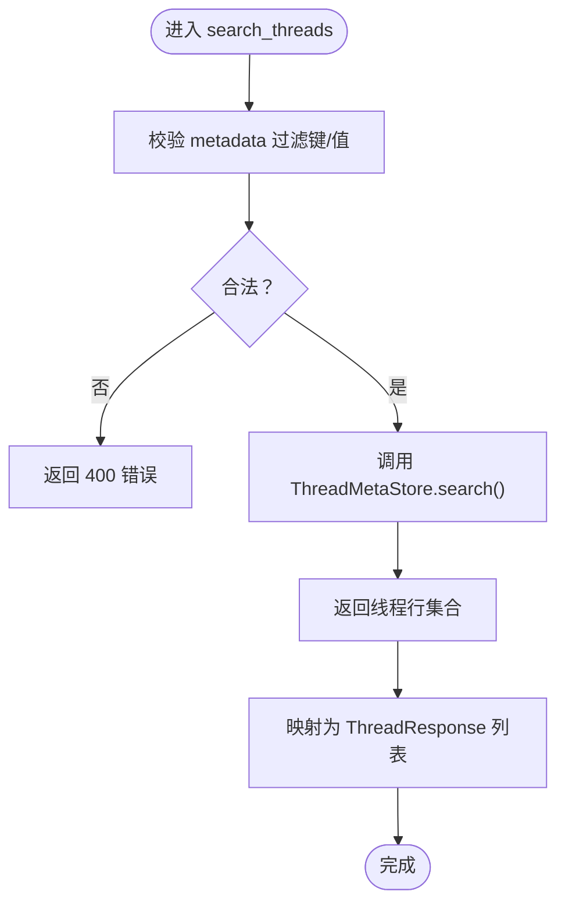
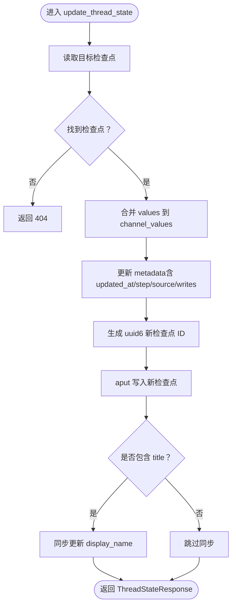
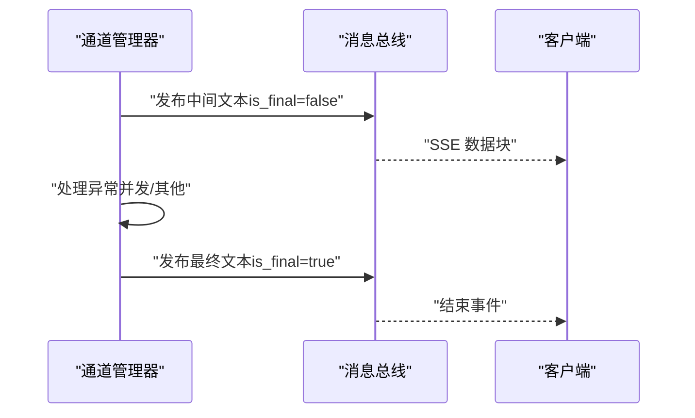
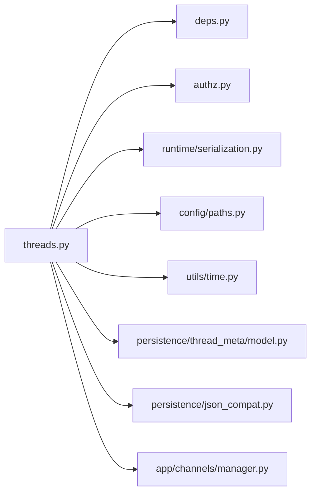

# 线程API

<cite>
**本文引用的文件**
- [threads.py](file://backend/app/gateway/routers/threads.py)
- [deps.py](file://backend/app/gateway/deps.py)
- [authz.py](file://backend/app/gateway/authz.py)
- [serialization.py](file://backend/packages/harness/deerflow/runtime/serialization.py)
- [paths.py](file://backend/packages/harness/deerflow/config/paths.py)
- [time.py](file://backend/packages/harness/deerflow/utils/time.py)
- [thread_meta.py](file://backend/packages/harness/deerflow/persistence/thread_meta/model.py)
- [json_compat.py](file://backend/packages/harness/deerflow/persistence/json_compat.py)
- [manager.py](file://backend/app/channels/manager.py)
- [test_threads_router.py](file://backend/tests/test_threads_router.py)
- [test_auth_middleware.py](file://backend/tests/test_auth_middleware.py)
- [AUTO_TITLE_GENERATION.md](file://backend/docs/AUTO_TITLE_GENERATION.md)
</cite>

## 目录
1. [简介](#简介)
2. [项目结构](#项目结构)
3. [核心组件](#核心组件)
4. [架构总览](#架构总览)
5. [详细组件分析](#详细组件分析)
6. [依赖关系分析](#依赖关系分析)
7. [性能考量](#性能考量)
8. [故障排查指南](#故障排查指南)
9. [结论](#结论)
10. [附录](#附录)

## 简介
本文件为 deer-flow 线程管理 API 的完整技术文档，覆盖对话线程的创建、状态查询与更新、历史查询、元数据管理、分页与时间戳处理、并发控制与状态同步、事件通知等能力。文档同时提供线程 ID 生成规则、消息格式要求、流式响应处理、错误处理策略与性能优化建议，帮助开发者在前后端集成中高效、稳定地使用线程 API。

## 项目结构
线程 API 主要位于后端网关路由模块，围绕 LangGraph 检查点（checkpointer）与线程元数据存储（ThreadMetaStore）协同工作，提供平台兼容的线程生命周期管理能力。

**图表来源**
- [threads.py:1-661](file://backend/app/gateway/routers/threads.py#L1-L661)
- [deps.py](file://backend/app/gateway/deps.py)
- [authz.py](file://backend/app/gateway/authz.py)
- [serialization.py](file://backend/packages/harness/deerflow/runtime/serialization.py)
- [time.py](file://backend/packages/harness/deerflow/utils/time.py)
- [paths.py](file://backend/packages/harness/deerflow/config/paths.py)
- [thread_meta.py](file://backend/packages/harness/deerflow/persistence/thread_meta/model.py)
- [json_compat.py](file://backend/packages/harness/deerflow/persistence/json_compat.py)
- [manager.py:1239-1297](file://backend/app/channels/manager.py#L1239-L1297)

**章节来源**
- [threads.py:1-661](file://backend/app/gateway/routers/threads.py#L1-L661)

## 核心组件
- 线程路由与端点：提供线程创建、删除、查询、状态读写、历史查询与搜索等接口。
- 检查点（Checkpointer）：基于 LangGraph 的状态持久化与读写，支持 uuid6 时间有序的检查点 ID。
- 线程元数据存储（ThreadMetaStore）：维护线程的元数据、显示名、状态与时间戳，支持搜索与过滤。
- 序列化工具：将通道值（如消息对象）转换为 JSON 兼容格式，确保前端正确消费。
- 并发控制与事件：通道管理器负责并发运行控制、流式事件发布与最终响应整合。

**章节来源**
- [threads.py:246-661](file://backend/app/gateway/routers/threads.py#L246-L661)
- [deps.py](file://backend/app/gateway/deps.py)
- [serialization.py](file://backend/packages/harness/deerflow/runtime/serialization.py)
- [thread_meta.py](file://backend/packages/harness/deerflow/persistence/thread_meta/model.py)

## 架构总览
线程 API 的核心流程围绕“检查点 + 元数据存储”的双轨机制展开：检查点负责执行状态与通道值的持久化；元数据存储负责线程可见性、搜索与展示字段（如标题）。权限中间件确保每个端点的访问控制，路径与序列化工具保障数据一致性与跨平台兼容。

**图表来源**
- [threads.py:246-484](file://backend/app/gateway/routers/threads.py#L246-L484)
- [deps.py](file://backend/app/gateway/deps.py)
- [serialization.py](file://backend/packages/harness/deerflow/runtime/serialization.py)

**章节来源**
- [threads.py:246-484](file://backend/app/gateway/routers/threads.py#L246-L484)

## 详细组件分析

### 线程创建（POST /api/threads）
- 功能：创建新线程，写入线程元数据并初始化空检查点，保证状态端点可用。
- 关键行为：
  - 自动生成线程 ID（UUID v4），或使用请求体提供的 ID（需满足安全校验）。
  - 写入线程元数据到 ThreadMetaStore，以便出现在搜索结果中。
  - 写入初始空检查点，包含时间戳与来源元信息，便于后续状态读写。
  - 幂等：若指定 thread_id 已存在，则直接返回现有记录。
- 错误处理：元数据写入失败或检查点写入失败均返回 500。

**图表来源**
- [threads.py:246-308](file://backend/app/gateway/routers/threads.py#L246-L308)

**章节来源**
- [threads.py:246-308](file://backend/app/gateway/routers/threads.py#L246-L308)

### 线程删除（DELETE /api/threads/{thread_id}）
- 功能：清理线程本地文件数据、删除检查点、移除元数据行。
- 关键行为：
  - 删除线程本地目录（文件系统清理）。
  - 尝试删除检查点（异步调用，非关键）。
  - 移除 ThreadMetaStore 中的元数据行（对 sqlite 后端至关重要，确保搜索不可见）。
- 错误处理：文件系统删除参数非法返回 422；其他异常返回 500。

**图表来源**
- [threads.py:212-243](file://backend/app/gateway/routers/threads.py#L212-L243)
- [paths.py](file://backend/packages/harness/deerflow/config/paths.py)

**章节来源**
- [threads.py:212-243](file://backend/app/gateway/routers/threads.py#L212-L243)

### 线程搜索（POST /api/threads/search）
- 功能：按元数据精确匹配、状态过滤、分页查询线程列表。
- 关键行为：
  - 支持 metadata 过滤键与值类型校验（防止 SQL 编译失败）。
  - 支持 limit/offset 分页。
  - 返回包含 created_at/updated_at 的 ISO 时间戳，兼容历史 Unix 秒值修复。
- 错误处理：不支持的过滤项返回 400。

**图表来源**
- [threads.py:311-345](file://backend/app/gateway/routers/threads.py#L311-L345)
- [json_compat.py](file://backend/packages/harness/deerflow/persistence/json_compat.py)

**章节来源**
- [threads.py:311-345](file://backend/app/gateway/routers/threads.py#L311-L345)

### 线程元数据补丁（PATCH /api/threads/{thread_id}）
- 功能：合并更新线程元数据，保留服务器保留键，返回最新记录。
- 关键行为：
  - 对传入 metadata 执行服务器保留键剔除。
  - 更新后重新读取以返回合并后的最新元数据与更新时间。

**章节来源**
- [threads.py:348-374](file://backend/app/gateway/routers/threads.py#L348-L374)

### 单线程信息（GET /api/threads/{thread_id}）
- 功能：获取线程基本信息与当前状态摘要。
- 关键行为：
  - 从 ThreadMetaStore 读取元数据。
  - 从检查点派生准确状态（考虑 pending_writes 与 tasks）。
  - 序列化通道值，确保消息对象转为 JSON 兼容结构。

**章节来源**
- [threads.py:377-431](file://backend/app/gateway/routers/threads.py#L377-L431)

### 线程状态读取（GET /api/threads/{thread_id}/state）
- 功能：获取线程最新状态快照，包含通道值、任务、检查点信息。
- 关键行为：
  - 读取最新检查点，提取 channel_values、metadata、tasks 等。
  - 序列化通道值，返回 next 任务名称列表与任务详情。

**章节来源**
- [threads.py:434-484](file://backend/app/gateway/routers/threads.py#L434-L484)

### 线程状态更新（POST /api/threads/{thread_id}/state）
- 功能：人类介入恢复或标题重命名等状态更新。
- 关键行为：
  - 读取目标检查点（可选指定 checkpoint_id）。
  - 合并 body.values 到 channel_values，更新 updated_at。
  - 若指定 as_node，记录 source、step、writes 等元信息。
  - 生成新的 uuid6 检查点 ID，插入新检查点，避免就地替换。
  - 若更新包含 title，同步更新 ThreadMetaStore 的 display_name。
- 错误处理：读取或写入失败返回 500。

**图表来源**
- [threads.py:487-586](file://backend/app/gateway/routers/threads.py#L487-L586)

**章节来源**
- [threads.py:487-586](file://backend/app/gateway/routers/threads.py#L487-L586)

### 线程历史查询（POST /api/threads/{thread_id}/history）
- 功能：分页查询检查点历史，仅最新检查点携带 messages，避免重复。
- 关键行为：
  - 支持 limit 与 before 游标分页。
  - 从检查点 channel_values 提取 title/thread_data/values。
  - 仅最新检查点附加 messages，其余条目仅包含用户可见元信息。
  - 剥离内部元信息（如 created_at/updated_at/step/source/writes/parents），保留 step 用于排序上下文。

**章节来源**
- [threads.py:589-660](file://backend/app/gateway/routers/threads.py#L589-L660)

### 权限与安全
- 权限模型：每个端点通过 require_permission 进行细粒度授权，支持 owner_check 与 require_existing。
- 客户端认证：未授权访问对应端点将返回 401。
- 元数据安全：服务器保留键（如 owner_id/user_id）在模型层被剔除，防止客户端伪造。

**章节来源**
- [threads.py:348-374](file://backend/app/gateway/routers/threads.py#L348-L374)
- [authz.py](file://backend/app/gateway/authz.py)
- [test_auth_middleware.py:374-406](file://backend/tests/test_auth_middleware.py#L374-L406)

### 线程 ID 生成规则
- 自动生成：若请求未提供 thread_id，使用 UUID v4。
- 幂等：若指定 thread_id 已存在，直接返回现有记录。
- 文件系统清理：删除线程目录时，对 thread_id 进行安全校验，非法 ID 返回 422。

**章节来源**
- [threads.py:258-272](file://backend/app/gateway/routers/threads.py#L258-L272)
- [test_threads_router.py:97-163](file://backend/tests/test_threads_router.py#L97-L163)

### 消息格式与序列化
- 通道值序列化：通过 deerflow.runtime.serialization.serialize_channel_values 将消息对象转换为 JSON 兼容字典，确保前端 useStream Hook 可正确消费。
- 历史消息去重：仅最新检查点包含 messages，避免历史条目重复携带消息。

**章节来源**
- [threads.py:6-11](file://backend/app/gateway/routers/threads.py#L6-L11)
- [serialization.py](file://backend/packages/harness/deerflow/runtime/serialization.py)
- [threads.py:629-634](file://backend/app/gateway/routers/threads.py#L629-L634)

### 流式响应处理
- 并发控制：通道管理器在流式输出过程中检测并发运行冲突，返回“线程繁忙”提示。
- 事件发布：流式过程持续发布中间文本，最终发布 is_final=True 的最终响应，包含附件与澄清标记。
- 错误处理：捕获流式异常，区分“线程繁忙”与其他错误，返回相应提示。

**图表来源**
- [manager.py:1239-1297](file://backend/app/channels/manager.py#L1239-L1297)

**章节来源**
- [manager.py:1239-1297](file://backend/app/channels/manager.py#L1239-L1297)

### 线程状态推导与同步
- 状态推导：根据检查点的 pending_writes 与 tasks 推导状态（error/interrupted/idle）。
- 标题同步：当通过状态更新设置 title 时，同步更新 ThreadMetaStore 的 display_name，使搜索结果即时反映。

**章节来源**
- [threads.py:188-204](file://backend/app/gateway/routers/threads.py#L188-L204)
- [threads.py:570-579](file://backend/app/gateway/routers/threads.py#L570-L579)

### 时间戳与分页
- 时间戳：统一使用 ISO 8601 字符串；历史 Unix 秒值通过 coerce_iso 修复。
- 分页：搜索支持 limit/offset；历史查询支持 limit/before 游标。

**章节来源**
- [threads.py:335-344](file://backend/app/gateway/routers/threads.py#L335-L344)
- [threads.py:603-604](file://backend/app/gateway/routers/threads.py#L603-L604)
- [time.py](file://backend/packages/harness/deerflow/utils/time.py)

## 依赖关系分析

**图表来源**
- [threads.py:1-661](file://backend/app/gateway/routers/threads.py#L1-L661)
- [deps.py](file://backend/app/gateway/deps.py)
- [authz.py](file://backend/app/gateway/authz.py)
- [serialization.py](file://backend/packages/harness/deerflow/runtime/serialization.py)
- [paths.py](file://backend/packages/harness/deerflow/config/paths.py)
- [time.py](file://backend/packages/harness/deerflow/utils/time.py)
- [thread_meta.py](file://backend/packages/harness/deerflow/persistence/thread_meta/model.py)
- [json_compat.py](file://backend/packages/harness/deerflow/persistence/json_compat.py)
- [manager.py:1239-1297](file://backend/app/channels/manager.py#L1239-L1297)

**章节来源**
- [threads.py:1-661](file://backend/app/gateway/routers/threads.py#L1-L661)

## 性能考量
- 检查点写入：每次状态更新生成新的 uuid6 检查点 ID，确保有序且避免就地替换，有利于读取性能与一致性。
- 序列化成本：通道值序列化在状态读取与历史查询中进行，建议前端按需请求，避免一次性拉取过多历史。
- 并发控制：通道管理器对并发运行进行保护，避免资源竞争导致的重复计算与状态污染。
- 元数据过滤：搜索前对过滤键/值进行严格校验，减少无效查询与后端编译开销。

[本节为通用性能建议，无需特定文件引用]

## 故障排查指南
- 创建线程失败（500）：检查 ThreadMetaStore 与检查点写入是否成功；确认后端日志中的异常堆栈。
- 删除线程失败（422/500）：确认 thread_id 合法性；检查文件系统权限与路径配置。
- 获取状态失败（500）：检查检查点读取是否异常；确认检查点后端可用。
- 并发运行冲突：通道管理器会返回“线程繁忙”提示；请等待当前运行结束后再发起新请求。
- 标题不同步：确认通过状态更新设置了 title；检查 ThreadMetaStore 同步是否成功。

**章节来源**
- [test_threads_router.py:97-163](file://backend/tests/test_threads_router.py#L97-L163)
- [manager.py:1254-1274](file://backend/app/channels/manager.py#L1254-L1274)
- [AUTO_TITLE_GENERATION.md:197-258](file://backend/docs/AUTO_TITLE_GENERATION.md#L197-L258)

## 结论
线程 API 通过“检查点 + 元数据存储”的双轨机制，提供了完整的线程生命周期管理能力。其设计兼顾安全性（权限与元数据过滤）、一致性（uuid6 检查点 ID、ISO 时间戳）与可观测性（状态推导、事件发布）。结合并发控制与序列化工具，能够支撑高并发场景下的稳定运行。建议在生产环境中配合完善的监控与日志策略，确保状态同步与错误处理的可追踪性。

[本节为总结性内容，无需特定文件引用]

## 附录

### API 规范概览
- 端点与方法
  - POST /api/threads
  - DELETE /api/threads/{thread_id}
  - POST /api/threads/search
  - PATCH /api/threads/{thread_id}
  - GET /api/threads/{thread_id}
  - GET /api/threads/{thread_id}/state
  - POST /api/threads/{thread_id}/state
  - POST /api/threads/{thread_id}/history
- 关键参数与返回
  - 线程 ID：UUID v4 自动生成；支持幂等创建。
  - 元数据：用户自定义键值对；服务器保留键自动剔除。
  - 状态：idle/busy/interrupted/error；由检查点推导。
  - 历史：limit/before 分页；仅最新检查点包含 messages。

**章节来源**
- [threads.py:246-660](file://backend/app/gateway/routers/threads.py#L246-L660)