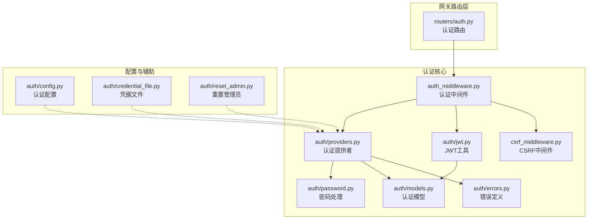
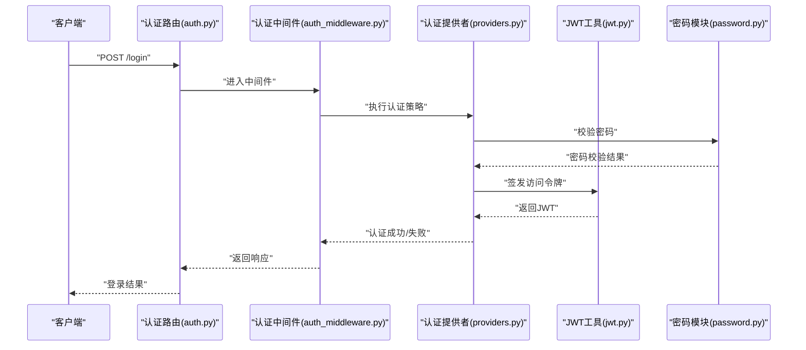
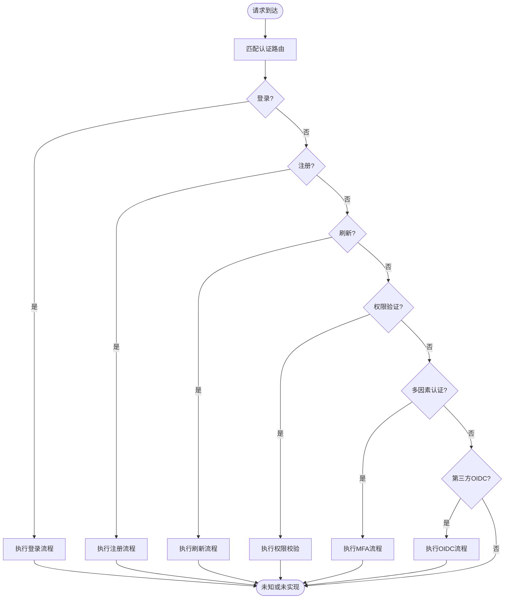
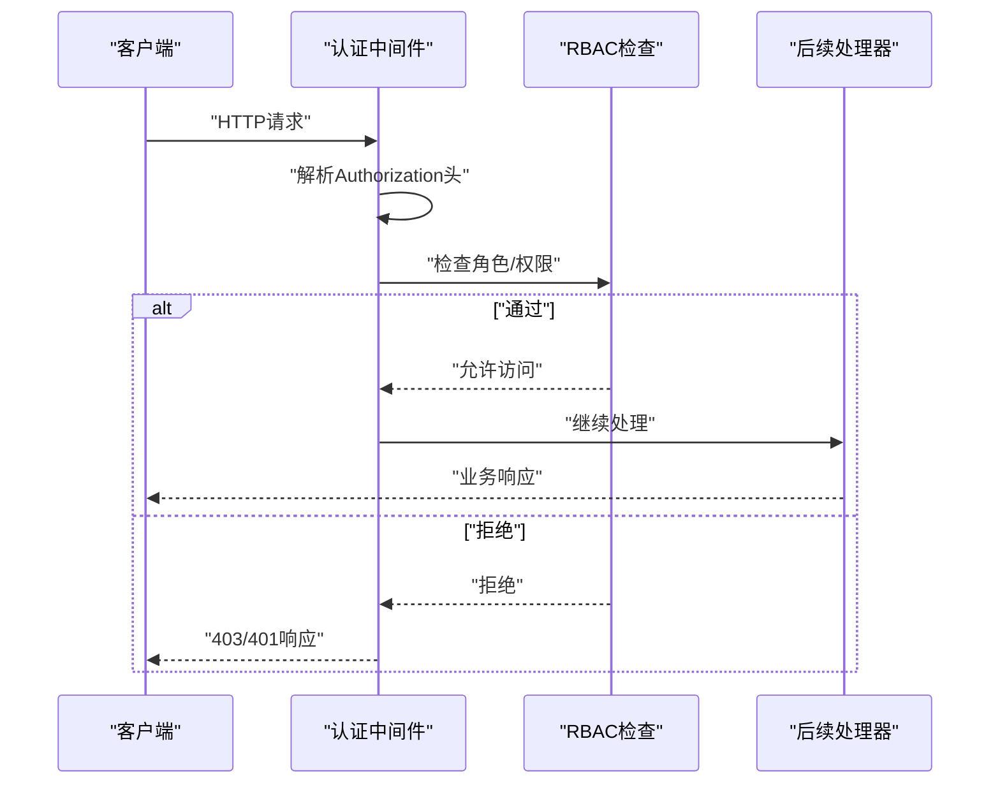
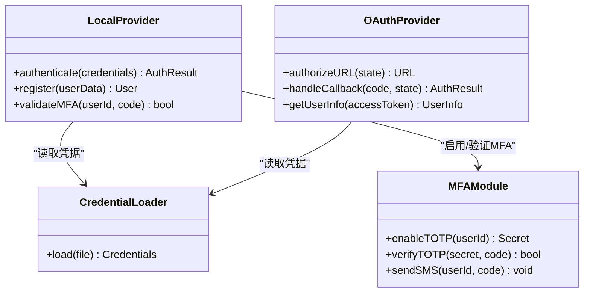
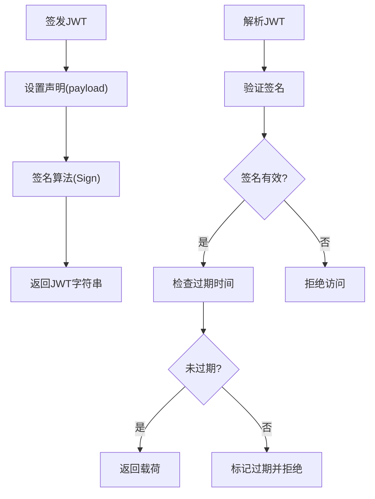
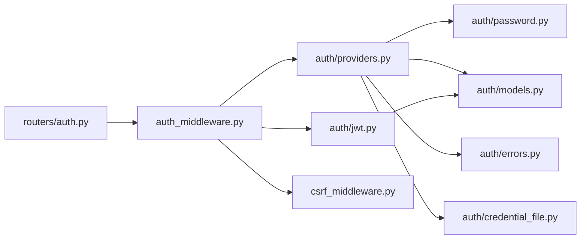

# 认证API

<cite>
**本文引用的文件**
- [backend/app/gateway/routers/auth.py](file://backend/app/gateway/routers/auth.py)
- [backend/app/gateway/auth/jwt.py](file://backend/app/gateway/auth/jwt.py)
- [backend/app/gateway/auth/models.py](file://backend/app/gateway/auth/models.py)
- [backend/app/gateway/auth/providers.py](file://backend/app/gateway/auth/providers.py)
- [backend/app/gateway/auth/password.py](file://backend/app/gateway/auth/password.py)
- [backend/app/gateway/auth/credential_file.py](file://backend/app/gateway/auth/credential_file.py)
- [backend/app/gateway/auth/errors.py](file://backend/app/gateway/auth/errors.py)
- [backend/app/gateway/auth/reset_admin.py](file://backend/app/gateway/auth/reset_admin.py)
- [backend/app/gateway/auth_middleware.py](file://backend/app/gateway/auth_middleware.py)
- [backend/app/gateway/csrf_middleware.py](file://backend/app/gateway/csrf_middleware.py)
- [backend/docs/AUTH_DESIGN.md](file://backend/docs/AUTH_DESIGN.md)
- [backend/docs/AUTH_TEST_DOCKER_GAP.md](file://backend/docs/AUTH_TEST_DOCKER_GAP.md)
- [backend/docs/AUTH_UPGRADE.md](file://backend/docs/AUTH_UPGRADE.md)
- [backend/tests/test_auth.py](file://backend/tests/test_auth.py)
- [backend/tests/test_auth_errors.py](file://backend/tests/test_auth_errors.py)
- [backend/tests/test_auth_middleware.py](file://backend/tests/test_auth_middleware.py)
- [backend/tests/test_auth_config.py](file://backend/tests/test_auth_config.py)
- [docs/权限控制.md](file://docs/权限控制.md)
</cite>

## 目录
1. [简介](#简介)
2. [项目结构](#项目结构)
3. [核心组件](#核心组件)
4. [架构总览](#架构总览)
5. [详细组件分析](#详细组件分析)
6. [依赖关系分析](#依赖关系分析)
7. [性能考虑](#性能考虑)
8. [故障排除指南](#故障排除指南)
9. [结论](#结论)
10. [附录](#附录)

## 简介
本文件为认证API的权威技术文档，覆盖用户认证与授权端点的完整规范，包括登录、注册、令牌刷新、权限验证等核心能力；详述认证方式支持、令牌格式、过期策略、安全机制等技术要求；涵盖多因素认证、第三方集成、会话管理等高级功能；提供权限模型、角色管理、访问控制等安全机制；包含认证流程示例、错误处理方案与安全最佳实践。

## 项目结构
认证子系统位于后端网关模块中，采用分层设计：路由层负责HTTP接口定义，认证中间件负责请求拦截与鉴权，认证提供者负责具体认证策略（本地/外部），JWT工具负责令牌签发与校验，密码模块负责密码处理，错误模块统一异常处理。

**图表来源**
- [backend/app/gateway/routers/auth.py](file://backend/app/gateway/routers/auth.py)
- [backend/app/gateway/auth_middleware.py](file://backend/app/gateway/auth_middleware.py)
- [backend/app/gateway/csrf_middleware.py](file://backend/app/gateway/csrf_middleware.py)
- [backend/app/gateway/auth/jwt.py](file://backend/app/gateway/auth/jwt.py)
- [backend/app/gateway/auth/providers.py](file://backend/app/gateway/auth/providers.py)
- [backend/app/gateway/auth/password.py](file://backend/app/gateway/auth/password.py)
- [backend/app/gateway/auth/models.py](file://backend/app/gateway/auth/models.py)
- [backend/app/gateway/auth/errors.py](file://backend/app/gateway/auth/errors.py)

**章节来源**
- [backend/app/gateway/routers/auth.py](file://backend/app/gateway/routers/auth.py)
- [backend/app/gateway/auth_middleware.py](file://backend/app/gateway/auth_middleware.py)
- [backend/app/gateway/csrf_middleware.py](file://backend/app/gateway/csrf_middleware.py)
- [backend/app/gateway/auth/jwt.py](file://backend/app/gateway/auth/jwt.py)
- [backend/app/gateway/auth/providers.py](file://backend/app/gateway/auth/providers.py)
- [backend/app/gateway/auth/password.py](file://backend/app/gateway/auth/password.py)
- [backend/app/gateway/auth/models.py](file://backend/app/gateway/auth/models.py)
- [backend/app/gateway/auth/errors.py](file://backend/app/gateway/auth/errors.py)

## 核心组件
- 路由层：定义认证相关HTTP端点，如登录、注册、令牌刷新、权限验证等。
- 中间件层：统一处理认证与CSRF防护，确保请求在进入业务逻辑前完成身份验证。
- 提供者层：封装认证策略（本地用户名密码、第三方OAuth等），抽象认证流程。
- JWT工具：负责JWT生成、解析、校验与过期处理。
- 密码模块：负责密码哈希、校验与强度策略。
- 模型与错误：定义认证相关的数据模型与异常类型。
- 配置与辅助：提供认证配置加载、凭据文件管理、管理员重置等辅助能力。

**章节来源**
- [backend/app/gateway/routers/auth.py](file://backend/app/gateway/routers/auth.py)
- [backend/app/gateway/auth_middleware.py](file://backend/app/gateway/auth_middleware.py)
- [backend/app/gateway/auth/jwt.py](file://backend/app/gateway/auth/jwt.py)
- [backend/app/gateway/auth/providers.py](file://backend/app/gateway/auth/providers.py)
- [backend/app/gateway/auth/password.py](file://backend/app/gateway/auth/password.py)
- [backend/app/gateway/auth/models.py](file://backend/app/gateway/auth/models.py)
- [backend/app/gateway/auth/errors.py](file://backend/app/gateway/auth/errors.py)

## 架构总览
认证系统采用“路由-中间件-提供者-JWT-密码-模型-错误”的分层架构，通过中间件拦截请求，调用认证提供者执行认证策略，使用JWT进行状态无感鉴权，并结合CSRF中间件提升安全性。

**图表来源**
- [backend/app/gateway/routers/auth.py](file://backend/app/gateway/routers/auth.py)
- [backend/app/gateway/auth_middleware.py](file://backend/app/gateway/auth_middleware.py)
- [backend/app/gateway/auth/providers.py](file://backend/app/gateway/auth/providers.py)
- [backend/app/gateway/auth/jwt.py](file://backend/app/gateway/auth/jwt.py)
- [backend/app/gateway/auth/password.py](file://backend/app/gateway/auth/password.py)

## 详细组件分析

### 路由层（认证端点）
- 登录：接收用户名/邮箱与密码，返回访问令牌与可选刷新令牌。
- 注册：创建新用户账户，遵循密码强度策略。
- 刷新：使用刷新令牌换取新的访问令牌。
- 权限验证：基于角色/权限检查访问控制。
- 多因素认证：支持TOTP/短信等二次验证流程。
- 第三方集成：支持OAuth/SSO等外部认证源。
- 会话管理：支持会话查询、吊销与生命周期管理。

**图表来源**
- [backend/app/gateway/routers/auth.py](file://backend/app/gateway/routers/auth.py)

**章节来源**
- [backend/app/gateway/routers/auth.py](file://backend/app/gateway/routers/auth.py)

### 认证中间件
- 请求拦截：在进入业务路由前统一执行认证。
- 角色/权限检查：根据用户角色与资源权限决定放行或拒绝。
- 会话上下文注入：将用户标识、角色信息注入到请求上下文中。
- 异常处理：捕获认证相关异常并转换为标准响应。

**图表来源**
- [backend/app/gateway/auth_middleware.py](file://backend/app/gateway/auth_middleware.py)

**章节来源**
- [backend/app/gateway/auth_middleware.py](file://backend/app/gateway/auth_middleware.py)

### 认证提供者（本地/第三方）
- 本地提供者：基于用户名/邮箱+密码的认证，调用密码模块进行校验。
- 第三方提供者：支持OAuth/SSO，回调后建立本地用户映射。
- 多因素认证：支持TOTP/短信等二次验证。
- 凭据管理：从凭据文件加载第三方密钥与配置。

**图表来源**
- [backend/app/gateway/auth/providers.py](file://backend/app/gateway/auth/providers.py)
- [backend/app/gateway/auth/credential_file.py](file://backend/app/gateway/auth/credential_file.py)
- [backend/app/gateway/auth/password.py](file://backend/app/gateway/auth/password.py)

**章节来源**
- [backend/app/gateway/auth/providers.py](file://backend/app/gateway/auth/providers.py)
- [backend/app/gateway/auth/credential_file.py](file://backend/app/gateway/auth/credential_file.py)
- [backend/app/gateway/auth/password.py](file://backend/app/gateway/auth/password.py)

### JWT工具
- 令牌签发：生成访问令牌与刷新令牌，设置过期时间与声明。
- 令牌解析：从请求头解析并验证JWT签名与有效期。
- 过期策略：支持刷新令牌轮换与黑名单机制。
- 安全声明：包含用户标识、角色、权限范围等。

**图表来源**
- [backend/app/gateway/auth/jwt.py](file://backend/app/gateway/auth/jwt.py)

**章节来源**
- [backend/app/gateway/auth/jwt.py](file://backend/app/gateway/auth/jwt.py)

### 密码模块
- 哈希策略：使用强哈希算法存储密码摘要。
- 校验流程：输入密码经相同哈希算法与盐值校验。
- 强度策略：长度、字符集、历史密码限制等。
- 安全更新：支持安全的密码修改与重置流程。

**章节来源**
- [backend/app/gateway/auth/password.py](file://backend/app/gateway/auth/password.py)

### 错误与异常
- 统一错误码：登录失败、密码错误、令牌无效、权限不足等。
- 异常传播：中间件捕获并转换为HTTP响应。
- 日志记录：敏感操作与失败场景记录审计日志。

**章节来源**
- [backend/app/gateway/auth/errors.py](file://backend/app/gateway/auth/errors.py)
- [backend/tests/test_auth_errors.py](file://backend/tests/test_auth_errors.py)

### 配置与管理员重置
- 认证配置：启用/禁用认证、默认提供者、MFA策略等。
- 凭据文件：集中管理第三方密钥与证书。
- 管理员重置：在丢失管理员凭据时的安全重置流程。

**章节来源**
- [backend/app/gateway/auth/config.py](file://backend/app/gateway/auth/config.py)
- [backend/app/gateway/auth/credential_file.py](file://backend/app/gateway/auth/credential_file.py)
- [backend/app/gateway/auth/reset_admin.py](file://backend/app/gateway/auth/reset_admin.py)

## 依赖关系分析
认证子系统内部依赖清晰，路由依赖中间件，中间件依赖提供者与JWT工具，提供者依赖密码模块与凭据文件，形成自上而下的职责分离。

**图表来源**
- [backend/app/gateway/routers/auth.py](file://backend/app/gateway/routers/auth.py)
- [backend/app/gateway/auth_middleware.py](file://backend/app/gateway/auth_middleware.py)
- [backend/app/gateway/csrf_middleware.py](file://backend/app/gateway/csrf_middleware.py)
- [backend/app/gateway/auth/providers.py](file://backend/app/gateway/auth/providers.py)
- [backend/app/gateway/auth/jwt.py](file://backend/app/gateway/auth/jwt.py)
- [backend/app/gateway/auth/password.py](file://backend/app/gateway/auth/password.py)
- [backend/app/gateway/auth/models.py](file://backend/app/gateway/auth/models.py)
- [backend/app/gateway/auth/errors.py](file://backend/app/gateway/auth/errors.py)
- [backend/app/gateway/auth/credential_file.py](file://backend/app/gateway/auth/credential_file.py)

**章节来源**
- [backend/app/gateway/routers/auth.py](file://backend/app/gateway/routers/auth.py)
- [backend/app/gateway/auth_middleware.py](file://backend/app/gateway/auth_middleware.py)
- [backend/app/gateway/csrf_middleware.py](file://backend/app/gateway/csrf_middleware.py)
- [backend/app/gateway/auth/providers.py](file://backend/app/gateway/auth/providers.py)
- [backend/app/gateway/auth/jwt.py](file://backend/app/gateway/auth/jwt.py)
- [backend/app/gateway/auth/password.py](file://backend/app/gateway/auth/password.py)
- [backend/app/gateway/auth/models.py](file://backend/app/gateway/auth/models.py)
- [backend/app/gateway/auth/errors.py](file://backend/app/gateway/auth/errors.py)
- [backend/app/gateway/auth/credential_file.py](file://backend/app/gateway/auth/credential_file.py)

## 性能考虑
- JWT缓存：对频繁访问的令牌进行内存缓存以减少签名验证开销。
- 并发控制：在高并发场景下限制登录尝试频率，防止暴力破解。
- 数据库索引：为用户标识、令牌哈希等字段建立索引，优化查询性能。
- 异步处理：将非关键的异步任务（如审计日志）放入队列，避免阻塞主流程。
- 负载均衡：在分布式部署中确保JWT签发与验证的一致性（共享密钥/数据库）。

## 故障排除指南
- 登录失败：检查用户名/密码是否正确，确认账户状态正常，查看错误码定位问题。
- 令牌无效：确认令牌未过期且签名有效，检查是否被吊销或加入黑名单。
- 权限不足：核对用户角色与资源权限映射，确认中间件已正确注入上下文。
- CSRF错误：确保前端携带CSRF令牌并在同源环境下发起请求。
- 第三方回调失败：检查回调URL配置、状态参数与签名验证，确认网络可达性。
- MFA失败：确认TOTP同步与短信发送通道正常，检查验证码有效期。

**章节来源**
- [backend/tests/test_auth.py](file://backend/tests/test_auth.py)
- [backend/tests/test_auth_errors.py](file://backend/tests/test_auth_errors.py)
- [backend/tests/test_auth_middleware.py](file://backend/tests/test_auth_middleware.py)
- [backend/tests/test_auth_config.py](file://backend/tests/test_auth_config.py)

## 结论
该认证API采用清晰的分层架构与中间件模式，支持本地与第三方认证、多因素认证与完善的权限控制。通过JWT实现无状态鉴权，配合CSRF中间件与严格的错误处理，确保系统的安全性与可用性。建议在生产环境中结合负载测试与渗透测试持续优化性能与安全策略。

## 附录
- 设计文档：参考认证设计与升级说明，了解架构演进与最佳实践。
- 权限控制：参考权限控制文档，掌握角色与资源权限的建模方法。
- 测试参考：参考认证相关测试用例，理解典型场景与边界条件。

**章节来源**
- [backend/docs/AUTH_DESIGN.md](file://backend/docs/AUTH_DESIGN.md)
- [backend/docs/AUTH_UPGRADE.md](file://backend/docs/AUTH_UPGRADE.md)
- [docs/权限控制.md](file://docs/权限控制.md)