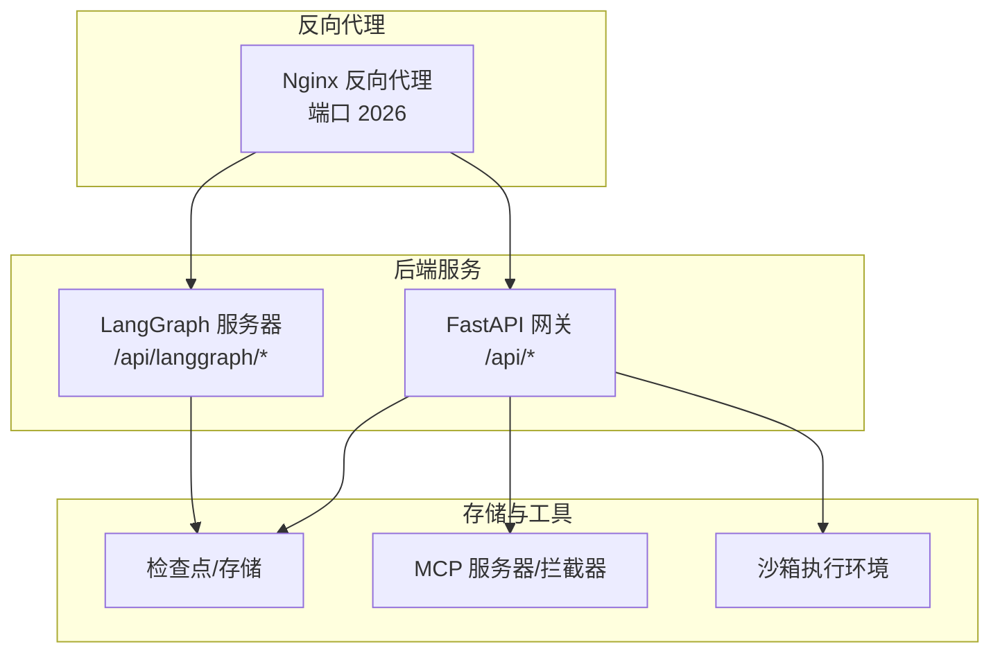
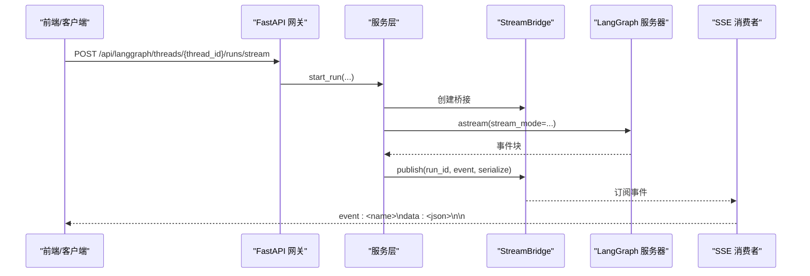
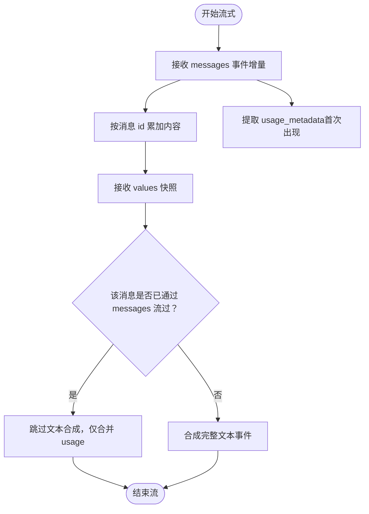
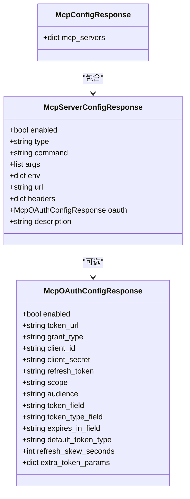
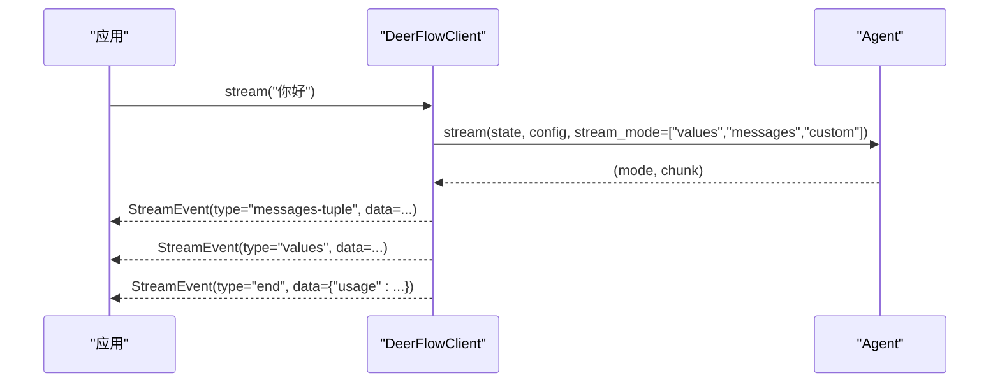
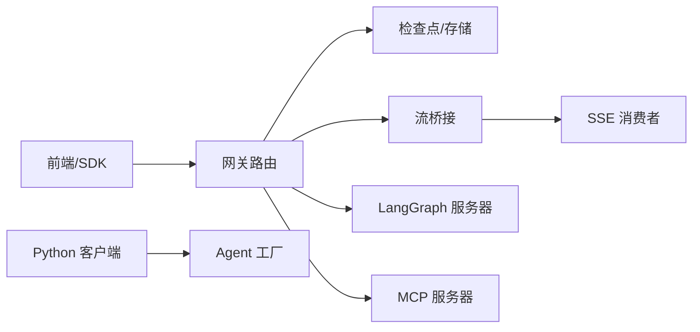

# API参考文档

<cite>
**本文引用的文件**
- [API.md](file://backend/docs/API.md)
- [STREAMING.md](file://backend/docs/STREAMING.md)
- [MCP_SERVER.md](file://backend/docs/MCP_SERVER.md)
- [CONFIGURATION.md](file://backend/docs/CONFIGURATION.md)
- [GUARDRAILS.md](file://backend/docs/GUARDRAILS.md)
- [ARCHITECTURE.md](file://backend/docs/ARCHITECTURE.md)
- [TODO.md](file://backend/docs/TODO.md)
- [mcp.py](file://backend/app/gateway/routers/mcp.py)
- [threads.py](file://backend/app/gateway/routers/threads.py)
- [runs.py](file://backend/app/gateway/routers/runs.py)
- [client.py](file://backend/packages/harness/deerflow/client.py)
- [types.ts](file://frontend/src/core/mcp/types.ts)
- [api.ts](file://frontend/src/core/mcp/api.ts)
- [stream-mode.ts](file://frontend/src/core/api/stream-mode.ts)
- [api-client.ts](file://frontend/src/core/api/api-client.ts)
- [llm_error_handling_middleware.py](file://backend/packages/harness/deerflow/agents/middlewares/llm_error_handling_middleware.py)
</cite>

## 目录
1. [简介](#简介)
2. [项目结构](#项目结构)
3. [核心组件](#核心组件)
4. [架构总览](#架构总览)
5. [详细组件分析](#详细组件分析)
6. [依赖分析](#依赖分析)
7. [性能考量](#性能考量)
8. [故障排查指南](#故障排查指南)
9. [结论](#结论)
10. [附录](#附录)

## 简介
本文件为 DeerFlow 的全面 API 参考文档，覆盖以下方面：
- REST API 规范：HTTP 方法、URL 模式、请求/响应结构与认证方式
- 实时流式交互：SSE 事件格式、连接处理、消息类型与实时交互模式
- MCP 协议规范：配置、OAuth 支持、拦截器、错误处理与安全考虑
- 客户端 SDK 使用：Python 客户端与前端 SDK 的调用示例、参数与返回值处理
- 错误码与处理：通用错误格式、状态码、错误分类与处理策略
- 性能优化：速率限制、缓存策略、并发与最佳实践
- 迁移与兼容：版本信息、向后兼容与未来规划

## 项目结构
DeerFlow 后端采用 FastAPI 提供两类 API：
- LangGraph API：代理 LangGraph 服务器，提供线程、运行与流式输出能力
- Gateway API：统一入口，提供模型、MCP、技能、上传、工件与线程管理等能力

图表来源
- [API.md:1-156](file://backend/docs/API.md#L1-L156)
- [threads.py:1-683](file://backend/app/gateway/routers/threads.py#L1-L683)
- [runs.py:1-88](file://backend/app/gateway/routers/runs.py#L1-L88)

章节来源
- [API.md:1-156](file://backend/docs/API.md#L1-L156)

## 核心组件
- LangGraph API：通过 /api/langgraph 提供线程创建、状态查询、运行与流式输出，遵循 LangGraph SDK 约定
- Gateway API：通过 /api 提供模型列表、MCP 配置、技能管理、文件上传与下载、线程清理与工件访问
- 流式机制：SSE（HTTP）与同步直连（嵌入式 Python 客户端）双通道，确保前后端与内部脚本一致体验
- MCP：可插拔的模型上下文协议服务器，支持 OAuth 令牌注入与自定义拦截器
- 客户端 SDK：Python 嵌入式客户端与前端 LangGraph SDK 客户端

章节来源
- [API.md:14-556](file://backend/docs/API.md#L14-L556)
- [STREAMING.md:1-352](file://backend/docs/STREAMING.md#L1-L352)
- [mcp.py:1-170](file://backend/app/gateway/routers/mcp.py#L1-L170)
- [client.py:1-800](file://backend/packages/harness/deerflow/client.py#L1-L800)

## 架构总览
下图展示 HTTP 客户端、网关与 LangGraph 服务器之间的交互，以及嵌入式客户端直连 Agent 的路径。

图表来源
- [STREAMING.md:104-145](file://backend/docs/STREAMING.md#L104-L145)
- [runs.py:34-56](file://backend/app/gateway/routers/runs.py#L34-L56)

章节来源
- [STREAMING.md:101-173](file://backend/docs/STREAMING.md#L101-L173)

## 详细组件分析

### REST API 规范
- 基础路径
  - LangGraph API：/api/langgraph
  - Gateway API：/api
- 认证
  - 默认未实现认证，建议通过 Nginx 或前置网关进行认证/鉴权
- 速率限制
  - 默认未实现，可在 Nginx 层配置

章节来源
- [API.md:12-566](file://backend/docs/API.md#L12-L566)

#### LangGraph API
- 线程
  - 创建线程：POST /api/langgraph/threads
  - 获取线程状态：GET /api/langgraph/threads/{thread_id}/state
- 运行
  - 创建运行：POST /api/langgraph/threads/{thread_id}/runs
  - 流式运行：POST /api/langgraph/threads/{thread_id}/runs/stream
  - 运行历史：GET /api/langgraph/threads/{thread_id}/runs
- 流式模式兼容性
  - 推荐使用：values、messages-tuple、custom
  - 不推荐：tools（当前 LangGraph API 已弃用）

章节来源
- [API.md:14-166](file://backend/docs/API.md#L14-L166)

#### Gateway API
- 模型
  - 列表：GET /api/models
  - 详情：GET /api/models/{model_name}
- MCP 配置
  - 获取：GET /api/mcp/config
  - 更新：PUT /api/mcp/config
- 技能
  - 列表：GET /api/skills
  - 详情：GET /api/skills/{skill_name}
  - 启用：POST /api/skills/{skill_name}/enable
  - 禁用：POST /api/skills/{skill_name}/disable
  - 安装：POST /api/skills/install（multipart/form-data）
- 文件上传
  - 上传：POST /api/threads/{thread_id}/uploads（multipart/form-data）
  - 列表：GET /api/threads/{thread_id}/uploads/list
  - 删除：DELETE /api/threads/{thread_id}/uploads/{filename}
- 线程清理
  - 删除：DELETE /api/threads/{thread_id}
- 工件
  - 下载/查看：GET /api/threads/{thread_id}/artifacts/{path}?download={bool}

章节来源
- [API.md:169-522](file://backend/docs/API.md#L169-L522)

### SSE 事件格式与实时交互
- 事件类型
  - values：完整状态快照（标题、消息、工件）
  - messages：LLM token 级增量（AIMessageChunk）
  - end：流结束，携带累计用量
- 事件帧格式
  - event: <name>
  - data: <JSON>
  - 空行分隔
- 消费语义
  - messages 模式为增量，需在消费端按消息 id 累加
  - values 快照中已通过 messages 模式流过的消息不再重复合成

图表来源
- [STREAMING.md:175-245](file://backend/docs/STREAMING.md#L175-L245)

章节来源
- [STREAMING.md:1-352](file://backend/docs/STREAMING.md#L1-L352)

### MCP 协议规范
- 配置
  - GET /api/mcp/config：返回所有 MCP 服务器配置
  - PUT /api/mcp/config：更新配置并保存至 extensions_config.json
- OAuth 支持
  - http/sse 类型 MCP 服务器支持 client_credentials 与 refresh_token
  - 支持自动令牌刷新与过期前刷新偏移
- 自定义拦截器
  - 可注册拦截器在每次工具调用前注入请求头或执行日志/指标
  - 通过 extensions_config.json 的 mcpInterceptors 字段声明

图表来源
- [mcp.py:15-64](file://backend/app/gateway/routers/mcp.py#L15-L64)

章节来源
- [mcp.py:1-170](file://backend/app/gateway/routers/mcp.py#L1-L170)
- [MCP_SERVER.md:1-100](file://backend/docs/MCP_SERVER.md#L1-L100)

### 客户端 SDK 使用
- Python 嵌入式客户端（DeerFlowClient）
  - 流式：stream(message, thread_id, ...) 产出 values/messages-tuple/custom/end 事件
  - 便捷：chat(message, thread_id, ...) 返回最终文本
  - 配置查询：list_models()、list_skills()、get_memory()/export/import_memory()
- 前端 SDK（LangGraph SDK）
  - 通过 getAPIClient() 获取客户端实例，自动过滤不支持的流式模式
  - runs.stream() 与 runs.joinStream() 自动应用模式清洗

图表来源
- [client.py:467-681](file://backend/packages/harness/deerflow/client.py#L467-L681)
- [api-client.ts:9-31](file://frontend/src/core/api/api-client.ts#L9-L31)
- [stream-mode.ts:1-69](file://frontend/src/core/api/stream-mode.ts#L1-L69)

章节来源
- [client.py:1-800](file://backend/packages/harness/deerflow/client.py#L1-L800)
- [api-client.ts:1-45](file://frontend/src/core/api/api-client.ts#L1-L45)
- [stream-mode.ts:1-69](file://frontend/src/core/api/stream-mode.ts#L1-L69)

### 错误处理与错误码
- 通用错误格式
  - {"detail": "错误描述"}
- 常见状态码
  - 400：请求无效
  - 404：资源不存在
  - 422：校验失败
  - 500：服务器内部错误
- LLM 错误分类与熔断
  - 识别配额、鉴权、瞬态网络错误等
  - 支持指数退避与熔断探测恢复
  - 可根据响应头 retry-after-ms 做精确等待

章节来源
- [API.md:524-539](file://backend/docs/API.md#L524-L539)
- [llm_error_handling_middleware.py:135-377](file://backend/packages/harness/deerflow/agents/middlewares/llm_error_handling_middleware.py#L135-L377)

## 依赖分析
- 组件耦合
  - 网关路由依赖检查点/存储、运行管理器与流桥接
  - 嵌入式客户端直连 Agent 工厂，避免跨进程序列化开销
- 外部依赖
  - LangGraph 服务器（LangGraph API）
  - MCP 服务器（可选）
  - Nginx（反向代理与速率限制）

图表来源
- [threads.py:1-683](file://backend/app/gateway/routers/threads.py#L1-L683)
- [runs.py:1-88](file://backend/app/gateway/routers/runs.py#L1-L88)
- [client.py:1-800](file://backend/packages/harness/deerflow/client.py#L1-L800)

章节来源
- [threads.py:1-683](file://backend/app/gateway/routers/threads.py#L1-L683)
- [runs.py:1-88](file://backend/app/gateway/routers/runs.py#L1-L88)
- [client.py:1-800](file://backend/packages/harness/deerflow/client.py#L1-L800)

## 性能考量
- 缓存策略
  - MCP 工具基于文件 mtime 失效
  - 配置按文件变更自动重载
  - 技能解析启动时缓存
- 流式优化
  - SSE 减少首 token 时间
  - 增量消息避免整段缓冲
- 并发与最佳实践
  - 生产环境建议使用 langgraph up（多工作进程）
  - 前端/SDK 自动过滤不支持的流式模式，减少无效订阅
- 速率限制
  - 建议在 Nginx 层配置限流规则

章节来源
- [ARCHITECTURE.md:466-485](file://backend/docs/ARCHITECTURE.md#L466-L485)
- [TODO.md:16-30](file://backend/docs/TODO.md#L16-L30)

## 故障排查指南
- 线程清理
  - 422：线程 ID 无效
  - 500：删除本地线程数据失败（异常详情记录在服务端日志）
- 流式问题
  - 确认订阅了 messages 模式以获得 token 级增量
  - 检查前端/SDK 是否正确清洗不支持的流式模式
- LLM 错误
  - 查看错误分类（配额/鉴权/瞬态），必要时启用熔断与退避
  - 根据响应头 retry-after-ms 做延迟重试

章节来源
- [API.md:483-502](file://backend/docs/API.md#L483-L502)
- [STREAMING.md:292-335](file://backend/docs/STREAMING.md#L292-L335)
- [llm_error_handling_middleware.py:135-377](file://backend/packages/harness/deerflow/agents/middlewares/llm_error_handling_middleware.py#L135-L377)

## 结论
本文档提供了 DeerFlow API 的完整参考，涵盖 REST 接口、SSE 实时流、MCP 协议与客户端 SDK 使用，并给出错误处理、性能优化与迁移建议。建议在生产环境中结合 Nginx 进行认证与限流，在前端/SDK 层面保持流式模式一致性，并利用 MCP 的 OAuth 与拦截器扩展能力提升安全性与可观测性。

## 附录

### API 一览（摘要）
- LangGraph API
  - /api/langgraph/threads：创建、状态、历史
  - /api/langgraph/threads/{thread_id}/runs：运行、流式运行
- Gateway API
  - /api/models：模型列表与详情
  - /api/mcp/config：MCP 配置读取与更新
  - /api/skills：技能列表、详情、启用/禁用、安装
  - /api/threads/{thread_id}/uploads：上传、列表、删除
  - /api/threads/{thread_id}：清理线程本地数据
  - /api/threads/{thread_id}/artifacts/{path}：工件下载/查看

章节来源
- [API.md:14-522](file://backend/docs/API.md#L14-L522)

### MCP 配置字段说明
- enabled：是否启用
- type：传输类型（stdio/http/sse）
- command/args/env：stdio 启动命令与环境变量
- url/headers：http/sse 服务器地址与请求头
- oauth：OAuth 配置（令牌端点、授权类型、客户端凭据、作用域、audience、字段映射、过期前刷新偏移、额外表单参数）
- description：人类可读描述

章节来源
- [mcp.py:34-46](file://backend/app/gateway/routers/mcp.py#L34-L46)
- [MCP_SERVER.md:17-46](file://backend/docs/MCP_SERVER.md#L17-L46)

### 前端 MCP 配置类型
- MCPConfig：包含 mcp_servers 映射
- MCPServerConfig：包含 enabled 与 description 字段

章节来源
- [types.ts:1-9](file://frontend/src/core/mcp/types.ts#L1-L9)
- [api.ts:1-20](file://frontend/src/core/mcp/api.ts#L1-L20)