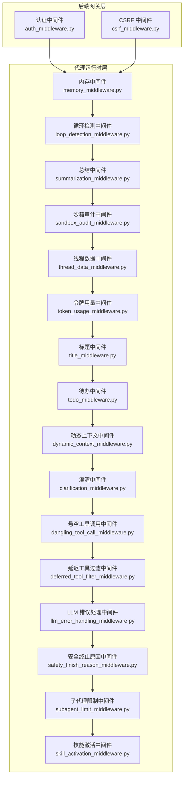
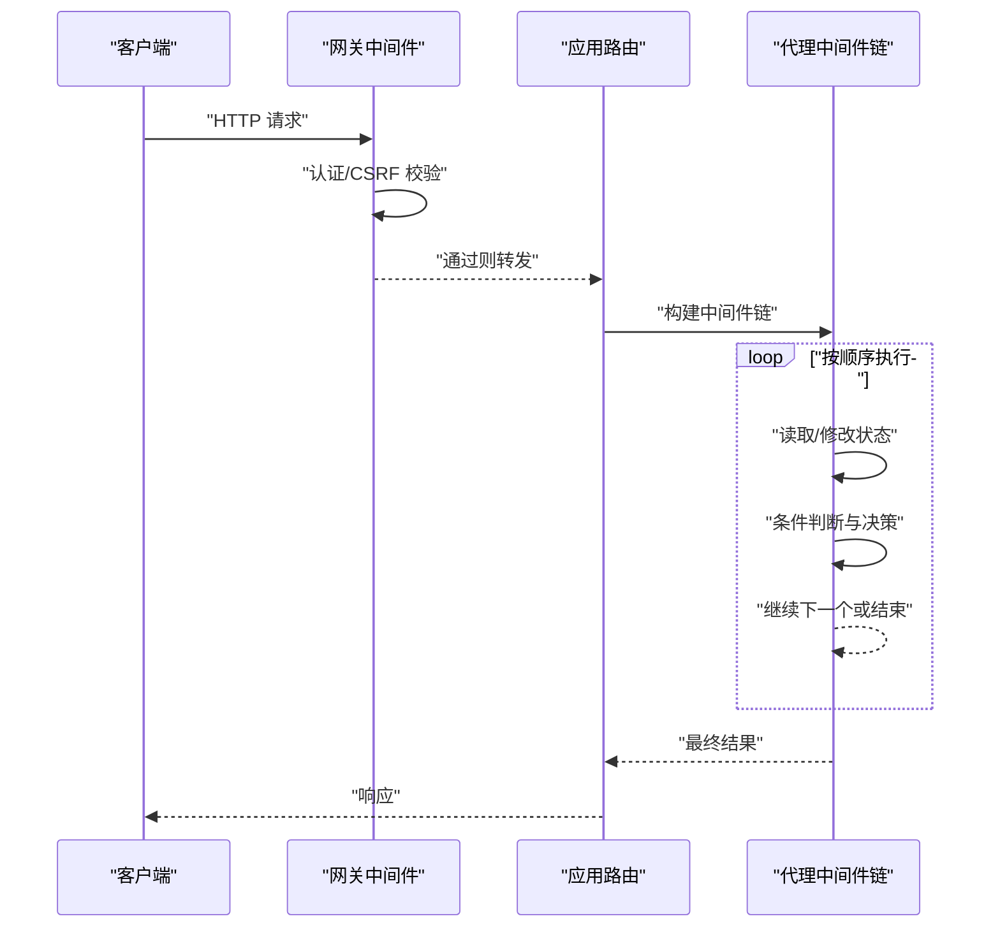
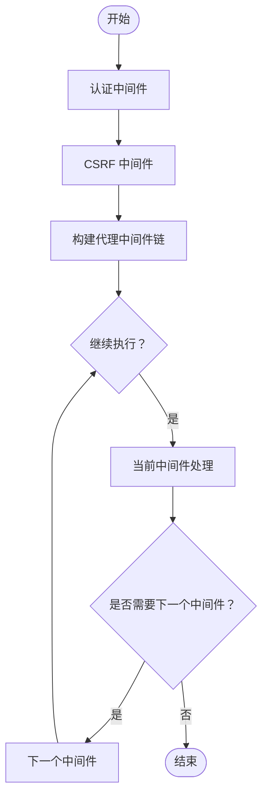

# 中间件系统

<cite>
**本文引用的文件**
- [backend/app/gateway/auth_middleware.py](file://backend/app/gateway/auth_middleware.py)
- [backend/app/gateway/csrf_middleware.py](file://backend/app/gateway/csrf_middleware.py)
- [backend/packages/harness/deerflow/agents/middlewares/memory_middleware.py](file://backend/packages/harness/deerflow/agents/middlewares/memory_middleware.py)
- [backend/packages/harness/deerflow/agents/middlewares/loop_detection_middleware.py](file://backend/packages/harness/deerflow/agents/middlewares/loop_detection_middleware.py)
- [backend/packages/harness/deerflow/agents/middlewares/summarization_middleware.py](file://backend/packages/harness/deerflow/agents/middlewares/summarization_middleware.py)
- [backend/packages/harness/deerflow/agents/middlewares/sandbox_audit_middleware.py](file://backend/packages/harness/deerflow/agents/middlewares/sandbox_audit_middleware.py)
- [backend/packages/harness/deerflow/agents/middlewares/thread_data_middleware.py](file://backend/packages/harness/deerflow/agents/middlewares/thread_data_middleware.py)
- [backend/packages/harness/deerflow/agents/middlewares/token_usage_middleware.py](file://backend/packages/harness/deerflow/agents/middlewares/token_usage_middleware.py)
- [backend/packages/harness/deerflow/agents/middlewares/title_middleware.py](file://backend/packages/harness/deerflow/agents/middlewares/title_middleware.py)
- [backend/packages/harness/deerflow/agents/middlewares/todo_middleware.py](file://backend/packages/harness/deerflow/agents/middlewares/todo_middleware.py)
- [backend/packages/harness/deerflow/agents/middlewares/dynamic_context_middleware.py](file://backend/packages/harness/deerflow/agents/middlewares/dynamic_context_middleware.py)
- [backend/packages/harness/deerflow/agents/middlewares/clarification_middleware.py](file://backend/packages/harness/deerflow/agents/middlewares/clarification_middleware.py)
- [backend/packages/harness/deerflow/agents/middlewares/dangling_tool_call_middleware.py](file://backend/packages/harness/deerflow/agents/middlewares/dangling_tool_call_middleware.py)
- [backend/packages/harness/deerflow/agents/middlewares/deferred_tool_filter_middleware.py](file://backend/packages/harness/deerflow/agents/middlewares/deferred_tool_filter_middleware.py)
- [backend/packages/harness/deerflow/agents/middlewares/llm_error_handling_middleware.py](file://backend/packages/harness/deerflow/agents/middlewares/llm_error_handling_middleware.py)
- [backend/packages/harness/deerflow/agents/middlewares/safety_finish_reason_middleware.py](file://backend/packages/harness/deerflow/agents/middlewares/safety_finish_reason_middleware.py)
- [backend/packages/harness/deerflow/agents/middlewares/subagent_limit_middleware.py](file://backend/packages/harness/deerflow/agents/middlewares/subagent_limit_middleware.py)
- [backend/packages/harness/deerflow/agents/middlewares/skill_activation_middleware.py](file://backend/packages/harness/deerflow/agents/middlewares/skill_activation_middleware.py)
- [backend/packages/harness/deerflow/agents/lead_agent/agent.py](file://backend/packages/harness/deerflow/agents/lead_agent/agent.py)
- [backend/packages/harness/deerflow/agents/factory.py](file://backend/packages/harness/deerflow/agents/factory.py)
- [backend/packages/harness/deerflow/agents/features.py](file://backend/packages/harness/deerflow/agents/features.py)
- [backend/docs/middleware-execution-flow.md](file://backend/docs/middleware-execution-flow.md)
- [backend/docs/MEMORY_IMPROVEMENTS.md](file://backend/docs/MEMORY_IMPROVEMENTS.md)
- [backend/docs/GUARDRAILS.md](file://backend/docs/GUARDRAILS.md)
- [backend/docs/TITLE_GENERATION_IMPLEMENTATION.md](file://backend/docs/TITLE_GENERATION_IMPLEMENTATION.md)
- [backend/docs/SANDBOX_MEMORY_PROFILING.md](file://backend/docs/SANDBOX_MEMORY_PROFILING.md)
- [backend/tests/test_memory_middleware.py](file://backend/tests/test_memory_middleware.py)
- [backend/tests/test_loop_detection_middleware.py](file://backend/tests/test_loop_detection_middleware.py)
- [backend/tests/test_summarization_middleware.py](file://backend/tests/test_summarization_middleware.py)
- [backend/tests/test_sandbox_audit_middleware.py](file://backend/tests/test_sandbox_audit_middleware.py)
- [backend/tests/test_thread_data_middleware.py](file://backend/tests/test_thread_data_middleware.py)
- [backend/tests/test_token_usage_middleware.py](file://backend/tests/test_token_usage_middleware.py)
- [backend/tests/test_title_middleware.py](file://backend/tests/test_title_middleware.py)
- [backend/tests/test_todo_middleware.py](file://backend/tests/test_todo_middleware.py)
- [backend/tests/test_dynamic_context_middleware.py](file://backend/tests/test_dynamic_context_middleware.py)
- [backend/tests/test_clarification_middleware.py](file://backend/tests/test_clarification_middleware.py)
- [backend/tests/test_dangling_tool_call_middleware.py](file://backend/tests/test_dangling_tool_call_middleware.py)
- [backend/tests/test_deferred_tool_filter_middleware.py](file://backend/tests/test_deferred_tool_filter_middleware.py)
- [backend/tests/test_llm_error_handling_middleware.py](file://backend/tests/test_llm_error_handling_middleware.py)
- [backend/tests/test_safety_finish_reason_middleware.py](file://backend/tests/test_safety_finish_reason_middleware.py)
- [backend/tests/test_subagent_limit_middleware.py](file://backend/tests/test_subagent_limit_middleware.py)
- [backend/tests/test_skill_activation_middleware.py](file://backend/tests/test_skill_activation_middleware.py)
</cite>

## 目录
1. [简介](#简介)
2. [项目结构](#项目结构)
3. [核心组件](#核心组件)
4. [架构总览](#架构总览)
5. [详细组件分析](#详细组件分析)
6. [依赖关系分析](#依赖关系分析)
7. [性能考虑](#性能考虑)
8. [故障排查指南](#故障排查指南)
9. [结论](#结论)
10. [附录](#附录)

## 简介
本文件系统性阐述中间件系统的架构设计与执行流程，覆盖后端网关中间件（认证、CSRF）以及代理运行时中间件（内存、循环检测、总结、沙箱审计、线程数据、令牌用量、标题生成、待办、动态上下文、澄清、悬空工具调用、延迟工具过滤、LLM 错误处理、安全终止原因、子代理限制、技能激活等）。文档重点说明：
- 中间件链的组织方式与执行顺序
- 内置中间件的功能特性与配置要点
- 注册机制、优先级排序与可扩展性
- 自定义中间件开发指南、调试技巧与性能优化
- 实际配置示例与集成模式

## 项目结构
中间件体系主要分布在两个层面：
- 后端网关层：基于 FastAPI 的 HTTP 中间件，负责请求级安全与鉴权（如认证、CSRF）
- 代理运行时层：基于代理中间件基类的链式处理，负责对话生命周期内的状态管理与行为控制

图表来源
- [backend/app/gateway/auth_middleware.py:1-200](file://backend/app/gateway/auth_middleware.py#L1-L200)
- [backend/app/gateway/csrf_middleware.py:1-200](file://backend/app/gateway/csrf_middleware.py#L1-L200)
- [backend/packages/harness/deerflow/agents/middlewares/memory_middleware.py:1-120](file://backend/packages/harness/deerflow/agents/middlewares/memory_middleware.py#L1-L120)
- [backend/packages/harness/deerflow/agents/middlewares/loop_detection_middleware.py:1-200](file://backend/packages/harness/deerflow/agents/middlewares/loop_detection_middleware.py#L1-L200)
- [backend/packages/harness/deerflow/agents/middlewares/summarization_middleware.py:1-140](file://backend/packages/harness/deerflow/agents/middlewares/summarization_middleware.py#L1-L140)
- [backend/packages/harness/deerflow/agents/middlewares/sandbox_audit_middleware.py:1-220](file://backend/packages/harness/deerflow/agents/middlewares/sandbox_audit_middleware.py#L1-L220)
- [backend/packages/harness/deerflow/agents/middlewares/thread_data_middleware.py:1-80](file://backend/packages/harness/deerflow/agents/middlewares/thread_data_middleware.py#L1-L80)
- [backend/packages/harness/deerflow/agents/middlewares/token_usage_middleware.py:1-120](file://backend/packages/harness/deerflow/agents/middlewares/token_usage_middleware.py#L1-L120)
- [backend/packages/harness/deerflow/agents/middlewares/title_middleware.py:1-120](file://backend/packages/harness/deerflow/agents/middlewares/title_middleware.py#L1-L120)
- [backend/packages/harness/deerflow/agents/middlewares/todo_middleware.py:1-120](file://backend/packages/harness/deerflow/agents/middlewares/todo_middleware.py#L1-L120)
- [backend/packages/harness/deerflow/agents/middlewares/dynamic_context_middleware.py:1-120](file://backend/packages/harness/deerflow/agents/middlewares/dynamic_context_middleware.py#L1-L120)
- [backend/packages/harness/deerflow/agents/middlewares/clarification_middleware.py:1-60](file://backend/packages/harness/deerflow/agents/middlewares/clarification_middleware.py#L1-L60)
- [backend/packages/harness/deerflow/agents/middlewares/dangling_tool_call_middleware.py:1-80](file://backend/packages/harness/deerflow/agents/middlewares/dangling_tool_call_middleware.py#L1-L80)
- [backend/packages/harness/deerflow/agents/middlewares/deferred_tool_filter_middleware.py:1-80](file://backend/packages/harness/deerflow/agents/middlewares/deferred_tool_filter_middleware.py#L1-L80)
- [backend/packages/harness/deerflow/agents/middlewares/llm_error_handling_middleware.py:1-120](file://backend/packages/harness/deerflow/agents/middlewares/llm_error_handling_middleware.py#L1-L120)
- [backend/packages/harness/deerflow/agents/middlewares/safety_finish_reason_middleware.py:1-100](file://backend/packages/harness/deerflow/agents/middlewares/safety_finish_reason_middleware.py#L1-L100)
- [backend/packages/harness/deerflow/agents/middlewares/subagent_limit_middleware.py:1-80](file://backend/packages/harness/deerflow/agents/middlewares/subagent_limit_middleware.py#L1-L80)
- [backend/packages/harness/deerflow/agents/middlewares/skill_activation_middleware.py:1-100](file://backend/packages/harness/deerflow/agents/middlewares/skill_activation_middleware.py#L1-L100)

章节来源
- [backend/app/gateway/auth_middleware.py:1-200](file://backend/app/gateway/auth_middleware.py#L1-L200)
- [backend/app/gateway/csrf_middleware.py:1-200](file://backend/app/gateway/csrf_middleware.py#L1-L200)
- [backend/packages/harness/deerflow/agents/middlewares/memory_middleware.py:1-120](file://backend/packages/harness/deerflow/agents/middlewares/memory_middleware.py#L1-L120)
- [backend/packages/harness/deerflow/agents/middlewares/loop_detection_middleware.py:1-200](file://backend/packages/harness/deerflow/agents/middlewares/loop_detection_middleware.py#L1-L200)
- [backend/packages/harness/deerflow/agents/middlewares/summarization_middleware.py:1-140](file://backend/packages/harness/deerflow/agents/middlewares/summarization_middleware.py#L1-L140)
- [backend/packages/harness/deerflow/agents/middlewares/sandbox_audit_middleware.py:1-220](file://backend/packages/harness/deerflow/agents/middlewares/sandbox_audit_middleware.py#L1-L220)
- [backend/packages/harness/deerflow/agents/middlewares/thread_data_middleware.py:1-80](file://backend/packages/harness/deerflow/agents/middlewares/thread_data_middleware.py#L1-L80)
- [backend/packages/harness/deerflow/agents/middlewares/token_usage_middleware.py:1-120](file://backend/packages/harness/deerflow/agents/middlewares/token_usage_middleware.py#L1-L120)
- [backend/packages/harness/deerflow/agents/middlewares/title_middleware.py:1-120](file://backend/packages/harness/deerflow/agents/middlewares/title_middleware.py#L1-L120)
- [backend/packages/harness/deerflow/agents/middlewares/todo_middleware.py:1-120](file://backend/packages/harness/deerflow/agents/middlewares/todo_middleware.py#L1-L120)
- [backend/packages/harness/deerflow/agents/middlewares/dynamic_context_middleware.py:1-120](file://backend/packages/harness/deerflow/agents/middlewares/dynamic_context_middleware.py#L1-L120)
- [backend/packages/harness/deerflow/agents/middlewares/clarification_middleware.py:1-60](file://backend/packages/harness/deerflow/agents/middlewares/clarification_middleware.py#L1-L60)
- [backend/packages/harness/deerflow/agents/middlewares/dangling_tool_call_middleware.py:1-80](file://backend/packages/harness/deerflow/agents/middlewares/dangling_tool_call_middleware.py#L1-L80)
- [backend/packages/harness/deerflow/agents/middlewares/deferred_tool_filter_middleware.py:1-80](file://backend/packages/harness/deerflow/agents/middlewares/deferred_tool_filter_middleware.py#L1-L80)
- [backend/packages/harness/deerflow/agents/middlewares/llm_error_handling_middleware.py:1-120](file://backend/packages/harness/deerflow/agents/middlewares/llm_error_handling_middleware.py#L1-L120)
- [backend/packages/harness/deerflow/agents/middlewares/safety_finish_reason_middleware.py:1-100](file://backend/packages/harness/deerflow/agents/middlewares/safety_finish_reason_middleware.py#L1-L100)
- [backend/packages/harness/deerflow/agents/middlewares/subagent_limit_middleware.py:1-80](file://backend/packages/harness/deerflow/agents/middlewares/subagent_limit_middleware.py#L1-L80)
- [backend/packages/harness/deerflow/agents/middlewares/skill_activation_middleware.py:1-100](file://backend/packages/harness/deerflow/agents/middlewares/skill_activation_middleware.py#L1-L100)

## 核心组件
- 网关中间件
  - 认证中间件：实现基于 JWT 或本地凭证的用户身份验证，支持凭据文件与提供者扩展
  - CSRF 中间件：提供跨站请求伪造防护，确保同源与安全令牌校验
- 代理运行时中间件
  - 内存中间件：维护线程状态与消息队列，支持持久化与隔离
  - 循环检测中间件：检测并防止代理陷入重复或无意义的对话循环
  - 总结中间件：在关键节点生成摘要，降低上下文长度与提升效率
  - 沙箱审计中间件：记录与审计沙箱操作，保障安全合规
  - 线程数据中间件：管理线程元数据与上下文信息
  - 令牌用量中间件：统计与限制 LLM 调用的 token 使用量
  - 标题中间件：自动生成与更新会话标题
  - 待办中间件：维护任务清单与进度跟踪
  - 动态上下文中间件：根据当前状态动态注入上下文
  - 澄清中间件：在必要时引导用户提供更明确的指令
  - 悬空工具调用中间件：清理或修正未完成的工具调用
  - 延迟工具过滤中间件：对工具调用进行延迟评估与过滤
  - LLM 错误处理中间件：捕获与恢复 LLM 调用异常
  - 安全终止原因中间件：记录与报告安全相关的终止原因
  - 子代理限制中间件：限制子代理并发与资源占用
  - 技能激活中间件：按需激活与调度外部技能

章节来源
- [backend/app/gateway/auth_middleware.py:1-200](file://backend/app/gateway/auth_middleware.py#L1-L200)
- [backend/app/gateway/csrf_middleware.py:1-200](file://backend/app/gateway/csrf_middleware.py#L1-L200)
- [backend/packages/harness/deerflow/agents/middlewares/memory_middleware.py:1-120](file://backend/packages/harness/deerflow/agents/middlewares/memory_middleware.py#L1-L120)
- [backend/packages/harness/deerflow/agents/middlewares/loop_detection_middleware.py:1-200](file://backend/packages/harness/deerflow/agents/middlewares/loop_detection_middleware.py#L1-L200)
- [backend/packages/harness/deerflow/agents/middlewares/summarization_middleware.py:1-140](file://backend/packages/harness/deerflow/agents/middlewares/summarization_middleware.py#L1-L140)
- [backend/packages/harness/deerflow/agents/middlewares/sandbox_audit_middleware.py:1-220](file://backend/packages/harness/deerflow/agents/middlewares/sandbox_audit_middleware.py#L1-L220)
- [backend/packages/harness/deerflow/agents/middlewares/thread_data_middleware.py:1-80](file://backend/packages/harness/deerflow/agents/middlewares/thread_data_middleware.py#L1-L80)
- [backend/packages/harness/deerflow/agents/middlewares/token_usage_middleware.py:1-120](file://backend/packages/harness/deerflow/agents/middlewares/token_usage_middleware.py#L1-L120)
- [backend/packages/harness/deerflow/agents/middlewares/title_middleware.py:1-120](file://backend/packages/harness/deerflow/agents/middlewares/title_middleware.py#L1-L120)
- [backend/packages/harness/deerflow/agents/middlewares/todo_middleware.py:1-120](file://backend/packages/harness/deerflow/agents/middlewares/todo_middleware.py#L1-L120)
- [backend/packages/harness/deerflow/agents/middlewares/dynamic_context_middleware.py:1-120](file://backend/packages/harness/deerflow/agents/middlewares/dynamic_context_middleware.py#L1-L120)
- [backend/packages/harness/deerflow/agents/middlewares/clarification_middleware.py:1-60](file://backend/packages/harness/deerflow/agents/middlewares/clarification_middleware.py#L1-L60)
- [backend/packages/harness/deerflow/agents/middlewares/dangling_tool_call_middleware.py:1-80](file://backend/packages/harness/deerflow/agents/middlewares/dangling_tool_call_middleware.py#L1-L80)
- [backend/packages/harness/deerflow/agents/middlewares/deferred_tool_filter_middleware.py:1-80](file://backend/packages/harness/deerflow/agents/middlewares/deferred_tool_filter_middleware.py#L1-L80)
- [backend/packages/harness/deerflow/agents/middlewares/llm_error_handling_middleware.py:1-120](file://backend/packages/harness/deerflow/agents/middlewares/llm_error_handling_middleware.py#L1-L120)
- [backend/packages/harness/deerflow/agents/middlewares/safety_finish_reason_middleware.py:1-100](file://backend/packages/harness/deerflow/agents/middlewares/safety_finish_reason_middleware.py#L1-L100)
- [backend/packages/harness/deerflow/agents/middlewares/subagent_limit_middleware.py:1-80](file://backend/packages/harness/deerflow/agents/middlewares/subagent_limit_middleware.py#L1-L80)
- [backend/packages/harness/deerflow/agents/middlewares/skill_activation_middleware.py:1-100](file://backend/packages/harness/deerflow/agents/middlewares/skill_activation_middleware.py#L1-L100)

## 架构总览
中间件链采用“请求级 + 运行时级”的双层架构：
- 请求级（网关）：在进入业务路由前统一处理认证与安全策略
- 运行时级（代理）：在对话生命周期内按序执行各类中间件，每个中间件可读写共享状态并决定是否继续传递

图表来源
- [backend/app/gateway/auth_middleware.py:1-200](file://backend/app/gateway/auth_middleware.py#L1-L200)
- [backend/app/gateway/csrf_middleware.py:1-200](file://backend/app/gateway/csrf_middleware.py#L1-L200)
- [backend/packages/harness/deerflow/agents/middlewares/memory_middleware.py:1-120](file://backend/packages/harness/deerflow/agents/middlewares/memory_middleware.py#L1-L120)
- [backend/packages/harness/deerflow/agents/middlewares/loop_detection_middleware.py:1-200](file://backend/packages/harness/deerflow/agents/middlewares/loop_detection_middleware.py#L1-L200)
- [backend/packages/harness/deerflow/agents/middlewares/summarization_middleware.py:1-140](file://backend/packages/harness/deerflow/agents/middlewares/summarization_middleware.py#L1-L140)
- [backend/packages/harness/deerflow/agents/middlewares/sandbox_audit_middleware.py:1-220](file://backend/packages/harness/deerflow/agents/middlewares/sandbox_audit_middleware.py#L1-L220)
- [backend/packages/harness/deerflow/agents/middlewares/thread_data_middleware.py:1-80](file://backend/packages/harness/deerflow/agents/middlewares/thread_data_middleware.py#L1-L80)
- [backend/packages/harness/deerflow/agents/middlewares/token_usage_middleware.py:1-120](file://backend/packages/harness/deerflow/agents/middlewares/token_usage_middleware.py#L1-L120)
- [backend/packages/harness/deerflow/agents/middlewares/title_middleware.py:1-120](file://backend/packages/harness/deerflow/agents/middlewares/title_middleware.py#L1-L120)
- [backend/packages/harness/deerflow/agents/middlewares/todo_middleware.py:1-120](file://backend/packages/harness/deerflow/agents/middlewares/todo_middleware.py#L1-L120)
- [backend/packages/harness/deerflow/agents/middlewares/dynamic_context_middleware.py:1-120](file://backend/packages/harness/deerflow/agents/middlewares/dynamic_context_middleware.py#L1-L120)
- [backend/packages/harness/deerflow/agents/middlewares/clarification_middleware.py:1-60](file://backend/packages/harness/deerflow/agents/middlewares/clarification_middleware.py#L1-L60)
- [backend/packages/harness/deerflow/agents/middlewares/dangling_tool_call_middleware.py:1-80](file://backend/packages/harness/deerflow/agents/middlewares/dangling_tool_call_middleware.py#L1-L80)
- [backend/packages/harness/deerflow/agents/middlewares/deferred_tool_filter_middleware.py:1-80](file://backend/packages/harness/deerflow/agents/middlewares/deferred_tool_filter_middleware.py#L1-L80)
- [backend/packages/harness/deerflow/agents/middlewares/llm_error_handling_middleware.py:1-120](file://backend/packages/harness/deerflow/agents/middlewares/llm_error_handling_middleware.py#L1-L120)
- [backend/packages/harness/deerflow/agents/middlewares/safety_finish_reason_middleware.py:1-100](file://backend/packages/harness/deerflow/agents/middlewares/safety_finish_reason_middleware.py#L1-L100)
- [backend/packages/harness/deerflow/agents/middlewares/subagent_limit_middleware.py:1-80](file://backend/packages/harness/deerflow/agents/middlewares/subagent_limit_middleware.py#L1-L80)
- [backend/packages/harness/deerflow/agents/middlewares/skill_activation_middleware.py:1-100](file://backend/packages/harness/deerflow/agents/middlewares/skill_activation_middleware.py#L1-L100)

## 详细组件分析

### 认证中间件（Gateway）
- 职责：解析与验证访问凭据，支持本地提供者与外部 JWT
- 关键点：凭据加载、令牌校验、错误处理与响应头设置
- 集成：作为 FastAPI 中间件插入到路由之前

章节来源
- [backend/app/gateway/auth_middleware.py:1-200](file://backend/app/gateway/auth_middleware.py#L1-L200)

### CSRF 中间件（Gateway）
- 职责：校验请求来源与安全令牌，防止跨站请求伪造
- 关键点：同源检查、CSRF 令牌验证、失败时拒绝请求

章节来源
- [backend/app/gateway/csrf_middleware.py:1-200](file://backend/app/gateway/csrf_middleware.py#L1-L200)

### 内存中间件（Runtime）
- 职责：维护线程状态、消息队列与持久化，支持用户隔离与内存优化
- 关键点：状态序列化、持久化策略、隔离边界、性能优化建议

章节来源
- [backend/packages/harness/deerflow/agents/middlewares/memory_middleware.py:1-120](file://backend/packages/harness/deerflow/agents/middlewares/memory_middleware.py#L1-L120)
- [backend/docs/MEMORY_IMPROVEMENTS.md:1-200](file://backend/docs/MEMORY_IMPROVEMENTS.md#L1-L200)

### 循环检测中间件（Runtime）
- 职责：检测对话中的循环模式，避免无限重复
- 关键点：历史轨迹比较、阈值配置、中断策略

章节来源
- [backend/packages/harness/deerflow/agents/middlewares/loop_detection_middleware.py:1-200](file://backend/packages/harness/deerflow/agents/middlewares/loop_detection_middleware.py#L1-L200)
- [backend/tests/test_loop_detection_middleware.py:1-200](file://backend/tests/test_loop_detection_middleware.py#L1-L200)

### 总结中间件（Runtime）
- 职责：在关键节点生成摘要，减少上下文长度
- 关键点：摘要策略、触发时机、与内存中间件协同

章节来源
- [backend/packages/harness/deerflow/agents/middlewares/summarization_middleware.py:1-140](file://backend/packages/harness/deerflow/agents/middlewares/summarization_middleware.py#L1-L140)
- [backend/tests/test_summarization_middleware.py:1-140](file://backend/tests/test_summarization_middleware.py#L1-L140)

### 沙箱审计中间件（Runtime）
- 职责：记录与审计沙箱操作，满足安全合规要求
- 关键点：操作日志、审计事件、与沙箱安全策略联动

章节来源
- [backend/packages/harness/deerflow/agents/middlewares/sandbox_audit_middleware.py:1-220](file://backend/packages/harness/deerflow/agents/middlewares/sandbox_audit_middleware.py#L1-L220)
- [backend/tests/test_sandbox_audit_middleware.py:1-220](file://backend/tests/test_sandbox_audit_middleware.py#L1-L220)
- [backend/docs/SANDBOX_MEMORY_PROFILING.md:1-200](file://backend/docs/SANDBOX_MEMORY_PROFILING.md#L1-L200)

### 线程数据中间件（Runtime）
- 职责：管理线程元数据与上下文信息
- 关键点：元数据结构、读写一致性、与内存中间件交互

章节来源
- [backend/packages/harness/deerflow/agents/middlewares/thread_data_middleware.py:1-80](file://backend/packages/harness/deerflow/agents/middlewares/thread_data_middleware.py#L1-L80)
- [backend/tests/test_thread_data_middleware.py:1-80](file://backend/tests/test_thread_data_middleware.py#L1-L80)

### 令牌用量中间件（Runtime）
- 职责：统计与限制 LLM 调用的 token 使用量
- 关键点：计数器、配额检查、超限时处理

章节来源
- [backend/packages/harness/deerflow/agents/middlewares/token_usage_middleware.py:1-120](file://backend/packages/harness/deerflow/agents/middlewares/token_usage_middleware.py#L1-L120)
- [backend/tests/test_token_usage_middleware.py:1-120](file://backend/tests/test_token_usage_middleware.py#L1-L120)

### 标题中间件（Runtime）
- 职责：自动生成与更新会话标题
- 关键点：标题生成策略、更新时机、与总结中间件配合

章节来源
- [backend/packages/harness/deerflow/agents/middlewares/title_middleware.py:1-120](file://backend/packages/harness/deerflow/agents/middlewares/title_middleware.py#L1-L120)
- [backend/tests/test_title_middleware.py:1-120](file://backend/tests/test_title_middleware.py#L1-L120)
- [backend/docs/TITLE_GENERATION_IMPLEMENTATION.md:1-200](file://backend/docs/TITLE_GENERATION_IMPLEMENTATION.md#L1-L200)

### 待办中间件（Runtime）
- 职责：维护任务清单与进度跟踪
- 关键点：任务持久化、状态同步、与线程数据协同

章节来源
- [backend/packages/harness/deerflow/agents/middlewares/todo_middleware.py:1-120](file://backend/packages/harness/deerflow/agents/middlewares/todo_middleware.py#L1-L120)
- [backend/tests/test_todo_middleware.py:1-120](file://backend/tests/test_todo_middleware.py#L1-L120)

### 动态上下文中间件（Runtime）
- 职责：根据当前状态动态注入上下文
- 关键点：上下文选择策略、注入时机、与内存中间件交互

章节来源
- [backend/packages/harness/deerflow/agents/middlewares/dynamic_context_middleware.py:1-120](file://backend/packages/harness/deerflow/agents/middlewares/dynamic_context_middleware.py#L1-L120)
- [backend/tests/test_dynamic_context_middleware.py:1-120](file://backend/tests/test_dynamic_context_middleware.py#L1-L120)

### 澄清中间件（Runtime）
- 职责：在必要时引导用户提供更明确的指令
- 关键点：澄清触发条件、提示策略、与对话状态协同

章节来源
- [backend/packages/harness/deerflow/agents/middlewares/clarification_middleware.py:1-60](file://backend/packages/harness/deerflow/agents/middlewares/clarification_middleware.py#L1-L60)
- [backend/tests/test_clarification_middleware.py:1-60](file://backend/tests/test_clarification_middleware.py#L1-L60)

### 悬空工具调用中间件（Runtime）
- 职责：清理或修正未完成的工具调用
- 关键点：调用状态检查、清理策略、与工具执行链路协同

章节来源
- [backend/packages/harness/deerflow/agents/middlewares/dangling_tool_call_middleware.py:1-80](file://backend/packages/harness/deerflow/agents/middlewares/dangling_tool_call_middleware.py#L1-L80)
- [backend/tests/test_dangling_tool_call_middleware.py:1-80](file://backend/tests/test_dangling_tool_call_middleware.py#L1-L80)

### 延迟工具过滤中间件（Runtime）
- 职责：对工具调用进行延迟评估与过滤
- 关键点：过滤策略、延迟阈值、与工具注册表协同

章节来源
- [backend/packages/harness/deerflow/agents/middlewares/deferred_tool_filter_middleware.py:1-80](file://backend/packages/harness/deerflow/agents/middlewares/deferred_tool_filter_middleware.py#L1-L80)
- [backend/tests/test_deferred_tool_filter_middleware.py:1-80](file://backend/tests/test_deferred_tool_filter_middleware.py#L1-L80)

### LLM 错误处理中间件（Runtime）
- 职责：捕获与恢复 LLM 调用异常
- 关键点：异常分类、降级策略、重试与回退

章节来源
- [backend/packages/harness/deerflow/agents/middlewares/llm_error_handling_middleware.py:1-120](file://backend/packages/harness/deerflow/agents/middlewares/llm_error_handling_middleware.py#L1-L120)
- [backend/tests/test_llm_error_handling_middleware.py:1-120](file://backend/tests/test_llm_error_handling_middleware.py#L1-L120)

### 安全终止原因中间件（Runtime）
- 职责：记录与报告安全相关的终止原因
- 关键点：终止原因分类、审计日志、与安全策略联动

章节来源
- [backend/packages/harness/deerflow/agents/middlewares/safety_finish_reason_middleware.py:1-100](file://backend/packages/harness/deerflow/agents/middlewares/safety_finish_reason_middleware.py#L1-L100)
- [backend/tests/test_safety_finish_reason_middleware.py:1-100](file://backend/tests/test_safety_finish_reason_middleware.py#L1-L100)
- [backend/docs/GUARDRAILS.md:1-200](file://backend/docs/GUARDRAILS.md#L1-L200)

### 子代理限制中间件（Runtime）
- 职责：限制子代理并发与资源占用
- 关键点：并发控制、资源配额、与子代理执行器协同

章节来源
- [backend/packages/harness/deerflow/agents/middlewares/subagent_limit_middleware.py:1-80](file://backend/packages/harness/deerflow/agents/middlewares/subagent_limit_middleware.py#L1-L80)
- [backend/tests/test_subagent_limit_middleware.py:1-80](file://backend/tests/test_subagent_limit_middleware.py#L1-L80)

### 技能激活中间件（Runtime）
- 职责：按需激活与调度外部技能
- 关键点：技能发现、激活策略、与技能注册表协同

章节来源
- [backend/packages/harness/deerflow/agents/middlewares/skill_activation_middleware.py:1-100](file://backend/packages/harness/deerflow/agents/middlewares/skill_activation_middleware.py#L1-L100)
- [backend/tests/test_skill_activation_middleware.py:1-100](file://backend/tests/test_skill_activation_middleware.py#L1-L100)

## 依赖关系分析
- 组件耦合
  - 网关中间件与应用路由强耦合，负责请求级安全
  - 运行时中间件彼此弱耦合，通过共享状态与接口契约交互
- 外部依赖
  - 认证中间件依赖凭据提供者与 JWT 工具
  - 沙箱审计中间件依赖沙箱安全模块
  - 内存中间件依赖持久化存储与隔离策略
- 可能的循环依赖
  - 中间件链按序执行，避免直接相互引用；若自定义中间件需交互，应通过状态或事件解耦

```mermaid
graph LR
AUTH["认证中间件"] --> ROUTES["应用路由"]
CSRF["CSRF 中间件"] --> ROUTES
ROUTES --> MEM["内存中间件"]
MEM --> LOOP["循环检测中间件"]
LOOP --> SUMM["总结中间件"]
SUMM --> SAN["沙箱审计中间件"]
SAN --> THREAD["线程数据中间件"]
THREAD --> TOKEN["令牌用量中间件"]
TOKEN --> TITLE["标题中间件"]
TITLE --> TODO["待办中间件"]
TODO --> CTX["动态上下文中间件"]
CTX --> CLAR["澄清中间件"]
CLAR --> DANGLE["悬空工具调用中间件"]
DANGLE --> DEFER["延迟工具过滤中间件"]
DEFER --> LLMERR["LLM 错误处理中间件"]
LLMERR --> SFR["安全终止原因中间件"]
SFR --> SUB["子代理限制中间件"]
SUB --> SKILL["技能激活中间件"]
```

图表来源
- [backend/app/gateway/auth_middleware.py:1-200](file://backend/app/gateway/auth_middleware.py#L1-L200)
- [backend/app/gateway/csrf_middleware.py:1-200](file://backend/app/gateway/csrf_middleware.py#L1-L200)
- [backend/packages/harness/deerflow/agents/middlewares/memory_middleware.py:1-120](file://backend/packages/harness/deerflow/agents/middlewares/memory_middleware.py#L1-L120)
- [backend/packages/harness/deerflow/agents/middlewares/loop_detection_middleware.py:1-200](file://backend/packages/harness/deerflow/agents/middlewares/loop_detection_middleware.py#L1-L200)
- [backend/packages/harness/deerflow/agents/middlewares/summarization_middleware.py:1-140](file://backend/packages/harness/deerflow/agents/middlewares/summarization_middleware.py#L1-L140)
- [backend/packages/harness/deerflow/agents/middlewares/sandbox_audit_middleware.py:1-220](file://backend/packages/harness/deerflow/agents/middlewares/sandbox_audit_middleware.py#L1-L220)
- [backend/packages/harness/deerflow/agents/middlewares/thread_data_middleware.py:1-80](file://backend/packages/harness/deerflow/agents/middlewares/thread_data_middleware.py#L1-L80)
- [backend/packages/harness/deerflow/agents/middlewares/token_usage_middleware.py:1-120](file://backend/packages/harness/deerflow/agents/middlewares/token_usage_middleware.py#L1-L120)
- [backend/packages/harness/deerflow/agents/middlewares/title_middleware.py:1-120](file://backend/packages/harness/deerflow/agents/middlewares/title_middleware.py#L1-L120)
- [backend/packages/harness/deerflow/agents/middlewares/todo_middleware.py:1-120](file://backend/packages/harness/deerflow/agents/middlewares/todo_middleware.py#L1-L120)
- [backend/packages/harness/deerflow/agents/middlewares/dynamic_context_middleware.py:1-120](file://backend/packages/harness/deerflow/agents/middlewares/dynamic_context_middleware.py#L1-L120)
- [backend/packages/harness/deerflow/agents/middlewares/clarification_middleware.py:1-60](file://backend/packages/harness/deerflow/agents/middlewares/clarification_middleware.py#L1-L60)
- [backend/packages/harness/deerflow/agents/middlewares/dangling_tool_call_middleware.py:1-80](file://backend/packages/harness/deerflow/agents/middlewares/dangling_tool_call_middleware.py#L1-L80)
- [backend/packages/harness/deerflow/agents/middlewares/deferred_tool_filter_middleware.py:1-80](file://backend/packages/harness/deerflow/agents/middlewares/deferred_tool_filter_middleware.py#L1-L80)
- [backend/packages/harness/deerflow/agents/middlewares/llm_error_handling_middleware.py:1-120](file://backend/packages/harness/deerflow/agents/middlewares/llm_error_handling_middleware.py#L1-L120)
- [backend/packages/harness/deerflow/agents/middlewares/safety_finish_reason_middleware.py:1-100](file://backend/packages/harness/deerflow/agents/middlewares/safety_finish_reason_middleware.py#L1-L100)
- [backend/packages/harness/deerflow/agents/middlewares/subagent_limit_middleware.py:1-80](file://backend/packages/harness/deerflow/agents/middlewares/subagent_limit_middleware.py#L1-L80)
- [backend/packages/harness/deerflow/agents/middlewares/skill_activation_middleware.py:1-100](file://backend/packages/harness/deerflow/agents/middlewares/skill_activation_middleware.py#L1-L100)

## 性能考虑
- 内存中间件
  - 使用增量持久化与分页加载，避免一次性载入大上下文
  - 合理设置用户隔离与缓存策略，减少重复序列化开销
- 循环检测
  - 采用滑动窗口与哈希索引，平衡检测精度与计算成本
- 总结中间件
  - 在关键节点触发摘要，避免频繁压缩导致信息丢失
- 沙箱审计
  - 异步记录审计事件，避免阻塞主流程
- 令牌用量
  - 预估与配额控制结合，提前拦截高成本调用
- 标题生成
  - 仅在必要时生成，避免频繁触发
- 待办与动态上下文
  - 采用增量更新与懒加载，降低状态同步成本
- 澄清与工具调用
  - 通过策略过滤减少无效调用，提升吞吐
- LLM 错误处理
  - 降级与重试策略需考虑速率限制与成本控制
- 安全终止原因
  - 审计日志异步化，避免影响响应时间
- 子代理限制
  - 并发池与资源配额动态调整，适应负载变化
- 技能激活
  - 缓存技能元数据与预热常用技能，减少冷启动

章节来源
- [backend/docs/MEMORY_IMPROVEMENTS.md:1-200](file://backend/docs/MEMORY_IMPROVEMENTS.md#L1-L200)
- [backend/docs/SANDBOX_MEMORY_PROFILING.md:1-200](file://backend/docs/SANDBOX_MEMORY_PROFILING.md#L1-L200)
- [backend/packages/harness/deerflow/agents/middlewares/memory_middleware.py:1-120](file://backend/packages/harness/deerflow/agents/middlewares/memory_middleware.py#L1-L120)
- [backend/packages/harness/deerflow/agents/middlewares/loop_detection_middleware.py:1-200](file://backend/packages/harness/deerflow/agents/middlewares/loop_detection_middleware.py#L1-L200)
- [backend/packages/harness/deerflow/agents/middlewares/summarization_middleware.py:1-140](file://backend/packages/harness/deerflow/agents/middlewares/summarization_middleware.py#L1-L140)
- [backend/packages/harness/deerflow/agents/middlewares/sandbox_audit_middleware.py:1-220](file://backend/packages/harness/deerflow/agents/middlewares/sandbox_audit_middleware.py#L1-L220)
- [backend/packages/harness/deerflow/agents/middlewares/token_usage_middleware.py:1-120](file://backend/packages/harness/deerflow/agents/middlewares/token_usage_middleware.py#L1-L120)
- [backend/packages/harness/deerflow/agents/middlewares/title_middleware.py:1-120](file://backend/packages/harness/deerflow/agents/middlewares/title_middleware.py#L1-L120)
- [backend/packages/harness/deerflow/agents/middlewares/todo_middleware.py:1-120](file://backend/packages/harness/deerflow/agents/middlewares/todo_middleware.py#L1-L120)
- [backend/packages/harness/deerflow/agents/middlewares/dynamic_context_middleware.py:1-120](file://backend/packages/harness/deerflow/agents/middlewares/dynamic_context_middleware.py#L1-L120)
- [backend/packages/harness/deerflow/agents/middlewares/clarification_middleware.py:1-60](file://backend/packages/harness/deerflow/agents/middlewares/clarification_middleware.py#L1-L60)
- [backend/packages/harness/deerflow/agents/middlewares/dangling_tool_call_middleware.py:1-80](file://backend/packages/harness/deerflow/agents/middlewares/dangling_tool_call_middleware.py#L1-L80)
- [backend/packages/harness/deerflow/agents/middlewares/deferred_tool_filter_middleware.py:1-80](file://backend/packages/harness/deerflow/agents/middlewares/deferred_tool_filter_middleware.py#L1-L80)
- [backend/packages/harness/deerflow/agents/middlewares/llm_error_handling_middleware.py:1-120](file://backend/packages/harness/deerflow/agents/middlewares/llm_error_handling_middleware.py#L1-L120)
- [backend/packages/harness/deerflow/agents/middlewares/safety_finish_reason_middleware.py:1-100](file://backend/packages/harness/deerflow/agents/middlewares/safety_finish_reason_middleware.py#L1-L100)
- [backend/packages/harness/deerflow/agents/middlewares/subagent_limit_middleware.py:1-80](file://backend/packages/harness/deerflow/agents/middlewares/subagent_limit_middleware.py#L1-L80)
- [backend/packages/harness/deerflow/agents/middlewares/skill_activation_middleware.py:1-100](file://backend/packages/harness/deerflow/agents/middlewares/skill_activation_middleware.py#L1-L100)

## 故障排查指南
- 认证与 CSRF
  - 检查凭据提供者配置与令牌格式
  - 核对 CSRF 令牌生成与校验流程
- 内存中间件
  - 关注持久化失败与隔离冲突
  - 分析内存增长与垃圾回收影响
- 循环检测
  - 调整检测阈值与历史窗口大小
- 总结中间件
  - 验证摘要质量与上下文完整性
- 沙箱审计
  - 检查审计事件是否正确落盘与查询
- 线程数据中间件
  - 排查元数据不一致与并发写入问题
- 令牌用量
  - 对比计数器与实际消耗，检查配额逻辑
- 标题中间件
  - 确认标题生成策略与触发条件
- 待办中间件
  - 核对任务持久化与状态同步
- 动态上下文中间件
  - 检查上下文注入时机与覆盖关系
- 澄清中间件
  - 调整触发条件以避免过度澄清
- 悬空工具调用中间件
  - 查看调用状态与清理策略
- 延迟工具过滤中间件
  - 评估过滤策略对功能的影响
- LLM 错误处理中间件
  - 区分可恢复与不可恢复错误，优化降级策略
- 安全终止原因中间件
  - 审核终止原因分类与审计日志
- 子代理限制中间件
  - 监控并发与资源使用，避免饥饿
- 技能激活中间件
  - 检查技能发现与激活流程

章节来源
- [backend/app/gateway/auth_middleware.py:1-200](file://backend/app/gateway/auth_middleware.py#L1-L200)
- [backend/app/gateway/csrf_middleware.py:1-200](file://backend/app/gateway/csrf_middleware.py#L1-L200)
- [backend/packages/harness/deerflow/agents/middlewares/memory_middleware.py:1-120](file://backend/packages/harness/deerflow/agents/middlewares/memory_middleware.py#L1-L120)
- [backend/packages/harness/deerflow/agents/middlewares/loop_detection_middleware.py:1-200](file://backend/packages/harness/deerflow/agents/middlewares/loop_detection_middleware.py#L1-L200)
- [backend/packages/harness/deerflow/agents/middlewares/summarization_middleware.py:1-140](file://backend/packages/harness/deerflow/agents/middlewares/summarization_middleware.py#L1-L140)
- [backend/packages/harness/deerflow/agents/middlewares/sandbox_audit_middleware.py:1-220](file://backend/packages/harness/deerflow/agents/middlewares/sandbox_audit_middleware.py#L1-L220)
- [backend/packages/harness/deerflow/agents/middlewares/thread_data_middleware.py:1-80](file://backend/packages/harness/deerflow/agents/middlewares/thread_data_middleware.py#L1-L80)
- [backend/packages/harness/deerflow/agents/middlewares/token_usage_middleware.py:1-120](file://backend/packages/harness/deerflow/agents/middlewares/token_usage_middleware.py#L1-L120)
- [backend/packages/harness/deerflow/agents/middlewares/title_middleware.py:1-120](file://backend/packages/harness/deerflow/agents/middlewares/title_middleware.py#L1-L120)
- [backend/packages/harness/deerflow/agents/middlewares/todo_middleware.py:1-120](file://backend/packages/harness/deerflow/agents/middlewares/todo_middleware.py#L1-L120)
- [backend/packages/harness/deerflow/agents/middlewares/dynamic_context_middleware.py:1-120](file://backend/packages/harness/deerflow/agents/middlewares/dynamic_context_middleware.py#L1-L120)
- [backend/packages/harness/deerflow/agents/middlewares/clarification_middleware.py:1-60](file://backend/packages/harness/deerflow/agents/middlewares/clarification_middleware.py#L1-L60)
- [backend/packages/harness/deerflow/agents/middlewares/dangling_tool_call_middleware.py:1-80](file://backend/packages/harness/deerflow/agents/middlewares/dangling_tool_call_middleware.py#L1-L80)
- [backend/packages/harness/deerflow/agents/middlewares/deferred_tool_filter_middleware.py:1-80](file://backend/packages/harness/deerflow/agents/middlewares/deferred_tool_filter_middleware.py#L1-L80)
- [backend/packages/harness/deerflow/agents/middlewares/llm_error_handling_middleware.py:1-120](file://backend/packages/harness/deerflow/agents/middlewares/llm_error_handling_middleware.py#L1-L120)
- [backend/packages/harness/deerflow/agents/middlewares/safety_finish_reason_middleware.py:1-100](file://backend/packages/harness/deerflow/agents/middlewares/safety_finish_reason_middleware.py#L1-L100)
- [backend/packages/harness/deerflow/agents/middlewares/subagent_limit_middleware.py:1-80](file://backend/packages/harness/deerflow/agents/middlewares/subagent_limit_middleware.py#L1-L80)
- [backend/packages/harness/deerflow/agents/middlewares/skill_activation_middleware.py:1-100](file://backend/packages/harness/deerflow/agents/middlewares/skill_activation_middleware.py#L1-L100)

## 结论
中间件系统通过“请求级 + 运行时级”的双层架构实现了从安全到智能的全链路控制。内置中间件覆盖了认证、安全、状态管理、性能优化与合规审计等关键领域。通过清晰的注册机制、可配置的优先级与完善的测试覆盖，系统具备良好的可扩展性与稳定性。建议在生产环境中结合性能监控与日志审计持续优化中间件组合与参数。

## 附录

### 注册机制与优先级排序
- 注册机制
  - 代理运行时中间件通过工厂与特性开关进行注册，支持默认内置中间件与自定义扩展
  - 网关中间件通过 FastAPI 中间件栈注册
- 优先级排序
  - 网关层：认证优先于 CSRF
  - 运行时层：内存中间件通常靠前，后续中间件依序执行
- 配置选项
  - 各中间件提供独立配置项，如令牌用量上限、循环检测阈值、摘要策略等

章节来源
- [backend/packages/harness/deerflow/agents/factory.py:1-200](file://backend/packages/harness/deerflow/agents/factory.py#L1-L200)
- [backend/packages/harness/deerflow/agents/features.py:1-100](file://backend/packages/harness/deerflow/agents/features.py#L1-L100)
- [backend/packages/harness/deerflow/agents/lead_agent/agent.py:1-400](file://backend/packages/harness/deerflow/agents/lead_agent/agent.py#L1-L400)

### 执行流程图（概念）

### 自定义中间件开发指南
- 设计原则
  - 单一职责：每个中间件专注一个功能域
  - 无副作用：尽量只读取/修改共享状态，避免全局污染
  - 可插拔：通过配置与特性开关控制启用/禁用
- 开发步骤
  - 定义状态类型（如适用）
  - 实现中间件类与处理逻辑
  - 在工厂或特性中注册
  - 编写单元测试与集成测试
- 调试技巧
  - 使用最小化配置复现问题
  - 逐步启用中间件定位问题位置
  - 利用日志与审计事件追踪状态变化
- 性能优化建议
  - 将昂贵操作异步化或缓存
  - 控制中间件数量与执行频率
  - 使用增量更新与懒加载策略

### 实际配置示例与集成模式
- 网关层
  - 启用认证中间件与 CSRF 中间件，确保所有路由受保护
- 运行时层
  - 默认内置中间件组合：内存 → 循环检测 → 总结 → 沙箱审计 → 线程数据 → 令牌用量 → 标题 → 待办 → 动态上下文 → 澄清 → 悬空工具调用 → 延迟工具过滤 → LLM 错误处理 → 安全终止原因 → 子代理限制 → 技能激活
- 集成模式
  - 通过工厂与特性开关灵活组合中间件
  - 支持按用户/租户隔离的中间件配置
  - 与外部安全与审计系统对接

章节来源
- [backend/docs/middleware-execution-flow.md:1-200](file://backend/docs/middleware-execution-flow.md#L1-L200)
- [backend/packages/harness/deerflow/agents/factory.py:1-200](file://backend/packages/harness/deerflow/agents/factory.py#L1-L200)
- [backend/packages/harness/deerflow/agents/features.py:1-100](file://backend/packages/harness/deerflow/agents/features.py#L1-L100)
- [backend/packages/harness/deerflow/agents/lead_agent/agent.py:1-400](file://backend/packages/harness/deerflow/agents/lead_agent/agent.py#L1-L400)