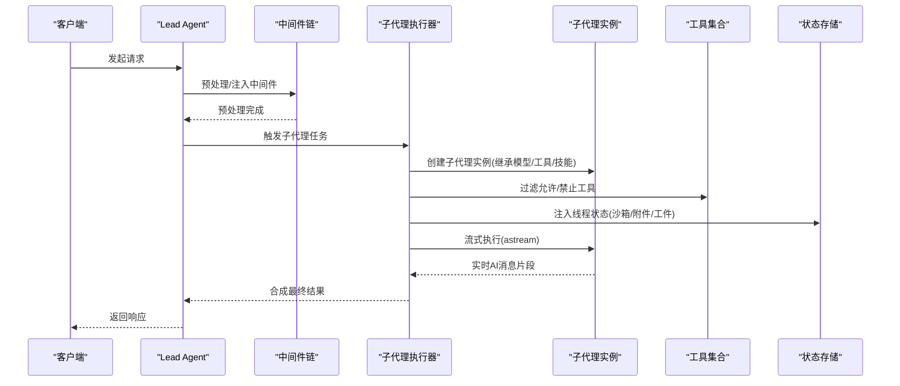
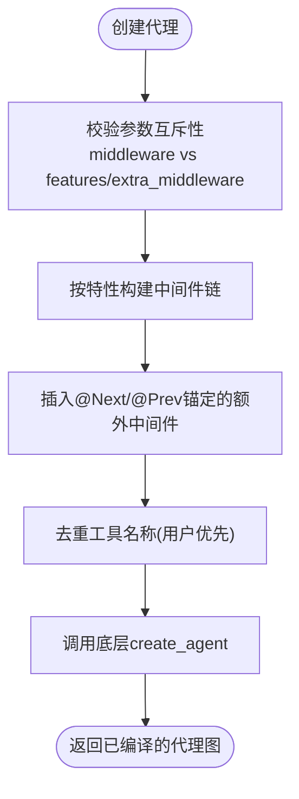
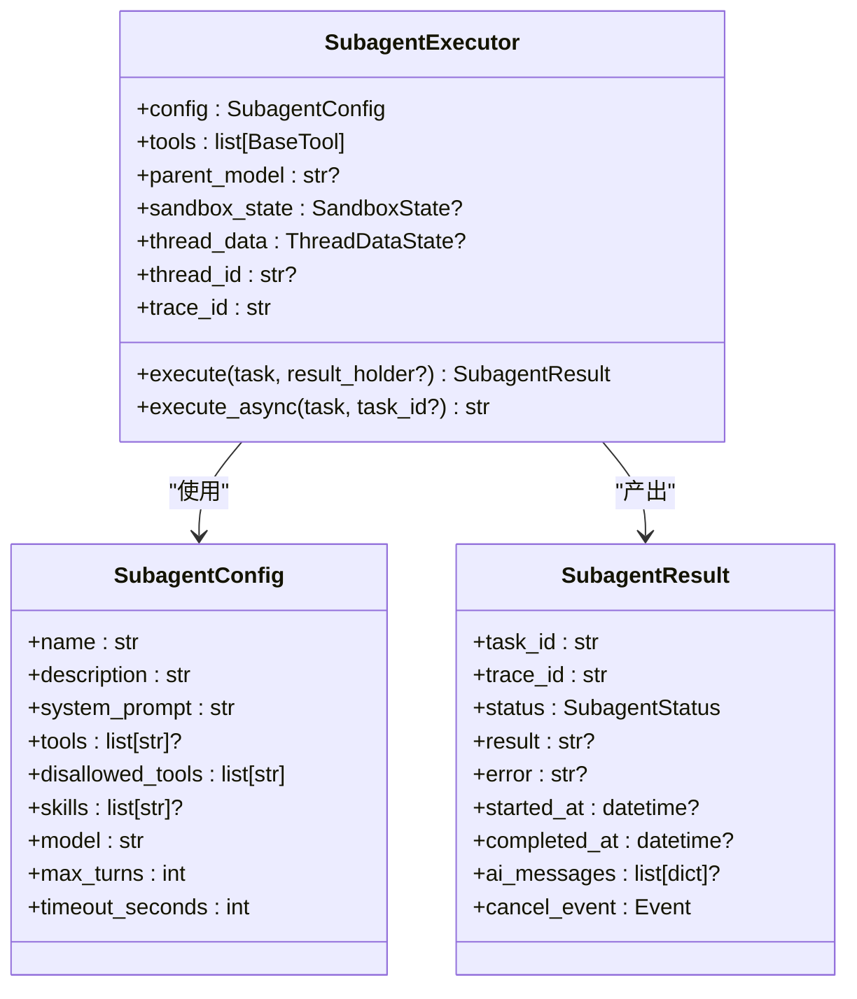
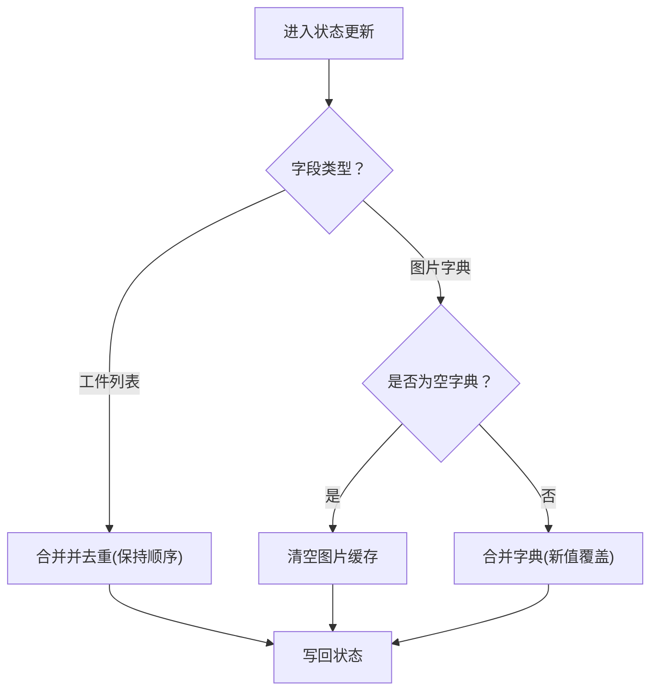
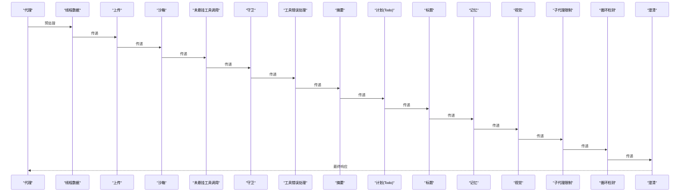
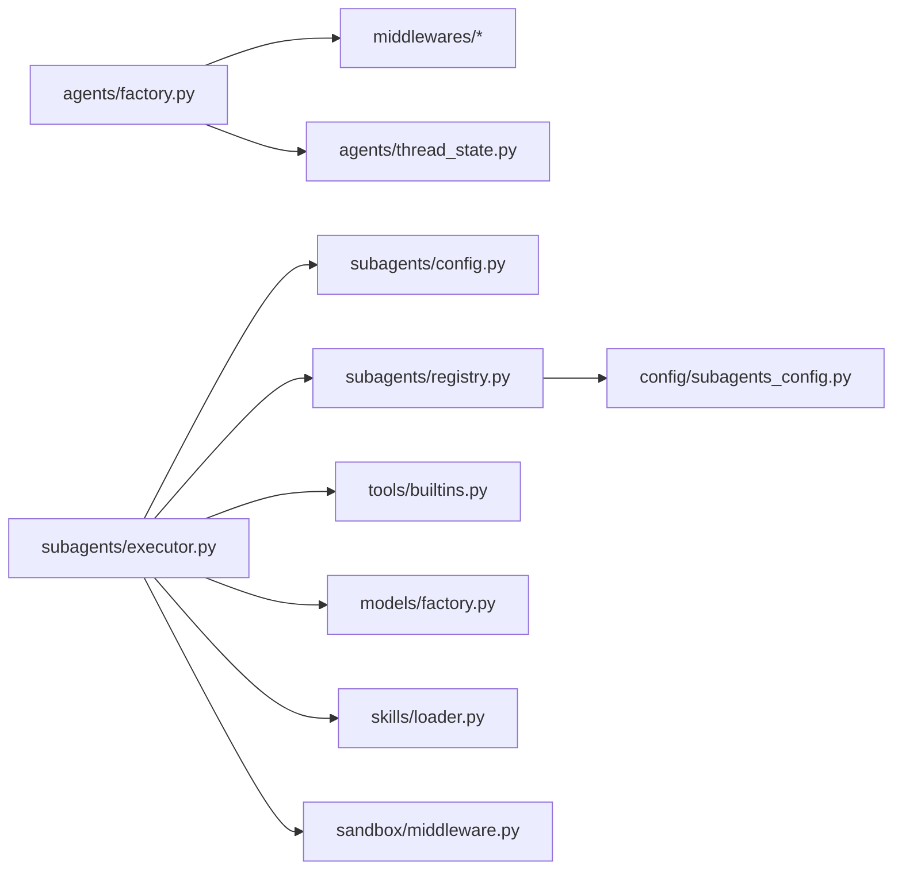

# 代理系统

<cite>
**本文引用的文件**
- [agents/__init__.py](file://backend/packages/harness/deerflow/agents/__init__.py)
- [agents/factory.py](file://backend/packages/harness/deerflow/agents/factory.py)
- [agents/thread_state.py](file://backend/packages/harness/deerflow/agents/thread_state.py)
- [subagents/__init__.py](file://backend/packages/harness/deerflow/subagents/__init__.py)
- [subagents/config.py](file://backend/packages/harness/deerflow/subagents/config.py)
- [subagents/executor.py](file://backend/packages/harness/deerflow/subagents/executor.py)
- [subagents/registry.py](file://backend/packages/harness/deerflow/subagents/registry.py)
- [middlewares/tool_error_handling_middleware.py](file://backend/packages/harness/deerflow/agents/middlewares/tool_error_handling_middleware.py)
- [middlewares/clarification_middleware.py](file://backend/packages/harness/deerflow/agents/middlewares/clarification_middleware.py)
- [middlewares/thread_data_middleware.py](file://backend/packages/harness/deerflow/agents/middlewares/thread_data_middleware.py)
- [middlewares/uploads_middleware.py](file://backend/packages/harness/deerflow/agents/middlewares/uploads_middleware.py)
- [middlewares/view_image_middleware.py](file://backend/packages/harness/deerflow/agents/middlewares/view_image_middleware.py)
- [middlewares/memory_middleware.py](file://backend/packages/harness/deerflow/agents/middlewares/memory_middleware.py)
- [middlewares/title_middleware.py](file://backend/packages/harness/deerflow/agents/middlewares/title_middleware.py)
- [middlewares/subagent_limit_middleware.py](file://backend/packages/harness/deerflow/agents/middlewares/subagent_limit_middleware.py)
- [middlewares/loop_detection_middleware.py](file://backend/packages/harness/deerflow/agents/middlewares/loop_detection_middleware.py)
- [middlewares/todo_middleware.py](file://backend/packages/harness/deerflow/agents/middlewares/todo_middleware.py)
- [sandbox/middleware.py](file://backend/packages/harness/deerflow/sandbox/middleware.py)
- [tools/builtins.py](file://backend/packages/harness/deerflow/tools/builtins.py)
- [models/factory.py](file://backend/packages/harness/deerflow/models/factory.py)
- [skills/loader.py](file://backend/packages/harness/deerflow/skills/loader.py)
- [config/subagents_config.py](file://backend/packages/harness/deerflow/config/subagents_config.py)
</cite>

## 目录
1. [简介](#简介)
2. [项目结构](#项目结构)
3. [核心组件](#核心组件)
4. [架构总览](#架构总览)
5. [详细组件分析](#详细组件分析)
6. [依赖分析](#依赖分析)
7. [性能考虑](#性能考虑)
8. [故障排查指南](#故障排查指南)
9. [结论](#结论)
10. [附录](#附录)

## 简介
本文件面向DeerFlow代理系统，聚焦以下目标：
- Lead Agent主代理的设计原理与实现要点
- Sub-Agents子代理机制：编排逻辑、并行执行与结果合成
- 线程状态管理：会话跟踪、状态持久化与并发控制
- 中间件链处理：请求预处理、工具调用拦截与响应后处理
- 代理间通信协议与数据交换格式
- 代理定制与扩展：自定义代理开发与配置调整最佳实践

## 项目结构
本项目采用“包内模块化+功能域划分”的组织方式，核心位于backend/packages/harness/deerflow下，按功能域拆分为agents（代理）、subagents（子代理）、middlewares（中间件）、sandbox（沙箱）、tools（工具）、models（模型）、skills（技能）等子包；同时在backend/app/gateway与backend/docs中提供网关路由、配置与文档。

```mermaid
graph TB
subgraph "代理层"
A1["agents/__init__.py"]
A2["agents/factory.py"]
A3["agents/thread_state.py"]
end
subgraph "子代理层"
S1["subagents/__init__.py"]
S2["subagents/config.py"]
S3["subagents/executor.py"]
S4["subagents/registry.py"]
end
subgraph "中间件层"
M1["middlewares/tool_error_handling_middleware.py"]
M2["middlewares/clarification_middleware.py"]
M3["middlewares/thread_data_middleware.py"]
M4["middlewares/uploads_middleware.py"]
M5["middlewares/view_image_middleware.py"]
M6["middlewares/memory_middleware.py"]
M7["middlewares/title_middleware.py"]
M8["middlewares/subagent_limit_middleware.py"]
M9["middlewares/loop_detection_middleware.py"]
M10["middlewares/todo_middleware.py"]
end
subgraph "运行时支撑"
R1["sandbox/middleware.py"]
R2["tools/builtins.py"]
R3["models/factory.py"]
R4["skills/loader.py"]
R5["config/subagents_config.py"]
end
A2 --> S3
A2 --> M1
A2 --> M2
A2 --> M3
A2 --> M4
A2 --> M5
A2 --> M6
A2 --> M7
A2 --> M8
A2 --> M9
A2 --> M10
S3 --> S2
S3 --> S4
S3 --> R1
S3 --> R2
S3 --> R3
S3 --> R4
S4 --> R5
```

图示来源
- [agents/__init__.py:1-25](file://backend/packages/harness/deerflow/agents/__init__.py#L1-L25)
- [agents/factory.py:1-375](file://backend/packages/harness/deerflow/agents/factory.py#L1-L375)
- [agents/thread_state.py:1-56](file://backend/packages/harness/deerflow/agents/thread_state.py#L1-L56)
- [subagents/__init__.py:1-13](file://backend/packages/harness/deerflow/subagents/__init__.py#L1-L13)
- [subagents/config.py:1-32](file://backend/packages/harness/deerflow/subagents/config.py#L1-L32)
- [subagents/executor.py:1-677](file://backend/packages/harness/deerflow/subagents/executor.py#L1-L677)
- [subagents/registry.py:1-162](file://backend/packages/harness/deerflow/subagents/registry.py#L1-L162)
- [middlewares/tool_error_handling_middleware.py](file://backend/packages/harness/deerflow/agents/middlewares/tool_error_handling_middleware.py)
- [middlewares/clarification_middleware.py](file://backend/packages/harness/deerflow/agents/middlewares/clarification_middleware.py)
- [middlewares/thread_data_middleware.py](file://backend/packages/harness/deerflow/agents/middlewares/thread_data_middleware.py)
- [middlewares/uploads_middleware.py](file://backend/packages/harness/deerflow/agents/middlewares/uploads_middleware.py)
- [middlewares/view_image_middleware.py](file://backend/packages/harness/deerflow/agents/middlewares/view_image_middleware.py)
- [middlewares/memory_middleware.py](file://backend/packages/harness/deerflow/agents/middlewares/memory_middleware.py)
- [middlewares/title_middleware.py](file://backend/packages/harness/deerflow/agents/middlewares/title_middleware.py)
- [middlewares/subagent_limit_middleware.py](file://backend/packages/harness/deerflow/agents/middlewares/subagent_limit_middleware.py)
- [middlewares/loop_detection_middleware.py](file://backend/packages/harness/deerflow/agents/middlewares/loop_detection_middleware.py)
- [middlewares/todo_middleware.py](file://backend/packages/harness/deerflow/agents/middlewares/todo_middleware.py)
- [sandbox/middleware.py](file://backend/packages/harness/deerflow/sandbox/middleware.py)
- [tools/builtins.py](file://backend/packages/harness/deerflow/tools/builtins.py)
- [models/factory.py](file://backend/packages/harness/deerflow/models/factory.py)
- [skills/loader.py](file://backend/packages/harness/deerflow/skills/loader.py)
- [config/subagents_config.py](file://backend/packages/harness/deerflow/config/subagents_config.py)

章节来源
- [agents/__init__.py:1-25](file://backend/packages/harness/deerflow/agents/__init__.py#L1-L25)
- [agents/factory.py:1-375](file://backend/packages/harness/deerflow/agents/factory.py#L1-L375)
- [subagents/__init__.py:1-13](file://backend/packages/harness/deerflow/subagents/__init__.py#L1-L13)

## 核心组件
- Lead Agent工厂与特征装配：通过纯参数工厂创建代理，支持特性开关与可插拔中间件链，确保可配置性与可扩展性。
- 子代理执行引擎：提供异步/同步执行、超时控制、取消信号、并发调度与结果存储，支持技能注入与沙箱上下文传递。
- 线程状态模型：统一承载会话元数据、工件列表、待办事项、上传文件、查看过的图片等，提供合并策略以保证一致性。
- 中间件链：覆盖沙箱基础设施、工具错误处理、守卫、摘要、标题、记忆、视觉、子代理限制、循环检测与澄清等环节。
- 配置与注册：内置子代理与自定义子代理合并，支持按代理粒度覆盖超时、轮次、模型与技能集。

章节来源
- [agents/factory.py:61-147](file://backend/packages/harness/deerflow/agents/factory.py#L61-L147)
- [subagents/executor.py:128-186](file://backend/packages/harness/deerflow/subagents/executor.py#L128-L186)
- [agents/thread_state.py:48-56](file://backend/packages/harness/deerflow/agents/thread_state.py#L48-L56)
- [subagents/registry.py:42-111](file://backend/packages/harness/deerflow/subagents/registry.py#L42-L111)

## 架构总览
下图展示Lead Agent与子代理的交互关系、中间件链的顺序与职责边界，以及状态在执行过程中的流转。

图示来源
- [agents/factory.py:155-293](file://backend/packages/harness/deerflow/agents/factory.py#L155-L293)
- [subagents/executor.py:169-185](file://backend/packages/harness/deerflow/subagents/executor.py#L169-L185)
- [subagents/executor.py:273-443](file://backend/packages/harness/deerflow/subagents/executor.py#L273-L443)
- [agents/thread_state.py:48-56](file://backend/packages/harness/deerflow/agents/thread_state.py#L48-L56)

## 详细组件分析

### Lead Agent主代理设计与实现
- 工厂入口：create_deerflow_agent接受模型、工具、系统提示、中间件、特性标志、额外中间件、计划模式、状态模式、检查点等参数，形成纯参数装配，避免全局单例与YAML耦合。
- 特性装配：_assemble_from_features根据RuntimeFeatures按固定顺序组装中间件链，并支持额外中间件通过@Next/@Prev锚定插入，确保ClarificationMiddleware始终位于末尾。
- 状态与持久化：默认使用ThreadState作为状态模式，可注入检查点保存器以实现会话持久化。
- 工具去重：用户提供的工具优先于特性注入的工具，避免重复。

图示来源
- [agents/factory.py:110-147](file://backend/packages/harness/deerflow/agents/factory.py#L110-L147)
- [agents/factory.py:155-293](file://backend/packages/harness/deerflow/agents/factory.py#L155-L293)
- [agents/factory.py:301-375](file://backend/packages/harness/deerflow/agents/factory.py#L301-L375)

章节来源
- [agents/factory.py:61-147](file://backend/packages/harness/deerflow/agents/factory.py#L61-L147)
- [agents/factory.py:155-293](file://backend/packages/harness/deerflow/agents/factory.py#L155-L293)

### 子代理机制：编排、并行与结果合成
- 配置模型：SubagentConfig定义子代理的唯一标识、描述、系统提示、工具白/黑名单、技能集、模型继承策略、最大轮次与超时秒数。
- 执行器：SubagentExecutor负责创建子代理、过滤工具、加载技能内容、构建初始状态（含沙箱与线程数据透传）、流式执行并收集AI消息、合成最终结果、处理异常与取消。
- 并行与并发：使用三个线程池（调度、执行、隔离事件循环）与全局任务表管理后台任务，支持最大并发限制与超时取消。
- 结果合成：对AIMessage内容进行类型处理（字符串或块列表），拼接文本块生成最终结果；若无AI消息则回退到最后一条消息。

图示来源
- [subagents/config.py:6-32](file://backend/packages/harness/deerflow/subagents/config.py#L6-L32)
- [subagents/executor.py:37-66](file://backend/packages/harness/deerflow/subagents/executor.py#L37-L66)
- [subagents/executor.py:128-186](file://backend/packages/harness/deerflow/subagents/executor.py#L128-L186)

章节来源
- [subagents/config.py:6-32](file://backend/packages/harness/deerflow/subagents/config.py#L6-L32)
- [subagents/executor.py:128-186](file://backend/packages/harness/deerflow/subagents/executor.py#L128-L186)
- [subagents/executor.py:273-443](file://backend/packages/harness/deerflow/subagents/executor.py#L273-L443)

### 线程状态管理：会话跟踪、状态持久化与并发控制
- 状态模型：ThreadState继承AgentState，包含沙箱状态、线程数据、标题、工件列表、待办、上传文件、查看过的图片等字段，并提供合并函数以保证有序去重。
- 合并策略：工件列表合并去重；图片字典合并，空字典表示清空已有图片，新值覆盖旧值。
- 持久化：通过检查点保存器（checkpointer）与LangGraph状态图实现会话持久化；线程ID透传至运行配置以支持多会话隔离。
- 并发控制：后台任务表与锁保护共享状态；取消事件采用协作式中断，在流式迭代边界生效。

图示来源
- [agents/thread_state.py:21-45](file://backend/packages/harness/deerflow/agents/thread_state.py#L21-L45)

章节来源
- [agents/thread_state.py:48-56](file://backend/packages/harness/deerflow/agents/thread_state.py#L48-L56)
- [subagents/executor.py:300-324](file://backend/packages/harness/deerflow/subagents/executor.py#L300-L324)

### 中间件链处理机制：预处理、工具拦截与后处理
- 固定顺序（内置）：线程数据 → 上传 → 沙箱 → 未悬挂工具调用 → 守卫 → 工具错误处理 → 摘要 → 计划（Todo） → 标题 → 记忆 → 视觉 → 子代理限制 → 循环检测 → 澄清。
- 可插拔：通过@Next/@Prev锚定插入额外中间件，确保澄清中间件始终在末尾。
- 关键中间件职责：
  - 工具错误处理：捕获并规范化工具异常，避免中断流程。
  - 澄清：在最后阶段引导用户提供更明确指令。
  - 线程数据/上传/沙箱：提供工作区、上传目录、输出目录与沙箱上下文。
  - 视觉：启用图像能力时注入视图工具。
  - 子代理限制：限制子代理并发与调用频次。
  - 循环检测：防止代理陷入无限递归或重复对话。
  - 记忆/标题：维护上下文与自动标题生成。

图示来源
- [agents/factory.py:164-178](file://backend/packages/harness/deerflow/agents/factory.py#L164-L178)
- [agents/factory.py:284-293](file://backend/packages/harness/deerflow/agents/factory.py#L284-L293)

章节来源
- [agents/factory.py:155-293](file://backend/packages/harness/deerflow/agents/factory.py#L155-L293)
- [middlewares/tool_error_handling_middleware.py](file://backend/packages/harness/deerflow/agents/middlewares/tool_error_handling_middleware.py)
- [middlewares/clarification_middleware.py](file://backend/packages/harness/deerflow/agents/middlewares/clarification_middleware.py)
- [middlewares/thread_data_middleware.py](file://backend/packages/harness/deerflow/agents/middlewares/thread_data_middleware.py)
- [middlewares/uploads_middleware.py](file://backend/packages/harness/deerflow/agents/middlewares/uploads_middleware.py)
- [middlewares/view_image_middleware.py](file://backend/packages/harness/deerflow/agents/middlewares/view_image_middleware.py)
- [middlewares/memory_middleware.py](file://backend/packages/harness/deerflow/agents/middlewares/memory_middleware.py)
- [middlewares/title_middleware.py](file://backend/packages/harness/deerflow/agents/middlewares/title_middleware.py)
- [middlewares/subagent_limit_middleware.py](file://backend/packages/harness/deerflow/agents/middlewares/subagent_limit_middleware.py)
- [middlewares/loop_detection_middleware.py](file://backend/packages/harness/deerflow/agents/middlewares/loop_detection_middleware.py)
- [middlewares/todo_middleware.py](file://backend/packages/harness/deerflow/agents/middlewares/todo_middleware.py)

### 代理间通信协议与数据交换格式
- 请求/响应：通过LangGraph的astream/values流模式进行增量消息推送，便于实时更新与取消协作。
- 状态传递：子代理从父代理接收ThreadState（含沙箱、线程数据、工件、图片等），并在执行期间增量更新。
- 工具调用：工具名称白/黑名单由子代理配置决定，执行前进行过滤；工具错误通过中间件统一处理。
- 分布式追踪：子代理生成独立trace_id并与父代理关联，便于日志聚合与问题定位。

章节来源
- [subagents/executor.py:314-361](file://backend/packages/harness/deerflow/subagents/executor.py#L314-L361)
- [subagents/executor.py:243-271](file://backend/packages/harness/deerflow/subagents/executor.py#L243-L271)
- [agents/thread_state.py:48-56](file://backend/packages/harness/deerflow/agents/thread_state.py#L48-L56)

### 代理定制与扩展最佳实践
- 自定义子代理：在配置中定义custom_agents，覆盖描述、系统提示、工具白/黑名单、技能集、模型、最大轮次与超时；支持按代理粒度覆盖全局默认值。
- 子代理注册：内置子代理与自定义子代理合并，暴露可用子代理列表；根据沙箱权限动态过滤高危子代理（如bash）。
- 中间件扩展：通过@Next/@Prev锚定插入自定义中间件，确保与内置链路兼容；避免同时指定middleware与features/extra_middleware。
- 工具与技能：子代理可按需加载技能内容作为系统消息注入，避免污染系统提示文本；工具优先级遵循用户显式提供 > 特性注入。
- 模型与检查点：子代理支持模型继承或独立配置；可通过检查点保存器实现状态持久化与恢复。

章节来源
- [subagents/registry.py:42-111](file://backend/packages/harness/deerflow/subagents/registry.py#L42-L111)
- [subagents/registry.py:127-162](file://backend/packages/harness/deerflow/subagents/registry.py#L127-L162)
- [agents/factory.py:110-118](file://backend/packages/harness/deerflow/agents/factory.py#L110-L118)
- [subagents/executor.py:169-185](file://backend/packages/harness/deerflow/subagents/executor.py#L169-L185)
- [skills/loader.py](file://backend/packages/harness/deerflow/skills/loader.py)

## 依赖分析
- 组件耦合：SubagentExecutor依赖工具、模型工厂、沙箱中间件、技能加载器与线程状态；工厂依赖中间件与特性模块。
- 外部依赖：LangChain代理创建器、LangGraph状态图与检查点、异步流式执行接口。
- 潜在环路：中间件插入算法通过锚定与冲突检测避免循环依赖；子代理并发受全局限制，清理仅在终止态进行。

图示来源
- [agents/factory.py:155-293](file://backend/packages/harness/deerflow/agents/factory.py#L155-L293)
- [subagents/executor.py:128-186](file://backend/packages/harness/deerflow/subagents/executor.py#L128-L186)
- [subagents/registry.py:42-111](file://backend/packages/harness/deerflow/subagents/registry.py#L42-L111)

章节来源
- [agents/factory.py:155-293](file://backend/packages/harness/deerflow/agents/factory.py#L155-L293)
- [subagents/executor.py:128-186](file://backend/packages/harness/deerflow/subagents/executor.py#L128-L186)
- [subagents/registry.py:42-111](file://backend/packages/harness/deerflow/subagents/registry.py#L42-L111)

## 性能考虑
- 并发与资源：子代理执行池大小与调度池大小需结合系统负载与I/O密集度调整；隔离事件循环线程池用于避免父事件循环冲突。
- 超时与取消：为每个子代理设置合理超时；协作式取消在流式边界生效，避免强制中断导致资源泄漏。
- 工具与技能：工具过滤与技能加载在独立线程执行，避免阻塞主事件循环；技能内容按需加载并缓存。
- 状态更新：合并策略避免重复消息与无序状态；检查点保存应选择低延迟后端以减少阻塞。

## 故障排查指南
- 工具错误：检查工具名称是否在白名单中，确认工具实现与权限；通过工具错误处理中间件查看异常堆栈。
- 子代理超时/取消：确认超时配置与轮次限制；检查取消事件是否在流式边界被检测到。
- 中间件冲突：若使用@Next/@Prev，请确保锚定类型唯一且不产生循环；ClarificationMiddleware必须位于末尾。
- 状态异常：核对ThreadState字段合并逻辑，确认图片清空与工件去重是否符合预期。
- 沙箱与权限：确认沙箱中间件初始化与宿主机命令权限；必要时移除高风险子代理。

章节来源
- [middlewares/tool_error_handling_middleware.py](file://backend/packages/harness/deerflow/agents/middlewares/tool_error_handling_middleware.py)
- [subagents/executor.py:564-593](file://backend/packages/harness/deerflow/subagents/executor.py#L564-L593)
- [agents/factory.py:301-375](file://backend/packages/harness/deerflow/agents/factory.py#L301-L375)
- [agents/thread_state.py:21-45](file://backend/packages/harness/deerflow/agents/thread_state.py#L21-L45)
- [sandbox/middleware.py](file://backend/packages/harness/deerflow/sandbox/middleware.py)

## 结论
DeerFlow代理系统通过纯参数工厂、可插拔中间件链与子代理执行引擎，实现了高可配置、可扩展与可观测的智能体编排。线程状态模型与检查点机制保障了会话一致性与持久化；子代理并发与超时控制确保了鲁棒性；中间件链覆盖从预处理到后处理的全生命周期。基于本文档的指导，用户可在不破坏核心链路的前提下，安全地定制与扩展代理能力。

## 附录
- 关键API与路径参考
  - [agents/factory.py:61-147](file://backend/packages/harness/deerflow/agents/factory.py#L61-L147)
  - [subagents/executor.py:128-186](file://backend/packages/harness/deerflow/subagents/executor.py#L128-L186)
  - [agents/thread_state.py:48-56](file://backend/packages/harness/deerflow/agents/thread_state.py#L48-L56)
  - [subagents/registry.py:42-111](file://backend/packages/harness/deerflow/subagents/registry.py#L42-L111)
  - [middlewares/tool_error_handling_middleware.py](file://backend/packages/harness/deerflow/agents/middlewares/tool_error_handling_middleware.py)
  - [middlewares/clarification_middleware.py](file://backend/packages/harness/deerflow/agents/middlewares/clarification_middleware.py)
  - [tools/builtins.py](file://backend/packages/harness/deerflow/tools/builtins.py)
  - [models/factory.py](file://backend/packages/harness/deerflow/models/factory.py)
  - [skills/loader.py](file://backend/packages/harness/deerflow/skills/loader.py)
  - [config/subagents_config.py](file://backend/packages/harness/deerflow/config/subagents_config.py)