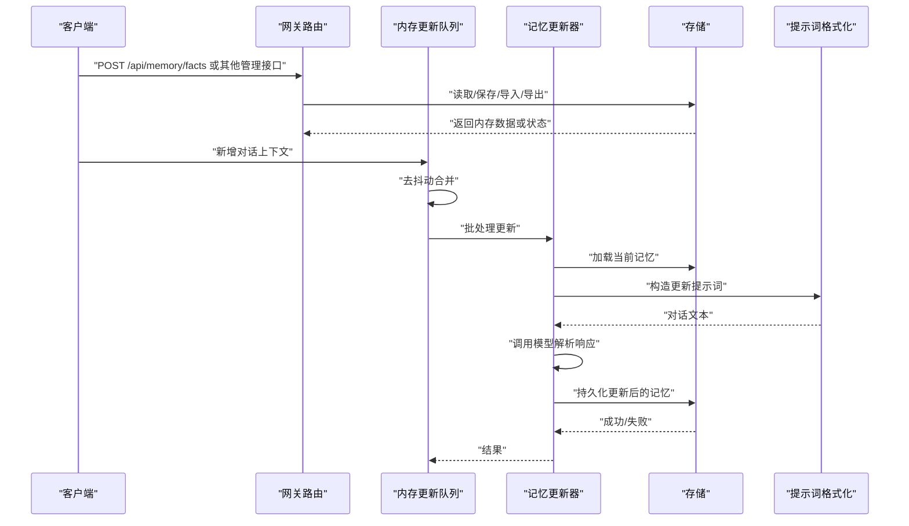
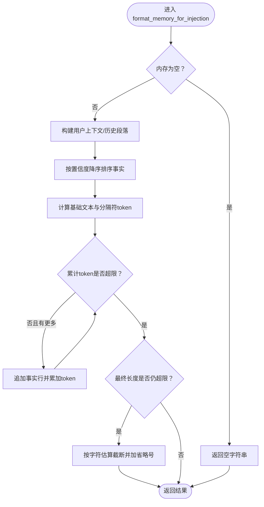
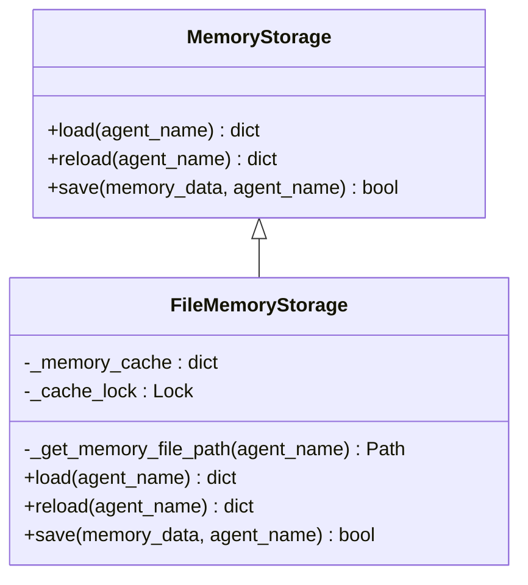
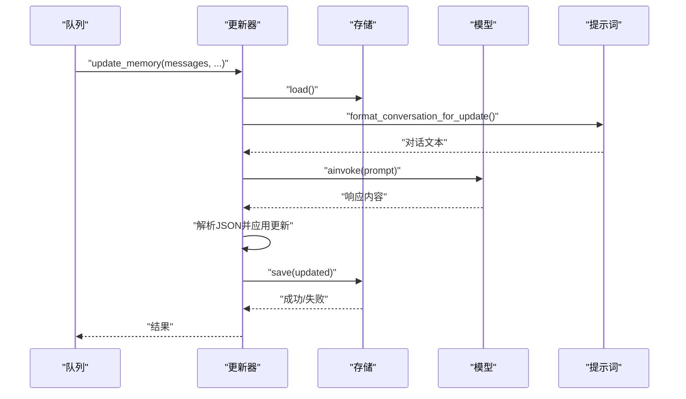
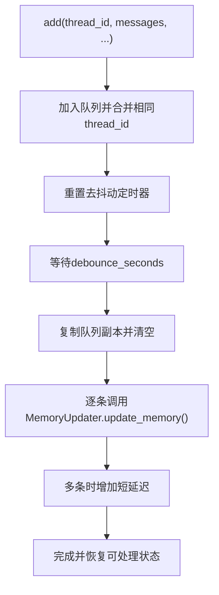
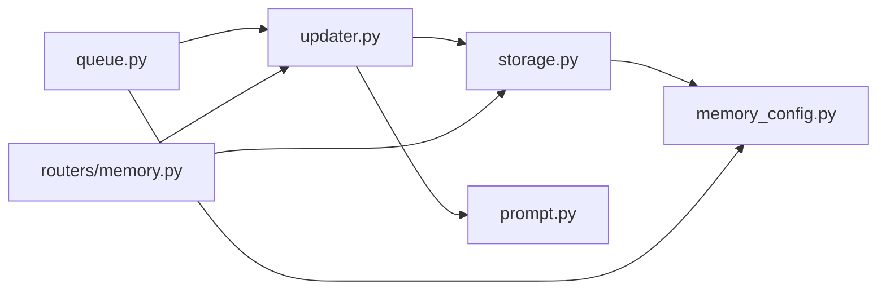

# 内存和上下文工程

<cite>
**本文引用的文件**
- [backend/docs/MEMORY_IMPROVEMENTS.md](file://backend/docs/MEMORY_IMPROVEMENTS.md)
- [backend/docs/MEMORY_IMPROVEMENTS_SUMMARY.md](file://backend/docs/MEMORY_IMPROVEMENTS_SUMMARY.md)
- [backend/docs/MEMORY_SETTINGS_REVIEW.md](file://backend/docs/MEMORY_SETTINGS_REVIEW.md)
- [backend/packages/harness/deerflow/agents/memory/prompt.py](file://backend/packages/harness/deerflow/agents/memory/prompt.py)
- [backend/packages/harness/deerflow/agents/memory/storage.py](file://backend/packages/harness/deerflow/agents/memory/storage.py)
- [backend/packages/harness/deerflow/agents/memory/queue.py](file://backend/packages/harness/deerflow/agents/memory/queue.py)
- [backend/packages/harness/deerflow/agents/memory/updater.py](file://backend/packages/harness/deerflow/agents/memory/updater.py)
- [backend/packages/harness/deerflow/config/memory_config.py](file://backend/packages/harness/deerflow/config/memory_config.py)
- [backend/app/gateway/routers/memory.py](file://backend/app/gateway/routers/memory.py)
</cite>

## 目录
1. [引言](#引言)
2. [项目结构](#项目结构)
3. [核心组件](#核心组件)
4. [架构总览](#架构总览)
5. [详细组件分析](#详细组件分析)
6. [依赖分析](#依赖分析)
7. [性能考虑](#性能考虑)
8. [故障排查指南](#故障排查指南)
9. [结论](#结论)
10. [附录](#附录)

## 引言
本文件面向DeerFlow的“内存与上下文工程”系统，系统性梳理其内存架构设计、长期记忆实现、上下文压缩与注入机制、记忆配置管理、最佳实践与性能调优，并说明与代理执行的协同工作方式。文档以仓库现有实现为依据，结合官方文档与测试用例，帮助开发者与运维人员快速理解并高效使用该系统。

## 项目结构
内存与上下文工程相关代码主要分布在以下模块：
- 配置层：内存配置模型与全局读取
- 存储层：内存数据的加载、缓存、持久化
- 更新器：基于对话内容的LLM驱动的记忆更新
- 队列：带去抖动的批量处理与并发控制
- 提示词：记忆格式化与注入、事实抽取
- 网关路由：对外暴露的内存管理API

```mermaid
graph TB
subgraph "配置"
C1["memory_config.py<br/>MemoryConfig"]
end
subgraph "存储"
S1["storage.py<br/>MemoryStorage/FileMemoryStorage"]
end
subgraph "更新"
U1["updater.py<br/>MemoryUpdater"]
P1["prompt.py<br/>format_memory_for_injection/format_conversation_for_update"]
end
subgraph "队列"
Q1["queue.py<br/>MemoryUpdateQueue/ConversationContext"]
end
subgraph "网关"
R1["routers/memory.py<br/>FastAPI 路由"]
end
C1 --> S1
C1 --> U1
C1 --> Q1
S1 <- --> U1
P1 --> U1
Q1 --> U1
R1 --> U1
R1 --> S1
```

图表来源
- [backend/packages/harness/deerflow/config/memory_config.py:6-62](file://backend/packages/harness/deerflow/config/memory_config.py#L6-L62)
- [backend/packages/harness/deerflow/agents/memory/storage.py:43-216](file://backend/packages/harness/deerflow/agents/memory/storage.py#L43-L216)
- [backend/packages/harness/deerflow/agents/memory/updater.py:299-564](file://backend/packages/harness/deerflow/agents/memory/updater.py#L299-L564)
- [backend/packages/harness/deerflow/agents/memory/prompt.py:201-363](file://backend/packages/harness/deerflow/agents/memory/prompt.py#L201-L363)
- [backend/packages/harness/deerflow/agents/memory/queue.py:27-266](file://backend/packages/harness/deerflow/agents/memory/queue.py#L27-L266)
- [backend/app/gateway/routers/memory.py:1-354](file://backend/app/gateway/routers/memory.py#L1-L354)

章节来源
- [backend/packages/harness/deerflow/config/memory_config.py:1-83](file://backend/packages/harness/deerflow/config/memory_config.py#L1-L83)
- [backend/packages/harness/deerflow/agents/memory/storage.py:1-217](file://backend/packages/harness/deerflow/agents/memory/storage.py#L1-L217)
- [backend/packages/harness/deerflow/agents/memory/updater.py:1-565](file://backend/packages/harness/deerflow/agents/memory/updater.py#L1-L565)
- [backend/packages/harness/deerflow/agents/memory/prompt.py:1-364](file://backend/packages/harness/deerflow/agents/memory/prompt.py#L1-L364)
- [backend/packages/harness/deerflow/agents/memory/queue.py:1-267](file://backend/packages/harness/deerflow/agents/memory/queue.py#L1-L267)
- [backend/app/gateway/routers/memory.py:1-354](file://backend/app/gateway/routers/memory.py#L1-L354)

## 核心组件
- 内存配置（MemoryConfig）：集中定义启用开关、存储路径/类、去抖动时长、最大事实数、事实置信阈值、是否注入、注入最大token等参数。
- 存储（MemoryStorage/FileMemoryStorage）：抽象存储接口与文件实现；支持按代理名隔离存储；内置缓存与mtime校验；写入采用临时文件+原子替换；线程安全。
- 更新器（MemoryUpdater）：负责加载当前记忆、构造更新提示词、调用模型、解析响应、应用变更、持久化；支持同步/异步；内置上传事件清理、事实去重与上限裁剪。
- 队列（MemoryUpdateQueue）：聚合多轮对话上下文，通过去抖动合并；后台定时器触发批处理；支持立即处理、刷新、清空；避免重复处理与竞态。
- 提示词（prompt.py）：格式化记忆注入文本（用户上下文、历史、事实），按置信度排序并受token预算约束；提供对话转更新文本工具。
- 网关路由（routers/memory.py）：提供获取/重载/清空、增删改查事实、导入导出、查询配置与状态等REST接口。

章节来源
- [backend/packages/harness/deerflow/config/memory_config.py:6-62](file://backend/packages/harness/deerflow/config/memory_config.py#L6-L62)
- [backend/packages/harness/deerflow/agents/memory/storage.py:43-216](file://backend/packages/harness/deerflow/agents/memory/storage.py#L43-L216)
- [backend/packages/harness/deerflow/agents/memory/updater.py:299-564](file://backend/packages/harness/deerflow/agents/memory/updater.py#L299-L564)
- [backend/packages/harness/deerflow/agents/memory/queue.py:27-266](file://backend/packages/harness/deerflow/agents/memory/queue.py#L27-L266)
- [backend/packages/harness/deerflow/agents/memory/prompt.py:201-363](file://backend/packages/harness/deerflow/agents/memory/prompt.py#L201-L363)
- [backend/app/gateway/routers/memory.py:1-354](file://backend/app/gateway/routers/memory.py#L1-L354)

## 架构总览
下图展示从对话到记忆更新、再到注入提示词的关键流程与组件交互。



图表来源
- [backend/app/gateway/routers/memory.py:191-286](file://backend/app/gateway/routers/memory.py#L191-L286)
- [backend/packages/harness/deerflow/agents/memory/queue.py:146-194](file://backend/packages/harness/deerflow/agents/memory/queue.py#L146-L194)
- [backend/packages/harness/deerflow/agents/memory/updater.py:390-455](file://backend/packages/harness/deerflow/agents/memory/updater.py#L390-L455)
- [backend/packages/harness/deerflow/agents/memory/storage.py:146-174](file://backend/packages/harness/deerflow/agents/memory/storage.py#L146-L174)
- [backend/packages/harness/deerflow/agents/memory/prompt.py:320-363](file://backend/packages/harness/deerflow/agents/memory/prompt.py#L320-L363)

## 详细组件分析

### 组件A：记忆注入与上下文压缩（prompt.py）
- 功能要点
  - 将用户上下文（工作、个人、当前关注）、历史（近期、早期、长期背景）、事实（按置信度降序）组织为结构化文本。
  - 使用tiktoken进行精确token计数，若不可用则回退字符估算；在达到预算后截断，确保不超过max_injection_tokens。
  - 对于category为“correction”的事实，保留sourceError字段以便后续避免重复错误。
- 复杂度与性能
  - 排序复杂度O(n log n)，逐行增量计数避免重复全量token化，整体近似O(n)增量拼接。
  - 截断采用字符级估算，保证最终长度安全。
- 错误处理
  - 对非字符串content与非法confidence进行过滤与归一化，防止污染排序与注入。



图表来源
- [backend/packages/harness/deerflow/agents/memory/prompt.py:201-317](file://backend/packages/harness/deerflow/agents/memory/prompt.py#L201-L317)

章节来源
- [backend/packages/harness/deerflow/agents/memory/prompt.py:163-317](file://backend/packages/harness/deerflow/agents/memory/prompt.py#L163-L317)

### 组件B：存储与缓存（storage.py）
- 功能要点
  - 抽象基类MemoryStorage定义load/reload/save接口；FileMemoryStorage提供文件实现。
  - 支持按代理名隔离存储，路径解析遵循配置与路径规范；不合法代理名将被拒绝。
  - 缓存策略：按agent_name键缓存(内存数据, 文件mtime)，读取时比较mtime决定是否命中；写入成功后更新缓存。
  - 持久化采用临时文件+原子替换，避免部分写入；异常时记录日志并返回失败。
- 并发与一致性
  - 全局缓存字典与锁保护，确保并发读写安全；写入前浅拷贝避免调用方对象被意外修改。
- 安全性
  - 严格校验代理名模式，防止路径穿越等风险。



图表来源
- [backend/packages/harness/deerflow/agents/memory/storage.py:43-216](file://backend/packages/harness/deerflow/agents/memory/storage.py#L43-L216)

章节来源
- [backend/packages/harness/deerflow/agents/memory/storage.py:62-174](file://backend/packages/harness/deerflow/agents/memory/storage.py#L62-L174)

### 组件C：记忆更新与事实管理（updater.py）
- 功能要点
  - 加载当前记忆、格式化对话文本、根据是否检测到纠正/强化信号插入提示语；调用模型解析JSON响应，应用更新并持久化。
  - 自动清理上传事件相关的句子，避免未来会话中搜索不存在的文件。
  - 事实去重：基于标准化content键；事实上限裁剪：按置信度保留Top N；最小置信度阈值过滤新事实。
- 并发与异步
  - 提供同步包装器，内部使用线程池执行协程，兼容同步/异步运行时；批处理时对多次更新增加小延迟避免限流。
- 错误处理
  - JSON解析失败、模型调用异常、存储失败均记录日志并返回False；对无效confidence/content抛出明确异常。



图表来源
- [backend/packages/harness/deerflow/agents/memory/updater.py:390-455](file://backend/packages/harness/deerflow/agents/memory/updater.py#L390-L455)
- [backend/packages/harness/deerflow/agents/memory/prompt.py:320-363](file://backend/packages/harness/deerflow/agents/memory/prompt.py#L320-L363)
- [backend/packages/harness/deerflow/agents/memory/storage.py:146-174](file://backend/packages/harness/deerflow/agents/memory/storage.py#L146-L174)

章节来源
- [backend/packages/harness/deerflow/agents/memory/updater.py:299-564](file://backend/packages/harness/deerflow/agents/memory/updater.py#L299-L564)

### 组件D：更新队列与批处理（queue.py）
- 功能要点
  - 去抖动：在配置的秒级窗口内合并同一线程的多次更新请求；定时器触发批处理。
  - 合并策略：同一thread_id的上下文会被覆盖合并，纠正/强化信号做布尔OR合并。
  - 并发控制：单实例全局队列，锁保护队列与定时器；避免重复处理；支持立即处理、刷新、清空。
- 可观测性
  - 记录队列大小、处理开始/结束、失败原因等日志，便于排障。



图表来源
- [backend/packages/harness/deerflow/agents/memory/queue.py:42-194](file://backend/packages/harness/deerflow/agents/memory/queue.py#L42-L194)

章节来源
- [backend/packages/harness/deerflow/agents/memory/queue.py:27-266](file://backend/packages/harness/deerflow/agents/memory/queue.py#L27-L266)

### 组件E：配置管理（memory_config.py）
- 关键参数
  - enabled：是否启用内存机制
  - storage_path/storage_class：存储路径与实现类
  - debounce_seconds：去抖动秒数
  - model_name：用于记忆更新的模型名称
  - max_facts：事实最大数量
  - fact_confidence_threshold：事实最低置信度阈值
  - injection_enabled/max_injection_tokens：是否注入及注入最大token
- 默认值与范围约束：通过Pydantic字段校验保障配置合法性。

章节来源
- [backend/packages/harness/deerflow/config/memory_config.py:6-62](file://backend/packages/harness/deerflow/config/memory_config.py#L6-L62)

### 组件F：API路由（routers/memory.py）
- 能力
  - 获取/重载/清空内存
  - 创建/删除/更新事实
  - 导入/导出内存
  - 查询配置与状态
- 数据模型
  - MemoryResponse、Fact、ContextSection等，统一输出结构，便于前端消费。

章节来源
- [backend/app/gateway/routers/memory.py:1-354](file://backend/app/gateway/routers/memory.py#L1-L354)

## 依赖分析
- 组件耦合
  - MemoryUpdater依赖MemoryStorage与prompt工具；依赖模型工厂创建聊天模型。
  - MemoryUpdateQueue依赖MemoryUpdater进行实际更新；依赖配置读取去抖动时间。
  - FileMemoryStorage依赖路径与配置模块；全局单例通过锁保护。
  - 网关路由直接依赖updater与storage函数，提供REST接口。
- 外部依赖
  - tiktoken：用于精确token计数；不可用时回退字符估算。
  - 模型服务：通过模型工厂创建；更新器负责调用与响应解析。
- 循环依赖
  - 队列在处理时动态导入更新器，避免循环导入。



图表来源
- [backend/packages/harness/deerflow/agents/memory/queue.py:148-149](file://backend/packages/harness/deerflow/agents/memory/queue.py#L148-L149)
- [backend/packages/harness/deerflow/agents/memory/updater.py:299-314](file://backend/packages/harness/deerflow/agents/memory/updater.py#L299-L314)
- [backend/packages/harness/deerflow/agents/memory/storage.py:181-216](file://backend/packages/harness/deerflow/agents/memory/storage.py#L181-L216)
- [backend/app/gateway/routers/memory.py:6-14](file://backend/app/gateway/routers/memory.py#L6-L14)

章节来源
- [backend/packages/harness/deerflow/agents/memory/queue.py:148-149](file://backend/packages/harness/deerflow/agents/memory/queue.py#L148-L149)
- [backend/packages/harness/deerflow/agents/memory/updater.py:299-314](file://backend/packages/harness/deerflow/agents/memory/updater.py#L299-L314)
- [backend/packages/harness/deerflow/agents/memory/storage.py:181-216](file://backend/packages/harness/deerflow/agents/memory/storage.py#L181-L216)
- [backend/app/gateway/routers/memory.py:6-14](file://backend/app/gateway/routers/memory.py#L6-L14)

## 性能考虑
- 缓存策略
  - FileMemoryStorage对每个agent_name维护(mtime, 内存数据)缓存，减少频繁IO；写入成功后原子替换并更新缓存，避免脏读。
- 去抖动与批处理
  - MemoryUpdateQueue通过debounce_seconds合并多次更新，降低LLM调用频次；批处理时对多条更新增加短延迟，缓解外部服务限流。
- 注入预算与截断
  - format_memory_for_injection先排序再增量计数，最后对超限结果进行字符级截断，兼顾准确性与性能。
- 线程池与并发
  - MemoryUpdater内部使用线程池执行协程，避免阻塞主线程；队列锁保护处理状态，避免重复处理。
- 建议
  - 根据对话密度调整debounce_seconds；合理设置max_injection_tokens与max_facts，平衡上下文质量与成本。
  - 在高并发场景下，适当增大线程池容量（注意模型侧限流）。

[本节为通用性能指导，无需特定文件引用]

## 故障排查指南
- 注入结果为空
  - 检查injection_enabled与max_injection_tokens；确认memory_data包含有效sections与facts。
- 事实未生效或被裁剪
  - 检查fact_confidence_threshold与max_facts；确认content标准化后未重复；查看日志中的“Failed to save”或“Failed to parse LLM response”。
- 存储失败
  - 查看存储路径权限、磁盘空间；确认临时文件写入与原子替换过程未被中断。
- 队列卡住或未处理
  - 检查队列日志与is_processing状态；必要时调用flush/flush_nowait强制处理。
- API报错
  - 确认请求体字段类型与范围（如confidence在0~1）；查看HTTP 4xx/5xx详情。

章节来源
- [backend/packages/harness/deerflow/agents/memory/prompt.py:201-317](file://backend/packages/harness/deerflow/agents/memory/prompt.py#L201-L317)
- [backend/packages/harness/deerflow/agents/memory/updater.py:420-425](file://backend/packages/harness/deerflow/agents/memory/updater.py#L420-L425)
- [backend/packages/harness/deerflow/agents/memory/storage.py:146-174](file://backend/packages/harness/deerflow/agents/memory/storage.py#L146-L174)
- [backend/packages/harness/deerflow/agents/memory/queue.py:195-205](file://backend/packages/harness/deerflow/agents/memory/queue.py#L195-L205)
- [backend/app/gateway/routers/memory.py:65-71](file://backend/app/gateway/routers/memory.py#L65-L71)

## 结论
DeerFlow的内存与上下文工程以“配置—存储—更新—队列—注入”为主线，形成闭环：配置驱动行为，存储保障一致性，更新器通过LLM增强记忆，队列优化吞吐，注入确保上下文质量与预算可控。当前已实现准确token计数、按置信度排序的事实注入、上传事件清理与事实上限裁剪；计划中的TF-IDF相似度召回与上下文感知评分将在后续版本落地，进一步提升检索精度与个性化水平。

[本节为总结性内容，无需特定文件引用]

## 附录

### 上下文工程最佳实践
- 信息组织
  - 明确区分用户上下文、历史与事实三类信息；优先保留高置信度、高相关性的事实。
- 检索优化
  - 控制max_injection_tokens与max_facts，避免上下文过长导致模型注意力分散；定期清理低置信度事实。
- 隐私保护
  - 自动清理上传事件相关描述；避免将临时文件路径或会话特有信息写入长期记忆。
- 个性化配置
  - 通过category与confidence引导模型学习用户偏好；利用correction类别记录并避免重复错误。

章节来源
- [backend/packages/harness/deerflow/agents/memory/prompt.py:201-317](file://backend/packages/harness/deerflow/agents/memory/prompt.py#L201-L317)
- [backend/packages/harness/deerflow/agents/memory/updater.py:267-287](file://backend/packages/harness/deerflow/agents/memory/updater.py#L267-L287)

### 记忆配置管理清单
- 必填项
  - enabled、storage_path、storage_class、debounce_seconds、max_facts、fact_confidence_threshold、injection_enabled、max_injection_tokens
- 建议范围
  - debounce_seconds：1–300；max_facts：10–500；fact_confidence_threshold：0–1；max_injection_tokens：100–8000
- 运维建议
  - 使用绝对路径存放memory.json，避免相对路径解析差异；定期备份与导入导出验证数据完整性。

章节来源
- [backend/packages/harness/deerflow/config/memory_config.py:6-62](file://backend/packages/harness/deerflow/config/memory_config.py#L6-L62)
- [backend/docs/MEMORY_SETTINGS_REVIEW.md:58-63](file://backend/docs/MEMORY_SETTINGS_REVIEW.md#L58-L63)

### 计划与现状对照
- 已实现
  - 精确token计数、事实按置信度注入、budget限制、上传事件清理
- 规划中
  - TF-IDF相似度召回、current_context输入、相似度与置信度加权、运行时上下文感知检索

章节来源
- [backend/docs/MEMORY_IMPROVEMENTS.md:7-55](file://backend/docs/MEMORY_IMPROVEMENTS.md#L7-L55)
- [backend/docs/MEMORY_IMPROVEMENTS_SUMMARY.md:8-38](file://backend/docs/MEMORY_IMPROVEMENTS_SUMMARY.md#L8-L38)