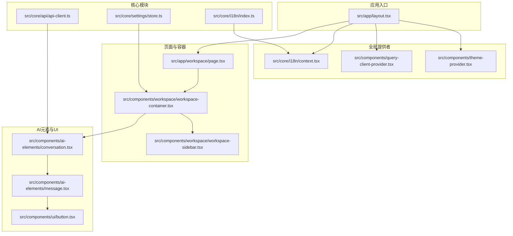
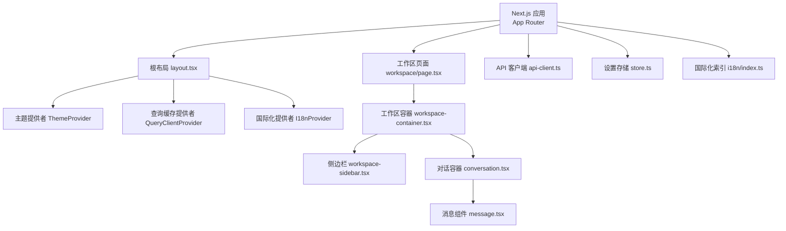
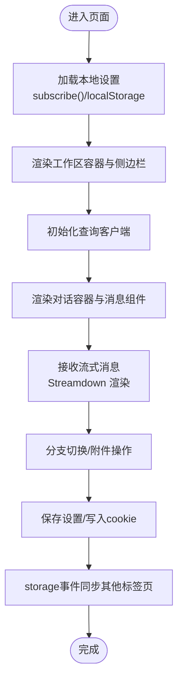
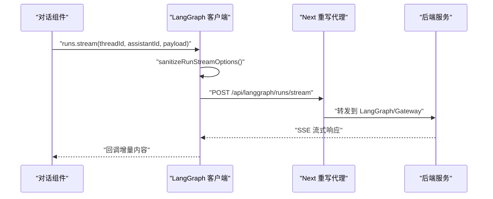
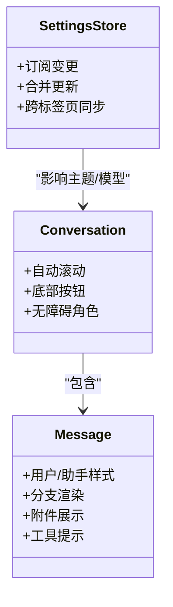
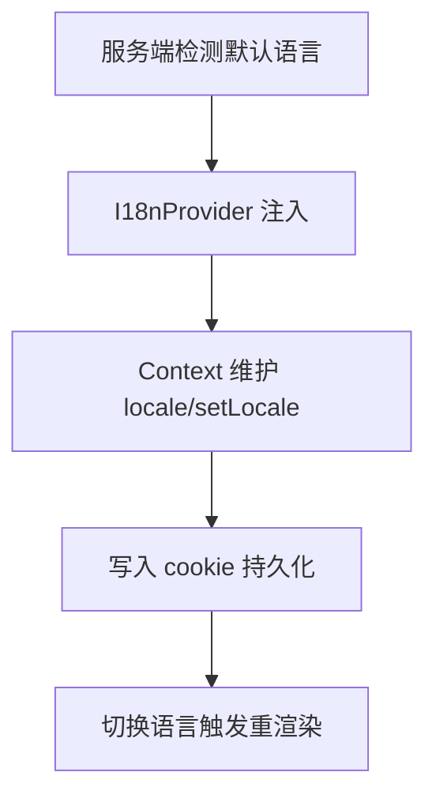
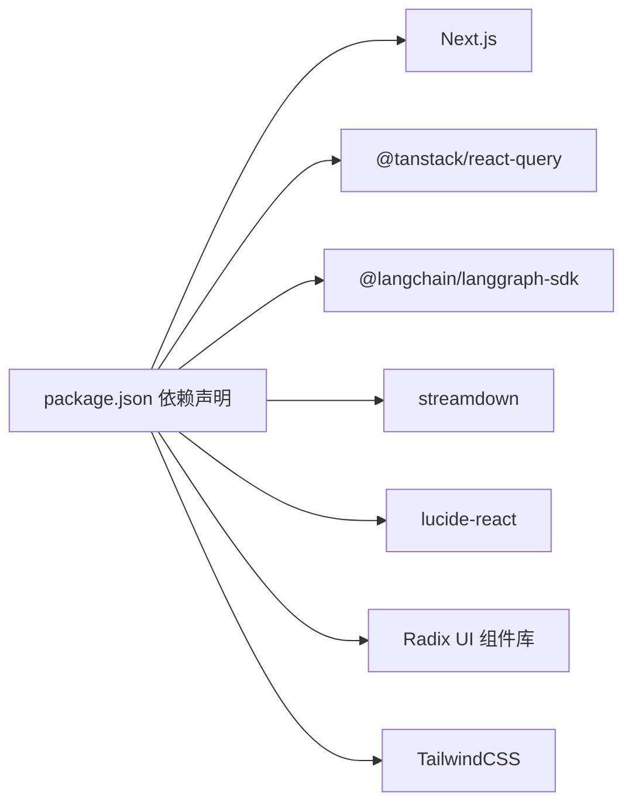

# 前端应用

<cite>
**本文引用的文件**
- [package.json](file://frontend/package.json)
- [next.config.js](file://frontend/next.config.js)
- [layout.tsx](file://frontend/src/app/layout.tsx)
- [query-client-provider.tsx](file://frontend/src/components/query-client-provider.tsx)
- [theme-provider.tsx](file://frontend/src/components/theme-provider.tsx)
- [context.tsx](file://frontend/src/core/i18n/context.tsx)
- [index.ts](file://frontend/src/core/i18n/index.ts)
- [translations.ts](file://frontend/src/core/i18n/translations.ts)
- [api-client.ts](file://frontend/src/core/api/api-client.ts)
- [store.ts](file://frontend/src/core/settings/store.ts)
- [use-global-shortcuts.ts](file://frontend/src/hooks/use-global-shortcuts.ts)
- [utils.ts](file://frontend/src/lib/utils.ts)
- [page.tsx](file://frontend/src/app/workspace/page.tsx)
- [workspace-container.tsx](file://frontend/src/components/workspace/workspace-container.tsx)
- [workspace-sidebar.tsx](file://frontend/src/components/workspace/workspace-sidebar.tsx)
- [conversation.tsx](file://frontend/src/components/ai-elements/conversation.tsx)
- [message.tsx](file://frontend/src/components/ai-elements/message.tsx)
- [button.tsx](file://frontend/src/components/ui/button.tsx)
</cite>

## 目录
1. [简介](#简介)
2. [项目结构](#项目结构)
3. [核心组件](#核心组件)
4. [架构总览](#架构总览)
5. [详细组件分析](#详细组件分析)
6. [依赖关系分析](#依赖关系分析)
7. [性能考量](#性能考量)
8. [故障排查指南](#故障排查指南)
9. [结论](#结论)
10. [附录](#附录)

## 简介
本文件面向DeerFlow前端应用，围绕Next.js应用结构与React组件设计进行系统性技术说明。内容涵盖状态管理（全局状态、组件状态与数据流）、API客户端设计（请求处理、错误管理与缓存策略）、用户界面组件（聊天界面、设置管理、工件展示等）、国际化支持（多语言切换与本地化资源管理）、前端开发指南（组件开发、样式系统与性能优化）以及前后端集成方式与数据交换协议。

## 项目结构
前端采用Next.js 16应用，基于App Router组织页面与路由；核心业务逻辑通过模块化目录划分：app（页面与路由）、components（通用UI与业务组件）、core（领域模型与工具）、hooks（自定义Hook）、lib（工具函数）、styles（全局样式）、content（文档内容）等。国际化、主题与查询缓存分别在根布局中注入，确保全局可用。

图表来源
- [layout.tsx:15-28](file://frontend/src/app/layout.tsx#L15-L28)
- [theme-provider.tsx:6-18](file://frontend/src/components/theme-provider.tsx#L6-L18)
- [query-client-provider.tsx:10-19](file://frontend/src/components/query-client-provider.tsx#L10-L19)
- [context.tsx:14-32](file://frontend/src/core/i18n/context.tsx#L14-L32)
- [page.tsx:8-19](file://frontend/src/app/workspace/page.tsx#L8-L19)
- [workspace-container.tsx:21-106](file://frontend/src/components/workspace/workspace-container.tsx#L21-L106)
- [workspace-sidebar.tsx:17-35](file://frontend/src/components/workspace/workspace-sidebar.tsx#L17-L35)
- [conversation.tsx:12-19](file://frontend/src/components/ai-elements/conversation.tsx#L12-L19)
- [message.tsx:27-35](file://frontend/src/components/ai-elements/message.tsx#L27-L35)
- [button.tsx:40-61](file://frontend/src/components/ui/button.tsx#L40-L61)
- [api-client.ts:34-44](file://frontend/src/core/api/api-client.ts#L34-L44)
- [store.ts:103-150](file://frontend/src/core/settings/store.ts#L103-L150)
- [index.ts:1-12](file://frontend/src/core/i18n/index.ts#L1-L12)

章节来源
- [package.json:1-119](file://frontend/package.json#L1-L119)
- [next.config.js:17-79](file://frontend/next.config.js#L17-L79)
- [layout.tsx:1-29](file://frontend/src/app/layout.tsx#L1-L29)

## 核心组件
- 全局提供者
  - 主题提供者：基于next-themes，按路径强制首页暗色主题，其余使用系统跟随。
  - 查询缓存提供者：基于@tanstack/react-query，统一管理数据获取与缓存。
  - 国际化提供者：基于React Context，维护当前语言与写入cookie的切换方法。
- 页面与容器
  - 工作区入口页：根据环境变量决定是否重定向到演示线程或新建对话。
  - 工作区容器：封装头部面包屑、GitHub链接、主体区域与滚动行为。
  - 侧边栏：整合最近会话列表、导航菜单与折叠交互。
- AI元素与UI
  - 对话容器：基于use-stick-to-bottom，提供自动滚动与底部按钮。
  - 消息组件：支持分支渲染、附件展示、工具提示与响应流渲染。
  - 按钮组件：基于class-variance-authority，提供多变体与尺寸。

章节来源
- [theme-provider.tsx:1-20](file://frontend/src/components/theme-provider.tsx#L1-L20)
- [query-client-provider.tsx:1-21](file://frontend/src/components/query-client-provider.tsx#L1-L21)
- [context.tsx:1-42](file://frontend/src/core/i18n/context.tsx#L1-L42)
- [page.tsx:1-21](file://frontend/src/app/workspace/page.tsx#L1-L21)
- [workspace-container.tsx:1-136](file://frontend/src/components/workspace/workspace-container.tsx#L1-L136)
- [workspace-sidebar.tsx:1-39](file://frontend/src/components/workspace/workspace-sidebar.tsx#L1-L39)
- [conversation.tsx:1-101](file://frontend/src/components/ai-elements/conversation.tsx#L1-L101)
- [message.tsx:1-447](file://frontend/src/components/ai-elements/message.tsx#L1-L447)
- [button.tsx:1-64](file://frontend/src/components/ui/button.tsx#L1-L64)

## 架构总览
前端通过Next.js App Router组织页面，根布局注入主题、国际化与查询缓存提供者。页面通过组件树组合工作区容器与AI元素，形成聊天界面与设置管理等核心功能。API客户端封装LangGraph SDK，统一处理流式请求与选项兼容。国际化资源通过上下文与服务端检测结合，实现多语言切换与持久化。

图表来源
- [layout.tsx:15-28](file://frontend/src/app/layout.tsx#L15-L28)
- [workspace-container.tsx:21-106](file://frontend/src/components/workspace/workspace-container.tsx#L21-L106)
- [workspace-sidebar.tsx:17-35](file://frontend/src/components/workspace/workspace-sidebar.tsx#L17-L35)
- [conversation.tsx:12-19](file://frontend/src/components/ai-elements/conversation.tsx#L12-L19)
- [message.tsx:27-35](file://frontend/src/components/ai-elements/message.tsx#L27-L35)
- [api-client.ts:34-44](file://frontend/src/core/api/api-client.ts#L34-L44)
- [store.ts:103-150](file://frontend/src/core/settings/store.ts#L103-L150)
- [index.ts:1-12](file://frontend/src/core/i18n/index.ts#L1-L12)

## 详细组件分析

### 状态管理方案
- 全局状态
  - 设置存储：以localStorage为中心，提供订阅机制与跨标签页同步，支持线程级模型名缓存与合并更新。
  - 国际化状态：Context维护locale与setLocale，并写入cookie实现持久化。
  - 主题状态：next-themes提供系统跟随与强制主题能力。
- 组件状态
  - 对话容器：内部维护滚动状态与底部按钮可见性。
  - 消息组件：分支渲染状态、附件列表状态与工具提示状态。
- 数据流管理
  - 查询缓存：@tanstack/react-query统一管理数据拉取、缓存与失效。
  - 流式渲染：Streamdown负责消息响应的增量渲染。
  - 键盘快捷键：全局注册，避免输入焦点时干扰（除Cmd+K外）。

图表来源
- [store.ts:93-150](file://frontend/src/core/settings/store.ts#L93-L150)
- [context.tsx:23-26](file://frontend/src/core/i18n/context.tsx#L23-L26)
- [conversation.tsx:77-99](file://frontend/src/components/ai-elements/conversation.tsx#L77-L99)
- [message.tsx:143-180](file://frontend/src/components/ai-elements/message.tsx#L143-L180)
- [query-client-provider.tsx:8-8](file://frontend/src/components/query-client-provider.tsx#L8-L8)

章节来源
- [store.ts:1-151](file://frontend/src/core/settings/store.ts#L1-L151)
- [context.tsx:1-42](file://frontend/src/core/i18n/context.tsx#L1-L42)
- [query-client-provider.tsx:1-21](file://frontend/src/components/query-client-provider.tsx#L1-L21)
- [conversation.tsx:1-101](file://frontend/src/components/ai-elements/conversation.tsx#L1-L101)
- [message.tsx:1-447](file://frontend/src/components/ai-elements/message.tsx#L1-L447)

### API客户端设计
- 客户端实例化
  - 基于LangGraph SDK创建客户端，支持Mock模式与基础URL解析。
  - 对runs.stream与runs.joinStream进行包装，统一清理流式参数。
- 缓存策略
  - 单例缓存：按是否Mock区分键值，避免重复创建。
- 请求处理
  - 通过Next.js重写规则代理至内部服务，支持LangGraph与Gateway两类后端。
- 错误管理
  - 未在前端显式捕获网络错误，建议在调用处补充错误边界与重试策略。

图表来源
- [api-client.ts:9-31](file://frontend/src/core/api/api-client.ts#L9-L31)
- [next.config.js:24-78](file://frontend/next.config.js#L24-L78)

章节来源
- [api-client.ts:1-45](file://frontend/src/core/api/api-client.ts#L1-L45)
- [next.config.js:17-82](file://frontend/next.config.js#L17-L82)

### 用户界面组件实现
- 聊天界面
  - 对话容器：提供自动滚动、底部按钮与无障碍角色属性。
  - 消息组件：支持用户/助手两类消息、分支切换、附件预览与移除。
- 设置管理
  - 设置存储：提供订阅、快照读取、线程模型名缓存与跨标签页同步。
- 工件展示
  - 通过消息附件组件渲染图片与文件类型附件，支持悬停移除。

图表来源
- [conversation.tsx:12-101](file://frontend/src/components/ai-elements/conversation.tsx#L12-L101)
- [message.tsx:27-447](file://frontend/src/components/ai-elements/message.tsx#L27-L447)
- [store.ts:93-150](file://frontend/src/core/settings/store.ts#L93-L150)

章节来源
- [conversation.tsx:1-101](file://frontend/src/components/ai-elements/conversation.tsx#L1-L101)
- [message.tsx:1-447](file://frontend/src/components/ai-elements/message.tsx#L1-L447)
- [store.ts:1-151](file://frontend/src/core/settings/store.ts#L1-L151)

### 国际化支持
- 多语言切换
  - Context提供locale与setLocale，写入cookie实现持久化。
  - 服务端检测默认语言，根布局注入I18nProvider。
- 本地化资源
  - 通过索引导出翻译映射与校验工具，支持en-US与zh-CN。
- 使用方式
  - 在组件中通过useI18n钩子获取翻译函数，动态渲染文本。

图表来源
- [layout.tsx:18-18](file://frontend/src/app/layout.tsx#L18-L18)
- [context.tsx:21-26](file://frontend/src/core/i18n/context.tsx#L21-L26)
- [index.ts:1-12](file://frontend/src/core/i18n/index.ts#L1-L12)
- [translations.ts:4-7](file://frontend/src/core/i18n/translations.ts#L4-L7)

章节来源
- [layout.tsx:1-29](file://frontend/src/app/layout.tsx#L1-L29)
- [context.tsx:1-42](file://frontend/src/core/i18n/context.tsx#L1-L42)
- [index.ts:1-12](file://frontend/src/core/i18n/index.ts#L1-L12)
- [translations.ts:1-8](file://frontend/src/core/i18n/translations.ts#L1-L8)

### 前端开发指南
- 组件开发
  - 使用class-variance-authority规范变体与尺寸，保持一致的视觉与交互。
  - 合理拆分容器组件与展示组件，提升复用性与可测试性。
- 样式系统
  - 基于Tailwind与clsx/tailwind-merge，提供cn工具函数合并类名。
- 性能优化
  - 使用React.memo与useCallback减少重渲染。
  - 利用@tanstack/react-query缓存与并发策略，避免重复请求。
  - 对长列表与流式渲染使用虚拟化与增量更新。

章节来源
- [button.tsx:1-64](file://frontend/src/components/ui/button.tsx#L1-L64)
- [utils.ts:1-13](file://frontend/src/lib/utils.ts#L1-L13)
- [conversation.tsx:77-99](file://frontend/src/components/ai-elements/conversation.tsx#L77-L99)
- [message.tsx:307-320](file://frontend/src/components/ai-elements/message.tsx#L307-L320)

### 前后端集成与数据交换协议
- 集成方式
  - Next.js重写规则将/api/langgraph与/api/agents等路由代理至内部服务。
  - 通过NEXT_PUBLIC_*环境变量控制代理目标，便于开发与部署配置。
- 数据交换
  - 前端通过LangGraph SDK客户端发起流式请求，后端返回SSE流。
  - 设置与国际化状态通过localStorage与cookie实现跨标签页同步。

章节来源
- [next.config.js:19-78](file://frontend/next.config.js#L19-L78)
- [api-client.ts:9-31](file://frontend/src/core/api/api-client.ts#L9-L31)
- [store.ts:64-91](file://frontend/src/core/settings/store.ts#L64-L91)
- [context.tsx:23-26](file://frontend/src/core/i18n/context.tsx#L23-L26)

## 依赖关系分析
- 运行时依赖
  - Next.js、React、@tanstack/react-query、@langchain/langgraph-sdk、streamdown、lucide-react等。
- 开发依赖
  - TypeScript、ESLint、Prettier、TailwindCSS、Playwright、Vitest等。
- 关键耦合点
  - 根布局对主题、国际化与查询缓存提供者的依赖。
  - 工作区容器与侧边栏对消息组件与设置存储的依赖。
  - API客户端对LangGraph SDK与Next重写的依赖。

图表来源
- [package.json:21-93](file://frontend/package.json#L21-L93)

章节来源
- [package.json:1-119](file://frontend/package.json#L1-L119)

## 性能考量
- 渲染性能
  - 使用React.memo与useCallback降低不必要的重渲染。
  - 对长列表与复杂节点采用懒加载与虚拟化策略。
- 网络性能
  - 启用@tanstack/react-query缓存，合理设置缓存时间与失效策略。
  - 对高频请求进行去抖与合并，避免重复请求。
- 交互体验
  - 主题与国际化切换应尽量无感知，避免阻塞主线程。
  - 流式渲染需保证首字节时间与滚动行为的流畅性。

## 故障排查指南
- 国际化不生效
  - 检查服务端locale检测与cookie写入是否成功。
  - 确认I18nProvider包裹范围覆盖目标组件。
- 设置不同步
  - 检查localStorage权限与storage事件监听是否注册。
  - 确认线程模型名前缀与保存逻辑一致。
- API请求失败
  - 检查Next重写规则与环境变量配置。
  - 确认LangGraph/Gateway服务可达与认证配置。
- 主题异常
  - 检查路径匹配与forcedTheme设置，确认系统跟随开关。

章节来源
- [context.tsx:23-26](file://frontend/src/core/i18n/context.tsx#L23-L26)
- [store.ts:41-48](file://frontend/src/core/settings/store.ts#L41-L48)
- [next.config.js:24-78](file://frontend/next.config.js#L24-L78)
- [theme-provider.tsx:10-14](file://frontend/src/components/theme-provider.tsx#L10-L14)

## 结论
本前端应用以Next.js为基础，通过模块化与组件化设计实现了清晰的状态管理、稳定的API集成与良好的国际化支持。配合查询缓存与流式渲染，满足了聊天与工件展示等核心场景的性能与体验需求。后续可在错误处理、缓存策略与可访问性方面进一步完善。

## 附录
- 快捷键
  - 支持全局键盘快捷键，输入焦点内默认抑制，但Cmd+K始终生效。
- 样式工具
  - 提供cn工具函数与外部链接样式常量，统一类名合并与链接风格。

章节来源
- [use-global-shortcuts.ts:1-54](file://frontend/src/hooks/use-global-shortcuts.ts#L1-L54)
- [utils.ts:1-13](file://frontend/src/lib/utils.ts#L1-L13)