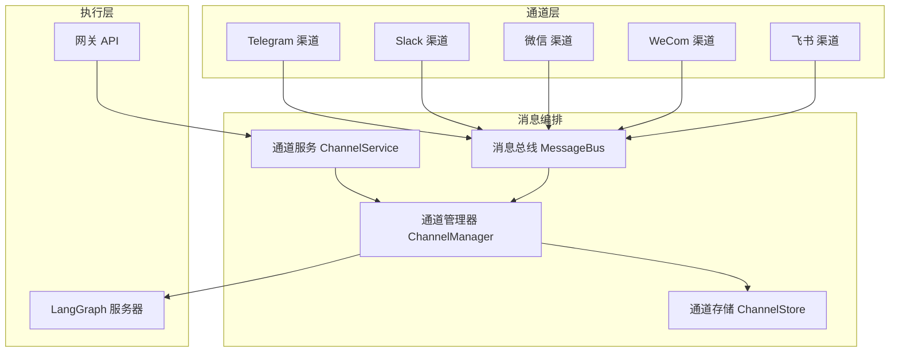
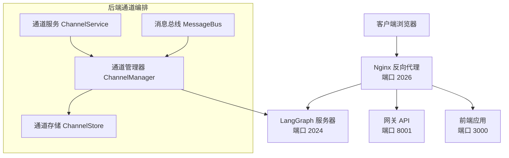
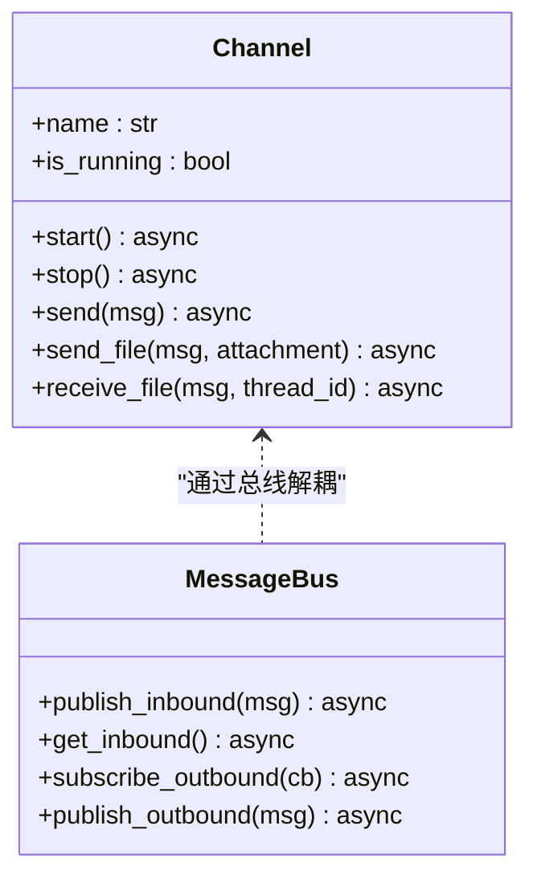
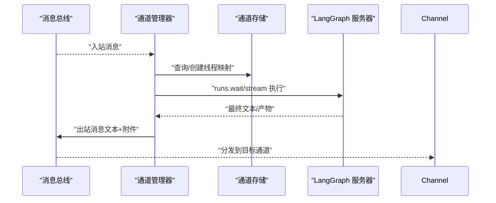
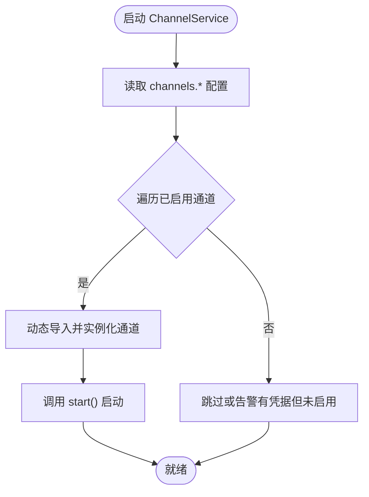
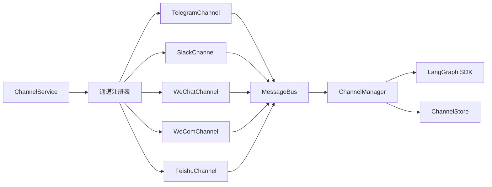

# 即时通讯集成

<cite>
**本文引用的文件**
- [backend/app/channels/base.py](file://backend/app/channels/base.py)
- [backend/app/channels/message_bus.py](file://backend/app/channels/message_bus.py)
- [backend/app/channels/service.py](file://backend/app/channels/service.py)
- [backend/app/channels/manager.py](file://backend/app/channels/manager.py)
- [backend/app/channels/store.py](file://backend/app/channels/store.py)
- [backend/app/channels/commands.py](file://backend/app/channels/commands.py)
- [backend/app/channels/telegram.py](file://backend/app/channels/telegram.py)
- [backend/app/channels/slack.py](file://backend/app/channels/slack.py)
- [backend/app/channels/wechat.py](file://backend/app/channels/wechat.py)
- [backend/app/channels/wecom.py](file://backend/app/channels/wecom.py)
- [backend/app/channels/feishu.py](file://backend/app/channels/feishu.py)
- [backend/app/gateway/routers/channels.py](file://backend/app/gateway/routers/channels.py)
- [config.example.yaml](file://config.example.yaml)
- [backend/docs/CONFIGURATION.md](file://backend/docs/CONFIGURATION.md)
- [backend/docs/ARCHITECTURE.md](file://backend/docs/ARCHITECTURE.md)
</cite>

## 目录
1. [简介](#简介)
2. [项目结构](#项目结构)
3. [核心组件](#核心组件)
4. [架构总览](#架构总览)
5. [详细组件分析](#详细组件分析)
6. [依赖分析](#依赖分析)
7. [性能考虑](#性能考虑)
8. [故障排查指南](#故障排查指南)
9. [结论](#结论)
10. [附录](#附录)

## 简介
本技术文档面向 DeerFlow 即时通讯集成系统，系统性阐述 IM 通道架构与消息处理机制，覆盖 Telegram、Slack、微信、WeCom、飞书等多平台适配方案；详解消息路由与会话管理（用户识别、会话状态、消息持久化）、平台特定认证与 API 集成、消息格式转换与内容处理（富文本、媒体文件、链接解析）、平台配置指南（API 密钥、回调地址、权限）、以及多平台部署注意事项与最佳实践。

## 项目结构
后端采用模块化设计，IM 通道位于 backend/app/channels，通过消息总线解耦通道与代理执行器（LangGraph），并通过网关提供运行时状态查询与通道重启能力。

图表来源
- [backend/app/channels/service.py:50-131](file://backend/app/channels/service.py#L50-L131)
- [backend/app/channels/manager.py:506-766](file://backend/app/channels/manager.py#L506-L766)
- [backend/app/channels/message_bus.py:117-174](file://backend/app/channels/message_bus.py#L117-L174)
- [backend/app/channels/store.py:16-154](file://backend/app/channels/store.py#L16-L154)

章节来源
- [backend/app/channels/service.py:50-131](file://backend/app/channels/service.py#L50-L131)
- [backend/app/channels/manager.py:506-766](file://backend/app/channels/manager.py#L506-L766)
- [backend/app/channels/message_bus.py:117-174](file://backend/app/channels/message_bus.py#L117-L174)
- [backend/app/channels/store.py:16-154](file://backend/app/channels/store.py#L16-L154)

## 核心组件
- 抽象通道基类：定义通道生命周期（启动/停止）、出站发送、文件上传、入站文件处理钩子等统一接口。
- 消息总线：异步发布/订阅，解耦通道与代理执行器。
- 通道服务：从应用配置加载通道配置，按需实例化并启动各通道。
- 通道管理器：消费入站消息，创建/复用线程，调用 LangGraph 执行，聚合响应并回发通道。
- 通道存储：以 JSON 文件持久化 IM 会话到 DeerFlow 线程映射，支持按话题维度复用线程。
- 命令集：统一的通道命令集合，确保各平台解析一致性。

章节来源
- [backend/app/channels/base.py:14-127](file://backend/app/channels/base.py#L14-L127)
- [backend/app/channels/message_bus.py:117-174](file://backend/app/channels/message_bus.py#L117-L174)
- [backend/app/channels/service.py:50-131](file://backend/app/channels/service.py#L50-L131)
- [backend/app/channels/manager.py:506-766](file://backend/app/channels/manager.py#L506-L766)
- [backend/app/channels/store.py:16-154](file://backend/app/channels/store.py#L16-L154)
- [backend/app/channels/commands.py:11-21](file://backend/app/channels/commands.py#L11-L21)

## 架构总览
系统通过反向代理统一入口，将 /api/langgraph/* 转发至 LangGraph 服务器，/api/* 转发至网关 API，前端静态资源由 Nginx 提供。通道服务在后端启动，连接各 IM 平台，经消息总线进入通道管理器，再调用 LangGraph 执行器完成推理与工具调用，并将结果通过通道回推给用户。

图表来源
- [backend/docs/ARCHITECTURE.md:7-51](file://backend/docs/ARCHITECTURE.md#L7-L51)
- [backend/app/channels/service.py:50-131](file://backend/app/channels/service.py#L50-L131)
- [backend/app/channels/manager.py:506-766](file://backend/app/channels/manager.py#L506-L766)
- [backend/app/channels/message_bus.py:117-174](file://backend/app/channels/message_bus.py#L117-L174)
- [backend/app/channels/store.py:16-154](file://backend/app/channels/store.py#L16-L154)

章节来源
- [backend/docs/ARCHITECTURE.md:53-127](file://backend/docs/ARCHITECTURE.md#L53-L127)

## 详细组件分析

### 通道抽象与消息总线
- 通道基类 Channel 定义统一接口：start/stop/send/send_file/receive_file，以及入站消息工厂方法与出站回调。
- 消息总线提供异步入站队列与出站监听器注册，支持并发安全的消息分发。

图表来源
- [backend/app/channels/base.py:14-127](file://backend/app/channels/base.py#L14-L127)
- [backend/app/channels/message_bus.py:117-174](file://backend/app/channels/message_bus.py#L117-L174)

章节来源
- [backend/app/channels/base.py:14-127](file://backend/app/channels/base.py#L14-L127)
- [backend/app/channels/message_bus.py:117-174](file://backend/app/channels/message_bus.py#L117-L174)

### 通道管理器与会话管理
- 通道管理器负责：
  - 从消息总线拉取入站消息
  - 解析会话上下文（默认/频道级/用户级）
  - 创建或复用 DeerFlow 线程（基于通道名+聊天ID+话题ID）
  - 处理入站文件下载与注入
  - 调用 LangGraph 执行器（同步或流式）
  - 聚合响应文本与产物附件，回发通道
- 通道存储以 JSON 文件持久化映射，支持按话题维度复用线程。

图表来源
- [backend/app/channels/manager.py:615-766](file://backend/app/channels/manager.py#L615-L766)
- [backend/app/channels/store.py:82-107](file://backend/app/channels/store.py#L82-L107)

章节来源
- [backend/app/channels/manager.py:506-766](file://backend/app/channels/manager.py#L506-L766)
- [backend/app/channels/store.py:16-154](file://backend/app/channels/store.py#L16-L154)

### 通道服务与生命周期
- 通道服务从应用配置读取 channels.* 配置，按需实例化并启动通道；提供状态查询与单通道重启能力。

图表来源
- [backend/app/channels/service.py:90-131](file://backend/app/channels/service.py#L90-L131)

章节来源
- [backend/app/channels/service.py:50-131](file://backend/app/channels/service.py#L50-L131)
- [backend/app/gateway/routers/channels.py:25-53](file://backend/app/gateway/routers/channels.py#L25-L53)

### 平台适配：Telegram
- 连接方式：长轮询（无需公网 IP）
- 凭证：bot_token；可选允许用户列表
- 特性：私聊使用独立线程；群组按回复链路复用话题线程；支持图片/文档上传；带重试与分片上传；支持“正在处理”提示
- 限制：单次消息大小限制；文件类型与尺寸限制

章节来源
- [backend/app/channels/telegram.py:16-318](file://backend/app/channels/telegram.py#L16-L318)

### 平台适配：Slack
- 连接方式：Socket Mode（WebSocket，无需公网 IP）
- 凭证：bot_token + app_token；可选允许用户列表
- 特性：事件 ACK；线程内回复；命令识别；文件上传；反应标记（完成/失败）
- 限制：文件大小限制；线程根消息作为话题标识

章节来源
- [backend/app/channels/slack.py:35-265](file://backend/app/channels/slack.py#L35-L265)

### 平台适配：微信（iLink）
- 连接方式：长轮询（iLink）
- 凭证：bot_token；可选二维码登录；可配置 base_url、CDN 基址、超时参数
- 特性：入站文件 AES 加密下载；出站图片/文件加密上传；上下文令牌维护；长轮询超时自适应；支持本地路径与 HTTP 下载
- 限制：文件类型白名单；大小限制；二维码登录流程与过期处理

章节来源
- [backend/app/channels/wechat.py:129-800](file://backend/app/channels/wechat.py#L129-L800)

### 平台适配：WeCom
- 连接方式：WebSocket（aibot SDK）
- 凭证：bot_id + bot_secret；可配置工作提示语
- 特性：文本/混合/图片/文件事件解析；入站文件元数据透传；文件上传采用分片与 MD5 校验；流式回复；媒体上传与回复联动
- 限制：图片/文件大小限制；需要特定 SDK 版本

章节来源
- [backend/app/channels/wecom.py:21-395](file://backend/app/channels/wecom.py#L21-L395)

### 平台适配：飞书（Lark）
- 连接方式：WebSocket（lark-oapi）
- 凭证：app_id + app_secret；可选域名；可选校验 token
- 特性：表情反应 OK/DONE；运行中卡片；富文本解析（含图片/文件键）；文件下载到沙箱虚拟路径；卡片消息流式更新
- 限制：图片/文件大小限制；卡片内容渲染

章节来源
- [backend/app/channels/feishu.py:27-693](file://backend/app/channels/feishu.py#L27-L693)

### 消息格式转换与内容处理
- 文本到平台格式：Slack 使用 Markdown 到 Slack Markdown 转换器；飞书原生支持富文本卡片渲染
- 入站文件处理：通道 receive_file 将远端文件下载到沙箱上传目录，替换消息文本中的占位符为虚拟路径，便于后续工具访问
- 产物附件：通道管理器将虚拟路径解析为宿主机实际路径，生成 ResolvedAttachment 并附加到出站消息
- 链接解析：平台事件解析时对富文本内容进行段落与元素拆分，保留文本与媒体键，再行下载

章节来源
- [backend/app/channels/slack.py:16-16](file://backend/app/channels/slack.py#L16-L16)
- [backend/app/channels/feishu.py:285-390](file://backend/app/channels/feishu.py#L285-L390)
- [backend/app/channels/manager.py:331-404](file://backend/app/channels/manager.py#L331-L404)

### 会话管理与用户识别
- 用户识别：各平台使用各自 user_id/聊天ID/群组ID等唯一标识
- 话题维度：topic_id 决定是否复用同一 DeerFlow 线程；私聊通常不设 topic_id，群组按回复链路或消息 ts 作为 topic_id
- 线程映射：ChannelStore 以 JSON 文件持久化映射，支持删除指定话题或整条会话的所有映射
- 会话上下文合并：通道管理器按默认/频道/用户层级合并运行配置与上下文，支持自定义代理名称兼容

章节来源
- [backend/app/channels/telegram.py:295-311](file://backend/app/channels/telegram.py#L295-L311)
- [backend/app/channels/slack.py:247-257](file://backend/app/channels/slack.py#L247-L257)
- [backend/app/channels/feishu.py:670-681](file://backend/app/channels/feishu.py#L670-L681)
- [backend/app/channels/store.py:82-137](file://backend/app/channels/store.py#L82-L137)
- [backend/app/channels/manager.py:543-578](file://backend/app/channels/manager.py#L543-L578)

## 依赖分析
- 组件耦合
  - 通道与消息总线：低耦合（通过接口与回调）
  - 通道管理器与 LangGraph：通过 SDK 异步客户端交互
  - 通道服务与通道：通过反射动态导入，便于扩展新平台
- 外部依赖
  - 各平台 SDK：Telegram、Slack、飞书、WeCom、微信 iLink
  - LangGraph SDK：用于 runs.wait/stream
  - FastAPI：网关路由提供通道状态查询与重启

图表来源
- [backend/app/channels/service.py:16-34](file://backend/app/channels/service.py#L16-L34)
- [backend/app/channels/manager.py:582-588](file://backend/app/channels/manager.py#L582-L588)

章节来源
- [backend/app/channels/service.py:16-34](file://backend/app/channels/service.py#L16-L34)
- [backend/app/channels/manager.py:582-588](file://backend/app/channels/manager.py#L582-L588)

## 性能考虑
- 并发控制：通道管理器使用信号量限制最大并发任务数
- 流式输出：部分平台（如飞书）支持卡片流式更新，减少首 token 时间
- 文件处理：入站文件下载与出站文件上传均受大小限制，避免大文件阻塞
- 会话复用：按话题维度复用线程，降低重复初始化成本
- 缓存与重试：通道发送具备指数退避重试，提升网络抖动下的稳定性

章节来源
- [backend/app/channels/manager.py:519-536](file://backend/app/channels/manager.py#L519-L536)
- [backend/app/channels/manager.py:767-826](file://backend/app/channels/manager.py#L767-L826)
- [backend/app/channels/feishu.py:505-546](file://backend/app/channels/feishu.py#L505-L546)
- [backend/app/channels/telegram.py:90-131](file://backend/app/channels/telegram.py#L90-L131)
- [backend/app/channels/slack.py:98-149](file://backend/app/channels/slack.py#L98-L149)

## 故障排查指南
- 通道未启动
  - 检查配置中 enabled 是否为 true，且具备必要凭据
  - 查看通道服务状态与日志
- 发送失败
  - 查看通道发送重试日志与异常堆栈
  - 检查平台配额与大小限制
- 文件上传失败
  - 确认虚拟路径映射与宿主机路径一致
  - 检查 MIME 类型与扩展名
- 会话错乱
  - 确认 topic_id 设置是否符合预期（私聊 vs 群组）
  - 清理相关映射后重试

章节来源
- [backend/app/gateway/routers/channels.py:25-53](file://backend/app/gateway/routers/channels.py#L25-L53)
- [backend/app/channels/manager.py:644-666](file://backend/app/channels/manager.py#L644-L666)
- [backend/app/channels/telegram.py:132-173](file://backend/app/channels/telegram.py#L132-L173)
- [backend/app/channels/slack.py:151-171](file://backend/app/channels/slack.py#L151-L171)
- [backend/app/channels/store.py:109-137](file://backend/app/channels/store.py#L109-L137)

## 结论
DeerFlow 即时通讯集成通过抽象通道、消息总线与通道管理器实现了跨平台统一接入；结合 LangGraph 执行器与沙箱系统，形成从消息解析、会话管理、工具调用到结果回推的完整闭环。平台适配覆盖 Telegram、Slack、微信、WeCom、飞书，满足不同场景的认证与消息格式需求；通过严格的文件处理与会话复用策略，兼顾易用性与可运维性。

## 附录

### 平台配置指南（摘要）
- Telegram
  - 必填：bot_token；可选：allowed_users
  - 参考：[backend/app/channels/telegram.py:16-318](file://backend/app/channels/telegram.py#L16-L318)
- Slack
  - 必填：bot_token、app_token；可选：allowed_users
  - 参考：[backend/app/channels/slack.py:35-265](file://backend/app/channels/slack.py#L35-L265)
- 微信（iLink）
  - 必填：bot_token 或开启二维码登录；可选：base_url、polling_timeout、state_dir
  - 参考：[backend/app/channels/wechat.py:129-800](file://backend/app/channels/wechat.py#L129-L800)
- WeCom
  - 必填：bot_id、bot_secret；可选：working_message
  - 参考：[backend/app/channels/wecom.py:21-395](file://backend/app/channels/wecom.py#L21-L395)
- 飞书
  - 必填：app_id、app_secret；可选：verification_token、domain
  - 参考：[backend/app/channels/feishu.py:27-693](file://backend/app/channels/feishu.py#L27-L693)
- 通用配置
  - 参考示例与环境变量：[config.example.yaml:1-978](file://config.example.yaml#L1-L978)
  - 配置说明与最佳实践：[backend/docs/CONFIGURATION.md:1-370](file://backend/docs/CONFIGURATION.md#L1-L370)

### 多平台部署注意事项
- 反向代理：确保 /api/langgraph/* 转发至 LangGraph 服务器，/api/* 转发至网关 API
- 端口规划：LangGraph 2024、网关 8001、前端 3000、Nginx 2026
- 安全：生产环境优先使用 Docker 沙箱隔离；敏感信息使用环境变量
- 可观测性：启用日志与通道状态路由，定期检查通道健康

章节来源
- [backend/docs/ARCHITECTURE.md:7-51](file://backend/docs/ARCHITECTURE.md#L7-L51)
- [backend/app/gateway/routers/channels.py:25-53](file://backend/app/gateway/routers/channels.py#L25-L53)
- [backend/docs/CONFIGURATION.md:337-370](file://backend/docs/CONFIGURATION.md#L337-L370)