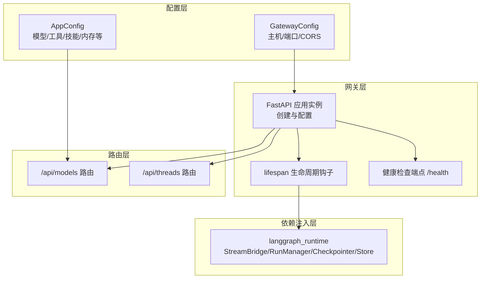
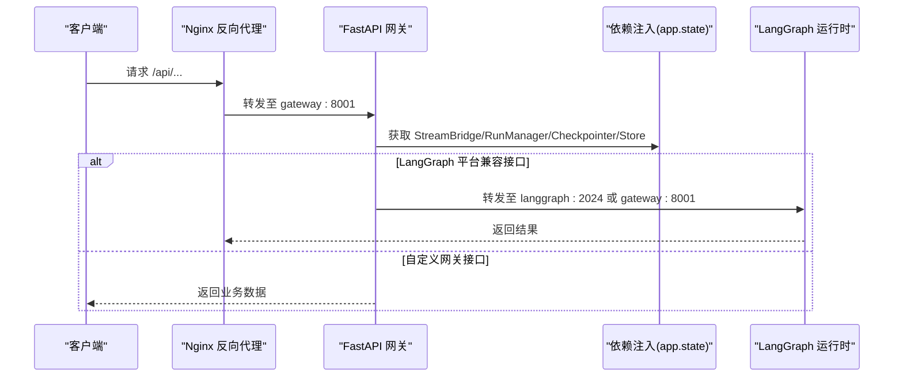
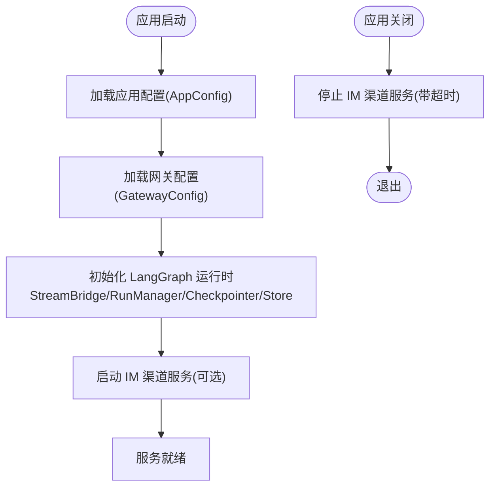
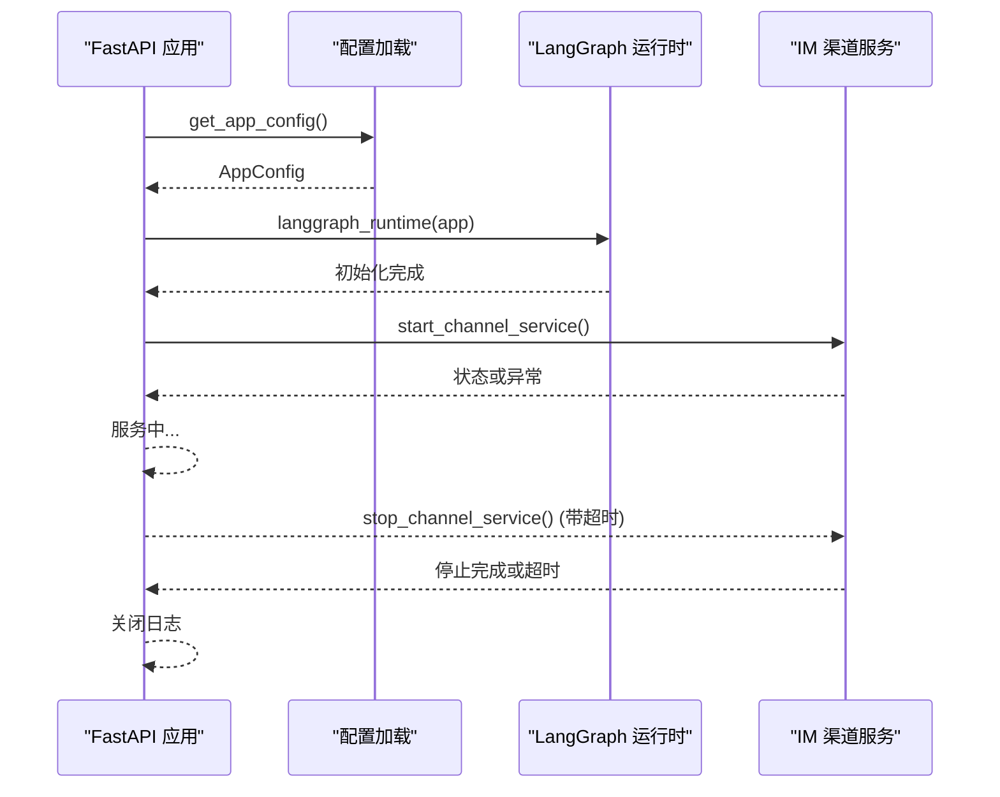
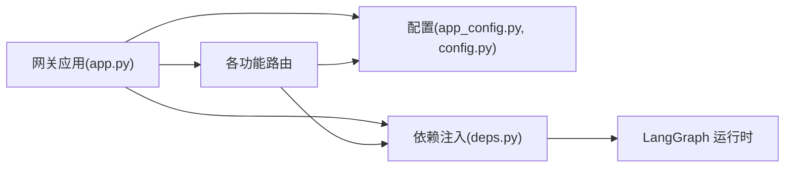

# FastAPI应用架构

<cite>
**本文档引用的文件**
- [backend/app/gateway/app.py](file://backend/app/gateway/app.py)
- [backend/app/gateway/config.py](file://backend/app/gateway/config.py)
- [backend/packages/harness/deerflow/config/app_config.py](file://backend/packages/harness/deerflow/config/app_config.py)
- [backend/app/gateway/deps.py](file://backend/app/gateway/deps.py)
- [backend/app/gateway/routers/models.py](file://backend/app/gateway/routers/models.py)
- [backend/app/gateway/routers/threads.py](file://backend/app/gateway/routers/threads.py)
- [docker/nginx/nginx.conf](file://docker/nginx/nginx.conf)
- [backend/tests/test_gateway_lifespan_shutdown.py](file://backend/tests/test_gateway_lifespan_shutdown.py)
</cite>

## 目录
1. [引言](#引言)
2. [项目结构](#项目结构)
3. [核心组件](#核心组件)
4. [架构总览](#架构总览)
5. [详细组件分析](#详细组件分析)
6. [依赖关系分析](#依赖关系分析)
7. [性能考虑](#性能考虑)
8. [故障排除指南](#故障排除指南)
9. [结论](#结论)
10. [附录](#附录)

## 引言
本文件系统性梳理 DeerFlow 的 FastAPI 应用架构，重点覆盖应用初始化流程（应用实例创建、配置加载与生命周期管理）、配置选项（标题、描述、版本、文档URL与OpenAPI标签）、生命周期钩子（lifespan）实现（启动时配置加载、LangGraph运行时初始化、关闭时清理）、CORS处理策略与nginx反向代理集成、健康检查端点与监控集成，以及扩展应用功能与新增路由的最佳实践。

## 项目结构
后端采用“网关 + 路由器 + 依赖注入”的分层组织方式：
- 网关层：集中创建 FastAPI 实例、注册路由、定义 lifespan 生命周期钩子、暴露健康检查端点
- 配置层：应用级配置与网关级配置分离，支持环境变量与文件加载
- 依赖注入层：通过 app.state 注入 LangGraph 运行时单例（StreamBridge、RunManager、Checkpointer、Store）
- 路由层：按功能域划分路由器，如 models、threads、uploads 等

图表来源
- [backend/app/gateway/app.py:91-231](file://backend/app/gateway/app.py#L91-L231)
- [backend/app/gateway/config.py:17-27](file://backend/app/gateway/config.py#L17-L27)
- [backend/packages/harness/deerflow/config/app_config.py:300-398](file://backend/packages/harness/deerflow/config/app_config.py#L300-L398)
- [backend/app/gateway/deps.py:19-37](file://backend/app/gateway/deps.py#L19-L37)

章节来源
- [backend/app/gateway/app.py:91-231](file://backend/app/gateway/app.py#L91-L231)
- [backend/app/gateway/config.py:17-27](file://backend/app/gateway/config.py#L17-L27)
- [backend/packages/harness/deerflow/config/app_config.py:300-398](file://backend/packages/harness/deerflow/config/app_config.py#L300-L398)
- [backend/app/gateway/deps.py:19-37](file://backend/app/gateway/deps.py#L19-L37)

## 核心组件
- 应用实例创建与配置
  - 标题、描述、版本、文档URL与OpenAPI标签在应用创建时统一配置
  - 路由挂载遵循“前缀 + 标签”的清晰分组
- 配置系统
  - 网关配置：主机、端口、CORS来源
  - 应用配置：模型、工具、技能、内存、沙箱、流桥接等
- 生命周期管理
  - 启动阶段：加载应用配置、初始化 LangGraph 运行时、启动 IM 渠道服务
  - 关闭阶段：带超时的通道服务停止，避免工作进程阻塞
- CORS与nginx集成
  - FastAPI 不做CORS处理，CORS由 nginx 统一处理并透传到上游
- 健康检查
  - 提供 /health 端点用于系统状态检查

章节来源
- [backend/app/gateway/app.py:98-178](file://backend/app/gateway/app.py#L98-L178)
- [backend/app/gateway/app.py:222-229](file://backend/app/gateway/app.py#L222-L229)
- [backend/app/gateway/config.py:17-27](file://backend/app/gateway/config.py#L17-L27)
- [backend/packages/harness/deerflow/config/app_config.py:300-398](file://backend/packages/harness/deerflow/config/app_config.py#L300-L398)
- [backend/app/gateway/deps.py:19-37](file://backend/app/gateway/deps.py#L19-L37)

## 架构总览
下图展示了请求从 nginx 到 FastAPI 网关再到 LangGraph 运行时的整体流转：

图表来源
- [docker/nginx/nginx.conf:38-235](file://docker/nginx/nginx.conf#L38-L235)
- [backend/app/gateway/app.py:182-231](file://backend/app/gateway/app.py#L182-L231)
- [backend/app/gateway/deps.py:44-71](file://backend/app/gateway/deps.py#L44-L71)

## 详细组件分析

### 应用初始化与配置加载
- 应用实例创建
  - 设置标题、描述、版本、文档URL与OpenAPI标签
  - 挂载多个功能路由（models、mcp、memory、skills、artifacts、uploads、threads、agents、suggestions、channels、assistants-compat、thread_runs、runs）
- 配置加载
  - 启动时加载应用配置（AppConfig），确保必要环境变量可用
  - 加载网关配置（GatewayConfig），包含主机、端口与CORS来源
- 生命周期钩子
  - 启动：初始化 LangGraph 运行时单例；尝试启动 IM 渠道服务
  - 关闭：带超时地停止通道服务，防止工作进程被卡住

图表来源
- [backend/app/gateway/app.py:42-89](file://backend/app/gateway/app.py#L42-L89)
- [backend/packages/harness/deerflow/config/app_config.py:300-398](file://backend/packages/harness/deerflow/config/app_config.py#L300-L398)
- [backend/app/gateway/config.py:17-27](file://backend/app/gateway/config.py#L17-L27)
- [backend/app/gateway/deps.py:19-37](file://backend/app/gateway/deps.py#L19-L37)

章节来源
- [backend/app/gateway/app.py:98-178](file://backend/app/gateway/app.py#L98-L178)
- [backend/app/gateway/app.py:42-89](file://backend/app/gateway/app.py#L42-L89)
- [backend/packages/harness/deerflow/config/app_config.py:300-398](file://backend/packages/harness/deerflow/config/app_config.py#L300-L398)
- [backend/app/gateway/config.py:17-27](file://backend/app/gateway/config.py#L17-L27)
- [backend/app/gateway/deps.py:19-37](file://backend/app/gateway/deps.py#L19-L37)

### 配置选项详解
- 应用级配置（AppConfig）
  - 支持从文件加载、环境变量解析、配置版本校验与自动升级提示
  - 提供模型、工具、技能、内存、沙箱、流桥接、子代理、守卫护栏等子配置的装载与刷新
- 网关级配置（GatewayConfig）
  - 主机与端口默认值可通过环境变量覆盖
  - CORS来源列表支持多源配置

章节来源
- [backend/packages/harness/deerflow/config/app_config.py:300-398](file://backend/packages/harness/deerflow/config/app_config.py#L300-L398)
- [backend/app/gateway/config.py:17-27](file://backend/app/gateway/config.py#L17-L27)

### 生命周期钩子（lifespan）实现
- 启动阶段
  - 加载应用配置并记录日志
  - 初始化 LangGraph 运行时（StreamBridge、RunManager、Checkpointer、Store）
  - 尝试启动 IM 渠道服务，失败时记录异常但不中断启动
- 关闭阶段
  - 使用带超时的等待机制停止通道服务，超时则记录警告并继续退出
  - 记录网关关闭日志

图表来源
- [backend/app/gateway/app.py:42-89](file://backend/app/gateway/app.py#L42-L89)
- [backend/app/gateway/deps.py:19-37](file://backend/app/gateway/deps.py#L19-L37)

章节来源
- [backend/app/gateway/app.py:42-89](file://backend/app/gateway/app.py#L42-L89)
- [backend/app/gateway/deps.py:19-37](file://backend/app/gateway/deps.py#L19-L37)
- [backend/tests/test_gateway_lifespan_shutdown.py:19-69](file://backend/tests/test_gateway_lifespan_shutdown.py#L19-L69)

### CORS处理策略与nginx反向代理集成
- FastAPI 层面
  - 明确注释指出 CORS 由 nginx 处理，无需在 FastAPI 中间件重复处理
- nginx 层面
  - 统一设置 CORS 头部并隐藏上游重复头部
  - 对 OPTIONS 预检请求直接返回 204
  - 将 /api/langgraph/* 路由转发至 LangGraph 或网关（受环境变量控制）
  - 将 /api/models、/api/memory、/api/mcp、/api/skills、/api/agents、/api/threads 等自定义接口转发至网关
  - 将 /docs、/redoc、/openapi.json 文档路由转发至网关
  - 将 /health 健康检查路由转发至网关
  - 将 /api/sandboxes 沙箱管理接口转发至 provisioner

章节来源
- [backend/app/gateway/app.py:180-181](file://backend/app/gateway/app.py#L180-L181)
- [docker/nginx/nginx.conf:38-235](file://docker/nginx/nginx.conf#L38-L235)

### 健康检查端点与监控集成
- 健康检查端点
  - 在应用根路径提供 /health 端点，返回服务健康状态
- 监控集成
  - nginx 已配置访问日志与错误日志输出到标准流，便于容器化环境采集
  - 可结合外部监控系统采集 nginx 与网关日志

章节来源
- [backend/app/gateway/app.py:222-229](file://backend/app/gateway/app.py#L222-L229)
- [docker/nginx/nginx.conf:14-15](file://docker/nginx/nginx.conf#L14-L15)

### 扩展应用功能与添加新路由
- 新增路由步骤
  - 在 routers 目录下创建新模块（如 my_feature.py），定义 APIRouter 与路由函数
  - 在网关 app.py 中引入并挂载新路由（注意前缀与标签）
  - 如需依赖 LangGraph 运行时，使用 deps.py 中的 getter 函数从 request.app.state 获取
- 示例参考
  - models 路由：展示如何读取 AppConfig 并返回模型列表
  - threads 路由：展示如何使用 Store 与 Checkpointer 进行线程状态管理

章节来源
- [backend/app/gateway/app.py:182-231](file://backend/app/gateway/app.py#L182-L231)
- [backend/app/gateway/routers/models.py:1-134](file://backend/app/gateway/routers/models.py#L1-L134)
- [backend/app/gateway/routers/threads.py:1-200](file://backend/app/gateway/routers/threads.py#L1-L200)
- [backend/app/gateway/deps.py:44-71](file://backend/app/gateway/deps.py#L44-L71)

## 依赖关系分析
- 组件耦合
  - 网关层对配置层与依赖注入层存在直接依赖
  - 路由层通过依赖注入访问运行时组件，保持较低耦合
- 外部依赖
  - LangGraph 运行时（StreamBridge、RunManager、Checkpointer、Store）
  - nginx 反向代理（负责CORS、路由转发、长连接与SSE）

图表来源
- [backend/app/gateway/app.py:91-231](file://backend/app/gateway/app.py#L91-L231)
- [backend/packages/harness/deerflow/config/app_config.py:300-398](file://backend/packages/harness/deerflow/config/app_config.py#L300-L398)
- [backend/app/gateway/config.py:17-27](file://backend/app/gateway/config.py#L17-L27)
- [backend/app/gateway/deps.py:19-37](file://backend/app/gateway/deps.py#L19-L37)

章节来源
- [backend/app/gateway/app.py:91-231](file://backend/app/gateway/app.py#L91-L231)
- [backend/app/gateway/deps.py:19-37](file://backend/app/gateway/deps.py#L19-L37)

## 性能考虑
- 生命周期超时保护
  - 关闭阶段对通道服务停止设置超时，避免工作进程长时间阻塞
- nginx 优化
  - 对长连接与SSE场景禁用缓冲与缓存，提高实时性
  - 对上传接口放宽请求体大小限制并禁用请求缓冲
- 日志与可观测性
  - nginx 输出访问与错误日志到标准流，便于容器化环境采集

章节来源
- [backend/app/gateway/app.py:36-89](file://backend/app/gateway/app.py#L36-L89)
- [docker/nginx/nginx.conf:75-87](file://docker/nginx/nginx.conf#L75-L87)
- [docker/nginx/nginx.conf:149-151](file://docker/nginx/nginx.conf#L149-L151)

## 故障排除指南
- 启动失败
  - 检查应用配置加载是否成功，确认必要环境变量已设置
  - 确认网关配置中的主机与端口未被占用
- LangGraph 运行时不可用
  - 确认 lifespan 已正确初始化运行时单例
  - 检查依赖注入 getter 是否抛出 503 错误
- 通道服务停止阻塞
  - 关闭阶段会进行超时保护，若仍阻塞需排查通道服务实现
- CORS问题
  - 确认 nginx 已正确设置 CORS 头部并处理 OPTIONS 预检

章节来源
- [backend/app/gateway/app.py:42-89](file://backend/app/gateway/app.py#L42-L89)
- [backend/app/gateway/deps.py:44-71](file://backend/app/gateway/deps.py#L44-L71)
- [backend/tests/test_gateway_lifespan_shutdown.py:19-69](file://backend/tests/test_gateway_lifespan_shutdown.py#L19-L69)
- [docker/nginx/nginx.conf:49-57](file://docker/nginx/nginx.conf#L49-L57)

## 结论
DeerFlow 的 FastAPI 网关通过清晰的分层设计与严格的生命周期管理，实现了稳定可靠的 API 服务能力。应用配置与网关配置分离、LangGraph 运行时集中注入、nginx 统一处理 CORS 与路由转发，共同构成了高可用、易扩展的后端架构。健康检查端点与完善的测试保障了系统的可观测性与稳定性。

## 附录
- 快速参考
  - 应用创建与配置：[backend/app/gateway/app.py:98-178](file://backend/app/gateway/app.py#L98-L178)
  - 网关配置加载：[backend/app/gateway/config.py:17-27](file://backend/app/gateway/config.py#L17-L27)
  - 应用配置加载与刷新：[backend/packages/harness/deerflow/config/app_config.py:300-398](file://backend/packages/harness/deerflow/config/app_config.py#L300-L398)
  - 运行时初始化：[backend/app/gateway/deps.py:19-37](file://backend/app/gateway/deps.py#L19-L37)
  - 路由挂载与健康检查：[backend/app/gateway/app.py:182-231](file://backend/app/gateway/app.py#L182-L231)
  - nginx CORS与路由转发：[docker/nginx/nginx.conf:38-235](file://docker/nginx/nginx.conf#L38-L235)
  - 生命周期超时测试：[backend/tests/test_gateway_lifespan_shutdown.py:19-69](file://backend/tests/test_gateway_lifespan_shutdown.py#L19-L69)