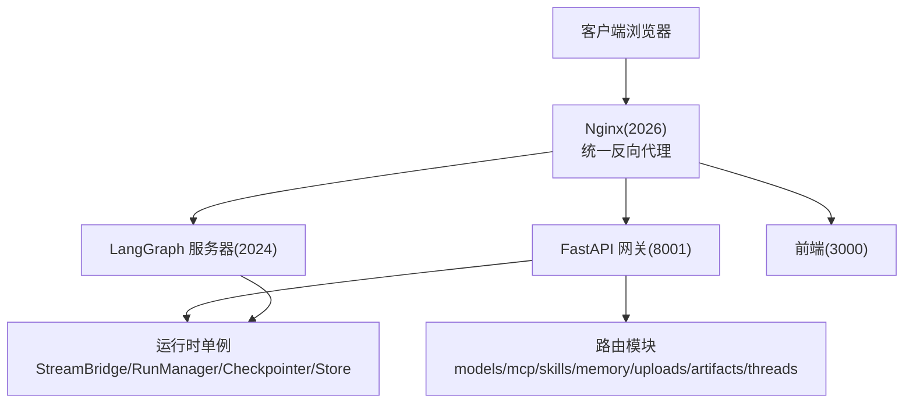
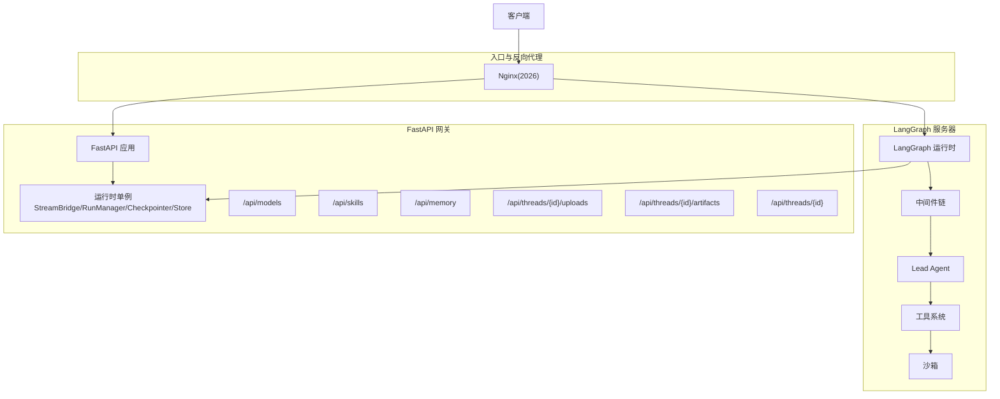
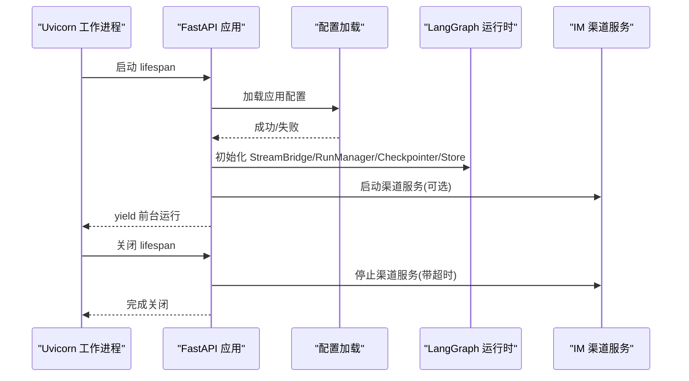
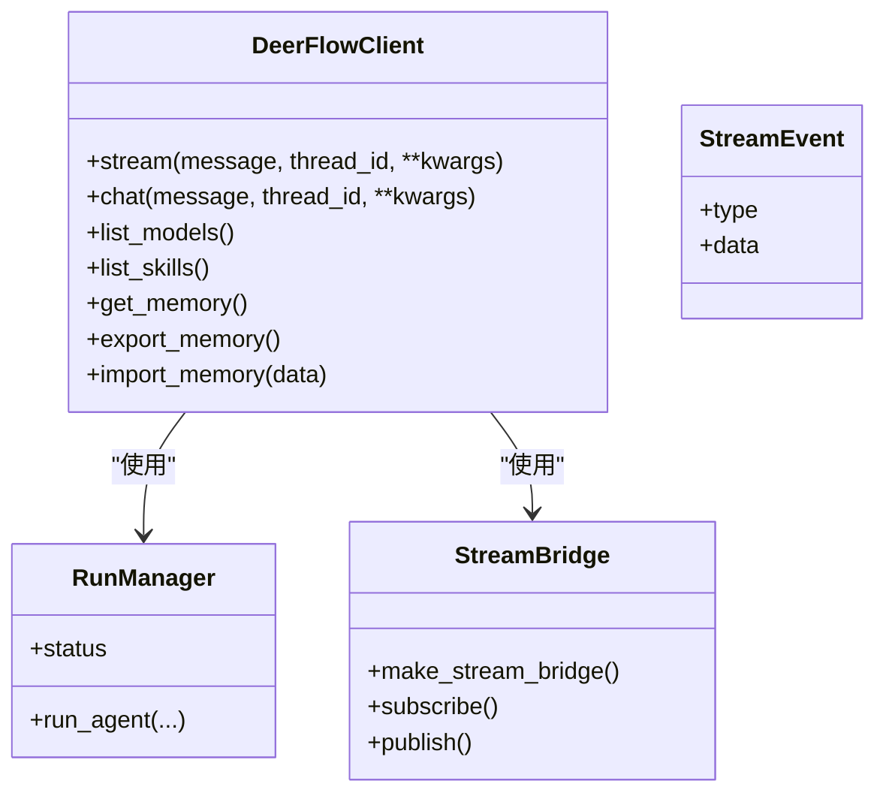
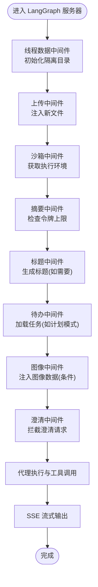
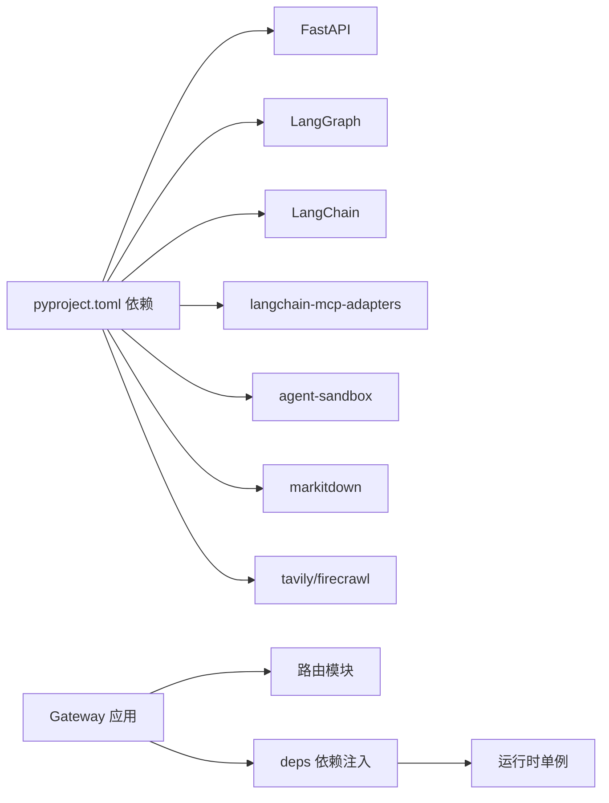

# 后端服务

<cite>
**本文引用的文件**
- [backend/README.md](file://backend/README.md)
- [backend/pyproject.toml](file://backend/pyproject.toml)
- [backend/app/gateway/app.py](file://backend/app/gateway/app.py)
- [backend/app/gateway/config.py](file://backend/app/gateway/config.py)
- [backend/app/gateway/deps.py](file://backend/app/gateway/deps.py)
- [backend/app/gateway/routers/__init__.py](file://backend/app/gateway/routers/__init__.py)
- [backend/app/gateway/routers/models.py](file://backend/app/gateway/routers/models.py)
- [backend/app/gateway/routers/memory.py](file://backend/app/gateway/routers/memory.py)
- [backend/app/gateway/routers/skills.py](file://backend/app/gateway/routers/skills.py)
- [backend/app/gateway/routers/artifacts.py](file://backend/app/gateway/routers/artifacts.py)
- [backend/app/gateway/routers/uploads.py](file://backend/app/gateway/routers/uploads.py)
- [backend/packages/harness/deerflow/client.py](file://backend/packages/harness/deerflow/client.py)
- [backend/packages/harness/deerflow/runtime/__init__.py](file://backend/packages/harness/deerflow/runtime/__init__.py)
- [backend/packages/harness/deerflow/agents/middlewares/__init__.py](file://backend/packages/harness/deerflow/agents/middlewares/__init__.py)
- [backend/docs/ARCHITECTURE.md](file://backend/docs/ARCHITECTURE.md)
</cite>

## 目录
1. [简介](#简介)
2. [项目结构](#项目结构)
3. [核心组件](#核心组件)
4. [架构总览](#架构总览)
5. [详细组件分析](#详细组件分析)
6. [依赖关系分析](#依赖关系分析)
7. [性能考量](#性能考量)
8. [故障排查指南](#故障排查指南)
9. [结论](#结论)
10. [附录](#附录)

## 简介
本文件面向 DeerFlow 后端服务，系统性阐述基于 FastAPI 的网关（Gateway）与 LangGraph 集成的实现方式，覆盖代理运行时与调度机制、API 路由设计原则、服务生命周期管理（启动、配置加载、依赖注入、关闭）、中间件体系（认证、授权、日志、错误处理），并提供可操作的使用模式与参考路径，帮助开发者快速理解与扩展后端工作原理。

## 项目结构
后端采用“反向代理统一入口 + 多子服务”的分层架构：
- 反向代理：Nginx 将 /api/langgraph/* 转发至 LangGraph 服务器（端口 2024），将 /api/* 转发至 FastAPI 网关（端口 8001），静态资源与前端在 3000 端口。
- LangGraph 服务器：负责多智能体运行时、线程状态管理、中间件链、工具执行与 SSE 实时流式输出。
- FastAPI 网关：提供模型、MCP、技能、内存、上传、工件等非代理类 REST 接口，并承载 IM 渠道服务的启动与关闭。

图表来源
- [backend/README.md:37-41](file://backend/README.md#L37-L41)
- [backend/docs/ARCHITECTURE.md:7-51](file://backend/docs/ARCHITECTURE.md#L7-L51)

章节来源
- [backend/README.md:37-41](file://backend/README.md#L37-L41)
- [backend/docs/ARCHITECTURE.md:7-51](file://backend/docs/ARCHITECTURE.md#L7-L51)

## 核心组件
- LangGraph 运行时与代理
  - Lead Agent 作为单一入口，组合动态模型选择、中间件链、工具系统、子代理委托与系统提示词注入。
  - 中间件链顺序严格，涵盖每线程隔离目录、上传注入、沙箱获取、摘要化、任务跟踪、标题生成、记忆队列、图像注入与澄清拦截。
- 网关 FastAPI 应用
  - 提供模型、MCP、技能、内存、工件、上传、线程清理、建议、通道、兼容接口等路由。
  - 生命周期内加载配置、初始化 LangGraph 运行时单例、按需启动 IM 渠道服务并在关闭时受控退出。
- 沙箱与工具生态
  - 抽象接口与本地/AIO 提供者；虚拟路径映射到线程隔离目录；工具包含内置、社区、MCP 与技能。
- 记忆系统
  - 自动抽取上下文，结构化存储，去抖更新，系统提示注入，JSON 文件缓存失效策略。

章节来源
- [backend/README.md:46-137](file://backend/README.md#L46-L137)
- [backend/docs/ARCHITECTURE.md:55-127](file://backend/docs/ARCHITECTURE.md#L55-L127)

## 架构总览
下图展示后端关键模块交互：Nginx 作为入口，LangGraph 与 Gateway 并行运行，共享配置与运行时单例。

图表来源
- [backend/docs/ARCHITECTURE.md:7-51](file://backend/docs/ARCHITECTURE.md#L7-L51)
- [backend/app/gateway/app.py:91-231](file://backend/app/gateway/app.py#L91-L231)

## 详细组件分析

### FastAPI 网关应用与生命周期
- 应用创建与标签
  - 标准 FastAPI 初始化，注册多个标签化的路由集合，提供健康检查端点。
- 生命周期管理
  - 启动阶段：加载应用配置与网关配置；初始化 LangGraph 运行时单例（StreamBridge、RunManager、Checkpointer、Store）；尝试启动 IM 渠道服务。
  - 关闭阶段：在限定超时内安全停止 IM 渠道服务，避免阻塞进程退出。
- 依赖注入
  - 通过 app.state 注入全局单例；请求中通过 deps 获取器按需访问，缺失时返回 503。

图表来源
- [backend/app/gateway/app.py:42-89](file://backend/app/gateway/app.py#L42-L89)
- [backend/app/gateway/deps.py:19-36](file://backend/app/gateway/deps.py#L19-L36)

章节来源
- [backend/app/gateway/app.py:42-89](file://backend/app/gateway/app.py#L42-L89)
- [backend/app/gateway/app.py:91-231](file://backend/app/gateway/app.py#L91-L231)
- [backend/app/gateway/deps.py:19-71](file://backend/app/gateway/deps.py#L19-L71)

### API 路由设计与端点规范
- 路由组织
  - 路由模块集中于 app/gateway/routers，包含 models、mcp、skills、memory、uploads、artifacts、threads、suggestions、channels、assistants-compat、thread_runs、runs 等。
  - 网关应用在创建时统一挂载各路由，形成清晰的命名空间与标签分类。
- 端点规范
  - 使用 Pydantic 模型定义请求/响应结构，统一描述与校验。
  - 对敏感信息（如 API Key）不透传，仅暴露必要元数据。
  - 错误处理遵循 HTTP 语义，异常转换为稳定错误响应。
- 典型端点示例（参考路径）
  - 列出模型：GET /api/models
  - 获取指定模型：GET /api/models/{model_name}
  - 内存读取/重载/清空/导入导出/配置查询/状态合并
  - 技能安装/启用/编辑/删除/回滚/历史查询
  - 工件下载与 .skill 归档内文件提取
  - 上传文件、列出、删除

章节来源
- [backend/app/gateway/routers/__init__.py:1-4](file://backend/app/gateway/routers/__init__.py#L1-L4)
- [backend/app/gateway/routers/models.py:33-134](file://backend/app/gateway/routers/models.py#L33-L134)
- [backend/app/gateway/routers/memory.py:109-354](file://backend/app/gateway/routers/memory.py#L109-L354)
- [backend/app/gateway/routers/skills.py:98-363](file://backend/app/gateway/routers/skills.py#L98-L363)
- [backend/app/gateway/routers/artifacts.py:79-182](file://backend/app/gateway/routers/artifacts.py#L79-L182)
- [backend/app/gateway/routers/uploads.py:85-202](file://backend/app/gateway/routers/uploads.py#L85-L202)

### LangGraph 集成与运行时管理
- 运行时单例
  - StreamBridge：用于事件桥接与 SSE 消费者管理。
  - RunManager：运行生命周期与状态管理。
  - Checkpointer：检查点持久化与恢复。
  - Store：键值存储上下文。
- 代理运行时
  - 通过 deerflow.client.DeerFlowClient 提供嵌入式调用能力，支持同步/异步流式消费、消息增量事件、最终用量统计。
  - 支持多轮对话需要检查点；否则每次调用为无状态。
- 事件协议
  - 与 LangGraph SSE 协议对齐，事件类型包括 values、messages-tuple、custom、end；messages 模式下以增量文本流输出，values 模式下携带完整状态快照。

图表来源
- [backend/packages/harness/deerflow/client.py:79-800](file://backend/packages/harness/deerflow/client.py#L79-L800)
- [backend/packages/harness/deerflow/runtime/__init__.py:8-39](file://backend/packages/harness/deerflow/runtime/__init__.py#L8-L39)

章节来源
- [backend/packages/harness/deerflow/client.py:79-800](file://backend/packages/harness/deerflow/client.py#L79-L800)
- [backend/packages/harness/deerflow/runtime/__init__.py:8-39](file://backend/packages/harness/deerflow/runtime/__init__.py#L8-L39)

### 中间件系统与执行流
- 中间件链顺序与职责
  - 线程数据中间件：创建每线程隔离目录（workspace、uploads、outputs）。
  - 上传中间件：将新上传文件注入会话上下文。
  - 沙箱中间件：获取隔离执行环境。
  - 摘要中间件：接近令牌上限时进行上下文摘要（可选）。
  - 待办中间件：计划模式下的多步骤任务跟踪（可选）。
  - 标题中间件：首次交换后自动生成对话标题。
  - 记忆中间件：异步排队对话以提取记忆。
  - 图像中间件：为具备视觉能力的模型注入图像数据（条件性）。
  - 澄清中间件：拦截澄清请求并中断执行（必须置于最后）。
- 执行流
  - 请求进入 LangGraph 服务器后，先解析/创建线程状态，再依次执行中间件链，随后进入代理核心与工具执行，最终通过 SSE 流式返回。

图表来源
- [backend/README.md:56-71](file://backend/README.md#L56-L71)
- [backend/docs/ARCHITECTURE.md:96-127](file://backend/docs/ARCHITECTURE.md#L96-L127)

章节来源
- [backend/README.md:56-71](file://backend/README.md#L56-L71)
- [backend/docs/ARCHITECTURE.md:96-127](file://backend/docs/ARCHITECTURE.md#L96-L127)

### 配置与环境变量
- 主配置 config.yaml
  - models、tools、tool_groups、sandbox、skills、title、summarization、subagents、memory 等。
  - 以 $ 开头的键值从环境变量解析。
- 扩展配置 extensions_config.json
  - mcpServers、skills 状态等。
- 环境变量
  - DEER_FLOW_CONFIG_PATH、DEER_FLOW_EXTENSIONS_CONFIG_PATH、各类模型与工具密钥等。

章节来源
- [backend/README.md:255-356](file://backend/README.md#L255-L356)

### 依赖注入与运行时单例
- 依赖注入
  - 通过 app.state 存储全局单例；请求中通过 deps.get_* 方法获取，缺失则返回 503。
- 运行时单例
  - StreamBridge、RunManager、Checkpointer、Store 在 lifespan 中初始化并贯穿应用生命周期。

章节来源
- [backend/app/gateway/deps.py:19-71](file://backend/app/gateway/deps.py#L19-L71)
- [backend/app/gateway/app.py:57-60](file://backend/app/gateway/app.py#L57-L60)

## 依赖关系分析
- 技术栈
  - FastAPI、LangGraph、LangChain、langchain-mcp-adapters、agent-sandbox、markitdown、tavily/firecrawl 等。
- 包与模块
  - deerflow-harness 作为工作区成员被后端依赖；后端 pyproject.toml 明确声明依赖。
- 路由与运行时
  - 网关路由与运行时单例解耦，通过 deps 统一访问，降低耦合度。

图表来源
- [backend/pyproject.toml:7-22](file://backend/pyproject.toml#L7-L22)
- [backend/app/gateway/app.py:91-231](file://backend/app/gateway/app.py#L91-L231)

章节来源
- [backend/pyproject.toml:7-22](file://backend/pyproject.toml#L7-L22)
- [backend/app/gateway/app.py:91-231](file://backend/app/gateway/app.py#L91-L231)

## 性能考量
- 缓存与惰性加载
  - MCP 工具基于文件 mtime 缓存；配置按需重载；技能解析缓存在内存。
- 流式传输
  - SSE 减少首 token 时间，长任务进度可见。
- 上下文管理
  - 摘要中间件在接近阈值时压缩上下文，保留近期消息。

章节来源
- [backend/docs/ARCHITECTURE.md:466-485](file://backend/docs/ARCHITECTURE.md#L466-L485)

## 故障排查指南
- 启动失败
  - 检查配置加载是否成功；确认环境变量与密钥设置；查看网关日志。
- 运行时缺失
  - 确认 lifespan 是否正确初始化 StreamBridge/RunManager/Checkpointer/Store；请求中通过 deps.get_* 访问。
- 关闭卡顿
  - 网关在关闭阶段限制 IM 渠道服务停止时间，避免阻塞进程退出。
- 上传与工件
  - 确认上传目录权限与虚拟路径映射；工件下载时注意主动内容类型强制下载以规避脚本执行风险。
- 记忆与技能
  - 更新技能或 MCP 配置后，确保重新加载缓存；查看错误码与日志定位具体问题。

章节来源
- [backend/app/gateway/app.py:42-89](file://backend/app/gateway/app.py#L42-L89)
- [backend/app/gateway/routers/artifacts.py:79-182](file://backend/app/gateway/routers/artifacts.py#L79-L182)
- [backend/app/gateway/routers/skills.py:98-363](file://backend/app/gateway/routers/skills.py#L98-L363)

## 结论
DeerFlow 后端通过清晰的分层架构与严格的生命周期管理，实现了 LangGraph 代理运行时与 FastAPI 网关的协同：前者专注智能体与工具执行、后者聚焦非代理类业务与运维能力。中间件链确保跨切面关注点一致化，配置与运行时单例提供稳定的依赖注入与扩展点。该设计既满足开发期的高可用，也为生产部署提供了可观测性与安全性保障。

## 附录
- 快速开始与开发命令
  - make install、make dev、make gateway、make lint、make format。
- 文档与参考
  - 配置指南、架构细节、API 参考、文件上传、路径示例、上下文摘要、计划模式、设置指南等。

章节来源
- [backend/README.md:359-419](file://backend/README.md#L359-L419)