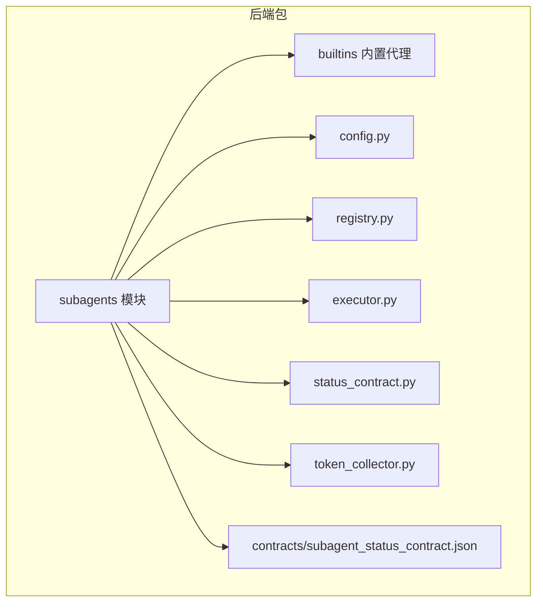
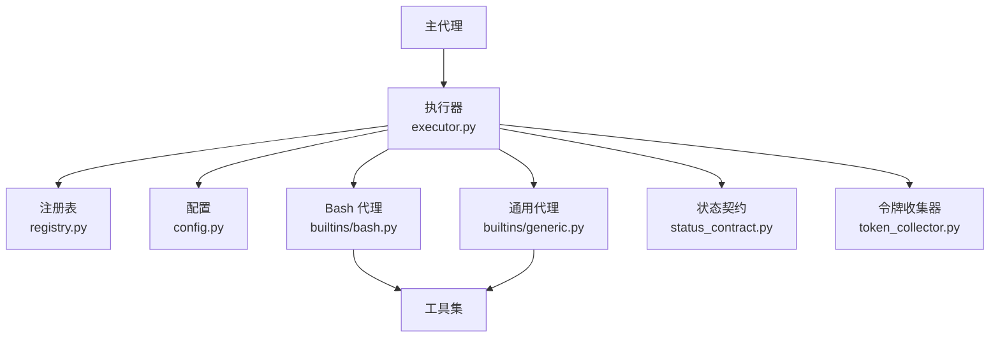
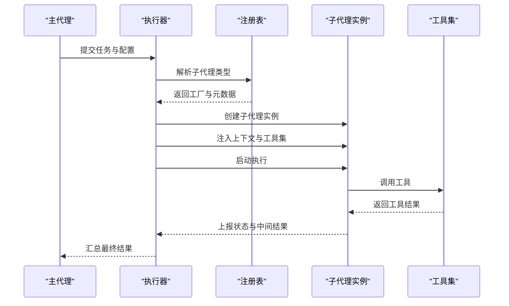
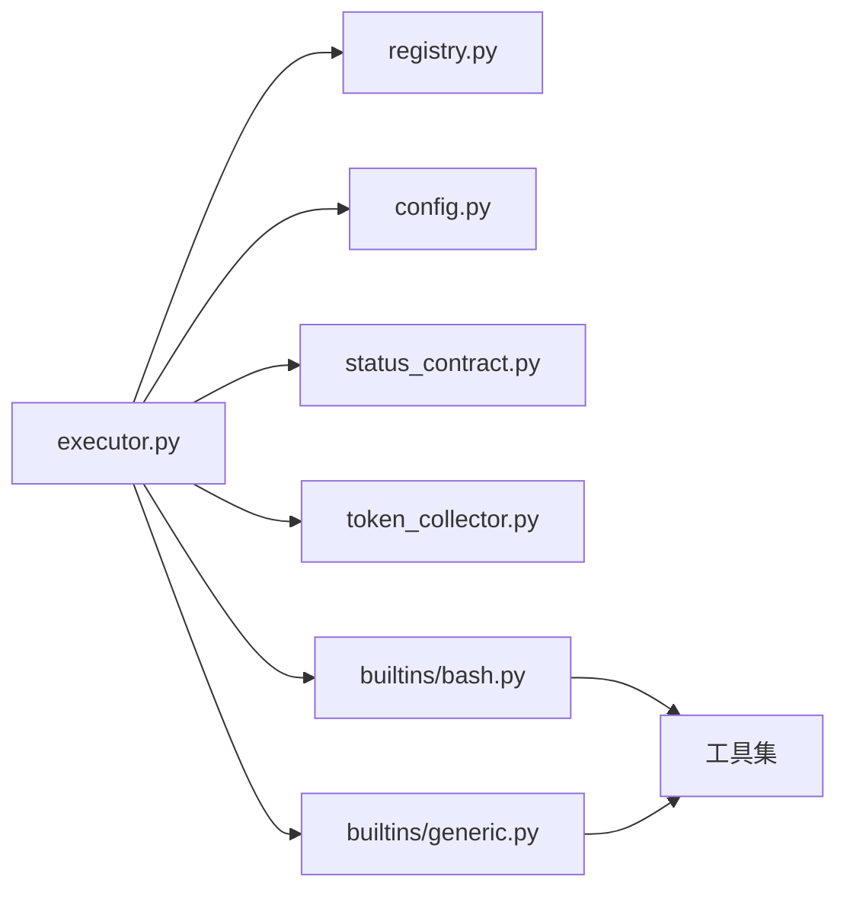

# 子代理

<cite>
**本文引用的文件**
- [contracts/subagent_status_contract.json](file://contracts/subagent_status_contract.json)
- [backend/packages/harness/deerflow/subagents/__init__.py](file://backend/packages/harness/deerflow/subagents/__init__.py)
- [backend/packages/harness/deerflow/subagents/config.py](file://backend/packages/harness/deerflow/subagents/config.py)
- [backend/packages/harness/deerflow/subagents/executor.py](file://backend/packages/harness/deerflow/subagents/executor.py)
- [backend/packages/harness/deerflow/subagents/registry.py](file://backend/packages/harness/deerflow/subagents/registry.py)
- [backend/packages/harness/deerflow/subagents/status_contract.py](file://backend/packages/harness/deerflow/subagents/status_contract.py)
- [backend/packages/harness/deerflow/subagents/token_collector.py](file://backend/packages/harness/deerflow/subagents/token_collector.py)
- [backend/packages/harness/deerflow/subagents/builtins/bash.py](file://backend/packages/harness/deerflow/subagents/builtins/bash.py)
- [backend/packages/harness/deerflow/subagents/builtins/generic.py](file://backend/packages/harness/deerflow/subagents/builtins/generic.py)
- [backend/docs/SUBAGENT.md](file://backend/docs/SUBAGENT.md)
- [backend/tests/test_subagent_executor.py](file://backend/tests/test_subagent_executor.py)
- [backend/tests/test_subagent_status_contract.py](file://backend/tests/test_subagent_status_contract.py)
- [backend/tests/test_subagent_timeout_config.py](file://backend/tests/test_subagent_timeout_config.py)
- [backend/tests/test_subagent_token_collector.py](file://backend/tests/test_subagent_token_collector.py)
- [backend/tests/test_subagent_skills_config.py](file://backend/tests/test_subagent_skills_config.py)
- [backend/tests/test_subagent_limit_middleware.py](file://backend/tests/test_subagent_limit_middleware.py)
- [backend/tests/test_subagent_prompt_security.py](file://backend/tests/test_subagent_prompt_security.py)
</cite>

## 目录
1. [简介](#简介)
2. [项目结构](#项目结构)
3. [核心组件](#核心组件)
4. [架构总览](#架构总览)
5. [详细组件分析](#详细组件分析)
6. [依赖关系分析](#依赖关系分析)
7. [性能考虑](#性能考虑)
8. [故障排除指南](#故障排除指南)
9. [结论](#结论)
10. [附录](#附录)

## 简介
本文件系统性阐述子代理（Subagent）体系的设计与实现，重点覆盖以下方面：
- 复杂任务的分解与并行执行机制
- 子代理的创建流程、上下文隔离、工具配置与终止条件设置
- 内置子代理类型（Bash代理、通用代理）的功能特性
- 生命周期管理、状态同步与结果聚合机制
- 配置示例、性能优化建议与故障排除指南
- 实际任务分解案例与最佳实践

该系统以“主代理”为中心，通过子代理在受控上下文中执行特定子任务，支持并行调度、资源配额、超时与安全策略，最终汇总结果返回给主代理。

## 项目结构
子代理相关代码位于后端包中，采用模块化组织：
- contracts：状态契约定义（JSON Schema）
- backend/packages/harness/deerflow/subagents：核心子代理框架
  - builtins：内置子代理实现（bash、generic）
  - 配置、注册表、执行器、状态契约、令牌收集器等
- backend/tests：针对子代理功能的测试用例
- backend/docs：子代理设计与使用文档

图表来源
- [backend/packages/harness/deerflow/subagents/__init__.py](file://backend/packages/harness/deerflow/subagents/__init__.py)
- [backend/packages/harness/deerflow/subagents/builtins/bash.py](file://backend/packages/harness/deerflow/subagents/builtins/bash.py)
- [backend/packages/harness/deerflow/subagents/builtins/generic.py](file://backend/packages/harness/deerflow/subagents/builtins/generic.py)
- [backend/packages/harness/deerflow/subagents/config.py](file://backend/packages/harness/deerflow/subagents/config.py)
- [backend/packages/harness/deerflow/subagents/registry.py](file://backend/packages/harness/deerflow/subagents/registry.py)
- [backend/packages/harness/deerflow/subagents/executor.py](file://backend/packages/harness/deerflow/subagents/executor.py)
- [backend/packages/harness/deerflow/subagents/status_contract.py](file://backend/packages/harness/deerflow/subagents/status_contract.py)
- [backend/packages/harness/deerflow/subagents/token_collector.py](file://backend/packages/harness/deerflow/subagents/token_collector.py)
- [contracts/subagent_status_contract.json](file://contracts/subagent_status_contract.json)

章节来源
- [backend/packages/harness/deerflow/subagents/__init__.py](file://backend/packages/harness/deerflow/subagents/__init__.py)
- [backend/packages/harness/deerflow/subagents/config.py](file://backend/packages/harness/deerflow/subagents/config.py)
- [backend/packages/harness/deerflow/subagents/registry.py](file://backend/packages/harness/deerflow/subagents/registry.py)
- [backend/packages/harness/deerflow/subagents/executor.py](file://backend/packages/harness/deerflow/subagents/executor.py)
- [backend/packages/harness/deerflow/subagents/status_contract.py](file://backend/packages/harness/deerflow/subagents/status_contract.py)
- [backend/packages/harness/deerflow/subagents/token_collector.py](file://backend/packages/harness/deerflow/subagents/token_collector.py)
- [backend/packages/harness/deerflow/subagents/builtins/bash.py](file://backend/packages/harness/deerflow/subagents/builtins/bash.py)
- [backend/packages/harness/deerflow/subagents/builtins/generic.py](file://backend/packages/harness/deerflow/subagents/builtins/generic.py)
- [contracts/subagent_status_contract.json](file://contracts/subagent_status_contract.json)

## 核心组件
- 配置模块（config.py）：定义子代理运行参数、工具集、超时、资源限制等
- 注册表（registry.py）：维护可用子代理类型与工厂映射
- 执行器（executor.py）：负责子代理实例化、调度、并发控制、结果聚合
- 状态契约（status_contract.py）：约束子代理状态字段与序列化格式
- 令牌收集器（token_collector.py）：统计子代理调用产生的Token用量
- 内置代理（builtins）：bash、generic两类内置实现
- 状态契约定义（contracts/subagent_status_contract.json）：JSON Schema规范

章节来源
- [backend/packages/harness/deerflow/subagents/config.py](file://backend/packages/harness/deerflow/subagents/config.py)
- [backend/packages/harness/deerflow/subagents/registry.py](file://backend/packages/harness/deerflow/subagents/registry.py)
- [backend/packages/harness/deerflow/subagents/executor.py](file://backend/packages/harness/deerflow/subagents/executor.py)
- [backend/packages/harness/deerflow/subagents/status_contract.py](file://backend/packages/harness/deerflow/subagents/status_contract.py)
- [backend/packages/harness/deerflow/subagents/token_collector.py](file://backend/packages/harness/deerflow/subagents/token_collector.py)
- [backend/packages/harness/deerflow/subagents/builtins/bash.py](file://backend/packages/harness/deerflow/subagents/builtins/bash.py)
- [backend/packages/harness/deerflow/subagents/builtins/generic.py](file://backend/packages/harness/deerflow/subagents/builtins/generic.py)
- [contracts/subagent_status_contract.json](file://contracts/subagent_status_contract.json)

## 架构总览
子代理系统围绕“主代理-子代理-工具集”的三层结构工作：
- 主代理：负责任务规划、分解、并行调度与结果聚合
- 子代理：在隔离上下文中执行具体子任务，遵循配置与安全策略
- 工具集：由子代理按需调用，支持本地/远程工具与沙箱能力

图表来源
- [backend/packages/harness/deerflow/subagents/executor.py](file://backend/packages/harness/deerflow/subagents/executor.py)
- [backend/packages/harness/deerflow/subagents/registry.py](file://backend/packages/harness/deerflow/subagents/registry.py)
- [backend/packages/harness/deerflow/subagents/config.py](file://backend/packages/harness/deerflow/subagents/config.py)
- [backend/packages/harness/deerflow/subagents/builtins/bash.py](file://backend/packages/harness/deerflow/subagents/builtins/bash.py)
- [backend/packages/harness/deerflow/subagents/builtins/generic.py](file://backend/packages/harness/deerflow/subagents/builtins/generic.py)
- [backend/packages/harness/deerflow/subagents/status_contract.py](file://backend/packages/harness/deerflow/subagents/status_contract.py)
- [backend/packages/harness/deerflow/subagents/token_collector.py](file://backend/packages/harness/deerflow/subagents/token_collector.py)

## 详细组件分析

### 配置模块（config.py）
职责
- 定义子代理运行时配置项：工具列表、超时阈值、并发上限、资源配额、安全策略等
- 提供配置校验与默认值填充，确保执行器与内置代理正确加载

关键点
- 工具配置：声明可用工具及其参数模式
- 超时与重试：为每个子代理设定最大执行时间与失败重试策略
- 并发与配额：限制同时运行的子代理数量与资源消耗
- 安全与隔离：控制文件访问、网络访问与命令白名单

章节来源
- [backend/packages/harness/deerflow/subagents/config.py](file://backend/packages/harness/deerflow/subagents/config.py)

### 注册表（registry.py）
职责
- 维护子代理类型到工厂函数的映射，支持动态扩展
- 提供类型解析与实例化入口，屏蔽具体实现细节

关键点
- 类型注册：内置类型（如 bash、generic）在此注册
- 工厂接口：统一创建子代理实例的接口签名
- 可扩展性：允许外部插件注册新的子代理类型

章节来源
- [backend/packages/harness/deerflow/subagents/registry.py](file://backend/packages/harness/deerflow/subagents/registry.py)

### 执行器（executor.py）
职责
- 协调子代理生命周期：创建、启动、监控、回收
- 控制并行度与资源分配，避免资源争用
- 汇聚各子代理输出，生成统一的结果结构

关键流程
- 解析配置与注册表，选择合适的子代理类型
- 初始化上下文与工具集，应用安全与隔离策略
- 启动子代理并等待完成或超时
- 聚合结果与统计信息（如Token用量）

图表来源
- [backend/packages/harness/deerflow/subagents/executor.py](file://backend/packages/harness/deerflow/subagents/executor.py)
- [backend/packages/harness/deerflow/subagents/registry.py](file://backend/packages/harness/deerflow/subagents/registry.py)

章节来源
- [backend/packages/harness/deerflow/subagents/executor.py](file://backend/packages/harness/deerflow/subagents/executor.py)

### 状态契约（status_contract.py）
职责
- 规范子代理状态字段与序列化格式，确保跨组件一致性
- 定义状态流转的关键节点（开始、进行中、完成、失败、超时等）

关键点
- 字段清单：包含任务ID、状态、进度、错误码、耗时、输出摘要等
- 序列化规则：统一JSON结构，便于前端与日志系统消费
- 版本兼容：支持状态结构演进与向后兼容

章节来源
- [backend/packages/harness/deerflow/subagents/status_contract.py](file://backend/packages/harness/deerflow/subagents/status_contract.py)
- [contracts/subagent_status_contract.json](file://contracts/subagent_status_contract.json)

### 令牌收集器（token_collector.py）
职责
- 统计子代理调用LLM或工具产生的Token用量
- 支持预算控制与成本审计

关键点
- 计数维度：输入、输出、工具调用等
- 预算告警：达到阈值时触发中断或降级
- 结果合并：与执行器协同，输出总用量

章节来源
- [backend/packages/harness/deerflow/subagents/token_collector.py](file://backend/packages/harness/deerflow/subagents/token_collector.py)

### 内置子代理：Bash代理（builtins/bash.py）
功能特性
- 在受限环境中执行Shell命令，支持命令白名单与工作目录隔离
- 输出捕获与错误处理，支持超时与信号中断
- 与工具集集成，可调用本地脚本与外部工具

适用场景
- 文件系统操作、进程管理、环境探测、部署脚本等

章节来源
- [backend/packages/harness/deerflow/subagents/builtins/bash.py](file://backend/packages/harness/deerflow/subagents/builtins/bash.py)

### 内置子代理：通用代理（builtins/generic.py）
功能特性
- 作为通用执行载体，支持灵活的任务描述与工具调用
- 可嵌套子代理，形成多层任务分解
- 与安全策略联动，限制危险操作与资源访问

适用场景
- 数据抓取、文本处理、API调用、复杂流程编排

章节来源
- [backend/packages/harness/deerflow/subagents/builtins/generic.py](file://backend/packages/harness/deerflow/subagents/builtins/generic.py)

### 生命周期管理、状态同步与结果聚合
生命周期
- 创建：根据配置与注册表创建实例
- 启动：注入上下文、工具集与安全策略
- 运行：执行任务，周期性上报状态
- 终止：正常完成、超时、失败、被取消
- 回收：释放资源、清理临时文件

状态同步
- 周期性上报：子代理定期上报状态与中间结果
- 状态契约：统一状态结构，便于上层聚合
- 异步事件：支持事件驱动的状态变更

结果聚合
- 结构化输出：将各子代理结果合并为统一格式
- 错误处理：对失败子代理进行降级与重试策略
- 成本统计：汇总Token用量与资源消耗

章节来源
- [backend/packages/harness/deerflow/subagents/executor.py](file://backend/packages/harness/deerflow/subagents/executor.py)
- [backend/packages/harness/deerflow/subagents/status_contract.py](file://backend/packages/harness/deerflow/subagents/status_contract.py)
- [backend/packages/harness/deerflow/subagents/token_collector.py](file://backend/packages/harness/deerflow/subagents/token_collector.py)

### 终止条件与安全策略
- 超时终止：基于配置的全局与单任务超时
- 资源限制：CPU、内存、磁盘、文件句柄等配额
- 安全白名单：命令、文件路径、网络端口等限制
- 中断信号：支持SIGTERM、SIGKILL等信号处理
- 日志与审计：记录关键操作与异常

章节来源
- [backend/packages/harness/deerflow/subagents/config.py](file://backend/packages/harness/deerflow/subagents/config.py)
- [backend/packages/harness/deerflow/subagents/executor.py](file://backend/packages/harness/deerflow/subagents/executor.py)

### 工具配置与上下文隔离
- 工具配置：在配置中声明工具名称、参数、权限与调用频率限制
- 上下文隔离：为每个子代理分配独立工作目录、环境变量与用户身份
- 沙箱能力：限制文件系统与网络访问，防止越权操作

章节来源
- [backend/packages/harness/deerflow/subagents/config.py](file://backend/packages/harness/deerflow/subagents/config.py)
- [backend/packages/harness/deerflow/subagents/executor.py](file://backend/packages/harness/deerflow/subagents/executor.py)

## 依赖关系分析
模块间耦合与协作
- 执行器依赖注册表解析类型，依赖配置加载参数，依赖状态契约与令牌收集器进行结果与统计
- 内置代理依赖工具集与安全策略，向上提供统一接口
- 测试用例覆盖执行器、状态契约、超时配置、令牌统计、技能配置与并发限制等

图表来源
- [backend/packages/harness/deerflow/subagents/executor.py](file://backend/packages/harness/deerflow/subagents/executor.py)
- [backend/packages/harness/deerflow/subagents/registry.py](file://backend/packages/harness/deerflow/subagents/registry.py)
- [backend/packages/harness/deerflow/subagents/config.py](file://backend/packages/harness/deerflow/subagents/config.py)
- [backend/packages/harness/deerflow/subagents/status_contract.py](file://backend/packages/harness/deerflow/subagents/status_contract.py)
- [backend/packages/harness/deerflow/subagents/token_collector.py](file://backend/packages/harness/deerflow/subagents/token_collector.py)
- [backend/packages/harness/deerflow/subagents/builtins/bash.py](file://backend/packages/harness/deerflow/subagents/builtins/bash.py)
- [backend/packages/harness/deerflow/subagents/builtins/generic.py](file://backend/packages/harness/deerflow/subagents/builtins/generic.py)

章节来源
- [backend/packages/harness/deerflow/subagents/executor.py](file://backend/packages/harness/deerflow/subagents/executor.py)
- [backend/packages/harness/deerflow/subagents/registry.py](file://backend/packages/harness/deerflow/subagents/registry.py)
- [backend/packages/harness/deerflow/subagents/config.py](file://backend/packages/harness/deerflow/subagents/config.py)
- [backend/packages/harness/deerflow/subagents/status_contract.py](file://backend/packages/harness/deerflow/subagents/status_contract.py)
- [backend/packages/harness/deerflow/subagents/token_collector.py](file://backend/packages/harness/deerflow/subagents/token_collector.py)
- [backend/packages/harness/deerflow/subagents/builtins/bash.py](file://backend/packages/harness/deerflow/subagents/builtins/bash.py)
- [backend/packages/harness/deerflow/subagents/builtins/generic.py](file://backend/packages/harness/deerflow/subagents/builtins/generic.py)

## 性能考虑
- 并发控制：合理设置并发上限，避免I/O瓶颈；对CPU密集型任务采用队列化调度
- 资源配额：为子代理设置CPU/内存/磁盘限额，防止资源争用
- 超时策略：为长尾任务设置短超时与快速失败，保障整体吞吐
- 缓存与复用：对重复工具调用结果进行缓存，减少重复计算
- I/O优化：批量写入、异步读取、压缩传输，降低网络与磁盘压力
- 监控与采样：对关键指标进行采样与可视化，及时发现性能退化

## 故障排除指南
常见问题与定位方法
- 子代理无响应：检查超时配置与并发上限；查看状态契约中的“进行中”上报频率
- 工具调用失败：核对工具配置与权限；确认安全白名单是否放行
- 资源耗尽：调整资源配额与并发；监控磁盘与文件句柄使用
- 结果不一致：检查状态契约版本与序列化规则；确认聚合逻辑
- 令牌用量异常：核对令牌收集器统计口径；检查是否启用预算告警

章节来源
- [backend/tests/test_subagent_executor.py](file://backend/tests/test_subagent_executor.py)
- [backend/tests/test_subagent_status_contract.py](file://backend/tests/test_subagent_status_contract.py)
- [backend/tests/test_subagent_timeout_config.py](file://backend/tests/test_subagent_timeout_config.py)
- [backend/tests/test_subagent_token_collector.py](file://backend/tests/test_subagent_token_collector.py)
- [backend/tests/test_subagent_skills_config.py](file://backend/tests/test_subagent_skills_config.py)
- [backend/tests/test_subagent_limit_middleware.py](file://backend/tests/test_subagent_limit_middleware.py)
- [backend/tests/test_subagent_prompt_security.py](file://backend/tests/test_subagent_prompt_security.py)

## 结论
子代理系统通过清晰的模块划分与严格的契约约束，实现了复杂任务的高效分解与并行执行。其内置类型覆盖了常见的执行场景，配合完善的配置、安全与统计能力，能够满足生产环境对可靠性与可观测性的要求。建议在实际部署中结合业务特征优化并发与资源配额，并持续完善状态契约与工具集以提升稳定性与可维护性。

## 附录

### 配置示例（路径参考）
- 子代理配置：[backend/packages/harness/deerflow/subagents/config.py](file://backend/packages/harness/deerflow/subagents/config.py)
- 状态契约Schema：[contracts/subagent_status_contract.json](file://contracts/subagent_status_contract.json)
- 文档说明：[backend/docs/SUBAGENT.md](file://backend/docs/SUBAGENT.md)

### 最佳实践
- 将高风险操作封装为Bash代理，严格限制命令与路径
- 对通用代理的任务描述进行分层拆解，避免单次任务过长
- 使用令牌收集器进行成本控制，设置预算与告警
- 通过状态契约标准化输出，便于前端展示与日志分析
- 在测试中覆盖超时、并发限制与安全策略，确保鲁棒性