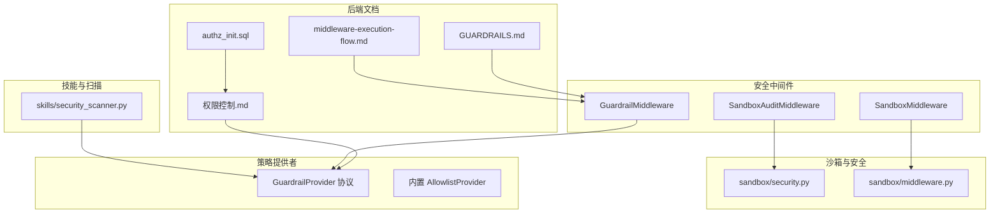
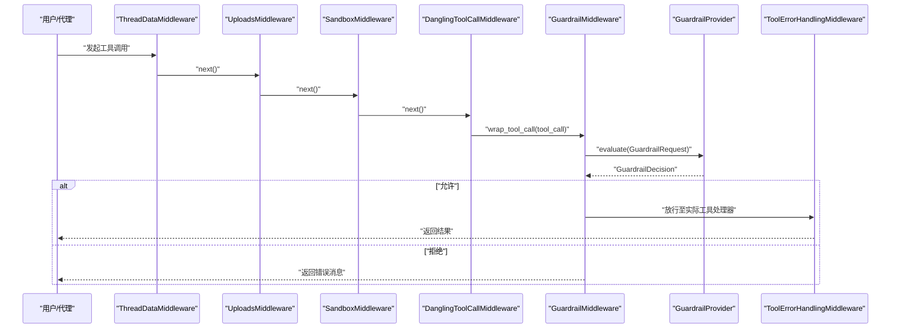
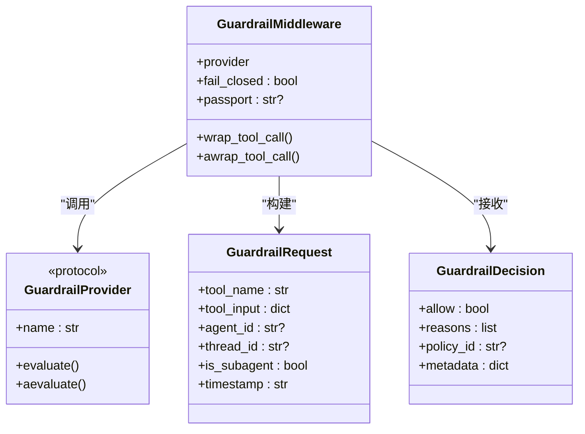
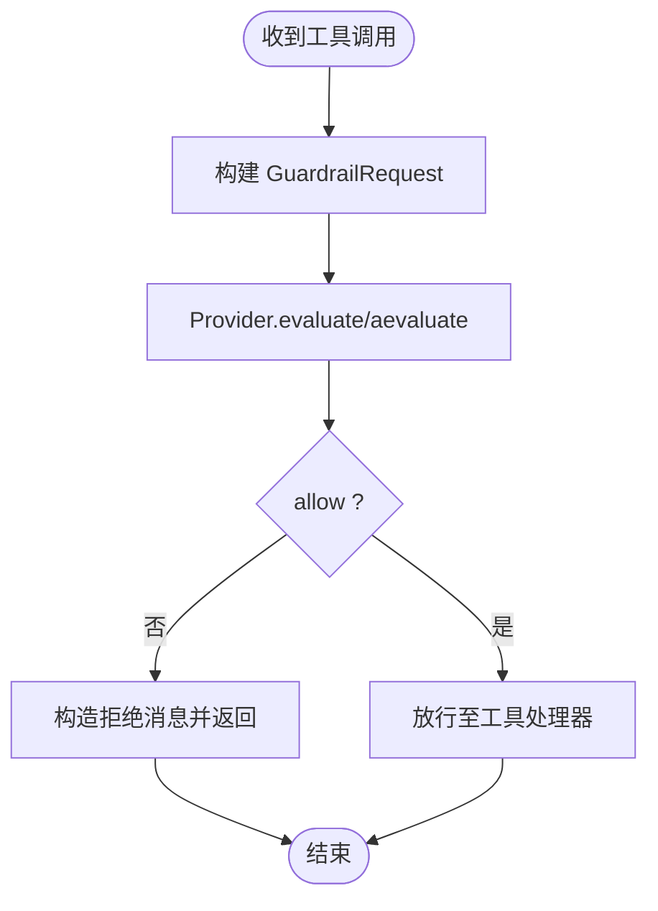
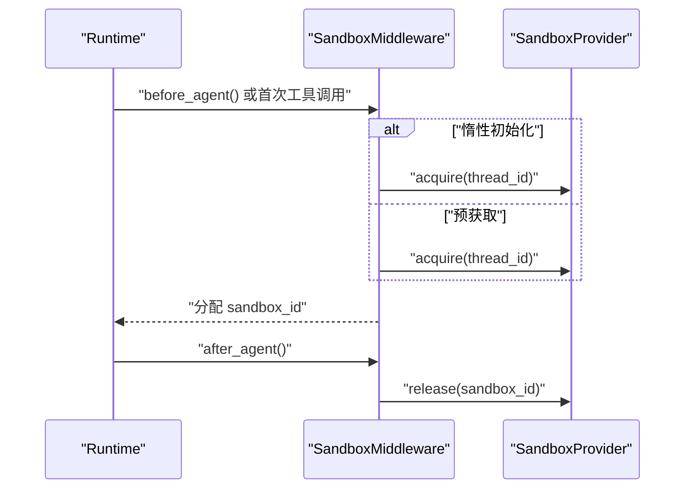
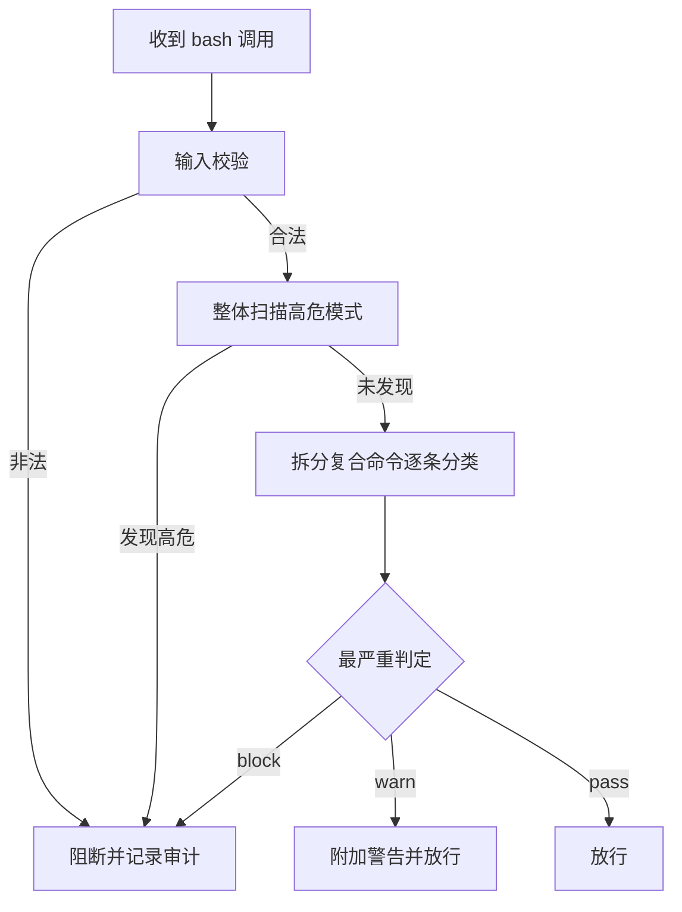
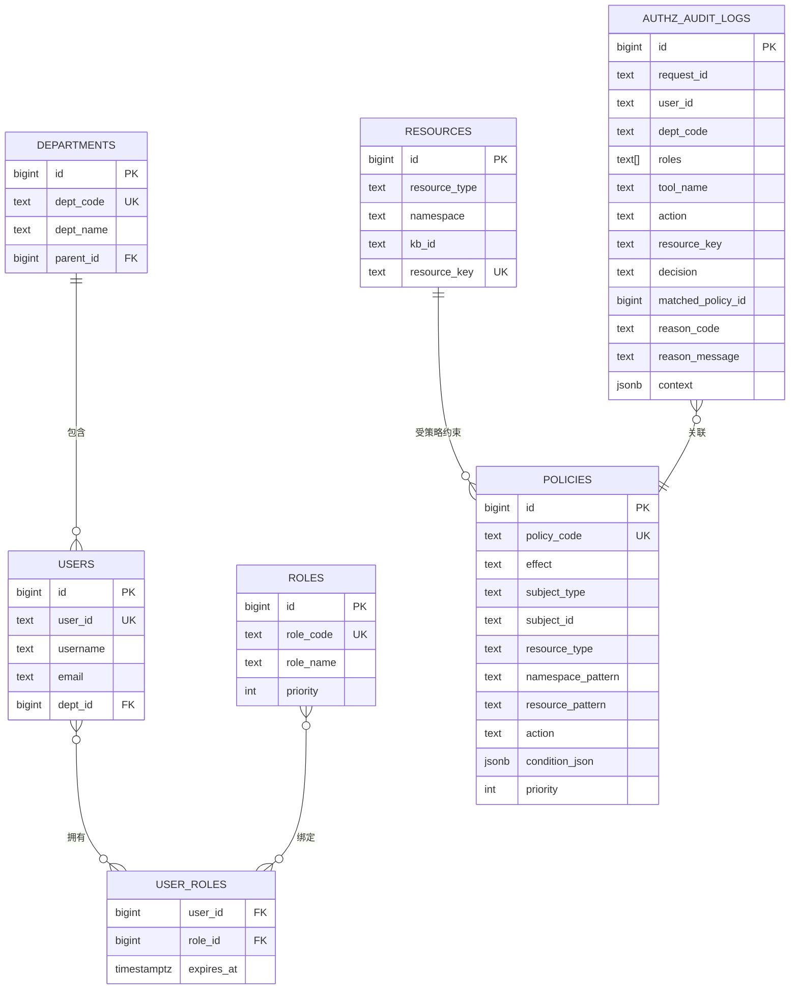
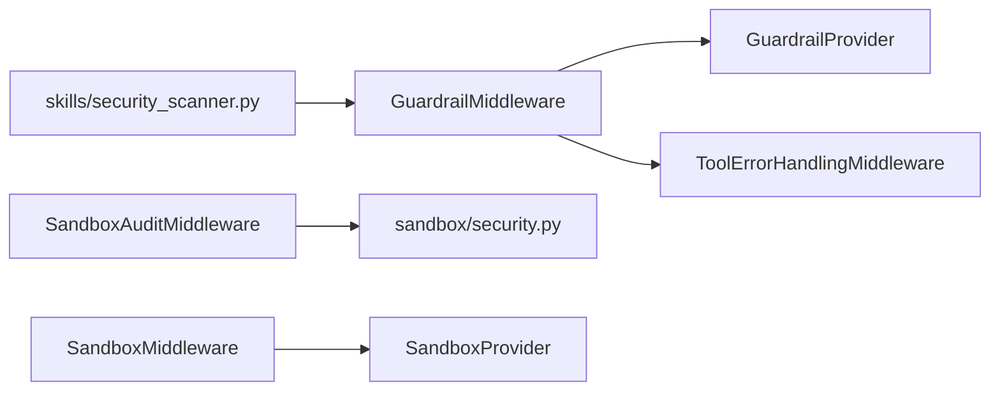

# 安全和权限管理

<cite>
**本文引用的文件**
- [GUARDRAILS.md](file://backend/docs/GUARDRAILS.md)
- [middleware-execution-flow.md](file://backend/docs/middleware-execution-flow.md)
- [权限控制.md](file://docs/权限控制.md)
- [authz_init.sql](file://docs/sql/authz_init.sql)
- [security.py](file://backend/packages/harness/deerflow/sandbox/security.py)
- [sandbox_audit_middleware.py](file://backend/packages/harness/deerflow/agents/middlewares/sandbox_audit_middleware.py)
- [middleware.py](file://backend/packages/harness/deerflow/guardrails/middleware.py)
- [provider.py](file://backend/packages/harness/deerflow/guardrails/provider.py)
- [middleware.py](file://backend/packages/harness/deerflow/sandbox/middleware.py)
- [security_scanner.py](file://backend/packages/harness/deerflow/skills/security_scanner.py)
- [test_sandbox_audit_middleware.py](file://backend/tests/test_sandbox_audit_middleware.py)
- [SECURITY.md](file://SECURITY.md)
</cite>

## 目录
1. [简介](#简介)
2. [项目结构](#项目结构)
3. [核心组件](#核心组件)
4. [架构总览](#架构总览)
5. [详细组件分析](#详细组件分析)
6. [依赖分析](#依赖分析)
7. [性能考虑](#性能考虑)
8. [故障排查指南](#故障排查指南)
9. [结论](#结论)
10. [附录](#附录)

## 简介
本文件面向DeerFlow的安全与权限管理，系统化梳理其安全架构设计与多层次防护机制，重点覆盖：
- 认证与会话：基于SSO签发的JWT，结合后端中间件链进行鉴权与授权。
- 授权控制：RBAC + ABAC的策略引擎，支持资源隔离、权限继承与细粒度条件控制。
- 数据保护：传输加密、存储加密与敏感信息过滤的实践建议。
- 安全中间件：请求拦截、行为审计与异常检测的实现与配置。
- 最佳实践：部署安全、配置建议与风险评估方法。
- 合规与扫描：安全扫描与合规性检查的实施路径。

## 项目结构
围绕安全与权限的关键目录与文件：
- 后端文档与中间件链说明：backend/docs
- 授权策略与数据库脚本：docs/sql、docs/权限控制.md
- 安全中间件与沙箱：backend/packages/harness/deerflow/agents/middlewares、sandbox、guardrails
- 安全扫描与策略提供者：skills/security_scanner.py、guardrails/provider.py、middleware.py
- 测试与安全政策：backend/tests、SECURITY.md

**图表来源**
- [GUARDRAILS.md:38-70](file://backend/docs/GUARDRAILS.md#L38-L70)
- [middleware-execution-flow.md:156-216](file://backend/docs/middleware-execution-flow.md#L156-L216)
- [权限控制.md:1-539](file://docs/权限控制.md#L1-L539)
- [authz_init.sql:1-252](file://docs/sql/authz_init.sql#L1-L252)
- [middleware.py:20-99](file://backend/packages/harness/deerflow/guardrails/middleware.py#L20-L99)
- [sandbox_audit_middleware.py:209-387](file://backend/packages/harness/deerflow/agents/middlewares/sandbox_audit_middleware.py#L209-L387)
- [security.py:1-46](file://backend/packages/harness/deerflow/sandbox/security.py#L1-L46)
- [middleware.py:21-84](file://backend/packages/harness/deerflow/sandbox/middleware.py#L21-L84)
- [provider.py:9-57](file://backend/packages/harness/deerflow/guardrails/provider.py#L9-L57)
- [security_scanner.py:1-69](file://backend/packages/harness/deerflow/skills/security_scanner.py#L1-L69)

**章节来源**
- [GUARDRAILS.md:1-386](file://backend/docs/GUARDRAILS.md#L1-L386)
- [middleware-execution-flow.md:156-216](file://backend/docs/middleware-execution-flow.md#L156-L216)
- [权限控制.md:1-539](file://docs/权限控制.md#L1-L539)
- [authz_init.sql:1-252](file://docs/sql/authz_init.sql#L1-L252)

## 核心组件
- 守卫护栏中间件（GuardrailMiddleware）：在工具调用前进行策略评估，支持fail-closed/fail-open、错误降级与LangGraph控制信号透传。
- 策略提供者协议（GuardrailProvider）：定义标准化的evaluate/aevaluate接口，支持内置白名单、OAP Passport与自定义实现。
- 沙箱中间件（SandboxMiddleware）：按线程生命周期管理沙箱分配与释放，支持惰性初始化以优化性能。
- 沙箱审计中间件（SandboxAuditMiddleware）：对bash命令进行分类与审计，高危阻断、中危警告、低危放行，并记录审计日志。
- 沙箱安全策略（sandbox/security.py）：根据配置判断是否允许主机bash与子代理bash，避免非隔离边界的风险。
- 技能安全扫描（skills/security_scanner.py）：对技能内容进行安全审查，支持可执行与非可执行内容的分级判定。
- 授权策略与审计（RBAC + ABAC）：PostgreSQL策略表、资源目录与审计日志，提供统一资源键与冲突处理规则。

**章节来源**
- [middleware.py:20-99](file://backend/packages/harness/deerflow/guardrails/middleware.py#L20-L99)
- [provider.py:9-57](file://backend/packages/harness/deerflow/guardrails/provider.py#L9-L57)
- [middleware.py:21-84](file://backend/packages/harness/deerflow/sandbox/middleware.py#L21-L84)
- [sandbox_audit_middleware.py:209-387](file://backend/packages/harness/deerflow/agents/middlewares/sandbox_audit_middleware.py#L209-L387)
- [security.py:1-46](file://backend/packages/harness/deerflow/sandbox/security.py#L1-L46)
- [security_scanner.py:1-69](file://backend/packages/harness/deerflow/skills/security_scanner.py#L1-L69)
- [权限控制.md:1-539](file://docs/权限控制.md#L1-L539)
- [authz_init.sql:97-227](file://docs/sql/authz_init.sql#L97-L227)

## 架构总览
下图展示工具调用在中间件链中的执行顺序与安全控制点，以及策略提供者的评估位置。

**图表来源**
- [GUARDRAILS.md:38-70](file://backend/docs/GUARDRAILS.md#L38-L70)
- [middleware-execution-flow.md:156-216](file://backend/docs/middleware-execution-flow.md#L156-L216)
- [middleware.py:54-98](file://backend/packages/harness/deerflow/guardrails/middleware.py#L54-L98)

## 详细组件分析

### 守卫护栏中间件（GuardrailMiddleware）
- 功能要点
  - 将工具调用封装为GuardrailRequest并交由Provider评估。
  - 支持同步/异步评估，fail-closed时提供降级拒绝，fail-open时在异常情况下放行。
  - 对LangGraph控制信号（GraphBubbleUp）不做捕获，确保中断/暂停/恢复语义正确传递。
  - 将拒绝原因结构化输出为ToolMessage，便于代理自适应调整。
- 配置与加载
  - 通过配置项启用/禁用，指定Provider类路径与参数，框架自动解析并注入framework="deerflow"。
- 使用建议
  - 在生产环境建议开启fail-closed，确保异常情况下的安全边界。
  - 提供者需实现稳定的evaluate/aevaluate，避免因外部服务波动影响主链路。

**图表来源**
- [middleware.py:20-99](file://backend/packages/harness/deerflow/guardrails/middleware.py#L20-L99)
- [provider.py:9-57](file://backend/packages/harness/deerflow/guardrails/provider.py#L9-L57)

**章节来源**
- [middleware.py:20-99](file://backend/packages/harness/deerflow/guardrails/middleware.py#L20-L99)
- [GUARDRAILS.md:332-351](file://backend/docs/GUARDRAILS.md#L332-L351)

### 策略提供者协议（GuardrailProvider）
- 协议定义
  - evaluate/aevaluate：输入GuardrailRequest，输出GuardrailDecision。
  - GuardrailReason：结构化原因码与消息。
  - GuardrailDecision：包含allow、reasons、policy_id与metadata。
- 实现选项
  - 内置AllowlistProvider：基于工具名的黑白名单。
  - OAP Passport Provider：遵循Open Agent Passport标准，支持能力声明与限制。
  - 自定义Provider：按业务需求实现策略逻辑与条件评估。

**图表来源**
- [provider.py:9-57](file://backend/packages/harness/deerflow/guardrails/provider.py#L9-L57)
- [middleware.py:54-98](file://backend/packages/harness/deerflow/guardrails/middleware.py#L54-L98)

**章节来源**
- [provider.py:9-57](file://backend/packages/harness/deerflow/guardrails/provider.py#L9-L57)
- [GUARDRAILS.md:254-324](file://backend/docs/GUARDRAILS.md#L254-L324)

### 沙箱中间件（SandboxMiddleware）
- 生命周期管理
  - 惰性初始化：默认在首次工具调用时获取沙箱，减少启动开销。
  - 按线程复用：同一thread_id复用沙箱，避免频繁创建/销毁。
  - 释放策略：在agent结束后释放，或通过应用关闭时统一回收。
- 集成点
  - 与SandboxAuditMiddleware配合，确保命令在受控环境中执行。

**图表来源**
- [middleware.py:21-84](file://backend/packages/harness/deerflow/sandbox/middleware.py#L21-L84)

**章节来源**
- [middleware.py:21-84](file://backend/packages/harness/deerflow/sandbox/middleware.py#L21-L84)

### 沙箱审计中间件（SandboxAuditMiddleware）
- 命令分类与阻断
  - 高危模式：如rm -rf、curl|bash、动态链接劫持、fork bomb等，直接阻断。
  - 中危模式：如chmod 777、sudo、PATH修改，记录警告但放行。
  - 包安装模式：默认警告，可通过配置强制阻断。
- 输入校验与审计
  - 空命令、超长命令、空字节等非法输入直接阻断。
  - 每次bash调用均写入审计日志，包含thread_id、命令与判定结果。
- 配置开关
  - sandbox.block_package_install_commands：是否阻断包安装命令。

**图表来源**
- [sandbox_audit_middleware.py:175-202](file://backend/packages/harness/deerflow/agents/middlewares/sandbox_audit_middleware.py#L175-L202)
- [sandbox_audit_middleware.py:289-304](file://backend/packages/harness/deerflow/agents/middlewares/sandbox_audit_middleware.py#L289-L304)
- [sandbox_audit_middleware.py:248-258](file://backend/packages/harness/deerflow/agents/middlewares/sandbox_audit_middleware.py#L248-L258)

**章节来源**
- [sandbox_audit_middleware.py:209-387](file://backend/packages/harness/deerflow/agents/middlewares/sandbox_audit_middleware.py#L209-L387)
- [test_sandbox_audit_middleware.py:285-488](file://backend/tests/test_sandbox_audit_middleware.py#L285-L488)

### 沙箱安全策略（sandbox/security.py）
- 本地沙箱提供者检测：识别LocalSandboxProvider，避免在非隔离边界执行bash。
- 主机bash许可：仅在明确允许且可信环境下启用。
- 子代理bash限制：与本地沙箱配合，防止越界执行。

**章节来源**
- [security.py:1-46](file://backend/packages/harness/deerflow/sandbox/security.py#L1-L46)

### 技能安全扫描（skills/security_scanner.py）
- 目标：在技能写入磁盘前进行安全审查，识别提示注入、系统角色覆盖、特权提升、数据外泄与不安全可执行代码。
- 方法：基于LLM的评分与JSON输出，支持可执行与非可执行内容的分级判定；当模型不可用时采用保守降级策略。
- 配置：通过配置项选择审核模型名称，确保与后端模型工厂兼容。

**章节来源**
- [security_scanner.py:1-69](file://backend/packages/harness/deerflow/skills/security_scanner.py#L1-L69)

### 授权控制（RBAC + ABAC）
- 统一资源命名：tool:xxx、kb:ns:kb_id、mcp:server:tool。
- 冲突处理：deny优先、默认拒绝；按priority升序匹配。
- 数据模型：部门/用户/角色/资源/策略/审计日志，配套索引与样例策略。
- JWT约定：sub/dept/roles/tenant等字段映射至用户身份与命名空间校验。
- 审计落库：每次授权决策写入审计日志，支持复盘与追踪。

**图表来源**
- [权限控制.md:42-227](file://docs/权限控制.md#L42-L227)
- [authz_init.sql:22-227](file://docs/sql/authz_init.sql#L22-L227)

**章节来源**
- [权限控制.md:1-539](file://docs/权限控制.md#L1-L539)
- [authz_init.sql:1-252](file://docs/sql/authz_init.sql#L1-L252)

## 依赖分析
- 中间件链耦合
  - GuardrailMiddleware位于SandboxMiddleware之后，确保在受控沙箱内进行策略评估。
  - SandboxAuditMiddleware独立于沙箱分配，专注命令分类与审计。
- Provider解耦
  - 通过配置加载任意实现，无需继承特定基类，降低耦合度。
- 外部依赖
  - OAP Passport提供者可本地或API评估，满足不同延迟与网络要求。
  - PostgreSQL用于策略与审计存储，提供可审计性与可扩展性。

**图表来源**
- [GUARDRAILS.md:38-70](file://backend/docs/GUARDRAILS.md#L38-L70)
- [middleware.py:20-99](file://backend/packages/harness/deerflow/guardrails/middleware.py#L20-L99)
- [sandbox_audit_middleware.py:209-387](file://backend/packages/harness/deerflow/agents/middlewares/sandbox_audit_middleware.py#L209-L387)
- [security.py:1-46](file://backend/packages/harness/deerflow/sandbox/security.py#L1-L46)
- [middleware.py:21-84](file://backend/packages/harness/deerflow/sandbox/middleware.py#L21-L84)
- [security_scanner.py:1-69](file://backend/packages/harness/deerflow/skills/security_scanner.py#L1-L69)

**章节来源**
- [GUARDRAILS.md:38-70](file://backend/docs/GUARDRAILS.md#L38-L70)

## 性能考虑
- 惰性沙箱初始化：减少首次调用延迟，适合长对话与多轮交互。
- Provider评估策略：本地OAP评估延迟低，API评估在网络受限时可切换本地模式。
- 缓存与异步：建议对高频策略查询做本地短缓存，并将审计日志异步写入，避免阻塞主链路。
- 命令分类复杂度：正则与shlex分析在合理阈值内，注意超长命令的输入校验以避免资源消耗。

[本节为通用指导，无需列出具体文件来源]

## 故障排查指南
- Guardrail未生效
  - 检查中间件链是否包含GuardrailMiddleware，确认配置项enabled与provider.use正确。
  - 关注fail_closed设置，异常时是否被降级为允许。
- 沙箱命令被误判
  - 查看SandboxAuditMiddleware的审计日志，确认命令是否触发高危/中危规则。
  - 调整sandbox.block_package_install_commands配置以平衡安全与可用性。
- 授权策略不命中
  - 核对JWT claims映射（sub/dept/roles），确保与策略subject一致。
  - 检查resource_key/action/namespace是否与策略pattern匹配。
  - 确认策略priority与生效时间窗口（valid_from/valid_to）。
- 审计日志缺失
  - 确认authz_audit_logs表存在且具备写入权限。
  - 检查Provider是否正确记录决策与策略ID。

**章节来源**
- [middleware.py:54-98](file://backend/packages/harness/deerflow/guardrails/middleware.py#L54-L98)
- [sandbox_audit_middleware.py:248-346](file://backend/packages/harness/deerflow/agents/middlewares/sandbox_audit_middleware.py#L248-L346)
- [权限控制.md:434-539](file://docs/权限控制.md#L434-L539)
- [authz_init.sql:97-138](file://docs/sql/authz_init.sql#L97-L138)

## 结论
DeerFlow通过“中间件链 + 策略提供者 + 沙箱与审计”的组合，构建了可插拔、可审计、可扩展的安全与权限体系。RBAC + ABAC策略与PostgreSQL存储提供了强大的授权控制能力；GuardrailMiddleware与SandboxAuditMiddleware在工具调用前与执行中形成双重防线；沙箱安全策略与技能扫描进一步强化了运行时与供应链安全。建议在生产环境中启用fail-closed、完善审计与告警，并持续优化策略与缓存策略以平衡安全与性能。

[本节为总结性内容，无需列出具体文件来源]

## 附录
- 安全政策与漏洞报告
  - 项目提供安全政策与漏洞上报入口，建议定期关注最新版本与修复补丁。
- 授权策略初始化
  - 使用提供的SQL脚本一键初始化表结构、索引与样例策略，便于快速落地。

**章节来源**
- [SECURITY.md:1-13](file://SECURITY.md#L1-L13)
- [authz_init.sql:1-252](file://docs/sql/authz_init.sql#L1-L252)