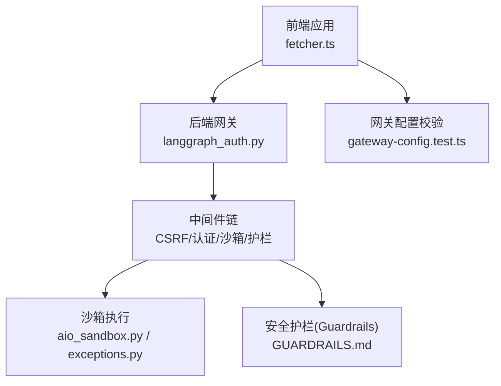
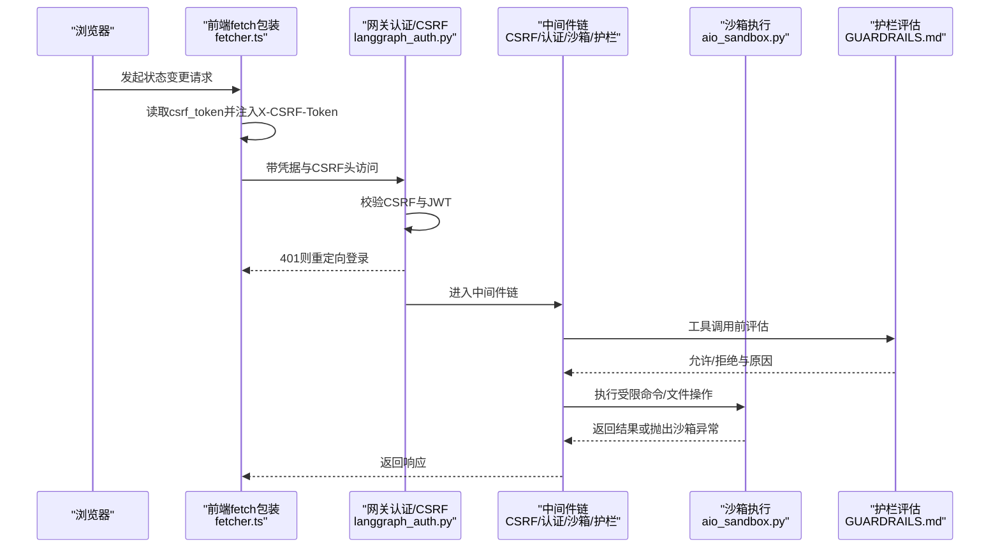
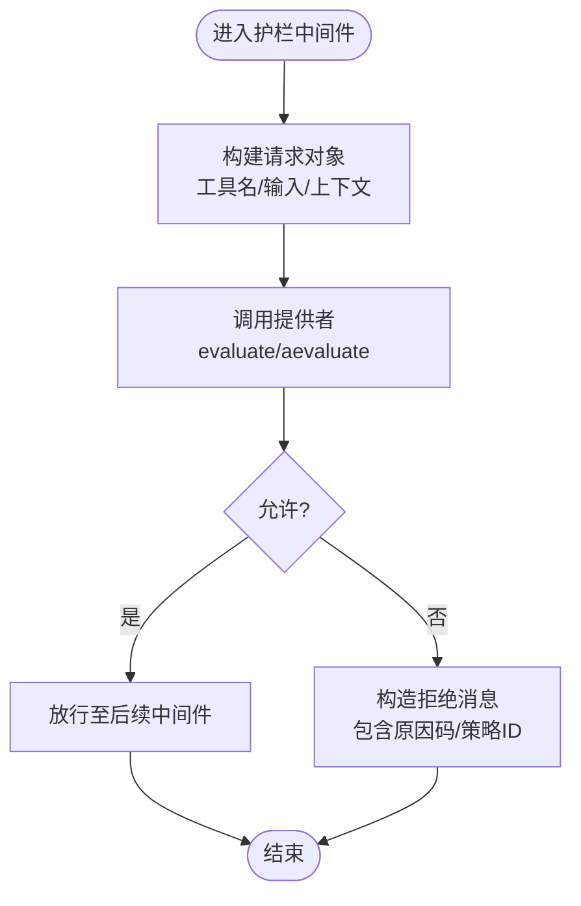
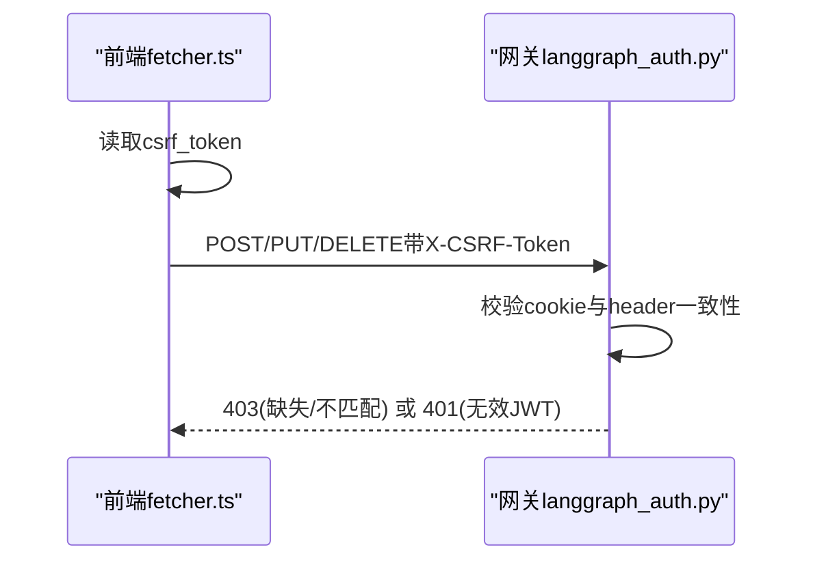
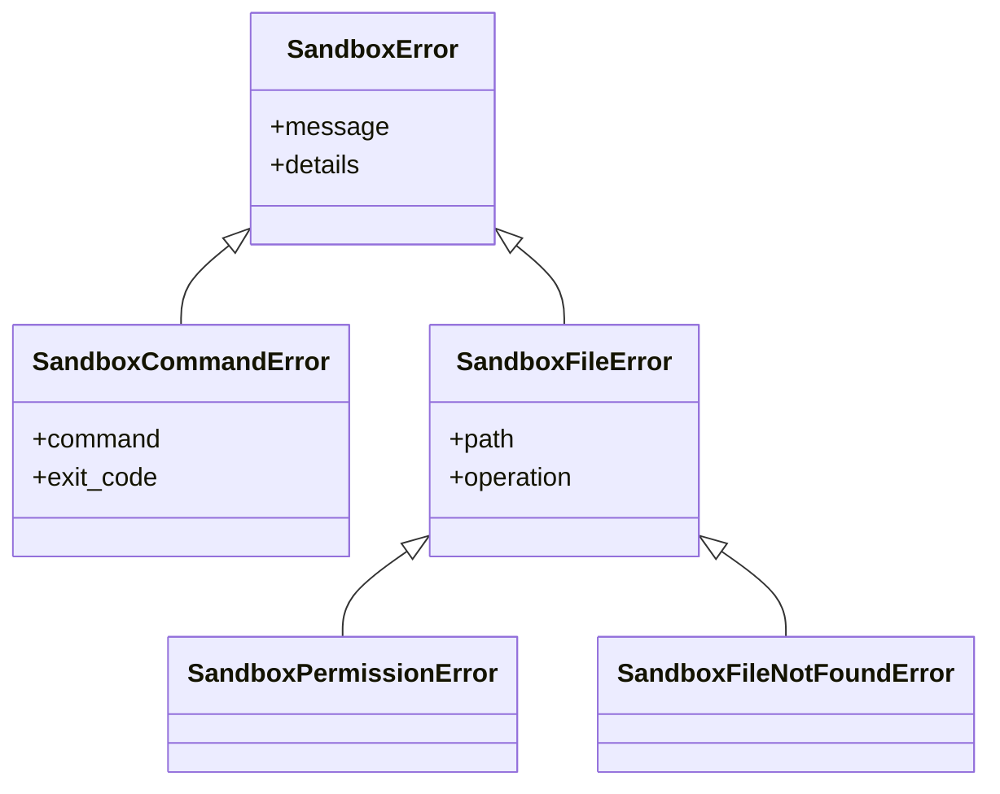
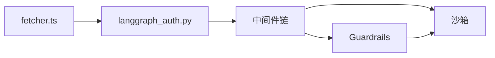

# 威胁建模

<cite>
**本文引用的文件**
- [GUARDRAILS.md](file://backend/docs/GUARDRAILS.md)
- [fetcher.ts](file://frontend/src/core/api/fetcher.ts)
- [langgraph_auth.py](file://backend/app/gateway/langgraph_auth.py)
- [test_guardrail_middleware.py](file://backend/tests/test_guardrail_middleware.py)
- [test_langgraph_auth.py](file://backend/tests/test_langgraph_auth.py)
- [exceptions.py](file://backend/packages/harness/deerflow/sandbox/exceptions.py)
- [aio_sandbox.py](file://backend/packages/harness/deerflow/community/aio_sandbox/aio_sandbox.py)
- [test_local_sandbox_virtual_path_contract.py](file://backend/tests/test_local_sandbox_virtual_path_contract.py)
- [gateway-config.test.ts](file://frontend/tests/unit/core/auth/gateway-config.test.ts)
</cite>

## 目录
1. [简介](#简介)
2. [项目结构](#项目结构)
3. [核心组件](#核心组件)
4. [架构总览](#架构总览)
5. [详细组件分析](#详细组件分析)
6. [依赖关系分析](#依赖关系分析)
7. [性能考量](#性能考量)
8. [故障排查指南](#故障排查指南)
9. [结论](#结论)
10. [附录](#附录)

## 简介
本威胁建模文档聚焦于 DeerFlow 的安全威胁识别与防护策略，覆盖常见攻击向量（如 CSRF、认证绕过、工具调用滥用）、漏洞类型（认证缺陷、授权不足、沙箱逃逸）与攻击场景分析。文档系统性阐述安全护栏机制（Guardrails）、输入验证与输出过滤、威胁建模框架、风险评估方法、安全测试流程，并提供攻击检测、异常行为监控与安全事件响应建议，以及威胁情报集成与安全态势感知的实践方向。

## 项目结构
从安全视角看，DeerFlow 的后端网关负责认证、授权与中间件链（含沙箱与护栏），前端通过统一的 API 封装进行受控请求，沙箱模块提供执行隔离与错误边界，测试用例覆盖关键安全路径。

图表来源
- [fetcher.ts:1-104](file://frontend/src/core/api/fetcher.ts#L1-L104)
- [langgraph_auth.py:42-88](file://backend/app/gateway/langgraph_auth.py#L42-L88)
- [GUARDRAILS.md:34-70](file://backend/docs/GUARDRAILS.md#L34-L70)
- [aio_sandbox.py:207-226](file://backend/packages/harness/deerflow/community/aio_sandbox/aio_sandbox.py#L207-L226)
- [exceptions.py:31-71](file://backend/packages/harness/deerflow/sandbox/exceptions.py#L31-L71)
- [gateway-config.test.ts:1-57](file://frontend/tests/unit/core/auth/gateway-config.test.ts#L1-L57)

章节来源
- [fetcher.ts:1-104](file://frontend/src/core/api/fetcher.ts#L1-L104)
- [langgraph_auth.py:42-88](file://backend/app/gateway/langgraph_auth.py#L42-L88)
- [GUARDRAILS.md:34-70](file://backend/docs/GUARDRAILS.md#L34-L70)
- [aio_sandbox.py:207-226](file://backend/packages/harness/deerflow/community/aio_sandbox/aio_sandbox.py#L207-L226)
- [exceptions.py:31-71](file://backend/packages/harness/deerflow/sandbox/exceptions.py#L31-L71)
- [gateway-config.test.ts:1-57](file://frontend/tests/unit/core/auth/gateway-config.test.ts#L1-L57)

## 核心组件
- 安全护栏（Guardrails）
  - 在每次工具调用前进行策略驱动的授权判定，支持同步/异步评估，可插拔提供者（内置白名单、可接入外部策略引擎）。
  - 关键接口：请求对象、决策对象、提供者协议；支持失败闭合/开路策略。
- 认证与 CSRF 中间件
  - 后端在认证前先执行 CSRF 校验，双提交 Cookie 模式，状态变更方法强制校验令牌。
  - 前端统一 fetch 包装自动注入 CSRF 头，缺失时静默失败并重定向登录。
- 沙箱执行与隔离
  - 提供本地/远程沙箱抽象，隔离文件系统与命令执行；对异常进行分类与错误边界封装。
- 配置与可信域
  - 前端环境变量驱动网关地址与可信来源，测试覆盖默认值与开发模式行为。

章节来源
- [GUARDRAILS.md:254-386](file://backend/docs/GUARDRAILS.md#L254-L386)
- [langgraph_auth.py:42-88](file://backend/app/gateway/langgraph_auth.py#L42-L88)
- [fetcher.ts:1-104](file://frontend/src/core/api/fetcher.ts#L1-L104)
- [aio_sandbox.py:207-226](file://backend/packages/harness/deerflow/community/aio_sandbox/aio_sandbox.py#L207-L226)
- [exceptions.py:31-71](file://backend/packages/harness/deerflow/sandbox/exceptions.py#L31-L71)
- [gateway-config.test.ts:1-57](file://frontend/tests/unit/core/auth/gateway-config.test.ts#L1-L57)

## 架构总览
下图展示从浏览器到后端网关、中间件链与沙箱/护栏的整体交互，以及 CSRF 与认证前置检查的关键位置。

图表来源
- [fetcher.ts:56-89](file://frontend/src/core/api/fetcher.ts#L56-L89)
- [langgraph_auth.py:61-88](file://backend/app/gateway/langgraph_auth.py#L61-L88)
- [GUARDRAILS.md:38-70](file://backend/docs/GUARDRAILS.md#L38-L70)
- [aio_sandbox.py:207-226](file://backend/packages/harness/deerflow/community/aio_sandbox/aio_sandbox.py#L207-L226)

## 详细组件分析

### 组件A：安全护栏（Guardrails）与工具调用授权
- 设计要点
  - 护栏在“每个工具调用”处评估，基于策略提供者返回允许/拒绝与原因码，支持失败闭合（异常即阻断）。
  - 提供者协议要求同步/异步 evaluate/aevaluate，请求包含工具名、输入、线程/代理上下文等。
- 威胁缓解
  - 通过白名单/黑名单策略限制高危工具（如 bash），避免任意命令执行。
  - 失败闭合降低未知策略异常导致的放行风险。
- 测试覆盖
  - 覆盖允许/拒绝、异步路径、失败闭合/开路、原因码回退、代理身份传递等场景。

图表来源
- [GUARDRAILS.md:254-283](file://backend/docs/GUARDRAILS.md#L254-L283)
- [test_guardrail_middleware.py:140-175](file://backend/tests/test_guardrail_middleware.py#L140-L175)

章节来源
- [GUARDRAILS.md:34-70](file://backend/docs/GUARDRAILS.md#L34-L70)
- [GUARDRAILS.md:254-386](file://backend/docs/GUARDRAILS.md#L254-L386)
- [test_guardrail_middleware.py:140-175](file://backend/tests/test_guardrail_middleware.py#L140-L175)

### 组件B：认证与 CSRF 保护
- 设计要点
  - 后端在认证前执行 CSRF 校验，缺失或不匹配令牌直接返回 403。
  - 前端 fetch 包装自动读取 HttpOnly Cookie 中的 csrf_token 并注入 X-CSRF-Token，状态变更方法强制校验。
- 威胁缓解
  - 双提交 Cookie 模式有效抵御跨站请求伪造；401 自动重定向登录避免会话泄露。
- 测试覆盖
  - 覆盖 CSRF 缺失/不匹配/方法遗漏等边界条件，确保状态变更方法均受保护。

图表来源
- [fetcher.ts:56-89](file://frontend/src/core/api/fetcher.ts#L56-L89)
- [langgraph_auth.py:42-88](file://backend/app/gateway/langgraph_auth.py#L42-L88)
- [test_langgraph_auth.py:277-321](file://backend/tests/test_langgraph_auth.py#L277-L321)

章节来源
- [fetcher.ts:1-104](file://frontend/src/core/api/fetcher.ts#L1-L104)
- [langgraph_auth.py:42-88](file://backend/app/gateway/langgraph_auth.py#L42-L88)
- [test_langgraph_auth.py:277-321](file://backend/tests/test_langgraph_auth.py#L277-L321)

### 组件C：沙箱执行与隔离
- 设计要点
  - 沙箱提供文件写入/读取、命令执行等能力，并对异常进行分类（命令错误、文件错误、权限错误、未找到等）。
  - 本地沙箱虚拟路径契约保证线程隔离与路径映射正确性。
- 威胁缓解
  - 通过进程/文件系统隔离限制工具调用影响面；异常边界防止未知错误扩散。
- 测试覆盖
  - 虚拟路径写入/读取契约、多线程隔离、最大深度遍历限制等。

图表来源
- [exceptions.py:31-71](file://backend/packages/harness/deerflow/sandbox/exceptions.py#L31-L71)
- [aio_sandbox.py:207-226](file://backend/packages/harness/deerflow/community/aio_sandbox/aio_sandbox.py#L207-L226)
- [test_local_sandbox_virtual_path_contract.py:145-167](file://backend/tests/test_local_sandbox_virtual_path_contract.py#L145-L167)

章节来源
- [exceptions.py:31-71](file://backend/packages/harness/deerflow/sandbox/exceptions.py#L31-L71)
- [aio_sandbox.py:207-226](file://backend/packages/harness/deerflow/community/aio_sandbox/aio_sandbox.py#L207-L226)
- [test_local_sandbox_virtual_path_contract.py:145-167](file://backend/tests/test_local_sandbox_virtual_path_contract.py#L145-L167)

### 组件D：前端请求封装与 CSRF 注入
- 设计要点
  - 统一 fetch 包装，自动注入 CSRF 头；状态变更方法（POST/PUT/DELETE/PATCH）强制校验；401 自动跳转登录。
- 威胁缓解
  - 防止使用原生 fetch 导致的 CSRF 放行；统一凭据携带避免跨域问题。
- 测试覆盖
  - 网关配置加载与可信域解析，保障开发/生产环境默认行为一致。

章节来源
- [fetcher.ts:1-104](file://frontend/src/core/api/fetcher.ts#L1-L104)
- [gateway-config.test.ts:1-57](file://frontend/tests/unit/core/auth/gateway-config.test.ts#L1-L57)

## 依赖关系分析
- 组件耦合
  - 前端 fetcher 依赖后端 CSRF 策略；网关认证前置 CSRF；护栏中间件依赖提供者协议；沙箱异常为护栏与执行层的共同边界。
- 外部依赖
  - JWT 解码与版本校验、CSRF 双提交 Cookie、沙箱客户端命令执行。
- 潜在环路
  - 当前链路为单向：前端 → 网关 → 中间件 → 沙箱/护栏 → 响应，无明显循环依赖。

图表来源
- [fetcher.ts:56-89](file://frontend/src/core/api/fetcher.ts#L56-L89)
- [langgraph_auth.py:61-88](file://backend/app/gateway/langgraph_auth.py#L61-L88)
- [GUARDRAILS.md:38-70](file://backend/docs/GUARDRAILS.md#L38-L70)
- [aio_sandbox.py:207-226](file://backend/packages/harness/deerflow/community/aio_sandbox/aio_sandbox.py#L207-L226)

章节来源
- [fetcher.ts:1-104](file://frontend/src/core/api/fetcher.ts#L1-L104)
- [langgraph_auth.py:42-88](file://backend/app/gateway/langgraph_auth.py#L42-L88)
- [GUARDRAILS.md:34-70](file://backend/docs/GUARDRAILS.md#L34-L70)
- [aio_sandbox.py:207-226](file://backend/packages/harness/deerflow/community/aio_sandbox/aio_sandbox.py#L207-L226)

## 性能考量
- 护栏评估
  - 同步/异步评估路径需平衡延迟与吞吐；失败闭合策略在高并发下可能放大拒绝率，应结合缓存与降级策略。
- 沙箱执行
  - 文件列举/命令执行存在 I/O 开销，建议设置最大深度与超时阈值；异常捕获避免阻塞主流程。
- CSRF 校验
  - 前端仅在状态变更方法注入 CSRF 头，减少 GET 请求开销；后端严格比对提升安全性但增加 CPU 消耗。

## 故障排查指南
- CSRF 相关
  - 症状：403 错误且提示缺少/不匹配 CSRF 令牌。
  - 排查：确认前端是否正确读取 Cookie 并注入 X-CSRF-Token；核对请求方法是否为状态变更方法。
- 认证相关
  - 症状：401 未认证或无效令牌。
  - 排查：检查 access_token 是否存在且未过期；确认网关 JWT 解码与 token_version 校验逻辑。
- 护栏相关
  - 症状：工具调用被拒绝且返回原因码。
  - 排查：检查提供者配置（白名单/黑名单）、失败闭合策略、代理身份传递是否正确。
- 沙箱相关
  - 症状：命令执行失败或文件操作异常。
  - 排查：区分命令错误/文件错误/权限错误/未找到；核对虚拟路径与线程隔离契约。

章节来源
- [test_langgraph_auth.py:277-321](file://backend/tests/test_langgraph_auth.py#L277-L321)
- [test_guardrail_middleware.py:140-175](file://backend/tests/test_guardrail_middleware.py#L140-L175)
- [exceptions.py:31-71](file://backend/packages/harness/deerflow/sandbox/exceptions.py#L31-L71)

## 结论
DeerFlow 的安全设计以“护栏前置、认证先行、沙箱隔离”为核心，通过 CSRF 双提交 Cookie、JWT 校验与工具调用授权形成多层防护。建议持续完善策略提供者的可观测性与灰度发布、强化沙箱异常的告警与自愈、补充威胁情报与安全事件联动，以实现更稳健的安全态势感知与响应闭环。

## 附录
- 威胁建模框架与风险评估方法
  - 威胁建模：STRIDE（欺骗、篡改、抵赖、信息泄露、拒绝服务、权限提升）与 PASTA（问题导向、资产、威胁、攻击、技术、组织）结合。
  - 风险评估：定性/定量评分（可能性×影响），优先处理高风险低代价修复项。
- 安全测试流程
  - 单元测试：护栏提供者接口、沙箱异常分类、CSRF/认证边界。
  - 集成测试：端到端请求链路、跨线程隔离、虚拟路径契约。
  - 渗透测试：模拟 CSRF、JWT 篡改、护栏绕过、沙箱逃逸。
- 攻击检测与异常监控
  - 关键指标：CSRF 403 次数、护栏拒绝率、沙箱命令失败率、异常类错误分布。
  - 告警规则：突发拒绝率上升、连续命令失败、未知工具调用。
- 安全事件响应
  - 分级处置：轻微（自动降级/限流）、严重（临时关闭护栏/隔离实例）、灾难（全链路回滚）。
  - 回溯与复盘：日志审计、事件画像、根因分析与修复验证。
- 威胁情报与态势感知
  - 集成外部情报源（CVE、APT 行为特征），在护栏策略中动态更新；结合 SIEM/可观测性平台实现统一告警与联动处置。