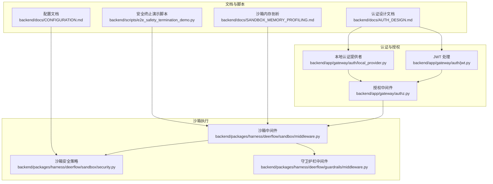
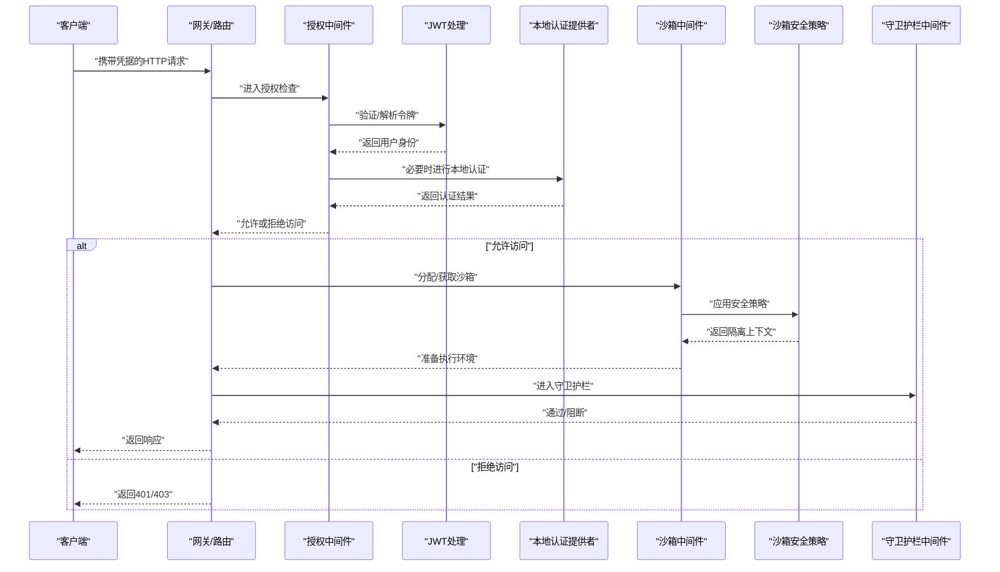
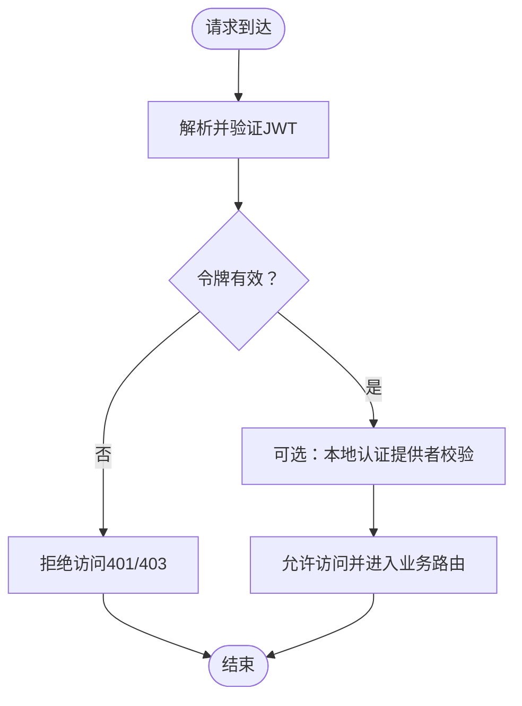
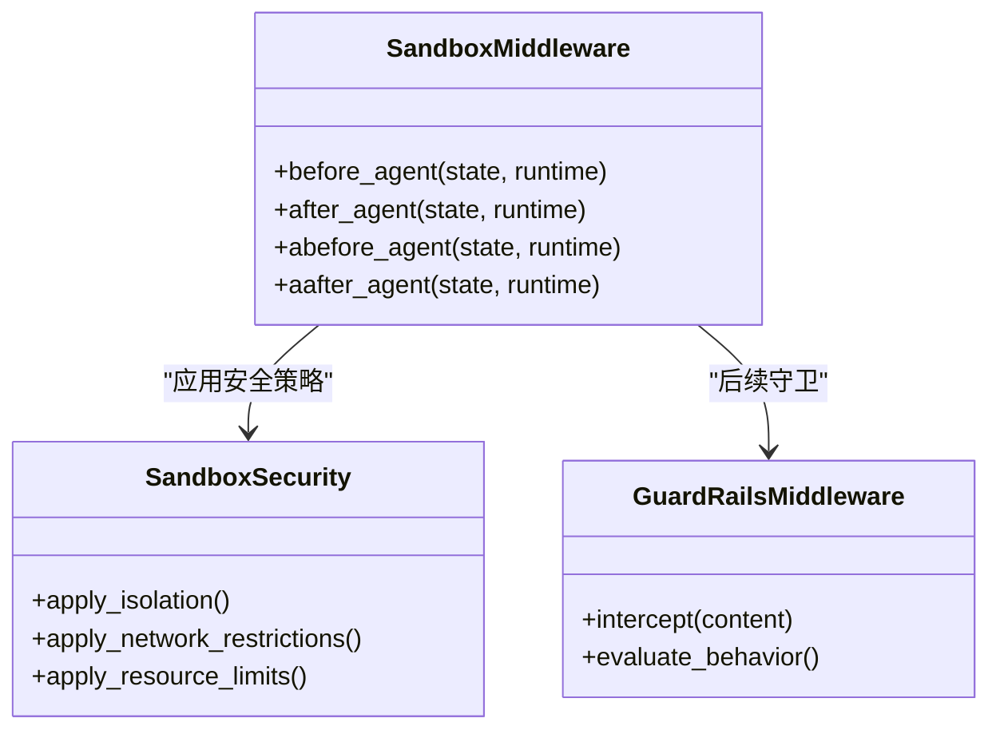
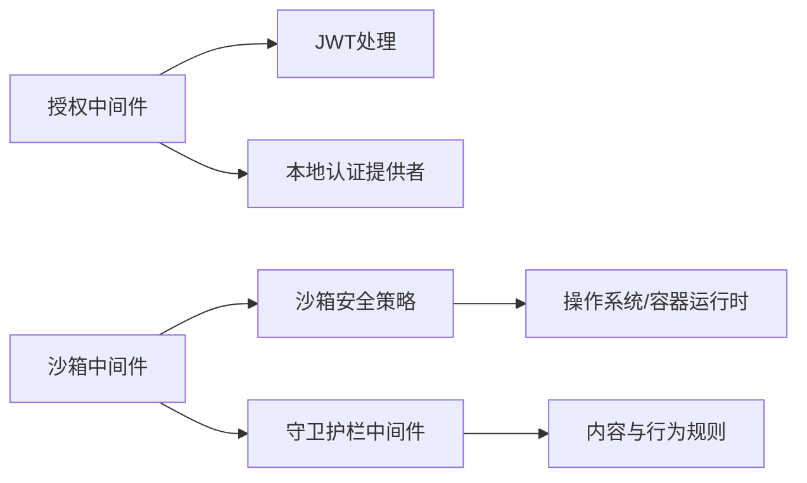
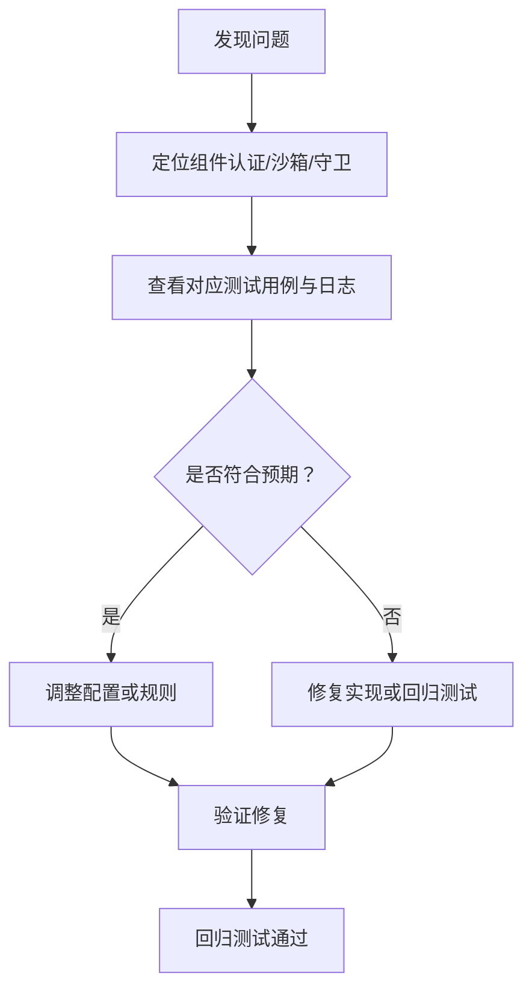

# 安全指南

<cite>
**本文引用的文件**
- [backend/app/gateway/auth/jwt.py](file://backend/app/gateway/auth/jwt.py)
- [backend/app/gateway/auth/local_provider.py](file://backend/app/gateway/auth/local_provider.py)
- [backend/app/gateway/authz.py](file://backend/app/gateway/authz.py)
- [backend/packages/harness/deerflow/sandbox/middleware.py](file://backend/packages/harness/deerflow/sandbox/middleware.py)
- [backend/packages/harness/deerflow/sandbox/security.py](file://backend/packages/harness/deerflow/sandbox/security.py)
- [backend/packages/harness/deerflow/guardrails/middleware.py](file://backend/packages/harness/deerflow/guardrails/middleware.py)
- [backend/docs/AUTH_DESIGN.md](file://backend/docs/AUTH_DESIGN.md)
- [backend/docs/CONFIGURATION.md](file://backend/docs/CONFIGURATION.md)
- [backend/docs/GUARDRAILS.md](file://backend/docs/GUARDRAILS.md)
- [backend/docs/SANDBOX_MEMORY_PROFILING.md](file://backend/docs/SANDBOX_MEMORY_PROFILING.md)
- [backend/tests/test_sandbox_middleware.py](file://backend/tests/test_sandbox_middleware.py)
- [backend/tests/test_sandbox_tools_security.py](file://backend/tests/test_sandbox_tools_security.py)
- [backend/tests/test_security_scanner.py](file://backend/tests/test_security_scanner.py)
- [backend/scripts/e2e_safety_termination_demo.py](file://backend/scripts/e2e_safety_termination_demo.py)
- [scripts/setup-sandbox.sh](file://scripts/setup-sandbox.sh)
- [SECURITY.md](file://SECURITY.md)
</cite>

## 目录
1. [简介](#简介)
2. [项目结构](#项目结构)
3. [核心组件](#核心组件)
4. [架构总览](#架构总览)
5. [详细组件分析](#详细组件分析)
6. [依赖关系分析](#依赖关系分析)
7. [性能与安全权衡](#性能与安全权衡)
8. [故障排查指南](#故障排查指南)
9. [结论](#结论)
10. [附录](#附录)

## 简介
本安全指南面向DeerFlow的部署与运维团队，系统阐述其安全架构与最佳实践，覆盖认证授权、访问控制、数据保护、沙箱安全边界、文件系统隔离与资源限制、安全配置检查清单、漏洞评估与安全审计流程、威胁建模、安全测试与应急响应计划，并给出合规性要求与安全加固建议。内容基于仓库中现有的认证设计文档、沙箱中间件实现、安全扫描器与测试用例等材料整理而成。

## 项目结构
从安全视角看，DeerFlow后端由以下与安全密切相关的模块构成：
- 认证与授权：JWT处理、本地认证提供者、授权中间件
- 沙箱执行：沙箱中间件、安全策略、工具安全校验
- 守卫护栏：内容与行为守卫、安全终止检测
- 文档与脚本：认证设计、配置、沙箱内存剖析、安全演示脚本

**图表来源**
- [backend/app/gateway/auth/jwt.py](file://backend/app/gateway/auth/jwt.py)
- [backend/app/gateway/auth/local_provider.py](file://backend/app/gateway/auth/local_provider.py)
- [backend/app/gateway/authz.py](file://backend/app/gateway/authz.py)
- [backend/packages/harness/deerflow/sandbox/middleware.py](file://backend/packages/harness/deerflow/sandbox/middleware.py)
- [backend/packages/harness/deerflow/sandbox/security.py](file://backend/packages/harness/deerflow/sandbox/security.py)
- [backend/packages/harness/deerflow/guardrails/middleware.py](file://backend/packages/harness/deerflow/guardrails/middleware.py)
- [backend/docs/AUTH_DESIGN.md](file://backend/docs/AUTH_DESIGN.md)
- [backend/docs/CONFIGURATION.md](file://backend/docs/CONFIGURATION.md)
- [backend/docs/SANDBOX_MEMORY_PROFILING.md](file://backend/docs/SANDBOX_MEMORY_PROFILING.md)
- [backend/scripts/e2e_safety_termination_demo.py](file://backend/scripts/e2e_safety_termination_demo.py)

**章节来源**
- [backend/docs/AUTH_DESIGN.md](file://backend/docs/AUTH_DESIGN.md)
- [backend/docs/CONFIGURATION.md](file://backend/docs/CONFIGURATION.md)
- [backend/docs/SANDBOX_MEMORY_PROFILING.md](file://backend/docs/SANDBOX_MEMORY_PROFILING.md)

## 核心组件
- 认证与授权
  - JWT处理：负责令牌签发、解析与验证，确保请求携带有效凭据。
  - 本地认证提供者：管理本地用户凭据与登录流程。
  - 授权中间件：在路由层对请求进行权限判定，拒绝未授权访问。
- 沙箱执行
  - 沙箱中间件：为线程分配与释放沙箱实例，支持同步与异步初始化，保证执行环境隔离。
  - 沙箱安全策略：定义文件系统隔离、网络访问限制、资源配额等安全边界。
  - 守卫护栏中间件：拦截潜在危险内容或行为，防止越界操作。
- 安全测试与审计
  - 沙箱中间件测试：验证沙箱分配、释放与异步初始化行为。
  - 工具安全测试：验证工具调用的安全策略与权限控制。
  - 安全扫描器测试：验证安全规则与告警机制。

**章节来源**
- [backend/app/gateway/auth/jwt.py](file://backend/app/gateway/auth/jwt.py)
- [backend/app/gateway/auth/local_provider.py](file://backend/app/gateway/auth/local_provider.py)
- [backend/app/gateway/authz.py](file://backend/app/gateway/authz.py)
- [backend/packages/harness/deerflow/sandbox/middleware.py](file://backend/packages/harness/deerflow/sandbox/middleware.py)
- [backend/packages/harness/deerflow/sandbox/security.py](file://backend/packages/harness/deerflow/sandbox/security.py)
- [backend/packages/harness/deerflow/guardrails/middleware.py](file://backend/packages/harness/deerflow/guardrails/middleware.py)
- [backend/tests/test_sandbox_middleware.py](file://backend/tests/test_sandbox_middleware.py)
- [backend/tests/test_sandbox_tools_security.py](file://backend/tests/test_sandbox_tools_security.py)
- [backend/tests/test_security_scanner.py](file://backend/tests/test_security_scanner.py)

## 架构总览
下图展示从客户端到后端服务、再到沙箱执行与守卫护栏的整体安全流：

**图表来源**
- [backend/app/gateway/authz.py](file://backend/app/gateway/authz.py)
- [backend/app/gateway/auth/jwt.py](file://backend/app/gateway/auth/jwt.py)
- [backend/app/gateway/auth/local_provider.py](file://backend/app/gateway/auth/local_provider.py)
- [backend/packages/harness/deerflow/sandbox/middleware.py](file://backend/packages/harness/deerflow/sandbox/middleware.py)
- [backend/packages/harness/deerflow/sandbox/security.py](file://backend/packages/harness/deerflow/sandbox/security.py)
- [backend/packages/harness/deerflow/guardrails/middleware.py](file://backend/packages/harness/deerflow/guardrails/middleware.py)

## 详细组件分析

### 认证与授权机制
- JWT处理
  - 负责令牌的签发、解析与验证，确保请求携带有效凭据。
  - 建议：启用HTTPS、设置合理的过期时间与刷新策略、避免在令牌中存储敏感信息。
- 本地认证提供者
  - 管理本地用户凭据与登录流程，支持密码校验与凭据轮换。
  - 建议：强制强口令策略、启用账户锁定与失败阈值、定期轮换管理员凭据。
- 授权中间件
  - 在路由层对请求进行权限判定，结合用户角色与资源范围决定是否放行。
  - 建议：最小权限原则、细粒度资源授权、审计日志记录。

**图表来源**
- [backend/app/gateway/auth/jwt.py](file://backend/app/gateway/auth/jwt.py)
- [backend/app/gateway/auth/local_provider.py](file://backend/app/gateway/auth/local_provider.py)
- [backend/app/gateway/authz.py](file://backend/app/gateway/authz.py)

**章节来源**
- [backend/app/gateway/auth/jwt.py](file://backend/app/gateway/auth/jwt.py)
- [backend/app/gateway/auth/local_provider.py](file://backend/app/gateway/auth/local_provider.py)
- [backend/app/gateway/authz.py](file://backend/app/gateway/authz.py)
- [backend/docs/AUTH_DESIGN.md](file://backend/docs/AUTH_DESIGN.md)

### 沙箱安全边界与资源限制
- 沙箱中间件
  - 为每个线程分配/释放沙箱实例，支持同步与异步初始化，避免阻塞事件循环。
  - 通过提供者接口进行沙箱生命周期管理，确保异常情况下也能正确释放。
- 沙箱安全策略
  - 文件系统隔离：限制对宿主机文件系统的访问，仅开放必要的虚拟路径映射。
  - 网络访问限制：默认禁用外网访问，仅允许白名单域名或特定端口。
  - 资源配额：CPU/内存/磁盘IO配额，超限时触发安全终止。
- 守卫护栏中间件
  - 对输入输出进行内容与行为审查，拦截潜在恶意内容或越权操作。

**图表来源**
- [backend/packages/harness/deerflow/sandbox/middleware.py](file://backend/packages/harness/deerflow/sandbox/middleware.py)
- [backend/packages/harness/deerflow/sandbox/security.py](file://backend/packages/harness/deerflow/sandbox/security.py)
- [backend/packages/harness/deerflow/guardrails/middleware.py](file://backend/packages/harness/deerflow/guardrails/middleware.py)

**章节来源**
- [backend/packages/harness/deerflow/sandbox/middleware.py](file://backend/packages/harness/deerflow/sandbox/middleware.py)
- [backend/packages/harness/deerflow/sandbox/security.py](file://backend/packages/harness/deerflow/sandbox/security.py)
- [backend/packages/harness/deerflow/guardrails/middleware.py](file://backend/packages/harness/deerflow/guardrails/middleware.py)
- [backend/docs/SANDBOX_MEMORY_PROFILING.md](file://backend/docs/SANDBOX_MEMORY_PROFILING.md)

### 数据保护与传输安全
- 传输加密：所有外部通信应使用TLS，避免明文传输。
- 敏感数据处理：令牌、密钥与凭据不应记录到日志；对数据库字段进行脱敏。
- 存储安全：对静态文件与日志进行访问控制，限制读写权限。

**章节来源**
- [backend/docs/CONFIGURATION.md](file://backend/docs/CONFIGURATION.md)

### 安全配置检查清单
- 认证与授权
  - 是否启用HTTPS与安全证书
  - JWT过期与刷新策略是否合理
  - 本地管理员账户是否已重置或轮换
  - 授权中间件是否生效且无默认放行
- 沙箱与资源限制
  - 是否启用沙箱隔离与资源配额
  - 文件系统挂载是否最小化
  - 网络访问是否受限
- 日志与审计
  - 是否记录认证与授权事件
  - 是否记录沙箱异常与安全终止事件
- 运维与补丁
  - 依赖库版本是否保持更新
  - 是否定期进行安全扫描与渗透测试

**章节来源**
- [backend/docs/CONFIGURATION.md](file://backend/docs/CONFIGURATION.md)
- [backend/docs/AUTH_DESIGN.md](file://backend/docs/AUTH_DESIGN.md)

## 依赖关系分析
- 组件耦合
  - 授权中间件依赖JWT处理与本地认证提供者，共同完成身份验证与授权决策。
  - 沙箱中间件依赖沙箱提供者与安全策略，形成执行环境隔离与资源限制。
  - 守卫护栏中间件在沙箱执行前后进行内容与行为审查，提升整体安全性。
- 外部依赖
  - 依赖于容器运行时（如Docker）以实现进程级隔离。
  - 依赖于网络与文件系统策略以实现边界控制。

**图表来源**
- [backend/app/gateway/authz.py](file://backend/app/gateway/authz.py)
- [backend/app/gateway/auth/jwt.py](file://backend/app/gateway/auth/jwt.py)
- [backend/app/gateway/auth/local_provider.py](file://backend/app/gateway/auth/local_provider.py)
- [backend/packages/harness/deerflow/sandbox/middleware.py](file://backend/packages/harness/deerflow/sandbox/middleware.py)
- [backend/packages/harness/deerflow/sandbox/security.py](file://backend/packages/harness/deerflow/sandbox/security.py)
- [backend/packages/harness/deerflow/guardrails/middleware.py](file://backend/packages/harness/deerflow/guardrails/middleware.py)

**章节来源**
- [backend/app/gateway/authz.py](file://backend/app/gateway/authz.py)
- [backend/packages/harness/deerflow/sandbox/middleware.py](file://backend/packages/harness/deerflow/sandbox/middleware.py)

## 性能与安全权衡
- 沙箱初始化成本：同步初始化可能阻塞事件循环，异步初始化可降低延迟但需注意错误处理。
- 资源配额与吞吐：严格的资源限制可提升稳定性，但需平衡任务执行时间与并发度。
- 内容审查开销：守卫护栏会增加处理时延，建议在高负载场景下优化规则集与缓存策略。

**章节来源**
- [backend/docs/SANDBOX_MEMORY_PROFILING.md](file://backend/docs/SANDBOX_MEMORY_PROFILING.md)
- [backend/packages/harness/deerflow/sandbox/middleware.py](file://backend/packages/harness/deerflow/sandbox/middleware.py)

## 故障排查指南
- 沙箱中间件问题
  - 症状：无法分配/释放沙箱、异步初始化卡顿。
  - 排查：检查线程上下文中的thread_id是否存在；确认提供者接口实现；查看日志中“分配/释放”记录。
- 工具安全问题
  - 症状：工具调用被拒绝或报错。
  - 排查：核对工具权限与策略配置；确认工具参数与输出大小限制。
- 安全扫描问题
  - 症状：规则未触发或误报。
  - 排查：检查规则配置与上下文；对比测试用例与期望行为。

**图表来源**
- [backend/tests/test_sandbox_middleware.py](file://backend/tests/test_sandbox_middleware.py)
- [backend/tests/test_sandbox_tools_security.py](file://backend/tests/test_sandbox_tools_security.py)
- [backend/tests/test_security_scanner.py](file://backend/tests/test_security_scanner.py)

**章节来源**
- [backend/tests/test_sandbox_middleware.py](file://backend/tests/test_sandbox_middleware.py)
- [backend/tests/test_sandbox_tools_security.py](file://backend/tests/test_sandbox_tools_security.py)
- [backend/tests/test_security_scanner.py](file://backend/tests/test_security_scanner.py)

## 结论
DeerFlow通过“认证授权+沙箱隔离+守卫护栏”的组合实现了多层安全防护。建议在生产环境中严格启用HTTPS、最小权限授权、严格的沙箱隔离与资源配额，并建立持续的安全测试与审计流程，以应对不断演进的威胁面。

## 附录

### 威胁建模与缓解
- 威胁类型
  - 身份冒用：通过伪造令牌或弱口令获取访问权限。
  - 越权访问：绕过授权中间件或滥用管理员权限。
  - 恶意执行：在沙箱内执行越权命令或资源滥用。
  - 数据泄露：敏感信息在传输或存储阶段被窃取。
- 缓解措施
  - 强化认证与授权、启用多因素认证（MFA）、定期轮换密钥。
  - 严格沙箱隔离与资源限制、最小化文件系统与网络暴露。
  - 内容与行为审查、异常检测与自动阻断。

### 安全测试与评估
- 单元测试
  - 沙箱中间件：验证分配/释放与异步初始化。
  - 工具安全：验证权限与输出限制。
  - 安全扫描：验证规则触发与误报控制。
- 端到端测试
  - 使用安全终止演示脚本验证整体安全链路。
- 渗透测试
  - 模拟越权、注入与资源滥用，评估边界完整性。

**章节来源**
- [backend/tests/test_sandbox_middleware.py](file://backend/tests/test_sandbox_middleware.py)
- [backend/tests/test_sandbox_tools_security.py](file://backend/tests/test_sandbox_tools_security.py)
- [backend/tests/test_security_scanner.py](file://backend/tests/test_security_scanner.py)
- [backend/scripts/e2e_safety_termination_demo.py](file://backend/scripts/e2e_safety_termination_demo.py)

### 应急响应计划
- 事件分类
  - 认证失败与暴力破解、越权访问、沙箱逃逸、数据泄露、资源滥用。
- 处置流程
  - 快速隔离受影响实例、回滚可疑变更、恢复备份、调查日志与证据链。
- 演练与改进
  - 定期演练应急响应流程，完善自动化处置与告警机制。

### 合规性要求与安全加固建议
- 合规参考
  - 数据保护：最小化收集、加密传输与存储、访问审计。
  - 访问控制：基于角色的权限模型、最小权限原则。
  - 可追溯性：完整日志与审计轨迹。
- 加固建议
  - 启用WAF与DDoS防护、定期漏洞扫描与依赖升级。
  - 采用零信任网络架构、多租户隔离与命名空间限制。
  - 配置入侵检测与实时告警，建立安全运营中心（SOC）。

**章节来源**
- [SECURITY.md](file://SECURITY.md)
- [backend/docs/CONFIGURATION.md](file://backend/docs/CONFIGURATION.md)