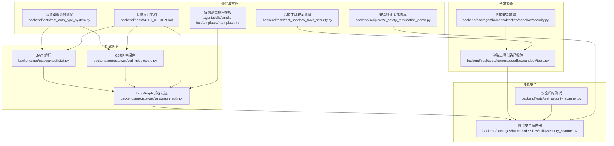
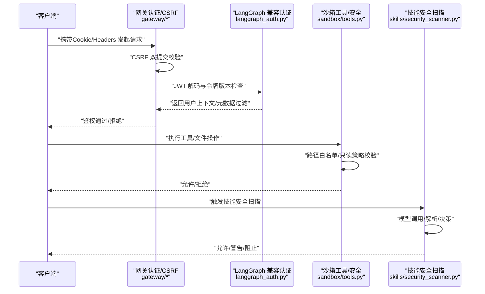
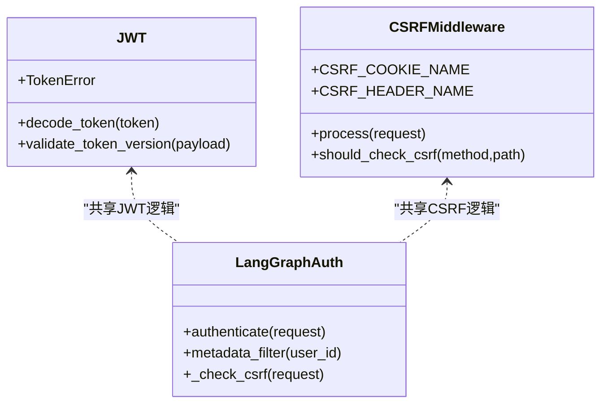
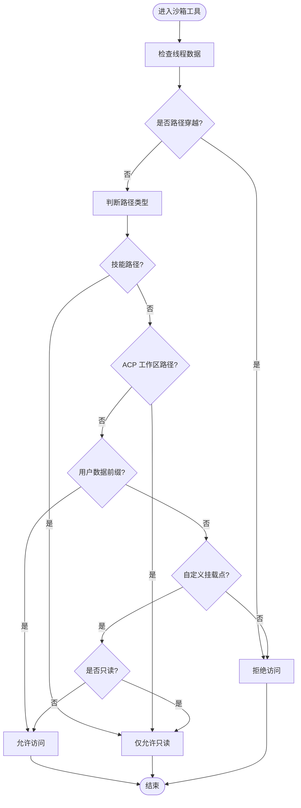
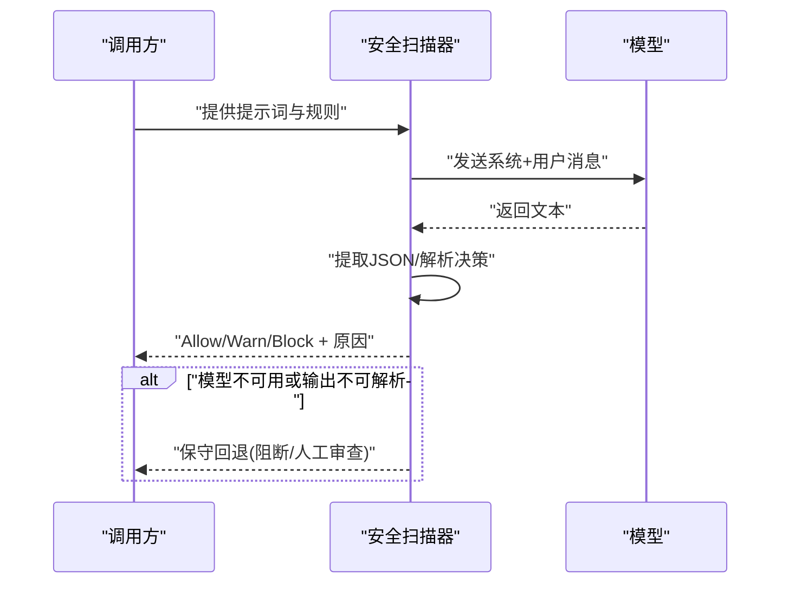
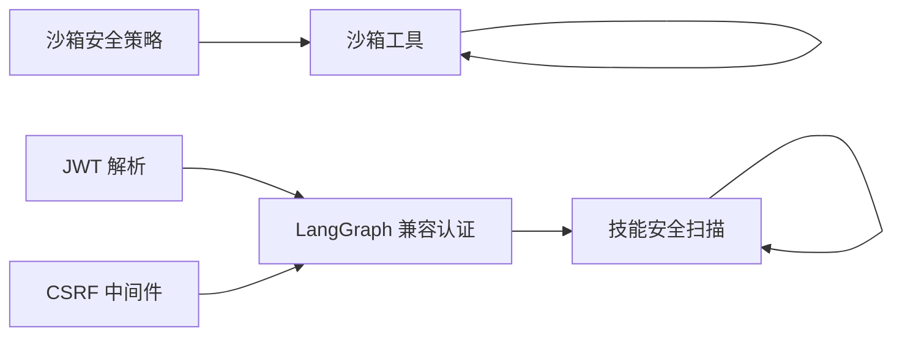

# 安全测试

<cite>
**本文引用的文件**
- [SECURITY.md](file://SECURITY.md)
- [backend/app/gateway/auth/jwt.py](file://backend/app/gateway/auth/jwt.py)
- [backend/app/gateway/csrf_middleware.py](file://backend/app/gateway/csrf_middleware.py)
- [backend/app/gateway/langgraph_auth.py](file://backend/app/gateway/langgraph_auth.py)
- [backend/packages/harness/deerflow/sandbox/security.py](file://backend/packages/harness/deerflow/sandbox/security.py)
- [backend/packages/harness/deerflow/sandbox/tools.py](file://backend/packages/harness/deerflow/sandbox/tools.py)
- [backend/packages/harness/deerflow/skills/security_scanner.py](file://backend/packages/harness/deerflow/skills/security_scanner.py)
- [backend/tests/test_security_scanner.py](file://backend/tests/test_security_scanner.py)
- [backend/tests/test_auth_type_system.py](file://backend/tests/test_auth_type_system.py)
- [backend/tests/test_sandbox_tools_security.py](file://backend/tests/test_sandbox_tools_security.py)
- [backend/scripts/e2e_safety_termination_demo.py](file://backend/scripts/e2e_safety_termination_demo.py)
- [backend/docs/AUTH_DESIGN.md](file://backend/docs/AUTH_DESIGN.md)
- [.agent/skills/smoke-test/SKILL.md](file://.agent/skills/smoke-test/SKILL.md)
- [.agent/skills/smoke-test/templates/report.docker.template.md](file://.agent/skills/smoke-test/templates/report.docker.template.md)
- [.agent/skills/smoke-test/templates/report.local.template.md](file://.agent/skills/smoke-test/templates/report.local.template.md)
</cite>

## 目录
1. [简介](#简介)
2. [项目结构](#项目结构)
3. [核心组件](#核心组件)
4. [架构总览](#架构总览)
5. [详细组件分析](#详细组件分析)
6. [依赖关系分析](#依赖关系分析)
7. [性能与安全考量](#性能与安全考量)
8. [故障排查指南](#故障排查指南)
9. [结论](#结论)
10. [附录](#附录)

## 简介
本文件面向DeerFlow项目，系统化阐述安全测试方法与实践，覆盖渗透测试、漏洞扫描、代码审计、自动化安全测试、静态与动态分析、安全测试用例设计、测试环境搭建、结果分析、安全回归测试、性能安全测试以及合规性验证，并提供安全测试报告模板与缺陷修复跟踪建议。内容基于仓库中现有的认证授权、CSRF防护、沙箱安全、技能安全扫描等实现与测试用例进行归纳总结。

## 项目结构
从安全视角，DeerFlow的关键安全相关模块包括：
- 后端网关认证与会话：JWT解析、CSRF中间件、LangGraph兼容认证
- 沙箱安全边界：路径访问控制、只读策略、权限校验
- 技能安全扫描：基于模型的审核与决策
- 测试与文档：认证类型系统测试、沙箱工具安全测试、安全扫描测试、安全演示脚本、认证设计文档、冒烟测试报告模板

**图表来源**
- [backend/app/gateway/auth/jwt.py](file://backend/app/gateway/auth/jwt.py)
- [backend/app/gateway/csrf_middleware.py](file://backend/app/gateway/csrf_middleware.py)
- [backend/app/gateway/langgraph_auth.py](file://backend/app/gateway/langgraph_auth.py)
- [backend/packages/harness/deerflow/sandbox/security.py](file://backend/packages/harness/deerflow/sandbox/security.py)
- [backend/packages/harness/deerflow/sandbox/tools.py](file://backend/packages/harness/deerflow/sandbox/tools.py)
- [backend/packages/harness/deerflow/skills/security_scanner.py](file://backend/packages/harness/deerflow/skills/security_scanner.py)
- [backend/tests/test_auth_type_system.py](file://backend/tests/test_auth_type_system.py)
- [backend/tests/test_sandbox_tools_security.py](file://backend/tests/test_sandbox_tools_security.py)
- [backend/tests/test_security_scanner.py](file://backend/tests/test_security_scanner.py)
- [backend/scripts/e2e_safety_termination_demo.py](file://backend/scripts/e2e_safety_termination_demo.py)
- [backend/docs/AUTH_DESIGN.md](file://backend/docs/AUTH_DESIGN.md)
- [.agent/skills/smoke-test/templates/report.docker.template.md](file://.agent/skills/smoke-test/templates/report.docker.template.md)
- [.agent/skills/smoke-test/templates/report.local.template.md](file://.agent/skills/smoke-test/templates/report.local.template.md)

**章节来源**
- [backend/app/gateway/auth/jwt.py](file://backend/app/gateway/auth/jwt.py)
- [backend/app/gateway/csrf_middleware.py](file://backend/app/gateway/csrf_middleware.py)
- [backend/app/gateway/langgraph_auth.py](file://backend/app/gateway/langgraph_auth.py)
- [backend/packages/harness/deerflow/sandbox/security.py](file://backend/packages/harness/deerflow/sandbox/security.py)
- [backend/packages/harness/deerflow/sandbox/tools.py](file://backend/packages/harness/deerflow/sandbox/tools.py)
- [backend/packages/harness/deerflow/skills/security_scanner.py](file://backend/packages/harness/deerflow/skills/security_scanner.py)
- [backend/tests/test_auth_type_system.py](file://backend/tests/test_auth_type_system.py)
- [backend/tests/test_sandbox_tools_security.py](file://backend/tests/test_sandbox_tools_security.py)
- [backend/tests/test_security_scanner.py](file://backend/tests/test_security_scanner.py)
- [backend/scripts/e2e_safety_termination_demo.py](file://backend/scripts/e2e_safety_termination_demo.py)
- [backend/docs/AUTH_DESIGN.md](file://backend/docs/AUTH_DESIGN.md)
- [.agent/skills/smoke-test/templates/report.docker.template.md](file://.agent/skills/smoke-test/templates/report.docker.template.md)
- [.agent/skills/smoke-test/templates/report.local.template.md](file://.agent/skills/smoke-test/templates/report.local.template.md)

## 核心组件
- 认证与会话安全
  - JWT解析与令牌版本校验，确保跨服务一致性
  - CSRF中间件与双提交Cookie策略，保护状态变更接口
  - LangGraph兼容认证，统一路由与用户隔离
- 沙箱安全边界
  - 路径白名单与只读策略，防止越权写入
  - 自定义挂载点读写控制，避免敏感目录暴露
- 技能安全扫描
  - 基于模型的审核决策（允许/警告/阻止），失败时保守回退
  - 可观测性与日志记录，便于审计与追踪

**章节来源**
- [backend/app/gateway/auth/jwt.py](file://backend/app/gateway/auth/jwt.py)
- [backend/app/gateway/csrf_middleware.py](file://backend/app/gateway/csrf_middleware.py)
- [backend/app/gateway/langgraph_auth.py](file://backend/app/gateway/langgraph_auth.py)
- [backend/packages/harness/deerflow/sandbox/security.py](file://backend/packages/harness/deerflow/sandbox/security.py)
- [backend/packages/harness/deerflow/sandbox/tools.py](file://backend/packages/harness/deerflow/sandbox/tools.py)
- [backend/packages/harness/deerflow/skills/security_scanner.py](file://backend/packages/harness/deerflow/skills/security_scanner.py)

## 架构总览
下图展示安全相关组件在请求生命周期中的交互，包括认证、CSRF校验、沙箱访问控制与技能安全扫描。

**图表来源**
- [backend/app/gateway/auth/jwt.py](file://backend/app/gateway/auth/jwt.py)
- [backend/app/gateway/csrf_middleware.py](file://backend/app/gateway/csrf_middleware.py)
- [backend/app/gateway/langgraph_auth.py](file://backend/app/gateway/langgraph_auth.py)
- [backend/packages/harness/deerflow/sandbox/tools.py](file://backend/packages/harness/deerflow/sandbox/tools.py)
- [backend/packages/harness/deerflow/skills/security_scanner.py](file://backend/packages/harness/deerflow/skills/security_scanner.py)

## 详细组件分析

### 组件A：认证与会话安全
- JWT解析与令牌版本校验
  - 实现要点：解码JWT、校验令牌版本、错误处理与结构化响应
  - 关键路径：[backend/app/gateway/auth/jwt.py](file://backend/app/gateway/auth/jwt.py)
- CSRF中间件
  - 实现要点：双提交Cookie校验、状态变更方法保护、路径匹配规则
  - 关键路径：[backend/app/gateway/csrf_middleware.py](file://backend/app/gateway/csrf_middleware.py)
- LangGraph兼容认证
  - 实现要点：复用JWT与CSRF规则，统一用户隔离与元数据过滤
  - 关键路径：[backend/app/gateway/langgraph_auth.py](file://backend/app/gateway/langgraph_auth.py)

**图表来源**
- [backend/app/gateway/auth/jwt.py](file://backend/app/gateway/auth/jwt.py)
- [backend/app/gateway/csrf_middleware.py](file://backend/app/gateway/csrf_middleware.py)
- [backend/app/gateway/langgraph_auth.py](file://backend/app/gateway/langgraph_auth.py)

**章节来源**
- [backend/app/gateway/auth/jwt.py](file://backend/app/gateway/auth/jwt.py)
- [backend/app/gateway/csrf_middleware.py](file://backend/app/gateway/csrf_middleware.py)
- [backend/app/gateway/langgraph_auth.py](file://backend/app/gateway/langgraph_auth.py)
- [backend/tests/test_auth_type_system.py](file://backend/tests/test_auth_type_system.py)

### 组件B：沙箱安全边界
- 路径访问控制与只读策略
  - 实现要点：路径白名单、只读挂载、技能路径与ACP工作区限制
  - 关键路径：[backend/packages/harness/deerflow/sandbox/tools.py](file://backend/packages/harness/deerflow/sandbox/tools.py)
- 沙箱安全策略
  - 实现要点：异常类型与错误细节封装，便于审计
  - 关键路径：[backend/packages/harness/deerflow/sandbox/security.py](file://backend/packages/harness/deerflow/sandbox/security.py)

**图表来源**
- [backend/packages/harness/deerflow/sandbox/tools.py](file://backend/packages/harness/deerflow/sandbox/tools.py)
- [backend/packages/harness/deerflow/sandbox/security.py](file://backend/packages/harness/deerflow/sandbox/security.py)

**章节来源**
- [backend/packages/harness/deerflow/sandbox/tools.py](file://backend/packages/harness/deerflow/sandbox/tools.py)
- [backend/packages/harness/deerflow/sandbox/security.py](file://backend/packages/harness/deerflow/sandbox/security.py)
- [backend/tests/test_sandbox_tools_security.py](file://backend/tests/test_sandbox_tools_security.py)

### 组件C：技能安全扫描
- 审核流程
  - 实现要点：系统提示词与用户提示词组合、模型调用、JSON解析、决策与回退
  - 关键路径：[backend/packages/harness/deerflow/skills/security_scanner.py](file://backend/packages/harness/deerflow/skills/security_scanner.py)
- 测试覆盖
  - 实现要点：对不同输入场景与模型不可用情况的断言
  - 关键路径：[backend/tests/test_security_scanner.py](file://backend/tests/test_security_scanner.py)

**图表来源**
- [backend/packages/harness/deerflow/skills/security_scanner.py](file://backend/packages/harness/deerflow/skills/security_scanner.py)
- [backend/tests/test_security_scanner.py](file://backend/tests/test_security_scanner.py)

**章节来源**
- [backend/packages/harness/deerflow/skills/security_scanner.py](file://backend/packages/harness/deerflow/skills/security_scanner.py)
- [backend/tests/test_security_scanner.py](file://backend/tests/test_security_scanner.py)

### 组件D：认证设计与文档
- 认证设计文档
  - 内容要点：认证体系设计原则、配置驱动的Cookie安全、错误响应与边界条件
  - 关键路径：[backend/docs/AUTH_DESIGN.md](file://backend/docs/AUTH_DESIGN.md)
- 安全演示脚本
  - 内容要点：端到端安全终止演示，辅助安全测试与回归验证
  - 关键路径：[backend/scripts/e2e_safety_termination_demo.py](file://backend/scripts/e2e_safety_termination_demo.py)

**章节来源**
- [backend/docs/AUTH_DESIGN.md](file://backend/docs/AUTH_DESIGN.md)
- [backend/scripts/e2e_safety_termination_demo.py](file://backend/scripts/e2e_safety_termination_demo.py)

### 组件E：冒烟测试与报告模板
- 冒烟测试技能
  - 内容要点：部署健康检查、本地/容器环境检查、报告模板
  - 关键路径：[.agent/skills/smoke-test/SKILL.md](file://.agent/skills/smoke-test/SKILL.md)
- 报告模板
  - 内容要点：Docker与本地环境的报告模板，便于标准化输出
  - 关键路径：[.agent/skills/smoke-test/templates/report.docker.template.md](file://.agent/skills/smoke-test/templates/report.docker.template.md)，[.agent/skills/smoke-test/templates/report.local.template.md](file://.agent/skills/smoke-test/templates/report.local.template.md)

**章节来源**
- [.agent/skills/smoke-test/SKILL.md](file://.agent/skills/smoke-test/SKILL.md)
- [.agent/skills/smoke-test/templates/report.docker.template.md](file://.agent/skills/smoke-test/templates/report.docker.template.md)
- [.agent/skills/smoke-test/templates/report.local.template.md](file://.agent/skills/smoke-test/templates/report.local.template.md)

## 依赖关系分析
- 组件耦合
  - LangGraph兼容认证依赖JWT与CSRF中间件，确保一致的会话与防护策略
  - 沙箱工具依赖路径白名单与只读策略，保障文件系统访问安全
  - 技能安全扫描依赖应用配置与模型能力，失败时采用保守回退
- 外部依赖
  - 认证中间件依赖FastAPI生态与第三方JWT库
  - 沙箱工具依赖容器/虚拟路径与文件系统权限
  - 安全扫描依赖外部模型服务

**图表来源**
- [backend/app/gateway/auth/jwt.py](file://backend/app/gateway/auth/jwt.py)
- [backend/app/gateway/csrf_middleware.py](file://backend/app/gateway/csrf_middleware.py)
- [backend/app/gateway/langgraph_auth.py](file://backend/app/gateway/langgraph_auth.py)
- [backend/packages/harness/deerflow/sandbox/tools.py](file://backend/packages/harness/deerflow/sandbox/tools.py)
- [backend/packages/harness/deerflow/sandbox/security.py](file://backend/packages/harness/deerflow/sandbox/security.py)
- [backend/packages/harness/deerflow/skills/security_scanner.py](file://backend/packages/harness/deerflow/skills/security_scanner.py)

**章节来源**
- [backend/app/gateway/auth/jwt.py](file://backend/app/gateway/auth/jwt.py)
- [backend/app/gateway/csrf_middleware.py](file://backend/app/gateway/csrf_middleware.py)
- [backend/app/gateway/langgraph_auth.py](file://backend/app/gateway/langgraph_auth.py)
- [backend/packages/harness/deerflow/sandbox/tools.py](file://backend/packages/harness/deerflow/sandbox/tools.py)
- [backend/packages/harness/deerflow/sandbox/security.py](file://backend/packages/harness/deerflow/sandbox/security.py)
- [backend/packages/harness/deerflow/skills/security_scanner.py](file://backend/packages/harness/deerflow/skills/security_scanner.py)

## 性能与安全考量
- 认证与CSRF
  - 在高频请求场景下，CSRF校验应尽量减少数据库查询；JWT解析需避免重复解码
- 沙箱
  - 文件系统遍历与写入操作应设置超时与深度限制，防止资源耗尽
- 安全扫描
  - 模型调用失败时的回退策略应快速且可观察，避免阻塞主流程
- 回归与合规
  - 使用冒烟测试与端到端安全演示脚本进行回归验证，结合报告模板标准化输出

[本节为通用指导，不直接分析具体文件]

## 故障排查指南
- 认证失败
  - 检查JWT是否过期或版本不匹配，确认CSRF头与Cookie是否一致
  - 参考：[backend/tests/test_auth_type_system.py](file://backend/tests/test_auth_type_system.py)
- 沙箱访问被拒
  - 检查路径是否在白名单内、是否为只读挂载、是否存在路径穿越
  - 参考：[backend/tests/test_sandbox_tools_security.py](file://backend/tests/test_sandbox_tools_security.py)
- 安全扫描异常
  - 检查模型可用性与输出解析，必要时启用保守回退
  - 参考：[backend/tests/test_security_scanner.py](file://backend/tests/test_security_scanner.py)

**章节来源**
- [backend/tests/test_auth_type_system.py](file://backend/tests/test_auth_type_system.py)
- [backend/tests/test_sandbox_tools_security.py](file://backend/tests/test_sandbox_tools_security.py)
- [backend/tests/test_security_scanner.py](file://backend/tests/test_security_scanner.py)

## 结论
DeerFlow在认证授权、CSRF防护、沙箱安全边界与技能安全扫描方面具备清晰的实现与测试覆盖。建议在现有基础上完善自动化安全测试流水线、静态与动态分析工具集成、安全回归与性能安全测试机制，并持续以报告模板与缺陷跟踪闭环提升整体安全性与可追溯性。

[本节为总结性内容，不直接分析具体文件]

## 附录

### 安全测试方法与工具使用
- 渗透测试
  - 使用Burp Suite或OWASP ZAP对网关端点进行会话劫持、CSRF、参数注入等测试
  - 针对LangGraph兼容认证路径进行跨站请求验证
- 漏洞扫描
  - 静态：Ruff、Bandit、Semgrep扫描Python代码安全问题
  - 动态：SAST/DAST工具对API与前端进行自动化扫描
- 代码审计
  - 重点审计认证链路、CSRF校验、沙箱路径控制、模型调用与回退逻辑

[本节为通用指导，不直接分析具体文件]

### 自动化安全测试与测试用例设计
- 自动化测试
  - 利用pytest运行认证类型系统测试、沙箱工具安全测试、安全扫描测试
  - 结合冒烟测试脚本与报告模板生成标准化测试报告
- 测试用例设计
  - 认证：无效JWT、过期令牌、版本不匹配、缺失CSRF头/不一致值
  - 沙箱：路径穿越、非白名单路径写入、只读挂载写入、自定义挂载读写控制
  - 安全扫描：模型不可用、输出不可解析、不同提示词与规则组合

**章节来源**
- [backend/tests/test_auth_type_system.py](file://backend/tests/test_auth_type_system.py)
- [backend/tests/test_sandbox_tools_security.py](file://backend/tests/test_sandbox_tools_security.py)
- [backend/tests/test_security_scanner.py](file://backend/tests/test_security_scanner.py)
- [.agent/skills/smoke-test/templates/report.docker.template.md](file://.agent/skills/smoke-test/templates/report.docker.template.md)
- [.agent/skills/smoke-test/templates/report.local.template.md](file://.agent/skills/smoke-test/templates/report.local.template.md)

### 测试环境搭建与结果分析
- 环境准备
  - 使用Docker Compose或本地脚本启动后端服务，确保认证与沙箱配置正确
- 结果分析
  - 对比预期与实际行为，记录失败用例与回退策略表现
  - 使用报告模板输出测试结果，便于评审与追踪

**章节来源**
- [.agent/skills/smoke-test/SKILL.md](file://.agent/skills/smoke-test/SKILL.md)
- [.agent/skills/smoke-test/templates/report.docker.template.md](file://.agent/skills/smoke-test/templates/report.docker.template.md)
- [.agent/skills/smoke-test/templates/report.local.template.md](file://.agent/skills/smoke-test/templates/report.local.template.md)

### 安全回归测试与性能安全测试
- 回归测试
  - 将认证、沙箱、安全扫描测试纳入CI流水线，确保每次变更不引入安全退化
- 性能安全测试
  - 在高并发场景下验证CSRF与JWT处理的稳定性，监控沙箱文件操作的资源占用

[本节为通用指导，不直接分析具体文件]

### 合规性验证
- 参考项目安全政策与文档，确保测试流程符合组织与行业规范
- 关键参考：[SECURITY.md](file://SECURITY.md)

**章节来源**
- [SECURITY.md](file://SECURITY.md)

### 安全测试报告模板与缺陷修复跟踪
- 报告模板
  - 使用冒烟测试报告模板生成标准化输出，包含环境信息、测试步骤、结果与建议
- 缺陷修复跟踪
  - 建立缺陷分类（严重/高/中/低）、优先级与修复时限，结合测试用例编号进行关联

**章节来源**
- [.agent/skills/smoke-test/templates/report.docker.template.md](file://.agent/skills/smoke-test/templates/report.docker.template.md)
- [.agent/skills/smoke-test/templates/report.local.template.md](file://.agent/skills/smoke-test/templates/report.local.template.md)