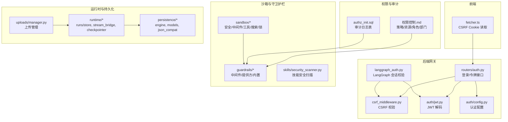
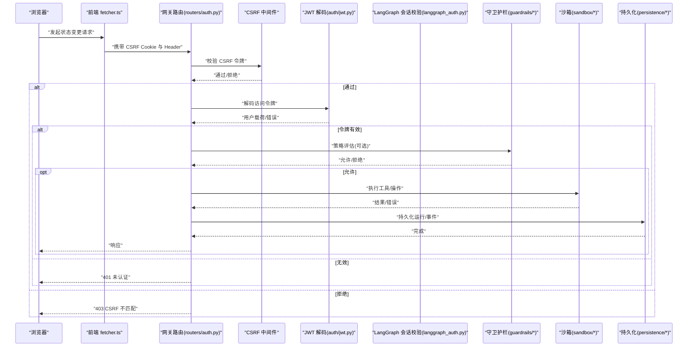
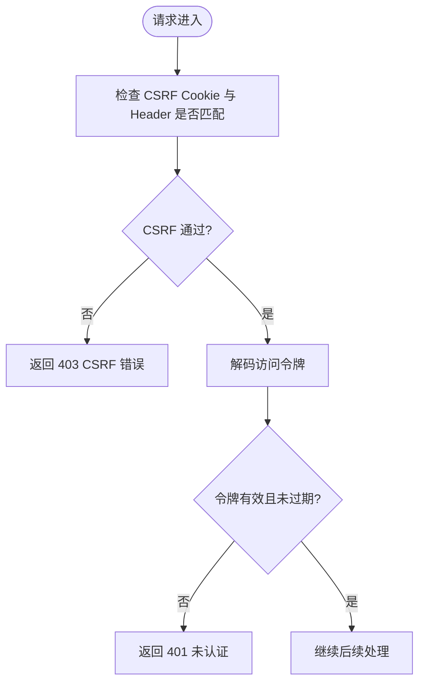
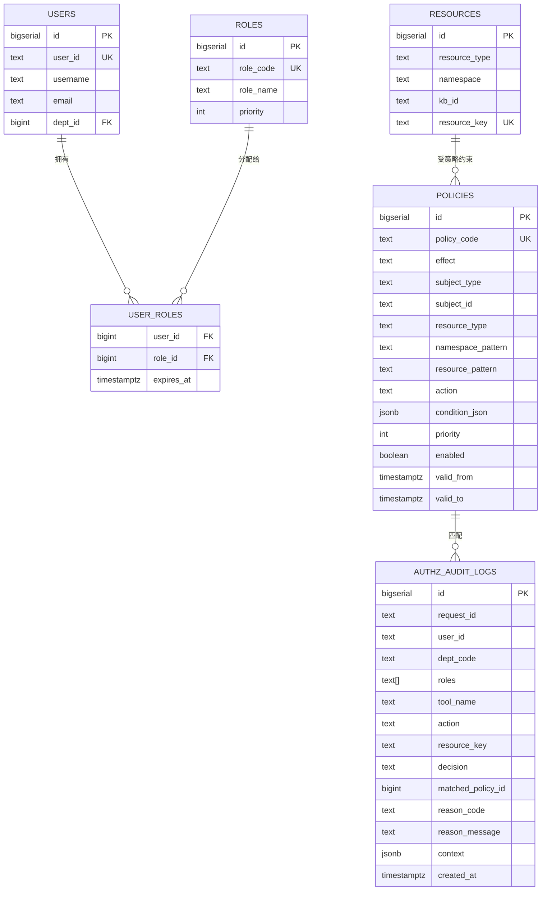
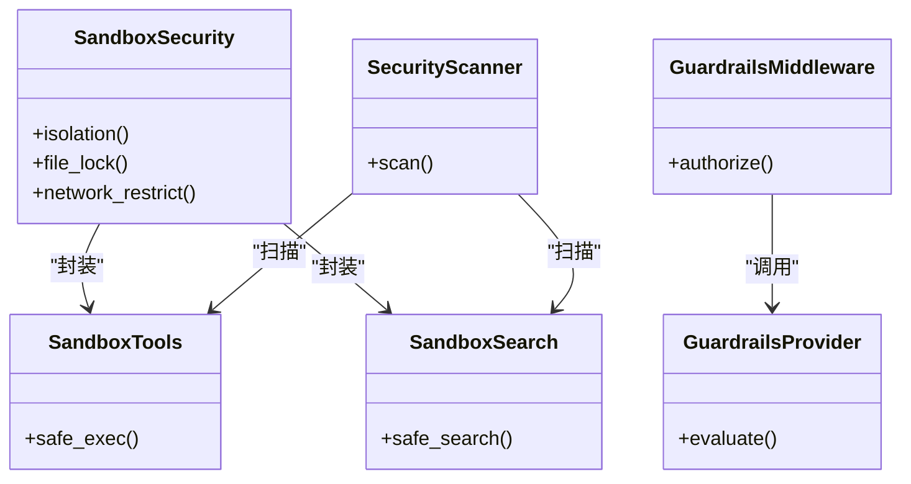
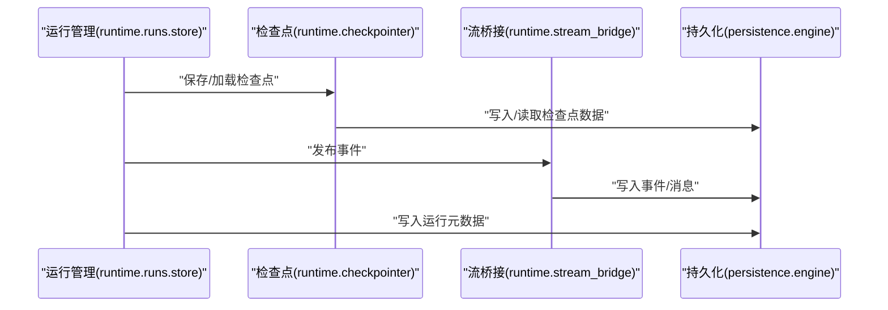
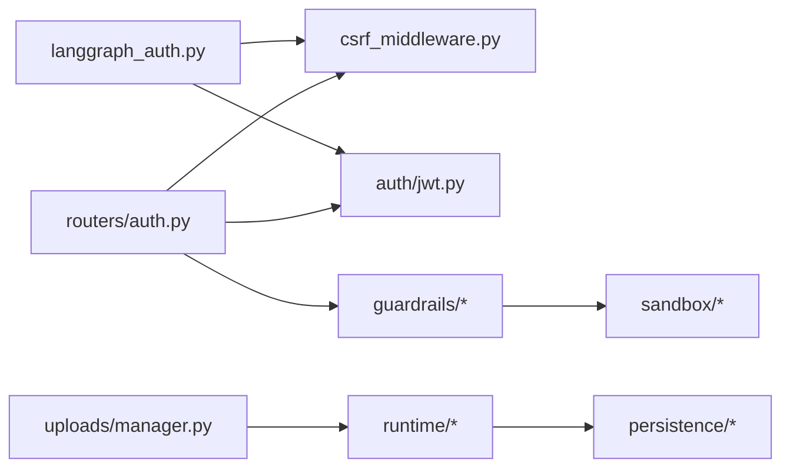

# 数据保护

<cite>
**本文引用的文件**
- [backend/app/gateway/routers/auth.py](file://backend/app/gateway/routers/auth.py)
- [backend/app/gateway/langgraph_auth.py](file://backend/app/gateway/langgraph_auth.py)
- [backend/app/gateway/csrf_middleware.py](file://backend/app/gateway/csrf_middleware.py)
- [backend/app/gateway/auth/jwt.py](file://backend/app/gateway/auth/jwt.py)
- [backend/app/gateway/auth/config.py](file://backend/app/gateway/auth/config.py)
- [backend/app/gateway/auth/providers.py](file://backend/app/gateway/auth/providers.py)
- [backend/app/gateway/auth/password.py](file://backend/app/gateway/auth/password.py)
- [backend/app/gateway/auth/credential_file.py](file://backend/app/gateway/auth/credential_file.py)
- [backend/app/gateway/auth/reset_admin.py](file://backend/app/gateway/auth/reset_admin.py)
- [backend/app/gateway/auth/errors.py](file://backend/app/gateway/auth/errors.py)
- [frontend/src/core/api/fetcher.ts](file://frontend/src/core/api/fetcher.ts)
- [docs/权限控制.md](file://docs/权限控制.md)
- [docs/sql/authz_init.sql](file://docs/sql/authz_init.sql)
- [backend/packages/harness/deerflow/sandbox/security.py](file://backend/packages/harness/deerflow/sandbox/security.py)
- [backend/packages/harness/deerflow/guardrails/middleware.py](file://backend/packages/harness/deerflow/guardrails/middleware.py)
- [backend/packages/harness/deerflow/guardrails/provider.py](file://backend/packages/harness/deerflow/guardrails/provider.py)
- [backend/packages/harness/deerflow/guardrails/builtin.py](file://backend/packages/harness/deerflow/guardrails/builtin.py)
- [backend/packages/harness/deerflow/skills/security_scanner.py](file://backend/packages/harness/deerflow/skills/security_scanner.py)
- [backend/packages/harness/deerflow/sandbox/middleware.py](file://backend/packages/harness/deerflow/sandbox/middleware.py)
- [backend/packages/harness/deerflow/sandbox/tools.py](file://backend/packages/harness/deerflow/sandbox/tools.py)
- [backend/packages/harness/deerflow/sandbox/search.py](file://backend/packages/harness/deerflow/sandbox/search.py)
- [backend/packages/harness/deerflow/sandbox/file_operation_lock.py](file://backend/packages/harness/deerflow/sandbox/file_operation_lock.py)
- [backend/packages/harness/deerflow/persistence/engine.py](file://backend/packages/harness/deerflow/persistence/engine.py)
- [backend/packages/harness/deerflow/persistence/models/base.py](file://backend/packages/harness/deerflow/persistence/models/base.py)
- [backend/packages/harness/deerflow/persistence/json_compat.py](file://backend/packages/harness/deerflow/persistence/json_compat.py)
- [backend/packages/harness/deerflow/runtime/checkpointer/__init__.py](file://backend/packages/harness/deerflow/runtime/checkpointer/__init__.py)
- [backend/packages/harness/deerflow/runtime/checkpointer/checkpoint.py](file://backend/packages/harness/deerflow/runtime/checkpointer/checkpoint.py)
- [backend/packages/harness/deerflow/runtime/checkpointer/store.py](file://backend/packages/harness/deerflow/runtime/checkpointer/store.py)
- [backend/packages/harness/deerflow/runtime/checkpointer/memory.py](file://backend/packages/harness/deerflow/runtime/checkpointer/memory.py)
- [backend/packages/harness/deerflow/runtime/runs/store.py](file://backend/packages/harness/deerflow/runtime/runs/store.py)
- [backend/packages/harness/deerflow/runtime/store/__init__.py](file://backend/packages/harness/deerflow/runtime/store/__init__.py)
- [backend/packages/harness/deerflow/runtime/store/memory.py](file://backend/packages/harness/deerflow/runtime/store/memory.py)
- [backend/packages/harness/deerflow/runtime/store/file.py](file://backend/packages/harness/deerflow/runtime/store/file.py)
- [backend/packages/harness/deerflow/runtime/stream_bridge/__init__.py](file://backend/packages/harness/deerflow/runtime/stream_bridge/__init__.py)
- [backend/packages/harness/deerflow/runtime/stream_bridge/bridge.py](file://backend/packages/harness/deerflow/runtime/stream_bridge/bridge.py)
- [backend/packages/harness/deerflow/runtime/stream_bridge/queue.py](file://backend/packages/harness/deerflow/runtime/stream_bridge/queue.py)
- [backend/packages/harness/deerflow/uploads/manager.py](file://backend/packages/harness/deerflow/uploads/manager.py)
- [backend/packages/harness/deerflow/utils/network.py](file://backend/packages/harness/deerflow/utils/network.py)
- [backend/packages/harness/deerflow/utils/time.py](file://backend/packages/harness/deerflow/utils/time.py)
- [backend/docs/GUARDRAILS.md](file://backend/docs/GUARDRAILS.md)
- [人机协作置信度分层.md](file://人机协作置信度分层.md)
</cite>

## 目录
1. [简介](#简介)
2. [项目结构](#项目结构)
3. [核心组件](#核心组件)
4. [架构总览](#架构总览)
5. [详细组件分析](#详细组件分析)
6. [依赖关系分析](#依赖关系分析)
7. [性能考量](#性能考量)
8. [故障排查指南](#故障排查指南)
9. [结论](#结论)
10. [附录](#附录)

## 简介
本文件面向数据保护与隐私合规，系统梳理 DeerFlow 的数据安全策略与实践，覆盖传输安全、身份认证与会话管理、访问控制与审计、沙箱与守卫护栏、数据生命周期与完整性、备份与恢复、以及配置示例与风险评估方法。内容以仓库现有实现为依据，结合数据库与运行时模块，给出可操作的安全建议与最佳实践。

## 项目结构
- 后端网关与认证：FastAPI 路由、CSRF 中间件、JWT 解码与配置、认证提供方与密码处理、凭据文件与管理员重置。
- 前端侧 CSRF Cookie 读取与状态变更方法判定。
- 权限控制与审计：RBAC/ABAC 策略表、审计日志表、索引与初始化脚本。
- 沙箱与守卫护栏：工具调用隔离、策略驱动授权、内置守卫护栏、安全扫描与中间件。
- 运行时持久化与检查点：内存/文件/数据库存储、事件与运行数据持久化。
- 上传与网络工具：文件上传管理、网络工具与时间工具。

**图表来源**
- [frontend/src/core/api/fetcher.ts:1-37](file://frontend/src/core/api/fetcher.ts#L1-L37)
- [backend/app/gateway/routers/auth.py:1-34](file://backend/app/gateway/routers/auth.py#L1-L34)
- [backend/app/gateway/csrf_middleware.py](file://backend/app/gateway/csrf_middleware.py)
- [backend/app/gateway/langgraph_auth.py:42-88](file://backend/app/gateway/langgraph_auth.py#L42-L88)
- [backend/app/gateway/auth/jwt.py](file://backend/app/gateway/auth/jwt.py)
- [backend/app/gateway/auth/config.py](file://backend/app/gateway/auth/config.py)
- [docs/权限控制.md:95-461](file://docs/权限控制.md#L95-L461)
- [docs/sql/authz_init.sql:97-128](file://docs/sql/authz_init.sql#L97-L128)
- [backend/packages/harness/deerflow/sandbox/security.py](file://backend/packages/harness/deerflow/sandbox/security.py)
- [backend/packages/harness/deerflow/guardrails/middleware.py](file://backend/packages/harness/deerflow/guardrails/middleware.py)
- [backend/packages/harness/deerflow/guardrails/provider.py](file://backend/packages/harness/deerflow/guardrails/provider.py)
- [backend/packages/harness/deerflow/guardrails/builtin.py](file://backend/packages/harness/deerflow/guardrails/builtin.py)
- [backend/packages/harness/deerflow/skills/security_scanner.py](file://backend/packages/harness/deerflow/skills/security_scanner.py)
- [backend/packages/harness/deerflow/runtime/runs/store.py](file://backend/packages/harness/deerflow/runtime/runs/store.py)
- [backend/packages/harness/deerflow/runtime/stream_bridge/bridge.py](file://backend/packages/harness/deerflow/runtime/stream_bridge/bridge.py)
- [backend/packages/harness/deerflow/runtime/checkpointer/checkpoint.py](file://backend/packages/harness/deerflow/runtime/checkpointer/checkpoint.py)
- [backend/packages/harness/deerflow/persistence/engine.py](file://backend/packages/harness/deerflow/persistence/engine.py)
- [backend/packages/harness/deerflow/uploads/manager.py](file://backend/packages/harness/deerflow/uploads/manager.py)

**章节来源**
- [backend/app/gateway/routers/auth.py:1-34](file://backend/app/gateway/routers/auth.py#L1-L34)
- [frontend/src/core/api/fetcher.ts:1-37](file://frontend/src/core/api/fetcher.ts#L1-L37)
- [docs/权限控制.md:95-461](file://docs/权限控制.md#L95-L461)
- [docs/sql/authz_init.sql:97-128](file://docs/sql/authz_init.sql#L97-L128)

## 核心组件
- 传输安全与会话管理：CSRF 中间件强制状态变更请求携带匹配的 CSRF 令牌；JWT 作为会话载体，配合 HttpOnly Cookie 存储访问令牌；LangGraph 会话校验在状态变更请求上先进行 CSRF 校验再解码 JWT。
- 认证与授权：本地提供方、密码处理、凭据文件与管理员重置；RBAC/ABAC 策略表与审计日志表支撑细粒度访问控制与可追溯审计。
- 沙箱与守卫护栏：工具调用隔离、策略驱动授权、内置守卫护栏、安全扫描与中间件，降低自动化流程中的风险暴露面。
- 数据持久化与完整性：运行时事件与运行数据持久化、检查点存储、流桥接与队列、上传管理；数据库引擎与模型基类确保数据一致性与兼容性。
- 前端协同：在 SSR 场景下安全读取 CSRF Cookie，并对状态变更方法进行识别与防护。

**章节来源**
- [backend/app/gateway/csrf_middleware.py](file://backend/app/gateway/csrf_middleware.py)
- [backend/app/gateway/langgraph_auth.py:42-88](file://backend/app/gateway/langgraph_auth.py#L42-L88)
- [backend/app/gateway/auth/jwt.py](file://backend/app/gateway/auth/jwt.py)
- [docs/权限控制.md:95-461](file://docs/权限控制.md#L95-L461)
- [docs/sql/authz_init.sql:97-128](file://docs/sql/authz_init.sql#L97-L128)
- [backend/packages/harness/deerflow/guardrails/middleware.py](file://backend/packages/harness/deerflow/guardrails/middleware.py)
- [backend/packages/harness/deerflow/sandbox/security.py](file://backend/packages/harness/deerflow/sandbox/security.py)
- [backend/packages/harness/deerflow/runtime/runs/store.py](file://backend/packages/harness/deerflow/runtime/runs/store.py)
- [backend/packages/harness/deerflow/persistence/engine.py](file://backend/packages/harness/deerflow/persistence/engine.py)
- [frontend/src/core/api/fetcher.ts:1-37](file://frontend/src/core/api/fetcher.ts#L1-L37)

## 架构总览
下图展示从浏览器到后端网关、认证与授权、沙箱与守卫护栏、再到运行时持久化的整体数据流与安全控制点。

**图表来源**
- [frontend/src/core/api/fetcher.ts:1-37](file://frontend/src/core/api/fetcher.ts#L1-L37)
- [backend/app/gateway/routers/auth.py:1-34](file://backend/app/gateway/routers/auth.py#L1-L34)
- [backend/app/gateway/csrf_middleware.py](file://backend/app/gateway/csrf_middleware.py)
- [backend/app/gateway/auth/jwt.py](file://backend/app/gateway/auth/jwt.py)
- [backend/app/gateway/langgraph_auth.py:42-88](file://backend/app/gateway/langgraph_auth.py#L42-L88)
- [backend/packages/harness/deerflow/guardrails/middleware.py](file://backend/packages/harness/deerflow/guardrails/middleware.py)
- [backend/packages/harness/deerflow/sandbox/security.py](file://backend/packages/harness/deerflow/sandbox/security.py)
- [backend/packages/harness/deerflow/persistence/engine.py](file://backend/packages/harness/deerflow/persistence/engine.py)

## 详细组件分析

### 传输安全与会话管理
- CSRF 保护：状态变更方法（POST/PUT/DELETE/PATCH）必须同时具备服务端设置的 CSRF Cookie 与请求头中的匹配令牌，否则返回 403。
- JWT 会话：登录成功后将访问令牌写入 HttpOnly Cookie，减少 XSS 风险；LangGraph 会话校验在状态变更请求上先进行 CSRF 校验，再解码 JWT 并核对 token_version。
- 前端协同：前端在 SSR 场景下安全读取 CSRF Cookie，并对状态变更方法进行识别，确保与网关侧的 CSRF 检查策略一致。

**图表来源**
- [backend/app/gateway/csrf_middleware.py](file://backend/app/gateway/csrf_middleware.py)
- [backend/app/gateway/langgraph_auth.py:42-88](file://backend/app/gateway/langgraph_auth.py#L42-L88)
- [frontend/src/core/api/fetcher.ts:1-37](file://frontend/src/core/api/fetcher.ts#L1-L37)

**章节来源**
- [backend/app/gateway/routers/auth.py:1-34](file://backend/app/gateway/routers/auth.py#L1-L34)
- [backend/app/gateway/csrf_middleware.py](file://backend/app/gateway/csrf_middleware.py)
- [backend/app/gateway/langgraph_auth.py:42-88](file://backend/app/gateway/langgraph_auth.py#L42-L88)
- [frontend/src/core/api/fetcher.ts:1-37](file://frontend/src/core/api/fetcher.ts#L1-L37)

### 认证与授权（RBAC/ABAC）
- 策略模型：用户、角色、部门、资源、策略与审计日志表，支持基于用户/角色/部门的主体匹配，资源类型与命名空间模式匹配，动作与条件表达式（ABAC）。
- 条件字段建议：时间窗、是否需要子代理、危险命令关键字、路径白名单、部门与命名空间一致性等。
- 审计落库：鉴权决策与上下文写入审计日志表，便于追踪与复盘。
- 生产化建议：高频策略查询本地短缓存、审计日志异步写入、策略版本化与回滚、对高频 DENY 建立告警。

**图表来源**
- [docs/权限控制.md:95-461](file://docs/权限控制.md#L95-L461)
- [docs/sql/authz_init.sql:97-128](file://docs/sql/authz_init.sql#L97-L128)

**章节来源**
- [docs/权限控制.md:95-461](file://docs/权限控制.md#L95-L461)
- [docs/sql/authz_init.sql:97-128](file://docs/sql/authz_init.sql#L97-L128)

### 沙箱与守卫护栏
- 沙箱隔离：进程隔离与文件系统限制，防止工具调用直接外泄数据；提供文件操作锁与搜索工具的安全封装。
- 守卫护栏：策略驱动的授权，无需人工介入即可执行确定性授权；内置守卫护栏与自定义提供方，支持策略评估与中间件集成。
- 技能安全扫描：对技能加载与调用进行安全扫描，降低恶意或高风险工具的风险暴露。

**图表来源**
- [backend/packages/harness/deerflow/sandbox/security.py](file://backend/packages/harness/deerflow/sandbox/security.py)
- [backend/packages/harness/deerflow/guardrails/middleware.py](file://backend/packages/harness/deerflow/guardrails/middleware.py)
- [backend/packages/harness/deerflow/guardrails/provider.py](file://backend/packages/harness/deerflow/guardrails/provider.py)
- [backend/packages/harness/deerflow/skills/security_scanner.py](file://backend/packages/harness/deerflow/skills/security_scanner.py)
- [backend/packages/harness/deerflow/sandbox/tools.py](file://backend/packages/harness/deerflow/sandbox/tools.py)
- [backend/packages/harness/deerflow/sandbox/search.py](file://backend/packages/harness/deerflow/sandbox/search.py)

**章节来源**
- [backend/packages/harness/deerflow/sandbox/security.py](file://backend/packages/harness/deerflow/sandbox/security.py)
- [backend/packages/harness/deerflow/guardrails/middleware.py](file://backend/packages/harness/deerflow/guardrails/middleware.py)
- [backend/packages/harness/deerflow/guardrails/provider.py](file://backend/packages/harness/deerflow/guardrails/provider.py)
- [backend/packages/harness/deerflow/guardrails/builtin.py](file://backend/packages/harness/deerflow/guardrails/builtin.py)
- [backend/packages/harness/deerflow/skills/security_scanner.py](file://backend/packages/harness/deerflow/skills/security_scanner.py)
- [backend/packages/harness/deerflow/sandbox/middleware.py](file://backend/packages/harness/deerflow/sandbox/middleware.py)
- [backend/packages/harness/deerflow/sandbox/tools.py](file://backend/packages/harness/deerflow/sandbox/tools.py)
- [backend/packages/harness/deerflow/sandbox/search.py](file://backend/packages/harness/deerflow/sandbox/search.py)
- [backend/packages/harness/deerflow/sandbox/file_operation_lock.py](file://backend/packages/harness/deerflow/sandbox/file_operation_lock.py)

### 数据生命周期与完整性
- 运行时持久化：运行事件与消息持久化、检查点存储（内存/文件/数据库），支持运行恢复与重放。
- 流桥接：事件队列与桥接组件，保障流式输出与事件的可靠传递。
- 数据库引擎与模型：统一的数据库引擎与模型基类，确保数据一致性与兼容性。

**图表来源**
- [backend/packages/harness/deerflow/runtime/runs/store.py](file://backend/packages/harness/deerflow/runtime/runs/store.py)
- [backend/packages/harness/deerflow/runtime/checkpointer/checkpoint.py](file://backend/packages/harness/deerflow/runtime/checkpointer/checkpoint.py)
- [backend/packages/harness/deerflow/runtime/stream_bridge/bridge.py](file://backend/packages/harness/deerflow/runtime/stream_bridge/bridge.py)
- [backend/packages/harness/deerflow/persistence/engine.py](file://backend/packages/harness/deerflow/persistence/engine.py)

**章节来源**
- [backend/packages/harness/deerflow/runtime/runs/store.py](file://backend/packages/harness/deerflow/runtime/runs/store.py)
- [backend/packages/harness/deerflow/runtime/checkpointer/checkpoint.py](file://backend/packages/harness/deerflow/runtime/checkpointer/checkpoint.py)
- [backend/packages/harness/deerflow/runtime/stream_bridge/bridge.py](file://backend/packages/harness/deerflow/runtime/stream_bridge/bridge.py)
- [backend/packages/harness/deerflow/persistence/engine.py](file://backend/packages/harness/deerflow/persistence/engine.py)

### 上传与网络工具
- 上传管理：统一的上传管理器，支持文件转换与过滤，配合中间件进行安全控制。
- 网络工具：网络工具与时间工具，提供网络访问与时间戳处理能力，需结合沙箱与守卫护栏进行安全约束。

**章节来源**
- [backend/packages/harness/deerflow/uploads/manager.py](file://backend/packages/harness/deerflow/uploads/manager.py)
- [backend/packages/harness/deerflow/utils/network.py](file://backend/packages/harness/deerflow/utils/network.py)
- [backend/packages/harness/deerflow/utils/time.py](file://backend/packages/harness/deerflow/utils/time.py)

### 人机协作置信度分层（审计与决策）
- 决策日志表：记录每次分层决策与最终执行结果，支持置信度、风险评分、策略匹配度、人工确认状态与执行结果等字段。
- 指标与上线策略：自动执行率、人工确认率与耗时、低置信拒绝率、人工推翻率、高风险误执行率、二次成功率等关键指标；SHADOW 观测、ENFORCE 灰度放量与回滚策略。

**章节来源**
- [人机协作置信度分层.md:212-313](file://人机协作置信度分层.md#L212-L313)

## 依赖关系分析
- 组件耦合：网关路由依赖 CSRF 中间件与 JWT 解码；LangGraph 会话校验依赖 CSRF 与 JWT；守卫护栏与沙箱共同构成工具调用的安全边界；运行时持久化依赖数据库引擎与模型基类。
- 外部依赖：FastAPI、Pydantic、JWT 库、PostgreSQL（策略与审计日志）、SQLite（测试与本地）。
- 潜在循环依赖：当前结构以网关与运行时为中心向外辐射，未见明显循环依赖迹象。

**图表来源**
- [backend/app/gateway/routers/auth.py:1-34](file://backend/app/gateway/routers/auth.py#L1-L34)
- [backend/app/gateway/csrf_middleware.py](file://backend/app/gateway/csrf_middleware.py)
- [backend/app/gateway/auth/jwt.py](file://backend/app/gateway/auth/jwt.py)
- [backend/app/gateway/langgraph_auth.py:42-88](file://backend/app/gateway/langgraph_auth.py#L42-L88)
- [backend/packages/harness/deerflow/guardrails/middleware.py](file://backend/packages/harness/deerflow/guardrails/middleware.py)
- [backend/packages/harness/deerflow/sandbox/security.py](file://backend/packages/harness/deerflow/sandbox/security.py)
- [backend/packages/harness/deerflow/runtime/runs/store.py](file://backend/packages/harness/deerflow/runtime/runs/store.py)
- [backend/packages/harness/deerflow/persistence/engine.py](file://backend/packages/harness/deerflow/persistence/engine.py)
- [backend/packages/harness/deerflow/uploads/manager.py](file://backend/packages/harness/deerflow/uploads/manager.py)

**章节来源**
- [backend/app/gateway/routers/auth.py:1-34](file://backend/app/gateway/routers/auth.py#L1-L34)
- [backend/app/gateway/csrf_middleware.py](file://backend/app/gateway/csrf_middleware.py)
- [backend/app/gateway/auth/jwt.py](file://backend/app/gateway/auth/jwt.py)
- [backend/app/gateway/langgraph_auth.py:42-88](file://backend/app/gateway/langgraph_auth.py#L42-L88)
- [backend/packages/harness/deerflow/guardrails/middleware.py](file://backend/packages/harness/deerflow/guardrails/middleware.py)
- [backend/packages/harness/deerflow/sandbox/security.py](file://backend/packages/harness/deerflow/sandbox/security.py)
- [backend/packages/harness/deerflow/runtime/runs/store.py](file://backend/packages/harness/deerflow/runtime/runs/store.py)
- [backend/packages/harness/deerflow/persistence/engine.py](file://backend/packages/harness/deerflow/persistence/engine.py)
- [backend/packages/harness/deerflow/uploads/manager.py](file://backend/packages/harness/deerflow/uploads/manager.py)

## 性能考量
- 策略查询缓存：对高频策略查询做本地短缓存（按用户+资源+动作），降低数据库压力。
- 异步审计：审计日志异步写入，避免阻塞工具调用链路。
- 分区与归档：审计日志按月分区，保留期 90–180 天，历史归档至对象存储/数仓。
- 沙箱与守卫护栏：在保证安全的前提下，尽量减少不必要的策略评估与文件系统检查，优化工具调用路径。

[本节为通用指导，无需具体文件来源]

## 故障排查指南
- CSRF 403：确认浏览器已正确接收并携带 CSRF Cookie，且请求头中包含匹配的 x-csrf-token。
- JWT 401：检查访问令牌是否有效、是否过期、是否与 token_version 匹配。
- 审计日志缺失：确认审计落库中间件已启用，数据库连接正常，索引与分区策略满足查询性能需求。
- 沙箱执行失败：检查沙箱隔离配置、文件操作锁与网络限制策略，确认工具调用参数与路径白名单。

**章节来源**
- [backend/app/gateway/csrf_middleware.py](file://backend/app/gateway/csrf_middleware.py)
- [backend/app/gateway/auth/jwt.py](file://backend/app/gateway/auth/jwt.py)
- [docs/sql/authz_init.sql:97-128](file://docs/sql/authz_init.sql#L97-L128)
- [backend/packages/harness/deerflow/sandbox/security.py](file://backend/packages/harness/deerflow/sandbox/security.py)

## 结论
DeerFlow 的数据保护体系以 CSRF 与 JWT 为基础，结合 RBAC/ABAC 策略与审计日志，辅以沙箱与守卫护栏，形成从传输、认证、授权到运行时持久化的全链路安全闭环。建议在生产环境中进一步完善策略缓存、异步审计、日志分区与归档、以及灰度与回滚策略，持续监控关键指标并定期进行安全评估与演练。

[本节为总结性内容，无需具体文件来源]

## 附录
- 数据脱敏与 PII 保护：在审计日志与决策日志中避免直接存储敏感信息，采用哈希摘要或脱敏策略；对工具输入参数进行摘要存储，遵循最小化原则。
- 合规性要求：根据所在地区与行业标准（如数据最小化、可追溯性、访问控制、数据保留与删除）完善策略与流程；定期进行合规性审计与风险评估。
- 配置示例与最佳实践：参考认证配置、策略表结构与索引、沙箱隔离参数、守卫护栏阈值与模式（SHADOW/ENFORCE）等，结合实际业务场景进行定制化部署。

[本节为概念性内容，无需具体文件来源]