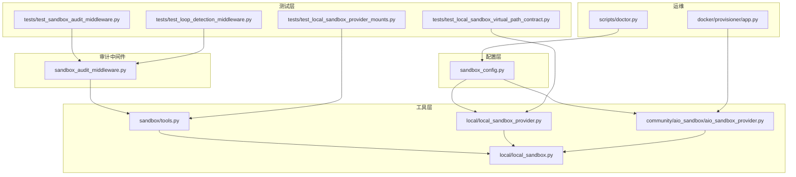
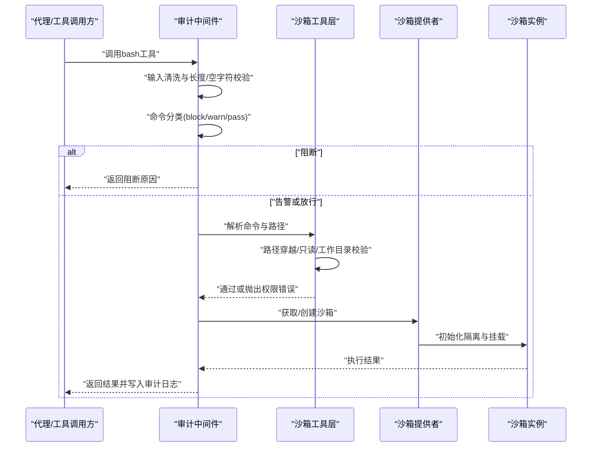
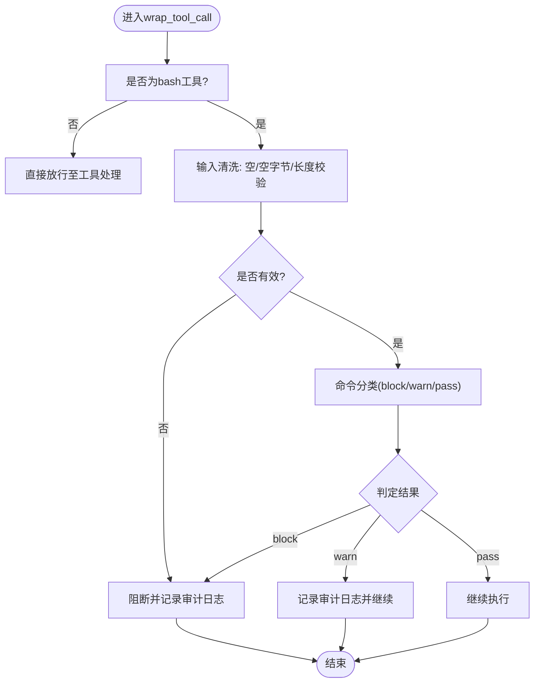
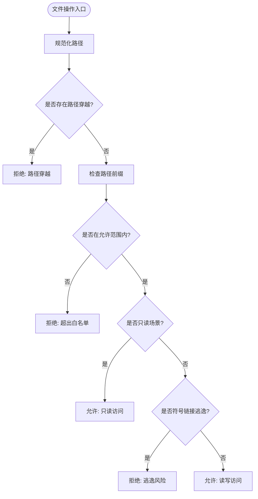
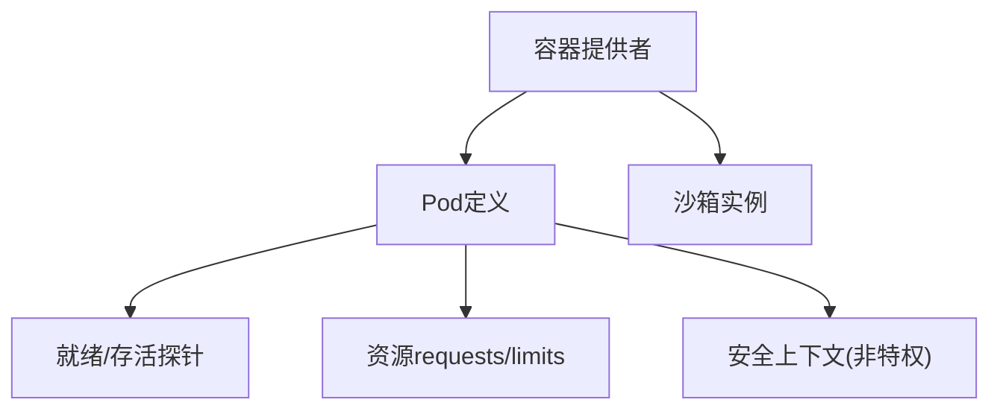
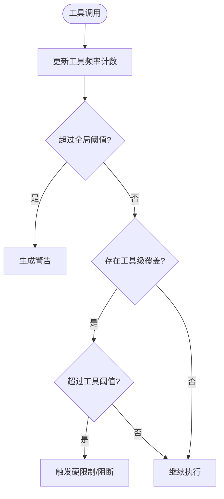
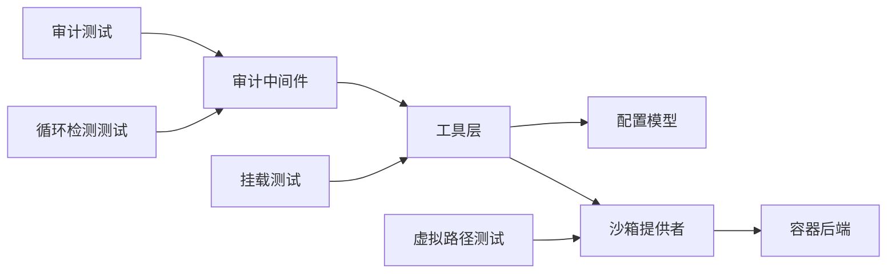

# 沙箱安全

<cite>
**本文引用的文件**
- [sandbox_config.py](file://backend/packages/harness/deerflow/config/sandbox_config.py)
- [sandbox_audit_middleware.py](file://backend/packages/harness/deerflow/agents/middlewares/sandbox_audit_middleware.py)
- [tools.py](file://backend/packages/harness/deerflow/sandbox/tools.py)
- [local_sandbox.py](file://backend/packages/harness/deerflow/sandbox/local/local_sandbox.py)
- [local_sandbox_provider.py](file://backend/packages/harness/deerflow/sandbox/local/local_sandbox_provider.py)
- [aio_sandbox_provider.py](file://backend/packages/harness/deerflow/community/aio_sandbox/aio_sandbox_provider.py)
- [app.py](file://docker/provisioner/app.py)
- [test_sandbox_audit_middleware.py](file://backend/tests/test_sandbox_audit_middleware.py)
- [test_local_sandbox_provider_mounts.py](file://backend/tests/test_local_sandbox_provider_mounts.py)
- [test_local_sandbox_virtual_path_contract.py](file://backend/tests/test_local_sandbox_virtual_path_contract.py)
- [test_loop_detection_middleware.py](file://backend/tests/test_loop_detection_middleware.py)
- [doctor.py](file://scripts/doctor.py)
- [GUARDRAILS.md](file://backend/docs/GUARDRAILS.md)
</cite>

## 目录
1. [简介](#简介)
2. [项目结构](#项目结构)
3. [核心组件](#核心组件)
4. [架构总览](#架构总览)
5. [详细组件分析](#详细组件分析)
6. [依赖关系分析](#依赖关系分析)
7. [性能考量](#性能考量)
8. [故障排查指南](#故障排查指南)
9. [结论](#结论)
10. [附录](#附录)

## 简介
本文件面向DeerFlow沙箱系统的安全架构与防护机制，覆盖容器隔离、资源限制、文件系统权限控制、恶意代码检测、执行超时与内存监控、配置参数与安全策略、访问控制清单（ACL）、逃逸防护、进程监控与安全审计等主题，并提供安全测试方法与漏洞修复建议。内容基于仓库中实际实现与测试用例进行归纳总结，帮助读者在不深入源码的前提下理解并正确部署与运维沙箱。

## 项目结构
围绕沙箱安全的关键目录与文件包括：
- 配置层：沙箱配置模型与默认值
- 审计中间件：命令级安全审计与阻断
- 工具层：路径校验、权限判定与工具调用
- 提供者层：本地与容器沙箱实例化与隔离
- 测试层：安全策略验证与边界测试
- 运维脚本：健康检查与环境诊断

**图表来源**
- [sandbox_config.py:1-120](file://backend/packages/harness/deerflow/config/sandbox_config.py#L1-L120)
- [sandbox_audit_middleware.py:196-336](file://backend/packages/harness/deerflow/agents/middlewares/sandbox_audit_middleware.py#L196-L336)
- [tools.py:654-686](file://backend/packages/harness/deerflow/sandbox/tools.py#L654-L686)
- [local_sandbox.py:1-200](file://backend/packages/harness/deerflow/sandbox/local/local_sandbox.py#L1-L200)
- [local_sandbox_provider.py:1-120](file://backend/packages/harness/deerflow/sandbox/local/local_sandbox_provider.py#L1-L120)
- [aio_sandbox_provider.py:632-658](file://backend/packages/harness/deerflow/community/aio_sandbox/aio_sandbox_provider.py#L632-L658)
- [test_sandbox_audit_middleware.py:251-290](file://backend/tests/test_sandbox_audit_middleware.py#L251-L290)
- [test_local_sandbox_provider_mounts.py:215-247](file://backend/tests/test_local_sandbox_provider_mounts.py#L215-L247)
- [test_local_sandbox_virtual_path_contract.py:145-192](file://backend/tests/test_local_sandbox_virtual_path_contract.py#L145-L192)
- [test_loop_detection_middleware.py:877-1076](file://backend/tests/test_loop_detection_middleware.py#L877-L1076)
- [doctor.py:568-595](file://scripts/doctor.py#L568-L595)
- [app.py:332-369](file://docker/provisioner/app.py#L332-L369)

**章节来源**
- [sandbox_config.py:1-120](file://backend/packages/harness/deerflow/config/sandbox_config.py#L1-L120)
- [sandbox_audit_middleware.py:196-336](file://backend/packages/harness/deerflow/agents/middlewares/sandbox_audit_middleware.py#L196-L336)
- [tools.py:654-686](file://backend/packages/harness/deerflow/sandbox/tools.py#L654-L686)
- [local_sandbox.py:1-200](file://backend/packages/harness/deerflow/sandbox/local/local_sandbox.py#L1-L200)
- [local_sandbox_provider.py:1-120](file://backend/packages/harness/deerflow/sandbox/local/local_sandbox_provider.py#L1-L120)
- [aio_sandbox_provider.py:632-658](file://backend/packages/harness/deerflow/community/aio_sandbox/aio_sandbox_provider.py#L632-L658)
- [test_sandbox_audit_middleware.py:251-290](file://backend/tests/test_sandbox_audit_middleware.py#L251-L290)
- [test_local_sandbox_provider_mounts.py:215-247](file://backend/tests/test_local_sandbox_provider_mounts.py#L215-L247)
- [test_local_sandbox_virtual_path_contract.py:145-192](file://backend/tests/test_local_sandbox_virtual_path_contract.py#L145-L192)
- [test_loop_detection_middleware.py:877-1076](file://backend/tests/test_loop_detection_middleware.py#L877-L1076)
- [doctor.py:568-595](file://scripts/doctor.py#L568-L595)
- [app.py:332-369](file://docker/provisioner/app.py#L332-L369)

## 核心组件
- 沙箱配置模型：定义卷挂载、运行时参数与默认行为，为隔离与资源限制提供基础。
- 审计中间件：对bash工具调用进行输入清洗、命令分类与审计日志输出，支持阻断与告警。
- 路径与权限工具：严格限制可访问路径、拒绝路径穿越、限定只读挂载、校验工作目录变更。
- 本地与容器提供者：负责线程隔离、跨进程锁、容器生命周期与资源配额。
- 测试套件：覆盖命令阻断率、误报率、路径逃逸防护、虚拟路径隔离与循环检测阈值。

**章节来源**
- [sandbox_config.py:1-120](file://backend/packages/harness/deerflow/config/sandbox_config.py#L1-L120)
- [sandbox_audit_middleware.py:196-336](file://backend/packages/harness/deerflow/agents/middlewares/sandbox_audit_middleware.py#L196-L336)
- [tools.py:654-686](file://backend/packages/harness/deerflow/sandbox/tools.py#L654-L686)
- [local_sandbox_provider.py:1-120](file://backend/packages/harness/deerflow/sandbox/local/local_sandbox_provider.py#L1-L120)
- [aio_sandbox_provider.py:632-658](file://backend/packages/harness/deerflow/community/aio_sandbox/aio_sandbox_provider.py#L632-L658)

## 架构总览
下图展示从工具调用到沙箱执行的安全链路，包括输入校验、命令分类、审计记录、路径权限与隔离提供者的协同。

**图表来源**
- [sandbox_audit_middleware.py:305-323](file://backend/packages/harness/deerflow/agents/middlewares/sandbox_audit_middleware.py#L305-L323)
- [tools.py:654-686](file://backend/packages/harness/deerflow/sandbox/tools.py#L654-L686)
- [local_sandbox_provider.py:1-120](file://backend/packages/harness/deerflow/sandbox/local/local_sandbox_provider.py#L1-L120)
- [aio_sandbox_provider.py:632-658](file://backend/packages/harness/deerflow/community/aio_sandbox/aio_sandbox_provider.py#L632-L658)

## 详细组件分析

### 审计中间件与恶意代码检测
- 输入清洗：拒绝空字符串、仅空白字符、包含空字节、过长命令等。
- 命令分类：对高危模式（如删除根目录、下载并执行、覆盖系统二进制、动态链接劫持、/proc环境读取等）进行阻断；对中危模式发出警告；对安全命令放行。
- 审计日志：记录时间戳、线程ID、命令摘要与判定结果，支持截断以避免日志膨胀。
- 与Guardrails的关系：强调沙箱提供进程隔离但不等同于语义授权，需结合策略化的守卫护栏实现自动化授权。

**图表来源**
- [sandbox_audit_middleware.py:305-323](file://backend/packages/harness/deerflow/agents/middlewares/sandbox_audit_middleware.py#L305-L323)
- [test_sandbox_audit_middleware.py:251-290](file://backend/tests/test_sandbox_audit_middleware.py#L251-L290)
- [test_sandbox_audit_middleware.py:622-716](file://backend/tests/test_sandbox_audit_middleware.py#L622-L716)

**章节来源**
- [sandbox_audit_middleware.py:196-336](file://backend/packages/harness/deerflow/agents/middlewares/sandbox_audit_middleware.py#L196-L336)
- [test_sandbox_audit_middleware.py:251-290](file://backend/tests/test_sandbox_audit_middleware.py#L251-L290)
- [test_sandbox_audit_middleware.py:622-716](file://backend/tests/test_sandbox_audit_middleware.py#L622-L716)
- [GUARDRAILS.md:34-36](file://backend/docs/GUARDRAILS.md#L34-L36)

### 文件系统权限控制与路径隔离
- 路径白名单：仅允许位于虚拟路径前缀、技能目录、ACP工作区或已配置挂载点下的路径。
- 路径穿越防护：拒绝包含“..”段或绝对路径穿越的请求。
- 只读约束：对技能路径与ACP工作区强制只读；自定义挂载可按配置设置只读。
- 工作目录变更限制：禁止切换到虚拟路径之外的工作目录。
- 虚拟路径隔离：不同线程拥有独立的用户数据映射，避免跨线程状态泄漏。
- 挂载逃逸防护：拒绝通过符号链接逃逸到挂载范围外的写操作。

**图表来源**
- [tools.py:654-686](file://backend/packages/harness/deerflow/sandbox/tools.py#L654-L686)
- [test_local_sandbox_provider_mounts.py:215-247](file://backend/tests/test_local_sandbox_provider_mounts.py#L215-L247)
- [test_local_sandbox_virtual_path_contract.py:145-192](file://backend/tests/test_local_sandbox_virtual_path_contract.py#L145-L192)

**章节来源**
- [tools.py:654-686](file://backend/packages/harness/deerflow/sandbox/tools.py#L654-L686)
- [test_local_sandbox_provider_mounts.py:215-247](file://backend/tests/test_local_sandbox_provider_mounts.py#L215-L247)
- [test_local_sandbox_virtual_path_contract.py:145-192](file://backend/tests/test_local_sandbox_virtual_path_contract.py#L145-L192)

### 容器隔离与资源限制
- 容器运行时：通过容器提供者管理沙箱生命周期，支持健康探针与存活探针。
- 资源配额：CPU、内存与临时存储的requests与limits明确设定，防止资源滥用。
- 安全上下文：非特权模式、禁止提权，降低容器内逃逸风险。
- Kubernetes集成：通过探针与资源声明保障服务可用性与稳定性。

**图表来源**
- [aio_sandbox_provider.py:632-658](file://backend/packages/harness/deerflow/community/aio_sandbox/aio_sandbox_provider.py#L632-L658)
- [app.py:332-369](file://docker/provisioner/app.py#L332-L369)

**章节来源**
- [aio_sandbox_provider.py:632-658](file://backend/packages/harness/deerflow/community/aio_sandbox/aio_sandbox_provider.py#L632-L658)
- [app.py:332-369](file://docker/provisioner/app.py#L332-L369)

### 执行超时控制与内存使用监控
- 循环检测中间件：基于工具调用频率的阈值检测，支持全局与工具级覆盖阈值，触发警告或阻断。
- 与审计中间件配合：对高频调用进行预警，避免长时间占用资源或潜在死循环。
- 内存与资源：容器侧通过资源限制与探针保障内存与CPU使用在可控范围。

**图表来源**
- [test_loop_detection_middleware.py:877-1076](file://backend/tests/test_loop_detection_middleware.py#L877-L1076)

**章节来源**
- [test_loop_detection_middleware.py:877-1076](file://backend/tests/test_loop_detection_middleware.py#L877-L1076)

### 沙箱配置参数与安全策略
- 配置模型：包含卷挂载、运行时参数等，用于定义挂载点、只读策略与默认行为。
- 策略建议：优先使用容器沙箱获得更强隔离；若必须启用主机bash，需在完全受信任环境并切换到容器沙箱。
- 访问控制清单（ACL）：基于路径白名单与只读策略，限制对宿主文件系统的访问范围。

**章节来源**
- [sandbox_config.py:1-120](file://backend/packages/harness/deerflow/config/sandbox_config.py#L1-L120)
- [doctor.py:568-595](file://scripts/doctor.py#L568-L595)
- [tools.py:654-686](file://backend/packages/harness/deerflow/sandbox/tools.py#L654-L686)

### 沙箱逃逸防护与进程监控
- 逃逸防护：严格的路径校验、只读挂载、工作目录限制与符号链接逃逸检测。
- 进程监控：容器提供者使用文件锁保证同一线程的并发创建一致性，避免命名冲突与竞态。
- 健康监控：Kubernetes探针定期检查沙箱端点，确保可用性与响应能力。

**章节来源**
- [tools.py:654-686](file://backend/packages/harness/deerflow/sandbox/tools.py#L654-L686)
- [aio_sandbox_provider.py:632-658](file://backend/packages/harness/deerflow/community/aio_sandbox/aio_sandbox_provider.py#L632-L658)
- [app.py:332-369](file://docker/provisioner/app.py#L332-L369)

### 安全审计与合规
- 审计中间件记录所有bash调用的判定结果，支持截断长命令，便于审计与取证。
- 测试用例覆盖高危命令阻断率、中危命令告警率与零误报要求，确保策略有效性。

**章节来源**
- [sandbox_audit_middleware.py:233-323](file://backend/packages/harness/deerflow/agents/middlewares/sandbox_audit_middleware.py#L233-L323)
- [test_sandbox_audit_middleware.py:339-356](file://backend/tests/test_sandbox_audit_middleware.py#L339-L356)
- [test_sandbox_audit_middleware.py:435-470](file://backend/tests/test_sandbox_audit_middleware.py#L435-L470)

## 依赖关系分析
- 组件耦合：审计中间件依赖工具层的路径与命令解析；工具层依赖配置模型与路径常量；提供者依赖容器后端与本地后端实现隔离。
- 外部依赖：容器运行时（Docker/Kubernetes）与探针机制；测试框架驱动安全策略验证。
- 潜在环路：当前实现未见明显循环依赖；路径与权限校验集中在工具层，避免跨模块耦合。

**图表来源**
- [sandbox_audit_middleware.py:305-323](file://backend/packages/harness/deerflow/agents/middlewares/sandbox_audit_middleware.py#L305-L323)
- [tools.py:654-686](file://backend/packages/harness/deerflow/sandbox/tools.py#L654-L686)
- [sandbox_config.py:1-120](file://backend/packages/harness/deerflow/config/sandbox_config.py#L1-L120)
- [local_sandbox_provider.py:1-120](file://backend/packages/harness/deerflow/sandbox/local/local_sandbox_provider.py#L1-L120)
- [aio_sandbox_provider.py:632-658](file://backend/packages/harness/deerflow/community/aio_sandbox/aio_sandbox_provider.py#L632-L658)
- [test_sandbox_audit_middleware.py:251-290](file://backend/tests/test_sandbox_audit_middleware.py#L251-L290)
- [test_local_sandbox_provider_mounts.py:215-247](file://backend/tests/test_local_sandbox_provider_mounts.py#L215-L247)
- [test_local_sandbox_virtual_path_contract.py:145-192](file://backend/tests/test_local_sandbox_virtual_path_contract.py#L145-L192)
- [test_loop_detection_middleware.py:877-1076](file://backend/tests/test_loop_detection_middleware.py#L877-L1076)

**章节来源**
- [sandbox_audit_middleware.py:305-323](file://backend/packages/harness/deerflow/agents/middlewares/sandbox_audit_middleware.py#L305-L323)
- [tools.py:654-686](file://backend/packages/harness/deerflow/sandbox/tools.py#L654-L686)
- [sandbox_config.py:1-120](file://backend/packages/harness/deerflow/config/sandbox_config.py#L1-L120)
- [local_sandbox_provider.py:1-120](file://backend/packages/harness/deerflow/sandbox/local/local_sandbox_provider.py#L1-L120)
- [aio_sandbox_provider.py:632-658](file://backend/packages/harness/deerflow/community/aio_sandbox/aio_sandbox_provider.py#L632-L658)
- [test_sandbox_audit_middleware.py:251-290](file://backend/tests/test_sandbox_audit_middleware.py#L251-L290)
- [test_local_sandbox_provider_mounts.py:215-247](file://backend/tests/test_local_sandbox_provider_mounts.py#L215-L247)
- [test_local_sandbox_virtual_path_contract.py:145-192](file://backend/tests/test_local_sandbox_virtual_path_contract.py#L145-L192)
- [test_loop_detection_middleware.py:877-1076](file://backend/tests/test_loop_detection_middleware.py#L877-L1076)

## 性能考量
- 资源配额：合理设置CPU与内存上限，避免单个沙箱占用过多资源影响其他任务。
- 探针频率：健康探针与存活探针周期应平衡探测开销与可用性保障。
- 日志截断：审计日志对超长命令进行截断，减少I/O压力与日志膨胀。
- 频繁调用抑制：通过循环检测中间件降低高频工具调用对系统的影响。

[本节为通用指导，无需具体文件来源]

## 故障排查指南
- 环境诊断：使用运维脚本检查沙箱类型、容器运行时可用性与主机bash启用状态，必要时切换到容器沙箱。
- 路径问题：确认虚拟路径前缀、技能目录与ACP工作区映射正确，避免路径穿越与只读违规。
- 挂载逃逸：检查符号链接与挂载点配置，确保写操作不会逃逸到挂载范围外。
- 审计策略：核对高危命令阻断清单与中危命令告警阈值，调整误报与漏报。
- 资源异常：查看容器资源使用情况与探针状态，必要时提升limits或优化工具调用。

**章节来源**
- [doctor.py:568-595](file://scripts/doctor.py#L568-L595)
- [test_local_sandbox_provider_mounts.py:215-247](file://backend/tests/test_local_sandbox_provider_mounts.py#L215-L247)
- [test_sandbox_audit_middleware.py:622-716](file://backend/tests/test_sandbox_audit_middleware.py#L622-L716)
- [app.py:332-369](file://docker/provisioner/app.py#L332-L369)

## 结论
DeerFlow沙箱通过多层安全机制实现强隔离与可控访问：容器提供者提供进程与网络隔离，路径与权限工具实现文件系统边界控制，审计中间件与循环检测中间件共同构成威胁检测与阻断体系。结合资源配额与健康探针，系统在保障安全性的同时维持稳定运行。建议优先采用容器沙箱，严格遵循ACL与只读策略，并持续通过测试用例验证安全策略的有效性。

[本节为总结性内容，无需具体文件来源]

## 附录
- 安全测试方法
  - 命令阻断测试：覆盖高危命令集合，确保阻断率达到100%，误报率为0%。
  - 虚拟路径隔离测试：验证不同线程间用户数据映射隔离与反向解析不泄漏。
  - 挂载逃逸测试：构造符号链接与跨挂载写入，确保被拒绝并保护宿主文件。
  - 循环检测测试：模拟高频工具调用，验证告警与硬限制触发时机。
- 漏洞修复指南
  - 发现路径穿越或工作目录逃逸：立即收紧路径白名单与只读策略。
  - 发现主机bash滥用：关闭主机bash或切换到容器沙箱。
  - 发现资源滥用：提升容器资源上限或增加频率阈值。
  - 发现探针失败：检查容器健康状态与端点可达性。

**章节来源**
- [test_sandbox_audit_middleware.py:622-716](file://backend/tests/test_sandbox_audit_middleware.py#L622-L716)
- [test_local_sandbox_virtual_path_contract.py:145-192](file://backend/tests/test_local_sandbox_virtual_path_contract.py#L145-L192)
- [test_local_sandbox_provider_mounts.py:215-247](file://backend/tests/test_local_sandbox_provider_mounts.py#L215-L247)
- [test_loop_detection_middleware.py:877-1076](file://backend/tests/test_loop_detection_middleware.py#L877-L1076)