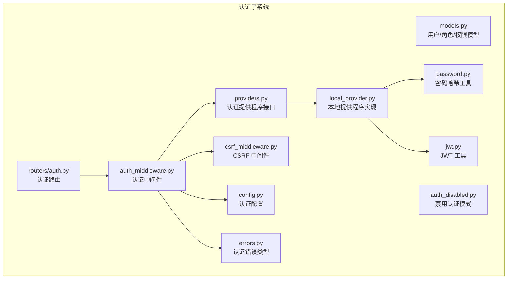
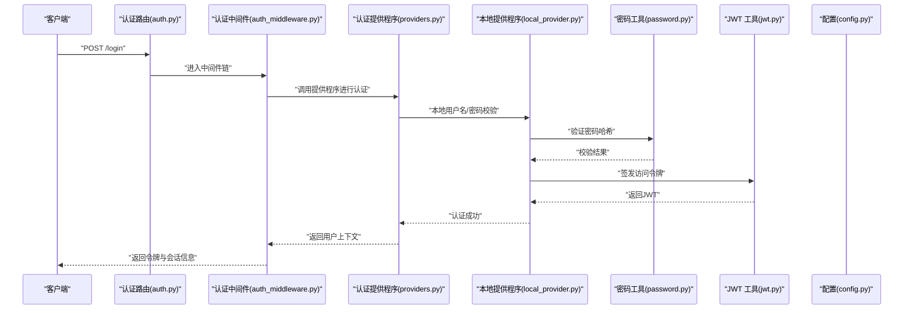
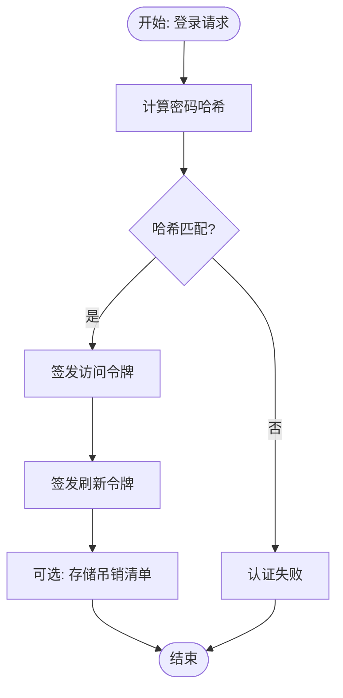
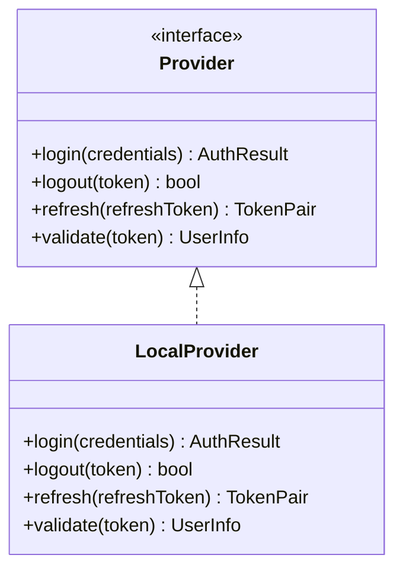
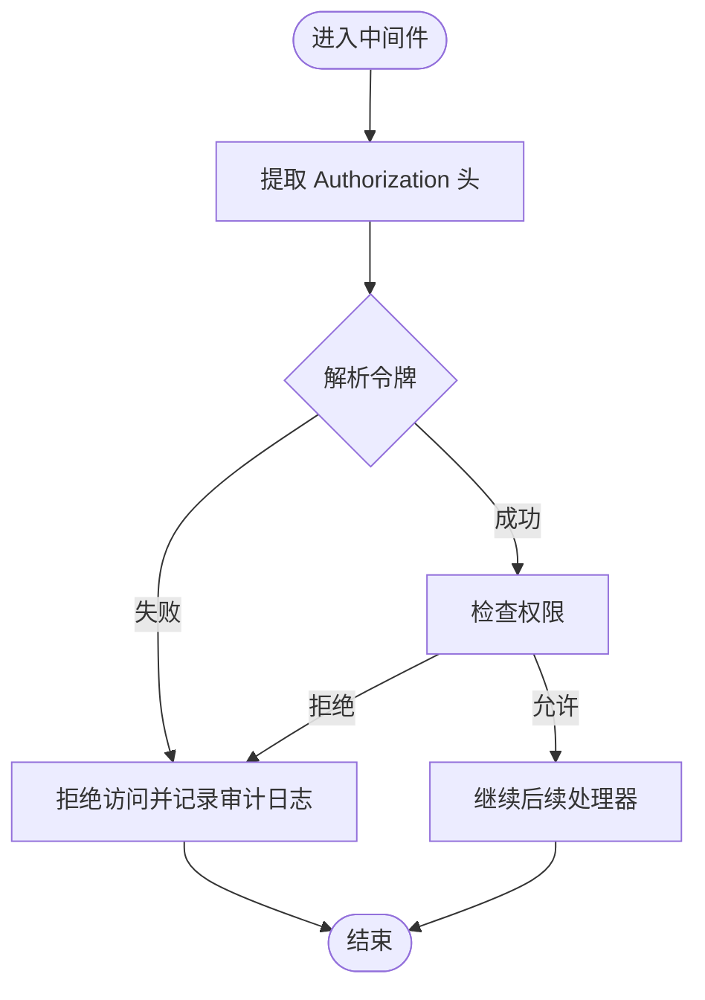
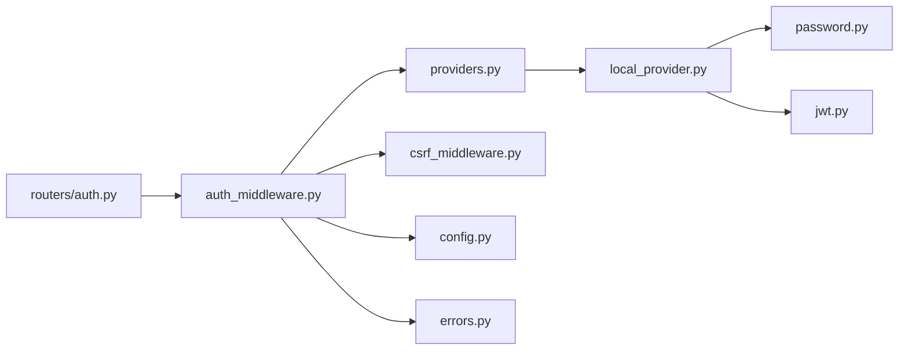

# 认证安全

<cite>
**本文引用的文件**
- [jwt.py](file://backend/app/gateway/auth/jwt.py)
- [password.py](file://backend/app/gateway/auth/password.py)
- [providers.py](file://backend/app/gateway/auth/providers.py)
- [local_provider.py](file://backend/app/gateway/auth/local_provider.py)
- [models.py](file://backend/app/gateway/auth/models.py)
- [errors.py](file://backend/app/gateway/auth/errors.py)
- [auth_middleware.py](file://backend/app/gateway/auth_middleware.py)
- [auth.py](file://backend/app/gateway/routers/auth.py)
- [config.py](file://backend/app/gateway/config.py)
- [auth_disabled.py](file://backend/app/gateway/auth_disabled.py)
- [csrf_middleware.py](file://backend/app/gateway/csrf_middleware.py)
- [AUTH_DESIGN.md](file://backend/docs/AUTH_DESIGN.md)
- [AUTH_TEST_DOCKER_GAP.md](file://backend/docs/AUTH_TEST_DOCKER_GAP.md)
- [AUTH_UPGRADE.md](file://backend/docs/AUTH_UPGRADE.md)
- [CONFIGURATION.md](file://backend/docs/CONFIGURATION.md)
- [middleware-execution-flow.md](file://backend/docs/middleware-execution-flow.md)
- [test_auth.py](file://backend/tests/test_auth.py)
- [test_auth_middleware.py](file://backend/tests/test_auth_middleware.py)
- [test_auth_errors.py](file://backend/tests/test_auth_errors.py)
- [test_auth_config.py](file://backend/tests/test_auth_config.py)
- [test_internal_auth.py](file://backend/tests/test_internal_auth.py)
- [test_langgraph_auth.py](file://backend/tests/test_langgraph_auth.py)
- [test_cli_auth_providers.py](file://backend/tests/test_cli_auth_providers.py)
</cite>

## 目录
1. [引言](#引言)
2. [项目结构](#项目结构)
3. [核心组件](#核心组件)
4. [架构总览](#架构总览)
5. [详细组件分析](#详细组件分析)
6. [依赖关系分析](#依赖关系分析)
7. [性能考虑](#性能考虑)
8. [故障排除指南](#故障排除指南)
9. [结论](#结论)
10. [附录](#附录)

## 引言
本文件系统性梳理 DeerFlow 的认证与授权安全设计与实现，覆盖以下主题：
- JWT 令牌管理：签发、解析、刷新与吊销策略
- 密码加密存储：哈希算法、盐值与安全强度
- 认证提供程序配置：本地提供程序与外部集成
- 多因素认证支持：当前能力与扩展建议
- 会话管理与令牌刷新机制：生命周期与安全边界
- 认证中间件安全配置：请求拦截、CSRF 防护与审计
- 错误处理与安全审计日志：异常分类与记录规范
- 认证攻击防护：常见威胁与缓解措施
- 令牌泄露检测与安全最佳实践
- 认证配置示例与故障排除指南

## 项目结构
后端认证相关代码主要集中在网关层的认证子系统，包括：
- 认证模型与数据结构
- 提供程序抽象与本地实现
- JWT 工具与密码工具
- 路由器与中间件
- 配置与禁用开关
- 文档与测试

**图表来源**
- [models.py:1-200](file://backend/app/gateway/auth/models.py#L1-L200)
- [providers.py:1-200](file://backend/app/gateway/auth/providers.py#L1-L200)
- [local_provider.py:1-200](file://backend/app/gateway/auth/local_provider.py#L1-L200)
- [jwt.py:1-200](file://backend/app/gateway/auth/jwt.py#L1-L200)
- [password.py:1-200](file://backend/app/gateway/auth/password.py#L1-L200)
- [errors.py:1-200](file://backend/app/gateway/auth/errors.py#L1-L200)
- [auth_middleware.py:1-200](file://backend/app/gateway/auth_middleware.py#L1-L200)
- [csrf_middleware.py:1-200](file://backend/app/gateway/csrf_middleware.py#L1-L200)
- [config.py:1-200](file://backend/app/gateway/config.py#L1-L200)
- [auth_disabled.py:1-200](file://backend/app/gateway/auth_disabled.py#L1-L200)
- [auth.py:1-200](file://backend/app/gateway/routers/auth.py#L1-L200)

**章节来源**
- [AUTH_DESIGN.md:1-200](file://backend/docs/AUTH_DESIGN.md#L1-L200)
- [CONFIGURATION.md:1-200](file://backend/docs/CONFIGURATION.md#L1-L200)

## 核心组件
- 认证模型与数据结构：定义用户实体、角色与权限、会话与令牌等核心数据模型，确保最小暴露与强约束。
- 认证提供程序：抽象认证流程（登录、登出、刷新、校验），支持本地与外部提供程序扩展。
- 本地提供程序：基于用户名/密码的登录流程，结合密码哈希与 JWT 签发。
- JWT 工具：令牌签发、解析、验证与刷新，包含过期时间、签名算法与黑名单机制。
- 密码工具：使用安全的哈希算法与盐值，禁止明文存储与弱口令。
- 认证中间件：统一拦截请求，执行认证与授权检查，注入用户上下文。
- CSRF 中间件：跨站请求伪造防护，配合同源策略与令牌校验。
- 配置与禁用：集中式认证配置与开发环境禁用开关。

**章节来源**
- [models.py:1-200](file://backend/app/gateway/auth/models.py#L1-L200)
- [providers.py:1-200](file://backend/app/gateway/auth/providers.py#L1-L200)
- [local_provider.py:1-200](file://backend/app/gateway/auth/local_provider.py#L1-L200)
- [jwt.py:1-200](file://backend/app/gateway/auth/jwt.py#L1-L200)
- [password.py:1-200](file://backend/app/gateway/auth/password.py#L1-L200)
- [auth_middleware.py:1-200](file://backend/app/gateway/auth_middleware.py#L1-L200)
- [csrf_middleware.py:1-200](file://backend/app/gateway/csrf_middleware.py#L1-L200)
- [config.py:1-200](file://backend/app/gateway/config.py#L1-L200)
- [auth_disabled.py:1-200](file://backend/app/gateway/auth_disabled.py#L1-L200)

## 架构总览
下图展示认证从路由到中间件、提供程序与存储的整体交互：

**图表来源**
- [auth.py:1-200](file://backend/app/gateway/routers/auth.py#L1-L200)
- [auth_middleware.py:1-200](file://backend/app/gateway/auth_middleware.py#L1-L200)
- [providers.py:1-200](file://backend/app/gateway/auth/providers.py#L1-L200)
- [local_provider.py:1-200](file://backend/app/gateway/auth/local_provider.py#L1-L200)
- [password.py:1-200](file://backend/app/gateway/auth/password.py#L1-L200)
- [jwt.py:1-200](file://backend/app/gateway/auth/jwt.py#L1-L200)
- [config.py:1-200](file://backend/app/gateway/config.py#L1-L200)

## 详细组件分析

### JWT 令牌管理
- 令牌签发：包含用户标识、角色、过期时间与签名算法；支持刷新令牌与短期访问令牌分离。
- 令牌解析：验证签名、过期时间与声明一致性；拒绝无效或篡改令牌。
- 刷新机制：通过刷新令牌换取新的访问令牌，同时撤销旧令牌以降低泄露风险。
- 黑名单与吊销：维护已吊销令牌列表，防止被重复使用。
- 安全属性：设置安全标志、HttpOnly、SameSite 等响应头，减少 XSS 与 CSRF 影响面。

**图表来源**
- [password.py:1-200](file://backend/app/gateway/auth/password.py#L1-L200)
- [jwt.py:1-200](file://backend/app/gateway/auth/jwt.py#L1-L200)

**章节来源**
- [jwt.py:1-200](file://backend/app/gateway/auth/jwt.py#L1-L200)
- [password.py:1-200](file://backend/app/gateway/auth/password.py#L1-L200)

### 密码加密存储
- 哈希算法：采用业界推荐的强哈希算法（如 Argon2、bcrypt 或 scrypt）与随机盐值。
- 存储策略：仅保存哈希值与盐值，不保留明文或可逆信息。
- 强度要求：禁止使用弱口令；对历史口令进行限制与轮换策略。
- 迁移与升级：支持新旧算法平滑迁移，保证兼容性与安全性。

**章节来源**
- [password.py:1-200](file://backend/app/gateway/auth/password.py#L1-L200)
- [models.py:1-200](file://backend/app/gateway/auth/models.py#L1-L200)

### 认证提供程序配置
- 抽象接口：定义统一的认证方法（登录、登出、刷新、校验），便于替换与扩展。
- 本地提供程序：基于用户名/密码的登录流程，结合密码哈希与 JWT 签发。
- 外部提供程序：预留 OAuth、SAML 等集成点，统一通过接口适配。
- 配置驱动：通过配置文件或环境变量启用/禁用提供程序与安全参数。

**图表来源**
- [providers.py:1-200](file://backend/app/gateway/auth/providers.py#L1-L200)
- [local_provider.py:1-200](file://backend/app/gateway/auth/local_provider.py#L1-L200)

**章节来源**
- [providers.py:1-200](file://backend/app/gateway/auth/providers.py#L1-L200)
- [local_provider.py:1-200](file://backend/app/gateway/auth/local_provider.py#L1-L200)
- [config.py:1-200](file://backend/app/gateway/config.py#L1-L200)

### 多因素认证支持
- 当前能力：仓库未发现内置的多因素认证实现。
- 扩展建议：在登录流程中引入二次验证（短信/邮件/TOTP），并在提供程序接口中增加 MFA 校验步骤；通过配置启用/禁用。

**章节来源**
- [AUTH_DESIGN.md:1-200](file://backend/docs/AUTH_DESIGN.md#L1-L200)
- [providers.py:1-200](file://backend/app/gateway/auth/providers.py#L1-L200)

### 会话管理与令牌刷新机制
- 会话生命周期：访问令牌短期有效，刷新令牌长期但受限；服务端维护会话状态与吊销清单。
- 刷新流程：客户端提交刷新令牌，服务端验证后签发新的访问令牌并可选撤销旧令牌。
- 幂等与安全：刷新接口需幂等且防重放，结合 CSRF 与速率限制。

**章节来源**
- [jwt.py:1-200](file://backend/app/gateway/auth/jwt.py#L1-L200)
- [auth_middleware.py:1-200](file://backend/app/gateway/auth_middleware.py#L1-L200)

### 认证中间件安全配置
- 请求拦截：在中间件中统一提取与验证令牌，注入用户上下文。
- 授权检查：根据用户角色与资源权限决定访问控制。
- 审计日志：记录认证事件（成功/失败、IP、UA、时间戳），支持合规与追踪。
- 错误处理：区分认证错误与业务错误，避免泄露内部细节。

**图表来源**
- [auth_middleware.py:1-200](file://backend/app/gateway/auth_middleware.py#L1-L200)
- [errors.py:1-200](file://backend/app/gateway/auth/errors.py#L1-L200)

**章节来源**
- [auth_middleware.py:1-200](file://backend/app/gateway/auth_middleware.py#L1-L200)
- [errors.py:1-200](file://backend/app/gateway/auth/errors.py#L1-L200)

### CSRF 防护与安全响应头
- CSRF 中间件：生成与校验 CSRF 令牌，防止跨站请求伪造。
- 安全响应头：设置 HttpOnly、Secure、SameSite 等，降低 XSS 与 CSRF 风险。

**章节来源**
- [csrf_middleware.py:1-200](file://backend/app/gateway/csrf_middleware.py#L1-L200)

### 认证路由与禁用模式
- 认证路由：提供登录、登出、刷新等端点，遵循 REST 风格与安全实践。
- 禁用认证：开发/测试环境可通过禁用模式跳过认证，生产环境默认开启。

**章节来源**
- [auth.py:1-200](file://backend/app/gateway/routers/auth.py#L1-L200)
- [auth_disabled.py:1-200](file://backend/app/gateway/auth_disabled.py#L1-L200)

## 依赖关系分析
认证子系统的模块耦合与职责划分如下：

**图表来源**
- [auth.py:1-200](file://backend/app/gateway/routers/auth.py#L1-L200)
- [auth_middleware.py:1-200](file://backend/app/gateway/auth_middleware.py#L1-L200)
- [providers.py:1-200](file://backend/app/gateway/auth/providers.py#L1-L200)
- [local_provider.py:1-200](file://backend/app/gateway/auth/local_provider.py#L1-L200)
- [password.py:1-200](file://backend/app/gateway/auth/password.py#L1-L200)
- [jwt.py:1-200](file://backend/app/gateway/auth/jwt.py#L1-L200)
- [csrf_middleware.py:1-200](file://backend/app/gateway/csrf_middleware.py#L1-L200)
- [config.py:1-200](file://backend/app/gateway/config.py#L1-L200)
- [errors.py:1-200](file://backend/app/gateway/auth/errors.py#L1-L200)

**章节来源**
- [AUTH_DESIGN.md:1-200](file://backend/docs/AUTH_DESIGN.md#L1-L200)
- [middleware-execution-flow.md:1-200](file://backend/docs/middleware-execution-flow.md#L1-L200)

## 性能考虑
- 密码哈希成本：合理设置哈希迭代次数，在安全与性能之间平衡。
- 令牌缓存：对频繁访问的用户令牌进行缓存，减少数据库查询。
- 中间件链优化：将轻量检查前置，复杂校验延后，避免不必要的开销。
- 日志与监控：异步写入审计日志，避免阻塞主请求路径。

## 故障排除指南
- 常见错误类型：凭证错误、令牌无效、权限不足、提供程序不可用等。
- 错误处理：在中间件中捕获认证异常，返回标准化错误码与消息。
- 测试覆盖：通过单元与集成测试验证认证流程、中间件行为与错误分支。
- 升级与回滚：参考升级文档，确保配置与数据迁移的连续性。

**章节来源**
- [errors.py:1-200](file://backend/app/gateway/auth/errors.py#L1-L200)
- [test_auth.py:1-200](file://backend/tests/test_auth.py#L1-L200)
- [test_auth_middleware.py:1-200](file://backend/tests/test_auth_middleware.py#L1-L200)
- [test_auth_errors.py:1-200](file://backend/tests/test_auth_errors.py#L1-L200)
- [AUTH_UPGRADE.md:1-200](file://backend/docs/AUTH_UPGRADE.md#L1-L200)

## 结论
DeerFlow 的认证体系以模块化设计为核心，通过提供程序抽象、JWT 工具与中间件实现统一的安全入口。密码存储采用强哈希与盐值，令牌管理涵盖签发、刷新与吊销。建议在现有基础上增强 CSRF 防护、完善审计日志与令牌泄露检测，并按需扩展多因素认证与外部提供程序集成。

## 附录

### 认证配置示例
- 启用/禁用认证：通过配置项控制认证开关与提供程序启用状态。
- JWT 参数：设置过期时间、签名算法与安全响应头。
- CSRF 设置：启用 CSRF 保护并配置令牌策略。
- 审计日志：输出格式与存储位置配置。

**章节来源**
- [CONFIGURATION.md:1-200](file://backend/docs/CONFIGURATION.md#L1-L200)
- [config.py:1-200](file://backend/app/gateway/config.py#L1-L200)

### 安全最佳实践
- 强密码策略：禁止弱口令，定期轮换。
- 最小权限原则：按角色分配权限，避免过度授权。
- 传输安全：强制 HTTPS，严格响应头配置。
- 输入验证：对所有输入进行白名单过滤与长度限制。
- 定期审计：审查认证日志与异常行为，及时发现风险。

**章节来源**
- [AUTH_DESIGN.md:1-200](file://backend/docs/AUTH_DESIGN.md#L1-L200)