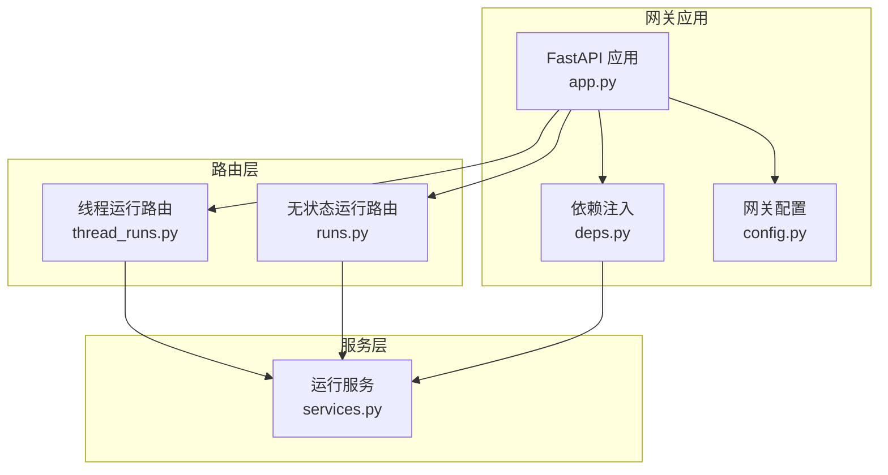
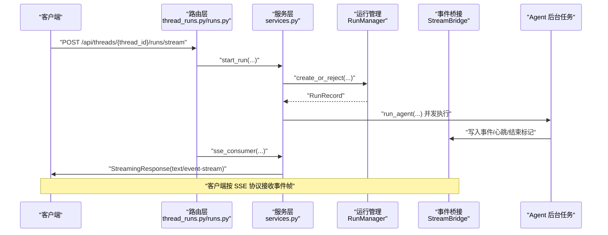
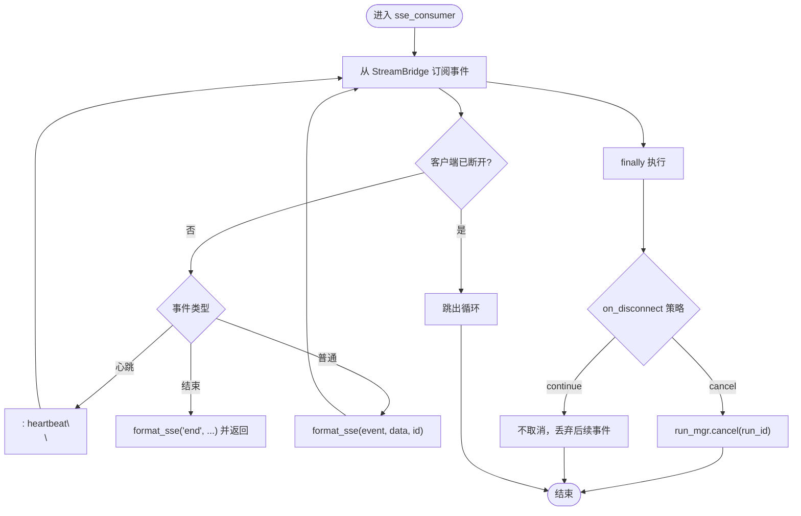
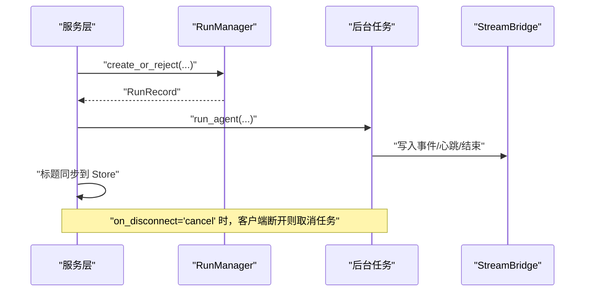
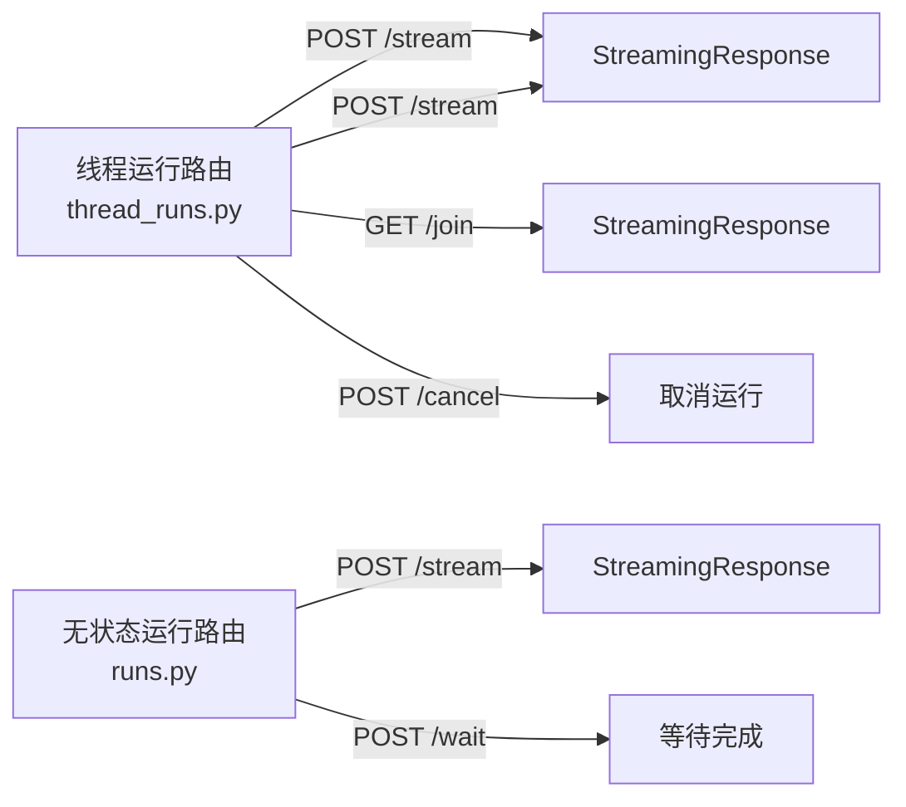
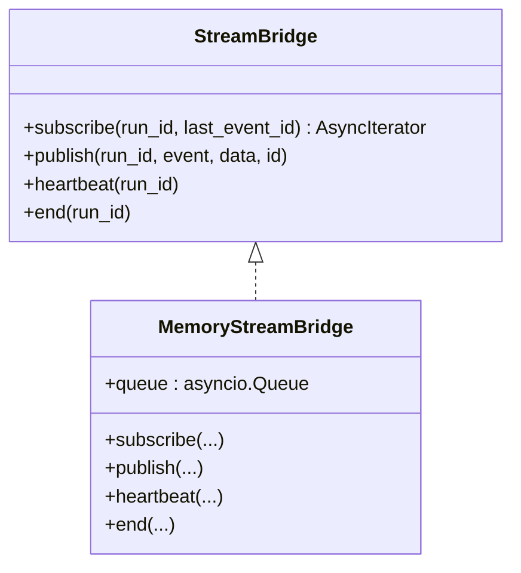
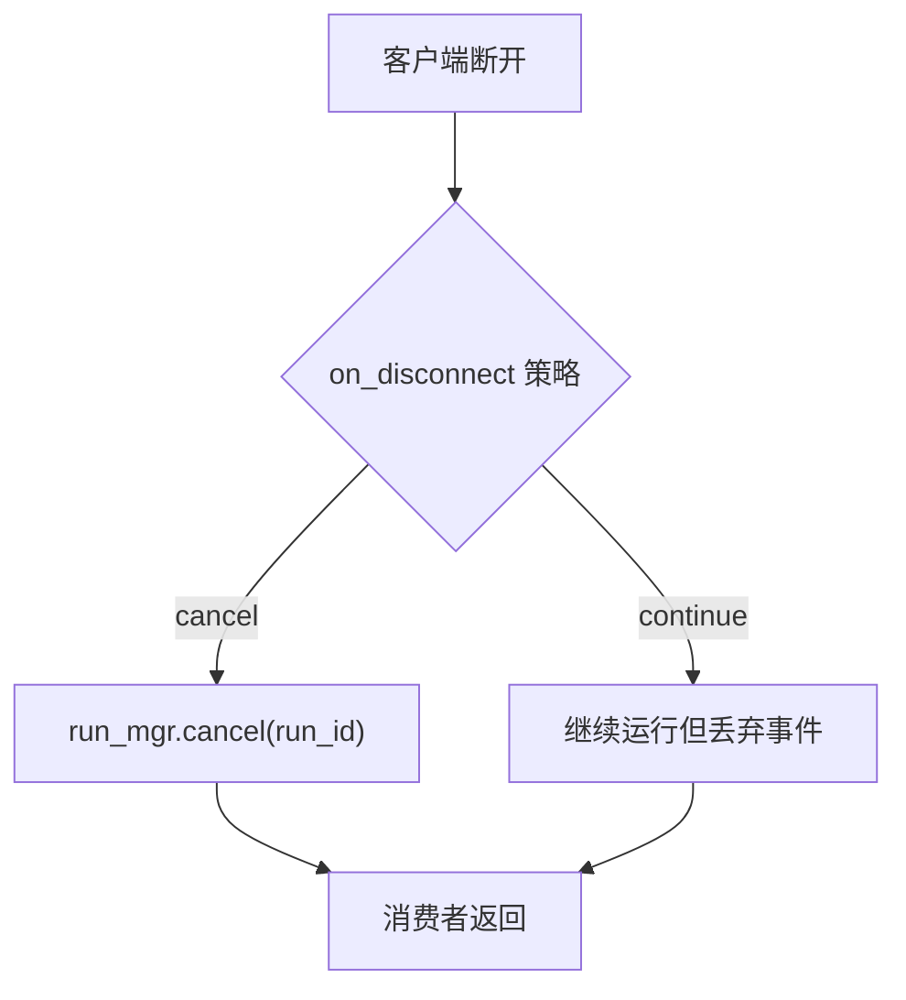
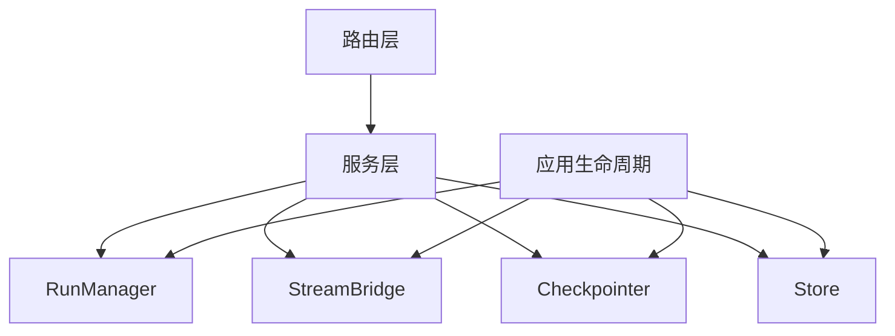

# 实时通信系统

<cite>
**本文引用的文件**
- [backend/app/gateway/app.py](file://backend/app/gateway/app.py)
- [backend/app/gateway/deps.py](file://backend/app/gateway/deps.py)
- [backend/app/gateway/services.py](file://backend/app/gateway/services.py)
- [backend/app/gateway/routers/thread_runs.py](file://backend/app/gateway/routers/thread_runs.py)
- [backend/app/gateway/routers/runs.py](file://backend/app/gateway/routers/runs.py)
- [backend/app/gateway/config.py](file://backend/app/gateway/config.py)
- [backend/docs/STREAMING.md](file://backend/docs/STREAMING.md)
</cite>

## 目录
1. [简介](#简介)
2. [项目结构](#项目结构)
3. [核心组件](#核心组件)
4. [架构总览](#架构总览)
5. [详细组件分析](#详细组件分析)
6. [依赖分析](#依赖分析)
7. [性能考量](#性能考量)
8. [故障排查指南](#故障排查指南)
9. [结论](#结论)
10. [附录](#附录)

## 简介
本技术文档围绕 DeerFlow 实时通信系统中的 Server-Sent Events（SSE）流式传输机制展开，系统性阐述事件处理流程、连接管理、消息分发与错误恢复策略，并深入解析 Stream Bridge 的设计原理与实现细节。文档同时覆盖心跳检测、超时与断线重连策略、异常捕获与状态码定义、用户反馈机制、性能优化（缓冲、带宽与延迟）、以及安全考虑与最佳实践。

## 项目结构
后端采用 FastAPI 应用作为 API 网关，路由模块负责对外暴露 runs 相关接口；服务层封装运行生命周期与 SSE 格式化；依赖注入模块在应用生命周期内初始化并提供全局单例（如 StreamBridge、RunManager、Checkpointer、Store）。网关配置支持通过环境变量进行主机、端口与 CORS 源设置。

**图表来源**
- [backend/app/gateway/app.py:91-236](file://backend/app/gateway/app.py#L91-L236)
- [backend/app/gateway/deps.py:19-71](file://backend/app/gateway/deps.py#L19-L71)
- [backend/app/gateway/config.py:6-28](file://backend/app/gateway/config.py#L6-L28)
- [backend/app/gateway/routers/thread_runs.py:27-268](file://backend/app/gateway/routers/thread_runs.py#L27-L268)
- [backend/app/gateway/routers/runs.py:23-88](file://backend/app/gateway/routers/runs.py#L23-L88)
- [backend/app/gateway/services.py:1-387](file://backend/app/gateway/services.py#L1-L387)

**章节来源**
- [backend/app/gateway/app.py:91-236](file://backend/app/gateway/app.py#L91-L236)
- [backend/app/gateway/deps.py:19-71](file://backend/app/gateway/deps.py#L19-L71)
- [backend/app/gateway/config.py:6-28](file://backend/app/gateway/config.py#L6-L28)
- [backend/app/gateway/routers/thread_runs.py:27-268](file://backend/app/gateway/routers/thread_runs.py#L27-L268)
- [backend/app/gateway/routers/runs.py:23-88](file://backend/app/gateway/routers/runs.py#L23-L88)
- [backend/app/gateway/services.py:1-387](file://backend/app/gateway/services.py#L1-L387)

## 核心组件
- StreamBridge：位于 deerflow.runtime 包中，作为生产者（后台 Agent 任务）与消费者（客户端 SSE 连接）之间的解耦桥接器，默认内存实现基于 asyncio.Queue。其订阅接口用于异步消费事件，支持心跳与结束标记。
- RunManager：运行生命周期管理器，负责创建、查询、取消运行，以及并发策略（拒绝、回滚、中断、入队）。
- Checkpointer：检查点存储，用于读取最终状态或从检查点恢复。
- Store：线程元数据持久化，用于同步标题等信息。
- SSE 格式化与消费者：服务层提供格式化函数与异步消费者，将事件序列化为标准 SSE 帧，并处理 Last-Event-ID、心跳与结束信号。

**章节来源**
- [backend/app/gateway/services.py:21-33](file://backend/app/gateway/services.py#L21-L33)
- [backend/app/gateway/services.py:355-387](file://backend/app/gateway/services.py#L355-L387)
- [backend/app/gateway/deps.py:28-36](file://backend/app/gateway/deps.py#L28-L36)

## 架构总览
下图展示了从请求到事件流的端到端交互：客户端发起创建运行并开始流式订阅；服务层启动后台任务并将事件写入 StreamBridge；路由层以 StreamingResponse 返回 text/event-stream；客户端按 SSE 协议接收事件帧。

**图表来源**
- [backend/app/gateway/routers/thread_runs.py:101-125](file://backend/app/gateway/routers/thread_runs.py#L101-L125)
- [backend/app/gateway/routers/runs.py:34-56](file://backend/app/gateway/routers/runs.py#L34-L56)
- [backend/app/gateway/services.py:256-352](file://backend/app/gateway/services.py#L256-L352)
- [backend/app/gateway/services.py:355-387](file://backend/app/gateway/services.py#L355-L387)

## 详细组件分析

### SSE 事件格式与消费者
- 事件格式：服务层提供格式化函数，输出包含 event、data、可选 id 的标准 SSE 帧，末尾包含空行分隔符，符合 LangGraph 平台协议。
- 心跳与结束：当订阅到心跳标记时，消费者发送“心跳”帧；遇到结束标记时，发送“end”事件并终止流。
- 断开处理：消费者在 finally 中根据 on_disconnect 策略决定是否取消后台任务；若客户端断开，消费者循环提前退出。

**图表来源**
- [backend/app/gateway/services.py:355-387](file://backend/app/gateway/services.py#L355-L387)

**章节来源**
- [backend/app/gateway/services.py:43-57](file://backend/app/gateway/services.py#L43-L57)
- [backend/app/gateway/services.py:355-387](file://backend/app/gateway/services.py#L355-L387)

### 运行生命周期与断线策略
- 创建运行：服务层调用 RunManager 创建或拒绝并发冲突的运行，支持多种并发策略；同时合并上下文配置与输入。
- 后台任务：使用 asyncio.create_task 启动 Agent 执行，将事件写入 StreamBridge；完成后触发标题同步至 Store。
- 断线策略：on_disconnect 支持“取消”和“继续”，分别对应终止后台任务或允许其继续运行但丢弃事件。

**图表来源**
- [backend/app/gateway/services.py:256-352](file://backend/app/gateway/services.py#L256-L352)

**章节来源**
- [backend/app/gateway/services.py:256-352](file://backend/app/gateway/services.py#L256-L352)

### 路由与 SSE 流端点
- 线程运行路由：提供创建运行、流式订阅、等待完成、取消、加入现有运行等端点；流式响应设置缓存控制、连接保持与反向代理缓冲禁用头。
- 无状态运行路由：自动为临时线程生成 thread_id 或复用传入 thread_id，其余行为与线程运行路由一致。

**图表来源**
- [backend/app/gateway/routers/thread_runs.py:94-268](file://backend/app/gateway/routers/thread_runs.py#L94-L268)
- [backend/app/gateway/routers/runs.py:34-88](file://backend/app/gateway/routers/runs.py#L34-L88)

**章节来源**
- [backend/app/gateway/routers/thread_runs.py:94-268](file://backend/app/gateway/routers/thread_runs.py#L94-L268)
- [backend/app/gateway/routers/runs.py:34-88](file://backend/app/gateway/routers/runs.py#L34-L88)

### Stream Bridge 设计与实现要点
- 解耦目标：将 Agent 后台任务与 SSE HTTP 端点解耦，避免直接耦合网络层。
- 默认实现：基于 asyncio.Queue 的内存实现，提供 subscribe 异步迭代器与事件写入能力。
- 标记语义：提供结束标记与心跳标记，便于消费者侧进行优雅收尾与保活。
- 生命周期：通过依赖注入在应用启动时初始化，随应用生命周期释放。

**图表来源**
- [backend/app/gateway/deps.py:28-36](file://backend/app/gateway/deps.py#L28-L36)
- [backend/app/gateway/services.py:21-33](file://backend/app/gateway/services.py#L21-L33)

**章节来源**
- [backend/app/gateway/deps.py:28-36](file://backend/app/gateway/deps.py#L28-L36)
- [backend/app/gateway/services.py:21-33](file://backend/app/gateway/services.py#L21-L33)

### 连接管理策略（心跳、超时、断线重连）
- 心跳检测：消费者对心跳标记输出“心跳”帧，维持长连接活跃。
- 超时处理：路由层未显式设置连接超时参数，通常由服务器/反向代理与客户端浏览器行为共同决定；消费者在 finally 中依据 on_disconnect 策略处理断开。
- 断线重连：客户端可通过 Last-Event-ID 头部指定起始事件 ID，配合 StreamBridge 的订阅能力实现断线续连。

**图表来源**
- [backend/app/gateway/services.py:383-387](file://backend/app/gateway/services.py#L383-L387)

**章节来源**
- [backend/app/gateway/services.py:367-387](file://backend/app/gateway/services.py#L367-L387)

### 错误处理机制（异常捕获、状态码、用户反馈）
- 409 冲突：并发冲突时拒绝新运行。
- 501 不支持：并发策略不受支持时返回。
- 404 未找到：运行不存在或 thread_id 不匹配。
- 409 取消不可用：运行状态不允许取消。
- 503 依赖缺失：StreamBridge/RunManager/Checkpointer 未就绪。
- 异常日志：服务层与路由层广泛使用日志记录异常堆栈，便于诊断。

**章节来源**
- [backend/app/gateway/services.py:289-292](file://backend/app/gateway/services.py#L289-L292)
- [backend/app/gateway/routers/thread_runs.py:164-205](file://backend/app/gateway/routers/thread_runs.py#L164-L205)
- [backend/app/gateway/deps.py:44-65](file://backend/app/gateway/deps.py#L44-L65)

## 依赖分析
- 组件耦合：路由层仅依赖服务层与依赖注入器；服务层依赖 RunManager、StreamBridge、Checkpointer、Store；应用生命周期负责初始化这些单例。
- 外部集成：SSE 协议与 LangGraph 平台兼容，便于前端 SDK 使用；反向代理（nginx）参与负载均衡与缓冲控制。
- 循环依赖规避：服务层对路由模块的导入采用延迟方式，避免循环导入。

**图表来源**
- [backend/app/gateway/routers/thread_runs.py:22-24](file://backend/app/gateway/routers/thread_runs.py#L22-L24)
- [backend/app/gateway/services.py:21-33](file://backend/app/gateway/services.py#L21-L33)
- [backend/app/gateway/deps.py:28-36](file://backend/app/gateway/deps.py#L28-L36)

**章节来源**
- [backend/app/gateway/routers/thread_runs.py:22-24](file://backend/app/gateway/routers/thread_runs.py#L22-L24)
- [backend/app/gateway/services.py:21-33](file://backend/app/gateway/services.py#L21-L33)
- [backend/app/gateway/deps.py:28-36](file://backend/app/gateway/deps.py#L28-L36)

## 性能考量
- 缓冲策略：路由层设置“X-Accel-Buffering: no”以禁用反向代理缓冲，确保事件即时推送；同时设置“Cache-Control: no-cache”与“Connection: keep-alive”。
- 带宽控制：通过合理选择 stream_mode 与 stream_subgraphs，减少不必要的事件传输；在高并发场景下可考虑限制并发策略或引入队列背压。
- 延迟优化：心跳帧降低连接空闲时的延迟感知；消费者及时检测断开并释放资源；后台任务与事件写入尽量非阻塞。
- 存储与检查点：标题同步与最终状态读取在后台任务完成后异步执行，避免阻塞主事件流。

**章节来源**
- [backend/app/gateway/routers/thread_runs.py:113-125](file://backend/app/gateway/routers/thread_runs.py#L113-L125)
- [backend/app/gateway/routers/runs.py:47-56](file://backend/app/gateway/routers/runs.py#L47-L56)
- [backend/app/gateway/services.py:207-254](file://backend/app/gateway/services.py#L207-L254)

## 故障排查指南
- 依赖未就绪：确认应用生命周期已正确初始化 StreamBridge/RunManager/Checkpointer；若返回 503，检查依赖注入逻辑。
- 并发冲突：根据 409 错误定位并发策略配置；必要时调整 multitask_strategy 或等待现有运行结束。
- 取消失败：检查运行状态是否允许取消；若状态不可取消，返回 409。
- 最终状态为空：等待完成后读取检查点；若仍为空，检查 Checkpointer 配置与权限。
- 客户端断开：确认 on_disconnect 策略；若选择“cancel”，后台任务会被取消；若选择“continue”，事件会继续但不再发送给断开的客户端。

**章节来源**
- [backend/app/gateway/deps.py:44-65](file://backend/app/gateway/deps.py#L44-L65)
- [backend/app/gateway/services.py:289-292](file://backend/app/gateway/services.py#L289-L292)
- [backend/app/gateway/routers/thread_runs.py:171-205](file://backend/app/gateway/routers/thread_runs.py#L171-L205)
- [backend/app/gateway/services.py:139-150](file://backend/app/gateway/services.py#L139-L150)

## 结论
DeerFlow 的实时通信系统通过 StreamBridge 将 Agent 后台任务与 SSE 端点解耦，结合 RunManager 的运行生命周期管理与服务层的 SSE 格式化与消费者逻辑，实现了稳定、可扩展的流式事件传输。心跳、断线策略与错误处理机制保障了连接的可靠性与可观测性；路由层与服务层的职责清晰，便于维护与扩展。在高并发与长连接场景下，建议结合缓冲策略、带宽控制与并发策略进行综合优化，并持续关注日志与监控指标以提升用户体验。

## 附录
- SSE 协议与 LangGraph 兼容：服务层格式化遵循平台协议，前端 SDK 可无缝对接。
- 网关配置：支持通过环境变量设置主机、端口与 CORS 源，便于部署与跨域访问。

**章节来源**
- [backend/app/gateway/services.py:43-57](file://backend/app/gateway/services.py#L43-L57)
- [backend/app/gateway/config.py:6-28](file://backend/app/gateway/config.py#L6-L28)