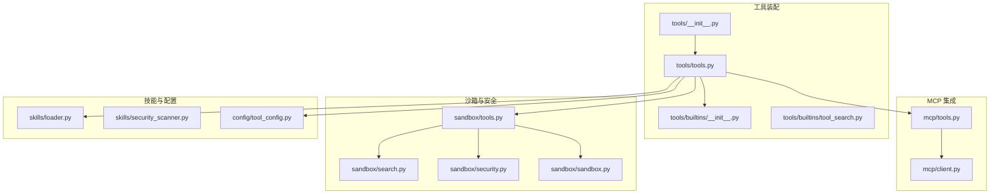
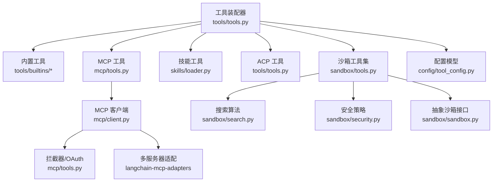
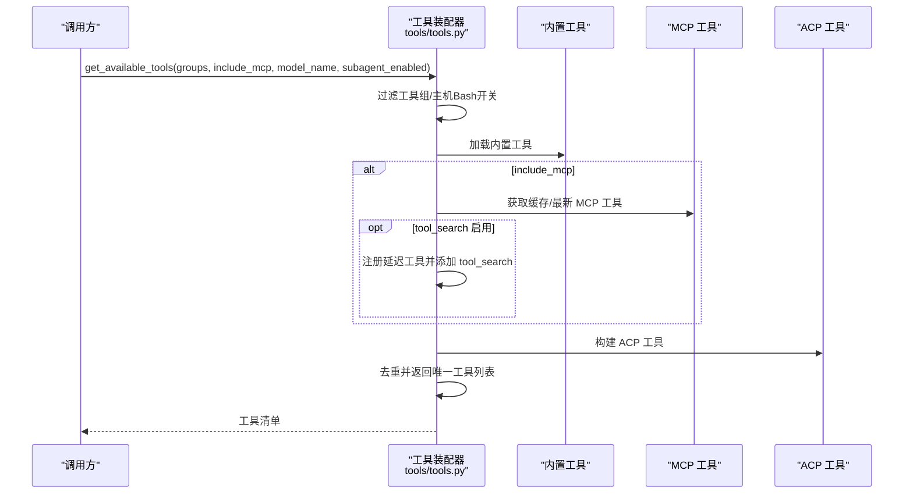
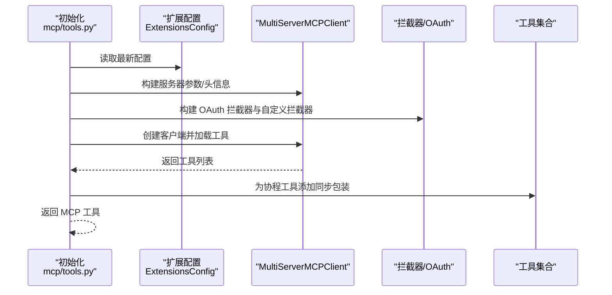
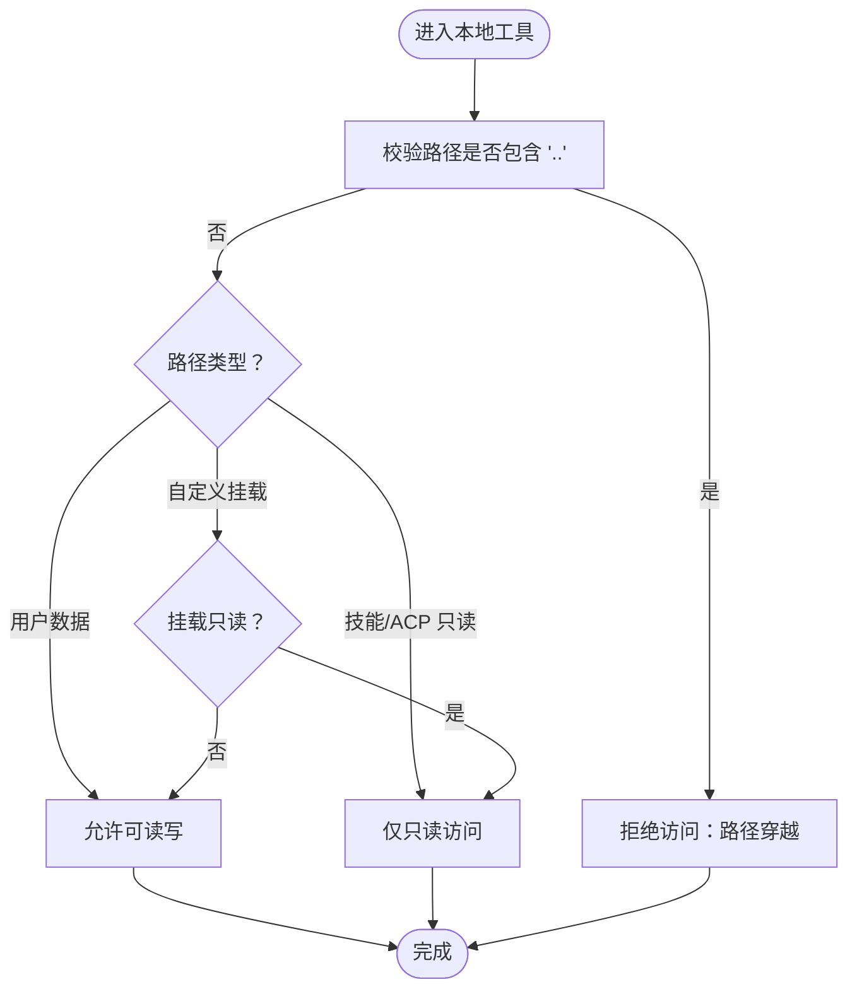
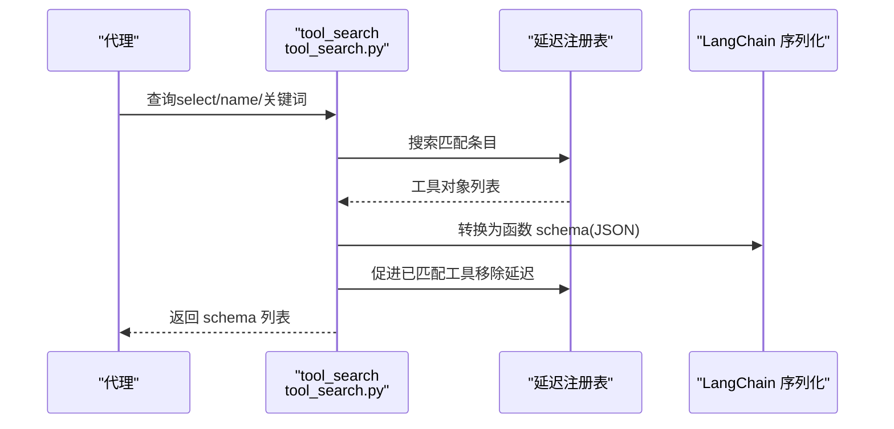
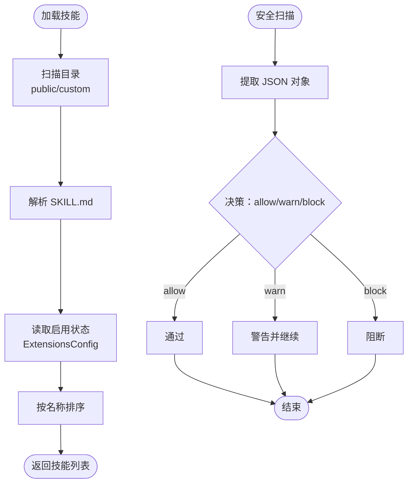
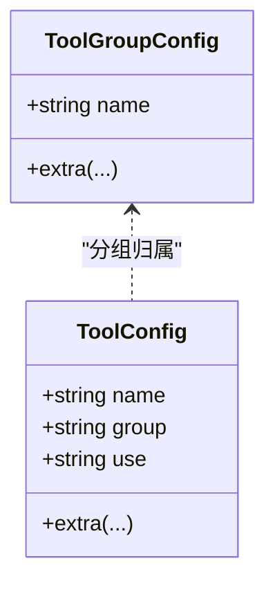
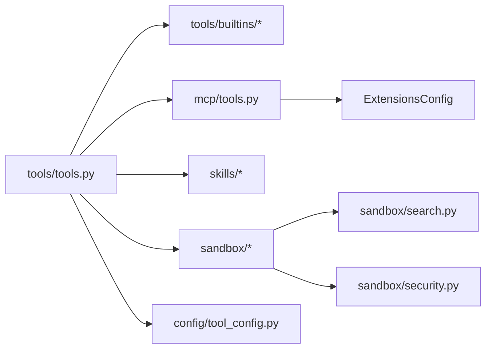

# 工具系统

<cite>
**本文引用的文件**
- [backend/packages/harness/deerflow/tools/__init__.py](file://backend/packages/harness/deerflow/tools/__init__.py)
- [backend/packages/harness/deerflow/tools/tools.py](file://backend/packages/harness/deerflow/tools/tools.py)
- [backend/packages/harness/deerflow/tools/builtins/__init__.py](file://backend/packages/harness/deerflow/tools/builtins/__init__.py)
- [backend/packages/harness/deerflow/tools/builtins/tool_search.py](file://backend/packages/harness/deerflow/tools/builtins/tool_search.py)
- [backend/packages/harness/deerflow/mcp/tools.py](file://backend/packages/harness/deerflow/mcp/tools.py)
- [backend/packages/harness/deerflow/mcp/client.py](file://backend/packages/harness/deerflow/mcp/client.py)
- [backend/packages/harness/deerflow/sandbox/tools.py](file://backend/packages/harness/deerflow/sandbox/tools.py)
- [backend/packages/harness/deerflow/sandbox/search.py](file://backend/packages/harness/deerflow/sandbox/search.py)
- [backend/packages/harness/deerflow/sandbox/security.py](file://backend/packages/harness/deerflow/sandbox/security.py)
- [backend/packages/harness/deerflow/sandbox/sandbox.py](file://backend/packages/harness/deerflow/sandbox/sandbox.py)
- [backend/packages/harness/deerflow/config/tool_config.py](file://backend/packages/harness/deerflow/config/tool_config.py)
- [backend/packages/harness/deerflow/skills/loader.py](file://backend/packages/harness/deerflow/skills/loader.py)
- [backend/packages/harness/deerflow/skills/security_scanner.py](file://backend/packages/harness/deerflow/skills/security_scanner.py)
</cite>

## 目录
1. [简介](#简介)
2. [项目结构](#项目结构)
3. [核心组件](#核心组件)
4. [架构总览](#架构总览)
5. [详细组件分析](#详细组件分析)
6. [依赖分析](#依赖分析)
7. [性能考虑](#性能考虑)
8. [故障排查指南](#故障排查指南)
9. [结论](#结论)
10. [附录](#附录)

## 简介
本文件面向 DeerFlow 工具系统，提供从架构到实现的全景式技术文档。内容覆盖：
- 工具体系与加载机制：内置工具、MCP 工具、技能工具、子代理工具的统一装配与去重策略
- 核心工具实现细节：文件操作、Bash 执行、搜索与匹配、图像查看、任务编排等
- MCP 工具集成：协议支持（stdio/sse/http）、认证拦截器、同步包装与缓存
- 安全管理：沙箱能力边界、路径访问控制、主机 Bash 访问开关、安全扫描
- 工具搜索机制：延迟注册、正则检索、结果排序与最大返回数限制
- 开发指南：接口定义、实现规范、测试方法与动态加载/配置管理

## 项目结构
工具系统主要位于后端包 deerflow 中，按功能域划分如下：
- tools：工具装配与发现入口、内置工具导出、工具搜索（延迟注册）
- mcp：MCP 客户端与工具加载、OAuth 拦截器、同步包装
- sandbox：沙箱抽象与本地工具实现、路径解析与安全校验、搜索算法
- skills：技能加载与状态管理、安全扫描
- config：工具与工具组配置模型

**图示来源**
- [backend/packages/harness/deerflow/tools/__init__.py:1-12](file://backend/packages/harness/deerflow/tools/__init__.py#L1-L12)
- [backend/packages/harness/deerflow/tools/tools.py:1-169](file://backend/packages/harness/deerflow/tools/tools.py#L1-L169)
- [backend/packages/harness/deerflow/tools/builtins/__init__.py:1-14](file://backend/packages/harness/deerflow/tools/builtins/__init__.py#L1-L14)
- [backend/packages/harness/deerflow/tools/builtins/tool_search.py:1-203](file://backend/packages/harness/deerflow/tools/builtins/tool_search.py#L1-L203)
- [backend/packages/harness/deerflow/mcp/tools.py:1-136](file://backend/packages/harness/deerflow/mcp/tools.py#L1-L136)
- [backend/packages/harness/deerflow/mcp/client.py:1-69](file://backend/packages/harness/deerflow/mcp/client.py#L1-L69)
- [backend/packages/harness/deerflow/sandbox/tools.py:1-800](file://backend/packages/harness/deerflow/sandbox/tools.py#L1-L800)
- [backend/packages/harness/deerflow/sandbox/search.py:1-211](file://backend/packages/harness/deerflow/sandbox/search.py#L1-L211)
- [backend/packages/harness/deerflow/sandbox/security.py:1-46](file://backend/packages/harness/deerflow/sandbox/security.py#L1-L46)
- [backend/packages/harness/deerflow/sandbox/sandbox.py:1-94](file://backend/packages/harness/deerflow/sandbox/sandbox.py#L1-L94)
- [backend/packages/harness/deerflow/config/tool_config.py:1-21](file://backend/packages/harness/deerflow/config/tool_config.py#L1-L21)
- [backend/packages/harness/deerflow/skills/loader.py:1-104](file://backend/packages/harness/deerflow/skills/loader.py#L1-L104)
- [backend/packages/harness/deerflow/skills/security_scanner.py:1-69](file://backend/packages/harness/deerflow/skills/security_scanner.py#L1-L69)

**章节来源**
- [backend/packages/harness/deerflow/tools/__init__.py:1-12](file://backend/packages/harness/deerflow/tools/__init__.py#L1-L12)
- [backend/packages/harness/deerflow/tools/tools.py:1-169](file://backend/packages/harness/deerflow/tools/tools.py#L1-L169)

## 核心组件
- 工具装配器：负责从配置加载工具、注入内置工具、MCP 工具与 ACP 工具，并进行名称去重与可见性过滤（如主机 Bash 的开关）
- MCP 工具加载：基于扩展配置构建多服务器客户端，注入 OAuth 头与自定义拦截器，支持同步包装
- 沙箱工具集：提供文件读写、目录遍历、glob/grep 搜索、路径解析与安全校验；屏蔽主机路径输出
- 工具搜索（延迟注册）：在工具列表中隐藏部分工具，仅暴露名称，通过 tool_search 在运行时拉取完整 schema
- 技能系统：扫描技能目录、解析元数据、应用启用状态、执行安全扫描
- 配置模型：定义工具与工具组的最小字段集，支持额外键值透传

**章节来源**
- [backend/packages/harness/deerflow/tools/tools.py:35-169](file://backend/packages/harness/deerflow/tools/tools.py#L35-L169)
- [backend/packages/harness/deerflow/mcp/tools.py:57-136](file://backend/packages/harness/deerflow/mcp/tools.py#L57-L136)
- [backend/packages/harness/deerflow/sandbox/tools.py:369-800](file://backend/packages/harness/deerflow/sandbox/tools.py#L369-L800)
- [backend/packages/harness/deerflow/tools/builtins/tool_search.py:39-203](file://backend/packages/harness/deerflow/tools/builtins/tool_search.py#L39-L203)
- [backend/packages/harness/deerflow/skills/loader.py:25-104](file://backend/packages/harness/deerflow/skills/loader.py#L25-L104)
- [backend/packages/harness/deerflow/config/tool_config.py:4-21](file://backend/packages/harness/deerflow/config/tool_config.py#L4-L21)

## 架构总览
下图展示工具系统的关键交互：工具装配器聚合各类工具源，MCP 工具通过客户端与拦截器接入，沙箱工具提供文件与命令能力，技能系统提供技能目录与安全扫描。

**图示来源**
- [backend/packages/harness/deerflow/tools/tools.py:35-169](file://backend/packages/harness/deerflow/tools/tools.py#L35-L169)
- [backend/packages/harness/deerflow/mcp/tools.py:57-136](file://backend/packages/harness/deerflow/mcp/tools.py#L57-L136)
- [backend/packages/harness/deerflow/mcp/client.py:45-69](file://backend/packages/harness/deerflow/mcp/client.py#L45-L69)
- [backend/packages/harness/deerflow/sandbox/tools.py:369-800](file://backend/packages/harness/deerflow/sandbox/tools.py#L369-L800)
- [backend/packages/harness/deerflow/sandbox/search.py:105-211](file://backend/packages/harness/deerflow/sandbox/search.py#L105-L211)
- [backend/packages/harness/deerflow/sandbox/security.py:23-46](file://backend/packages/harness/deerflow/sandbox/security.py#L23-L46)
- [backend/packages/harness/deerflow/sandbox/sandbox.py:6-94](file://backend/packages/harness/deerflow/sandbox/sandbox.py#L6-L94)
- [backend/packages/harness/deerflow/config/tool_config.py:4-21](file://backend/packages/harness/deerflow/config/tool_config.py#L4-L21)

## 详细组件分析

### 组件A：工具装配与去重
- 职责：根据配置筛选工具组、解析工具类、注入内置与 MCP 工具、按模型能力注入视图工具、按运行时参数注入子代理工具、合并并去重同名工具
- 关键点：
  - 主机 Bash 默认不暴露，除非显式允许
  - 去重策略：优先保留配置加载的工具，其次内置，再 MCP，最后 ACP
  - 工具名称不一致会发出警告，避免绑定错误
- 典型调用链：装配器 → 解析工具类 → 注入内置/ACP/MCP → 去重

**图示来源**
- [backend/packages/harness/deerflow/tools/tools.py:35-169](file://backend/packages/harness/deerflow/tools/tools.py#L35-L169)

**章节来源**
- [backend/packages/harness/deerflow/tools/tools.py:35-169](file://backend/packages/harness/deerflow/tools/tools.py#L35-L169)

### 组件B：MCP 工具集成
- 协议支持：stdio（命令行）、sse/http（远程服务），参数校验与错误日志
- 认证处理：初始化阶段注入 OAuth 头，支持自定义拦截器（通过扩展配置声明）
- 错误管理：导入失败与异常捕获，降级为空列表
- 同步包装：在异步环境中为工具协程提供同步包装，避免嵌套事件循环问题
- 缓存与刷新：优先使用缓存 MCP 工具，确保网关 API 修改即时生效

**图示来源**
- [backend/packages/harness/deerflow/mcp/tools.py:57-136](file://backend/packages/harness/deerflow/mcp/tools.py#L57-L136)
- [backend/packages/harness/deerflow/mcp/client.py:45-69](file://backend/packages/harness/deerflow/mcp/client.py#L45-L69)

**章节来源**
- [backend/packages/harness/deerflow/mcp/tools.py:57-136](file://backend/packages/harness/deerflow/mcp/tools.py#L57-L136)
- [backend/packages/harness/deerflow/mcp/client.py:11-69](file://backend/packages/harness/deerflow/mcp/client.py#L11-L69)

### 组件C：沙箱工具与安全
- 路径解析与访问控制：
  - 支持虚拟路径映射（用户数据、技能、ACP 工作区）
  - 严格拒绝路径穿越，区分只读挂载与自定义挂载
  - 输出掩码：将宿主绝对路径替换为虚拟路径，避免泄露
- Bash 安全：
  - 本地沙箱默认禁止主机 Bash，除非显式允许
  - 提供禁用提示与切换建议
- 文件操作与搜索：
  - 读写/列出/更新文件
  - glob 匹配与 grep 搜索（忽略模式、二进制检测、大小限制、超长行防护）

**图示来源**
- [backend/packages/harness/deerflow/sandbox/tools.py:584-636](file://backend/packages/harness/deerflow/sandbox/tools.py#L584-L636)

**章节来源**
- [backend/packages/harness/deerflow/sandbox/tools.py:369-800](file://backend/packages/harness/deerflow/sandbox/tools.py#L369-L800)
- [backend/packages/harness/deerflow/sandbox/security.py:1-46](file://backend/packages/harness/deerflow/sandbox/security.py#L1-L46)
- [backend/packages/harness/deerflow/sandbox/search.py:105-211](file://backend/packages/harness/deerflow/sandbox/search.py#L105-L211)
- [backend/packages/harness/deerflow/sandbox/sandbox.py:6-94](file://backend/packages/harness/deerflow/sandbox/sandbox.py#L6-L94)

### 组件D：工具搜索（延迟注册）
- 设计目标：在系统提示中仅暴露“可用但未完全定义”的工具名，减少 schema 泄露，提升安全性
- 实现要点：
  - DeferredToolRegistry：轻量条目（名称/描述/工具对象）存储
  - tool_search：根据查询（精确选择、关键词、正则）返回最多 MAX_RESULTS 个工具的 OpenAI 函数 schema
  - 上下文变量：每个请求独立的注册表，避免并发污染
  - 促进机制：返回工具 schema 后从延迟注册表移除，后续可直接绑定

**图示来源**
- [backend/packages/harness/deerflow/tools/builtins/tool_search.py:69-203](file://backend/packages/harness/deerflow/tools/builtins/tool_search.py#L69-L203)

**章节来源**
- [backend/packages/harness/deerflow/tools/builtins/tool_search.py:1-203](file://backend/packages/harness/deerflow/tools/builtins/tool_search.py#L1-L203)

### 组件E：技能系统与安全扫描
- 技能加载：扫描公共与自定义目录，解析 SKILL.md，应用启用状态，按名称排序
- 安全扫描：对即将写入磁盘的技能内容进行 JSON 结构提取与分类（allow/warn/block），必要时回退保守策略

**图示来源**
- [backend/packages/harness/deerflow/skills/loader.py:25-104](file://backend/packages/harness/deerflow/skills/loader.py#L25-L104)
- [backend/packages/harness/deerflow/skills/security_scanner.py:38-69](file://backend/packages/harness/deerflow/skills/security_scanner.py#L38-L69)

**章节来源**
- [backend/packages/harness/deerflow/skills/loader.py:1-104](file://backend/packages/harness/deerflow/skills/loader.py#L1-L104)
- [backend/packages/harness/deerflow/skills/security_scanner.py:1-69](file://backend/packages/harness/deerflow/skills/security_scanner.py#L1-L69)

### 组件F：配置模型与动态加载
- 工具配置模型：工具组与工具的最小字段定义，支持额外键值透传
- 动态加载：通过反射解析 use 字段定位工具构造器，支持运行时参数（如模型名、线程数据）

**图示来源**
- [backend/packages/harness/deerflow/config/tool_config.py:4-21](file://backend/packages/harness/deerflow/config/tool_config.py#L4-L21)

**章节来源**
- [backend/packages/harness/deerflow/config/tool_config.py:1-21](file://backend/packages/harness/deerflow/config/tool_config.py#L1-L21)
- [backend/packages/harness/deerflow/tools/tools.py:62-76](file://backend/packages/harness/deerflow/tools/tools.py#L62-L76)

## 依赖分析
- 组件内聚与耦合：
  - 工具装配器对内置、MCP、技能、ACP 四类工具源有统一入口，降低上层复杂度
  - MCP 工具加载依赖扩展配置与拦截器，耦合于外部适配库
  - 沙箱工具对路径解析与安全策略高度内聚，对外暴露有限 API
- 外部依赖：
  - langchain-mcp-adapters：MCP 工具加载与序列化
  - langchain.tools/BaseTool：工具基类与装饰器
  - pydantic：配置模型验证
- 循环依赖：未见明显循环；各模块职责清晰，通过配置与反射解耦

**图示来源**
- [backend/packages/harness/deerflow/tools/tools.py:1-169](file://backend/packages/harness/deerflow/tools/tools.py#L1-L169)
- [backend/packages/harness/deerflow/mcp/tools.py:1-136](file://backend/packages/harness/deerflow/mcp/tools.py#L1-L136)
- [backend/packages/harness/deerflow/sandbox/tools.py:1-800](file://backend/packages/harness/deerflow/sandbox/tools.py#L1-L800)
- [backend/packages/harness/deerflow/sandbox/search.py:1-211](file://backend/packages/harness/deerflow/sandbox/search.py#L1-L211)
- [backend/packages/harness/deerflow/sandbox/security.py:1-46](file://backend/packages/harness/deerflow/sandbox/security.py#L1-L46)
- [backend/packages/harness/deerflow/config/tool_config.py:1-21](file://backend/packages/harness/deerflow/config/tool_config.py#L1-L21)

**章节来源**
- [backend/packages/harness/deerflow/tools/tools.py:1-169](file://backend/packages/harness/deerflow/tools/tools.py#L1-L169)
- [backend/packages/harness/deerflow/mcp/tools.py:1-136](file://backend/packages/harness/deerflow/mcp/tools.py#L1-L136)
- [backend/packages/harness/deerflow/sandbox/tools.py:1-800](file://backend/packages/harness/deerflow/sandbox/tools.py#L1-L800)

## 性能考虑
- 工具装配：
  - 去重与名称一致性检查避免重复 schema，减少 LLM 绑定开销
  - MCP 工具优先使用缓存，避免频繁连接与发现
- 沙箱搜索：
  - glob/grep 使用最大结果数与文件大小限制，防止大规模遍历
  - 忽略模式与二进制检测减少无效 IO
  - 正则搜索带评分与上限，避免过度计算
- 并发与同步：
  - MCP 同步包装使用全局线程池，避免嵌套事件循环导致的阻塞

[本节为通用指导，无需特定文件引用]

## 故障排查指南
- MCP 工具不可用：
  - 检查扩展配置中的服务器启用状态与传输类型（stdio/sse/http）
  - 确认命令/URL/参数完整且可访问
  - 查看初始化日志中的导入与异常信息
- 工具名称冲突：
  - 关注装配器日志中的名称不一致警告，修正配置或工具实现
- 沙箱访问被拒：
  - 检查路径是否包含 “..” 或越界
  - 确认挂载只读设置与工具组别
  - 若使用本地沙箱，确认主机 Bash 是否允许
- 工具搜索无结果：
  - 确认 tool_search 已注册并处于激活状态
  - 使用正确的查询格式（select/name/关键词）
  - 检查延迟注册表是否为空

**章节来源**
- [backend/packages/harness/deerflow/mcp/tools.py:133-136](file://backend/packages/harness/deerflow/mcp/tools.py#L133-L136)
- [backend/packages/harness/deerflow/tools/tools.py:68-76](file://backend/packages/harness/deerflow/tools/tools.py#L68-L76)
- [backend/packages/harness/deerflow/sandbox/tools.py:575-636](file://backend/packages/harness/deerflow/sandbox/tools.py#L575-L636)
- [backend/packages/harness/deerflow/sandbox/security.py:10-20](file://backend/packages/harness/deerflow/sandbox/security.py#L10-L20)
- [backend/packages/harness/deerflow/tools/builtins/tool_search.py:164-203](file://backend/packages/harness/deerflow/tools/builtins/tool_search.py#L164-L203)

## 结论
DeerFlow 工具系统以“统一装配 + 分层安全 + 动态发现”为核心设计，既保证了工具生态的开放性（MCP/技能/ACP），又通过沙箱与安全策略确保运行时边界可控。延迟工具搜索进一步提升了安全性与可维护性。建议在生产环境启用 MCP 缓存、严格控制主机 Bash 访问，并完善工具命名一致性与拦截器配置。

[本节为总结性内容，无需特定文件引用]

## 附录
- 开发指南（概要）：
  - 接口定义：遵循 BaseTool 规范，提供 name/description/schema
  - 实现规范：使用装饰器工具化，避免直接抛出敏感异常；必要时使用输出掩码
  - 测试方法：单元测试覆盖工具装配、MCP 客户端、沙箱路径校验、搜索算法与安全扫描
  - 动态加载：通过配置 use 字段与反射解析，支持运行时参数注入
- 配置管理：
  - 工具与工具组模型最小化，额外键值透传用于具体工具实现
  - 扩展配置支持热更新，MCP 工具与技能加载均采用“从文件读取最新配置”的策略

[本节为通用指导，无需特定文件引用]