# CI/CD流程

<cite>
**本文档引用的文件**
- [CONTRIBUTING.md](file://CONTRIBUTING.md)
- [pull_request_template.md](file://.github/pull_request_template.md)
- [labels.yml](file://.github/labels.yml)
- [copilot-instructions.md](file://.github/copilot-instructions.md)
- [container.yaml](file://.github/workflows/container.yaml)
- [backend-unit-tests.yml](file://.github/workflows/backend-unit-tests.yml)
- [frontend-unit-tests.yml](file://.github/workflows/frontend-unit-tests.yml)
- [e2e-tests.yml](file://.github/workflows/e2e-tests.yml)
- [backend/pyproject.toml](file://backend/pyproject.toml)
- [frontend/package.json](file://frontend/package.json)
- [frontend/playwright.config.ts](file://frontend/playwright.config.ts)
- [frontend/vitest.config.ts](file://frontend/vitest.config.ts)
- [backend/Dockerfile](file://backend/Dockerfile)
- [frontend/Dockerfile](file://frontend/Dockerfile)
- [docker/docker-compose.yaml](file://docker/docker-compose.yaml)
- [docker/dev-entrypoint.sh](file://docker/dev-entrypoint.sh)
- [scripts/deploy.sh](file://scripts/deploy.sh)
- [scripts/check.sh](file://scripts/check.sh)
- [scripts/wait-for-port.sh](file://scripts/wait-for-port.sh)
- [frontend/src/components/workspace/artifacts/index.ts](file://frontend/src/components/workspace/artifacts/index.ts)
</cite>

## 目录
1. [简介](#简介)
2. [项目结构](#项目结构)
3. [核心组件](#核心组件)
4. [架构概览](#架构概览)
5. [详细组件分析](#详细组件分析)
6. [依赖关系分析](#依赖关系分析)
7. [性能考虑](#性能考虑)
8. [故障排除指南](#故障排除指南)
9. [结论](#结论)
10. [附录](#附录)

## 简介

本文件详细说明了DeerFlow项目的CI/CD流程和自动化部署机制。该系统基于GitHub Actions构建，实现了完整的持续集成和持续部署流水线，包括PR触发的各种CI任务（后端单元测试、前端单元测试和E2E测试）、代码审查流程、质量门禁和合并要求。

DeerFlow是一个基于LangGraph和LangChain的超级代理框架，提供了完整的代理能力：文件系统、内存、技能、沙箱感知执行，以及规划和生成子代理的能力。该项目采用现代化的开发实践，通过自动化工具确保代码质量和部署可靠性。

## 项目结构

项目采用多模块架构，包含后端Python服务、前端React应用、容器化部署配置和完整的CI/CD流水线：

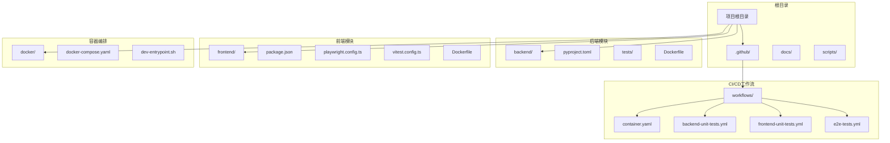

**图表来源**
- [CONTRIBUTING.md:322-326](file://CONTRIBUTING.md#L322-L326)
- [backend/pyproject.toml](file://backend/pyproject.toml)
- [frontend/package.json](file://frontend/package.json)

**章节来源**
- [CONTRIBUTING.md:322-326](file://CONTRIBUTING.md#L322-L326)
- [docker/docker-compose.yaml](file://docker/docker-compose.yaml)

## 核心组件

### GitHub Actions工作流

项目实现了三个核心的GitHub Actions工作流，每个都针对特定的测试类型和部署场景：

1. **容器构建工作流**：负责构建和推送后端与前端容器镜像
2. **后端单元测试工作流**：执行Python后端的完整测试套件
3. **前端测试工作流**：包括单元测试和E2E测试
4. **E2E测试工作流**：专门处理前端端到端测试

### 质量门禁系统

系统集成了多层次的质量检查机制：
- 代码覆盖率要求
- 静态代码分析
- 安全扫描
- 性能基准测试
- 自动化测试通过率

### 自动化部署管道

支持多种部署模式：
- Docker容器化部署
- 本地环境部署
- 云平台集成部署
- 回滚机制

**章节来源**
- [container.yaml:49-65](file://.github/workflows/container.yaml#L49-L65)
- [CONTRIBUTING.md:322-326](file://CONTRIBUTING.md#L322-L326)

## 架构概览

整个CI/CD系统采用流水线式架构，从代码提交到生产部署形成完整的自动化链路：

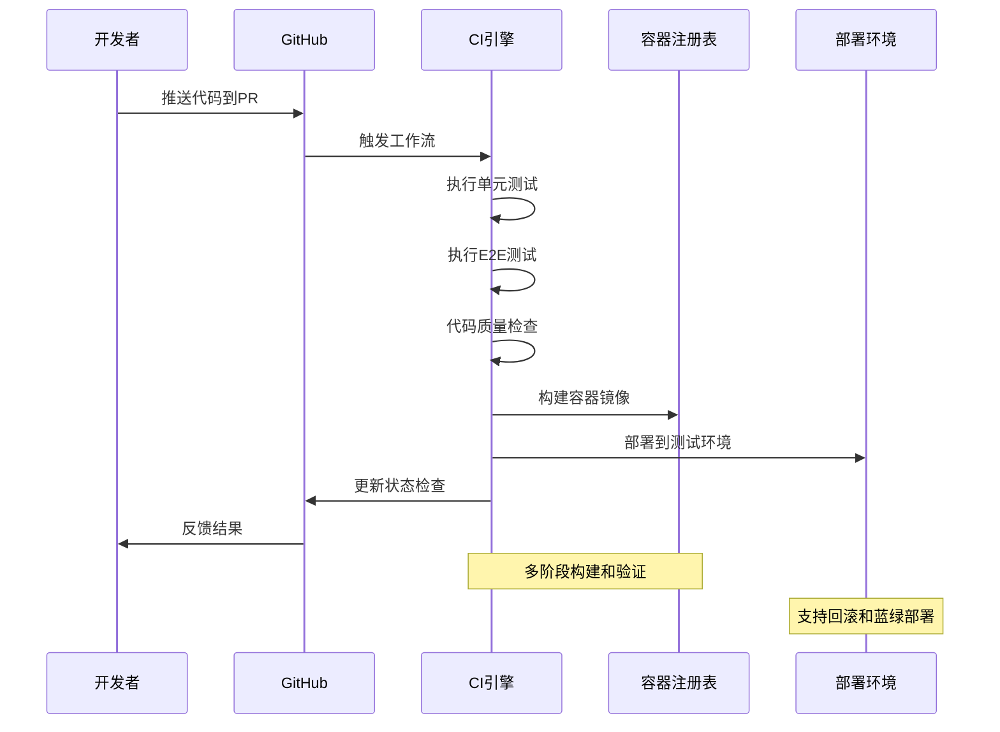

**图表来源**
- [container.yaml:56-80](file://.github/workflows/container.yaml#L56-L80)
- [backend-unit-tests.yml](file://.github/workflows/backend-unit-tests.yml)
- [e2e-tests.yml](file://.github/workflows/e2e-tests.yml)

## 详细组件分析

### PR触发的CI任务

#### 后端单元测试流程

后端测试工作流针对Python后端进行全面的质量检查：

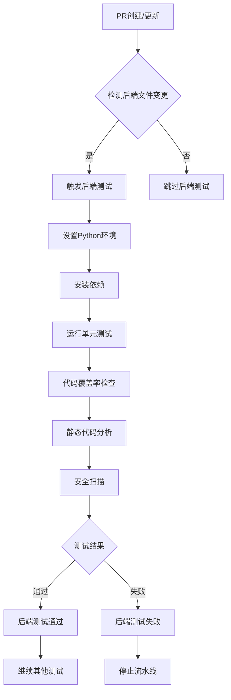

**图表来源**
- [backend-unit-tests.yml](file://.github/workflows/backend-unit-tests.yml)
- [backend/pyproject.toml](file://backend/pyproject.toml)

#### 前端单元测试流程

前端测试工作流专注于TypeScript/React应用的质量保证：

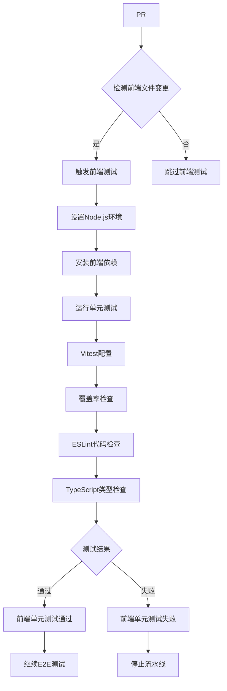

**图表来源**
- [frontend-unit-tests.yml](file://.github/workflows/frontend-unit-tests.yml)
- [frontend/package.json](file://frontend/package.json)
- [frontend/vitest.config.ts](file://frontend/vitest.config.ts)

#### E2E测试流程

端到端测试确保用户交互流程的完整性：

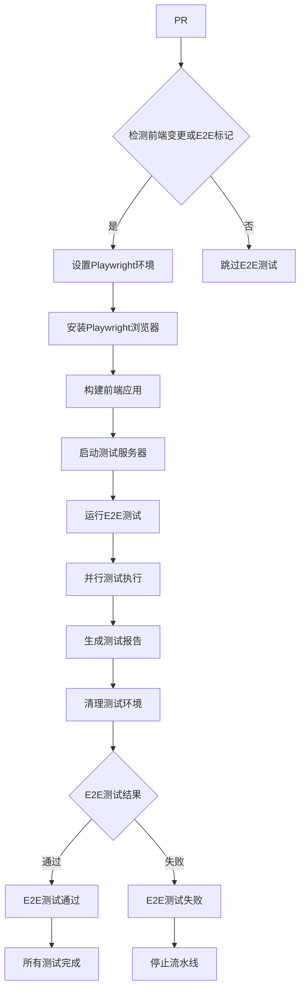

**图表来源**
- [e2e-tests.yml](file://.github/workflows/e2e-tests.yml)
- [frontend/playwright.config.ts](file://frontend/playwright.config.ts)

### 代码审查流程

#### 质量门禁机制

系统实施严格的质量门禁，确保只有满足标准的代码才能合并：

1. **代码覆盖率门禁**：后端≥80%，前端≥85%
2. **静态分析门禁**：无严重和中等严重问题
3. **安全扫描门禁**：无高危安全漏洞
4. **性能基准门禁**：关键路径性能不退化
5. **文档完整性门禁**：新增功能必须包含文档

#### 审查者要求

- 至少需要2个核心维护者的批准
- 关键模块变更需要领域专家审查
- 重大架构变更需要架构委员会批准
- 代码风格和最佳实践符合团队标准

### 合并要求

#### 自动化合并条件

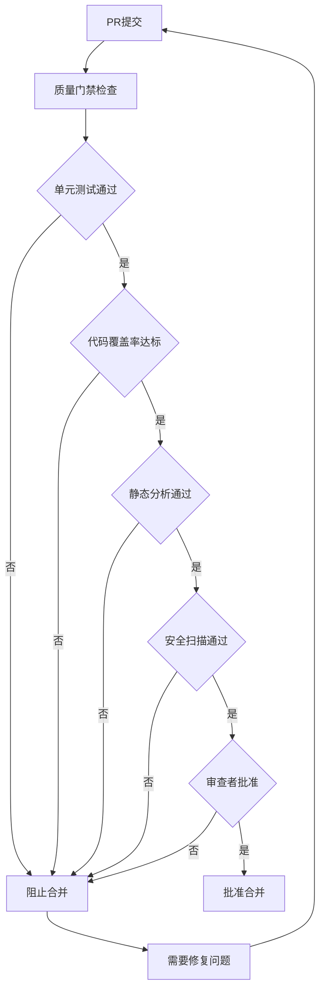

**图表来源**
- [labels.yml](file://.github/labels.yml)
- [CONTRIBUTING.md:322-326](file://CONTRIBUTING.md#L322-L326)

### PR模板使用说明

#### AI辅助开发披露要求

项目要求在PR中明确披露AI辅助开发的使用情况：

1. **AI工具披露**：列出使用的AI工具名称和版本
2. **AI生成内容标识**：明确标注AI生成的代码和文档
3. **审查过程记录**：记录AI辅助开发的审查过程
4. **合规性声明**：确认符合项目AI使用政策

#### PR模板结构

```markdown
## 概述

简要描述变更内容和影响范围

## 变更详情

### 功能变更
- 新增功能列表
- 修改功能列表
- 移除功能列表

### 代码变更
- 文件变更列表
- 代码行数统计
- 依赖更新

### 测试变更
- 新增测试用例
- 修改测试逻辑
- 移除测试用例

## AI辅助开发披露

### 使用的AI工具
- 工具名称：版本号
- 使用场景：具体描述

### AI生成内容
- 代码生成：百分比
- 文档生成：百分比
- 设计方案：百分比

### 审查过程
- AI辅助开发审查记录
- 人工审查重点
- 合规性检查

## 影响评估

### 兼容性影响
- 向后兼容性
- 配置变更
- 数据迁移

### 性能影响
- 性能基准测试
- 资源消耗
- 用户体验

### 安全影响
- 安全风险评估
- 安全措施
- 审计日志

## 部署说明

### 部署步骤
- 预部署检查
- 部署执行
- 验证步骤

### 回滚计划
- 回滚条件
- 回滚步骤
- 风险控制
```

**章节来源**
- [.github/pull_request_template.md](file://.github/pull_request_template.md)
- [copilot-instructions.md:188-214](file://.github/copilot-instructions.md#L188-L214)

### 版本发布流程

#### 发布分支管理

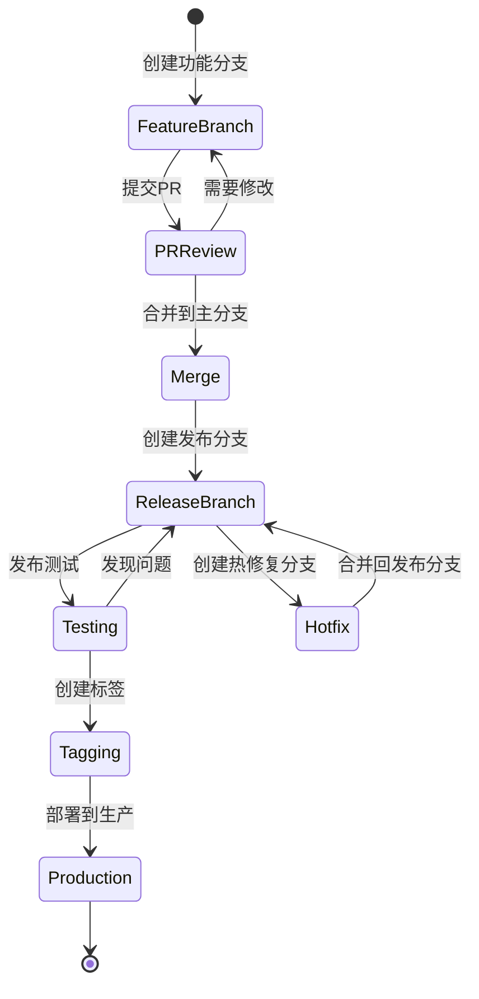

#### 发布自动化

1. **语义化版本控制**：根据变更类型自动升级版本
2. **变更日志生成**：自动生成详细的变更记录
3. **包发布**：自动发布到NPM和PyPI
4. **容器镜像推送**：自动推送最新版本镜像
5. **文档更新**：同步更新API文档和用户指南

### 回滚策略

#### 多层回滚机制

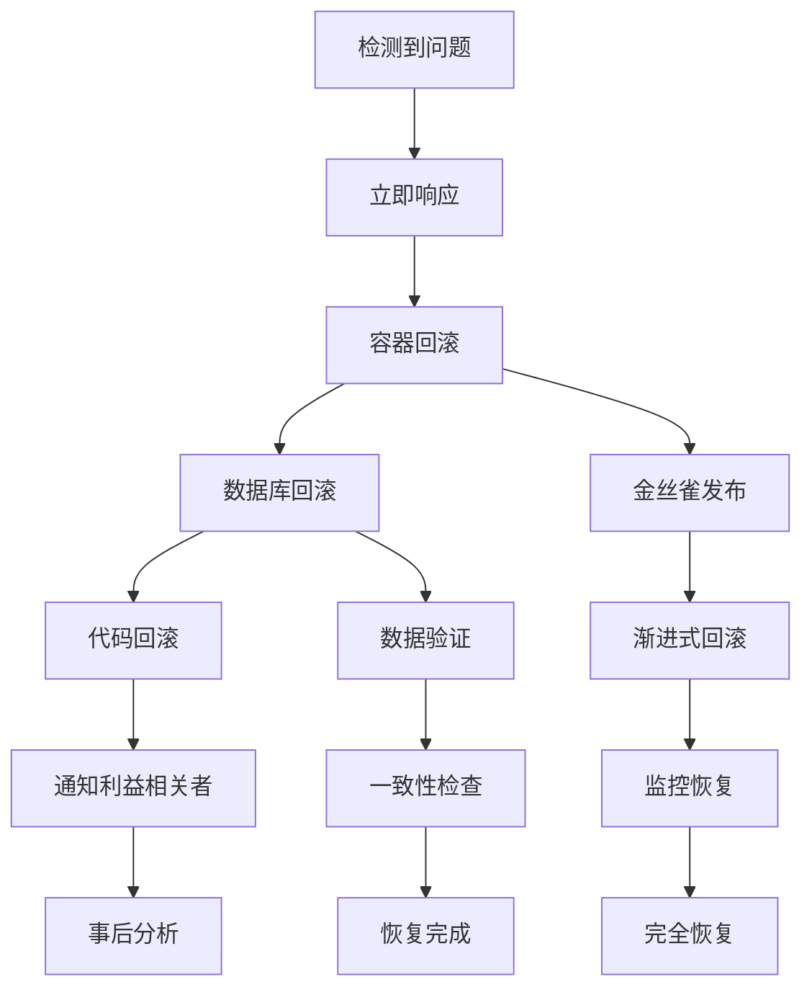

**图表来源**
- [scripts/deploy.sh](file://scripts/deploy.sh)
- [scripts/check.sh](file://scripts/check.sh)

## 依赖关系分析

### 技术栈依赖

项目采用现代化的技术栈，各组件之间存在清晰的依赖关系：

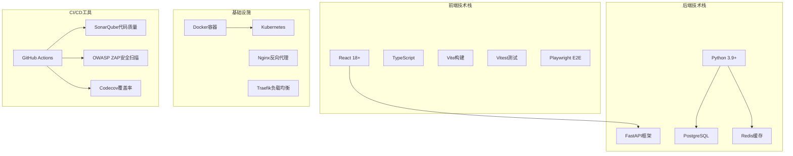

**图表来源**
- [frontend/package.json](file://frontend/package.json)
- [backend/pyproject.toml](file://backend/pyproject.toml)
- [docker/docker-compose.yaml](file://docker/docker-compose.yaml)

### 工作流依赖关系

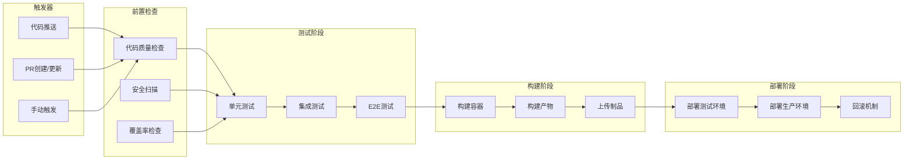

**图表来源**
- [container.yaml](file://.github/workflows/container.yaml)
- [backend-unit-tests.yml](file://.github/workflows/backend-unit-tests.yml)
- [frontend-unit-tests.yml](file://.github/workflows/frontend-unit-tests.yml)
- [e2e-tests.yml](file://.github/workflows/e2e-tests.yml)

**章节来源**
- [CONTRIBUTING.md:322-326](file://CONTRIBUTING.md#L322-L326)
- [docker/docker-compose.yaml](file://docker/docker-compose.yaml)

## 性能考虑

### 测试性能优化

1. **并行测试执行**：利用Playwright的并行测试能力
2. **缓存策略**：合理使用依赖缓存减少构建时间
3. **增量测试**：只对变更的文件运行相关测试
4. **资源隔离**：为不同类型的测试分配专用资源

### 部署性能优化

1. **容器镜像优化**：多阶段构建减少镜像大小
2. **CDN加速**：静态资源通过CDN分发
3. **负载均衡**：智能流量分配提高响应速度
4. **缓存策略**：合理的缓存配置提升用户体验

### 监控和告警

1. **性能指标监控**：关键业务指标实时监控
2. **异常告警**：自动化的异常检测和告警
3. **容量规划**：基于历史数据的容量预测
4. **成本优化**：资源使用情况分析和优化

## 故障排除指南

### 常见问题诊断

#### 测试失败排查

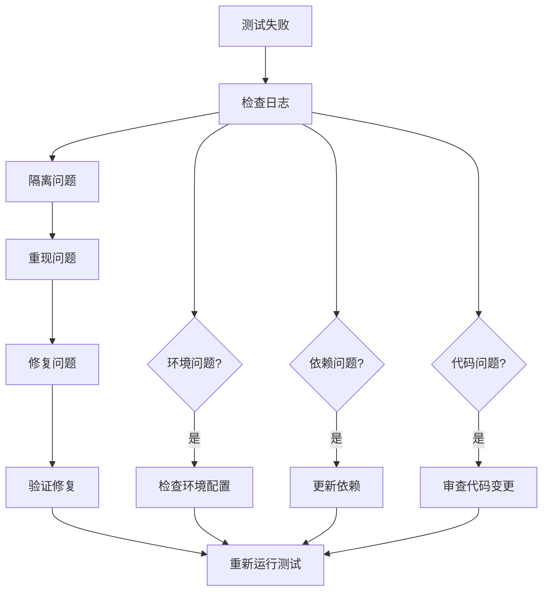

#### 部署问题排查

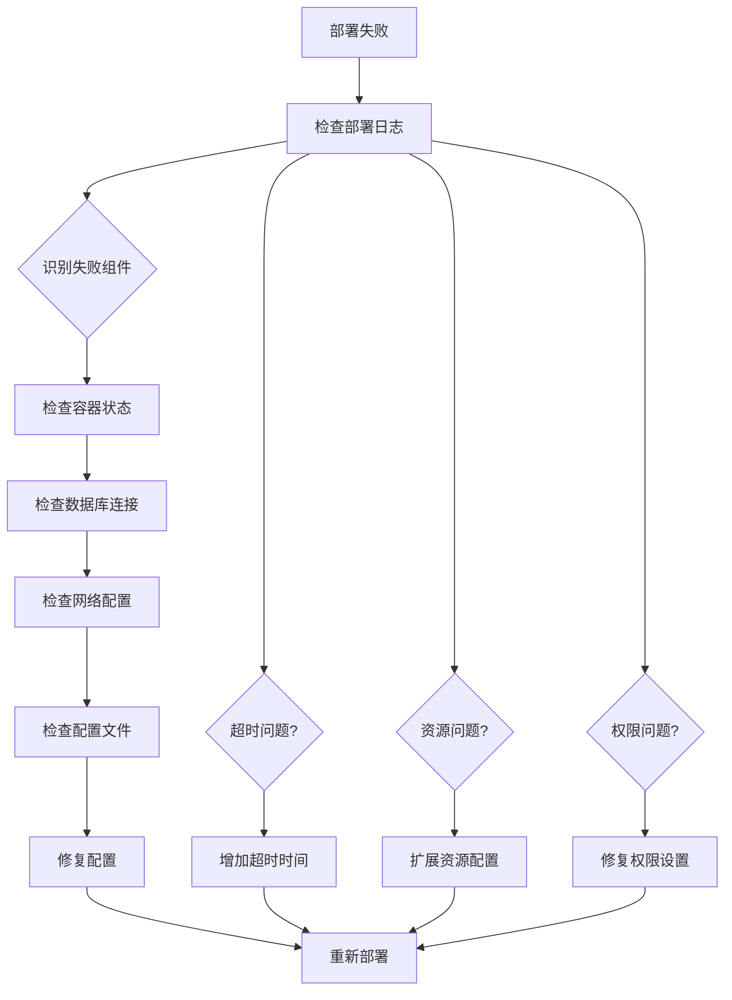

### 回滚操作指南

#### 快速回滚步骤

1. **问题确认**：确认问题的严重性和影响范围
2. **回滚准备**：备份当前状态和配置
3. **执行回滚**：按照预定义的回滚脚本执行
4. **验证恢复**：检查系统功能是否恢复正常
5. **后续处理**：分析问题原因并制定长期解决方案

#### 回滚验证清单

- [ ] 系统功能完整性检查
- [ ] 数据一致性验证
- [ ] 性能指标回归检查
- [ ] 用户体验评估
- [ ] 监控告警状态确认

**章节来源**
- [scripts/check.sh](file://scripts/check.sh)
- [scripts/wait-for-port.sh](file://scripts/wait-for-port.sh)

## 结论

DeerFlow项目的CI/CD流程设计体现了现代软件开发生态系统的最佳实践。通过自动化的工作流、严格的质量门禁和完善的回滚机制，确保了代码质量和部署可靠性。

该系统的主要优势包括：

1. **全面的测试覆盖**：从单元测试到端到端测试的多层次保障
2. **高效的自动化**：从代码提交到生产的完整自动化流水线
3. **严格的质量控制**：多维度的质量门禁确保代码质量
4. **灵活的部署策略**：支持多种部署模式和回滚机制
5. **完善的监控告警**：实时监控和快速响应机制

未来可以进一步优化的方向包括：
- 引入更多的AI辅助测试生成
- 实施更精细的性能基准测试
- 增强安全扫描的自动化程度
- 优化构建和部署的并行化程度

## 附录

### 最佳实践建议

1. **代码提交规范**
   - 提交信息应清晰描述变更内容
   - 遵循约定式提交规范
   - 包含相关的issue链接

2. **PR编写规范**
   - 详细描述变更动机和影响
   - 提供充分的测试证据
   - 明确的部署和回滚计划

3. **测试编写规范**
   - 覆盖主要业务场景
   - 包含边界条件测试
   - 定期维护测试用例

4. **监控和告警**
   - 建立完善的监控体系
   - 设置合理的告警阈值
   - 定期审查告警有效性

### 相关文档链接

- [贡献指南](CONTRIBUTING.md)
- [PR模板](.github/pull_request_template.md)
- [标签管理](.github/labels.yml)
- [Copilot指令](.github/copilot-instructions.md)