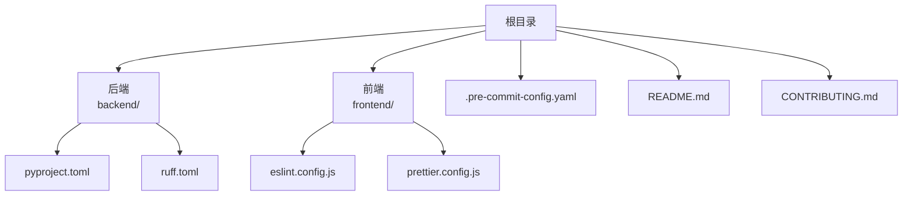
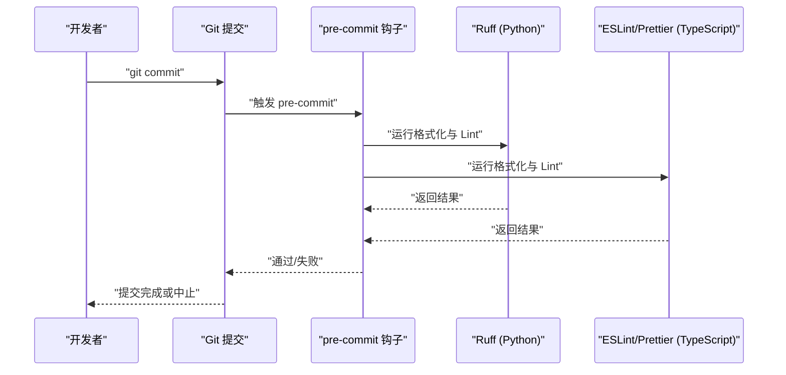
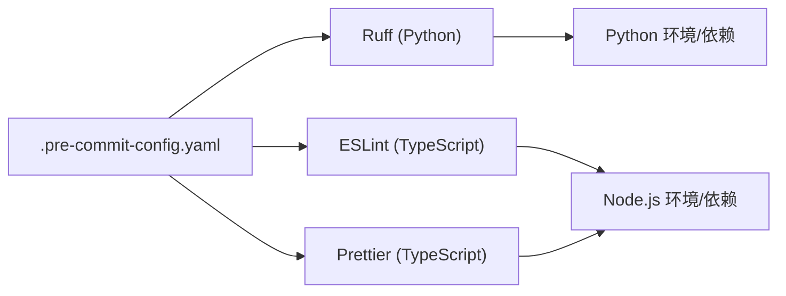

# 代码规范

<cite>
**本文引用的文件**
- [backend/pyproject.toml](file://backend/pyproject.toml)
- [backend/ruff.toml](file://backend/ruff.toml)
- [frontend/eslint.config.js](file://frontend/eslint.config.js)
- [frontend/prettier.config.js](file://frontend/prettier.config.js)
- [.pre-commit-config.yaml](file://.pre-commit-config.yaml)
- [README.md](file://README.md)
- [CONTRIBUTING.md](file://CONTRIBUTING.md)
</cite>

## 目录
1. [引言](#引言)
2. [项目结构](#项目结构)
3. [核心组件](#核心组件)
4. [架构总览](#架构总览)
5. [详细组件分析](#详细组件分析)
6. [依赖分析](#依赖分析)
7. [性能考虑](#性能考虑)
8. [故障排查指南](#故障排查指南)
9. [结论](#结论)
10. [附录](#附录)

## 引言
本文件为“deer-flow”项目的代码规范与工具配置说明，覆盖后端 Python（Ruff 格式化与 lint）、前端 TypeScript（ESLint 与 Prettier）以及 Git 钩子（pre-commit）的配置与使用流程。文档同时提供命名约定、注释规范、错误处理模式、CI 代码质量检查机制的实践建议，并通过图示帮助读者快速理解工具链在提交前的自动化执行路径。

## 项目结构
本项目采用多模块组织方式：后端位于 backend 目录，前端位于 frontend 目录；根目录包含通用的 Git 钩子配置与贡献指南等文档。关键规范文件分布如下：
- 后端
  - Ruff 配置：backend/ruff.toml
  - 包管理与工具声明：backend/pyproject.toml
- 前端
  - ESLint 配置：frontend/eslint.config.js
  - Prettier 配置：frontend/prettier.config.js
- Git 钩子
  - pre-commit 配置：.pre-commit-config.yaml
- 文档
  - 项目说明与贡献指南：README.md、CONTRIBUTING.md

**图表来源**
- [backend/pyproject.toml](file://backend/pyproject.toml)
- [backend/ruff.toml](file://backend/ruff.toml)
- [frontend/eslint.config.js](file://frontend/eslint.config.js)
- [frontend/prettier.config.js](file://frontend/prettier.config.js)
- [.pre-commit-config.yaml](file://.pre-commit-config.yaml)
- [README.md](file://README.md)
- [CONTRIBUTING.md](file://CONTRIBUTING.md)

**章节来源**
- [README.md](file://README.md)
- [CONTRIBUTING.md](file://CONTRIBUTING.md)

## 核心组件
- 后端 Python 规范
  - 使用 Ruff 进行格式化与静态检查，配置集中在 backend/ruff.toml；包与工具声明在 backend/pyproject.toml 中。
- 前端 TypeScript 规范
  - 使用 ESLint 与 Prettier 统一代码风格，配置分别位于 frontend/eslint.config.js 与 frontend/prettier.config.js。
- Git 钩子（pre-commit）
  - 通过 .pre-commit-config.yaml 定义提交前的自动化检查任务，确保格式化与基础 Lint 在本地即被执行。

**章节来源**
- [backend/ruff.toml](file://backend/ruff.toml)
- [backend/pyproject.toml](file://backend/pyproject.toml)
- [frontend/eslint.config.js](file://frontend/eslint.config.js)
- [frontend/prettier.config.js](file://frontend/prettier.config.js)
- [.pre-commit-config.yaml](file://.pre-commit-config.yaml)

## 架构总览
下图展示了从开发者提交到本地校验再到 CI 的整体流程。本地通过 pre-commit 调用 Ruff（Python）与 ESLint/Prettier（TypeScript），CI 可复用相同规则进行统一的质量门禁。

**图表来源**
- [.pre-commit-config.yaml](file://.pre-commit-config.yaml)
- [backend/ruff.toml](file://backend/ruff.toml)
- [frontend/eslint.config.js](file://frontend/eslint.config.js)
- [frontend/prettier.config.js](file://frontend/prettier.config.js)

## 详细组件分析

### 后端 Python：Ruff 规则与工具配置
- 配置位置
  - 格式化与 Lint 规则：backend/ruff.toml
  - 工具与依赖声明：backend/pyproject.toml
- 关键点
  - 在 backend/ruff.toml 中定义规则集、排除路径、选择性启用/禁用规则，确保与团队风格一致。
  - 在 backend/pyproject.toml 中声明 Ruff 作为开发依赖与可执行入口，便于统一安装与调用。
- 推荐实践
  - 将 Ruff 的格式化与 Lint 分离为两条命令，便于在 IDE 与 pre-commit 中分别执行。
  - 对于第三方或生成代码，使用注释或配置排除，避免误报。
  - 在 CI 中以严格模式运行，失败即阻断合并。

**章节来源**
- [backend/ruff.toml](file://backend/ruff.toml)
- [backend/pyproject.toml](file://backend/pyproject.toml)

### 前端 TypeScript：ESLint 与 Prettier 配置
- 配置位置
  - ESLint 规则与插件：frontend/eslint.config.js
  - Prettier 格式化策略：frontend/prettier.config.js
- 关键点
  - 使用 ESLint 配置集中管理规则、插件与解析器；Prettier 专注于格式化一致性。
  - 建议在 ESLint 中开启与 Prettier 兼容的规则，避免冲突。
- 推荐实践
  - 在 IDE 中启用保存时自动格式化，减少手动干预。
  - 将 Prettier 的忽略列表与 .gitignore 协同，避免格式化无关文件。
  - 在 CI 中统一执行格式化与 Lint，保证分支一致性。

**章节来源**
- [frontend/eslint.config.js](file://frontend/eslint.config.js)
- [frontend/prettier.config.js](file://frontend/prettier.config.js)

### Git 钩子：pre-commit 设置与自动格式化流程
- 配置位置
  - 钩子定义：.pre-commit-config.yaml
- 关键点
  - 在 .pre-commit-config.yaml 中声明 Ruff（Python）与 ESLint/Prettier（TypeScript）任务。
  - 指定触发时机（如 on_commit、on_push）与文件匹配规则，避免对无关文件执行。
- 推荐实践
  - 在本地首次安装后运行 pre-commit install，确保钩子生效。
  - 对大型仓库可按目录或文件类型拆分任务，提升执行效率。
  - 将 pre-commit 任务纳入 CI，形成“双保险”。

**章节来源**
- [.pre-commit-config.yaml](file://.pre-commit-config.yaml)

### 命名约定与注释规范（通用建议）
- 命名约定
  - Python：模块与函数使用下划线命名；类使用帕斯卡命名；常量使用全大写。
  - TypeScript：变量与函数使用驼峰命名；接口与类型使用帕斯卡命名；枚举使用帕斯卡命名。
- 注释规范
  - 函数/方法：明确参数、返回值与异常；复杂逻辑添加行内注释。
  - 类与模块：在文件头或模块级注释中说明用途、依赖与注意事项。
  - TODO/FIXME：使用统一标记并在后续迭代中清理。
- 错误处理模式
  - 明确错误边界，优先使用异常而非返回码；在上层统一捕获并记录上下文信息。
  - 对外部依赖（网络、文件系统）增加超时与重试策略，并在日志中保留必要上下文。

[本节为通用规范建议，不直接分析具体文件，故无“章节来源”]

### CI 代码质量检查机制（建议）
- 建议在 CI 中执行以下步骤：
  - 安装依赖（Python 使用 pip/uv，TypeScript 使用 pnpm）。
  - 执行格式化检查（Ruff、ESLint、Prettier）。
  - 执行静态分析与单元测试（如适用）。
  - 失败即中断流水线，要求修复后再合并。
- 与本地一致的规则
  - CI 使用与本地相同的配置文件，避免“本地通过、线上失败”的情况。

[本节为通用机制建议，不直接分析具体文件，故无“章节来源”]

## 依赖分析
- 工具链耦合关系
  - pre-commit 作为统一入口，协调 Ruff 与 ESLint/Prettier。
  - Ruff 与 ESLint/Prettier 各自独立，互不依赖，但共享“格式化+Lint”的目标。
- 外部依赖
  - Python 环境与包管理工具（如 pip/uv）。
  - Node.js 生态与包管理工具（如 pnpm）。
- 潜在风险
  - 版本不一致导致本地与 CI 行为差异；应固定版本并在 CI 中显式安装。
  - 忽略了某些文件类型或目录，导致规则覆盖不全。

**图表来源**
- [.pre-commit-config.yaml](file://.pre-commit-config.yaml)
- [backend/ruff.toml](file://backend/ruff.toml)
- [frontend/eslint.config.js](file://frontend/eslint.config.js)
- [frontend/prettier.config.js](file://frontend/prettier.config.js)

**章节来源**
- [.pre-commit-config.yaml](file://.pre-commit-config.yaml)

## 性能考虑
- 优化建议
  - 将大型任务拆分为多个小任务，减少单次执行时间。
  - 使用缓存（如 Ruff 的缓存目录、ESLint 的缓存）降低重复计算。
  - 在 CI 中并行执行不同语言的检查任务，缩短总耗时。
- 注意事项
  - 避免在 pre-commit 中执行耗时过长的任务（如全量测试）。
  - 对二进制或生成文件使用排除规则，减少扫描范围。

[本节提供一般性指导，不直接分析具体文件，故无“章节来源”]

## 故障排查指南
- 常见问题
  - pre-commit 不生效：确认已执行安装命令且未被忽略。
  - 规则冲突：检查 ESLint 与 Prettier 的兼容性配置。
  - 本地通过但 CI 失败：核对 CI 中的工具版本与配置是否与本地一致。
- 排查步骤
  - 在本地按 CI 步骤复现：安装依赖 → 执行格式化与 Lint → 查看输出。
  - 对比配置文件差异，尤其是排除规则与规则集。
  - 清理缓存后重试，排除缓存导致的异常状态。

[本节为通用排障建议，不直接分析具体文件，故无“章节来源”]

## 结论
通过在本地与 CI 中统一使用 Ruff、ESLint、Prettier 与 pre-commit，可以有效保障 Python 与 TypeScript 代码的一致性与可维护性。建议团队在贡献指南中明确这些工具的使用方式与更新策略，持续优化规则集与执行性能，确保高质量交付。

[本节为总结性内容，不直接分析具体文件，故无“章节来源”]

## 附录
- 参考文件
  - 项目说明与贡献指南：README.md、CONTRIBUTING.md
  - 后端工具与规则：backend/pyproject.toml、backend/ruff.toml
  - 前端工具与规则：frontend/eslint.config.js、frontend/prettier.config.js
  - Git 钩子：.pre-commit-config.yaml

**章节来源**
- [README.md](file://README.md)
- [CONTRIBUTING.md](file://CONTRIBUTING.md)
- [backend/pyproject.toml](file://backend/pyproject.toml)
- [backend/ruff.toml](file://backend/ruff.toml)
- [frontend/eslint.config.js](file://frontend/eslint.config.js)
- [frontend/prettier.config.js](file://frontend/prettier.config.js)
- [.pre-commit-config.yaml](file://.pre-commit-config.yaml)