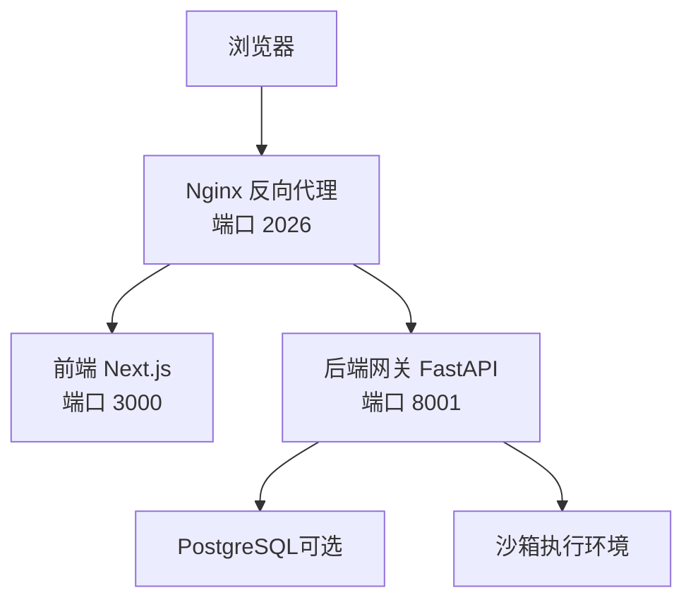
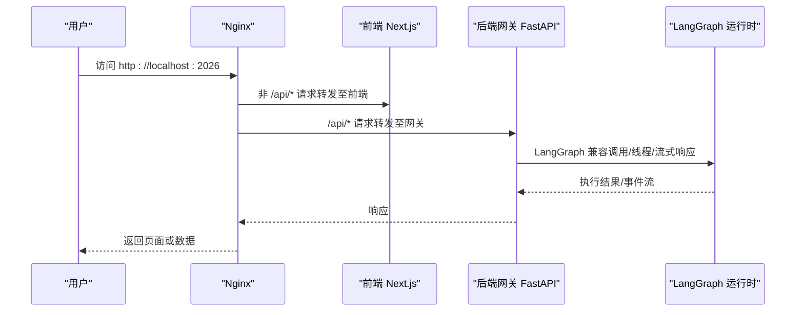
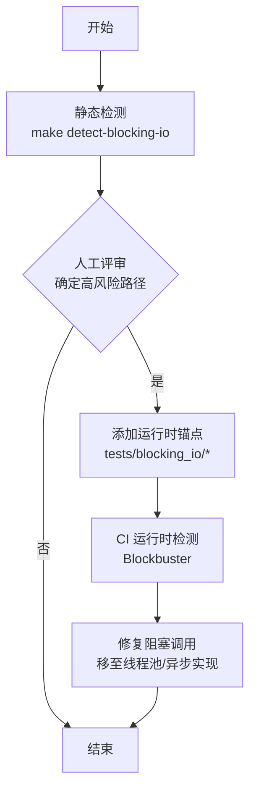
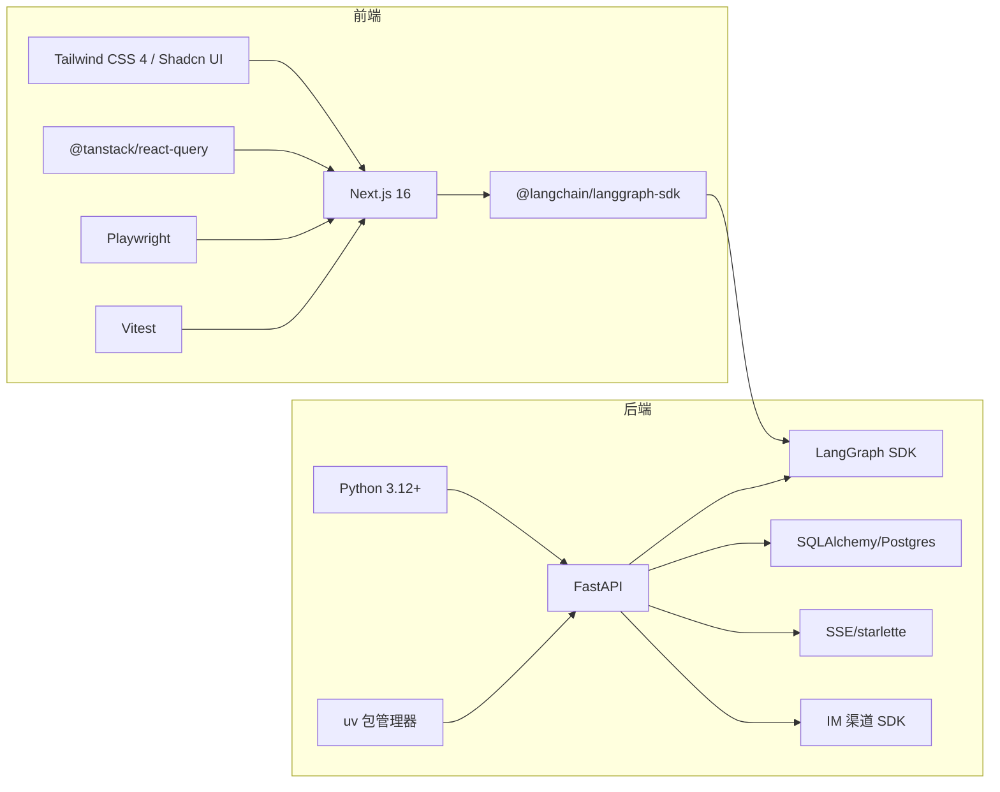

# 开发指南

<cite>
**本文引用的文件**
- [CONTRIBUTING.md](file://CONTRIBUTING.md)
- [backend/README.md](file://backend/README.md)
- [frontend/README.md](file://frontend/README.md)
- [backend/pyproject.toml](file://backend/pyproject.toml)
- [frontend/package.json](file://frontend/package.json)
- [backend/ruff.toml](file://backend/ruff.toml)
- [frontend/eslint.config.js](file://frontend/eslint.config.js)
- [frontend/prettier.config.js](file://frontend/prettier.config.js)
- [backend/Makefile](file://backend/Makefile)
- [frontend/Makefile](file://frontend/Makefile)
- [docker/docker-compose-dev.yaml](file://docker/docker-compose-dev.yaml)
- [backend/sitecustomize.py](file://backend/sitecustomize.py)
- [backend/docs/BLOCKING_IO_DETECTION.md](file://backend/docs/BLOCKING_IO_DETECTION.md)
- [scripts/detect_blocking_io_static.py](file://scripts/detect_blocking_io_static.py)
- [backend/tests/conftest.py](file://backend/tests/conftest.py)
- [frontend/vitest.config.ts](file://frontend/vitest.config.ts)
- [frontend/playwright.config.ts](file://frontend/playwright.config.ts)
</cite>

## 目录
1. [简介](#简介)
2. [项目结构](#项目结构)
3. [核心组件](#核心组件)
4. [架构总览](#架构总览)
5. [详细组件分析](#详细组件分析)
6. [依赖分析](#依赖分析)
7. [性能考虑](#性能考虑)
8. [故障排查指南](#故障排查指南)
9. [结论](#结论)
10. [附录](#附录)

## 简介
本开发指南面向 DeerFlow 项目的后端与前端开发者，提供从环境搭建、代码规范、测试策略到 CI/CD 流程与性能排查的完整实践路径。内容覆盖：
- 前后端开发环境配置与依赖管理
- 调试与热重载方法
- 代码结构、模块划分与设计模式
- 单元测试、集成测试与端到端测试编写指南
- CI/CD 流程、代码审查标准与发布流程
- 性能分析、内存泄漏检测与阻塞 I/O 排查

## 项目结构
DeerFlow 采用前后端分离与统一反向代理入口的多服务架构：
- 反向代理：Nginx（端口 2026），统一入口，路由 API 到网关，非 API 请求转发到前端
- 后端：FastAPI 网关 + LangGraph 兼容运行时（端口 8001）
- 前端：Next.js 应用（端口 3000）
- 可选：PostgreSQL（检查点存储）、沙箱编排器（Kubernetes 沙箱模式）

图表来源
- [docker/docker-compose-dev.yaml:1-238](file://docker/docker-compose-dev.yaml#L1-L238)

章节来源
- [CONTRIBUTING.md:217-246](file://CONTRIBUTING.md#L217-L246)
- [backend/README.md:7-36](file://backend/README.md#L7-L36)

## 核心组件
- 后端核心能力
  - 网关 API：提供模型、MCP、技能、记忆、上传、工件、线程等 REST 接口
  - 主智能体（Lead Agent）：中间件链 + 工具系统 + 子代理委托 + 持久化记忆
  - 沙箱系统：本地/容器隔离执行，虚拟路径映射，文件写入安全策略
  - 子代理系统：并发任务委派与状态跟踪
  - 记忆系统：上下文抽取与结构化存储
- 前端核心能力
  - Next.js App Router 页面与 API 路由
  - AI 元素与工作区组件体系
  - 国际化、设置、消息、线程、工件、上传等业务模块

章节来源
- [backend/README.md:39-133](file://backend/README.md#L39-L133)
- [frontend/README.md:91-125](file://frontend/README.md#L91-L125)

## 架构总览
下图展示请求在各组件间的流转与职责边界。

图表来源
- [backend/README.md:32-36](file://backend/README.md#L32-L36)
- [docker/docker-compose-dev.yaml:86-108](file://docker/docker-compose-dev.yaml#L86-L108)

## 详细组件分析

### 后端开发环境与依赖管理
- 环境要求
  - Python 3.12+，使用 uv 包管理器
  - Docker（推荐）或本地安装 Node.js、pnpm、uv、nginx
- 安装与启动
  - 复制示例配置并设置 API 密钥
  - 使用 make install 安装依赖
  - 使用 make dev 启动网关 + 嵌入式智能体运行时（端口 8001）
- 关键工具
  - Lint/格式化：ruff（Python）
  - 测试：pytest（含 Blockbuster 运行时阻塞 I/O 检测）
  - 阻塞 I/O 静态检测：通过 make detect-blocking-io 输出 JSON 报告

章节来源
- [CONTRIBUTING.md:9-89](file://CONTRIBUTING.md#L9-L89)
- [backend/README.md:135-204](file://backend/README.md#L135-L204)
- [backend/pyproject.toml:1-58](file://backend/pyproject.toml#L1-L58)
- [backend/Makefile:1-25](file://backend/Makefile#L1-L25)
- [backend/ruff.toml:1-14](file://backend/ruff.toml#L1-L14)

### 前端开发环境与依赖管理
- 环境要求
  - Node.js 22+，pnpm 10.26.2+
- 安装与启动
  - pnpm install 安装依赖
  - pnpm dev 启动开发服务器（端口 3000）
  - 支持类型检查、格式化、ESLint、Playwright E2E
- 关键工具
  - 类型检查：tsc
  - 格式化：Prettier
  - Lint：ESLint
  - 单测：Vitest
  - E2E：Playwright（Chromium）

章节来源
- [frontend/README.md:11-67](file://frontend/README.md#L11-L67)
- [frontend/package.json:1-118](file://frontend/package.json#L1-L118)
- [frontend/eslint.config.js:1-98](file://frontend/eslint.config.js#L1-L98)
- [frontend/prettier.config.js:1-5](file://frontend/prettier.config.js#L1-L5)
- [frontend/Makefile:1-25](file://frontend/Makefile#L1-L25)

### 代码风格与规范
- 后端（Python）
  - 行长度 240；双引号；4 空格缩进；导入分组；类型提示
  - 使用 ruff 进行检查与格式化
- 前端（TypeScript/JS）
  - ESLint + Prettier；import 排序；禁用不安全的类型断言规则（按需）
  - Vitest 单测；Playwright E2E

章节来源
- [CONTRIBUTING.md:126-168](file://CONTRIBUTING.md#L126-L168)
- [backend/ruff.toml:1-14](file://backend/ruff.toml#L1-L14)
- [frontend/eslint.config.js:1-98](file://frontend/eslint.config.js#L1-L98)
- [frontend/prettier.config.js:1-5](file://frontend/prettier.config.js#L1-L5)

### 测试策略与编写指南
- 单元测试
  - 后端：pytest，标记如 no_auto_user、allow_blocking_io
  - 前端：Vitest，按 src 结构镜像 tests/unit
- 集成测试
  - 后端：阻塞 I/O 运行时检测（Blockbuster），聚焦生产路径
- 端到端测试
  - 前端：Playwright，Chromium，自动构建并启动生产服务器
- 测试命令
  - 后端：make test、make test-blocking-io
  - 前端：pnpm test、pnpm test:e2e

章节来源
- [backend/Makefile:10-21](file://backend/Makefile#L10-L21)
- [frontend/Makefile:10-20](file://frontend/Makefile#L10-L20)
- [backend/tests/conftest.py:1-140](file://backend/tests/conftest.py#L1-L140)
- [frontend/vitest.config.ts:1-15](file://frontend/vitest.config.ts#L1-L15)
- [frontend/playwright.config.ts:1-35](file://frontend/playwright.config.ts#L1-L35)

### CI/CD 流程与代码审查
- CI 触发
  - 后端单元测试、前端单元测试、前端 E2E 测试（仅当前端变更时触发）
- 提交与 PR
  - 统一使用分支命名与提交信息前缀规范
  - PR 描述包含“做了什么/为什么/如何实现/如何测试”
  - 代码格式化与 Lint 必须通过
- 发布流程
  - 仓库未提供显式的发布脚本，建议遵循语义化版本与变更日志规范进行合并与打标签

章节来源
- [CONTRIBUTING.md:240-328](file://CONTRIBUTING.md#L240-L328)
- [backend/README.md:355-394](file://backend/README.md#L355-L394)

### 阻塞 I/O 排查与维护
- 静态检测
  - 通过 make detect-blocking-io 扫描后端业务代码，输出 JSON 报告用于评审与分级
- 运行时检测
  - 使用 Blockbuster 在 CI 中拦截事件循环线程上的阻塞调用
  - 维护策略：先静态发现，再评审确定高风险路径，最后在 tests/blocking_io/ 添加锚点
- 平台兼容性
  - Windows 上通过 sitecustomize.py 设置 Selector 事件循环策略以避免阻塞

图表来源
- [backend/docs/BLOCKING_IO_DETECTION.md:1-155](file://backend/docs/BLOCKING_IO_DETECTION.md#L1-L155)
- [backend/Makefile:23-25](file://backend/Makefile#L23-L25)
- [scripts/detect_blocking_io_static.py:1-24](file://scripts/detect_blocking_io_static.py#L1-L24)
- [backend/sitecustomize.py:1-27](file://backend/sitecustomize.py#L1-L27)

章节来源
- [backend/docs/BLOCKING_IO_DETECTION.md:1-155](file://backend/docs/BLOCKING_IO_DETECTION.md#L1-L155)
- [backend/Makefile:23-25](file://backend/Makefile#L23-L25)
- [scripts/detect_blocking_io_static.py:1-24](file://scripts/detect_blocking_io_static.py#L1-L24)
- [backend/sitecustomize.py:1-27](file://backend/sitecustomize.py#L1-L27)

## 依赖分析
- 后端依赖
  - FastAPI、Uvicorn、LangGraph SDK、数据库连接与池化、IM 渠道 SDK、SSE、multipart、bcrypt、SQLAlchemy、PyODBC、Postgres 检查点适配等
  - 可选：Discord SDK
- 前端依赖
  - Next.js 16、@langchain/langgraph-sdk、@tanstack/react-query、Tailwind CSS 4、Shadcn UI、MagicUI、React 19、Playwright、Vitest、TypeScript、ESLint、Prettier 等

图表来源
- [backend/pyproject.toml:1-58](file://backend/pyproject.toml#L1-L58)
- [frontend/package.json:1-118](file://frontend/package.json#L1-L118)

章节来源
- [backend/pyproject.toml:1-58](file://backend/pyproject.toml#L1-L58)
- [frontend/package.json:1-118](file://frontend/package.json#L1-L118)

## 性能考虑
- 阻塞 I/O 防护
  - 静态扫描 + 运行时锚点保护，确保事件循环不被阻塞
  - 将文件系统、网络、子进程等同步调用迁移至线程池或异步实现
- 内存与上下文
  - 记忆系统采用结构化存储与去抖更新，降低 LLM 调用频率
  - 沙箱执行采用隔离目录与虚拟路径映射，避免跨线程竞态
- 并发与超时
  - 子代理并发上限与超时控制，避免资源耗尽
- 观测性
  - 支持 LangSmith/Langfuse 追踪，便于定位热点与瓶颈

章节来源
- [backend/README.md:88-107](file://backend/README.md#L88-L107)
- [backend/docs/BLOCKING_IO_DETECTION.md:1-155](file://backend/docs/BLOCKING_IO_DETECTION.md#L1-L155)

## 故障排查指南
- 环境权限（Linux）
  - Docker 权限不足：将当前用户加入 docker 组并重新登录生效
- 阻塞 I/O 问题
  - 使用静态检测生成报告，结合评审确定优先级
  - 在 CI 中通过运行时锚点防止回归
- Windows 事件循环
  - sitecustomize.py 自动设置 Selector 策略，避免默认 Proactor 导致的阻塞
- 前端 E2E 失败
  - 确认 Chromium 已安装（pnpm exec playwright install chromium）
  - 检查 Playwright 配置与 webServer 启动参数

章节来源
- [CONTRIBUTING.md:92-124](file://CONTRIBUTING.md#L92-L124)
- [backend/docs/BLOCKING_IO_DETECTION.md:1-155](file://backend/docs/BLOCKING_IO_DETECTION.md#L1-L155)
- [backend/sitecustomize.py:1-27](file://backend/sitecustomize.py#L1-L27)
- [frontend/README.md:56-61](file://frontend/README.md#L56-L61)
- [frontend/playwright.config.ts:1-35](file://frontend/playwright.config.ts#L1-L35)

## 结论
本指南提供了 DeerFlow 的全栈开发实践蓝图：从环境搭建、代码规范、测试策略到 CI/CD 与性能保障。建议团队在日常开发中坚持：
- 统一的格式化与 Lint 规则
- 以测试驱动的开发与评审
- 通过静态 + 运行时双轨检测阻塞 I/O
- 借助可观测性工具持续优化性能与稳定性

## 附录
- 常用命令速查
  - 后端：make install、make dev、make test、make test-blocking-io、make detect-blocking-io
  - 前端：pnpm install、pnpm dev、pnpm test、pnpm test:e2e、pnpm build、pnpm start
- Docker 开发
  - make docker-init、make docker-start、make docker-stop、make docker-logs
- 配置文件
  - config.example.yaml、extensions_config.example.json、.env（前后端）

章节来源
- [CONTRIBUTING.md:56-123](file://CONTRIBUTING.md#L56-L123)
- [backend/Makefile:1-25](file://backend/Makefile#L1-L25)
- [frontend/Makefile:1-25](file://frontend/Makefile#L1-L25)
- [docker/docker-compose-dev.yaml:1-238](file://docker/docker-compose-dev.yaml#L1-L238)