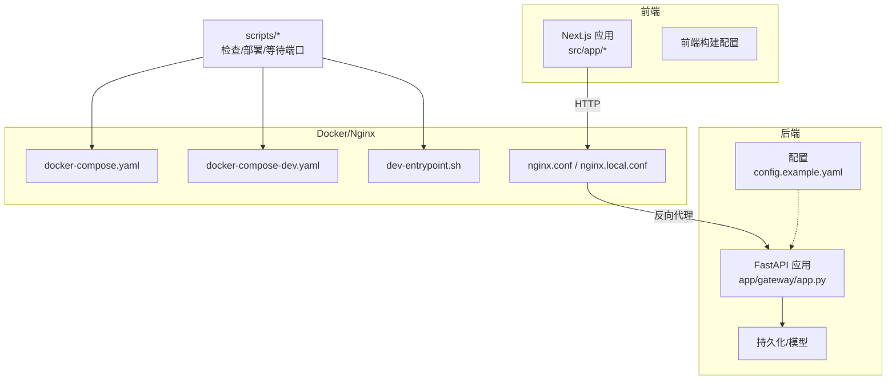
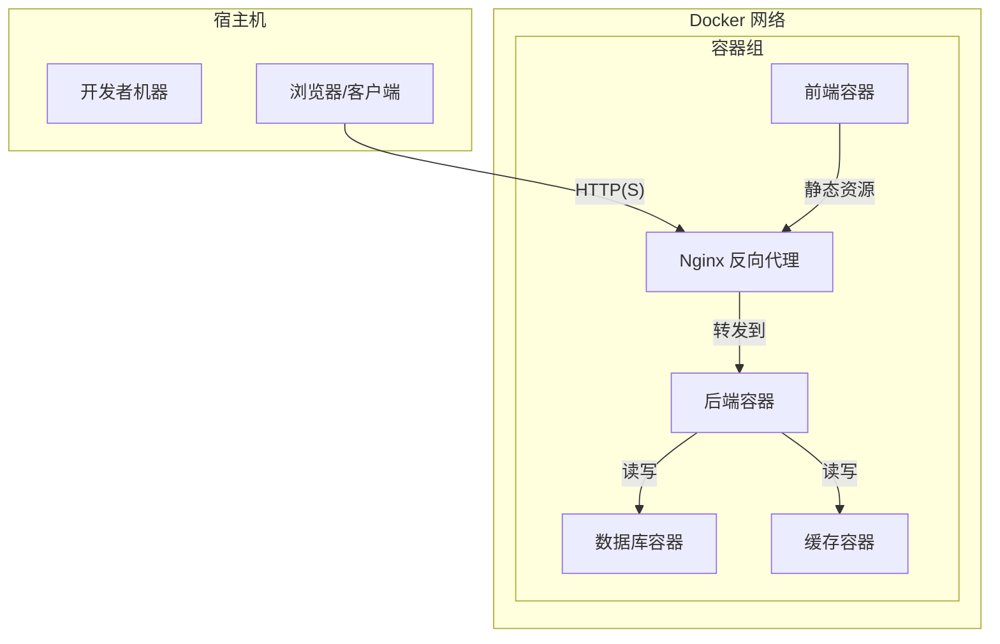
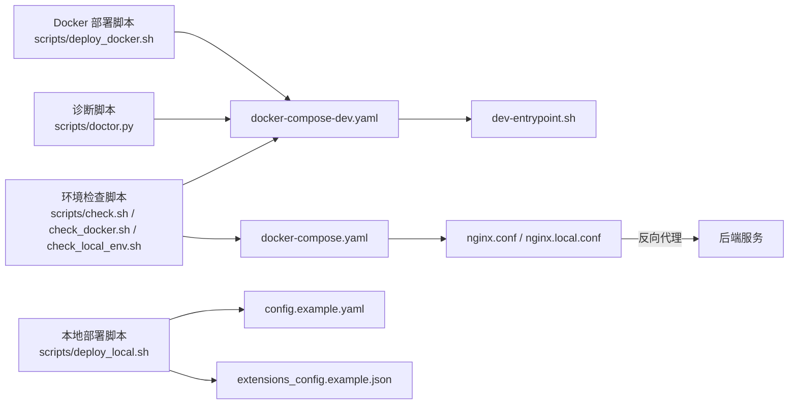

# 开发环境搭建

<cite>
**本文引用的文件**
- [backend/pyproject.toml](file://backend/pyproject.toml)
- [backend/Dockerfile](file://backend/Dockerfile)
- [docker/docker-compose.yaml](file://docker/docker-compose.yaml)
- [docker/docker-compose-dev.yaml](file://docker/docker-compose-dev.yaml)
- [docker/dev-entrypoint.sh](file://docker/dev-entrypoint.sh)
- [frontend/Dockerfile](file://frontend/Dockerfile)
- [scripts/check.sh](file://scripts/check.sh)
- [scripts/doctor.py](file://scripts/doctor.py)
- [scripts/deploy_docker.sh](file://.agent/skills/smoke-test/scripts/deploy_docker.sh)
- [scripts/deploy_local.sh](file://.agent/skills/smoke-test/scripts/deploy_local.sh)
- [scripts/check_docker.sh](file://.agent/skills/smoke-test/scripts/check_docker.sh)
- [scripts/check_local_env.sh](file://.agent/skills/smoke-test/scripts/check_local_env.sh)
- [scripts/frontend_check.sh](file://.agent/skills/smoke-test/scripts/frontend_check.sh)
- [scripts/health_check.sh](file://.agent/skills/smoke-test/scripts/health_check.sh)
- [scripts/pull_code.sh](file://.agent/skills/smoke-test/scripts/pull_code.sh)
- [scripts/wait-for-port.sh](file://scripts/wait-for-port.sh)
- [scripts/start-daemon.sh](file://scripts/start-daemon.sh)
- [scripts/serve.sh](file://scripts/serve.sh)
- [scripts/config-upgrade.sh](file://scripts/config-upgrade.sh)
- [scripts/cleanup-containers.sh](file://scripts/cleanup-containers.sh)
- [.agent/skills/smoke-test/templates/report.docker.template.md](file://.agent/skills/smoke-test/templates/report.docker.template.md)
- [.agent/skills/smoke-test/templates/report.local.template.md](file://.agent/skills/smoke-test/templates/report.local.template.md)
- [config.example.yaml](file://config.example.yaml)
- [extensions_config.example.json](file://extensions_config.example.json)
- [docker/nginx/nginx.conf](file://docker/nginx/nginx.conf)
- [docker/nginx/nginx.local.conf](file://docker/nginx/nginx.local.conf)
</cite>

## 目录
1. [简介](#简介)
2. [项目结构](#项目结构)
3. [核心组件](#核心组件)
4. [架构总览](#架构总览)
5. [详细组件分析](#详细组件分析)
6. [依赖关系分析](#依赖关系分析)
7. [性能考虑](#性能考虑)
8. [故障排除指南](#故障排除指南)
9. [结论](#结论)
10. [附录](#附录)

## 简介
本指南面向开发者，提供两种开发环境搭建方案：基于 Docker 的容器化开发环境与本地原生开发环境。内容涵盖安装要求、配置步骤、常用命令、环境检查脚本使用方法、常见权限与网络问题处理、服务启动顺序与访问方式，以及故障排除流程。目标是帮助你在 Windows 或类 Unix 系统上快速完成环境准备并稳定运行系统。

## 项目结构
该项目采用多模块架构，包含后端 Python 服务、前端 Next.js 应用、Docker 编排与 Nginx 反向代理、以及一系列自动化脚本与模板报告。关键目录与文件如下：
- 后端：Python FastAPI 应用，包含网关路由、认证、通道、持久化等模块
- 前端：Next.js 应用，提供用户界面与交互
- Docker：Compose 编排、入口脚本、Nginx 配置
- 脚本：环境检查、部署、健康检查、端口等待等
- 模板：Docker 与本地环境的报告模板

**图表来源**
- [docker/docker-compose.yaml](file://docker/docker-compose.yaml)
- [docker/docker-compose-dev.yaml](file://docker/docker-compose-dev.yaml)
- [docker/dev-entrypoint.sh](file://docker/dev-entrypoint.sh)
- [docker/nginx/nginx.conf](file://docker/nginx/nginx.conf)
- [docker/nginx/nginx.local.conf](file://docker/nginx/nginx.local.conf)
- [backend/pyproject.toml](file://backend/pyproject.toml)

**章节来源**
- [docker/docker-compose.yaml](file://docker/docker-compose.yaml)
- [docker/docker-compose-dev.yaml](file://docker/docker-compose-dev.yaml)
- [docker/dev-entrypoint.sh](file://docker/dev-entrypoint.sh)
- [docker/nginx/nginx.conf](file://docker/nginx/nginx.conf)
- [docker/nginx/nginx.local.conf](file://docker/nginx/nginx.local.conf)
- [backend/pyproject.toml](file://backend/pyproject.toml)

## 核心组件
- 后端应用（Python/FastAPI）：提供网关接口、认证、通道、记忆体、技能等能力
- 前端应用（Next.js）：提供用户界面与交互
- Docker 编排：通过 Compose 启动后端、数据库、缓存、Nginx 等服务
- Nginx：作为反向代理统一入口，支持静态资源与 API 转发
- 自动化脚本：环境检查、部署、健康检查、端口等待、守护进程启动等

**章节来源**
- [backend/pyproject.toml](file://backend/pyproject.toml)
- [frontend/Dockerfile](file://frontend/Dockerfile)
- [docker/docker-compose.yaml](file://docker/docker-compose.yaml)
- [docker/nginx/nginx.conf](file://docker/nginx/nginx.conf)

## 架构总览
下图展示了 Docker 容器化开发环境的服务拓扑与数据流：

**图表来源**
- [docker/docker-compose.yaml](file://docker/docker-compose.yaml)
- [docker/nginx/nginx.conf](file://docker/nginx/nginx.conf)

## 详细组件分析

### Docker 开发环境搭建
Docker 方案适合跨平台一致性开发，推荐在 Windows 或 Linux 上使用 Docker Desktop 或 Docker Engine。

- 安装要求
  - Docker Engine 与 Docker Compose 插件
  - Git（用于拉取代码）
  - Bash 环境（Windows 推荐 WSL2 或 Git Bash）

- 配置步骤
  1) 拉取代码并进入仓库根目录
     - 使用脚本拉取最新代码：[scripts/pull_code.sh](file://scripts/pull_code.sh)
  2) 准备环境变量与配置
     - 复制示例配置文件并按需修改：
       - [config.example.yaml](file://config.example.yaml)
       - [extensions_config.example.json](file://extensions_config.example.json)
  3) 启动编排
     - 开发模式 Compose：[docker/docker-compose-dev.yaml](file://docker/docker-compose-dev.yaml)
     - 生产/通用 Compose：[docker/docker-compose.yaml](file://docker/docker-compose.yaml)
  4) 设置入口脚本（开发时）
     - 入口脚本：[docker/dev-entrypoint.sh](file://docker/dev-entrypoint.sh)
  5) Nginx 反向代理
     - 生产配置：[docker/nginx/nginx.conf](file://docker/nginx/nginx.conf)
     - 本地配置：[docker/nginx/nginx.local.conf](file://docker/nginx/nginx.local.conf)

- 常用命令
  - 启动/停止/重启服务
    - docker compose -f docker/docker-compose-dev.yaml up -d
    - docker compose -f docker/docker-compose-dev.yaml down
  - 查看日志
    - docker compose -f docker/docker-compose-dev.yaml logs -f
  - 进入容器
    - docker compose -f docker/docker-compose-dev.yaml exec <服务名> bash
  - 清理容器与网络
    - 脚本：[scripts/cleanup-containers.sh](file://scripts/cleanup-containers.sh)

- 环境检查
  - Docker 环境检查脚本：[scripts/check_docker.sh](file://.agent/skills/smoke-test/scripts/check_docker.sh)
  - 健康检查脚本：[scripts/health_check.sh](file://.agent/skills/smoke-test/scripts/health_check.sh)
  - 前端可用性检查：[scripts/frontend_check.sh](file://.agent/skills/smoke-test/scripts/frontend_check.sh)

- 访问方式
  - 默认访问地址：http://localhost:80 或 https://localhost:443（取决于 Nginx 配置）
  - 后端 API：由 Nginx 转发至后端容器的监听端口

**章节来源**
- [scripts/pull_code.sh](file://scripts/pull_code.sh)
- [config.example.yaml](file://config.example.yaml)
- [extensions_config.example.json](file://extensions_config.example.json)
- [docker/docker-compose-dev.yaml](file://docker/docker-compose-dev.yaml)
- [docker/docker-compose.yaml](file://docker/docker-compose.yaml)
- [docker/dev-entrypoint.sh](file://docker/dev-entrypoint.sh)
- [docker/nginx/nginx.conf](file://docker/nginx/nginx.conf)
- [docker/nginx/nginx.local.conf](file://docker/nginx/nginx.local.conf)
- [scripts/check_docker.sh](file://.agent/skills/smoke-test/scripts/check_docker.sh)
- [scripts/health_check.sh](file://.agent/skills/smoke-test/scripts/health_check.sh)
- [scripts/frontend_check.sh](file://.agent/skills/smoke-test/scripts/frontend_check.sh)

### 本地开发环境搭建
本地开发适合需要直接调试后端或前端源码的场景，需安装 Node.js、Python、uv 等工具。

- 安装要求
  - Node.js 与包管理器（如 pnpm）
  - Python 3.x 与虚拟环境
  - uv（可选，用于加速 Python 包管理）
  - nginx（可选，用于本地反向代理）

- 前端本地开发
  - 进入前端目录，安装依赖并启动开发服务器
    - 依赖安装与启动：参考前端工程的构建与启动流程
  - 若需反向代理，可参考本地 Nginx 配置：[docker/nginx/nginx.local.conf](file://docker/nginx/nginx.local.conf)

- 后端本地开发
  - 使用 Python 虚拟环境与 pip/uv 安装依赖
  - 启动后端服务，确保数据库与缓存服务可用
  - 参考后端工程的启动与调试流程

- 常用命令
  - 环境检查脚本：[scripts/check_local_env.sh](file://.agent/skills/smoke-test/scripts/check_local_env.sh)
  - 端口等待脚本：[scripts/wait-for-port.sh](file://scripts/wait-for-port.sh)
  - 守护进程启动：[scripts/start-daemon.sh](file://scripts/start-daemon.sh)
  - 服务启动脚本：[scripts/serve.sh](file://scripts/serve.sh)

- 访问方式
  - 前端：通常为 http://localhost:3000
  - 后端：通常为 http://localhost:8000（具体以实际监听端口为准）

**章节来源**
- [scripts/check_local_env.sh](file://.agent/skills/smoke-test/scripts/check_local_env.sh)
- [scripts/wait-for-port.sh](file://scripts/wait-for-port.sh)
- [scripts/start-daemon.sh](file://scripts/start-daemon.sh)
- [scripts/serve.sh](file://scripts/serve.sh)
- [docker/nginx/nginx.local.conf](file://docker/nginx/nginx.local.conf)

### 部署脚本与报告模板
- Docker 部署脚本：[scripts/deploy_docker.sh](file://.agent/skills/smoke-test/scripts/deploy_docker.sh)
- 本地部署脚本：[scripts/deploy_local.sh](file://.agent/skills/smoke-test/scripts/deploy_local.sh)
- 报告模板（Docker）：[.agent/skills/smoke-test/templates/report.docker.template.md](file://.agent/skills/smoke-test/templates/report.docker.template.md)
- 报告模板（本地）：[.agent/skills/smoke-test/templates/report.local.template.md](file://.agent/skills/smoke-test/templates/report.local.template.md)

**章节来源**
- [scripts/deploy_docker.sh](file://.agent/skills/smoke-test/scripts/deploy_docker.sh)
- [scripts/deploy_local.sh](file://.agent/skills/smoke-test/scripts/deploy_local.sh)
- [.agent/skills/smoke-test/templates/report.docker.template.md](file://.agent/skills/smoke-test/templates/report.docker.template.md)
- [.agent/skills/smoke-test/templates/report.local.template.md](file://.agent/skills/smoke-test/templates/report.local.template.md)

## 依赖关系分析
下图展示开发环境中的关键依赖与耦合关系：

**图表来源**
- [scripts/check.sh](file://scripts/check.sh)
- [scripts/doctor.py](file://scripts/doctor.py)
- [scripts/deploy_docker.sh](file://.agent/skills/smoke-test/scripts/deploy_docker.sh)
- [scripts/deploy_local.sh](file://.agent/skills/smoke-test/scripts/deploy_local.sh)
- [docker/docker-compose-dev.yaml](file://docker/docker-compose-dev.yaml)
- [docker/docker-compose.yaml](file://docker/docker-compose.yaml)
- [docker/dev-entrypoint.sh](file://docker/dev-entrypoint.sh)
- [docker/nginx/nginx.conf](file://docker/nginx/nginx.conf)
- [docker/nginx/nginx.local.conf](file://docker/nginx/nginx.local.conf)
- [config.example.yaml](file://config.example.yaml)
- [extensions_config.example.json](file://extensions_config.example.json)

**章节来源**
- [scripts/check.sh](file://scripts/check.sh)
- [scripts/doctor.py](file://scripts/doctor.py)
- [scripts/deploy_docker.sh](file://.agent/skills/smoke-test/scripts/deploy_docker.sh)
- [scripts/deploy_local.sh](file://.agent/skills/smoke-test/scripts/deploy_local.sh)
- [docker/docker-compose-dev.yaml](file://docker/docker-compose-dev.yaml)
- [docker/docker-compose.yaml](file://docker/docker-compose.yaml)
- [docker/dev-entrypoint.sh](file://docker/dev-entrypoint.sh)
- [docker/nginx/nginx.conf](file://docker/nginx/nginx.conf)
- [docker/nginx/nginx.local.conf](file://docker/nginx/nginx.local.conf)
- [config.example.yaml](file://config.example.yaml)
- [extensions_config.example.json](file://extensions_config.example.json)

## 性能考虑
- 使用 Docker 时，合理分配 CPU/内存资源，避免容器抢占导致响应延迟
- 前端开发中启用热重载与增量构建，减少不必要的全量编译
- 后端开发中使用异步 I/O 与连接池，降低数据库与外部服务的等待时间
- Nginx 层面开启压缩与缓存策略，提升静态资源加载速度

## 故障排除指南
- 权限问题
  - Docker：确保当前用户加入 docker 组；Windows 用户确认 Docker Desktop 以管理员权限运行
  - 文件权限：确保项目目录与挂载卷具有正确的读写权限
  - 参考脚本：[scripts/check_docker.sh](file://.agent/skills/smoke-test/scripts/check_docker.sh)、[scripts/check_local_env.sh](file://.agent/skills/smoke-test/scripts/check_local_env.sh)

- 网络问题
  - 端口冲突：检查宿主机端口占用，必要时修改 Compose 中的端口映射
  - 防火墙：放通本地回环网络与反向代理端口
  - DNS 解析：确保容器内可解析外部域名，必要时配置自定义 DNS

- 服务启动顺序
  - 数据库优先启动，等待数据库就绪后再启动后端服务
  - 使用端口等待脚本确保依赖服务可用：[scripts/wait-for-port.sh](file://scripts/wait-for-port.sh)
  - 守护进程启动脚本：[scripts/start-daemon.sh](file://scripts/start-daemon.sh)

- 健康检查
  - 使用健康检查脚本验证后端与前端可用性：[scripts/health_check.sh](file://.agent/skills/smoke-test/scripts/health_check.sh)、[scripts/frontend_check.sh](file://.agent/skills/smoke-test/scripts/frontend_check.sh)

- 清理与重置
  - 清理容器与网络：[scripts/cleanup-containers.sh](file://scripts/cleanup-containers.sh)
  - 配置升级：[scripts/config-upgrade.sh](file://scripts/config-upgrade.sh)

**章节来源**
- [scripts/check_docker.sh](file://.agent/skills/smoke-test/scripts/check_docker.sh)
- [scripts/check_local_env.sh](file://.agent/skills/smoke-test/scripts/check_local_env.sh)
- [scripts/wait-for-port.sh](file://scripts/wait-for-port.sh)
- [scripts/start-daemon.sh](file://scripts/start-daemon.sh)
- [scripts/health_check.sh](file://.agent/skills/smoke-test/scripts/health_check.sh)
- [scripts/frontend_check.sh](file://.agent/skills/smoke-test/scripts/frontend_check.sh)
- [scripts/cleanup-containers.sh](file://scripts/cleanup-containers.sh)
- [scripts/config-upgrade.sh](file://scripts/config-upgrade.sh)

## 结论
通过 Docker 容器化开发环境，你可以获得跨平台一致的运行体验；而本地开发则更适合深度调试与快速迭代。结合本文提供的安装步骤、常用命令、环境检查脚本与故障排除方法，你可以在最短时间内完成环境搭建并稳定运行系统。

## 附录
- 快速命令清单
  - Docker 开发：docker compose -f docker/docker-compose-dev.yaml up -d
  - 停止：docker compose -f docker/docker-compose-dev.yaml down
  - 日志：docker compose -f docker/docker-compose-dev.yaml logs -f
  - 进入容器：docker compose -f docker/docker-compose-dev.yaml exec <服务名> bash
  - 清理：bash scripts/cleanup-containers.sh
  - 环境检查：bash scripts/check_docker.sh 或 bash scripts/check_local_env.sh
  - 健康检查：bash scripts/health_check.sh && bash scripts/frontend_check.sh