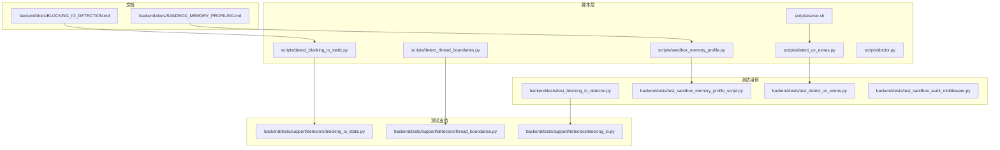
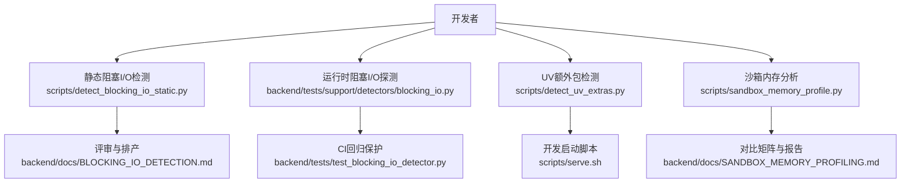
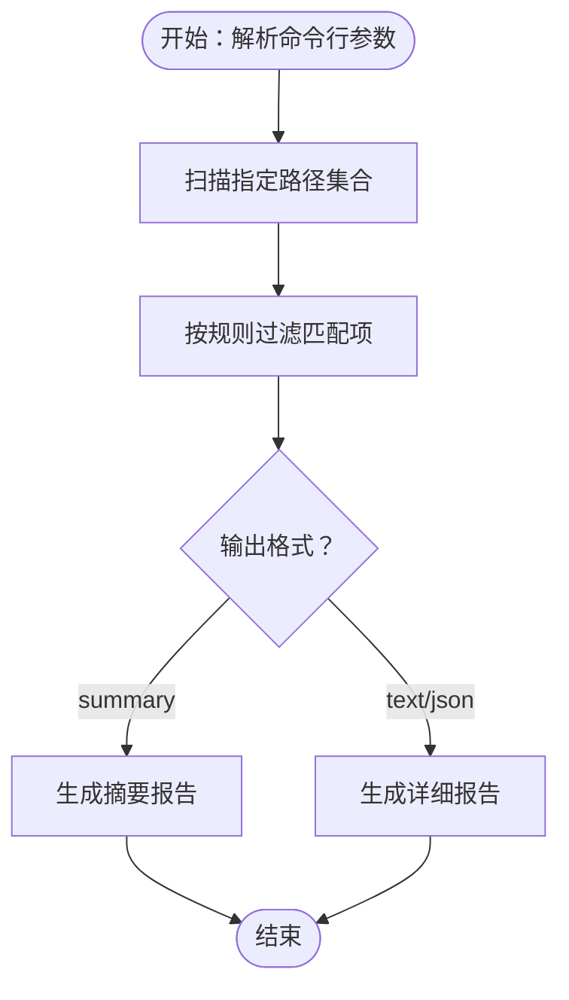
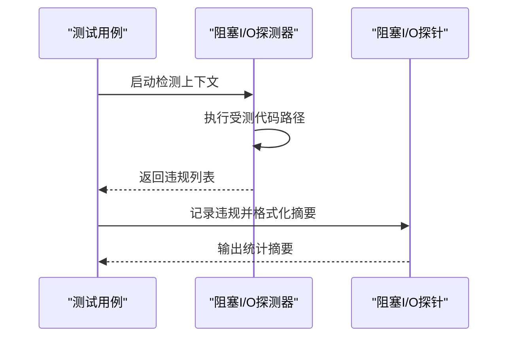
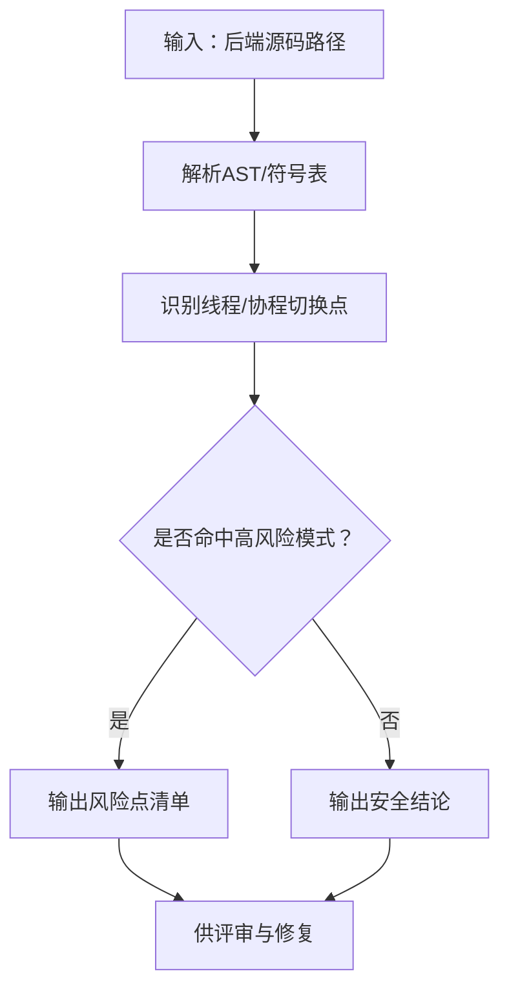
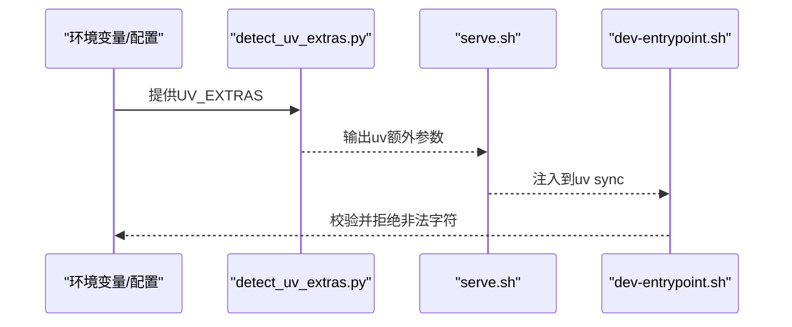
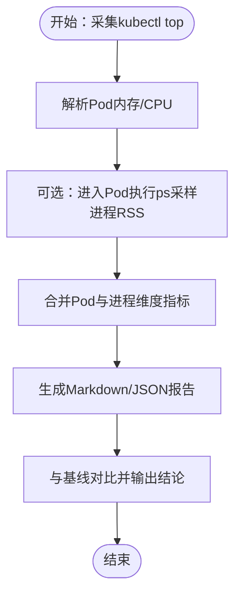
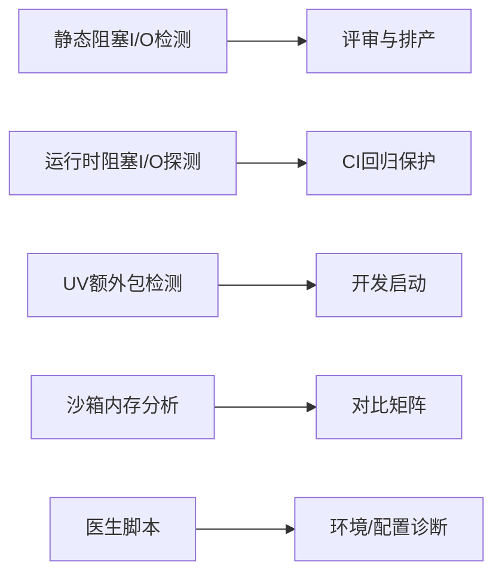

# 调试与性能分析

<cite>
**本文引用的文件**
- [scripts/detect_blocking_io_static.py](file://scripts/detect_blocking_io_static.py)
- [backend/docs/BLOCKING_IO_DETECTION.md](file://backend/docs/BLOCKING_IO_DETECTION.md)
- [backend/tests/support/detectors/blocking_io_static.py](file://backend/tests/support/detectors/blocking_io_static.py)
- [backend/tests/support/detectors/blocking_io.py](file://backend/tests/support/detectors/blocking_io.py)
- [backend/tests/test_blocking_io_detector.py](file://backend/tests/test_blocking_io_detector.py)
- [scripts/detect_thread_boundaries.py](file://scripts/detect_thread_boundaries.py)
- [backend/tests/support/detectors/thread_boundaries.py](file://backend/tests/support/detectors/thread_boundaries.py)
- [scripts/detect_uv_extras.py](file://scripts/detect_uv_extras.py)
- [backend/tests/test_detect_uv_extras.py](file://backend/tests/test_detect_uv_extras.py)
- [scripts/serve.sh](file://scripts/serve.sh)
- [docker/dev-entrypoint.sh](file://docker/dev-entrypoint.sh)
- [backend/docs/SANDBOX_MEMORY_PROFILING.md](file://backend/docs/SANDBOX_MEMORY_PROFILING.md)
- [scripts/sandbox_memory_profile.py](file://scripts/sandbox_memory_profile.py)
- [backend/tests/test_sandbox_memory_profile_script.py](file://backend/tests/test_sandbox_memory_profile_script.py)
- [scripts/doctor.py](file://scripts/doctor.py)
- [backend/tests/test_sandbox_audit_middleware.py](file://backend/tests/test_sandbox_audit_middleware.py)
</cite>

## 目录
1. [简介](#简介)
2. [项目结构](#项目结构)
3. [核心组件](#核心组件)
4. [架构总览](#架构总览)
5. [详细组件分析](#详细组件分析)
6. [依赖关系分析](#依赖关系分析)
7. [性能考量](#性能考量)
8. [故障排查指南](#故障排查指南)
9. [结论](#结论)
10. [附录](#附录)

## 简介
本文件面向deer-flow的调试与性能分析场景，系统性介绍以下能力与实践：
- 阻塞I/O检测：静态扫描与运行时探测双轨并行，覆盖CI回归保护与开发期发现。
- 线程边界分析：识别异步/同步线程切换风险点，避免事件循环被阻塞。
- UV额外包检测：在开发启动阶段解析并注入可选依赖，减少重复安装与环境漂移。
- 内存泄漏与沙箱内存分析：提供可复现的基线采集流程与对比矩阵。
- 运行时性能监控与日志分析：结合中间件与审计策略定位瓶颈。
- 常见问题排查流程与解决方案。

## 项目结构
与调试和性能分析直接相关的目录与文件包括：
- scripts/：命令行辅助脚本（阻塞I/O静态检测、线程边界检测、UV额外包检测、沙箱内存分析、健康检查等）
- backend/docs/：官方文档（阻塞I/O检测使用说明、沙箱内存分析指南）
- backend/tests/support/detectors/：测试支持的检测器实现（静态阻塞I/O、线程边界）
- backend/tests/：单元测试与集成测试（阻塞I/O探测器、UV额外包、沙箱内存分析脚本、沙箱审计中间件）

**图表来源**
- [scripts/detect_blocking_io_static.py:1-23](file://scripts/detect_blocking_io_static.py#L1-L23)
- [scripts/detect_thread_boundaries.py:1-23](file://scripts/detect_thread_boundaries.py#L1-L23)
- [scripts/detect_uv_extras.py](file://scripts/detect_uv_extras.py)
- [scripts/sandbox_memory_profile.py:286-320](file://scripts/sandbox_memory_profile.py#L286-L320)
- [scripts/serve.sh:347-366](file://scripts/serve.sh#L347-L366)
- [backend/docs/BLOCKING_IO_DETECTION.md:1-61](file://backend/docs/BLOCKING_IO_DETECTION.md#L1-L61)
- [backend/docs/SANDBOX_MEMORY_PROFILING.md:1-77](file://backend/docs/SANDBOX_MEMORY_PROFILING.md#L1-L77)
- [backend/tests/support/detectors/blocking_io_static.py:850-877](file://backend/tests/support/detectors/blocking_io_static.py#L850-L877)
- [backend/tests/support/detectors/blocking_io.py:191-227](file://backend/tests/support/detectors/blocking_io.py#L191-L227)
- [backend/tests/test_blocking_io_detector.py:153-190](file://backend/tests/test_blocking_io_detector.py#L153-L190)
- [backend/tests/test_detect_uv_extras.py:1-59](file://backend/tests/test_detect_uv_extras.py#L1-L59)
- [backend/tests/test_sandbox_memory_profile_script.py:1-45](file://backend/tests/test_sandbox_memory_profile_script.py#L1-L45)
- [backend/tests/test_sandbox_audit_middleware.py:704-716](file://backend/tests/test_sandbox_audit_middleware.py#L704-L716)

**章节来源**
- [scripts/detect_blocking_io_static.py:1-23](file://scripts/detect_blocking_io_static.py#L1-L23)
- [scripts/detect_thread_boundaries.py:1-23](file://scripts/detect_thread_boundaries.py#L1-L23)
- [scripts/detect_uv_extras.py](file://scripts/detect_uv_extras.py)
- [scripts/sandbox_memory_profile.py:286-320](file://scripts/sandbox_memory_profile.py#L286-L320)
- [scripts/serve.sh:347-366](file://scripts/serve.sh#L347-L366)
- [backend/docs/BLOCKING_IO_DETECTION.md:1-61](file://backend/docs/BLOCKING_IO_DETECTION.md#L1-L61)
- [backend/docs/SANDBOX_MEMORY_PROFILING.md:1-77](file://backend/docs/SANDBOX_MEMORY_PROFILING.md#L1-L77)
- [backend/tests/support/detectors/blocking_io_static.py:850-877](file://backend/tests/support/detectors/blocking_io_static.py#L850-L877)
- [backend/tests/support/detectors/blocking_io.py:191-227](file://backend/tests/support/detectors/blocking_io.py#L191-L227)
- [backend/tests/test_blocking_io_detector.py:153-190](file://backend/tests/test_blocking_io_detector.py#L153-L190)
- [backend/tests/test_detect_uv_extras.py:1-59](file://backend/tests/test_detect_uv_extras.py#L1-L59)
- [backend/tests/test_sandbox_memory_profile_script.py:1-45](file://backend/tests/test_sandbox_memory_profile_script.py#L1-L45)
- [backend/tests/test_sandbox_audit_middleware.py:704-716](file://backend/tests/test_sandbox_audit_middleware.py#L704-L716)

## 核心组件
- 静态阻塞I/O检测器：扫描后端源码，识别可能阻塞事件循环的同步调用，输出优先级化候选清单，用于评审与排产。
- 运行时阻塞I/O探测器：在CI中对特定生产路径进行阻塞I/O回归保护，失败即触发修复。
- 线程边界分析器：识别异步/同步线程切换风险点，帮助定位事件循环被阻塞的调用链。
- UV额外包检测器：从环境变量或配置解析可选依赖，生成uv同步参数，避免每次重启丢失可选依赖。
- 沙箱内存分析器：采集沙箱容器内存与进程RSS快照，形成可复现的对比矩阵，支撑运行时性能评估。
- 医生脚本（doctor）：集中式诊断入口，汇总环境、依赖、配置与运行状态，便于快速定位问题。

**章节来源**
- [backend/docs/BLOCKING_IO_DETECTION.md:1-61](file://backend/docs/BLOCKING_IO_DETECTION.md#L1-L61)
- [backend/docs/SANDBOX_MEMORY_PROFILING.md:1-77](file://backend/docs/SANDBOX_MEMORY_PROFILING.md#L1-L77)
- [scripts/detect_blocking_io_static.py:1-23](file://scripts/detect_blocking_io_static.py#L1-L23)
- [scripts/detect_thread_boundaries.py:1-23](file://scripts/detect_thread_boundaries.py#L1-L23)
- [scripts/detect_uv_extras.py](file://scripts/detect_uv_extras.py)
- [scripts/sandbox_memory_profile.py:286-320](file://scripts/sandbox_memory_profile.py#L286-L320)
- [scripts/doctor.py](file://scripts/doctor.py)

## 架构总览
下图展示“静态检测—运行时探测—开发启动—沙箱分析”的闭环调试与性能分析路径：

**图表来源**
- [scripts/detect_blocking_io_static.py:1-23](file://scripts/detect_blocking_io_static.py#L1-L23)
- [backend/docs/BLOCKING_IO_DETECTION.md:1-61](file://backend/docs/BLOCKING_IO_DETECTION.md#L1-L61)
- [backend/tests/support/detectors/blocking_io.py:191-227](file://backend/tests/support/detectors/blocking_io.py#L191-L227)
- [backend/tests/test_blocking_io_detector.py:153-190](file://backend/tests/test_blocking_io_detector.py#L153-L190)
- [scripts/detect_uv_extras.py](file://scripts/detect_uv_extras.py)
- [scripts/serve.sh:347-366](file://scripts/serve.sh#L347-L366)
- [scripts/sandbox_memory_profile.py:286-320](file://scripts/sandbox_memory_profile.py#L286-L320)
- [backend/docs/SANDBOX_MEMORY_PROFILING.md:1-77](file://backend/docs/SANDBOX_MEMORY_PROFILING.md#L1-L77)

## 详细组件分析

### 静态阻塞I/O检测器
- 功能概述：扫描后端源码，识别可能阻塞事件循环的同步调用，输出优先级化候选清单，供评审与排产。
- 关键实现位置：
  - CLI包装器：[scripts/detect_blocking_io_static.py:1-23](file://scripts/detect_blocking_io_static.py#L1-L23)
  - 解析器与主流程：[backend/tests/support/detectors/blocking_io_static.py:850-877](file://backend/tests/support/detectors/blocking_io_static.py#L850-L877)
  - 使用说明文档：[backend/docs/BLOCKING_IO_DETECTION.md:1-61](file://backend/docs/BLOCKING_IO_DETECTION.md#L1-L61)

**图表来源**
- [backend/tests/support/detectors/blocking_io_static.py:850-877](file://backend/tests/support/detectors/blocking_io_static.py#L850-L877)

**章节来源**
- [scripts/detect_blocking_io_static.py:1-23](file://scripts/detect_blocking_io_static.py#L1-L23)
- [backend/tests/support/detectors/blocking_io_static.py:850-877](file://backend/tests/support/detectors/blocking_io_static.py#L850-L877)
- [backend/docs/BLOCKING_IO_DETECTION.md:1-61](file://backend/docs/BLOCKING_IO_DETECTION.md#L1-L61)

### 运行时阻塞I/O探测器
- 功能概述：在CI中对特定生产路径进行阻塞I/O回归保护，失败即触发修复。
- 关键实现位置：
  - 探测器主体：[backend/tests/support/detectors/blocking_io.py:191-227](file://backend/tests/support/detectors/blocking_io.py#L191-L227)
  - 测试用例与断言：[backend/tests/test_blocking_io_detector.py:153-190](file://backend/tests/test_blocking_io_detector.py#L153-L190)
  - 使用说明文档：[backend/docs/BLOCKING_IO_DETECTION.md:41-56](file://backend/docs/BLOCKING_IO_DETECTION.md#L41-L56)

**图表来源**
- [backend/tests/support/detectors/blocking_io.py:191-227](file://backend/tests/support/detectors/blocking_io.py#L191-L227)
- [backend/tests/test_blocking_io_detector.py:153-190](file://backend/tests/test_blocking_io_detector.py#L153-L190)

**章节来源**
- [backend/tests/support/detectors/blocking_io.py:191-227](file://backend/tests/support/detectors/blocking_io.py#L191-L227)
- [backend/tests/test_blocking_io_detector.py:153-190](file://backend/tests/test_blocking_io_detector.py#L153-L190)
- [backend/docs/BLOCKING_IO_DETECTION.md:41-56](file://backend/docs/BLOCKING_IO_DETECTION.md#L41-L56)

### 线程边界分析器
- 功能概述：识别异步/同步线程切换风险点，帮助定位事件循环被阻塞的调用链。
- 关键实现位置：
  - CLI包装器：[scripts/detect_thread_boundaries.py:1-23](file://scripts/detect_thread_boundaries.py#L1-L23)
  - 实现主体：[backend/tests/support/detectors/thread_boundaries.py](file://backend/tests/support/detectors/thread_boundaries.py)

**图表来源**
- [scripts/detect_thread_boundaries.py:1-23](file://scripts/detect_thread_boundaries.py#L1-L23)
- [backend/tests/support/detectors/thread_boundaries.py](file://backend/tests/support/detectors/thread_boundaries.py)

**章节来源**
- [scripts/detect_thread_boundaries.py:1-23](file://scripts/detect_thread_boundaries.py#L1-L23)
- [backend/tests/support/detectors/thread_boundaries.py](file://backend/tests/support/detectors/thread_boundaries.py)

### UV额外包检测器
- 功能概述：从环境变量或配置解析可选依赖，生成uv同步参数，避免每次重启丢失可选依赖。
- 关键实现位置：
  - 检测脚本：[scripts/detect_uv_extras.py](file://scripts/detect_uv_extras.py)
  - 单元测试：[backend/tests/test_detect_uv_extras.py:1-59](file://backend/tests/test_detect_uv_extras.py#L1-L59)
  - 开发启动脚本集成：[scripts/serve.sh:347-366](file://scripts/serve.sh#L347-L366)
  - 容器启动脚本集成：[docker/dev-entrypoint.sh:31-65](file://docker/dev-entrypoint.sh#L31-L65)

**图表来源**
- [scripts/detect_uv_extras.py](file://scripts/detect_uv_extras.py)
- [backend/tests/test_detect_uv_extras.py:1-59](file://backend/tests/test_detect_uv_extras.py#L1-L59)
- [scripts/serve.sh:347-366](file://scripts/serve.sh#L347-L366)
- [docker/dev-entrypoint.sh:31-65](file://docker/dev-entrypoint.sh#L31-L65)

**章节来源**
- [scripts/detect_uv_extras.py](file://scripts/detect_uv_extras.py)
- [backend/tests/test_detect_uv_extras.py:1-59](file://backend/tests/test_detect_uv_extras.py#L1-L59)
- [scripts/serve.sh:347-366](file://scripts/serve.sh#L347-L366)
- [docker/dev-entrypoint.sh:31-65](file://docker/dev-entrypoint.sh#L31-L65)

### 沙箱内存分析器
- 功能概述：采集沙箱容器内存与进程RSS快照，形成可复现的对比矩阵，支撑运行时性能评估。
- 关键实现位置：
  - 分析脚本：[scripts/sandbox_memory_profile.py:286-320](file://scripts/sandbox_memory_profile.py#L286-L320)
  - 单元测试：[backend/tests/test_sandbox_memory_profile_script.py:1-45](file://backend/tests/test_sandbox_memory_profile_script.py#L1-L45)
  - 使用说明文档：[backend/docs/SANDBOX_MEMORY_PROFILING.md:1-77](file://backend/docs/SANDBOX_MEMORY_PROFILING.md#L1-L77)

**图表来源**
- [scripts/sandbox_memory_profile.py:286-320](file://scripts/sandbox_memory_profile.py#L286-L320)
- [backend/tests/test_sandbox_memory_profile_script.py:1-45](file://backend/tests/test_sandbox_memory_profile_script.py#L1-L45)
- [backend/docs/SANDBOX_MEMORY_PROFILING.md:1-77](file://backend/docs/SANDBOX_MEMORY_PROFILING.md#L1-L77)

**章节来源**
- [scripts/sandbox_memory_profile.py:286-320](file://scripts/sandbox_memory_profile.py#L286-L320)
- [backend/tests/test_sandbox_memory_profile_script.py:1-45](file://backend/tests/test_sandbox_memory_profile_script.py#L1-L45)
- [backend/docs/SANDBOX_MEMORY_PROFILING.md:1-77](file://backend/docs/SANDBOX_MEMORY_PROFILING.md#L1-L77)

### 医生脚本（doctor）
- 功能概述：集中式诊断入口，汇总环境、依赖、配置与运行状态，便于快速定位问题。
- 关键实现位置：
  - 医生脚本：[scripts/doctor.py](file://scripts/doctor.py)

**章节来源**
- [scripts/doctor.py](file://scripts/doctor.py)

## 依赖关系分析
- 组件耦合与内聚：
  - 静态检测器与运行时探测器互补：前者发现候选，后者保护已知路径。
  - UV额外包检测贯穿开发启动链路，确保一致性。
  - 沙箱内存分析器独立于业务逻辑，仅依赖Kubernetes与kubectl。
- 外部依赖与集成点：
  - kubectl：沙箱内存分析依赖其输出解析。
  - uv：额外包检测与开发启动集成。
  - pytest：阻塞I/O探测器与测试用例集成。

**图表来源**
- [scripts/detect_blocking_io_static.py:1-23](file://scripts/detect_blocking_io_static.py#L1-L23)
- [backend/tests/support/detectors/blocking_io.py:191-227](file://backend/tests/support/detectors/blocking_io.py#L191-L227)
- [scripts/detect_uv_extras.py](file://scripts/detect_uv_extras.py)
- [scripts/sandbox_memory_profile.py:286-320](file://scripts/sandbox_memory_profile.py#L286-L320)
- [scripts/doctor.py](file://scripts/doctor.py)

**章节来源**
- [scripts/detect_blocking_io_static.py:1-23](file://scripts/detect_blocking_io_static.py#L1-L23)
- [backend/tests/support/detectors/blocking_io.py:191-227](file://backend/tests/support/detectors/blocking_io.py#L191-L227)
- [scripts/detect_uv_extras.py](file://scripts/detect_uv_extras.py)
- [scripts/sandbox_memory_profile.py:286-320](file://scripts/sandbox_memory_profile.py#L286-L320)
- [scripts/doctor.py](file://scripts/doctor.py)

## 性能考量
- 阻塞I/O规避：
  - 使用静态检测器提前发现潜在阻塞点；对高优先级候选建立修复计划。
  - 在CI中启用运行时探测，确保关键路径不引入阻塞。
- 线程边界管理：
  - 通过线程边界分析器识别高风险切换点，必要时重构为异步实现或迁移至专用线程池。
- UV额外包一致性：
  - 通过检测器与启动脚本集成，避免每次重启丢失可选依赖，减少环境波动带来的性能回退。
- 沙箱内存基线：
  - 建立可复现的基线快照，对比不同后端或并发水平下的内存表现，指导资源规划与优化。

[本节为通用指导，无需具体文件分析]

## 故障排查指南
- 阻塞I/O问题
  - 现象：事件循环卡顿、请求延迟升高。
  - 排查步骤：
    1) 运行静态检测器收集候选清单并评审。
    2) 在CI中运行运行时探测，确认关键路径无阻塞。
    3) 结合日志与中间件指标定位具体调用栈。
  - 参考文件：
    - [backend/docs/BLOCKING_IO_DETECTION.md:1-61](file://backend/docs/BLOCKING_IO_DETECTION.md#L1-L61)
    - [backend/tests/test_blocking_io_detector.py:153-190](file://backend/tests/test_blocking_io_detector.py#L153-L190)

- 线程边界问题
  - 现象：异步任务长时间未完成、CPU占用异常。
  - 排查步骤：
    1) 运行线程边界分析器，识别高风险切换点。
    2) 将阻塞操作迁移到线程池或改为异步实现。
  - 参考文件：
    - [scripts/detect_thread_boundaries.py:1-23](file://scripts/detect_thread_boundaries.py#L1-L23)
    - [backend/tests/support/detectors/thread_boundaries.py](file://backend/tests/support/detectors/thread_boundaries.py)

- UV额外包缺失
  - 现象：开发启动频繁重装依赖、功能不可用。
  - 排查步骤：
    1) 检查UV_EXTRAS环境变量与配置文件。
    2) 运行UV额外包检测器，确认解析结果。
    3) 查看启动脚本输出，确认uv同步参数正确注入。
  - 参考文件：
    - [scripts/detect_uv_extras.py](file://scripts/detect_uv_extras.py)
    - [backend/tests/test_detect_uv_extras.py:1-59](file://backend/tests/test_detect_uv_extras.py#L1-L59)
    - [scripts/serve.sh:347-366](file://scripts/serve.sh#L347-L366)
    - [docker/dev-entrypoint.sh:31-65](file://docker/dev-entrypoint.sh#L31-L65)

- 沙箱内存异常
  - 现象：沙箱内存持续增长、并发下OOM。
  - 排查步骤：
    1) 运行沙箱内存分析器，采集基线快照。
    2) 对比不同阶段与并发水平的差异。
    3) 检查中间件与工具链是否存在资源泄漏。
  - 参考文件：
    - [backend/docs/SANDBOX_MEMORY_PROFILING.md:1-77](file://backend/docs/SANDBOX_MEMORY_PROFILING.md#L1-L77)
    - [scripts/sandbox_memory_profile.py:286-320](file://scripts/sandbox_memory_profile.py#L286-L320)
    - [backend/tests/test_sandbox_memory_profile_script.py:1-45](file://backend/tests/test_sandbox_memory_profile_script.py#L1-L45)
    - [backend/tests/test_sandbox_audit_middleware.py:704-716](file://backend/tests/test_sandbox_audit_middleware.py#L704-L716)

- 医生脚本综合诊断
  - 使用医生脚本一次性收集环境、依赖、配置与运行状态，快速定位问题根因。
  - 参考文件：
    - [scripts/doctor.py](file://scripts/doctor.py)

**章节来源**
- [backend/docs/BLOCKING_IO_DETECTION.md:1-61](file://backend/docs/BLOCKING_IO_DETECTION.md#L1-L61)
- [backend/tests/test_blocking_io_detector.py:153-190](file://backend/tests/test_blocking_io_detector.py#L153-L190)
- [scripts/detect_thread_boundaries.py:1-23](file://scripts/detect_thread_boundaries.py#L1-L23)
- [backend/tests/support/detectors/thread_boundaries.py](file://backend/tests/support/detectors/thread_boundaries.py)
- [scripts/detect_uv_extras.py](file://scripts/detect_uv_extras.py)
- [backend/tests/test_detect_uv_extras.py:1-59](file://backend/tests/test_detect_uv_extras.py#L1-L59)
- [scripts/serve.sh:347-366](file://scripts/serve.sh#L347-L366)
- [docker/dev-entrypoint.sh:31-65](file://docker/dev-entrypoint.sh#L31-L65)
- [backend/docs/SANDBOX_MEMORY_PROFILING.md:1-77](file://backend/docs/SANDBOX_MEMORY_PROFILING.md#L1-L77)
- [scripts/sandbox_memory_profile.py:286-320](file://scripts/sandbox_memory_profile.py#L286-L320)
- [backend/tests/test_sandbox_memory_profile_script.py:1-45](file://backend/tests/test_sandbox_memory_profile_script.py#L1-L45)
- [backend/tests/test_sandbox_audit_middleware.py:704-716](file://backend/tests/test_sandbox_audit_middleware.py#L704-L716)
- [scripts/doctor.py](file://scripts/doctor.py)

## 结论
deer-flow提供了从静态发现到运行时保护、从开发启动一致性到沙箱运行时性能的全链路调试与性能分析能力。建议在日常开发中：
- 使用静态阻塞I/O检测器定期扫描，建立候选清单并评审。
- 在CI中启用运行时探测，防止回归。
- 通过UV额外包检测器与启动脚本集成，保持开发环境一致性。
- 建立沙箱内存基线，持续监控并发与资源使用。
- 使用医生脚本进行综合诊断，快速定位问题。

[本节为总结性内容，无需具体文件分析]

## 附录
- 快速参考
  - 静态阻塞I/O检测：[backend/docs/BLOCKING_IO_DETECTION.md:1-61](file://backend/docs/BLOCKING_IO_DETECTION.md#L1-L61)
  - 沙箱内存分析：[backend/docs/SANDBOX_MEMORY_PROFILING.md:1-77](file://backend/docs/SANDBOX_MEMORY_PROFILING.md#L1-L77)
  - 医生脚本：[scripts/doctor.py](file://scripts/doctor.py)

[本节为补充信息，无需具体文件分析]