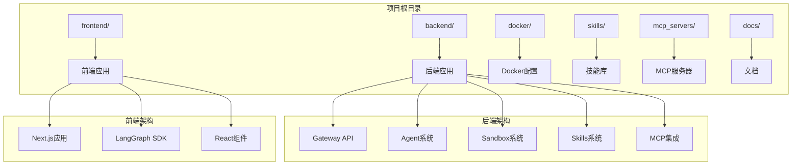
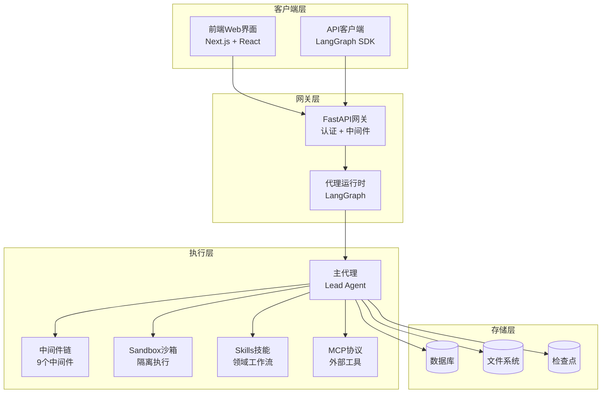
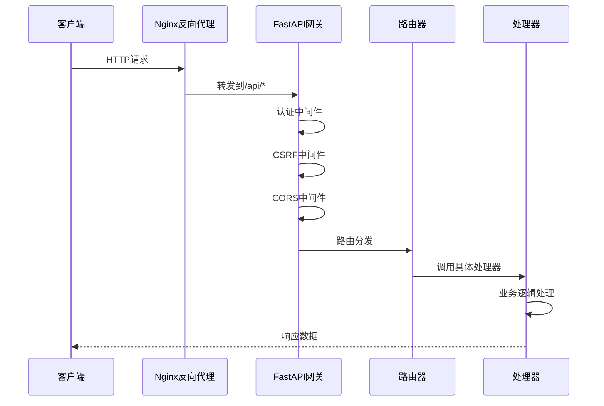
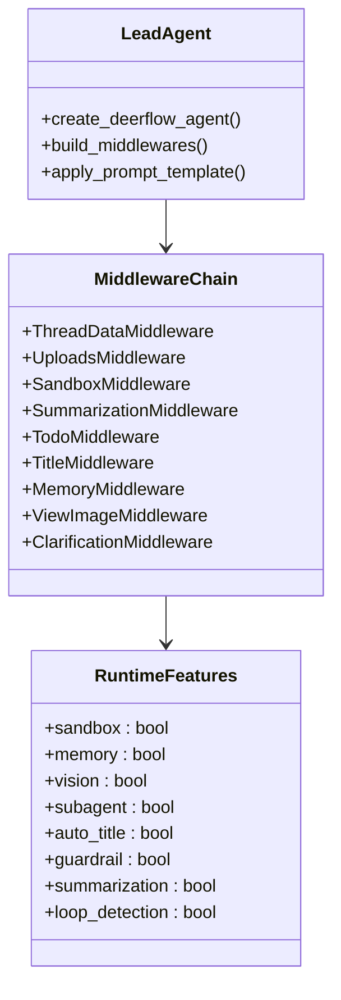
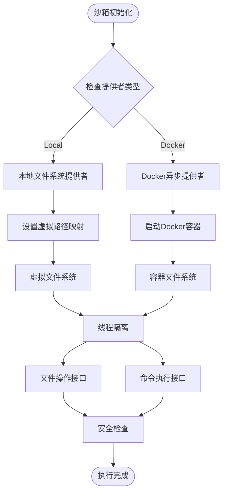
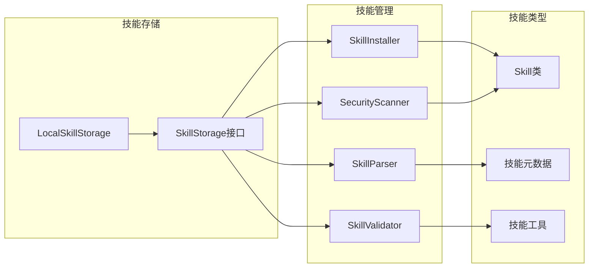
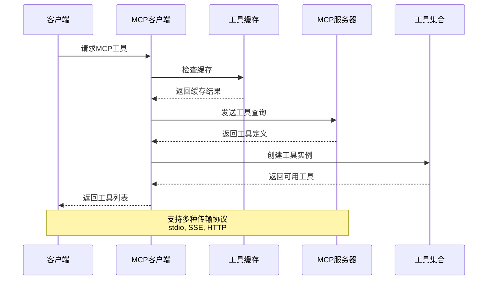
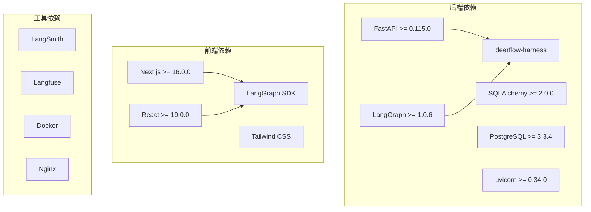
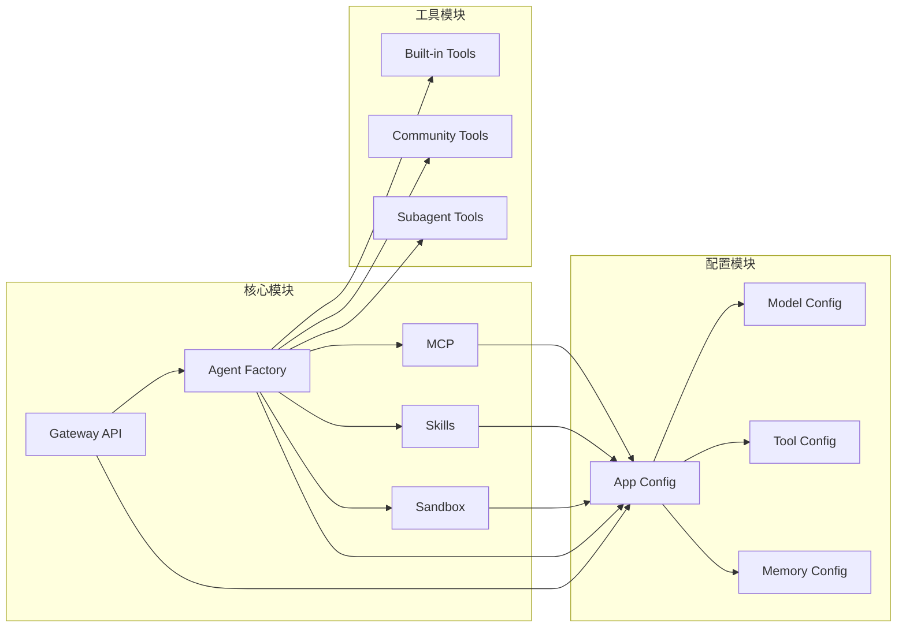

# 项目结构说明

<cite>
**本文档引用的文件**
- [backend/pyproject.toml](file://backend/pyproject.toml)
- [frontend/package.json](file://frontend/package.json)
- [docker/docker-compose.yaml](file://docker/docker-compose.yaml)
- [backend/README.md](file://backend/README.md)
- [frontend/README.md](file://frontend/README.md)
- [backend/app/gateway/app.py](file://backend/app/gateway/app.py)
- [backend/packages/harness/deerflow/client.py](file://backend/packages/harness/deerflow/client.py)
- [backend/packages/harness/deerflow/config/app_config.py](file://backend/packages/harness/deerflow/config/app_config.py)
- [backend/packages/harness/deerflow/agents/factory.py](file://backend/packages/harness/deerflow/agents/factory.py)
- [backend/packages/harness/deerflow/sandbox/sandbox.py](file://backend/packages/harness/deerflow/sandbox/sandbox.py)
- [backend/packages/harness/deerflow/skills/__init__.py](file://backend/packages/harness/deerflow/skills/__init__.py)
- [backend/packages/harness/deerflow/mcp/__init__.py](file://backend/packages/harness/deerflow/mcp/__init__.py)
- [frontend/src/core/api/api-client.ts](file://frontend/src/core/api/api-client.ts)
</cite>

## 目录
1. [简介](#简介)
2. [项目结构概览](#项目结构概览)
3. [核心模块职责](#核心模块职责)
4. [系统架构总览](#系统架构总览)
5. [详细组件分析](#详细组件分析)
6. [依赖关系分析](#依赖关系分析)
7. [性能考虑](#性能考虑)
8. [故障排除指南](#故障排除指南)
9. [结论](#结论)

## 简介

DeerFlow 是一个基于 LangGraph 的 AI 超级代理系统，具备沙箱执行能力、持久化记忆和可扩展工具集成。该项目采用前后端分离架构，后端提供 FastAPI 网关 API 和嵌入式代理运行时，前端提供现代化的 Web 界面。

## 项目结构概览

项目采用多模块工作区结构，主要包含以下核心目录：

**图表来源**
- [backend/README.md:207-248](file://backend/README.md#L207-L248)
- [frontend/README.md:91-126](file://frontend/README.md#L91-L126)

**章节来源**
- [backend/README.md:207-248](file://backend/README.md#L207-L248)
- [frontend/README.md:91-126](file://frontend/README.md#L91-L126)

## 核心模块职责

### 后端模块 (backend/)

后端采用分层架构，主要包含以下核心模块：

#### Gateway API 模块
- **职责**: 提供 FastAPI 应用程序入口点，管理所有 REST API 路由
- **功能**: 认证中间件、CORS 处理、路由注册、健康检查
- **位置**: `backend/app/gateway/`

#### Agent 系统模块
- **职责**: 实现 LangGraph 主代理（Lead Agent）及其中间件链
- **功能**: 动态模型选择、中间件处理、工具系统、子代理委托
- **位置**: `backend/packages/harness/deerflow/agents/`

#### Sandbox 系统模块
- **职责**: 提供隔离的代码执行环境
- **功能**: 文件操作、命令执行、路径虚拟化、安全限制
- **位置**: `backend/packages/harness/deerflow/sandbox/`

#### Skills 系统模块
- **职责**: 管理领域特定的工作流程和技能
- **功能**: 技能发现、加载、权限控制、安全扫描
- **位置**: `backend/packages/harness/deerflow/skills/`

#### MCP 集成模块
- **职责**: 实现 Model Context Protocol 协议支持
- **功能**: MCP 服务器配置、工具缓存、OAuth 支持
- **位置**: `backend/packages/harness/deerflow/mcp/`

#### 配置系统模块
- **职责**: 统一的应用配置管理
- **功能**: YAML 配置解析、环境变量处理、配置热重载
- **位置**: `backend/packages/harness/deerflow/config/`

### 前端模块 (frontend/)

前端采用 Next.js 16 App Router 架构：

#### 核心业务逻辑
- **职责**: 应用状态管理、API 客户端、数据流处理
- **功能**: 线程管理、消息处理、设置管理、国际化
- **位置**: `frontend/src/core/`

#### UI 组件系统
- **职责**: 可复用的 React 组件库
- **功能**: 工作空间组件、UI 基础组件、AI 元素
- **位置**: `frontend/src/components/`

#### 页面路由系统
- **职责**: Next.js App Router 页面定义
- **功能**: 主页、聊天列表、新聊天、具体聊天页面
- **位置**: `frontend/src/app/`

### Docker 部署模块 (docker/)

提供完整的容器化部署解决方案：

#### 服务编排
- **nginx**: 反向代理，统一端口 2026
- **gateway**: FastAPI 网关 API，端口 8001
- **frontend**: Next.js 生产服务器
- **postgres**: 可选的数据库服务
- **provisioner**: 可选的 Kubernetes 沙箱供应器

#### 环境配置
- **配置文件**: `docker-compose.yaml`
- **Nginx 配置**: `nginx.conf`
- **开发入口脚本**: `dev-entrypoint.sh`

### 技能模块 (skills/)

提供丰富的预构建技能库：

#### 技能分类
- **学术论文评审**: 学术论文分析和评审
- **前端设计**: 前端界面设计生成
- **数据分析**: 数据可视化和分析
- **内容创作**: 多种类型的内容生成
- **技术工具**: 编程、搜索、图像生成等

#### 技能格式
- **SKILL.md**: 技能描述和配置
- **templates/**: 报告模板
- **scripts/**: 执行脚本
- **references/**: 参考资料

## 系统架构总览

**图表来源**
- [backend/README.md:7-36](file://backend/README.md#L7-L36)
- [backend/app/gateway/app.py:241-413](file://backend/app/gateway/app.py#L241-L413)

## 详细组件分析

### Gateway API 组件

Gateway API 是整个系统的入口点，负责请求路由、认证和中间件处理：

**图表来源**
- [backend/app/gateway/app.py:334-398](file://backend/app/gateway/app.py#L334-L398)

**章节来源**
- [backend/app/gateway/app.py:241-413](file://backend/app/gateway/app.py#L241-L413)

### Agent 系统组件

主代理系统采用中间件链模式，确保横切关注点的清晰分离：

**图表来源**
- [backend/packages/harness/deerflow/agents/factory.py:61-147](file://backend/packages/harness/deerflow/agents/factory.py#L61-L147)

**章节来源**
- [backend/packages/harness/deerflow/agents/factory.py:155-298](file://backend/packages/harness/deerflow/agents/factory.py#L155-L298)

### Sandbox 系统组件

沙箱系统提供隔离的执行环境，支持本地文件系统和 Docker 两种模式：

**图表来源**
- [backend/packages/harness/deerflow/sandbox/sandbox.py:6-113](file://backend/packages/harness/deerflow/sandbox/sandbox.py#L6-L113)

**章节来源**
- [backend/packages/harness/deerflow/sandbox/sandbox.py:1-113](file://backend/packages/harness/deerflow/sandbox/sandbox.py#L1-L113)

### Skills 系统组件

技能系统提供领域特定的工作流程和工具：

**图表来源**
- [backend/packages/harness/deerflow/skills/__init__.py:1-18](file://backend/packages/harness/deerflow/skills/__init__.py#L1-L18)

**章节来源**
- [backend/packages/harness/deerflow/skills/__init__.py:1-18](file://backend/packages/harness/deerflow/skills/__init__.py#L1-L18)

### MCP 集成组件

MCP（Model Context Protocol）集成提供外部工具和服务访问：

**图表来源**
- [backend/packages/harness/deerflow/mcp/__init__.py:1-19](file://backend/packages/harness/deerflow/mcp/__init__.py#L1-L19)

**章节来源**
- [backend/packages/harness/deerflow/mcp/__init__.py:1-19](file://backend/packages/harness/deerflow/mcp/__init__.py#L1-L19)

## 依赖关系分析

### 技术栈依赖

**图表来源**
- [backend/pyproject.toml:7-29](file://backend/pyproject.toml#L7-L29)
- [frontend/package.json:21-92](file://frontend/package.json#L21-L92)

### 模块间依赖

**图表来源**
- [backend/packages/harness/deerflow/config/app_config.py:90-154](file://backend/packages/harness/deerflow/config/app_config.py#L90-L154)
- [backend/packages/harness/deerflow/agents/factory.py:155-298](file://backend/packages/harness/deerflow/agents/factory.py#L155-L298)

**章节来源**
- [backend/pyproject.toml:1-58](file://backend/pyproject.toml#L1-L58)
- [frontend/package.json:1-118](file://frontend/package.json#L1-L118)

## 性能考虑

### 并发处理
- **异步沙箱**: 使用 AioSandboxProvider 支持非阻塞的异步执行
- **线程池管理**: 子代理执行使用后台线程池，最大并发 3 个
- **内存优化**: 内存系统采用去抖动更新机制，减少 LLM 调用频率

### 缓存策略
- **tiktoken 缓存**: 预热编码缓存避免首次请求阻塞
- **MCP 工具缓存**: 工具定义缓存减少重复查询
- **配置热重载**: 支持配置文件变更自动重载

### 资源管理
- **文件锁机制**: 沙箱文件写入使用锁机制保证并发安全
- **虚拟路径映射**: 统一的路径转换避免路径遍历攻击
- **资源清理**: 生命周期管理确保容器和文件系统的正确清理

## 故障排除指南

### 常见问题诊断

#### 启动问题
- **配置文件错误**: 检查 `config.yaml` 格式和必需字段
- **依赖缺失**: 运行 `make install` 安装完整依赖
- **端口冲突**: 确认端口 8001 和 2026 未被占用

#### 运行时问题
- **沙箱执行失败**: 检查 Docker 服务状态和权限
- **技能加载错误**: 验证技能目录结构和权限
- **MCP 连接问题**: 检查 MCP 服务器配置和网络连接

#### 性能问题
- **内存泄漏**: 监控内存使用情况，定期重启服务
- **磁盘空间**: 清理临时文件和日志
- **数据库连接**: 检查连接池配置和超时设置

**章节来源**
- [backend/README.md:376-394](file://backend/README.md#L376-L394)

## 结论

DeerFlow 项目采用清晰的模块化架构，通过前后端分离和容器化部署实现了高度可扩展的 AI 代理系统。核心优势包括：

1. **模块化设计**: 清晰的职责分离和依赖管理
2. **安全性**: 沙箱执行和多重安全检查
3. **可扩展性**: 插件化的技能系统和工具集成
4. **可观测性**: 内置的追踪和监控支持
5. **易用性**: 完整的开发和部署工具链

该架构为 AI 代理系统的开发提供了坚实的基础，支持从个人使用到企业级部署的各种场景。