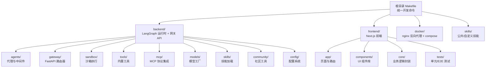
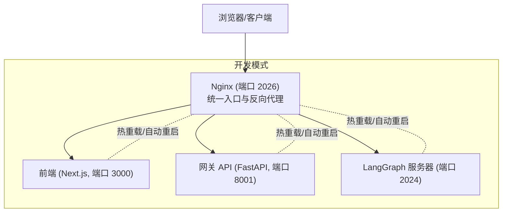
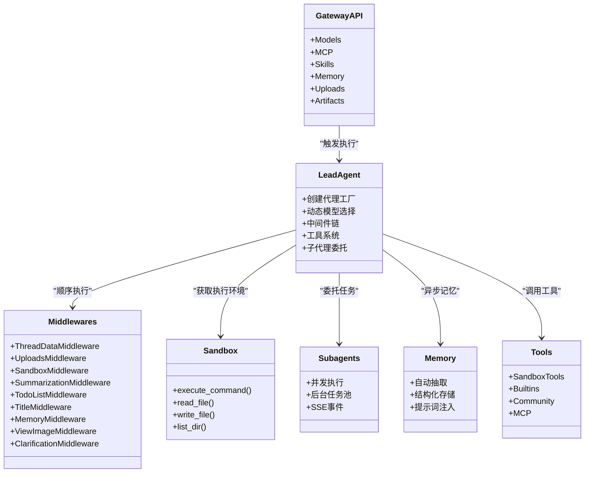
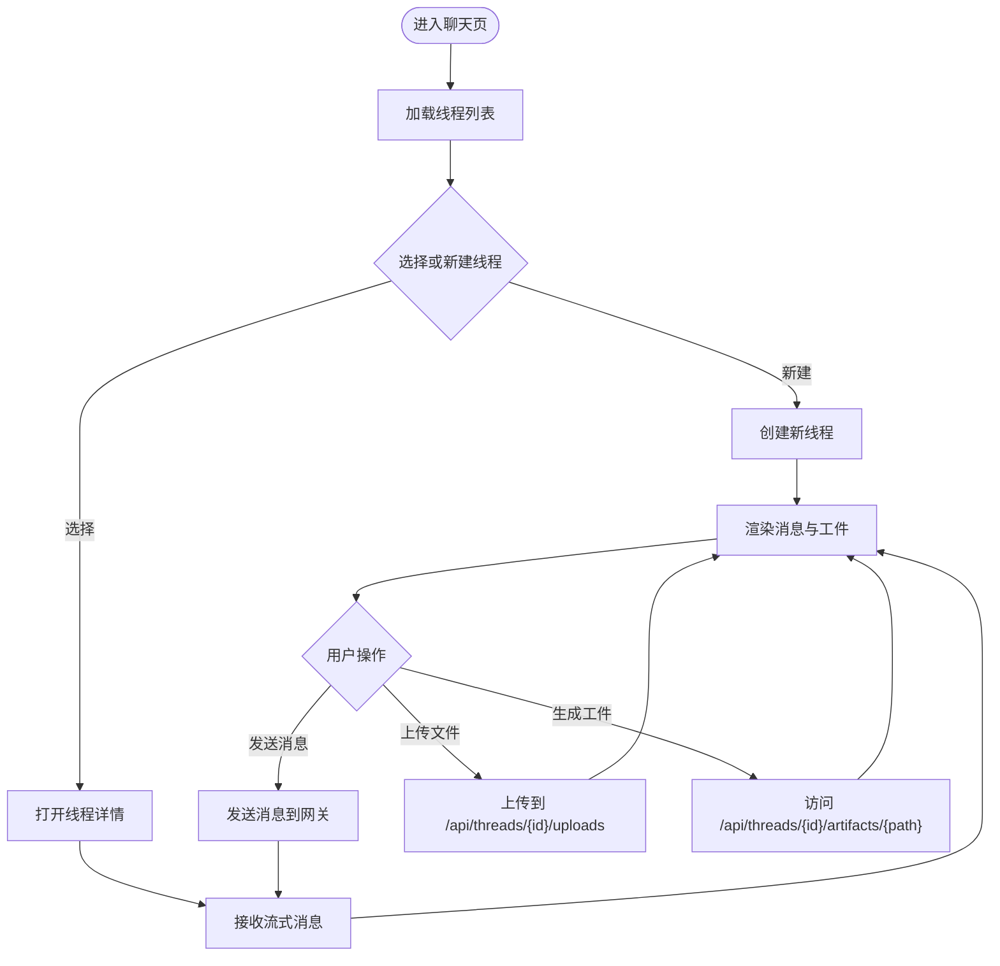
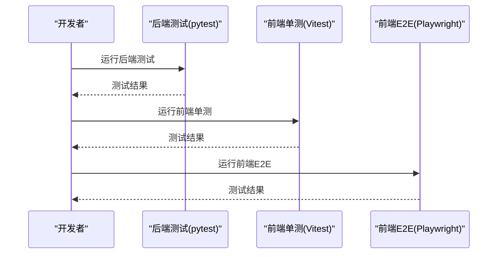
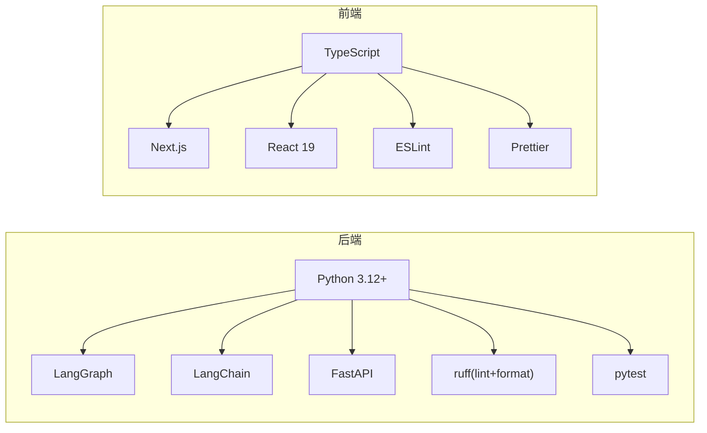

# 开发者指南

<cite>
**本文档引用的文件**
- [CONTRIBUTING.md](file://CONTRIBUTING.md)
- [backend/CONTRIBUTING.md](file://backend/CONTRIBUTING.md)
- [README.md](file://README.md)
- [backend/README.md](file://backend/README.md)
- [frontend/README.md](file://frontend/README.md)
- [Makefile](file://Makefile)
- [backend/Makefile](file://backend/Makefile)
- [frontend/Makefile](file://frontend/Makefile)
- [backend/pyproject.toml](file://backend/pyproject.toml)
- [frontend/package.json](file://frontend/package.json)
- [backend/ruff.toml](file://backend/ruff.toml)
- [frontend/eslint.config.js](file://frontend/eslint.config.js)
- [frontend/prettier.config.js](file://frontend/prettier.config.js)
</cite>

## 目录
1. [简介](#简介)
2. [项目结构](#项目结构)
3. [核心组件](#核心组件)
4. [架构总览](#架构总览)
5. [详细组件分析](#详细组件分析)
6. [依赖关系分析](#依赖关系分析)
7. [性能考量](#性能考量)
8. [故障排查指南](#故障排查指南)
9. [结论](#结论)
10. [附录](#附录)

## 简介
本指南面向 DeerFlow 开发者，提供从环境搭建、开发工作流、测试策略、调试技巧到代码规范与最佳实践的完整说明。内容覆盖后端（Python/FastAPI/LangGraph）、前端（Next.js）以及跨语言工具链，帮助你高效贡献并维护系统。

## 项目结构
DeerFlow 采用多模块仓库组织：根目录包含统一的开发命令、脚本与文档；backend 提供 LangGraph 代理运行时与网关 API；frontend 提供 Web 前端界面；skills 提供可扩展技能包；docker 提供容器化部署与反向代理配置。

图表来源
- [Makefile:1-218](file://Makefile#L1-L218)
- [backend/README.md:215-251](file://backend/README.md#L215-L251)
- [frontend/README.md:91-125](file://frontend/README.md#L91-L125)

章节来源
- [Makefile:1-218](file://Makefile#L1-L218)
- [README.md:222-250](file://README.md#L222-L250)

## 核心组件
- 后端（Python）
  - LangGraph 代理运行时：负责多智能体编排、中间件链路与工具调用。
  - 网关 API（FastAPI）：提供模型、MCP、技能、内存、上传与工件等 REST 接口。
  - 沙箱系统：抽象隔离执行环境，支持本地与容器两种提供者。
  - 工具生态：内置工具、社区工具、MCP 扩展与技能注入。
  - 配置系统：集中管理模型、工具、沙箱、技能、记忆等配置。
- 前端（Next.js）
  - App Router 页面：聊天列表、新建聊天、具体会话页。
  - 核心模块：API 客户端、消息处理、线程管理、设置与国际化。
  - 测试：单元测试（Vitest）与端到端测试（Playwright）。

章节来源
- [backend/README.md:44-137](file://backend/README.md#L44-L137)
- [frontend/README.md:1-153](file://frontend/README.md#L1-L153)

## 架构总览
DeerFlow 通过 Nginx 在 2026 端口统一入口，将请求路由至前端、网关 API 或 LangGraph 服务器，并在 Docker 开发模式下提供热重载与生产镜像构建能力。

图表来源
- [README.md:252-261](file://README.md#L252-L261)
- [CONTRIBUTING.md:126-146](file://CONTRIBUTING.md#L126-L146)

章节来源
- [README.md:252-261](file://README.md#L252-L261)
- [CONTRIBUTING.md:126-146](file://CONTRIBUTING.md#L126-L146)

## 详细组件分析

### 后端组件分析
- 代理与中间件链
  - 中间件顺序严格：线程数据、上传、沙箱、摘要、待办、标题、记忆、图像注入、澄清请求拦截。
  - 支持可选中间件（如摘要与待办），按配置启用。
- 沙箱系统
  - 抽象接口：命令执行、文件读写、目录遍历。
  - 提供者：本地文件系统与容器化提供者；默认禁用主机 bash，推荐使用容器化以获得隔离边界。
  - 虚拟路径映射：用户数据目录与技能目录映射到线程隔离空间。
- 子代理系统
  - 并发限制与超时控制；后台任务池跟踪状态并通过 SSE 事件上报。
- 记忆系统
  - 自动抽取用户上下文、事实与偏好，结构化存储并注入提示词。
- 工具生态
  - 沙箱工具：bash、ls、read_file、write_file、str_replace。
  - 内置工具：present_files、ask_clarification、view_image、task（子代理）。
  - 社区工具：Tavily、Jina AI、Firecrawl、DuckDuckGo 图像搜索。
  - MCP：支持多种传输协议与 OAuth 流程。
- 网关 API
  - 路由覆盖模型、MCP、技能、内存、上传、工件与线程清理等场景。

图表来源
- [backend/README.md:46-137](file://backend/README.md#L46-L137)

章节来源
- [backend/README.md:46-137](file://backend/README.md#L46-L137)

### 前端组件分析
- 页面与路由
  - 站点地图：首页、聊天列表、新建聊天、指定会话页。
- 核心模块
  - API 客户端：封装 LangGraph SDK 与 Vercel AI 元素。
  - 消息与线程：消息处理、线程管理与待办系统。
  - 设置与国际化：应用配置、用户设置与多语言支持。
- 测试
  - 单测：Vitest，结构与源码目录一一对应。
  - E2E：Playwright，Chromium，模拟后端。

图表来源
- [frontend/README.md:69-76](file://frontend/README.md#L69-L76)
- [backend/README.md:113-131](file://backend/README.md#L113-L131)

章节来源
- [frontend/README.md:69-153](file://frontend/README.md#L69-L153)
- [backend/README.md:113-131](file://backend/README.md#L113-L131)

### 测试策略
- 后端单元测试
  - 使用 pytest，结构与源码目录对齐，覆盖模型、沙箱、网关路由等模块。
  - 命令：在 backend 目录执行测试。
- 前端单元测试
  - 使用 Vitest，遵循 src 目录结构。
  - 命令：在 frontend 目录执行测试。
- 前端端到端测试
  - 使用 Playwright，Chromium，自动构建并启动生产服务器进行测试。
  - 命令：在 frontend 目录执行 E2E 测试。
- CI 回归检查
  - 触发后端单元测试、前端单元测试与前端 E2E 测试（仅当前端文件变更时）。

图表来源
- [CONTRIBUTING.md:296-310](file://CONTRIBUTING.md#L296-L310)
- [backend/Makefile:10-11](file://backend/Makefile#L10-L11)
- [frontend/Makefile:10-14](file://frontend/Makefile#L10-L14)

章节来源
- [CONTRIBUTING.md:296-310](file://CONTRIBUTING.md#L296-L310)
- [backend/Makefile:10-11](file://backend/Makefile#L10-L11)
- [frontend/Makefile:10-14](file://frontend/Makefile#L10-L14)

### 调试技巧
- 日志与可观测性
  - LangSmith 与 Langfuse 双重追踪：可在启用时捕获 LLM 调用、代理运行与工具执行。
  - Docker 环境默认禁用追踪，需显式配置环境变量开启。
- 性能分析
  - Docker 开发模式提供热重载，便于快速迭代；生产镜像构建与资源占用更稳定。
  - 建议根据负载调整并发与资源配额，参考部署尺寸表。
- 问题定位
  - 使用 doctor 检查配置与前置条件；必要时预拉取沙箱镜像提升容器化体验。
  - Linux 用户注意 Docker 权限组配置，避免权限错误导致初始化失败。

章节来源
- [README.md:523-557](file://README.md#L523-L557)
- [README.md:207-220](file://README.md#L207-L220)
- [CONTRIBUTING.md:92-125](file://CONTRIBUTING.md#L92-L125)

### 代码规范与最佳实践
- 后端（Python）
  - 使用 ruff 进行检查与格式化，行宽 240，目标版本 3.12+，类型注解强制，双引号与 4 空格缩进。
  - 导入分组：标准库、第三方、本地；同组内字母序。
  - 文档字符串：公共函数与类需包含参数、返回值与异常说明。
- 前端（TypeScript/Next.js）
  - ESLint + TypeScript：推荐类型检查与风格一致性；忽略部分内置规则以适配 Next.js。
  - Prettier：统一格式化，配合 Tailwind 插件。
  - 导入排序：内置、外部、内部、相对路径等分组并字母序。
- 提交与分支
  - 分支命名：feature/、fix/、docs/、refactor/ 等前缀。
  - 提交信息：feat/、fix/、docs/、refactor/、test/、chore/ 前缀，清晰描述变更动机与方法。

章节来源
- [backend/ruff.toml:1-14](file://backend/ruff.toml#L1-L14)
- [backend/CONTRIBUTING.md:129-172](file://backend/CONTRIBUTING.md#L129-L172)
- [frontend/eslint.config.js:1-96](file://frontend/eslint.config.js#L1-L96)
- [frontend/prettier.config.js:1-5](file://frontend/prettier.config.js#L1-L5)
- [backend/CONTRIBUTING.md:173-203](file://backend/CONTRIBUTING.md#L173-L203)

### 开发工具与脚本
- 统一命令（根 Makefile）
  - setup：交互式设置向导。
  - doctor：诊断配置与依赖。
  - check/install：检查与安装依赖（前后端 + 预提交钩子）。
  - dev/dev-pro/dev-daemon：开发模式（含网关模式实验特性）。
  - start/start-pro/start-daemon：生产模式（含网关模式实验特性）。
  - docker-* 与 up/down：Docker 生产与开发命令族。
- 后端命令（backend/Makefile）
  - install：依赖同步。
  - dev：LangGraph 服务。
  - gateway：网关 API。
  - test：pytest。
  - lint/format：ruff 检查与格式化。
- 前端命令（frontend/Makefile）
  - install/build/dev/test/test-e2e：开发、构建、测试与 E2E。
  - lint/format：ESLint 与 Prettier。

章节来源
- [Makefile:19-52](file://Makefile#L19-L52)
- [backend/Makefile:1-19](file://backend/Makefile#L1-L19)
- [frontend/Makefile:1-21](file://frontend/Makefile#L1-L21)

### 社区参与与治理
- 问题报告与讨论
  - 在 Issues 查阅现有问题；在 Discussions 提问与交流。
- 代码贡献流程
  - Fork 仓库，创建特性分支，格式化与测试通过后提交 PR；维护者审核合并。
- 文档与路线图
  - 项目文档与技术路线在 README 与各模块文档中体现。

章节来源
- [CONTRIBUTING.md:332-341](file://CONTRIBUTING.md#L332-L341)
- [README.md:706-712](file://README.md#L706-L712)

## 依赖关系分析
- 技术栈
  - 后端：LangGraph、LangChain、FastAPI、langchain-mcp-adapters、agent-sandbox、tavily-python/firecrawl-py 等。
  - 前端：Next.js、React 19、Tailwind CSS 4、Shadcn UI、MagicUI、Vercel AI SDK 等。
- 包管理
  - 后端：uv 工作区 + deerflow-harness，开发依赖包含 pytest、ruff。
  - 前端：pnpm 管理依赖与脚本，TypeScript + ESLint + Prettier。

图表来源
- [backend/README.md:387-396](file://backend/README.md#L387-L396)
- [frontend/package.json:21-94](file://frontend/package.json#L21-L94)
- [backend/pyproject.toml:1-37](file://backend/pyproject.toml#L1-L37)

章节来源
- [backend/README.md:387-396](file://backend/README.md#L387-L396)
- [frontend/package.json:21-119](file://frontend/package.json#L21-L119)
- [backend/pyproject.toml:1-37](file://backend/pyproject.toml#L1-L37)

## 性能考量
- 资源规划
  - 本地评估：4 vCPU/8 GB RAM 起步，推荐 8 vCPU/16 GB RAM。
  - Docker 开发：额外需要镜像构建与沙箱容器开销，建议更高规格。
  - 生产服务器：16 vCPU/32 GB RAM 起步，适合多代理与重任务。
- 启动模式
  - 标准模式：独立 LangGraph 服务器，冷启动较慢但兼容性强。
  - 网关模式：嵌入代理运行时，进程更少、冷启动更快，无 LangGraph 平台许可证要求。
- 沙箱模式
  - 容器化沙箱提供更强隔离，适合执行 shell 命令；本地模式默认禁用主机 bash。

章节来源
- [README.md:207-220](file://README.md#L207-L220)
- [README.md:290-324](file://README.md#L290-L324)
- [backend/README.md:72-83](file://backend/README.md#L72-L83)

## 故障排查指南
- Docker 权限问题（Linux）
  - 将当前用户加入 docker 组，重新登录后重试；若仍失败，完全登出再登录。
- 沙箱镜像拉取
  - 预拉取沙箱镜像可显著减少首次容器化体验延迟；macOS 上优先尝试 Apple Container，失败则回退 Docker。
- 环境检查
  - 使用 doctor 与 check 快速定位缺失工具或配置错误。
- 配置升级
  - 使用 config-upgrade 将新增字段从模板合并到现有配置。

章节来源
- [CONTRIBUTING.md:92-125](file://CONTRIBUTING.md#L92-L125)
- [Makefile:88-119](file://Makefile#L88-L119)
- [Makefile:63-64](file://Makefile#L63-L64)

## 结论
本指南提供了从环境搭建到测试与调试的全链路开发实践，结合统一的命令体系与严格的代码规范，确保贡献流程顺畅、质量可控。建议在开发前先完成 doctor 检查与依赖安装，随后按工作流逐步推进，并在提交前确保格式化、静态检查与测试全部通过。

## 附录
- 快速命令索引
  - 根级：make setup、make doctor、make check、make install、make dev、make docker-start、make up
  - 后端：cd backend && make test/lint/format
  - 前端：cd frontend && make test/test-e2e/lint/format

章节来源
- [Makefile:19-52](file://Makefile#L19-L52)
- [backend/Makefile:10-18](file://backend/Makefile#L10-L18)
- [frontend/Makefile:10-21](file://frontend/Makefile#L10-L21)