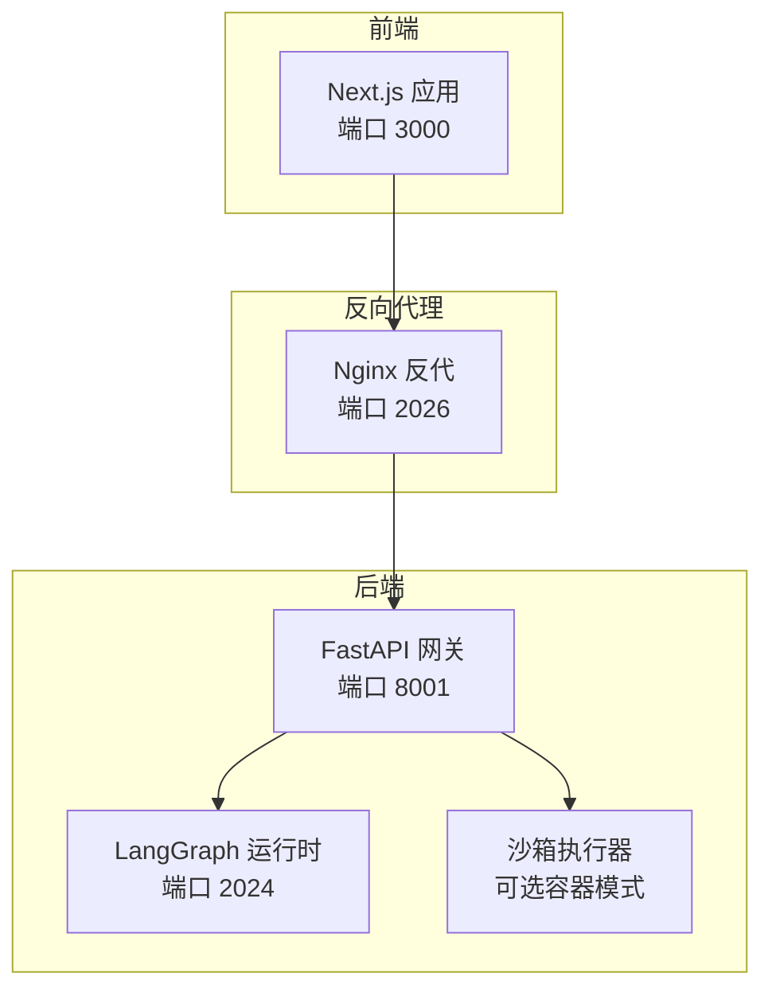
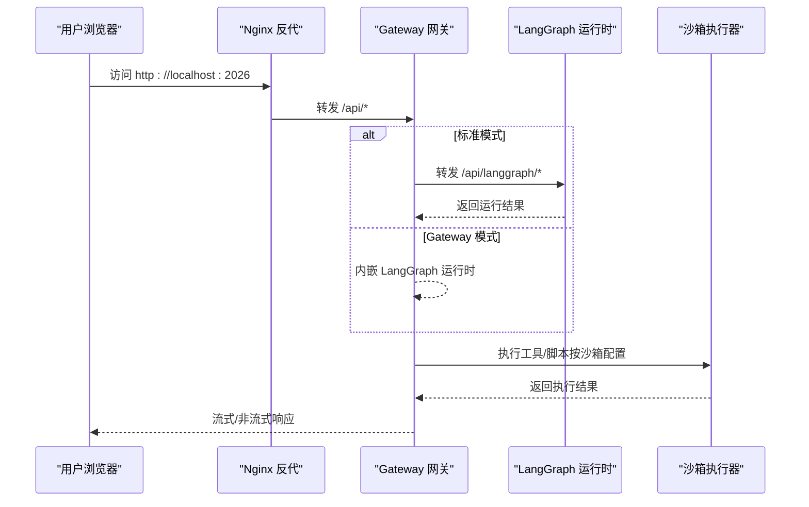
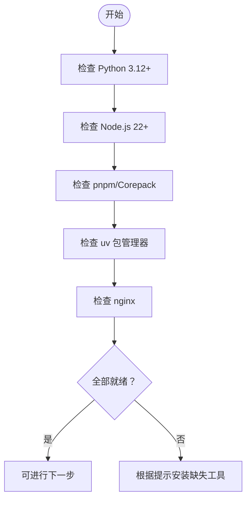
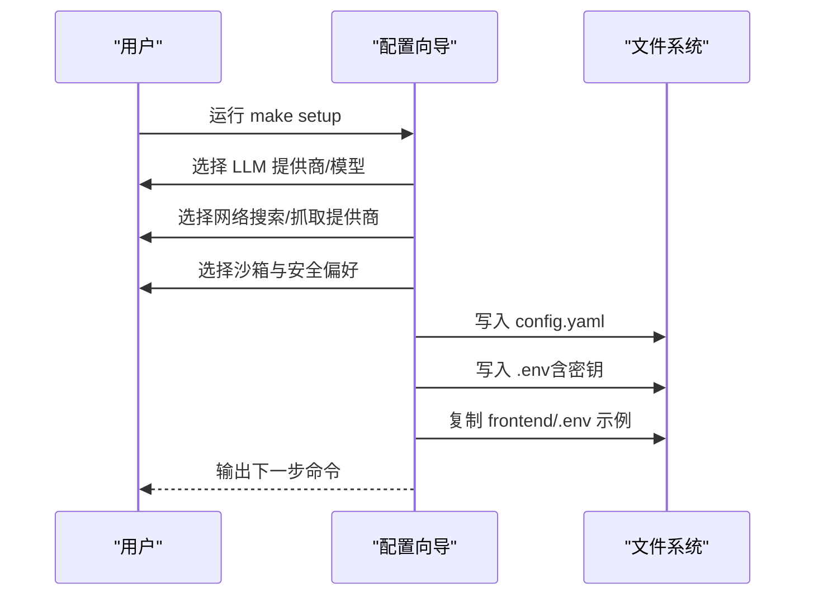
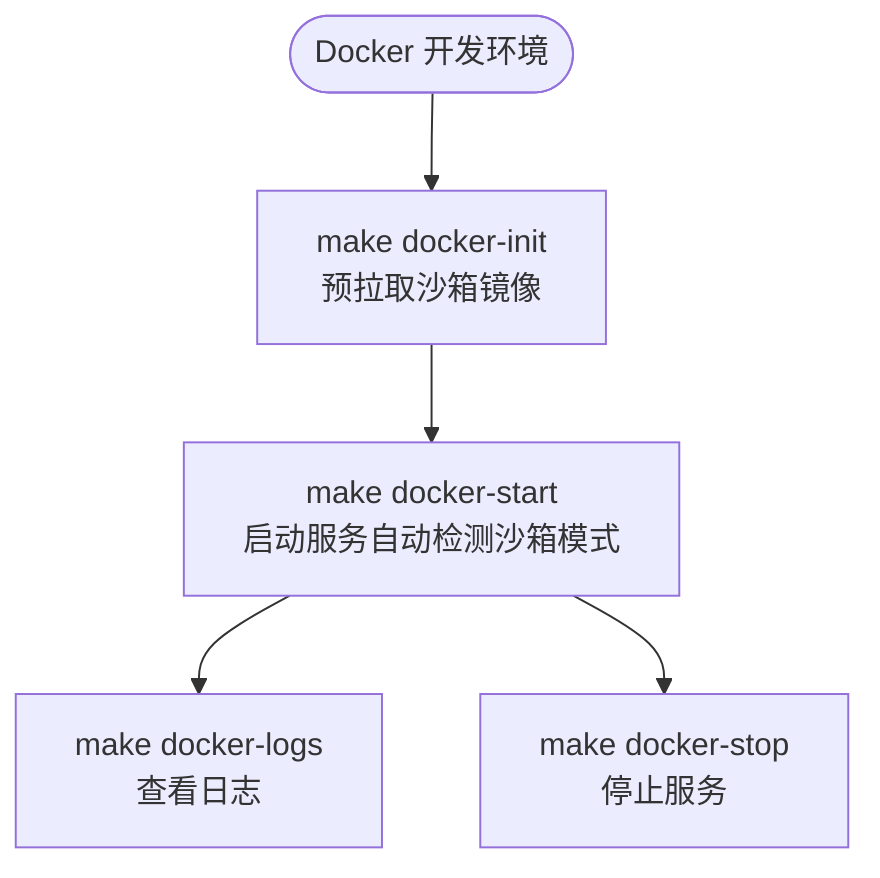
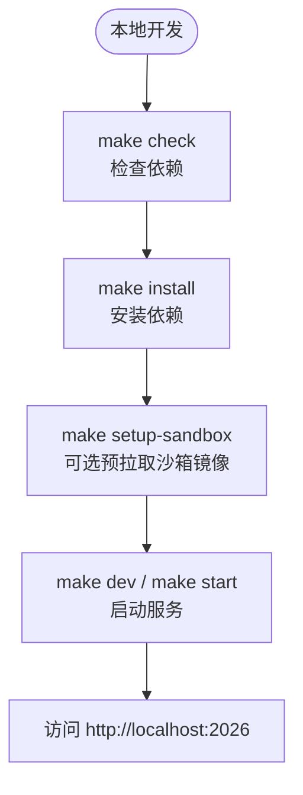
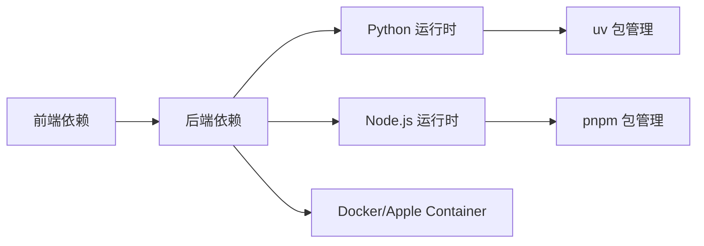
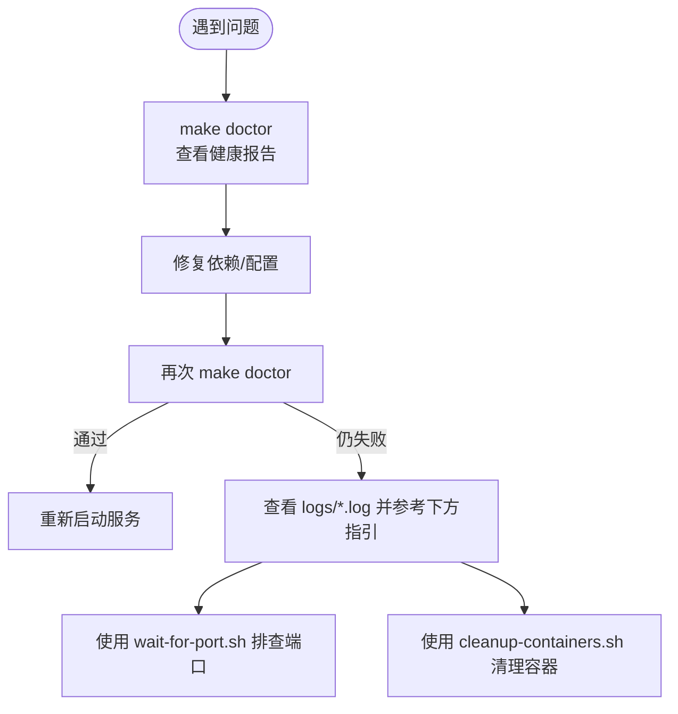

# 快速开始

<cite>
**本文引用的文件**
- [README.md](file://README.md)
- [Install.md](file://Install.md)
- [Makefile](file://Makefile)
- [config.example.yaml](file://config.example.yaml)
- [scripts/setup_wizard.py](file://scripts/setup_wizard.py)
- [scripts/configure.py](file://scripts/configure.py)
- [scripts/check.py](file://scripts/check.py)
- [scripts/doctor.py](file://scripts/doctor.py)
- [scripts/serve.sh](file://scripts/serve.sh)
- [scripts/docker.sh](file://scripts/docker.sh)
- [scripts/deploy.sh](file://scripts/deploy.sh)
- [scripts/wait-for-port.sh](file://scripts/wait-for-port.sh)
- [scripts/cleanup-containers.sh](file://scripts/cleanup-containers.sh)
- [docker/docker-compose.yaml](file://docker/docker-compose.yaml)
- [backend/pyproject.toml](file://backend/pyproject.toml)
</cite>

## 目录
1. [简介](#简介)
2. [项目结构](#项目结构)
3. [核心组件](#核心组件)
4. [架构总览](#架构总览)
5. [详细组件分析](#详细组件分析)
6. [依赖关系分析](#依赖关系分析)
7. [性能考虑](#性能考虑)
8. [故障排除指南](#故障排除指南)
9. [结论](#结论)
10. [附录](#附录)

## 简介
本指南面向首次接触 DeerFlow 的用户，帮助你在最短时间内完成环境准备、配置生成与启动运行。内容覆盖：
- 系统要求与依赖安装
- 两种部署方式：Docker 开发环境与本地开发环境
- 配置向导的使用与关键配置项说明
- 启动命令与访问方式
- 常见问题与故障排除

## 项目结构
仓库采用前后端分离与多服务编排的组织方式：
- 后端（Python）：FastAPI 网关、LangGraph 运行时、沙箱与工具链
- 前端（Next.js）：工作台界面与文档站点
- Docker 编排：通过 docker-compose 管理多容器服务
- 脚本工具：统一的 Makefile 与 Bash/Python 脚本，简化安装、检查、启动与诊断

图表来源
- [docker/docker-compose.yaml:24-167](file://docker/docker-compose.yaml#L24-L167)
- [scripts/serve.sh:224-319](file://scripts/serve.sh#L224-L319)

章节来源
- [README.md:206-325](file://README.md#L206-L325)
- [docker/docker-compose.yaml:24-167](file://docker/docker-compose.yaml#L24-L167)

## 核心组件
- 配置系统：config.yaml 为 DeerFlow 的核心配置入口，支持模型、工具、沙箱、内存、标题生成、摘要策略等模块化配置。
- 配置向导：交互式脚本，引导你选择 LLM 提供商、可选网络搜索、执行与安全偏好，并生成最小化配置与 .env。
- 依赖检查：自动检测 Node.js、pnpm、uv、nginx 等前置条件，避免后续启动失败。
- 启动脚本：统一的服务编排与端口等待，支持标准模式与 Gateway 模式（实验性）。
- Docker 编排：一键拉起前端、网关、LangGraph、Nginx 与可选的 provisioner。

章节来源
- [config.example.yaml:1-978](file://config.example.yaml#L1-L978)
- [scripts/setup_wizard.py:21-166](file://scripts/setup_wizard.py#L21-L166)
- [scripts/check.py:60-171](file://scripts/check.py#L60-L171)
- [scripts/serve.sh:118-332](file://scripts/serve.sh#L118-L332)
- [docker/docker-compose.yaml:24-167](file://docker/docker-compose.yaml#L24-L167)

## 架构总览
DeerFlow 支持两种运行模式：
- 标准模式：网关（Gateway）与 LangGraph 分离，独立进程/容器运行。
- Gateway 模式（实验性）：将 LangGraph 运行时嵌入网关，减少进程数，降低冷启动时间。

图表来源
- [scripts/serve.sh:224-319](file://scripts/serve.sh#L224-L319)
- [docker/docker-compose.yaml:24-167](file://docker/docker-compose.yaml#L24-L167)

章节来源
- [README.md:290-325](file://README.md#L290-L325)

## 详细组件分析

### 环境准备与系统要求
- Python 版本：3.12+
- Node.js 版本：22+
- 包管理：pnpm 或 Corepack + pnpm
- 容器运行时：Docker 或 Apple Container（用于容器沙箱）
- 反向代理：nginx（本地开发）

图表来源
- [scripts/check.py:60-171](file://scripts/check.py#L60-L171)

章节来源
- [scripts/check.py:60-171](file://scripts/check.py#L60-L171)
- [backend/pyproject.toml:6-6](file://backend/pyproject.toml#L6-L6)

### 配置向导与最小化配置生成
- 交互式向导会询问：
  - LLM 提供商与模型名称
  - 可选网络搜索与抓取提供商
  - 沙箱执行模式（本地/容器/Provisioner）
  - 是否启用 bash 工具与文件写入工具
- 向导完成后生成：
  - config.yaml（最小化配置）
  - .env（API 密钥）
  - frontend/.env（前端示例复制）

图表来源
- [scripts/setup_wizard.py:21-166](file://scripts/setup_wizard.py#L21-L166)
- [scripts/configure.py:20-59](file://scripts/configure.py#L20-L59)

章节来源
- [scripts/setup_wizard.py:21-166](file://scripts/setup_wizard.py#L21-L166)
- [scripts/configure.py:20-59](file://scripts/configure.py#L20-L59)
- [Install.md:36-88](file://Install.md#L36-L88)

### Docker 开发环境部署
- 初始化沙箱镜像（可选但推荐）
- 启动开发服务（自动识别沙箱模式）
- 日志查看与停止

图表来源
- [scripts/docker.sh:102-163](file://scripts/docker.sh#L102-L163)
- [scripts/docker.sh:165-275](file://scripts/docker.sh#L165-L275)
- [scripts/docker.sh:277-339](file://scripts/docker.sh#L277-L339)

章节来源
- [scripts/docker.sh:102-163](file://scripts/docker.sh#L102-L163)
- [scripts/docker.sh:165-275](file://scripts/docker.sh#L165-L275)
- [scripts/docker.sh:277-339](file://scripts/docker.sh#L277-L339)
- [docker/docker-compose.yaml:24-167](file://docker/docker-compose.yaml#L24-L167)

### 本地开发环境部署
- 先决条件检查与依赖安装
- 可选：预拉取沙箱镜像
- 启动服务（支持 dev/prod 与 Gateway 模式）
- 访问地址：http://localhost:2026

图表来源
- [scripts/serve.sh:122-135](file://scripts/serve.sh#L122-L135)
- [scripts/serve.sh:224-319](file://scripts/serve.sh#L224-L319)
- [Makefile:122-135](file://Makefile#L122-L135)

章节来源
- [scripts/serve.sh:122-135](file://scripts/serve.sh#L122-L135)
- [scripts/serve.sh:224-319](file://scripts/serve.sh#L224-L319)
- [Makefile:122-135](file://Makefile#L122-L135)

### 关键配置项说明
- 模型配置（models）：至少配置一个可用的 LLM 提供商与 API Key。
- 工具配置（tools）：可选网络搜索/抓取、文件读写、bash 执行等。
- 沙箱配置（sandbox）：本地执行或容器沙箱；容器沙箱需 Docker/Apple Container。
- 内存与标题生成：控制长期记忆与会话标题自动生成行为。
- 总结策略（summarization）：在接近上下文上限时自动压缩历史。

章节来源
- [config.example.yaml:37-978](file://config.example.yaml#L37-L978)

## 依赖关系分析
- 前端依赖：Next.js、Better Auth、UI 组件库等。
- 后端依赖：FastAPI、LangGraph、沙箱与工具生态、IM 渠道 SDK。
- 构建与包管理：uv（Python）、pnpm（Node.js）。
- 容器编排：Docker Compose 管理多服务生命周期。

图表来源
- [backend/pyproject.toml:1-37](file://backend/pyproject.toml#L1-L37)
- [scripts/check.py:60-171](file://scripts/check.py#L60-L171)

章节来源
- [backend/pyproject.toml:1-37](file://backend/pyproject.toml#L1-L37)
- [scripts/check.py:60-171](file://scripts/check.py#L60-L171)

## 性能考虑
- 部署规模建议：根据并发与资源占用选择合适的 CPU/内存规格。
- Docker 开发与生产差异：开发模式启用热重载，生产模式预构建前端。
- Gateway 模式优势：减少进程数、降低冷启动时间，适合高并发场景。
- 沙箱模式选择：容器沙箱隔离更强，但需要额外资源；本地沙箱开销更低。

章节来源
- [README.md:207-225](file://README.md#L207-L225)
- [README.md:290-325](file://README.md#L290-L325)

## 故障排除指南
- 依赖缺失：使用 make check 检查 Node.js、pnpm、uv、nginx，按提示安装。
- 配置错误：使用 make doctor 查看配置版本、模型加载、API Key 状态与沙箱模式。
- 端口占用：启动前使用内置端口等待脚本与清理脚本排查与清理残留容器。
- Docker 权限：Linux 下若出现权限问题，请将当前用户加入 docker 组。
- 生产部署：未找到 Docker socket 将导致容器沙箱不可用，需检查路径与权限。

图表来源
- [scripts/doctor.py:632-722](file://scripts/doctor.py#L632-L722)
- [scripts/wait-for-port.sh:16-57](file://scripts/wait-for-port.sh#L16-L57)
- [scripts/cleanup-containers.sh:19-96](file://scripts/cleanup-containers.sh#L19-L96)

章节来源
- [scripts/doctor.py:632-722](file://scripts/doctor.py#L632-L722)
- [scripts/wait-for-port.sh:16-57](file://scripts/wait-for-port.sh#L16-L57)
- [scripts/cleanup-containers.sh:19-96](file://scripts/cleanup-containers.sh#L19-L96)

## 结论
按照本指南，你可以：
- 在 10 分钟内完成环境准备与依赖安装
- 使用配置向导生成最小化配置
- 以 Docker 或本地方式快速启动 DeerFlow
- 通过 make doctor 与日志定位问题
- 在生产环境中选择合适的运行模式与部署规模

## 附录

### 快速命令清单
- 生成最小化配置：make setup
- 检查依赖：make check
- 安装依赖：make install
- 预拉取沙箱镜像：make setup-sandbox
- 启动本地开发：make dev
- 启动生产：make start
- Docker 初始化：make docker-init
- Docker 启动：make docker-start
- 查看日志：make docker-logs
- 停止服务：make stop

章节来源
- [Makefile:19-52](file://Makefile#L19-L52)
- [scripts/serve.sh:122-135](file://scripts/serve.sh#L122-L135)
- [scripts/docker.sh:165-275](file://scripts/docker.sh#L165-L275)