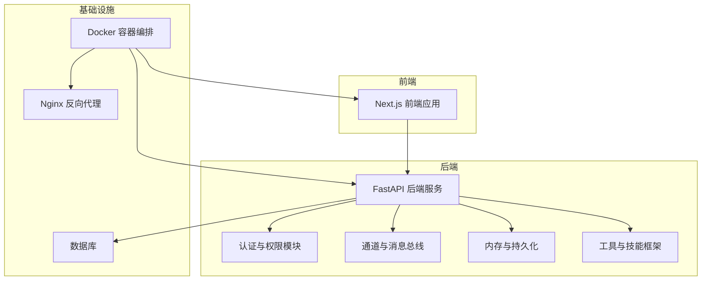
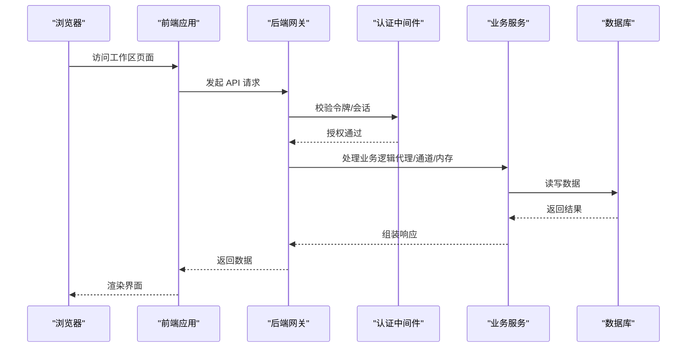
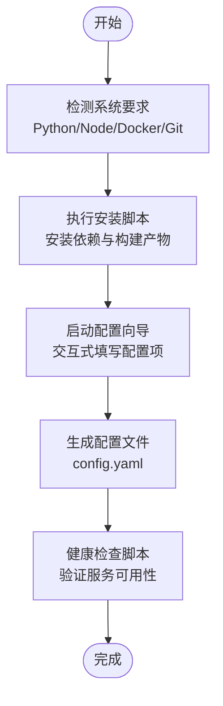
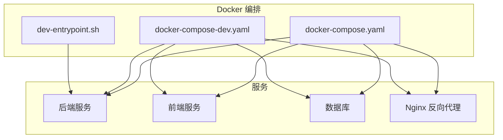
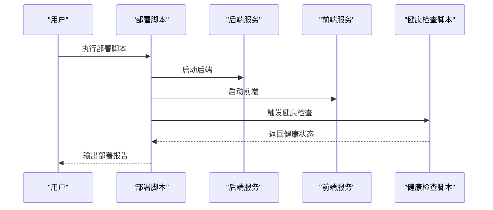
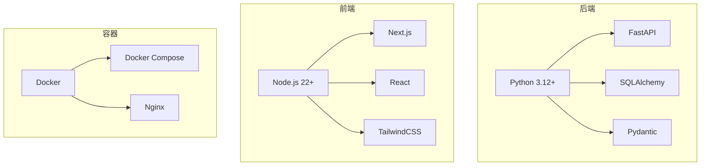

# 快速开始

<cite>
**本文引用的文件**
- [Install.md](file://Install.md)
- [README.md](file://README.md)
- [backend/README.md](file://backend/README.md)
- [backend/docs/README.md](file://backend/docs/README.md)
- [backend/docs/SETUP.md](file://backend/docs/SETUP.md)
- [backend/docs/CONFIGURATION.md](file://backend/docs/CONFIGURATION.md)
- [config.example.yaml](file://config.example.yaml)
- [scripts/setup_wizard.py](file://scripts/setup_wizard.py)
- [scripts/configure.py](file://scripts/configure.py)
- [scripts/check.py](file://scripts/check.py)
- [scripts/docker.sh](file://scripts/docker.sh)
- [scripts/deploy.sh](file://scripts/deploy.sh)
- [scripts/serve.sh](file://scripts/serve.sh)
- [scripts/doctor.py](file://scripts/doctor.py)
- [scripts/wait-for-port.sh](file://scripts/wait-for-port.sh)
- [docker/docker-compose.yaml](file://docker/docker-compose.yaml)
- [docker/docker-compose-dev.yaml](file://docker/docker-compose-dev.yaml)
- [docker/dev-entrypoint.sh](file://docker/dev-entrypoint.sh)
- [.agent/skills/smoke-test/scripts/pull_code.sh](file://.agent/skills/smoke-test/scripts/pull_code.sh)
- [.agent/skills/smoke-test/scripts/deploy_docker.sh](file://.agent/skills/smoke-test/scripts/deploy_docker.sh)
- [.agent/skills/smoke-test/scripts/deploy_local.sh](file://.agent/skills/smoke-test/scripts/deploy_local.sh)
- [.agent/skills/smoke-test/scripts/health_check.sh](file://.agent/skills/smoke-test/scripts/health_check.sh)
- [.agent/skills/smoke-test/scripts/check_docker.sh](file://.agent/skills/smoke-test/scripts/check_docker.sh)
- [.agent/skills/smoke-test/scripts/check_local_env.sh](file://.agent/skills/smoke-test/scripts/check_local_env.sh)
- [.agent/skills/smoke-test/templates/report.docker.template.md](file://.agent/skills/smoke-test/templates/report.docker.template.md)
- [.agent/skills/smoke-test/templates/report.local.template.md](file://.agent/skills/smoke-test/templates/report.local.template.md)
</cite>

## 目录
1. [简介](#简介)
2. [项目结构](#项目结构)
3. [核心组件](#核心组件)
4. [架构总览](#架构总览)
5. [详细组件分析](#详细组件分析)
6. [依赖关系分析](#依赖关系分析)
7. [性能考虑](#性能考虑)
8. [故障排除指南](#故障排除指南)
9. [结论](#结论)
10. [附录](#附录)

## 简介
本指南面向首次接触 DeerFlow 的用户，帮助你在约 30 分钟内完成环境准备、安装配置与首次运行。内容覆盖：
- 环境准备要求（Python 3.12+、Node.js 22+、Docker 等）
- 一键安装脚本与配置向导的使用
- 手动配置选项与最佳实践
- Docker 部署与本地开发两种启动方式
- 常见问题排查与系统要求验证方法

## 项目结构
DeerFlow 采用前后端分离与多语言技术栈的混合架构：
- 后端：Python/FastAPI 应用，提供代理、通道、认证、内存、工具等核心能力
- 前端：Next.js 应用，提供可视化工作区与管理界面
- Docker：提供编排与开发环境入口
- 脚本：安装、配置、健康检查、部署等自动化脚本
- 技能（Skills）：可扩展的工具与流程模板集合

图表来源
- [backend/app/gateway/app.py](file://backend/app/gateway/app.py)
- [docker/docker-compose.yaml](file://docker/docker-compose.yaml)
- [frontend/src/app/page.tsx](file://frontend/src/app/page.tsx)

章节来源
- [README.md](file://README.md)
- [backend/README.md](file://backend/README.md)
- [backend/docs/README.md](file://backend/docs/README.md)

## 核心组件
- 后端服务：提供 REST API、认证中间件、通道管理、运行时生命周期管理、工具与技能框架等
- 前端应用：工作区页面、聊天界面、文档与博客等
- Docker 编排：统一的服务编排与开发入口
- 配置系统：基于 YAML 的配置文件与环境变量扩展机制
- 安装与配置脚本：一键安装、配置向导、健康检查与部署脚本

章节来源
- [backend/docs/README.md](file://backend/docs/README.md)
- [backend/docs/CONFIGURATION.md](file://backend/docs/CONFIGURATION.md)
- [config.example.yaml](file://config.example.yaml)

## 架构总览
下图展示了从浏览器到后端服务、数据库与工具链的整体调用路径。

图表来源
- [backend/app/gateway/app.py](file://backend/app/gateway/app.py)
- [backend/app/gateway/auth_middleware.py](file://backend/app/gateway/auth_middleware.py)
- [backend/app/gateway/services.py](file://backend/app/gateway/services.py)

## 详细组件分析

### 环境准备与系统要求
- Python 运行时：3.12 或以上版本
- Node.js 运行时：22 或以上版本
- Docker：用于容器化部署与开发环境
- Git：用于代码拉取与版本管理
- 开发工具：建议使用 VS Code 并安装推荐扩展

章节来源
- [scripts/check.py](file://scripts/check.py)
- [.agent/skills/smoke-test/scripts/check_docker.sh](file://.agent/skills/smoke-test/scripts/check_docker.sh)
- [.agent/skills/smoke-test/scripts/check_local_env.sh](file://.agent/skills/smoke-test/scripts/check_local_env.sh)

### 一键安装与配置向导
- 安装脚本：提供自动检测与安装依赖的能力
- 配置向导：交互式引导完成基础配置（如数据库、模型提供商、通道等）
- 配置文件：基于示例文件生成实际配置

图表来源
- [scripts/check.py](file://scripts/check.py)
- [scripts/setup_wizard.py](file://scripts/setup_wizard.py)
- [scripts/configure.py](file://scripts/configure.py)
- [scripts/doctor.py](file://scripts/doctor.py)

章节来源
- [scripts/check.py](file://scripts/check.py)
- [scripts/setup_wizard.py](file://scripts/setup_wizard.py)
- [scripts/configure.py](file://scripts/configure.py)
- [scripts/doctor.py](file://scripts/doctor.py)

### 手动配置选项与最佳实践
- 配置文件示例：参考示例文件进行字段对照与修改
- 关键配置项：数据库连接、模型提供商凭据、通道配置、安全与鉴权设置
- 最佳实践：生产环境启用 HTTPS、最小权限原则、定期备份、日志轮转

章节来源
- [config.example.yaml](file://config.example.yaml)
- [backend/docs/CONFIGURATION.md](file://backend/docs/CONFIGURATION.md)

### Docker 部署
- 使用 docker-compose 启动完整服务栈（后端、前端、数据库、反向代理）
- 开发模式与生产模式的 compose 文件差异
- 容器入口脚本与卷挂载策略

图表来源
- [docker/docker-compose.yaml](file://docker/docker-compose.yaml)
- [docker/docker-compose-dev.yaml](file://docker/docker-compose-dev.yaml)
- [docker/dev-entrypoint.sh](file://docker/dev-entrypoint.sh)

章节来源
- [docker/docker-compose.yaml](file://docker/docker-compose.yaml)
- [docker/docker-compose-dev.yaml](file://docker/docker-compose-dev.yaml)
- [docker/dev-entrypoint.sh](file://docker/dev-entrypoint.sh)

### 本地开发启动
- 后端开发：使用 FastAPI 的热重载与调试模式
- 前端开发：Next.js 的开发服务器
- 服务联调：通过环境变量或配置文件指向本地后端

章节来源
- [backend/README.md](file://backend/README.md)
- [frontend/README.md](file://frontend/README.md)

### 首次运行与健康检查
- 拉取代码与初始化
- 启动后端与前端服务
- 健康检查脚本验证各组件状态
- 生成首次运行报告模板

图表来源
- [.agent/skills/smoke-test/scripts/pull_code.sh](file://.agent/skills/smoke-test/scripts/pull_code.sh)
- [.agent/skills/smoke-test/scripts/deploy_docker.sh](file://.agent/skills/smoke-test/scripts/deploy_docker.sh)
- [.agent/skills/smoke-test/scripts/deploy_local.sh](file://.agent/skills/smoke-test/scripts/deploy_local.sh)
- [.agent/skills/smoke-test/scripts/health_check.sh](file://.agent/skills/smoke-test/scripts/health_check.sh)

章节来源
- [.agent/skills/smoke-test/scripts/pull_code.sh](file://.agent/skills/smoke-test/scripts/pull_code.sh)
- [.agent/skills/smoke-test/scripts/deploy_docker.sh](file://.agent/skills/smoke-test/scripts/deploy_docker.sh)
- [.agent/skills/smoke-test/scripts/deploy_local.sh](file://.agent/skills/smoke-test/scripts/deploy_local.sh)
- [.agent/skills/smoke-test/scripts/health_check.sh](file://.agent/skills/smoke-test/scripts/health_check.sh)

## 依赖关系分析
- 后端依赖：Python 生态中的 FastAPI、SQLAlchemy、Pydantic 等
- 前端依赖：Next.js、React、TailwindCSS 等
- Docker 依赖：Compose、Nginx、数据库镜像
- 工具链：Node 包管理器、Python 包管理器、构建工具

图表来源
- [backend/pyproject.toml](file://backend/pyproject.toml)
- [frontend/package.json](file://frontend/package.json)
- [docker/docker-compose.yaml](file://docker/docker-compose.yaml)

章节来源
- [backend/pyproject.toml](file://backend/pyproject.toml)
- [frontend/package.json](file://frontend/package.json)

## 性能考虑
- 数据库连接池与索引优化
- 前端静态资源缓存与按需加载
- Docker 资源限制与健康检查间隔
- 日志级别与采样率控制
- 工具调用超时与重试策略

## 故障排除指南
- 系统要求检查：确认 Python、Node.js、Docker 版本满足最低要求
- 端口占用：使用等待端口脚本检测服务就绪
- 权限问题：确保 Docker 与文件系统权限正确
- 配置错误：核对配置文件语法与必填项
- 健康检查失败：查看后端与前端日志，定位具体模块

章节来源
- [scripts/check.py](file://scripts/check.py)
- [scripts/wait-for-port.sh](file://scripts/wait-for-port.sh)
- [scripts/doctor.py](file://scripts/doctor.py)
- [.agent/skills/smoke-test/scripts/health_check.sh](file://.agent/skills/smoke-test/scripts/health_check.sh)

## 结论
通过本快速开始指南，你可以在 30 分钟内完成 DeerFlow 的环境准备、安装配置与首次运行。建议在完成本地验证后，逐步引入更严格的生产级配置（如 HTTPS、鉴权与审计日志）。

## 附录

### 安装与配置步骤清单
- 准备环境：安装 Python 3.12+、Node.js 22+、Docker、Git
- 克隆仓库并进入目录
- 执行安装脚本与配置向导
- 生成配置文件并校验
- 启动 Docker 编排或本地开发服务
- 运行健康检查并生成报告

章节来源
- [Install.md](file://Install.md)
- [scripts/check.py](file://scripts/check.py)
- [scripts/setup_wizard.py](file://scripts/setup_wizard.py)
- [scripts/configure.py](file://scripts/configure.py)
- [scripts/doctor.py](file://scripts/doctor.py)

### 配置文件示例与模板
- 示例配置文件：参考示例文件进行字段对照与修改
- 部署报告模板：根据部署方式选择 Docker 或本地报告模板

章节来源
- [config.example.yaml](file://config.example.yaml)
- [.agent/skills/smoke-test/templates/report.docker.template.md](file://.agent/skills/smoke-test/templates/report.docker.template.md)
- [.agent/skills/smoke-test/templates/report.local.template.md](file://.agent/skills/smoke-test/templates/report.local.template.md)