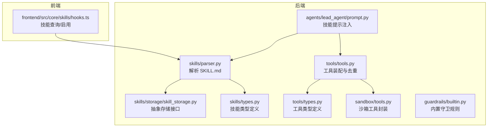
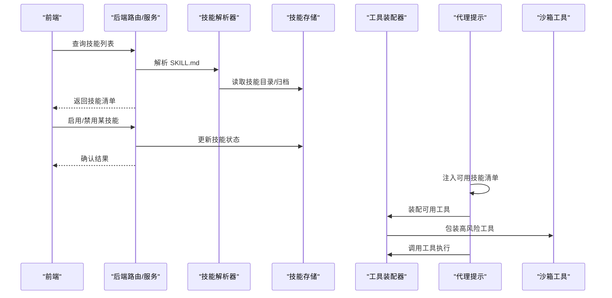
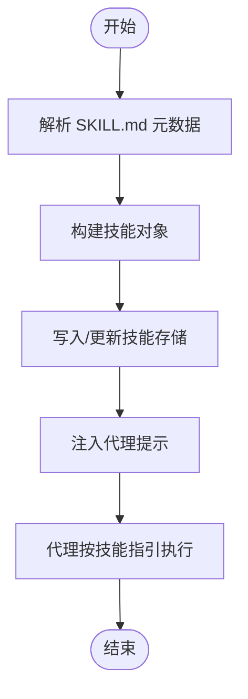
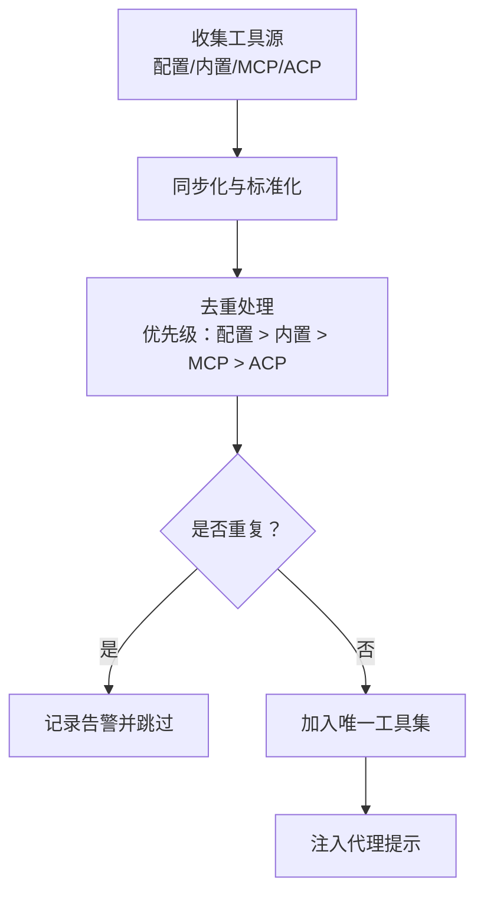
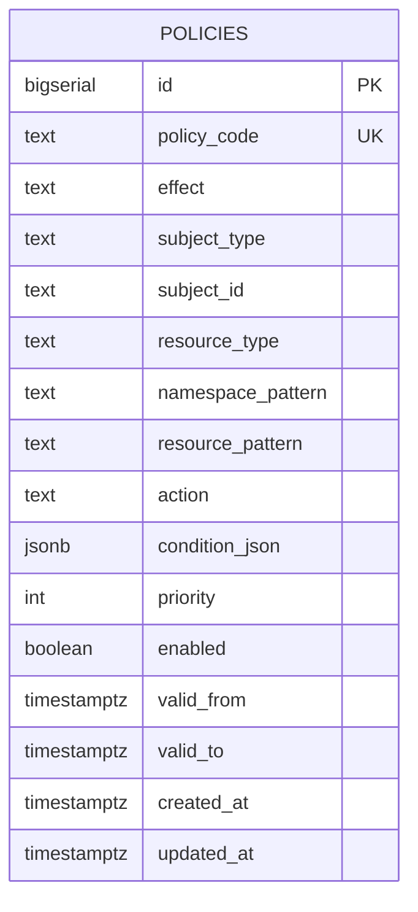
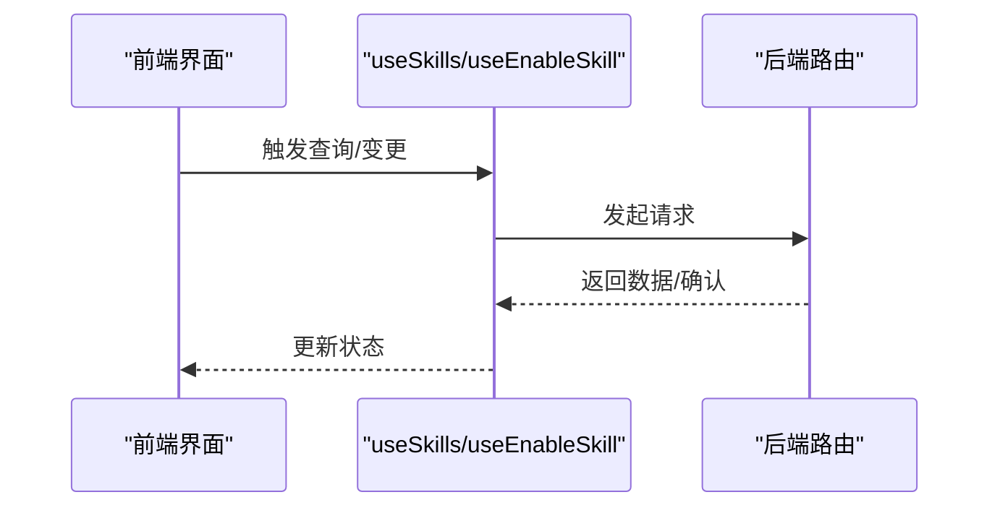
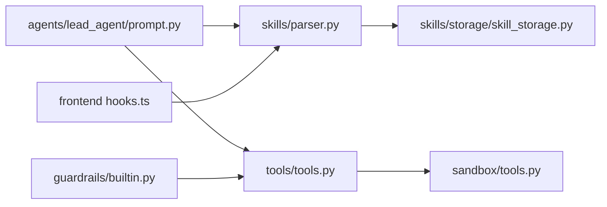

# 技能与工具

<cite>
**本文引用的文件**
- [backend/docs/ARCHITECTURE.md](file://backend/docs/ARCHITECTURE.md)
- [backend/docs/CONFIGURATION.md](file://backend/docs/CONFIGURATION.md)
- [backend/packages/harness/deerflow/skills/storage/skill_storage.py](file://backend/packages/harness/deerflow/skills/storage/skill_storage.py)
- [backend/packages/harness/deerflow/skills/parser.py](file://backend/packages/harness/deerflow/skills/parser.py)
- [backend/packages/harness/deerflow/skills/types.py](file://backend/packages/harness/deerflow/skills/types.py)
- [backend/packages/harness/deerflow/skills/permissions.py](file://backend/packages/harness/deerflow/skills/permissions.py)
- [backend/packages/harness/deerflow/tools/tools.py](file://backend/packages/harness/deerflow/tools/tools.py)
- [backend/packages/harness/deerflow/tools/types.py](file://backend/packages/harness/deerflow/tools/types.py)
- [backend/packages/harness/deerflow/sandbox/tools.py](file://backend/packages/harness/deerflow/sandbox/tools.py)
- [backend/packages/harness/deerflow/guardrails/builtin.py](file://backend/packages/harness/deerflow/guardrails/builtin.py)
- [backend/packages/harness/deerflow/agents/lead_agent/prompt.py](file://backend/packages/harness/deerflow/agents/lead_agent/prompt.py)
- [backend/tests/test_tool_deduplication.py](file://backend/tests/test_tool_deduplication.py)
- [backend/tests/test_skills_loader.py](file://backend/tests/test_skills_loader.py)
- [backend/tests/test_skills_validation.py](file://backend/tests/test_skills_validation.py)
- [backend/tests/test_skills_parser.py](file://backend/tests/test_skills_parser.py)
- [backend/tests/test_skills_installer.py](file://backend/tests/test_skills_installer.py)
- [backend/tests/test_skills_custom_router.py](file://backend/tests/test_skills_custom_router.py)
- [backend/tests/test_skills_bundled.py](file://backend/tests/test_skills_bundled.py)
- [backend/tests/test_skills_archive_root.py](file://backend/tests/test_skills_archive_root.py)
- [backend/tests/test_skills_custom_router.py](file://backend/tests/test_skills_custom_router.py)
- [backend/tests/test_local_bash_tool_loading.py](file://backend/tests/test_local_bash_tool_loading.py)
- [backend/tests/test_sandbox_tools_security.py](file://backend/tests/test_sandbox_tools_security.py)
- [backend/tests/test_skill_permissions.py](file://backend/tests/test_skill_permissions.py)
- [backend/tests/test_skill_manage_tool.py](file://backend/tests/test_skill_manage_tool.py)
- [frontend/src/core/skills/hooks.ts](file://frontend/src/core/skills/hooks.ts)
- [docs/sql/authz_init.sql](file://docs/sql/authz_init.sql)
</cite>

## 目录
1. [简介](#简介)
2. [项目结构](#项目结构)
3. [核心组件](#核心组件)
4. [架构总览](#架构总览)
5. [详细组件分析](#详细组件分析)
6. [依赖关系分析](#依赖关系分析)
7. [性能考量](#性能考量)
8. [故障排查指南](#故障排查指南)
9. [结论](#结论)
10. [附录](#附录)

## 简介
本文件系统性阐述 DeerFlow 的“技能与工具”体系：技能的定义、加载机制与生命周期管理；内置技能库（研究、报告生成、幻灯片创建、网页生成、图像/视频生成等）的功能特性与使用方法；工具系统的架构（内置工具、网络搜索、文件操作、Bash 执行、MCP 工具等）与自定义扩展；技能开发指南、工具注册流程、权限管理与安全策略；以及实际配置示例与集成模式。

## 项目结构
技能与工具相关的核心实现位于后端 harness 模块中，前端提供技能列表与启用状态的查询与变更能力。技能以 SKILL.md 为入口，工具通过统一的装配与去重机制注入到代理工作流中。

**图表来源**
- [backend/packages/harness/deerflow/skills/parser.py:1-200](file://backend/packages/harness/deerflow/skills/parser.py#L1-L200)
- [backend/packages/harness/deerflow/skills/storage/skill_storage.py:1-139](file://backend/packages/harness/deerflow/skills/storage/skill_storage.py#L1-L139)
- [backend/packages/harness/deerflow/skills/types.py:1-200](file://backend/packages/harness/deerflow/skills/types.py#L1-L200)
- [backend/packages/harness/deerflow/tools/tools.py:150-176](file://backend/packages/harness/deerflow/tools/tools.py#L150-L176)
- [backend/packages/harness/deerflow/tools/types.py:1-200](file://backend/packages/harness/deerflow/tools/types.py#L1-L200)
- [backend/packages/harness/deerflow/sandbox/tools.py:1-200](file://backend/packages/harness/deerflow/sandbox/tools.py#L1-L200)
- [backend/packages/harness/deerflow/guardrails/builtin.py:1-200](file://backend/packages/harness/deerflow/guardrails/builtin.py#L1-L200)
- [backend/packages/harness/deerflow/agents/lead_agent/prompt.py:603-626](file://backend/packages/harness/deerflow/agents/lead_agent/prompt.py#L603-L626)
- [frontend/src/core/skills/hooks.ts:1-31](file://frontend/src/core/skills/hooks.ts#L1-L31)

**章节来源**
- [backend/docs/ARCHITECTURE.md:305-342](file://backend/docs/ARCHITECTURE.md#L305-L342)

## 核心组件
- 技能存储与解析：抽象存储接口定义了技能根路径、遍历 SKILL.md 文件、读写自定义技能内容、从归档安装技能等原子操作；解析器负责从 SKILL.md 中提取元数据与指令。
- 工具装配与去重：统一收集配置工具、内置工具、MCP 工具与 ACP 工具，按优先级去重，保证 LLM 接收到的函数签名不冲突。
- 沙箱与安全：对文件操作、Bash 执行等高风险工具进行沙箱封装与安全策略约束。
- 提示注入：在代理提示中动态注入可用技能清单，指导代理按技能指引逐步加载资源与执行任务。
- 前端交互：提供技能列表查询与启用/禁用变更的能力。

**章节来源**
- [backend/packages/harness/deerflow/skills/storage/skill_storage.py:18-139](file://backend/packages/harness/deerflow/skills/storage/skill_storage.py#L18-L139)
- [backend/packages/harness/deerflow/skills/parser.py:1-200](file://backend/packages/harness/deerflow/skills/parser.py#L1-L200)
- [backend/packages/harness/deerflow/tools/tools.py:150-176](file://backend/packages/harness/deerflow/tools/tools.py#L150-L176)
- [backend/packages/harness/deerflow/sandbox/tools.py:1-200](file://backend/packages/harness/deerflow/sandbox/tools.py#L1-L200)
- [backend/packages/harness/deerflow/agents/lead_agent/prompt.py:603-626](file://backend/packages/harness/deerflow/agents/lead_agent/prompt.py#L603-L626)
- [frontend/src/core/skills/hooks.ts:1-31](file://frontend/src/core/skills/hooks.ts#L1-L31)

## 架构总览
技能与工具的运行时架构围绕“解析—装配—注入—执行”的闭环展开：技能由解析器读取元数据与指令，工具由装配器统一收集与去重，代理提示中注入技能清单，最终在运行期由代理选择并调用工具完成任务。

**图表来源**
- [backend/packages/harness/deerflow/skills/parser.py:1-200](file://backend/packages/harness/deerflow/skills/parser.py#L1-L200)
- [backend/packages/harness/deerflow/skills/storage/skill_storage.py:105-139](file://backend/packages/harness/deerflow/skills/storage/skill_storage.py#L105-L139)
- [backend/packages/harness/deerflow/tools/tools.py:150-176](file://backend/packages/harness/deerflow/tools/tools.py#L150-L176)
- [backend/packages/harness/deerflow/sandbox/tools.py:1-200](file://backend/packages/harness/deerflow/sandbox/tools.py#L1-L200)
- [backend/packages/harness/deerflow/agents/lead_agent/prompt.py:603-626](file://backend/packages/harness/deerflow/agents/lead_agent/prompt.py#L603-L626)
- [frontend/src/core/skills/hooks.ts:1-31](file://frontend/src/core/skills/hooks.ts#L1-L31)

## 详细组件分析

### 技能系统
- 定义与格式：技能以 SKILL.md 为入口，包含元数据（名称、描述、许可证、允许使用的工具清单等）与指令内容。解析器负责提取元数据并构建技能对象。
- 存储与加载：抽象存储接口定义了技能根路径、遍历 SKILL.md 文件、读写自定义技能内容、从归档安装技能等能力，支持公共与自定义技能目录。
- 生命周期：前端可查询与启用/禁用技能；后端根据可用技能清单动态注入到代理提示中，代理在匹配到相应任务时按技能指引逐步加载资源与执行。
- 内置技能库：仓库提供多种内置技能（如研究、报告生成、幻灯片创建、网页生成、图像/视频生成等），每个技能以独立目录存放 SKILL.md 及相关脚本/模板。

**图表来源**
- [backend/packages/harness/deerflow/skills/parser.py:1-200](file://backend/packages/harness/deerflow/skills/parser.py#L1-L200)
- [backend/packages/harness/deerflow/skills/storage/skill_storage.py:105-139](file://backend/packages/harness/deerflow/skills/storage/skill_storage.py#L105-L139)
- [backend/packages/harness/deerflow/agents/lead_agent/prompt.py:603-626](file://backend/packages/harness/deerflow/agents/lead_agent/prompt.py#L603-L626)

**章节来源**
- [backend/docs/ARCHITECTURE.md:305-342](file://backend/docs/ARCHITECTURE.md#L305-L342)
- [backend/packages/harness/deerflow/skills/parser.py:1-200](file://backend/packages/harness/deerflow/skills/parser.py#L1-L200)
- [backend/packages/harness/deerflow/skills/storage/skill_storage.py:18-139](file://backend/packages/harness/deerflow/skills/storage/skill_storage.py#L18-L139)
- [backend/packages/harness/deerflow/agents/lead_agent/prompt.py:603-626](file://backend/packages/harness/deerflow/agents/lead_agent/prompt.py#L603-L626)

### 工具系统
- 统一装配：工具装配器会聚合配置工具、内置工具、MCP 工具与 ACP 工具，并按顺序去重，确保同名工具仅保留第一个出现的版本，避免 LLM 接收到重复或混淆的函数签名。
- 去重与告警：当检测到重复工具名时，记录警告日志，便于定位配置问题。
- 沙箱封装：对高风险工具（如文件读写、Bash 执行）进行沙箱封装，限制其访问范围与行为，结合安全扫描与策略过滤，降低执行风险。
- 内置工具类别：包括网络搜索、文件操作、Bash 执行等，满足常见任务需求。

**图表来源**
- [backend/packages/harness/deerflow/tools/tools.py:150-176](file://backend/packages/harness/deerflow/tools/tools.py#L150-L176)
- [backend/tests/test_tool_deduplication.py:166-200](file://backend/tests/test_tool_deduplication.py#L166-L200)
- [backend/packages/harness/deerflow/sandbox/tools.py:1-200](file://backend/packages/harness/deerflow/sandbox/tools.py#L1-L200)

**章节来源**
- [backend/packages/harness/deerflow/tools/tools.py:150-176](file://backend/packages/harness/deerflow/tools/tools.py#L150-L176)
- [backend/tests/test_tool_deduplication.py:166-200](file://backend/tests/test_tool_deduplication.py#L166-L200)
- [backend/packages/harness/deerflow/sandbox/tools.py:1-200](file://backend/packages/harness/deerflow/sandbox/tools.py#L1-L200)

### 权限与安全
- RBAC/ABAC 策略：通过策略表定义主体（用户/角色/部门）、资源（工具/知识库/MCP 工具）、命名空间与资源模式、动作与条件、有效期与优先级等，实现细粒度授权。
- 守卫规则：内置守卫规则用于拦截高风险调用或违规内容，结合策略过滤与沙箱限制，形成多层防护。
- 技能工具白名单：技能可在 SKILL.md 中声明允许使用的工具清单，未在清单中的工具将被过滤，避免技能越权调用。

**图表来源**
- [docs/sql/authz_init.sql:75-95](file://docs/sql/authz_init.sql#L75-L95)

**章节来源**
- [docs/sql/authz_init.sql:75-95](file://docs/sql/authz_init.sql#L75-L95)
- [backend/packages/harness/deerflow/guardrails/builtin.py:1-200](file://backend/packages/harness/deerflow/guardrails/builtin.py#L1-L200)
- [backend/tests/test_skill_permissions.py:1-200](file://backend/tests/test_skill_permissions.py#L1-L200)

### 前端交互
- 技能查询：通过查询钩子获取技能列表，支持分页与缓存。
- 启用/禁用：通过变更钩子提交启用状态，成功后刷新本地缓存，确保界面与后端状态一致。

**图表来源**
- [frontend/src/core/skills/hooks.ts:1-31](file://frontend/src/core/skills/hooks.ts#L1-L31)

**章节来源**
- [frontend/src/core/skills/hooks.ts:1-31](file://frontend/src/core/skills/hooks.ts#L1-L31)

## 依赖关系分析
- 技能侧：解析器依赖存储接口；提示注入依赖技能签名与可用技能集合；测试覆盖加载、验证、安装、自定义路由与归档根路径。
- 工具侧：装配器依赖工具类型与沙箱封装；测试覆盖去重与 Bash 工具加载；安全侧依赖守卫规则与策略过滤。
- 前端侧：依赖后端提供的技能查询与启用接口。

**图表来源**
- [backend/packages/harness/deerflow/skills/parser.py:1-200](file://backend/packages/harness/deerflow/skills/parser.py#L1-L200)
- [backend/packages/harness/deerflow/skills/storage/skill_storage.py:18-139](file://backend/packages/harness/deerflow/skills/storage/skill_storage.py#L18-L139)
- [backend/packages/harness/deerflow/agents/lead_agent/prompt.py:603-626](file://backend/packages/harness/deerflow/agents/lead_agent/prompt.py#L603-L626)
- [backend/packages/harness/deerflow/tools/tools.py:150-176](file://backend/packages/harness/deerflow/tools/tools.py#L150-L176)
- [backend/packages/harness/deerflow/sandbox/tools.py:1-200](file://backend/packages/harness/deerflow/sandbox/tools.py#L1-L200)
- [backend/packages/harness/deerflow/guardrails/builtin.py:1-200](file://backend/packages/harness/deerflow/guardrails/builtin.py#L1-L200)
- [frontend/src/core/skills/hooks.ts:1-31](file://frontend/src/core/skills/hooks.ts#L1-L31)

**章节来源**
- [backend/tests/test_skills_loader.py:1-200](file://backend/tests/test_skills_loader.py#L1-L200)
- [backend/tests/test_skills_validation.py:1-200](file://backend/tests/test_skills_validation.py#L1-L200)
- [backend/tests/test_skills_parser.py:1-200](file://backend/tests/test_skills_parser.py#L1-L200)
- [backend/tests/test_skills_installer.py:1-200](file://backend/tests/test_skills_installer.py#L1-L200)
- [backend/tests/test_skills_custom_router.py:1-200](file://backend/tests/test_skills_custom_router.py#L1-L200)
- [backend/tests/test_skills_bundled.py:1-200](file://backend/tests/test_skills_bundled.py#L1-L200)
- [backend/tests/test_skills_archive_root.py:1-200](file://backend/tests/test_skills_archive_root.py#L1-L200)
- [backend/tests/test_local_bash_tool_loading.py:1-200](file://backend/tests/test_local_bash_tool_loading.py#L1-L200)
- [backend/tests/test_sandbox_tools_security.py:1-200](file://backend/tests/test_sandbox_tools_security.py#L1-L200)
- [backend/tests/test_skill_permissions.py:1-200](file://backend/tests/test_skill_permissions.py#L1-L200)
- [backend/tests/test_skill_manage_tool.py:1-200](file://backend/tests/test_skill_manage_tool.py#L1-L200)

## 性能考量
- 提示注入缓存：代理提示中的技能清单采用缓存机制，减少重复计算与字符串拼接开销。
- 工具去重：在装配阶段一次性去重，避免运行期重复筛选带来的额外成本。
- 沙箱隔离：通过沙箱限制工具访问范围，减少不必要的系统调用与 IO 开销。
- 前端缓存：前端查询钩子支持缓存与失效刷新，降低频繁请求对后端的压力。

[本节为通用性能建议，无需特定文件引用]

## 故障排查指南
- 工具重复导致的函数签名冲突：检查配置与 MCP 注册，确保工具名唯一；关注去重告警日志。
- Bash 工具不可用：确认主机 Bash 是否允许，检查相关测试用例与沙箱配置。
- 技能加载失败：核对 SKILL.md 格式与解析器输出；检查存储根路径与自定义路由配置。
- 权限拒绝：核查策略表中的主体、资源、动作与条件，确认有效期内且优先级正确。

**章节来源**
- [backend/tests/test_tool_deduplication.py:166-200](file://backend/tests/test_tool_deduplication.py#L166-L200)
- [backend/tests/test_local_bash_tool_loading.py:1-200](file://backend/tests/test_local_bash_tool_loading.py#L1-L200)
- [backend/tests/test_skills_loader.py:1-200](file://backend/tests/test_skills_loader.py#L1-L200)
- [backend/tests/test_skills_validation.py:1-200](file://backend/tests/test_skills_validation.py#L1-L200)
- [backend/tests/test_skills_parser.py:1-200](file://backend/tests/test_skills_parser.py#L1-L200)
- [backend/tests/test_skills_custom_router.py:1-200](file://backend/tests/test_skills_custom_router.py#L1-L200)
- [backend/tests/test_skills_archive_root.py:1-200](file://backend/tests/test_skills_archive_root.py#L1-L200)
- [backend/tests/test_skill_permissions.py:1-200](file://backend/tests/test_skill_permissions.py#L1-L200)

## 结论
DeerFlow 的技能与工具系统通过“解析—装配—注入—执行”的闭环，实现了灵活的任务编排与安全可控的工具调用。技能以 SKILL.md 为入口，工具在装配阶段统一去重与沙箱封装，权限与守卫规则提供多层安全保障。前端提供便捷的技能查询与启用能力，配合后端的健壮实现，能够支撑多样化的业务场景。

[本节为总结性内容，无需特定文件引用]

## 附录

### 技能开发指南
- 创建目录：在公共或自定义技能目录下新建技能子目录。
- 编写 SKILL.md：包含元数据（名称、描述、许可证、允许工具清单）与技能指令内容。
- 脚本与模板：按需添加脚本与模板文件，供技能执行时引用。
- 安装与验证：通过归档安装或直接加载，运行相关测试确保解析与加载正常。

**章节来源**
- [backend/docs/ARCHITECTURE.md:305-342](file://backend/docs/ARCHITECTURE.md#L305-L342)
- [backend/packages/harness/deerflow/skills/parser.py:1-200](file://backend/packages/harness/deerflow/skills/parser.py#L1-L200)
- [backend/tests/test_skills_installer.py:1-200](file://backend/tests/test_skills_installer.py#L1-L200)
- [backend/tests/test_skills_loader.py:1-200](file://backend/tests/test_skills_loader.py#L1-L200)

### 工具注册流程
- 配置工具：在配置文件中声明工具参数与选项。
- 内置工具：通过内置工具模块自动装配。
- MCP 工具：通过 MCP 服务器注册，装配器自动发现并合并。
- 去重与校验：装配器按优先级去重并记录告警；运行前进行安全扫描与策略过滤。

**章节来源**
- [backend/packages/harness/deerflow/tools/tools.py:150-176](file://backend/packages/harness/deerflow/tools/tools.py#L150-L176)
- [backend/tests/test_tool_deduplication.py:166-200](file://backend/tests/test_tool_deduplication.py#L166-L200)
- [backend/packages/harness/deerflow/sandbox/tools.py:1-200](file://backend/packages/harness/deerflow/sandbox/tools.py#L1-L200)

### 权限管理与安全策略
- 策略定义：在策略表中配置主体、资源、动作、条件与有效期。
- 技能白名单：在 SKILL.md 中声明允许工具清单，未列出的工具将被过滤。
- 守卫规则：内置守卫拦截高风险调用，结合沙箱限制降低执行风险。

**章节来源**
- [docs/sql/authz_init.sql:75-95](file://docs/sql/authz_init.sql#L75-L95)
- [backend/packages/harness/deerflow/guardrails/builtin.py:1-200](file://backend/packages/harness/deerflow/guardrails/builtin.py#L1-L200)
- [backend/packages/harness/deerflow/skills/permissions.py:1-200](file://backend/packages/harness/deerflow/skills/permissions.py#L1-L200)

### 实际配置示例与集成模式
- 配置文件：参考配置文档，设置工具、模型、内存与安全相关参数。
- 集成模式：前端通过钩子与后端交互；代理提示中注入技能清单；工具装配器统一调度。

**章节来源**
- [backend/docs/CONFIGURATION.md:1-200](file://backend/docs/CONFIGURATION.md#L1-L200)
- [frontend/src/core/skills/hooks.ts:1-31](file://frontend/src/core/skills/hooks.ts#L1-L31)
- [backend/packages/harness/deerflow/agents/lead_agent/prompt.py:603-626](file://backend/packages/harness/deerflow/agents/lead_agent/prompt.py#L603-L626)