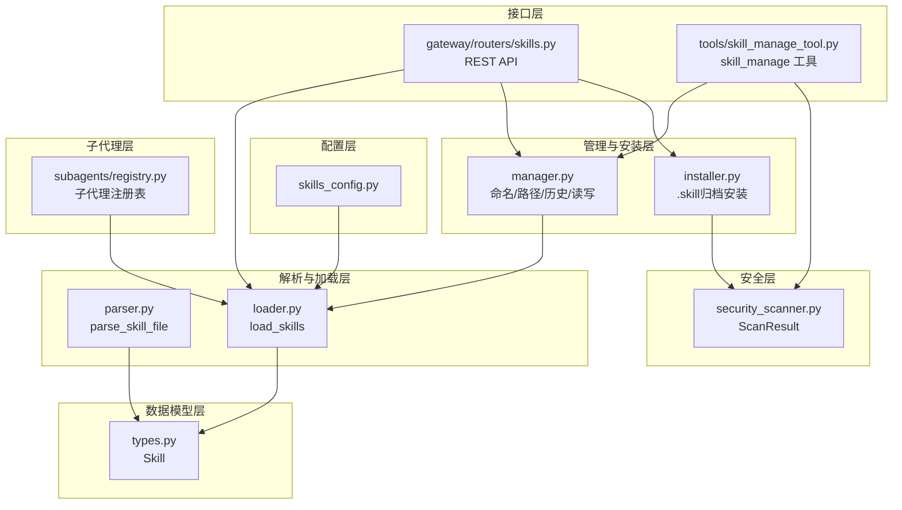
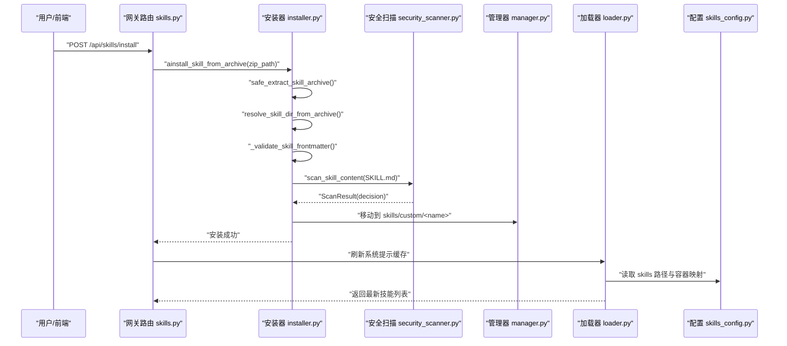
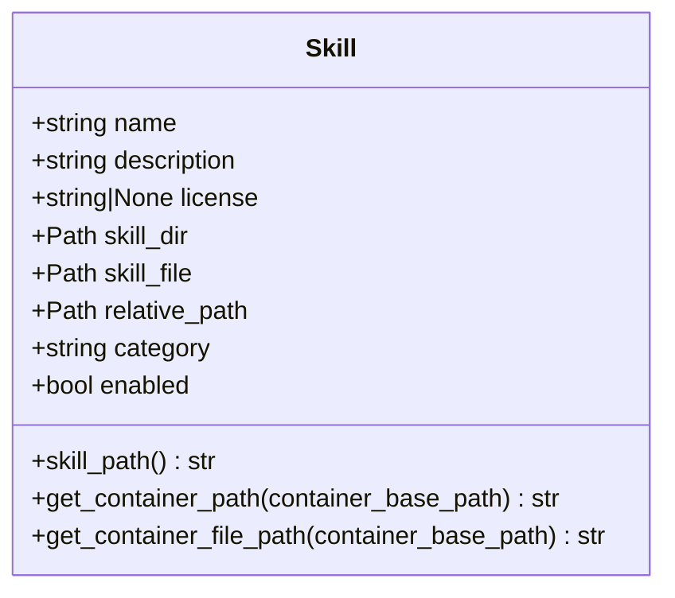
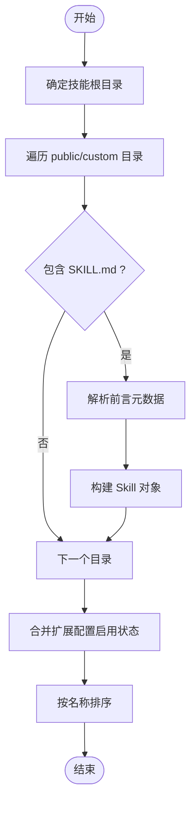
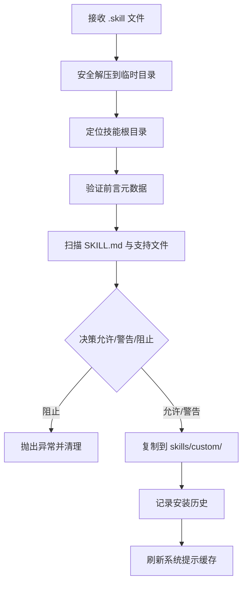
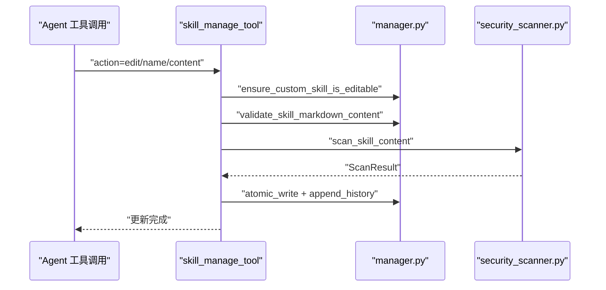
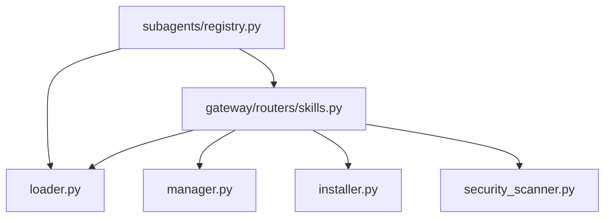
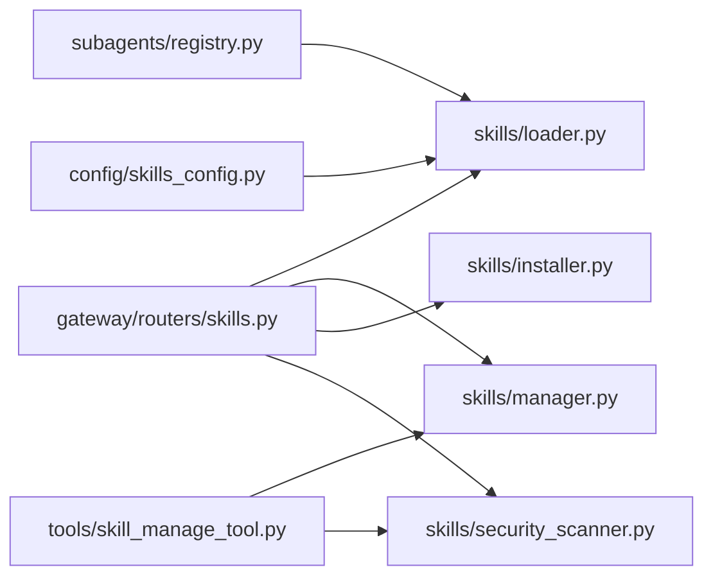

# 技能架构原理

<cite>
**本文引用的文件**
- [backend/packages/harness/deerflow/skills/__init__.py](file://backend/packages/harness/deerflow/skills/__init__.py)
- [backend/packages/harness/deerflow/skills/types.py](file://backend/packages/harness/deerflow/skills/types.py)
- [backend/packages/harness/deerflow/skills/loader.py](file://backend/packages/harness/deerflow/skills/loader.py)
- [backend/packages/harness/deerflow/skills/parser.py](file://backend/packages/harness/deerflow/skills/parser.py)
- [backend/packages/harness/deerflow/skills/validation.py](file://backend/packages/harness/deerflow/skills/validation.py)
- [backend/packages/harness/deerflow/skills/manager.py](file://backend/packages/harness/deerflow/skills/manager.py)
- [backend/packages/harness/deerflow/skills/installer.py](file://backend/packages/harness/deerflow/skills/installer.py)
- [backend/packages/harness/deerflow/skills/security_scanner.py](file://backend/packages/harness/deerflow/skills/security_scanner.py)
- [backend/app/gateway/routers/skills.py](file://backend/app/gateway/routers/skills.py)
- [backend/packages/harness/deerflow/config/skills_config.py](file://backend/packages/harness/deerflow/config/skills_config.py)
- [backend/packages/harness/deerflow/tools/skill_manage_tool.py](file://backend/packages/harness/deerflow/tools/skill_manage_tool.py)
- [backend/packages/harness/deerflow/subagents/registry.py](file://backend/packages/harness/deerflow/subagents/registry.py)
- [skills/public/bootstrap/SKILL.md](file://skills/public/bootstrap/SKILL.md)
- [skills/public/chart-visualization/SKILL.md](file://skills/public/chart-visualization/SKILL.md)
- [skills/public/data-analysis/SKILL.md](file://skills/public/data-analysis/SKILL.md)
</cite>

## 目录
1. [引言](#引言)
2. [项目结构](#项目结构)
3. [核心组件](#核心组件)
4. [架构总览](#架构总览)
5. [详细组件分析](#详细组件分析)
6. [依赖关系分析](#依赖关系分析)
7. [性能考量](#性能考量)
8. [故障排查指南](#故障排查指南)
9. [结论](#结论)
10. [附录](#附录)

## 引言
本文件系统性阐述 DeerFlow 技能架构的设计理念、核心数据结构、工作流与执行机制，解释内置技能与自定义技能的差异，梳理技能生命周期（从创建到销毁），总结依赖关系与模块化设计原则，并说明技能系统与代理系统的集成方式及在多代理编排中的作用。同时给出最佳实践与设计模式，帮助开发者高效扩展与维护技能生态。

## 项目结构
技能系统位于后端 Harness 包中，采用“配置驱动 + 文件元数据 + 安全扫描 + 网关路由 + 工具接口”的分层组织方式：
- 配置层：skills_config 提供技能目录与容器挂载路径解析
- 数据模型层：types 定义 Skill 元数据结构
- 解析与加载层：parser 负责提取 SKILL.md 前言元数据；loader 扫描公共/自定义技能目录并合并启用状态
- 管理与安装层：manager 提供命名校验、安全支持文件路径限制、历史记录等；installer 负责 .skill 归档的安全解压、内容扫描与安装
- 安全层：security_scanner 使用 LLM 对文本进行三态判定（allow/warn/block）
- 接口层：gateway 路由提供 REST API；tools 提供 LangGraph 工具接口
- 子代理层：subagents registry 将技能纳入子代理能力范围

图表来源
- [backend/packages/harness/deerflow/config/skills_config.py:11-55](file://backend/packages/harness/deerflow/config/skills_config.py#L11-L55)
- [backend/packages/harness/deerflow/skills/types.py:5-54](file://backend/packages/harness/deerflow/skills/types.py#L5-L54)
- [backend/packages/harness/deerflow/skills/parser.py:12-81](file://backend/packages/harness/deerflow/skills/parser.py#L12-L81)
- [backend/packages/harness/deerflow/skills/loader.py:25-104](file://backend/packages/harness/deerflow/skills/loader.py#L25-L104)
- [backend/packages/harness/deerflow/skills/manager.py:23-160](file://backend/packages/harness/deerflow/skills/manager.py#L23-L160)
- [backend/packages/harness/deerflow/skills/installer.py:198-291](file://backend/packages/harness/deerflow/skills/installer.py#L198-L291)
- [backend/packages/harness/deerflow/skills/security_scanner.py:16-69](file://backend/packages/harness/deerflow/skills/security_scanner.py#L16-L69)
- [backend/app/gateway/routers/skills.py:104-363](file://backend/app/gateway/routers/skills.py#L104-L363)
- [backend/packages/harness/deerflow/tools/skill_manage_tool.py:78-248](file://backend/packages/harness/deerflow/tools/skill_manage_tool.py#L78-L248)
- [backend/packages/harness/deerflow/subagents/registry.py:42-110](file://backend/packages/harness/deerflow/subagents/registry.py#L42-L110)

章节来源
- [backend/packages/harness/deerflow/skills/__init__.py:1-17](file://backend/packages/harness/deerflow/skills/__init__.py#L1-L17)
- [backend/packages/harness/deerflow/skills/types.py:5-54](file://backend/packages/harness/deerflow/skills/types.py#L5-L54)
- [backend/packages/harness/deerflow/skills/loader.py:25-104](file://backend/packages/harness/deerflow/skills/loader.py#L25-L104)
- [backend/packages/harness/deerflow/skills/parser.py:12-81](file://backend/packages/harness/deerflow/skills/parser.py#L12-L81)
- [backend/packages/harness/deerflow/skills/validation.py:15-86](file://backend/packages/harness/deerflow/skills/validation.py#L15-L86)
- [backend/packages/harness/deerflow/skills/manager.py:23-160](file://backend/packages/harness/deerflow/skills/manager.py#L23-L160)
- [backend/packages/harness/deerflow/skills/installer.py:198-291](file://backend/packages/harness/deerflow/skills/installer.py#L198-L291)
- [backend/packages/harness/deerflow/skills/security_scanner.py:16-69](file://backend/packages/harness/deerflow/skills/security_scanner.py#L16-L69)
- [backend/app/gateway/routers/skills.py:104-363](file://backend/app/gateway/routers/skills.py#L104-L363)
- [backend/packages/harness/deerflow/config/skills_config.py:11-55](file://backend/packages/harness/deerflow/config/skills_config.py#L11-L55)
- [backend/packages/harness/deerflow/tools/skill_manage_tool.py:78-248](file://backend/packages/harness/deerflow/tools/skill_manage_tool.py#L78-L248)
- [backend/packages/harness/deerflow/subagents/registry.py:42-110](file://backend/packages/harness/deerflow/subagents/registry.py#L42-L110)

## 核心组件
- 元数据模型 Skill：封装技能名称、描述、许可证、目录路径、相对路径、类别（public/custom）、启用状态等字段，并提供容器内路径计算方法
- 解析器 parser：从 SKILL.md 中抽取 YAML 前言元数据，构造 Skill 对象
- 加载器 loader：遍历公共/自定义技能目录，解析 SKILL.md，合并启用状态（来自扩展配置）
- 管理器 manager：提供技能命名规范校验、支持文件路径安全检查、原子写入、历史记录、读取/删除/回滚等
- 安装器 installer：.skill 归档安全解压、内容扫描、安装到 skills/custom
- 安全扫描 security_scanner：基于 LLM 的三态判定，保护系统免受提示注入、越权、外泄等风险
- 网关路由 skills：提供 REST API 列表、安装、查询、编辑、删除、历史、回滚、启用状态更新
- 工具接口 skill_manage_tool：LangGraph 工具形式的技能管理入口，支持并发锁与线程安全
- 子代理注册表 subagents：将技能纳入子代理的能力集合，支持按需覆盖与生效

章节来源
- [backend/packages/harness/deerflow/skills/types.py:5-54](file://backend/packages/harness/deerflow/skills/types.py#L5-L54)
- [backend/packages/harness/deerflow/skills/parser.py:12-81](file://backend/packages/harness/deerflow/skills/parser.py#L12-L81)
- [backend/packages/harness/deerflow/skills/loader.py:25-104](file://backend/packages/harness/deerflow/skills/loader.py#L25-L104)
- [backend/packages/harness/deerflow/skills/manager.py:23-160](file://backend/packages/harness/deerflow/skills/manager.py#L23-L160)
- [backend/packages/harness/deerflow/skills/installer.py:198-291](file://backend/packages/harness/deerflow/skills/installer.py#L198-L291)
- [backend/packages/harness/deerflow/skills/security_scanner.py:16-69](file://backend/packages/harness/deerflow/skills/security_scanner.py#L16-L69)
- [backend/app/gateway/routers/skills.py:104-363](file://backend/app/gateway/routers/skills.py#L104-L363)
- [backend/packages/harness/deerflow/tools/skill_manage_tool.py:78-248](file://backend/packages/harness/deerflow/tools/skill_manage_tool.py#L78-L248)
- [backend/packages/harness/deerflow/subagents/registry.py:42-110](file://backend/packages/harness/deerflow/subagents/registry.py#L42-L110)

## 架构总览
技能系统以“文件即配置”为核心：每个技能通过 SKILL.md 的 YAML 前言声明元数据，配合可选的支持文件（scripts/references/templates/assets）构成完整工作流。系统通过 loader 统一发现与聚合，通过 security_scanner 进行安全审查，通过 gateway 与工具接口对外暴露能力，最终在子代理层面被调度使用。

图表来源
- [backend/app/gateway/routers/skills.py:119-136](file://backend/app/gateway/routers/skills.py#L119-L136)
- [backend/packages/harness/deerflow/skills/installer.py:198-291](file://backend/packages/harness/deerflow/skills/installer.py#L198-L291)
- [backend/packages/harness/deerflow/skills/security_scanner.py:38-69](file://backend/packages/harness/deerflow/skills/security_scanner.py#L38-L69)
- [backend/packages/harness/deerflow/skills/manager.py:137-160](file://backend/packages/harness/deerflow/skills/manager.py#L137-L160)
- [backend/packages/harness/deerflow/skills/loader.py:25-104](file://backend/packages/harness/deerflow/skills/loader.py#L25-L104)
- [backend/packages/harness/deerflow/config/skills_config.py:23-55](file://backend/packages/harness/deerflow/config/skills_config.py#L23-L55)

## 详细组件分析

### 元数据与类型系统
- Skill 类型：包含必需字段 name/description 与可选字段 license 等；提供容器内路径计算方法，便于沙箱运行时定位资源
- 前言属性白名单：仅允许 name/description/license/allowed-tools/metadata/compatibility/version/author 等键，确保元数据一致性与安全性
- 解析规则：严格要求 YAML 前言存在且为字典，name/description 必填且非空，长度与字符集受限

图表来源
- [backend/packages/harness/deerflow/skills/types.py:5-54](file://backend/packages/harness/deerflow/skills/types.py#L5-L54)
- [backend/packages/harness/deerflow/skills/validation.py:11-12](file://backend/packages/harness/deerflow/skills/validation.py#L11-L12)

章节来源
- [backend/packages/harness/deerflow/skills/types.py:5-54](file://backend/packages/harness/deerflow/skills/types.py#L5-L54)
- [backend/packages/harness/deerflow/skills/validation.py:15-86](file://backend/packages/harness/deerflow/skills/validation.py#L15-L86)
- [backend/packages/harness/deerflow/skills/parser.py:12-81](file://backend/packages/harness/deerflow/skills/parser.py#L12-L81)

### 加载与启用状态管理
- 目录扫描：遍历 skills/public 与 skills/custom，递归查找 SKILL.md 并解析
- 启用状态：从扩展配置文件读取，支持实时刷新；未找到配置时默认全部启用
- 排序与去重：按名称排序，同一名称仅保留一个实例

图表来源
- [backend/packages/harness/deerflow/skills/loader.py:25-104](file://backend/packages/harness/deerflow/skills/loader.py#L25-L104)
- [backend/packages/harness/deerflow/skills/parser.py:12-81](file://backend/packages/harness/deerflow/skills/parser.py#L12-L81)

章节来源
- [backend/packages/harness/deerflow/skills/loader.py:25-104](file://backend/packages/harness/deerflow/skills/loader.py#L25-L104)

### 安装与归档处理
- 安全解压：拒绝绝对路径、目录穿越、符号链接；限制总解压大小
- 内容扫描：对 SKILL.md 与可执行/提示输入类支持文件进行三态判定
- 安装流程：临时目录解压 → 校验前言 → 安全扫描 → 原子移动至目标目录

图表来源
- [backend/packages/harness/deerflow/skills/installer.py:198-291](file://backend/packages/harness/deerflow/skills/installer.py#L198-L291)
- [backend/packages/harness/deerflow/skills/security_scanner.py:38-69](file://backend/packages/harness/deerflow/skills/security_scanner.py#L38-L69)

章节来源
- [backend/packages/harness/deerflow/skills/installer.py:198-291](file://backend/packages/harness/deerflow/skills/installer.py#L198-L291)
- [backend/packages/harness/deerflow/skills/security_scanner.py:16-69](file://backend/packages/harness/deerflow/skills/security_scanner.py#L16-L69)

### 自定义技能管理与历史
- 命名规范：小写字母/数字/短横线，最多 64 字符，必须为合法 hyphen-case
- 支持文件路径限制：仅允许 references/templates/scripts/assets 下的受控子目录，禁止父目录跳转与绝对路径
- 历史记录：以 JSONL 追加写入，记录操作者、线程、文件路径、前后内容与扫描结果
- 回滚：按历史索引恢复 SKILL.md 内容，支持安全扫描前置校验

图表来源
- [backend/packages/harness/deerflow/tools/skill_manage_tool.py:78-248](file://backend/packages/harness/deerflow/tools/skill_manage_tool.py#L78-L248)
- [backend/packages/harness/deerflow/skills/manager.py:76-160](file://backend/packages/harness/deerflow/skills/manager.py#L76-L160)
- [backend/packages/harness/deerflow/skills/security_scanner.py:38-69](file://backend/packages/harness/deerflow/skills/security_scanner.py#L38-L69)

章节来源
- [backend/packages/harness/deerflow/skills/manager.py:37-160](file://backend/packages/harness/deerflow/skills/manager.py#L37-L160)
- [backend/packages/harness/deerflow/tools/skill_manage_tool.py:78-248](file://backend/packages/harness/deerflow/tools/skill_manage_tool.py#L78-L248)

### 网关 API 与多代理编排
- 网关路由提供统一的技能 CRUD 与启用状态更新接口，内部调用 loader/manager/installer/security_scanner
- 子代理注册表根据配置解析可用子代理，支持 per-agent 覆盖（超时、最大轮次、模型、技能集合）
- 技能系统通过扩展配置与系统提示缓存联动，确保多代理运行时的技能可见性与一致性

图表来源
- [backend/app/gateway/routers/skills.py:104-363](file://backend/app/gateway/routers/skills.py#L104-L363)
- [backend/packages/harness/deerflow/subagents/registry.py:42-110](file://backend/packages/harness/deerflow/subagents/registry.py#L42-L110)
- [backend/packages/harness/deerflow/skills/loader.py:25-104](file://backend/packages/harness/deerflow/skills/loader.py#L25-L104)

章节来源
- [backend/app/gateway/routers/skills.py:104-363](file://backend/app/gateway/routers/skills.py#L104-L363)
- [backend/packages/harness/deerflow/subagents/registry.py:42-110](file://backend/packages/harness/deerflow/subagents/registry.py#L42-L110)

### 示例技能结构
- bootstrap：对话式引导生成 SOUL.md 的工作流，强调渐进式对话与模板生成
- chart-visualization：可视化图表生成的完整工作流，含智能图表选择、参数提取与脚本生成
- data-analysis：基于 DuckDB 的数据分析工作流，支持多表结构、SQL 查询与导出

章节来源
- [skills/public/bootstrap/SKILL.md:1-95](file://skills/public/bootstrap/SKILL.md#L1-L95)
- [skills/public/chart-visualization/SKILL.md:1-73](file://skills/public/chart-visualization/SKILL.md#L1-L73)
- [skills/public/data-analysis/SKILL.md:1-249](file://skills/public/data-analysis/SKILL.md#L1-L249)

## 依赖关系分析
- 模块内聚：各层职责清晰，loader/parser/validation 低耦合，installer/manager 与安全扫描独立
- 外部依赖：FastAPI（网关）、LangChain/LangGraph（工具接口）、YAML/正则表达式（解析）、沙箱/容器路径（配置）
- 循环依赖：通过延迟导入避免（如子代理注册表中对配置模块的动态导入）

图表来源
- [backend/app/gateway/routers/skills.py:104-363](file://backend/app/gateway/routers/skills.py#L104-L363)
- [backend/packages/harness/deerflow/tools/skill_manage_tool.py:78-248](file://backend/packages/harness/deerflow/tools/skill_manage_tool.py#L78-L248)
- [backend/packages/harness/deerflow/subagents/registry.py:42-110](file://backend/packages/harness/deerflow/subagents/registry.py#L42-L110)
- [backend/packages/harness/deerflow/skills/loader.py:25-104](file://backend/packages/harness/deerflow/skills/loader.py#L25-L104)
- [backend/packages/harness/deerflow/config/skills_config.py:23-55](file://backend/packages/harness/deerflow/config/skills_config.py#L23-L55)

章节来源
- [backend/app/gateway/routers/skills.py:104-363](file://backend/app/gateway/routers/skills.py#L104-L363)
- [backend/packages/harness/deerflow/tools/skill_manage_tool.py:78-248](file://backend/packages/harness/deerflow/tools/skill_manage_tool.py#L78-L248)
- [backend/packages/harness/deerflow/subagents/registry.py:42-110](file://backend/packages/harness/deerflow/subagents/registry.py#L42-L110)

## 性能考量
- I/O 优化：批量读取与原子写入减少磁盘争用；历史记录采用 JSONL 追加，避免大文件重写
- 解析效率：正则与 YAML 解析仅在必要时触发；加载器对目录遍历进行排序与跳过隐藏目录，保证确定性
- 安全扫描：异步调用 LLM，对可执行文件采用保守策略；对非可执行内容在失败时回退阻断
- 缓存与刷新：安装/编辑/回滚后刷新系统提示缓存，避免陈旧状态影响推理

## 故障排查指南
- 安装失败
  - 检查 .skill 文件是否为 ZIP 且扩展名为 .skill
  - 确认前言元数据有效且名称符合 hyphen-case 规范
  - 若扫描被阻止，查看扫描原因并修正内容或权限
- 编辑失败
  - 确保目标技能为自定义技能（非内置）
  - 校验内容通过前言校验与安全扫描
  - 查看历史记录定位问题
- 删除/回滚失败
  - 确认目标技能存在且具备写权限
  - 回滚时检查历史索引是否越界
- 启用状态不生效
  - 检查扩展配置文件是否正确更新并被重新加载
  - 刷新系统提示缓存后重试

章节来源
- [backend/app/gateway/routers/skills.py:119-136](file://backend/app/gateway/routers/skills.py#L119-L136)
- [backend/packages/harness/deerflow/skills/installer.py:198-291](file://backend/packages/harness/deerflow/skills/installer.py#L198-L291)
- [backend/packages/harness/deerflow/skills/manager.py:76-160](file://backend/packages/harness/deerflow/skills/manager.py#L76-L160)

## 结论
DeerFlow 技能系统以“文件即配置”和“安全优先”为核心，通过严格的元数据校验、安全扫描与历史管理，实现了从创建、安装、编辑到回滚的完整生命周期闭环。其模块化设计与配置驱动特性，使其能够灵活适配多代理编排场景，并通过子代理注册表实现能力的动态组合与覆盖。

## 附录

### 技能分类体系
- 内置技能（public）：位于 skills/public，不可直接修改，需通过自定义技能覆盖或扩展
- 自定义技能（custom）：位于 skills/custom，支持创建、编辑、删除、回滚与历史追踪

章节来源
- [backend/packages/harness/deerflow/skills/manager.py:68-82](file://backend/packages/harness/deerflow/skills/manager.py#L68-L82)
- [backend/packages/harness/deerflow/skills/loader.py:60-78](file://backend/packages/harness/deerflow/skills/loader.py#L60-L78)

### 生命周期管理（从创建到销毁）
- 创建：通过工具接口或网关安装 .skill 归档，完成安全扫描与原子写入
- 编辑：校验内容与扫描，原子替换 SKILL.md 并记录历史
- 回滚：按历史索引恢复 SKILL.md，前置安全扫描
- 删除：确认可编辑性与权限，记录历史并移除目录
- 刷新：安装/编辑/回滚后刷新系统提示缓存，确保多代理一致生效

章节来源
- [backend/packages/harness/deerflow/tools/skill_manage_tool.py:78-248](file://backend/packages/harness/deerflow/tools/skill_manage_tool.py#L78-L248)
- [backend/app/gateway/routers/skills.py:119-136](file://backend/app/gateway/routers/skills.py#L119-L136)

### 与代理系统的集成
- 子代理注册：通过子代理注册表解析可用子代理，支持 per-agent 覆盖（超时、最大轮次、模型、技能集合）
- 技能可见性：技能启用状态由扩展配置与系统提示缓存共同决定
- 工具接口：skill_manage 工具在 LangGraph 运行时提供一致的技能管理能力

章节来源
- [backend/packages/harness/deerflow/subagents/registry.py:42-110](file://backend/packages/harness/deerflow/subagents/registry.py#L42-L110)
- [backend/packages/harness/deerflow/tools/skill_manage_tool.py:213-248](file://backend/packages/harness/deerflow/tools/skill_manage_tool.py#L213-L248)

### 最佳实践与设计模式
- 元数据最小化：仅使用白名单键，保持前言简洁明确
- 命名一致性：使用 hyphen-case，避免特殊字符与连续短横线
- 支持文件隔离：将脚本与输入材料分别置于 scripts/references/templates/assets，严格限制路径
- 安全优先：所有文本写入均需通过安全扫描，可执行文件采用保守策略
- 历史可追溯：每次变更均记录历史，便于审计与回滚
- 配置驱动：通过扩展配置与容器路径配置实现环境解耦与可移植性