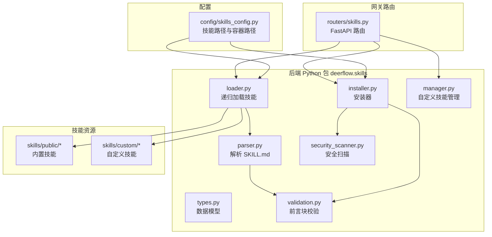
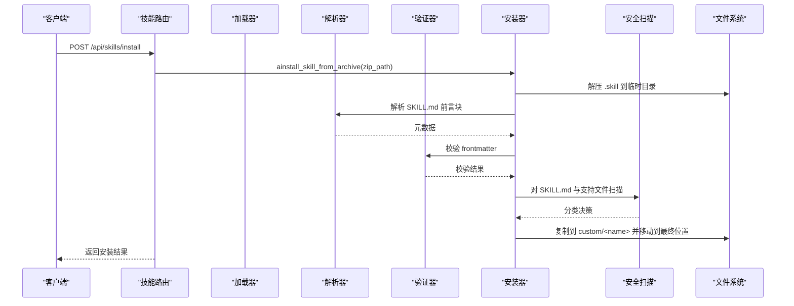
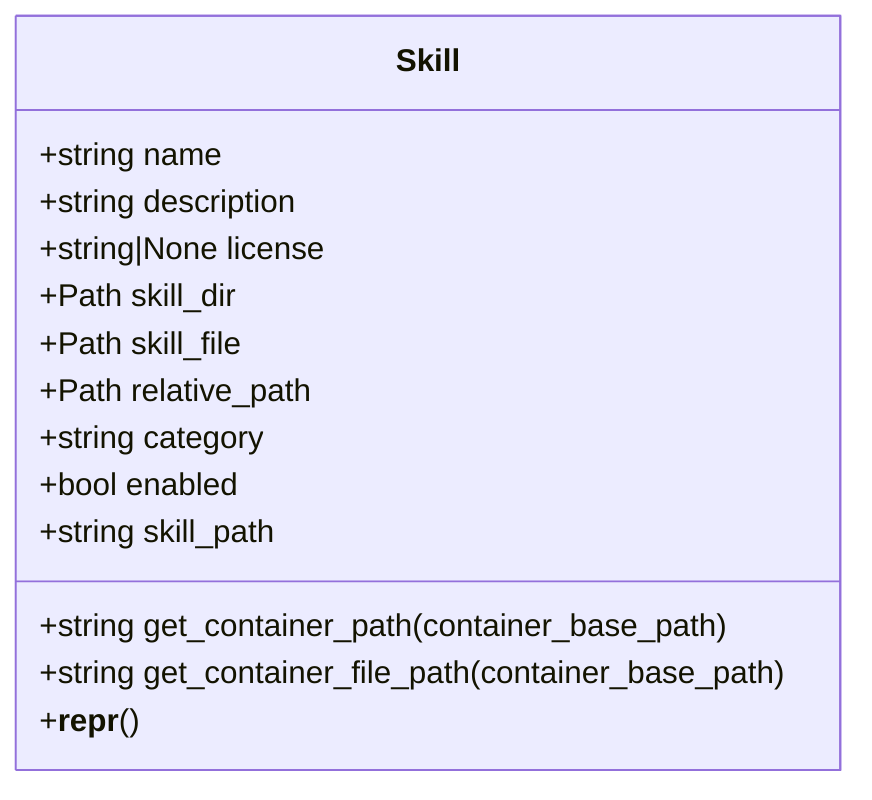
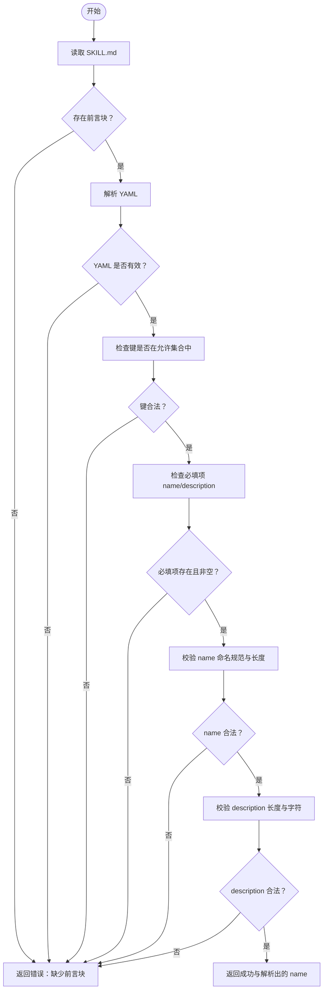
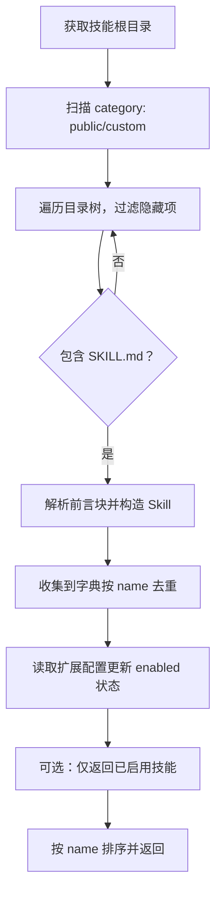
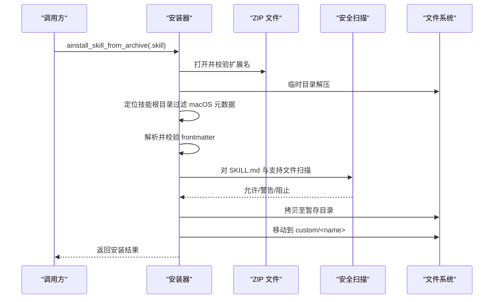
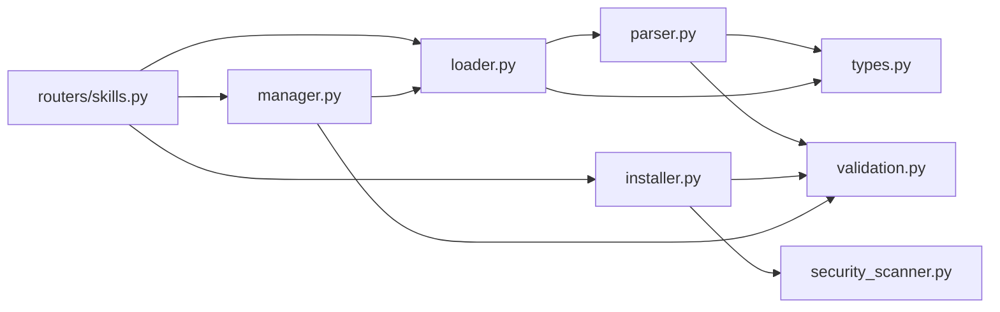

# 技能系统

<cite>
**本文引用的文件**
- [backend/packages/harness/deerflow/skills/__init__.py](file://backend/packages/harness/deerflow/skills/__init__.py)
- [backend/packages/harness/deerflow/skills/types.py](file://backend/packages/harness/deerflow/skills/types.py)
- [backend/packages/harness/deerflow/skills/loader.py](file://backend/packages/harness/deerflow/skills/loader.py)
- [backend/packages/harness/deerflow/skills/parser.py](file://backend/packages/harness/deerflow/skills/parser.py)
- [backend/packages/harness/deerflow/skills/validation.py](file://backend/packages/harness/deerflow/skills/validation.py)
- [backend/packages/harness/deerflow/skills/installer.py](file://backend/packages/harness/deerflow/skills/installer.py)
- [backend/packages/harness/deerflow/skills/security_scanner.py](file://backend/packages/harness/deerflow/skills/security_scanner.py)
- [backend/packages/harness/deerflow/skills/manager.py](file://backend/packages/harness/deerflow/skills/manager.py)
- [backend/app/gateway/routers/skills.py](file://backend/app/gateway/routers/skills.py)
- [backend/packages/harness/deerflow/config/skills_config.py](file://backend/packages/harness/deerflow/config/skills_config.py)
- [skills/public/bootstrap/SKILL.md](file://skills/public/bootstrap/SKILL.md)
- [skills/public/chart-visualization/SKILL.md](file://skills/public/chart-visualization/SKILL.md)
- [backend/tests/test_skills_loader.py](file://backend/tests/test_skills_loader.py)
- [backend/tests/test_skills_installer.py](file://backend/tests/test_skills_installer.py)
- [backend/tests/test_skills_validation.py](file://backend/tests/test_skills_validation.py)
</cite>

## 目录
1. [简介](#简介)
2. [项目结构](#项目结构)
3. [核心组件](#核心组件)
4. [架构总览](#架构总览)
5. [详细组件分析](#详细组件分析)
6. [依赖分析](#依赖分析)
7. [性能考虑](#性能考虑)
8. [故障排查指南](#故障排查指南)
9. [结论](#结论)
10. [附录](#附录)

## 简介
本文件面向 DeerFlow 的技能系统，提供从设计原理到实现机制的完整技术文档。内容涵盖：
- 技能文件格式与元数据结构（SKILL.md 前言块）
- 技能加载与缓存策略、依赖管理
- 技能安装器的安装流程、版本管理与冲突处理
- 技能验证系统：语法检查、依赖验证与安全扫描
- 技能开发指南：模板使用、最佳实践与测试方法
- 内置技能与自定义技能的区别及扩展方式

## 项目结构
技能系统主要由后端 Python 包 deerflow.skills 提供能力，并通过网关路由对外暴露 API；技能资源位于仓库根目录下的 skills 子树，分为 public 与 custom 两类。

图表来源
- [backend/packages/harness/deerflow/skills/loader.py:25-104](file://backend/packages/harness/deerflow/skills/loader.py#L25-L104)
- [backend/packages/harness/deerflow/skills/installer.py:198-291](file://backend/packages/harness/deerflow/skills/installer.py#L198-L291)
- [backend/app/gateway/routers/skills.py:104-363](file://backend/app/gateway/routers/skills.py#L104-L363)
- [backend/packages/harness/deerflow/config/skills_config.py:23-55](file://backend/packages/harness/deerflow/config/skills_config.py#L23-L55)

章节来源
- [backend/packages/harness/deerflow/skills/__init__.py:1-17](file://backend/packages/harness/deerflow/skills/__init__.py#L1-L17)
- [backend/packages/harness/deerflow/skills/loader.py:11-104](file://backend/packages/harness/deerflow/skills/loader.py#L11-L104)
- [backend/app/gateway/routers/skills.py:31-363](file://backend/app/gateway/routers/skills.py#L31-L363)
- [backend/packages/harness/deerflow/config/skills_config.py:11-55](file://backend/packages/harness/deerflow/config/skills_config.py#L11-L55)

## 核心组件
- 数据模型与类型：Skill 类封装技能元数据与容器路径计算。
- 解析与验证：解析 SKILL.md 前言块并进行字段合法性校验。
- 加载器：递归扫描 public/custom 目录，构建技能列表并合并启用状态。
- 安装器：从 .skill 归档安全解压、前置校验、安全扫描、原子写入与目标迁移。
- 安全扫描：基于 LLM 的内容分类（allow/warn/block）。
- 自定义技能管理：命名规范、支持文件路径约束、历史记录与回滚。
- 网关路由：对外提供技能查询、安装、编辑、删除、启用禁用等接口。

章节来源
- [backend/packages/harness/deerflow/skills/types.py:5-54](file://backend/packages/harness/deerflow/skills/types.py#L5-L54)
- [backend/packages/harness/deerflow/skills/parser.py:12-81](file://backend/packages/harness/deerflow/skills/parser.py#L12-L81)
- [backend/packages/harness/deerflow/skills/validation.py:15-86](file://backend/packages/harness/deerflow/skills/validation.py#L15-L86)
- [backend/packages/harness/deerflow/skills/loader.py:25-104](file://backend/packages/harness/deerflow/skills/loader.py#L25-L104)
- [backend/packages/harness/deerflow/skills/installer.py:198-291](file://backend/packages/harness/deerflow/skills/installer.py#L198-L291)
- [backend/packages/harness/deerflow/skills/security_scanner.py:38-69](file://backend/packages/harness/deerflow/skills/security_scanner.py#L38-L69)
- [backend/packages/harness/deerflow/skills/manager.py:23-160](file://backend/packages/harness/deerflow/skills/manager.py#L23-L160)
- [backend/app/gateway/routers/skills.py:34-363](file://backend/app/gateway/routers/skills.py#L34-L363)

## 架构总览
技能系统采用“纯业务逻辑 + 网关路由”的分层设计：
- 纯业务逻辑层：loader、parser、validation、installer、security_scanner、manager
- 接口层：routers/skills.py 将业务能力暴露为 HTTP 接口
- 配置层：skills_config 提供技能根目录与容器挂载路径

图表来源
- [backend/app/gateway/routers/skills.py:113-136](file://backend/app/gateway/routers/skills.py#L113-L136)
- [backend/packages/harness/deerflow/skills/installer.py:198-291](file://backend/packages/harness/deerflow/skills/installer.py#L198-L291)
- [backend/packages/harness/deerflow/skills/parser.py:12-81](file://backend/packages/harness/deerflow/skills/parser.py#L12-L81)
- [backend/packages/harness/deerflow/skills/validation.py:15-86](file://backend/packages/harness/deerflow/skills/validation.py#L15-L86)
- [backend/packages/harness/deerflow/skills/security_scanner.py:38-69](file://backend/packages/harness/deerflow/skills/security_scanner.py#L38-L69)

## 详细组件分析

### 数据模型与类型（Skill）
- 字段包含：名称、描述、许可证、技能目录与主文件路径、相对路径、类别（public/custom）、启用状态。
- 容器路径计算：根据类别与相对路径生成容器内挂载路径，便于沙箱运行时访问。

图表来源
- [backend/packages/harness/deerflow/skills/types.py:5-54](file://backend/packages/harness/deerflow/skills/types.py#L5-L54)

章节来源
- [backend/packages/harness/deerflow/skills/types.py:5-54](file://backend/packages/harness/deerflow/skills/types.py#L5-L54)

### 解析与验证（SKILL.md 前言块）
- 解析：提取三连横线围栏内的 YAML 前言块，转换为字典。
- 验证：检查允许字段集合、必填项、字符串类型、长度限制、命名规范（仅小写字母、数字、短横线，不含连续短横线、不以短横线开头或结尾）。

图表来源
- [backend/packages/harness/deerflow/skills/parser.py:12-81](file://backend/packages/harness/deerflow/skills/parser.py#L12-L81)
- [backend/packages/harness/deerflow/skills/validation.py:15-86](file://backend/packages/harness/deerflow/skills/validation.py#L15-L86)

章节来源
- [backend/packages/harness/deerflow/skills/parser.py:12-81](file://backend/packages/harness/deerflow/skills/parser.py#L12-L81)
- [backend/packages/harness/deerflow/skills/validation.py:15-86](file://backend/packages/harness/deerflow/skills/validation.py#L15-L86)

### 技能加载与缓存策略
- 递归扫描：遍历 public/custom 目录，跳过隐藏目录，遇到 SKILL.md 即解析。
- 启用状态：从扩展配置文件读取最新状态，确保网关进程外变更也能即时反映。
- 排序与去重：按名称排序，同名时优先 custom 版本（后者覆盖前者）。

图表来源
- [backend/packages/harness/deerflow/skills/loader.py:25-104](file://backend/packages/harness/deerflow/skills/loader.py#L25-L104)

章节来源
- [backend/packages/harness/deerflow/skills/loader.py:25-104](file://backend/packages/harness/deerflow/skills/loader.py#L25-L104)
- [backend/tests/test_skills_loader.py:22-77](file://backend/tests/test_skills_loader.py#L22-L77)

### 技能安装器（.skill 归档）
- 安全解压：拒绝绝对路径、目录穿越、符号链接；限制总解压大小防止 ZIP Bomb。
- 前言块校验：确保 name/description 存在且符合规范。
- 安全扫描：对 SKILL.md 与支持文件（references/templates/scripts 等）进行扫描，脚本标记为可执行。
- 原子安装：使用暂存目录与移动操作，失败自动清理残留。
- 冲突处理：若目标已存在则抛出异常，避免覆盖。

图表来源
- [backend/packages/harness/deerflow/skills/installer.py:198-291](file://backend/packages/harness/deerflow/skills/installer.py#L198-L291)
- [backend/packages/harness/deerflow/skills/security_scanner.py:38-69](file://backend/packages/harness/deerflow/skills/security_scanner.py#L38-L69)

章节来源
- [backend/packages/harness/deerflow/skills/installer.py:198-291](file://backend/packages/harness/deerflow/skills/installer.py#L198-L291)
- [backend/tests/test_skills_installer.py:174-410](file://backend/tests/test_skills_installer.py#L174-L410)

### 技能验证系统
- 语法检查：YAML 前言块解析与键集合校验。
- 依赖验证：通过扩展配置文件维护技能启用状态。
- 安全扫描：基于 LLM 的内容分类，对脚本类文件要求明确许可。

章节来源
- [backend/packages/harness/deerflow/skills/validation.py:15-86](file://backend/packages/harness/deerflow/skills/validation.py#L15-L86)
- [backend/packages/harness/deerflow/skills/security_scanner.py:38-69](file://backend/packages/harness/deerflow/skills/security_scanner.py#L38-L69)
- [backend/app/gateway/routers/skills.py:321-357](file://backend/app/gateway/routers/skills.py#L321-L357)

### 自定义技能管理
- 命名规范：小写、数字、短横线，长度限制，不允许内置同名覆盖。
- 支持文件路径约束：仅允许 references、templates、scripts、assets 子目录，禁止父目录跳转。
- 历史记录：JSONL 追加记录变更，支持回滚。
- 原子写入：临时文件写入后替换，保证一致性。

章节来源
- [backend/packages/harness/deerflow/skills/manager.py:23-160](file://backend/packages/harness/deerflow/skills/manager.py#L23-L160)
- [backend/app/gateway/routers/skills.py:163-291](file://backend/app/gateway/routers/skills.py#L163-L291)

### 网关路由与工作流
- 列表与详情：获取所有技能、指定技能详情。
- 安装：从线程虚拟路径解析 .skill 文件并安装。
- 编辑/删除/回滚：对自定义技能进行内容更新、删除与历史回滚。
- 启用/禁用：修改扩展配置并刷新系统提示词缓存。

章节来源
- [backend/app/gateway/routers/skills.py:98-363](file://backend/app/gateway/routers/skills.py#L98-L363)

## 依赖分析
- 组件内聚性：skills 包内部模块职责清晰，loader 依赖 parser 与 types；installer 依赖 loader、security_scanner、validation。
- 外部依赖点：网关路由依赖扩展配置与系统提示词缓存刷新；安全扫描依赖应用配置与模型工厂。
- 循环依赖：未发现循环导入；各模块均为单向依赖。

图表来源
- [backend/app/gateway/routers/skills.py:13-27](file://backend/app/gateway/routers/skills.py#L13-L27)
- [backend/packages/harness/deerflow/skills/loader.py:5-6](file://backend/packages/harness/deerflow/skills/loader.py#L5-L6)
- [backend/packages/harness/deerflow/skills/installer.py:17-19](file://backend/packages/harness/deerflow/skills/installer.py#L17-L19)

章节来源
- [backend/app/gateway/routers/skills.py:13-27](file://backend/app/gateway/routers/skills.py#L13-L27)
- [backend/packages/harness/deerflow/skills/loader.py:5-6](file://backend/packages/harness/deerflow/skills/loader.py#L5-L6)
- [backend/packages/harness/deerflow/skills/installer.py:17-19](file://backend/packages/harness/deerflow/skills/installer.py#L17-L19)

## 性能考虑
- 加载性能：递归遍历受目录层级影响，建议控制嵌套深度；启用过滤隐藏目录可减少无效 IO。
- 安装性能：解压阶段限制总大小与分块读写，避免内存峰值；扫描阶段异步调用模型，注意并发与超时。
- 缓存策略：加载器直接读取磁盘最新扩展配置，确保多进程一致性；系统提示词缓存需在关键操作后刷新。

## 故障排查指南
- 安装失败
  - “归档包含不安全成员路径”：检查 .skill 中是否存在绝对路径或目录穿越。
  - “符号链接被跳过”：归档中包含符号链接，属于预期行为。
  - “归档过大或高度压缩”：超过总大小阈值，调整归档或增大阈值。
  - “重复名称”：custom/<name> 已存在，先删除或改名。
  - “前言块无效”：确认 SKILL.md 使用三连横线围栏，YAML 语法正确。
  - “安全扫描阻止”：检查内容是否包含敏感模式，必要时降级为警告或人工审核。
- 编辑失败
  - “内置技能不可直接编辑”：需在 custom 下新建同名技能。
  - “路径越界或非法”：仅允许支持目录与合法子路径。
- 回滚失败
  - “历史为空或索引越界”：确认历史文件存在且索引有效。
  - “扫描阻止回滚”：回滚目标内容仍被判定为风险。

章节来源
- [backend/packages/harness/deerflow/skills/installer.py:35-176](file://backend/packages/harness/deerflow/skills/installer.py#L35-L176)
- [backend/packages/harness/deerflow/skills/manager.py:76-104](file://backend/packages/harness/deerflow/skills/manager.py#L76-L104)
- [backend/tests/test_skills_installer.py:109-410](file://backend/tests/test_skills_installer.py#L109-L410)
- [backend/tests/test_skills_validation.py:19-181](file://backend/tests/test_skills_validation.py#L19-L181)

## 结论
DeerFlow 技能系统通过清晰的分层设计实现了“可验证、可安装、可管理”的闭环：以 SKILL.md 前言块作为统一元数据入口，结合严格的解析与验证、安全扫描与安装保护，确保技能生态的安全与稳定；同时提供自定义技能的命名规范、支持文件约束与历史回滚能力，便于持续演进与治理。

## 附录

### 技能文件格式与元数据结构
- 必填字段：name、description
- 允许字段：license、allowed-tools、metadata、compatibility、version、author
- 命名规范：小写、数字、短横线，长度 ≤ 64，不含连续短横线，不以短横线开头或结尾
- 描述规范：不含尖括号，长度 ≤ 1024

章节来源
- [backend/packages/harness/deerflow/skills/validation.py:11-12](file://backend/packages/harness/deerflow/skills/validation.py#L11-L12)
- [backend/packages/harness/deerflow/skills/validation.py:52-84](file://backend/packages/harness/deerflow/skills/validation.py#L52-L84)
- [skills/public/bootstrap/SKILL.md:1-10](file://skills/public/bootstrap/SKILL.md#L1-L10)
- [skills/public/chart-visualization/SKILL.md:1-6](file://skills/public/chart-visualization/SKILL.md#L1-L6)

### 技能工作流程定义
- 内置技能：位于 skills/public，遵循统一目录结构（如 references、templates、scripts），通过 SKILL.md 描述工作流与参考材料。
- 自定义技能：位于 skills/custom，支持编辑、回滚与历史审计。

章节来源
- [skills/public/bootstrap/SKILL.md:16-95](file://skills/public/bootstrap/SKILL.md#L16-L95)
- [skills/public/chart-visualization/SKILL.md:12-73](file://skills/public/chart-visualization/SKILL.md#L12-L73)

### 技能加载机制与依赖管理
- 路径解析：默认基于 backend 上级目录的 skills；可通过配置覆盖。
- 依赖管理：启用状态来自扩展配置文件，加载时合并；容器内路径由配置决定。

章节来源
- [backend/packages/harness/deerflow/config/skills_config.py:23-55](file://backend/packages/harness/deerflow/config/skills_config.py#L23-L55)
- [backend/packages/harness/deerflow/skills/loader.py:42-54](file://backend/packages/harness/deerflow/skills/loader.py#L42-L54)
- [backend/packages/harness/deerflow/skills/types.py:24-50](file://backend/packages/harness/deerflow/skills/types.py#L24-L50)

### 技能安装器实现要点
- 安全性：拒绝绝对路径、目录穿越、符号链接；限制总大小；扫描 SKILL.md 与支持文件。
- 可靠性：暂存目录 + 原子移动；异常时清理残留；重复目标抛错。
- 可观测性：记录安装结果与错误信息。

章节来源
- [backend/packages/harness/deerflow/skills/installer.py:35-176](file://backend/packages/harness/deerflow/skills/installer.py#L35-L176)
- [backend/packages/harness/deerflow/skills/installer.py:198-291](file://backend/packages/harness/deerflow/skills/installer.py#L198-L291)

### 技能验证系统功能
- 语法检查：三连横线前言块、YAML 解析、键集合校验。
- 依赖验证：扩展配置中的 enabled 状态。
- 安全扫描：LLM 分类（allow/warn/block），脚本类文件严格校验。

章节来源
- [backend/packages/harness/deerflow/skills/validation.py:15-86](file://backend/packages/harness/deerflow/skills/validation.py#L15-L86)
- [backend/packages/harness/deerflow/skills/security_scanner.py:38-69](file://backend/packages/harness/deerflow/skills/security_scanner.py#L38-L69)

### 技能开发指南
- 模板使用：参考内置技能的目录组织（references、templates、scripts），在 SKILL.md 中描述工作流。
- 最佳实践：保持 name 与 description 符合规范；避免在 description 中使用尖括号；控制内容长度。
- 测试方法：使用测试用例覆盖解析、安装与验证场景，确保边界条件与异常路径均被覆盖。

章节来源
- [backend/tests/test_skills_loader.py:22-77](file://backend/tests/test_skills_loader.py#L22-L77)
- [backend/tests/test_skills_validation.py:19-181](file://backend/tests/test_skills_validation.py#L19-L181)
- [backend/tests/test_skills_installer.py:174-410](file://backend/tests/test_skills_installer.py#L174-L410)

### 内置技能与自定义技能的区别
- 内置技能（public）：只读，不可直接编辑；若需定制，应复制到 custom 下新建同名技能。
- 自定义技能（custom）：可编辑、可删除、可回滚、有历史记录。

章节来源
- [backend/packages/harness/deerflow/skills/manager.py:68-82](file://backend/packages/harness/deerflow/skills/manager.py#L68-L82)
- [backend/app/gateway/routers/skills.py:163-291](file://backend/app/gateway/routers/skills.py#L163-L291)