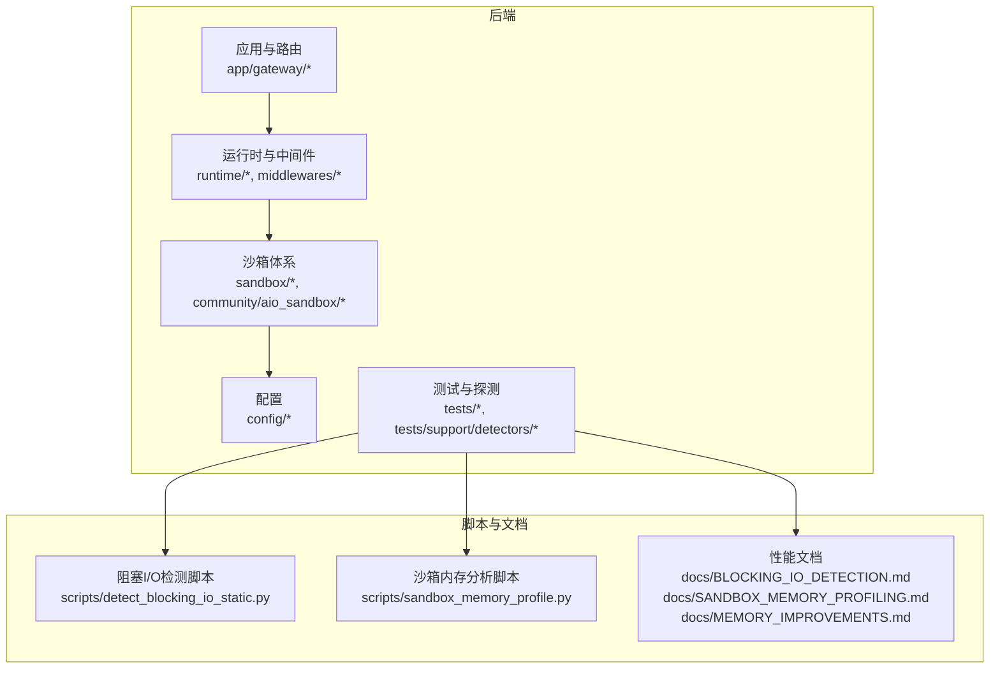
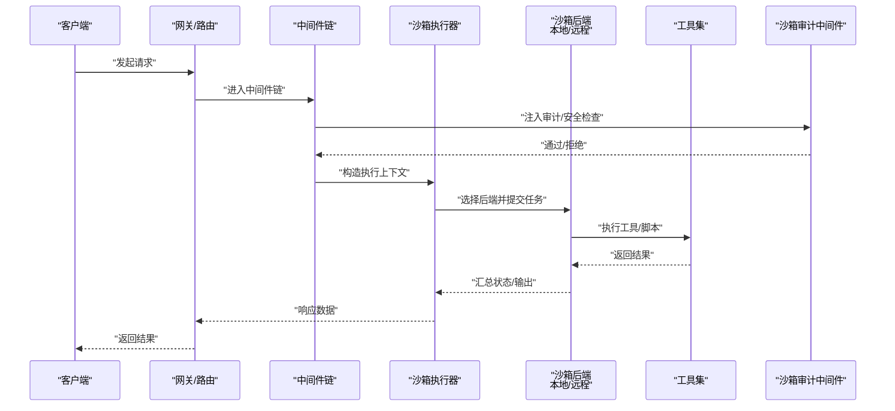
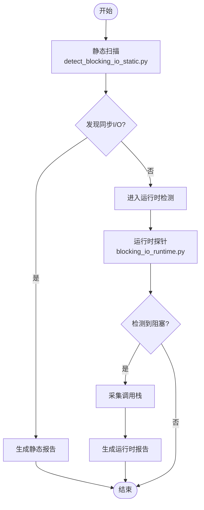
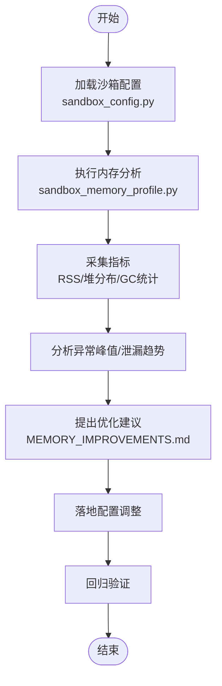
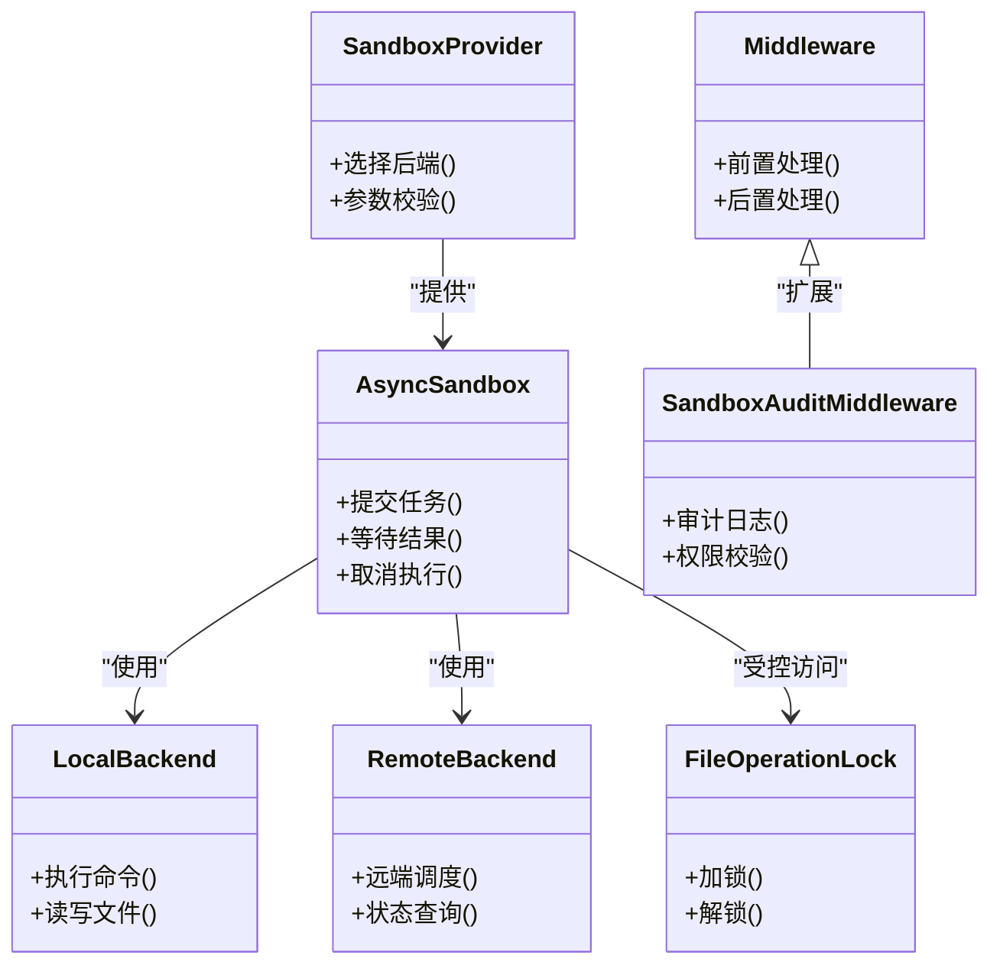
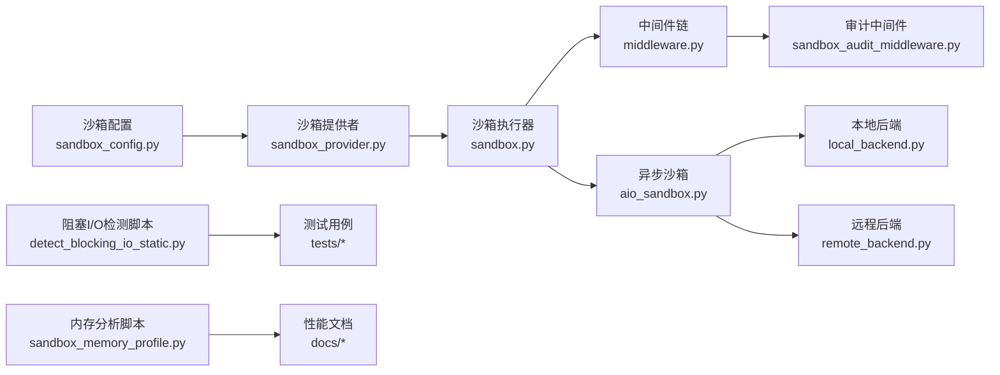

# 性能问题

<cite>
**本文引用的文件**
- [SANDBOX_MEMORY_PROFILING.md](file://backend/docs/SANDBOX_MEMORY_PROFILING.md)
- [MEMORY_IMPROVEMENTS.md](file://backend/docs/MEMORY_IMPROVEMENTS.md)
- [BLOCKING_IO_DETECTION.md](file://backend/docs/BLOCKING_IO_DETECTION.md)
- [sandbox_memory_profile.py](file://scripts/sandbox_memory_profile.py)
- [detect_blocking_io_static.py](file://scripts/detect_blocking_io_static.py)
- [blocking_io.py](file://backend/tests/support/detectors/blocking_io.py)
- [blocking_io_runtime.py](file://backend/tests/support/detectors/blocking_io_runtime.py)
- [blocking_io_static.py](file://backend/tests/support/detectors/blocking_io_static.py)
- [test_blocking_io_detector.py](file://backend/tests/test_blocking_io_detector.py)
- [test_blocking_io_probe_integration.py](file://backend/tests/test_blocking_io_probe_integration.py)
- [test_detect_blocking_io_static.py](file://backend/tests/test_detect_blocking_io_static.py)
- [aio_sandbox.py](file://backend/packages/harness/deerflow/community/aio_sandbox/aio_sandbox.py)
- [aio_sandbox_provider.py](file://backend/packages/harness/deerflow/community/aio_sandbox/aio_sandbox_provider.py)
- [local_backend.py](file://backend/packages/harness/deerflow/community/aio_sandbox/local_backend.py)
- [remote_backend.py](file://backend/packages/harness/deerflow/community/aio_sandbox/remote_backend.py)
- [sandbox.py](file://backend/packages/harness/deerflow/sandbox/sandbox.py)
- [sandbox_provider.py](file://backend/packages/harness/deerflow/sandbox/sandbox_provider.py)
- [middleware.py](file://backend/packages/harness/deerflow/sandbox/middleware.py)
- [sandbox_audit_middleware.py](file://backend/packages/harness/deerflow/agents/middlewares/sandbox_audit_middleware.py)
- [sandbox_config.py](file://backend/packages/harness/deerflow/config/sandbox_config.py)
- [file_operation_lock.py](file://backend/packages/harness/deerflow/sandbox/file_operation_lock.py)
- [README.md](file://backend/README.md)
</cite>

## 目录
1. [简介](#简介)
2. [项目结构](#项目结构)
3. [核心组件](#核心组件)
4. [架构总览](#架构总览)
5. [详细组件分析](#详细组件分析)
6. [依赖关系分析](#依赖关系分析)
7. [性能考虑](#性能考虑)
8. [故障排查指南](#故障排查指南)
9. [结论](#结论)
10. [附录](#附录)

## 简介
本指南聚焦于deer-flow后端在实际运行中可能遇到的性能问题，包括但不限于：内存使用异常、CPU占用过高、I/O阻塞检测、沙箱性能瓶颈等。文档提供基于仓库现有资料的诊断流程、工具使用方法与优化策略，并给出持续监控与基准测试建议。为避免泄露实现细节，本指南不直接展示代码片段，仅通过“章节来源”标注具体文件路径以便查阅。

## 项目结构
后端采用Python生态，核心能力由packages/harness/deerflow下的运行时与沙箱模块构成；性能相关的文档与脚本位于backend/docs与scripts目录；测试用例覆盖阻塞I/O检测与沙箱内存分析。

图示来源
- [aio_sandbox.py](file://backend/packages/harness/deerflow/community/aio_sandbox/aio_sandbox.py)
- [sandbox.py](file://backend/packages/harness/deerflow/sandbox/sandbox.py)
- [middleware.py](file://backend/packages/harness/deerflow/sandbox/middleware.py)
- [detect_blocking_io_static.py](file://scripts/detect_blocking_io_static.py)
- [sandbox_memory_profile.py](file://scripts/sandbox_memory_profile.py)

章节来源
- [README.md](file://backend/README.md)

## 核心组件
- 沙箱执行与隔离：提供本地与远程后端、工具集、安全审计与中间件，支撑任务在受限环境中的并发与隔离执行。
- 异步沙箱：以异步方式封装沙箱调用，降低线程阻塞风险，提升吞吐。
- 阻塞I/O检测：静态与运行时两套探测器，定位潜在阻塞点。
- 内存分析：沙箱内存配置与分析脚本，辅助识别异常峰值与泄漏趋势。
- 中间件与审计：在请求链路中注入沙箱审计与安全检查，保障稳定性与可观测性。

章节来源
- [aio_sandbox.py](file://backend/packages/harness/deerflow/community/aio_sandbox/aio_sandbox.py)
- [aio_sandbox_provider.py](file://backend/packages/harness/deerflow/community/aio_sandbox/aio_sandbox_provider.py)
- [local_backend.py](file://backend/packages/harness/deerflow/community/aio_sandbox/local_backend.py)
- [remote_backend.py](file://backend/packages/harness/deerflow/community/aio_sandbox/remote_backend.py)
- [sandbox.py](file://backend/packages/harness/deerflow/sandbox/sandbox.py)
- [sandbox_provider.py](file://backend/packages/harness/deerflow/sandbox/sandbox_provider.py)
- [middleware.py](file://backend/packages/harness/deerflow/sandbox/middleware.py)
- [sandbox_audit_middleware.py](file://backend/packages/harness/deerflow/agents/middlewares/sandbox_audit_middleware.py)
- [sandbox_config.py](file://backend/packages/harness/deerflow/config/sandbox_config.py)
- [file_operation_lock.py](file://backend/packages/harness/deerflow/sandbox/file_operation_lock.py)

## 架构总览
下图展示从请求进入网关到沙箱执行的关键路径，以及阻塞I/O与内存分析的介入点。

图示来源
- [middleware.py](file://backend/packages/harness/deerflow/sandbox/middleware.py)
- [sandbox_audit_middleware.py](file://backend/packages/harness/deerflow/agents/middlewares/sandbox_audit_middleware.py)
- [aio_sandbox.py](file://backend/packages/harness/deerflow/community/aio_sandbox/aio_sandbox.py)
- [local_backend.py](file://backend/packages/harness/deerflow/community/aio_sandbox/local_backend.py)
- [remote_backend.py](file://backend/packages/harness/deerflow/community/aio_sandbox/remote_backend.py)

## 详细组件分析

### 组件A：阻塞I/O检测
- 静态检测：通过脚本扫描源码中的同步I/O模式，识别潜在阻塞风险。
- 运行时检测：在测试环境中对运行时进行探针式检测，定位阻塞发生的函数栈与调用路径。
- 测试集成：多条测试用例验证检测器的正确性与鲁棒性。

图示来源
- [detect_blocking_io_static.py](file://scripts/detect_blocking_io_static.py)
- [blocking_io_runtime.py](file://backend/tests/support/detectors/blocking_io_runtime.py)
- [blocking_io_static.py](file://backend/tests/support/detectors/blocking_io_static.py)
- [test_detect_blocking_io_static.py](file://backend/tests/test_detect_blocking_io_static.py)
- [test_blocking_io_detector.py](file://backend/tests/test_blocking_io_detector.py)
- [test_blocking_io_probe_integration.py](file://backend/tests/test_blocking_io_probe_integration.py)

章节来源
- [BLOCKING_IO_DETECTION.md](file://backend/docs/BLOCKING_IO_DETECTION.md)
- [detect_blocking_io_static.py](file://scripts/detect_blocking_io_static.py)
- [blocking_io.py](file://backend/tests/support/detectors/blocking_io.py)
- [blocking_io_runtime.py](file://backend/tests/support/detectors/blocking_io_runtime.py)
- [blocking_io_static.py](file://backend/tests/support/detectors/blocking_io_static.py)
- [test_detect_blocking_io_static.py](file://backend/tests/test_detect_blocking_io_static.py)
- [test_blocking_io_detector.py](file://backend/tests/test_blocking_io_detector.py)
- [test_blocking_io_probe_integration.py](file://backend/tests/test_blocking_io_probe_integration.py)

### 组件B：沙箱内存分析与优化
- 分析脚本：提供沙箱内存配置与采样方法，用于定位异常峰值与泄漏趋势。
- 文档指导：涵盖内存设置回顾、优化建议与最佳实践。
- 配置入口：通过沙箱配置模块统一管理内存参数。

图示来源
- [sandbox_config.py](file://backend/packages/harness/deerflow/config/sandbox_config.py)
- [sandbox_memory_profile.py](file://scripts/sandbox_memory_profile.py)
- [SANDBOX_MEMORY_PROFILING.md](file://backend/docs/SANDBOX_MEMORY_PROFILING.md)
- [MEMORY_IMPROVEMENTS.md](file://backend/docs/MEMORY_IMPROVEMENTS.md)

章节来源
- [SANDBOX_MEMORY_PROFILING.md](file://backend/docs/SANDBOX_MEMORY_PROFILING.md)
- [MEMORY_IMPROVEMENTS.md](file://backend/docs/MEMORY_IMPROVEMENTS.md)
- [sandbox_memory_profile.py](file://scripts/sandbox_memory_profile.py)
- [sandbox_config.py](file://backend/packages/harness/deerflow/config/sandbox_config.py)

### 组件C：异步沙箱与资源限制
- 异步执行：异步沙箱封装底层调用，减少线程阻塞，提高并发处理能力。
- 资源限制：通过沙箱配置与工具级限制（如文件操作锁）控制资源消耗。
- 安全审计：在中间件中注入审计逻辑，确保执行过程可追踪、可回溯。

图示来源
- [aio_sandbox.py](file://backend/packages/harness/deerflow/community/aio_sandbox/aio_sandbox.py)
- [aio_sandbox_provider.py](file://backend/packages/harness/deerflow/community/aio_sandbox/aio_sandbox_provider.py)
- [local_backend.py](file://backend/packages/harness/deerflow/community/aio_sandbox/local_backend.py)
- [remote_backend.py](file://backend/packages/harness/deerflow/community/aio_sandbox/remote_backend.py)
- [sandbox_provider.py](file://backend/packages/harness/deerflow/sandbox/sandbox_provider.py)
- [middleware.py](file://backend/packages/harness/deerflow/sandbox/middleware.py)
- [sandbox_audit_middleware.py](file://backend/packages/harness/deerflow/agents/middlewares/sandbox_audit_middleware.py)
- [file_operation_lock.py](file://backend/packages/harness/deerflow/sandbox/file_operation_lock.py)

章节来源
- [aio_sandbox.py](file://backend/packages/harness/deerflow/community/aio_sandbox/aio_sandbox.py)
- [aio_sandbox_provider.py](file://backend/packages/harness/deerflow/community/aio_sandbox/aio_sandbox_provider.py)
- [local_backend.py](file://backend/packages/harness/deerflow/community/aio_sandbox/local_backend.py)
- [remote_backend.py](file://backend/packages/harness/deerflow/community/aio_sandbox/remote_backend.py)
- [sandbox_provider.py](file://backend/packages/harness/deerflow/sandbox/sandbox_provider.py)
- [middleware.py](file://backend/packages/harness/deerflow/sandbox/middleware.py)
- [sandbox_audit_middleware.py](file://backend/packages/harness/deerflow/agents/middlewares/sandbox_audit_middleware.py)
- [file_operation_lock.py](file://backend/packages/harness/deerflow/sandbox/file_operation_lock.py)

## 依赖关系分析
- 沙箱执行链路依赖配置模块与中间件链，确保资源限制与安全审计贯穿始终。
- 异步沙箱对本地/远程后端解耦，便于在不同环境下切换与扩展。
- 阻塞I/O检测与内存分析作为独立工具，通过脚本与测试用例集成到CI/CD流程中。

图示来源
- [sandbox_config.py](file://backend/packages/harness/deerflow/config/sandbox_config.py)
- [sandbox_provider.py](file://backend/packages/harness/deerflow/sandbox/sandbox_provider.py)
- [sandbox.py](file://backend/packages/harness/deerflow/sandbox/sandbox.py)
- [middleware.py](file://backend/packages/harness/deerflow/sandbox/middleware.py)
- [sandbox_audit_middleware.py](file://backend/packages/harness/deerflow/agents/middlewares/sandbox_audit_middleware.py)
- [aio_sandbox.py](file://backend/packages/harness/deerflow/community/aio_sandbox/aio_sandbox.py)
- [local_backend.py](file://backend/packages/harness/deerflow/community/aio_sandbox/local_backend.py)
- [remote_backend.py](file://backend/packages/harness/deerflow/community/aio_sandbox/remote_backend.py)
- [detect_blocking_io_static.py](file://scripts/detect_blocking_io_static.py)
- [sandbox_memory_profile.py](file://scripts/sandbox_memory_profile.py)

章节来源
- [sandbox_config.py](file://backend/packages/harness/deerflow/config/sandbox_config.py)
- [sandbox_provider.py](file://backend/packages/harness/deerflow/sandbox/sandbox_provider.py)
- [sandbox.py](file://backend/packages/harness/deerflow/sandbox/sandbox.py)
- [middleware.py](file://backend/packages/harness/deerflow/sandbox/middleware.py)
- [sandbox_audit_middleware.py](file://backend/packages/harness/deerflow/agents/middlewares/sandbox_audit_middleware.py)
- [aio_sandbox.py](file://backend/packages/harness/deerflow/community/aio_sandbox/aio_sandbox.py)
- [local_backend.py](file://backend/packages/harness/deerflow/community/aio_sandbox/local_backend.py)
- [remote_backend.py](file://backend/packages/harness/deerflow/community/aio_sandbox/remote_backend.py)
- [detect_blocking_io_static.py](file://scripts/detect_blocking_io_static.py)
- [sandbox_memory_profile.py](file://scripts/sandbox_memory_profile.py)

## 性能考虑
- 内存使用异常
  - 使用内存分析脚本与文档指导进行基线采集与对比，关注RSS峰值、分配热点与GC频率。
  - 结合内存优化建议调整沙箱内存上限与回收策略，避免频繁Full GC。
- CPU占用过高
  - 优先启用异步沙箱，减少阻塞I/O导致的线程池饥饿；对CPU密集型工具引入队列与限速。
  - 利用阻塞I/O检测定位潜在热点，替换为非阻塞实现或引入缓存。
- I/O阻塞检测
  - 在开发与预生产环境定期运行静态与运行时检测脚本，结合测试用例形成闭环。
  - 对高频I/O路径增加缓冲、批处理与异步化改造。
- 沙箱性能瓶颈
  - 合理设置沙箱资源配额与超时阈值，避免单任务拖垮整体。
  - 通过审计中间件记录执行耗时与资源使用，建立性能画像。

## 故障排查指南
- 阻塞I/O定位
  - 使用静态检测脚本快速扫描同步I/O风险点；对高危路径进行重构或异步化。
  - 运行时检测配合测试用例，复现并记录阻塞发生时的调用栈与上下文。
- 内存异常排查
  - 基于沙箱内存分析脚本采集指标，对比历史基线，识别异常增长趋势。
  - 结合内存优化文档调整配置，必要时引入对象池与弱引用降低持有成本。
- 沙箱执行异常
  - 通过审计中间件与执行日志定位失败节点，检查资源限制与权限配置。
  - 对远程后端进行连通性与超时重试策略验证，避免偶发抖动影响稳定性。

章节来源
- [BLOCKING_IO_DETECTION.md](file://backend/docs/BLOCKING_IO_DETECTION.md)
- [SANDBOX_MEMORY_PROFILING.md](file://backend/docs/SANDBOX_MEMORY_PROFILING.md)
- [MEMORY_IMPROVEMENTS.md](file://backend/docs/MEMORY_IMPROVEMENTS.md)
- [detect_blocking_io_static.py](file://scripts/detect_blocking_io_static.py)
- [sandbox_memory_profile.py](file://scripts/sandbox_memory_profile.py)
- [sandbox_audit_middleware.py](file://backend/packages/harness/deerflow/agents/middlewares/sandbox_audit_middleware.py)

## 结论
通过对阻塞I/O检测、沙箱内存分析与异步执行机制的系统化梳理，结合配置与中间件的协同，可在不侵入业务逻辑的前提下显著提升系统稳定性与性能表现。建议将上述工具与流程纳入日常开发与发布流程，形成持续监控与优化闭环。

## 附录
- 性能基准测试方法
  - 建议在预生产环境构建稳定压测场景，覆盖典型工具调用序列与并发负载，记录QPS、P95/P99延迟与资源占用曲线。
- 持续监控策略
  - 将阻塞I/O与内存分析纳入CI/CD质量门禁，对新增代码进行静态与运行时检测；在生产侧建立告警与自动降载机制。