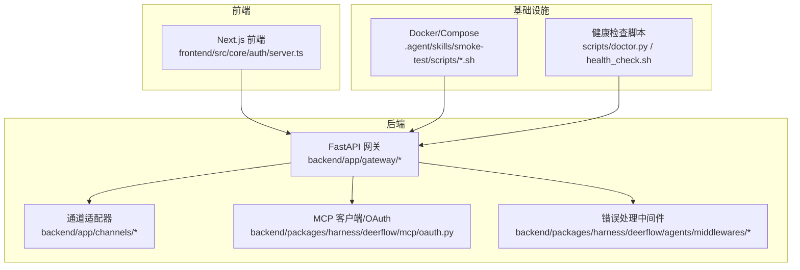
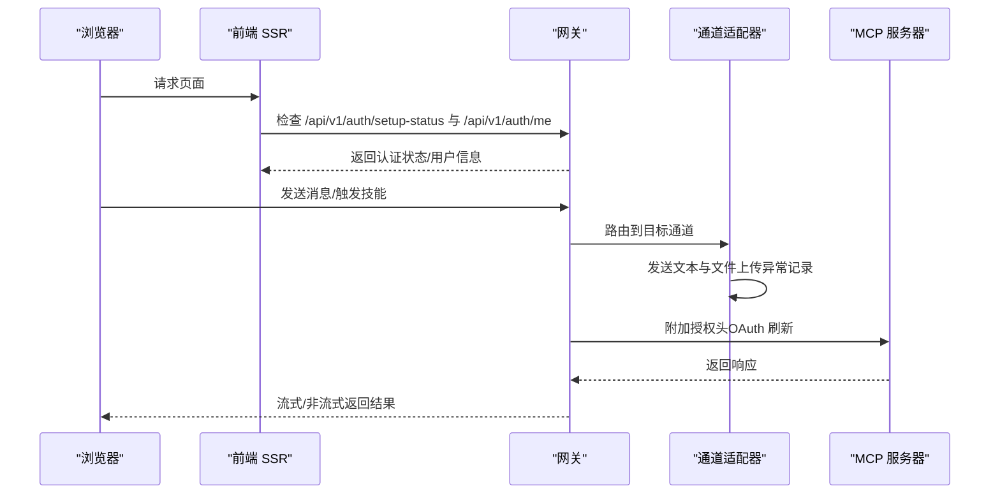
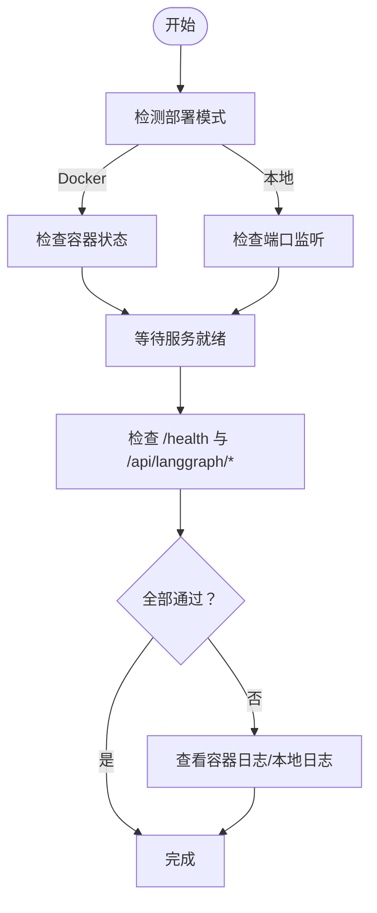
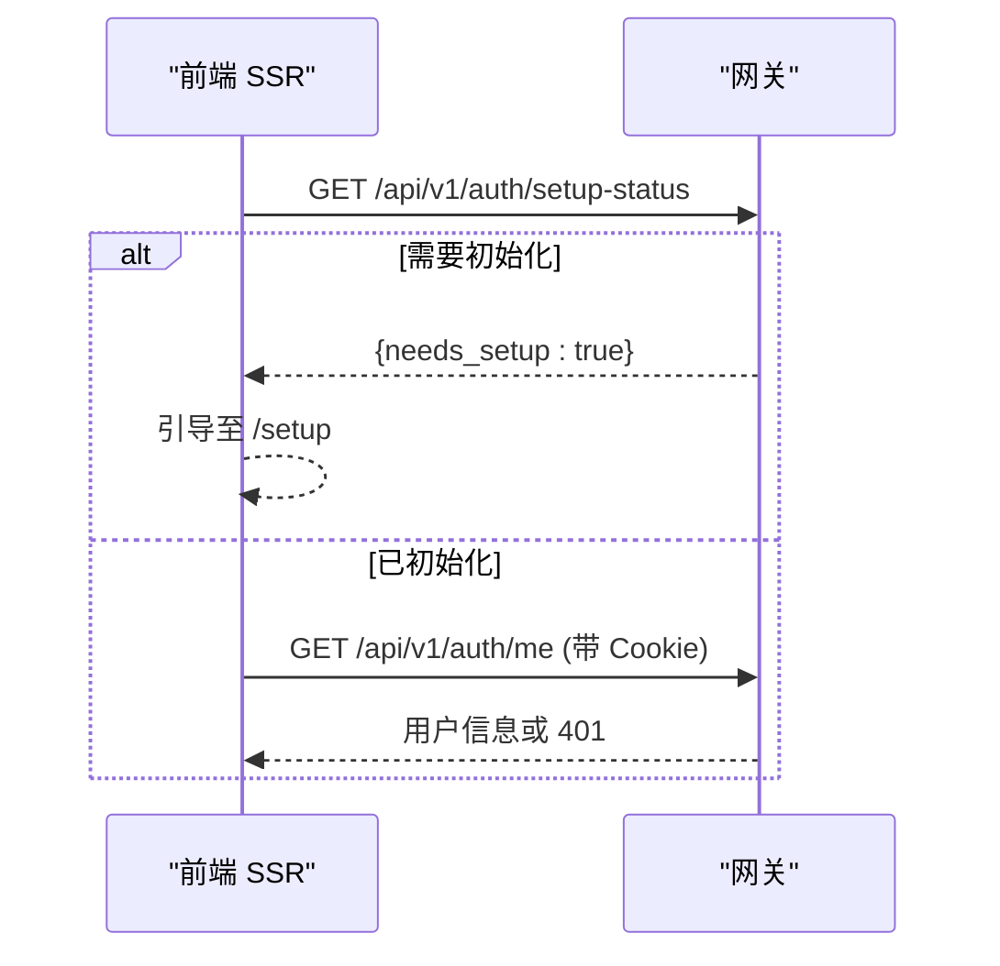
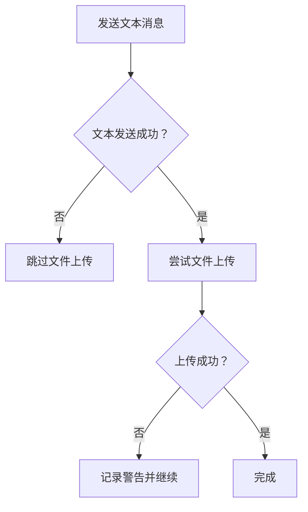
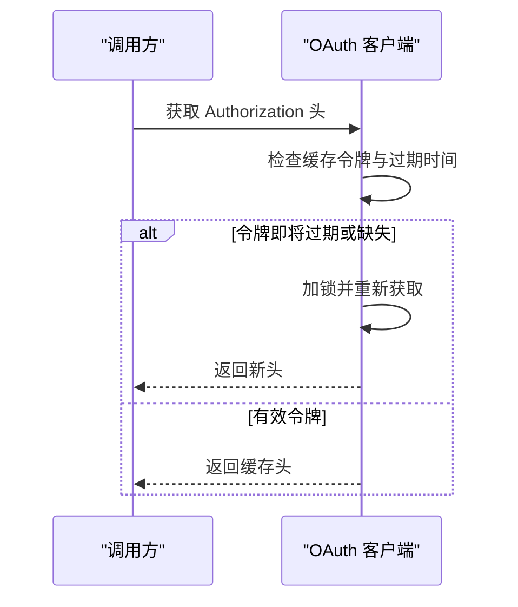
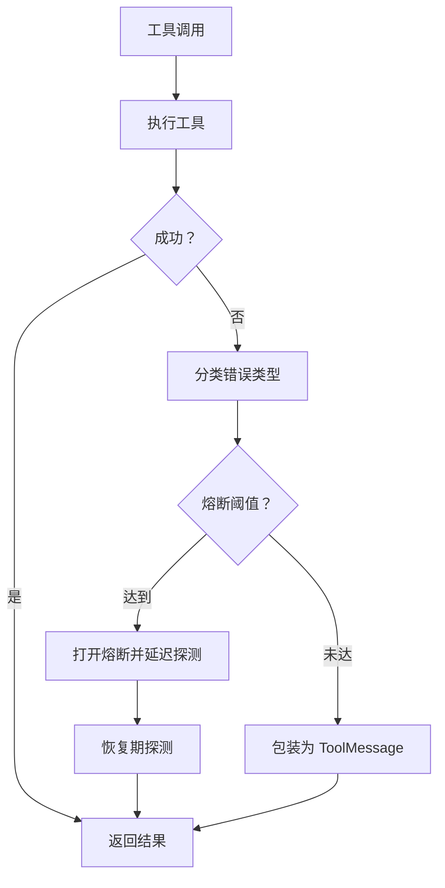
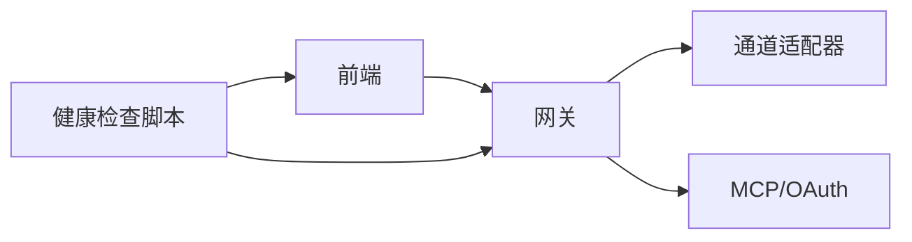

# 故障排除

<cite>
**本文引用的文件**
- [scripts/doctor.py](file://scripts/doctor.py)
- [.agent/skills/smoke-test/scripts/health_check.sh](file://.agent/skills/smoke-test/scripts/health_check.sh)
- [.agent/skills/smoke-test/scripts/deploy_docker.sh](file://.agent/skills/smoke-test/scripts/deploy_docker.sh)
- [.agent/skills/smoke-test/scripts/deploy_local.sh](file://.agent/skills/smoke-test/scripts/deploy_local.sh)
- [.agent/skills/smoke-test/scripts/check_docker.sh](file://.agent/skills/smoke-test/scripts/check_docker.sh)
- [.agent/skills/smoke-test/scripts/check_local_env.sh](file://.agent/skills/smoke-test/scripts/check_local_env.sh)
- [.agent/skills/smoke-test/templates/report.docker.template.md](file://.agent/skills/smoke-test/templates/report.docker.template.md)
- [backend/docs/AUTH_UPGRADE.md](file://backend/docs/AUTH_UPGRADE.md)
- [backend/packages/harness/deerflow/mcp/oauth.py](file://backend/packages/harness/deerflow/mcp/oauth.py)
- [backend/tests/test_mcp_oauth.py](file://backend/tests/test_mcp_oauth.py)
- [backend/packages/harness/deerflow/agents/middlewares/llm_error_handling_middleware.py](file://backend/packages/harness/deerflow/agents/middlewares/llm_error_handling_middleware.py)
- [backend/tests/test_tool_error_handling_middleware.py](file://backend/tests/test_tool_error_handling_middleware.py)
- [backend/tests/test_logging_level_from_config.py](file://backend/tests/test_logging_level_from_config.py)
- [frontend/src/core/auth/server.ts](file://frontend/src/core/auth/server.ts)
- [backend/app/channels/base.py](file://backend/app/channels/base.py)
- [backend/app/channels/manager.py](file://backend/app/channels/manager.py)
- [backend/app/channels/dingtalk.py](file://backend/app/channels/dingtalk.py)
- [backend/app/channels/discord.py](file://backend/app/channels/discord.py)
- [backend/app/channels/feishu.py](file://backend/app/channels/feishu.py)
- [backend/docs/API.md](file://backend/docs/API.md)
- [backend/docs/CONFIGURATION.md](file://backend/docs/CONFIGURATION.md)
- [backend/docs/SETUP.md](file://backend/docs/SETUP.md)
- [backend/docs/BLOCKING_IO_DETECTION.md](file://backend/docs/BLOCKING_IO_DETECTION.md)
- [backend/docs/SANDBOX_MEMORY_PROFILING.md](file://backend/docs/SANDBOX_MEMORY_PROFILING.md)
- [backend/docs/memory-settings-sample.json](file://backend/docs/memory-settings-sample.json)
- [scripts/tool-error-degradation-detection.sh](file://scripts/tool-error-degradation-detection.sh)
- [scripts/wait-for-port.sh](file://scripts/wait-for-port.sh)
- [scripts/sandbox_memory_profile.py](file://scripts/sandbox_memory_profile.py)
- [scripts/detect_blocking_io_static.py](file://scripts/detect_blocking_io_static.py)
- [scripts/detect_thread_boundaries.py](file://scripts/detect_thread_boundaries.py)
- [scripts/detect_uv_extras.py](file://scripts/detect_uv_extras.py)
- [scripts/docker.sh](file://scripts/docker.sh)
- [scripts/compose_detect.sh](file://scripts/compose_detect.sh)
- [scripts/cleanup-containers.sh](file://scripts/cleanup-containers.sh)
- [scripts/serve.sh](file://scripts/serve.sh)
- [scripts/start-daemon.sh](file://scripts/start-daemon.sh)
- [scripts/run-with-git-bash.cmd](file://scripts/run-with-git-bash.cmd)
- [scripts/load_memory_sample.py](file://scripts/load_memory_sample.py)
- [scripts/config-upgrade.sh](file://scripts/config-upgrade.sh)
- [scripts/export_claude_code_oauth.py](file://scripts/export_claude_code_oauth.py)
- [scripts/setup-sandbox.sh](file://scripts/setup-sandbox.sh)
- [scripts/doctor.py](file://scripts/doctor.py)
- [scripts/check.py](file://scripts/check.py)
- [scripts/check.sh](file://scripts/check.sh)
- [scripts/deploy.sh](file://scripts/deploy.sh)
- [scripts/configure.py](file://scripts/configure.py)
- [scripts/setup_wizard.py](file://scripts/setup_wizard.py)
- [scripts/wizard/steps/execution.py](file://scripts/wizard/steps/execution.py)
- [scripts/wizard/steps/llm.py](file://scripts/wizard/steps/llm.py)
- [scripts/wizard/steps/search.py](file://scripts/wizard/steps/search.py)
- [scripts/wizard/providers.py](file://scripts/wizard/providers.py)
- [scripts/wizard/ui.py](file://scripts/wizard/ui.py)
- [scripts/wizard/writer.py](file://scripts/wizard/writer.py)
- [scripts/wizard/__init__.py](file://scripts/wizard/__init__.py)
- [scripts/wizard/__init__.py](file://scripts/wizard/__init__.py)
- [scripts/wizard/steps/__init__.py](file://scripts/wizard/steps/__init__.py)
- [scripts/wizard/steps/execution.py](file://scripts/wizard/steps/execution.py)
- [scripts/wizard/steps/llm.py](file://scripts/wizard/steps/llm.py)
- [scripts/wizard/steps/search.py](file://scripts/wizard/steps/search.py)
- [scripts/wizard/providers.py](file://scripts/wizard/providers.py)
- [scripts/wizard/ui.py](file://scripts/wizard/ui.py)
- [scripts/wizard/writer.py](file://scripts/wizard/writer.py)
- [scripts/wizard/__init__.py](file://scripts/wizard/__init__.py)
- [scripts/wizard/__init__.py](file://scripts/wizard/__init__.py)
- [scripts/wizard/steps/__init__.py](file://scripts/wizard/steps/__init__.py)
- [scripts/wizard/steps/execution.py](file://scripts/wizard/steps/execution.py)
- [scripts/wizard/steps/llm.py](file://scripts/wizard/steps/llm.py)
- [scripts/wizard/steps/search.py](file://scripts/wizard/steps/search.py)
- [scripts/wizard/providers.py](file://scripts/wizard/providers.py)
- [scripts/wizard/ui.py](file://scripts/wizard/ui.py)
- [scripts/wizard/writer.py](file://scripts/wizard/writer.py)
- [scripts/wizard/__init__.py](file://scripts/wizard/__init__.py)
- [scripts/wizard/__init__.py](file://scripts/wizard/__init__.py)
- [scripts/wizard/steps/__init__.py](file://scripts/wizard/steps/__init__.py)
- [scripts/wizard/steps/execution.py](file://scripts/wizard/steps/execution.py)
- [scripts/wizard/steps/llm.py](file://scripts/wizard/steps/llm.py)
- [scripts/wizard/steps/search.py](file://scripts/wizard/steps/search.py)
- [scripts/wizard/providers.py](file://scripts/wizard/providers.py)
- [scripts/wizard/ui.py](file://scripts/wizard/ui.py)
- [scripts/wizard/writer.py](file://scripts/wizard/writer.py)
- [scripts/wizard/__init__.py](file://scripts/wizard/__init__.py)
- [scripts/wizard/__init__.py](file://scripts/wizard/__init__.py)
- [scripts/wizard/steps/__init__.py](file://scripts/wizard/steps/__init__.py)
- [scripts/wizard/steps/execution.py](file://scripts/wizard/steps/execution.py)
- [scripts/wizard/steps/llm.py](file://scripts/wizard/steps/llm.py)
- [scripts/wizard/steps/search.py](file://scripts/wizard/steps/search.py)
- [scripts/wizard/providers.py](file://scripts/wizard/providers.py)
- [scripts/wizard/ui.py](file://scripts/wizard/ui.py)
- [scripts/wizard/writer.py](file://scripts/wizard/writer.py)
- [scripts/wizard/__init__.py](file://scripts/wizard/__init__.py)
- [scripts/wizard/__init__.py](file://scripts/wizard/__init__.py)
- [scripts/wizard/steps/__init__.py](file://scripts/wizard/steps/__init__.py)
- [scripts/wizard/steps/execution.py](file://scripts/wizard/steps/execution.py)
- [scripts/wizard/steps/llm.py](file://scripts/wizard/steps/llm.py)
- [scripts/wizard/steps/search.py](file://scripts/wizard/steps/search.py)
- [scripts/wizard/providers.py](file://scripts/wizard/providers.py)
- [scripts/wizard/ui.py](file://scripts/wizard/ui.py)
- [scripts/wizard/writer.py](file://scripts/wizard/writer.py)
- [scripts/wizard/__init__.py](file://scripts/wizard/__init__.py)
- [scripts/wizard/__init__.py](file://scripts/wizard/__init__.py)
- [scripts/wizard/steps/__init__.py](file://scripts/wizard/steps/__init__.py)
- [scripts/wizard/steps/execution.py](file://scripts/wizard/steps/execution.py)
- [scripts/wizard/steps/llm.py](file://scripts/wizard/st......
</cite>

## 目录
1. [简介](#简介)
2. [项目结构](#项目结构)
3. [核心组件](#核心组件)
4. [架构总览](#架构总览)
5. [详细组件分析](#详细组件分析)
6. [依赖关系分析](#依赖关系分析)
7. [性能考虑](#性能考虑)
8. [故障排除指南](#故障排除指南)
9. [结论](#结论)
10. [附录](#附录)

## 简介
本指南面向部署与运维工程师、开发者与技术支持人员，提供系统化的故障排除流程与解决方案，覆盖部署、配置、运行时三大阶段常见问题，包括性能瓶颈、内存泄漏、网络连接异常、认证失败、通道集成问题、MCP/OAuth 交互异常等。同时给出日志分析方法、调试工具使用与监控指标解读，并针对不同环境（本地、Docker）提供差异化排查步骤与预防措施。

## 项目结构
仓库采用多模块组织方式：前端 Next.js 应用、后端 Python/FastAPI 网关、MCP 服务器、技能与脚本工具集、文档与测试。与故障排除直接相关的资源主要分布在以下位置：
- 健康检查与部署脚本：.agent/skills/smoke-test/scripts 与 scripts/
- 认证与网关：backend/docs 与 frontend/src/core/auth/server.ts
- 通道与消息：backend/app/channels/*
- MCP/OAuth：backend/packages/harness/deerflow/mcp/oauth.py
- 错误处理中间件：backend/packages/harness/deerflow/agents/middlewares/*
- 日志与配置：backend/docs/CONFIGURATION.md、backend/docs/SETUP.md
- 性能与阻塞检测：backend/docs/BLOCKING_IO_DETECTION.md、backend/docs/SANDBOX_MEMORY_PROFILING.md、scripts/

图表来源
- [frontend/src/core/auth/server.ts:41-79](file://frontend/src/core/auth/server.ts#L41-L79)
- [backend/app/channels/base.py:95-111](file://backend/app/channels/base.py#L95-L111)
- [backend/packages/harness/deerflow/mcp/oauth.py:44-78](file://backend/packages/harness/deerflow/mcp/oauth.py#L44-L78)
- [backend/packages/harness/deerflow/agents/middlewares/llm_error_handling_middleware.py:173-183](file://backend/packages/harness/deerflow/agents/middlewares/llm_error_handling_middleware.py#L173-L183)
- [.agent/skills/smoke-test/scripts/health_check.sh:63-124](file://.agent/skills/smoke-test/scripts/health_check.sh#L63-L124)
- [scripts/doctor.py:617-660](file://scripts/doctor.py#L617-L660)

章节来源
- [frontend/src/core/auth/server.ts:41-79](file://frontend/src/core/auth/server.ts#L41-L79)
- [backend/app/channels/base.py:95-111](file://backend/app/channels/base.py#L95-L111)
- [backend/packages/harness/deerflow/mcp/oauth.py:44-78](file://backend/packages/harness/deerflow/mcp/oauth.py#L44-L78)
- [backend/packages/harness/deerflow/agents/middlewares/llm_error_handling_middleware.py:173-183](file://backend/packages/harness/deerflow/agents/middlewares/llm_error_handling_middleware.py#L173-L183)
- [.agent/skills/smoke-test/scripts/health_check.sh:63-124](file://.agent/skills/smoke-test/scripts/health_check.sh#L63-L124)
- [scripts/doctor.py:617-660](file://scripts/doctor.py#L617-L660)

## 核心组件
- 健康检查与部署脚本：提供容器状态、端口监听、HTTP 健康接口、Docker/本地模式差异化的检查流程。
- 认证与网关：前端在 SSR 期间通过网关校验初始化状态与当前会话，后端提供认证升级与迁移策略。
- 通道适配器：统一消息发送与文件上传，具备异常记录与降级策略。
- MCP/OAuth：封装 OAuth 授权头刷新与并发安全令牌管理。
- 错误处理中间件：对 LLM 与工具调用错误进行分类、熔断与兜底消息生成。
- 日志与配置：集中式日志级别控制与配置加载，便于定位问题根因。

章节来源
- [.agent/skills/smoke-test/scripts/health_check.sh:63-124](file://.agent/skills/smoke-test/scripts/health_check.sh#L63-L124)
- [backend/docs/AUTH_UPGRADE.md:1-50](file://backend/docs/AUTH_UPGRADE.md#L1-L50)
- [frontend/src/core/auth/server.ts:41-79](file://frontend/src/core/auth/server.ts#L41-L79)
- [backend/app/channels/base.py:95-111](file://backend/app/channels/base.py#L95-L111)
- [backend/packages/harness/deerflow/mcp/oauth.py:44-78](file://backend/packages/harness/deerflow/mcp/oauth.py#L44-L78)
- [backend/packages/harness/deerflow/agents/middlewares/llm_error_handling_middleware.py:173-183](file://backend/packages/harness/deerflow/agents/middlewares/llm_error_handling_middleware.py#L173-L183)
- [backend/tests/test_logging_level_from_config.py:74-91](file://backend/tests/test_logging_level_from_config.py#L74-L91)

## 架构总览
下图展示从浏览器到后端网关、通道与 MCP 的典型请求路径，以及健康检查与部署脚本如何参与端到端验证。

图表来源
- [frontend/src/core/auth/server.ts:41-79](file://frontend/src/core/auth/server.ts#L41-L79)
- [backend/app/channels/base.py:95-111](file://backend/app/channels/base.py#L95-L111)
- [backend/packages/harness/deerflow/mcp/oauth.py:44-78](file://backend/packages/harness/deerflow/mcp/oauth.py#L44-L78)

## 详细组件分析

### 组件A：健康检查与部署脚本
- Docker 模式：检查容器运行状态、端口占用、健康接口与 LangGraph 兼容接口。
- 本地模式：检查 Nginx/Frontend/Gateway 端口，等待服务就绪后进行 HTTP 健康探测。
- 通用能力：输出总结与建议日志路径，失败时快速定位。

图表来源
- [.agent/skills/smoke-test/scripts/health_check.sh:63-124](file://.agent/skills/smoke-test/scripts/health_check.sh#L63-L124)
- [scripts/doctor.py:617-660](file://scripts/doctor.py#L617-L660)

章节来源
- [.agent/skills/smoke-test/scripts/health_check.sh:63-124](file://.agent/skills/smoke-test/scripts/health_check.sh#L63-L124)
- [scripts/doctor.py:617-660](file://scripts/doctor.py#L617-L660)

### 组件B：认证与初始化流程
- 前端在 SSR 期间检查系统是否需要初始化与当前会话有效性，避免未初始化或会话过期导致的白屏。
- 后端认证升级文档说明首次启动、admin 创建、迁移与登录流程，防止升级过程中的权限与数据错配。

图表来源
- [frontend/src/core/auth/server.ts:41-79](file://frontend/src/core/auth/server.ts#L41-L79)
- [backend/docs/AUTH_UPGRADE.md:16-50](file://backend/docs/AUTH_UPGRADE.md#L16-L50)

章节来源
- [frontend/src/core/auth/server.ts:41-79](file://frontend/src/core/auth/server.ts#L41-L79)
- [backend/docs/AUTH_UPGRADE.md:16-50](file://backend/docs/AUTH_UPGRADE.md#L16-L50)

### 组件C：通道适配器（消息与文件）
- 统一的消息发送与文件上传流程，若文本发送失败则跳过文件上传以避免重复消息与资源浪费。
- 对导入缺失与参数不全进行明确告警，便于快速定位第三方 SDK 缺失或配置遗漏。

图表来源
- [backend/app/channels/base.py:95-111](file://backend/app/channels/base.py#L95-L111)
- [backend/app/channels/dingtalk.py:149-150](file://backend/app/channels/dingtalk.py#L149-L150)
- [backend/app/channels/dingtalk.py:157-165](file://backend/app/channels/dingtalk.py#L157-L165)

章节来源
- [backend/app/channels/base.py:95-111](file://backend/app/channels/base.py#L95-L111)
- [backend/app/channels/dingtalk.py:149-150](file://backend/app/channels/dingtalk.py#L149-L150)
- [backend/app/channels/dingtalk.py:157-165](file://backend/app/channels/dingtalk.py#L157-L165)

### 组件D：MCP/OAuth 客户端
- 并发安全的令牌刷新与过期判断，确保授权头有效；失败时记录刷新日志，便于审计。
- 单元测试覆盖初始授权头生成与调用次数，保障 OAuth 集成稳定性。

图表来源
- [backend/packages/harness/deerflow/mcp/oauth.py:44-78](file://backend/packages/harness/deerflow/mcp/oauth.py#L44-L78)
- [backend/tests/test_mcp_oauth.py:162-191](file://backend/tests/test_mcp_oauth.py#L162-L191)

章节来源
- [backend/packages/harness/deerflow/mcp/oauth.py:44-78](file://backend/packages/harness/deerflow/mcp/oauth.py#L44-L78)
- [backend/tests/test_mcp_oauth.py:162-191](file://backend/tests/test_mcp_oauth.py#L162-L191)

### 组件E：错误处理与熔断
- LLM 错误处理中间件对配额、认证、网络、超时等进行分类，必要时开启熔断并延迟探测恢复。
- 工具错误中间件捕获工具调用异常，生成标准化错误消息，保留工具调用 ID，避免中断被吞没。

图表来源
- [backend/packages/harness/deerflow/agents/middlewares/llm_error_handling_middleware.py:173-183](file://backend/packages/harness/deerflow/agents/middlewares/llm_error_handling_middleware.py#L173-L183)
- [backend/tests/test_tool_error_handling_middleware.py:163-208](file://backend/tests/test_tool_error_handling_middleware.py#L163-L208)

章节来源
- [backend/packages/harness/deerflow/agents/middlewares/llm_error_handling_middleware.py:173-183](file://backend/packages/harness/deerflow/agents/middlewares/llm_error_handling_middleware.py#L173-L183)
- [backend/tests/test_tool_error_handling_middleware.py:163-208](file://backend/tests/test_tool_error_handling_middleware.py#L163-L208)

## 依赖关系分析
- 前端依赖网关认证接口与内部地址；网关依赖通道适配器与 MCP 客户端。
- 健康检查脚本与部署脚本贯穿 Docker 与本地两种模式，作为端到端验证入口。
- OAuth 客户端与单元测试共同保证外部服务集成的可靠性。

图表来源
- [frontend/src/core/auth/server.ts:41-79](file://frontend/src/core/auth/server.ts#L41-L79)
- [backend/app/channels/base.py:95-111](file://backend/app/channels/base.py#L95-L111)
- [backend/packages/harness/deerflow/mcp/oauth.py:44-78](file://backend/packages/harness/deerflow/mcp/oauth.py#L44-L78)
- [.agent/skills/smoke-test/scripts/health_check.sh:63-124](file://.agent/skills/smoke-test/scripts/health_check.sh#L63-L124)

章节来源
- [frontend/src/core/auth/server.ts:41-79](file://frontend/src/core/auth/server.ts#L41-L79)
- [backend/app/channels/base.py:95-111](file://backend/app/channels/base.py#L95-L111)
- [backend/packages/harness/deerflow/mcp/oauth.py:44-78](file://backend/packages/harness/deerflow/mcp/oauth.py#L44-L78)
- [.agent/skills/smoke-test/scripts/health_check.sh:63-124](file://.agent/skills/smoke-test/scripts/health_check.sh#L63-L124)

## 性能考虑
- 阻塞 I/O 检测：通过静态检测与运行时边界探测识别潜在阻塞点，避免主线程阻塞导致的吞吐下降。
- 内存剖析：沙箱内存剖析脚本用于定位内存增长与泄漏热点，结合内存设置样例进行优化。
- 日志级别：集中式日志级别控制，避免生产环境过度日志带来的 I/O 放大。

章节来源
- [backend/docs/BLOCKING_IO_DETECTION.md](file://backend/docs/BLOCKING_IO_DETECTION.md)
- [backend/docs/SANDBOX_MEMORY_PROFILING.md](file://backend/docs/SANDBOX_MEMORY_PROFILING.md)
- [backend/docs/memory-settings-sample.json](file://backend/docs/memory-settings-sample.json)
- [backend/tests/test_logging_level_from_config.py:74-91](file://backend/tests/test_logging_level_from_config.py#L74-L91)

## 故障排除指南

### 一、部署阶段常见问题
- Docker 模式无法启动或端口冲突
  - 使用健康检查脚本确认容器状态与端口占用，必要时清理残留容器并重试。
  - 参考：[scripts/doctor.py:617-660](file://scripts/doctor.py#L617-L660)、[.agent/skills/smoke-test/scripts/health_check.sh:63-84](file://.agent/skills/smoke-test/scripts/health_check.sh#L63-L84)
- 本地开发端口未监听
  - 检查 Nginx/Frontend/Gateway 是否在预期端口监听，使用等待脚本与端口探测辅助。
  - 参考：[scripts/wait-for-port.sh](file://scripts/wait-for-port.sh)、[scripts/serve.sh](file://scripts/serve.sh)
- 配置文件缺失或加载失败
  - 确认 .env 与 config.yaml 存在并正确加载，参考健康检查与部署脚本中的配置准备步骤。
  - 参考：[scripts/doctor.py:617-660](file://scripts/doctor.py#L617-L660)、[.agent/skills/smoke-test/scripts/deploy_docker.sh](file://.agent/skills/smoke-test/scripts/deploy_docker.sh)

### 二、配置与认证问题
- 首次启动无 admin 账号
  - 访问 /setup 创建首个管理员账户，随后重启服务完成历史数据迁移。
  - 参考：[backend/docs/AUTH_UPGRADE.md:16-50](file://backend/docs/AUTH_UPGRADE.md#L16-L50)
- 前端 SSR 未识别会话
  - 检查网关认证接口与 Cookie 设置，确认会话有效与超时时间合理。
  - 参考：[frontend/src/core/auth/server.ts:41-79](file://frontend/src/core/auth/server.ts#L41-L79)
- OAuth 授权失败或频繁刷新
  - 检查 OAuth 配置与令牌有效期，关注并发刷新与过期判定逻辑。
  - 参考：[backend/packages/harness/deerflow/mcp/oauth.py:44-78](file://backend/packages/harness/deerflow/mcp/oauth.py#L44-L78)、[backend/tests/test_mcp_oauth.py:162-191](file://backend/tests/test_mcp_oauth.py#L162-L191)

### 三、运行时问题
- 网络连接异常或超时
  - 使用工具错误中间件与 LLM 错误处理中间件的分类与熔断机制，结合日志定位上游服务波动。
  - 参考：[backend/packages/harness/deerflow/agents/middlewares/llm_error_handling_middleware.py:173-183](file://backend/packages/harness/deerflow/agents/middlewares/llm_error_handling_middleware.py#L173-L183)、[backend/tests/test_tool_error_handling_middleware.py:163-208](file://backend/tests/test_tool_error_handling_middleware.py#L163-L208)
- 通道集成问题（钉钉/飞书/Discord）
  - 关注导入缺失与参数校验告警，确保 SDK 安装与配置齐全。
  - 参考：[backend/app/channels/dingtalk.py:149-150](file://backend/app/channels/dingtalk.py#L149-L150)、[backend/app/channels/feishu.py](file://backend/app/channels/feishu.py#L281)、[backend/app/channels/discord.py](file://backend/app/channels/discord.py#L244)
- MCP 服务不可达或鉴权失败
  - 校验授权头生成与刷新流程，关注并发锁与过期时间计算。
  - 参考：[backend/packages/harness/deerflow/mcp/oauth.py:44-78](file://backend/packages/harness/deerflow/mcp/oauth.py#L44-L78)

### 四、性能与内存问题
- CPU/线程阻塞
  - 运行阻塞 I/O 检测脚本，定位阻塞点并调整为异步实现。
  - 参考：[scripts/detect_blocking_io_static.py](file://scripts/detect_blocking_io_static.py)、[scripts/detect_thread_boundaries.py](file://scripts/detect_thread_boundaries.py)
- 内存泄漏/增长
  - 使用沙箱内存剖析脚本采集快照，结合内存设置样例优化阈值与回收策略。
  - 参考：[scripts/sandbox_memory_profile.py](file://scripts/sandbox_memory_profile.py)、[backend/docs/SANDBOX_MEMORY_PROFILING.md](file://backend/docs/SANDBOX_MEMORY_PROFILING.md)、[backend/docs/memory-settings-sample.json](file://backend/docs/memory-settings-sample.json)
- 日志噪声过大
  - 使用日志级别测试用例的方法，集中控制日志级别，避免 INFO/WARN 泛滥。
  - 参考：[backend/tests/test_logging_level_from_config.py:74-91](file://backend/tests/test_logging_level_from_config.py#L74-L91)

### 五、日志分析与调试工具
- 健康检查与部署报告
  - 使用 smoke-test 模板生成标准化报告，包含各阶段状态与建议修复项。
  - 参考：[.agent/skills/smoke-test/templates/report.docker.template.md:1-65](file://.agent/skills/smoke-test/templates/report.docker.template.md#L1-L65)
- 端到端诊断
  - 结合健康检查脚本与 doctor 脚本，快速定位系统要求、环境变量与服务状态。
  - 参考：[.agent/skills/smoke-test/scripts/health_check.sh:63-124](file://.agent/skills/smoke-test/scripts/health_check.sh#L63-L124)、[scripts/doctor.py:617-660](file://scripts/doctor.py#L617-L660)

### 六、不同环境下的特定问题与预防
- Docker 环境
  - 容器未运行：检查守护进程、Compose 版本与端口占用；必要时清理并重建。
  - 参考：[scripts/compose_detect.sh](file://scripts/compose_detect.sh)、[scripts/cleanup-containers.sh](file://scripts/cleanup-containers.sh)
- 本地环境
  - 端口冲突：使用等待脚本与端口探测，确认服务就绪后再发起健康检查。
  - 参考：[scripts/wait-for-port.sh](file://scripts/wait-for-port.sh)、[scripts/serve.sh](file://scripts/serve.sh)
- 配置升级
  - 使用配置升级脚本与向导，确保字段兼容与迁移策略正确。
  - 参考：[scripts/config-upgrade.sh](file://scripts/config-upgrade.sh)、[scripts/setup_wizard.py](file://scripts/setup_wizard.py)

### 七、社区支持与问题报告
- 提交问题前请先执行健康检查与部署脚本，收集环境信息与日志路径。
- 使用 smoke-test 报告模板生成标准化报告，包含测试阶段、失败详情与修复建议。
- 参考：[.agent/skills/smoke-test/templates/report.docker.template.md:1-65](file://.agent/skills/smoke-test/templates/report.docker.template.md#L1-L65)

## 结论
本指南提供了从部署到运行时的系统化故障排除流程，结合健康检查脚本、认证初始化文档、通道与 MCP 集成示例、错误处理中间件与性能检测工具，帮助团队快速定位与解决问题。建议在日常运维中定期执行健康检查与性能剖析，建立标准化报告与升级流程，降低故障率与恢复成本。

## 附录
- 快速检查清单
  - Docker：容器状态、端口、健康接口、LangGraph 兼容接口
  - 本地：Nginx/Frontend/Gateway 端口、等待脚本、日志路径
  - 认证：/setup 初始化、/auth/me 会话、Cookie 有效
  - 通道：SDK 安装、参数校验、文件大小限制
  - MCP：OAuth 配置、并发锁、过期判定
  - 性能：阻塞 I/O 检测、内存剖析、日志级别控制