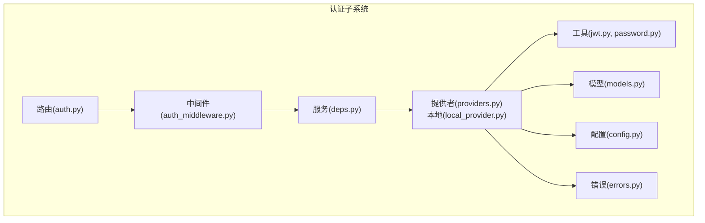
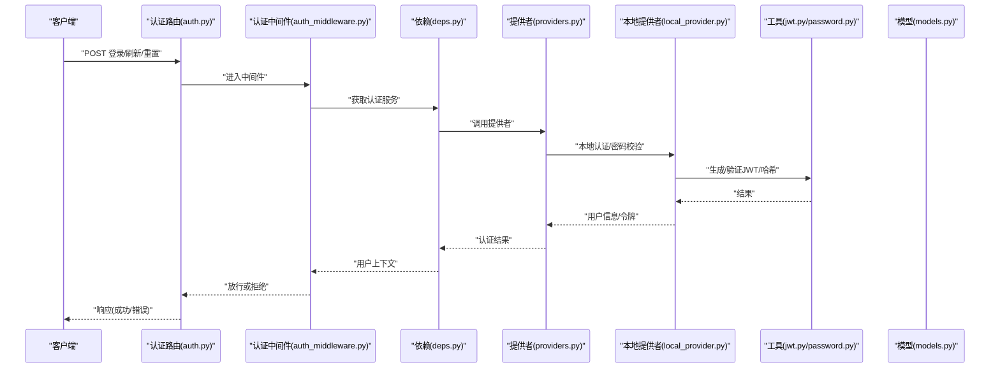
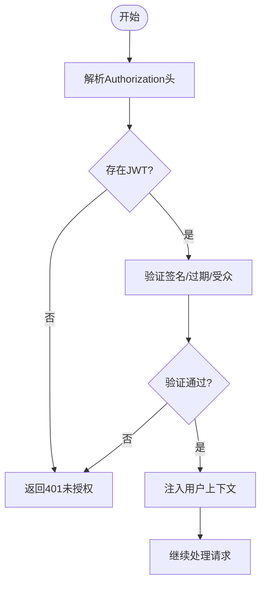
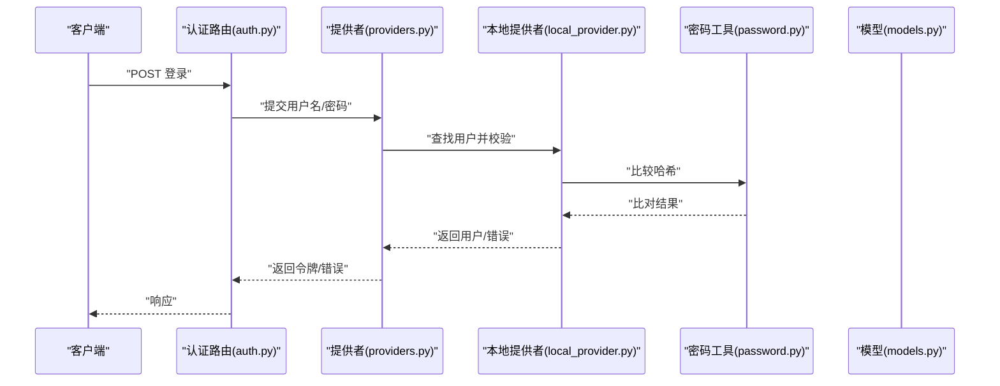
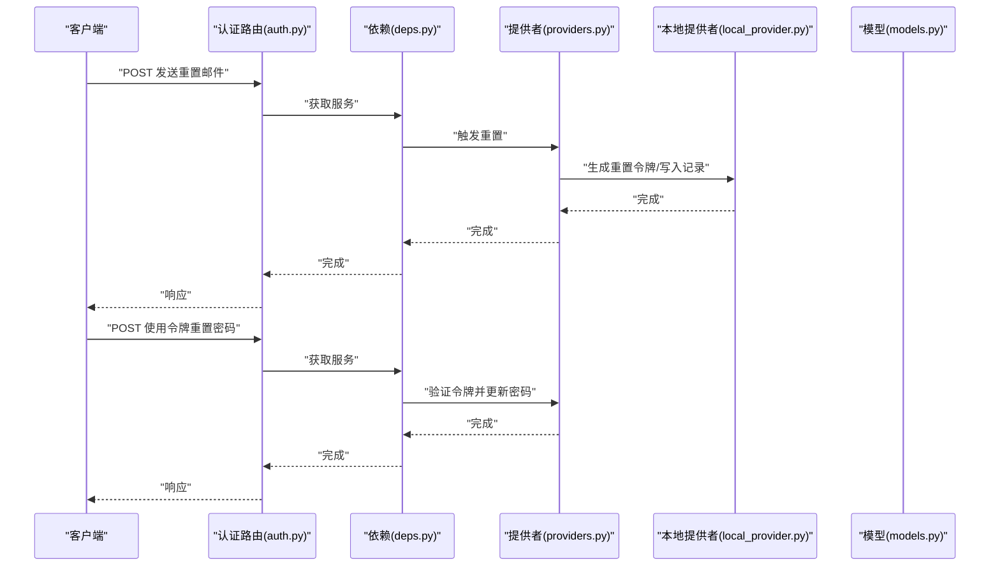
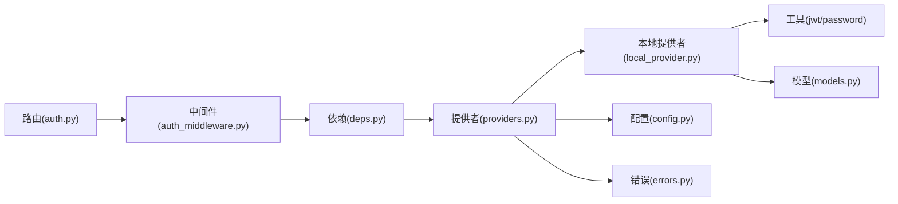

# 认证问题

<cite>
**本文引用的文件**
- [jwt.py](file://backend/app/gateway/auth/jwt.py)
- [password.py](file://backend/app/gateway/auth/password.py)
- [providers.py](file://backend/app/gateway/auth/providers.py)
- [local_provider.py](file://backend/app/gateway/auth/local_provider.py)
- [errors.py](file://backend/app/gateway/auth/errors.py)
- [auth_middleware.py](file://backend/app/auth_middleware.py)
- [auth.py](file://backend/app/gateway/routers/auth.py)
- [internal_auth.py](file://backend/app/internal_auth.py)
- [auth_disabled.py](file://backend/app/auth_disabled.py)
- [deps.py](file://backend/app/gateway/deps.py)
- [config.py](file://backend/app/gateway/config.py)
- [models.py](file://backend/app/gateway/auth/models.py)
- [credential_file.py](file://backend/app/gateway/auth/credential_file.py)
- [reset_admin.py](file://backend/app/gateway/auth/reset_admin.py)
- [AUTH_DESIGN.md](file://backend/docs/AUTH_DESIGN.md)
- [AUTH_TEST_DOCKER_GAP.md](file://backend/docs/AUTH_TEST_DOCKER_GAP.md)
- [test_auth.py](file://backend/tests/test_auth.py)
- [test_auth_middleware.py](file://backend/tests/test_auth_middleware.py)
- [test_auth_errors.py](file://backend/tests/test_auth_errors.py)
- [test_auth_config.py](file://backend/tests/test_auth_config.py)
- [test_internal_auth.py](file://backend/tests/test_internal_auth.py)
- [test_auth_type_system.py](file://backend/tests/test_auth_type_system.py)
</cite>

## 目录
1. [简介](#简介)
2. [项目结构](#项目结构)
3. [核心组件](#核心组件)
4. [架构总览](#架构总览)
5. [详细组件分析](#详细组件分析)
6. [依赖关系分析](#依赖关系分析)
7. [性能考量](#性能考量)
8. [故障排除指南](#故障排除指南)
9. [结论](#结论)
10. [附录](#附录)

## 简介
本指南聚焦于后端认证系统的故障排除与调试实践，覆盖以下关键场景：
- JWT 令牌验证失败
- 用户身份认证错误
- 密码重置问题
- 多因素认证（MFA）异常
- 认证中间件调试
- 令牌生成与验证流程检查
- 用户凭据管理
- 不同认证提供者配置验证与故障处理
- 认证设计常见陷阱与边界情况

目标是帮助开发者快速定位问题根因，并提供可操作的排查步骤与修复建议。

## 项目结构
认证相关代码主要位于后端网关模块的认证子系统中，采用“路由-中间件-服务-模型-提供者”的分层组织方式。核心文件包括：
- 路由：用户认证、令牌刷新、密码重置等接口
- 中间件：统一鉴权拦截与上下文注入
- 提供者：本地提供者与外部提供者抽象
- 工具：JWT 与密码处理
- 模型：用户、令牌、凭据等数据结构
- 配置与错误：认证配置、错误类型与处理策略

**图表来源**
- [auth.py](file://backend/app/gateway/routers/auth.py)
- [auth_middleware.py](file://backend/app/auth_middleware.py)
- [deps.py](file://backend/app/gateway/deps.py)
- [providers.py](file://backend/app/gateway/auth/providers.py)
- [local_provider.py](file://backend/app/gateway/auth/local_provider.py)
- [jwt.py](file://backend/app/gateway/auth/jwt.py)
- [password.py](file://backend/app/gateway/auth/password.py)
- [models.py](file://backend/app/gateway/auth/models.py)
- [config.py](file://backend/app/gateway/config.py)
- [errors.py](file://backend/app/gateway/auth/errors.py)

**章节来源**
- [AUTH_DESIGN.md](file://backend/docs/AUTH_DESIGN.md)
- [config.py](file://backend/app/gateway/config.py)

## 核心组件
- 路由层：定义认证相关接口，如登录、登出、令牌刷新、密码重置等，负责请求参数校验与响应格式化。
- 中间件层：统一拦截未授权访问，解析并验证 JWT，注入用户上下文，支持禁用认证模式。
- 提供者层：抽象认证提供者接口，实现本地提供者与外部提供者；负责用户查找、密码校验、令牌签发与刷新。
- 工具层：JWT 编解码与验证、密码哈希与校验。
- 模型层：用户实体、令牌模型、凭据模型等。
- 配置与错误：认证配置项、错误类型与错误处理策略。

**章节来源**
- [auth.py](file://backend/app/gateway/routers/auth.py)
- [auth_middleware.py](file://backend/app/auth_middleware.py)
- [providers.py](file://backend/app/gateway/auth/providers.py)
- [local_provider.py](file://backend/app/gateway/auth/local_provider.py)
- [jwt.py](file://backend/app/gateway/auth/jwt.py)
- [password.py](file://backend/app/gateway/auth/password.py)
- [models.py](file://backend/app/gateway/auth/models.py)
- [errors.py](file://backend/app/gateway/auth/errors.py)

## 架构总览
认证系统采用“路由-中间件-服务-提供者-工具-模型”的分层架构，配合配置与错误处理，形成闭环的认证流程。

**图表来源**
- [auth.py](file://backend/app/gateway/routers/auth.py)
- [auth_middleware.py](file://backend/app/auth_middleware.py)
- [deps.py](file://backend/app/gateway/deps.py)
- [providers.py](file://backend/app/gateway/auth/providers.py)
- [local_provider.py](file://backend/app/gateway/auth/local_provider.py)
- [jwt.py](file://backend/app/gateway/auth/jwt.py)
- [password.py](file://backend/app/gateway/auth/password.py)
- [models.py](file://backend/app/gateway/auth/models.py)

## 详细组件分析

### JWT 令牌验证与生成
- 令牌生成：本地提供者在用户认证通过后生成 JWT，包含用户标识、过期时间等声明。
- 令牌验证：中间件从请求头解析 Authorization，验证签名、过期时间、受众等。
- 常见问题：签名算法不匹配、过期时间设置不当、密钥不一致、跨域携带 Cookie/Headers 异常。

**图表来源**
- [auth_middleware.py](file://backend/app/auth_middleware.py)
- [jwt.py](file://backend/app/gateway/auth/jwt.py)

**章节来源**
- [jwt.py](file://backend/app/gateway/auth/jwt.py)
- [auth_middleware.py](file://backend/app/auth_middleware.py)

### 用户身份认证流程
- 本地认证：提供者根据用户名/邮箱与密码进行校验，调用密码工具进行哈希比对。
- 成功：生成并下发 JWT；失败：返回认证错误。
- 常见问题：凭据格式错误、用户不存在、密码错误、账户锁定/状态异常。

**图表来源**
- [auth.py](file://backend/app/gateway/routers/auth.py)
- [providers.py](file://backend/app/gateway/auth/providers.py)
- [local_provider.py](file://backend/app/gateway/auth/local_provider.py)
- [password.py](file://backend/app/gateway/auth/password.py)
- [models.py](file://backend/app/gateway/auth/models.py)

**章节来源**
- [providers.py](file://backend/app/gateway/auth/providers.py)
- [local_provider.py](file://backend/app/gateway/auth/local_provider.py)
- [password.py](file://backend/app/gateway/auth/password.py)

### 密码重置流程
- 触发：调用密码重置接口，校验输入参数。
- 处理：生成一次性重置令牌/链接，发送至用户邮箱。
- 完成：使用重置令牌更新用户密码。
- 常见问题：重置令牌过期、邮箱不可达、重置链接被篡改、并发重置冲突。

**图表来源**
- [auth.py](file://backend/app/gateway/routers/auth.py)
- [deps.py](file://backend/app/gateway/deps.py)
- [providers.py](file://backend/app/gateway/auth/providers.py)
- [local_provider.py](file://backend/app/gateway/auth/local_provider.py)
- [models.py](file://backend/app/gateway/auth/models.py)

**章节来源**
- [auth.py](file://backend/app/gateway/routers/auth.py)
- [deps.py](file://backend/app/gateway/deps.py)
- [providers.py](file://backend/app/gateway/auth/providers.py)
- [local_provider.py](file://backend/app/gateway/auth/local_provider.py)
- [models.py](file://backend/app/gateway/auth/models.py)

### 多因素认证（MFA）
- 设计要点：在登录成功后要求二次验证（短信/邮箱/应用验证码），验证通过后再发放完整会话令牌。
- 常见问题：验证码过期/错误、通道不可达、会话状态未正确持久化、前端交互异常。
- 排查建议：确认 MFA 提供者配置、验证码有效期、存储一致性与幂等性。

**章节来源**
- [AUTH_DESIGN.md](file://backend/docs/AUTH_DESIGN.md)
- [providers.py](file://backend/app/gateway/auth/providers.py)

### 认证中间件调试
- 关键断点：请求进入中间件时的日志、解析 Token 的分支、注入用户上下文后的权限判断。
- 常见问题：中间件未生效、Token 解析失败、用户上下文为空、跨域预检失败。
- 调试步骤：
  - 开启中间件日志，观察请求头是否包含 Authorization。
  - 校验 Token 是否过期、签名是否有效、受众/颁发者是否匹配。
  - 检查用户上下文注入是否成功，后续路由是否能读取到用户信息。
  - 若启用 CORS，确保预检请求放行且允许携带凭证。

**章节来源**
- [auth_middleware.py](file://backend/app/auth_middleware.py)
- [jwt.py](file://backend/app/gateway/auth/jwt.py)

### 用户凭据管理
- 存储：密码需安全哈希存储，避免明文或弱哈希。
- 更新：修改密码需旧密码校验，重置密码需一次性令牌验证。
- 清理：定期清理无效/过期的临时令牌与会话。
- 常见问题：哈希算法不一致、重置令牌泄露、会话未清理导致资源占用。

**章节来源**
- [password.py](file://backend/app/gateway/auth/password.py)
- [credential_file.py](file://backend/app/gateway/auth/credential_file.py)
- [reset_admin.py](file://backend/app/gateway/auth/reset_admin.py)

### 不同认证提供者配置验证
- 本地提供者：校验用户名/邮箱与密码，支持用户状态检查。
- 外部提供者：OAuth/SSO 需要回调地址、客户端密钥、作用域与用户映射规则。
- 配置验证清单：
  - 提供者开关与优先级
  - 回调地址与域名白名单
  - 客户端 ID/密钥与证书
  - 用户属性映射与默认角色
  - 错误回退策略与降级机制

**章节来源**
- [providers.py](file://backend/app/gateway/auth/providers.py)
- [local_provider.py](file://backend/app/gateway/auth/local_provider.py)
- [config.py](file://backend/app/gateway/config.py)

## 依赖关系分析
认证子系统内部依赖清晰，遵循“路由依赖中间件，中间件依赖服务，服务依赖提供者，提供者依赖工具与模型”的单向依赖链。

**图表来源**
- [auth.py](file://backend/app/gateway/routers/auth.py)
- [auth_middleware.py](file://backend/app/auth_middleware.py)
- [deps.py](file://backend/app/gateway/deps.py)
- [providers.py](file://backend/app/gateway/auth/providers.py)
- [local_provider.py](file://backend/app/gateway/auth/local_provider.py)
- [jwt.py](file://backend/app/gateway/auth/jwt.py)
- [password.py](file://backend/app/gateway/auth/password.py)
- [models.py](file://backend/app/gateway/auth/models.py)
- [config.py](file://backend/app/gateway/config.py)
- [errors.py](file://backend/app/gateway/auth/errors.py)

**章节来源**
- [auth.py](file://backend/app/gateway/routers/auth.py)
- [auth_middleware.py](file://backend/app/auth_middleware.py)
- [deps.py](file://backend/app/gateway/deps.py)
- [providers.py](file://backend/app/gateway/auth/providers.py)
- [local_provider.py](file://backend/app/gateway/auth/local_provider.py)
- [jwt.py](file://backend/app/gateway/auth/jwt.py)
- [password.py](file://backend/app/gateway/auth/password.py)
- [models.py](file://backend/app/gateway/auth/models.py)
- [config.py](file://backend/app/gateway/config.py)
- [errors.py](file://backend/app/gateway/auth/errors.py)

## 性能考量
- JWT 体积与负载：尽量减少载荷字段，避免频繁刷新导致的额外开销。
- 密码哈希成本：合理设置哈希迭代次数，在安全与性能之间平衡。
- 并发与缓存：对用户信息与令牌黑名单进行缓存，降低数据库压力。
- 日志与监控：为认证关键路径添加埋点，便于定位性能瓶颈。

[本节为通用指导，无需列出具体文件来源]

## 故障排除指南

### JWT 令牌验证失败
- 现象：返回 401 未授权或 403 禁止访问。
- 排查步骤：
  - 确认请求头是否包含有效的 Authorization 字段。
  - 检查 Token 是否过期、签名是否有效、受众/颁发者是否匹配。
  - 核对密钥与算法配置是否一致。
  - 若使用 Cookie，请确认 SameSite/Cross-Origin 设置。
- 相关文件：
  - [auth_middleware.py](file://backend/app/auth_middleware.py)
  - [jwt.py](file://backend/app/gateway/auth/jwt.py)

**章节来源**
- [auth_middleware.py](file://backend/app/auth_middleware.py)
- [jwt.py](file://backend/app/gateway/auth/jwt.py)

### 用户身份认证错误
- 现象：登录失败、提示用户名或密码错误。
- 排查步骤：
  - 校验用户名/邮箱是否存在，账户状态是否正常。
  - 确认密码哈希算法与存储一致。
  - 检查本地提供者是否正确调用密码校验工具。
- 相关文件：
  - [local_provider.py](file://backend/app/gateway/auth/local_provider.py)
  - [password.py](file://backend/app/gateway/auth/password.py)
  - [models.py](file://backend/app/gateway/auth/models.py)

**章节来源**
- [local_provider.py](file://backend/app/gateway/auth/local_provider.py)
- [password.py](file://backend/app/gateway/auth/password.py)
- [models.py](file://backend/app/gateway/auth/models.py)

### 密码重置问题
- 现象：无法接收重置邮件、重置链接无效、重置后仍无法登录。
- 排查步骤：
  - 检查重置令牌生成与存储逻辑，确认有效期与唯一性。
  - 核对邮件发送通道配置与模板。
  - 确认重置接口参数校验与幂等处理。
- 相关文件：
  - [auth.py](file://backend/app/gateway/routers/auth.py)
  - [deps.py](file://backend/app/gateway/deps.py)
  - [providers.py](file://backend/app/gateway/auth/providers.py)
  - [local_provider.py](file://backend/app/gateway/auth/local_provider.py)
  - [models.py](file://backend/app/gateway/auth/models.py)

**章节来源**
- [auth.py](file://backend/app/gateway/routers/auth.py)
- [deps.py](file://backend/app/gateway/deps.py)
- [providers.py](file://backend/app/gateway/auth/providers.py)
- [local_provider.py](file://backend/app/gateway/auth/local_provider.py)
- [models.py](file://backend/app/gateway/auth/models.py)

### 多因素认证异常
- 现象：二次验证失败、验证码过期、通道不可达。
- 排查步骤：
  - 检查 MFA 提供者配置与回调地址。
  - 核对验证码有效期与存储一致性。
  - 确认会话状态在二次验证前后保持一致。
- 相关文件：
  - [AUTH_DESIGN.md](file://backend/docs/AUTH_DESIGN.md)
  - [providers.py](file://backend/app/gateway/auth/providers.py)

**章节来源**
- [AUTH_DESIGN.md](file://backend/docs/AUTH_DESIGN.md)
- [providers.py](file://backend/app/gateway/auth/providers.py)

### 认证中间件调试
- 现象：请求未被拦截、用户上下文缺失、CORS 预检失败。
- 排查步骤：
  - 在中间件入口与关键节点添加日志。
  - 检查 Token 解析与注入逻辑。
  - 确认 CORS 配置允许携带凭证。
- 相关文件：
  - [auth_middleware.py](file://backend/app/auth_middleware.py)

**章节来源**
- [auth_middleware.py](file://backend/app/auth_middleware.py)

### 令牌生成与验证流程检查
- 现象：登录成功但无 Token、Token 无法验证。
- 排查步骤：
  - 确认本地提供者在认证成功后调用 JWT 工具生成 Token。
  - 校验 Token 的签发方、受众、过期时间等声明。
  - 检查中间件是否正确解析并验证 Token。
- 相关文件：
  - [local_provider.py](file://backend/app/gateway/auth/local_provider.py)
  - [jwt.py](file://backend/app/gateway/auth/jwt.py)
  - [auth_middleware.py](file://backend/app/auth_middleware.py)

**章节来源**
- [local_provider.py](file://backend/app/gateway/auth/local_provider.py)
- [jwt.py](file://backend/app/gateway/auth/jwt.py)
- [auth_middleware.py](file://backend/app/auth_middleware.py)

### 用户凭据管理
- 现象：密码无法修改、重置后仍无效、凭据泄露风险。
- 排查步骤：
  - 检查密码哈希算法与存储一致性。
  - 确认重置令牌的生成、验证与销毁流程。
  - 核对凭据文件与凭据加载逻辑。
- 相关文件：
  - [password.py](file://backend/app/gateway/auth/password.py)
  - [credential_file.py](file://backend/app/gateway/auth/credential_file.py)
  - [reset_admin.py](file://backend/app/gateway/auth/reset_admin.py)

**章节来源**
- [password.py](file://backend/app/gateway/auth/password.py)
- [credential_file.py](file://backend/app/gateway/auth/credential_file.py)
- [reset_admin.py](file://backend/app/gateway/auth/reset_admin.py)

### 不同认证提供者的配置验证与故障处理
- 现象：外部登录失败、回调地址错误、用户映射异常。
- 排查步骤：
  - 校验提供者开关与优先级。
  - 确认回调地址、客户端密钥与证书配置。
  - 检查用户属性映射与默认角色分配。
  - 实施错误回退与降级策略。
- 相关文件：
  - [providers.py](file://backend/app/gateway/auth/providers.py)
  - [local_provider.py](file://backend/app/gateway/auth/local_provider.py)
  - [config.py](file://backend/app/gateway/config.py)

**章节来源**
- [providers.py](file://backend/app/gateway/auth/providers.py)
- [local_provider.py](file://backend/app/gateway/auth/local_provider.py)
- [config.py](file://backend/app/gateway/config.py)

### 认证设计中的常见陷阱与边界情况
- 陷阱：使用弱哈希或固定盐值、Token 过期时间过长、未限制重试次数。
- 边界：跨域携带 Cookie、CORS 预检、MFA 与会话状态一致性。
- 建议：引入速率限制、短 Token + 刷新 Token、严格的 CORS 与 SameSite 策略、完善的日志与告警。

**章节来源**
- [AUTH_DESIGN.md](file://backend/docs/AUTH_DESIGN.md)
- [AUTH_TEST_DOCKER_GAP.md](file://backend/docs/AUTH_TEST_DOCKER_GAP.md)

## 结论
通过以上分层架构与组件分析，结合系统化的故障排除步骤，可以高效定位并解决认证相关问题。建议在生产环境中持续完善日志与监控，严格执行配置校验与回归测试，以保障认证系统的稳定性与安全性。

[本节为总结性内容，无需列出具体文件来源]

## 附录

### 测试参考
- 认证路由与中间件行为验证
- 认证错误类型与处理策略
- 认证配置有效性与兼容性
- 内部认证与禁用认证模式

**章节来源**
- [test_auth.py](file://backend/tests/test_auth.py)
- [test_auth_middleware.py](file://backend/tests/test_auth_middleware.py)
- [test_auth_errors.py](file://backend/tests/test_auth_errors.py)
- [test_auth_config.py](file://backend/tests/test_auth_config.py)
- [test_internal_auth.py](file://backend/tests/test_internal_auth.py)
- [test_auth_type_system.py](file://backend/tests/test_auth_type_system.py)