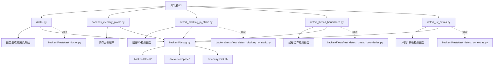
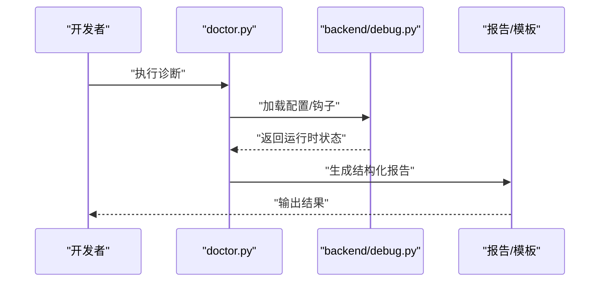
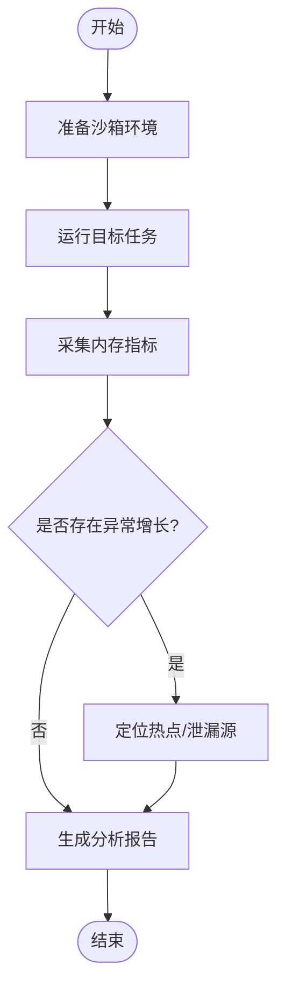
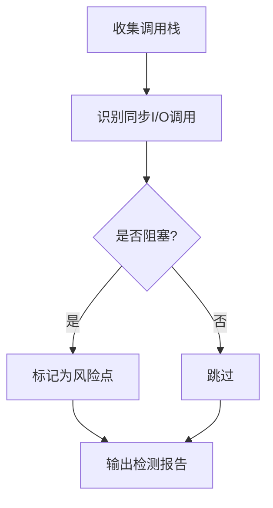
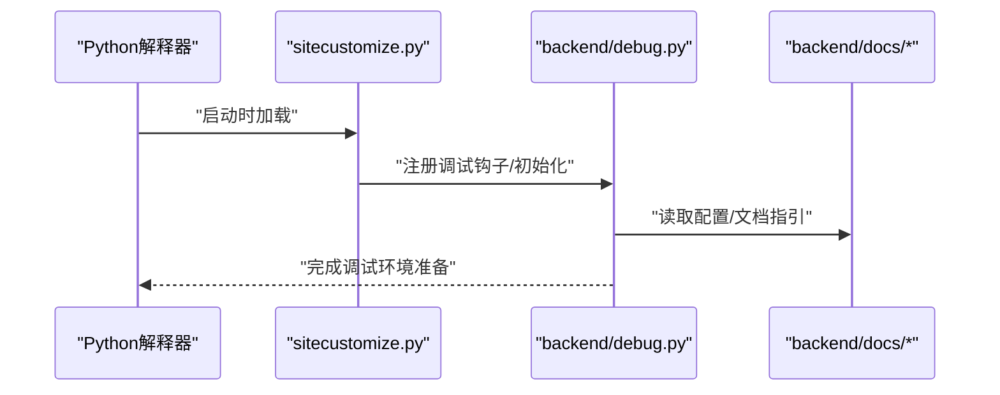
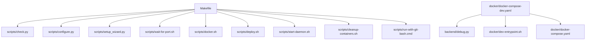
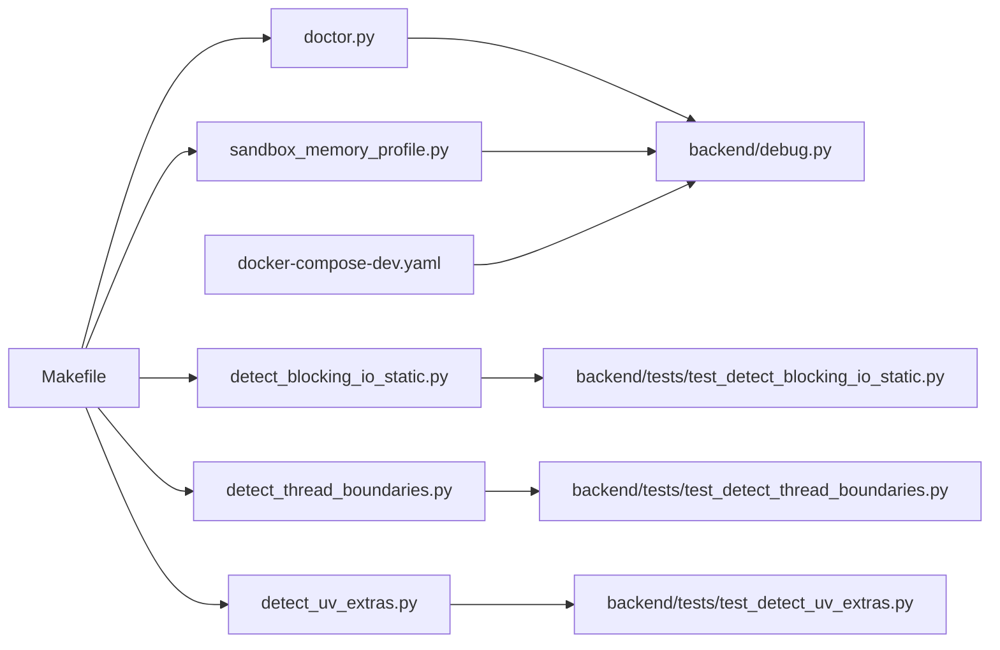

# 调试工具

<cite>
**本文引用的文件**
- [scripts/doctor.py](file://scripts/doctor.py)
- [backend/tests/test_doctor.py](file://backend/tests/test_doctor.py)
- [backend/debug.py](file://backend/debug.py)
- [scripts/sandbox_memory_profile.py](file://scripts/sandbox_memory_profile.py)
- [scripts/detect_blocking_io_static.py](file://scripts/detect_blocking_io_static.py)
- [backend/tests/test_detect_blocking_io_static.py](file://backend/tests/test_detect_blocking_io_static.py)
- [scripts/detect_thread_boundaries.py](file://scripts/detect_thread_boundaries.py)
- [backend/tests/test_detect_thread_boundaries.py](file://backend/tests/test_detect_thread_boundaries.py)
- [scripts/detect_uv_extras.py](file://scripts/detect_uv_extras.py)
- [backend/tests/test_detect_uv_extras.py](file://backend/tests/test_detect_uv_extras.py)
- [scripts/check.py](file://scripts/check.py)
- [scripts/configure.py](file://scripts/configure.py)
- [scripts/setup_wizard.py](file://scripts/setup_wizard.py)
- [scripts/wait-for-port.sh](file://scripts/wait-for-port.sh)
- [scripts/docker.sh](file://scripts/docker.sh)
- [scripts/deploy.sh](file://scripts/deploy.sh)
- [scripts/start-daemon.sh](file://scripts/start-daemon.sh)
- [scripts/cleanup-containers.sh](file://scripts/cleanup-containers.sh)
- [scripts/run-with-git-bash.cmd](file://scripts/run-with-git-bash.cmd)
- [backend/docs/SETUP.md](file://backend/docs/SETUP.md)
- [backend/docs/AUTH_DESIGN.md](file://backend/docs/AUTH_DESIGN.md)
- [backend/docs/BLOCKING_IO_DETECTION.md](file://backend/docs/BLOCKING_IO_DETECTION.md)
- [backend/docs/SANDBOX_MEMORY_PROFILING.md](file://backend/docs/SANDBOX_MEMORY_PROFILING.md)
- [backend/docs/CONFIGURATION.md](file://backend/docs/CONFIGURATION.md)
- [backend/docs/README.md](file://backend/docs/README.md)
- [backend/pyproject.toml](file://backend/pyproject.toml)
- [backend/sitecustomize.py](file://backend/sitecustomize.py)
- [Makefile](file://Makefile)
- [docker/dev-entrypoint.sh](file://docker/dev-entrypoint.sh)
- [docker/docker-compose-dev.yaml](file://docker/docker-compose-dev.yaml)
- [docker/docker-compose.yaml](file://docker/docker-compose.yaml)
</cite>

## 目录
1. [简介](#简介)
2. [项目结构](#项目结构)
3. [核心组件](#核心组件)
4. [架构总览](#架构总览)
5. [详细组件分析](#详细组件分析)
6. [依赖关系分析](#依赖关系分析)
7. [性能考量](#性能考量)
8. [故障排查指南](#故障排查指南)
9. [结论](#结论)
10. [附录](#附录)

## 简介
本指南聚焦于deer-flow项目的调试工具与方法，围绕内置诊断工具doctor.py的使用、自定义调试脚本编写、错误检测工具集成以及日志分析技术展开；同时提供断点调试、性能分析、内存泄漏检测等高级调试技巧，并覆盖开发环境调试配置、生产环境远程调试与自动化测试工具的使用，最后总结调试最佳实践与常见陷阱。

## 项目结构
调试相关能力主要分布在以下位置：
- 脚本层：scripts目录下的各类诊断与检测脚本（如doctor.py、sandbox_memory_profile.py、detect_*系列）
- 后端调试入口：backend/debug.py（用于启动调试器或注入调试钩子）
- 测试层：backend/tests中对doctor与检测脚本的单元测试
- 文档层：backend/docs中关于阻塞I/O检测、沙箱内存分析、配置与安装等文档
- 开发与部署脚本：Makefile、docker-compose与shell脚本，支撑本地与容器化调试环境

```mermaid
graph TB
subgraph "脚本层"
S1["scripts/doctor.py"]
S2["scripts/sandbox_memory_profile.py"]
S3["scripts/detect_blocking_io_static.py"]
S4["scripts/detect_thread_boundaries.py"]
S5["scripts/detect_uv_extras.py"]
S6["scripts/check.py"]
S7["scripts/configure.py"]
S8["scripts/setup_wizard.py"]
S9["scripts/wait-for-port.sh"]
S10["scripts/docker.sh"]
S11["scripts/deploy.sh"]
S12["scripts/start-daemon.sh"]
S13["scripts/cleanup-containers.sh"]
S14["scripts/run-with-git-bash.cmd"]
end
subgraph "后端"
B1["backend/debug.py"]
B2["backend/sitecustomize.py"]
B3["backend/pyproject.toml"]
end
subgraph "测试"
T1["backend/tests/test_doctor.py"]
T2["backend/tests/test_detect_blocking_io_static.py"]
T3["backend/tests/test_detect_thread_boundaries.py"]
T4["backend/tests/test_detect_uv_extras.py"]
end
subgraph "文档"
D1["backend/docs/SETUP.md"]
D2["backend/docs/AUTH_DESIGN.md"]
D3["backend/docs/BLOCKING_IO_DETECTION.md"]
D4["backend/docs/SANDBOX_MEMORY_PROFILING.md"]
D5["backend/docs/CONFIGURATION.md"]
D6["backend/docs/README.md"]
end
subgraph "容器与编排"
C1["docker/dev-entrypoint.sh"]
C2["docker/docker-compose-dev.yaml"]
C3["docker/docker-compose.yaml"]
end
S1 --> B1
S2 --> B1
S3 --> T2
S4 --> T3
S5 --> T4
B1 --> D1
B1 --> D3
B1 --> D4
B1 --> D5
B1 --> D6
C2 --> B1
C3 --> B1
```

**图表来源**
- [scripts/doctor.py](file://scripts/doctor.py)
- [scripts/sandbox_memory_profile.py](file://scripts/sandbox_memory_profile.py)
- [scripts/detect_blocking_io_static.py](file://scripts/detect_blocking_io_static.py)
- [scripts/detect_thread_boundaries.py](file://scripts/detect_thread_boundaries.py)
- [scripts/detect_uv_extras.py](file://scripts/detect_uv_extras.py)
- [backend/debug.py](file://backend/debug.py)
- [backend/docs/SETUP.md](file://backend/docs/SETUP.md)
- [backend/docs/BLOCKING_IO_DETECTION.md](file://backend/docs/BLOCKING_IO_DETECTION.md)
- [backend/docs/SANDBOX_MEMORY_PROFILING.md](file://backend/docs/SANDBOX_MEMORY_PROFILING.md)
- [docker/docker-compose-dev.yaml](file://docker/docker-compose-dev.yaml)
- [docker/docker-compose.yaml](file://docker/docker-compose.yaml)

**章节来源**
- [scripts/doctor.py](file://scripts/doctor.py)
- [backend/debug.py](file://backend/debug.py)
- [docker/docker-compose-dev.yaml](file://docker/docker-compose-dev.yaml)
- [docker/docker-compose.yaml](file://docker/docker-compose.yaml)

## 核心组件
- doctor.py：内置诊断工具，用于检查系统状态、依赖完整性、运行时配置与健康状况，支持输出报告并生成模板化结果。
- 沙箱内存分析脚本：用于在沙箱环境中进行内存占用分析，定位潜在的内存泄漏与异常增长。
- 阻塞I/O检测、线程边界检测、uv额外依赖检测：三类静态/运行期检测工具，分别用于发现阻塞调用、线程模型问题与第三方库冲突。
- 后端调试入口：debug.py提供统一的调试入口，可结合sitecustomize.py与配置文档进行环境初始化与钩子注入。
- 自动化脚本与部署：check.py、configure.py、setup_wizard.py等辅助配置与验证；wait-for-port.sh、docker.sh、deploy.sh、start-daemon.sh、cleanup-containers.sh等支撑环境准备与服务管理；dev-entrypoint.sh与docker-compose文件提供容器化调试环境。

**章节来源**
- [scripts/doctor.py](file://scripts/doctor.py)
- [scripts/sandbox_memory_profile.py](file://scripts/sandbox_memory_profile.py)
- [scripts/detect_blocking_io_static.py](file://scripts/detect_blocking_io_static.py)
- [scripts/detect_thread_boundaries.py](file://scripts/detect_thread_boundaries.py)
- [scripts/detect_uv_extras.py](file://scripts/detect_uv_extras.py)
- [backend/debug.py](file://backend/debug.py)
- [backend/sitecustomize.py](file://backend/sitecustomize.py)
- [scripts/check.py](file://scripts/check.py)
- [scripts/configure.py](file://scripts/configure.py)
- [scripts/setup_wizard.py](file://scripts/setup_wizard.py)
- [scripts/wait-for-port.sh](file://scripts/wait-for-port.sh)
- [scripts/docker.sh](file://scripts/docker.sh)
- [scripts/deploy.sh](file://scripts/deploy.sh)
- [scripts/start-daemon.sh](file://scripts/start-daemon.sh)
- [scripts/cleanup-containers.sh](file://scripts/cleanup-containers.sh)
- [docker/dev-entrypoint.sh](file://docker/dev-entrypoint.sh)

## 架构总览
下图展示了doctor.py与相关检测脚本在系统中的角色与交互路径，以及它们如何与后端调试入口、容器化环境和测试框架协同工作。

**图表来源**
- [scripts/doctor.py](file://scripts/doctor.py)
- [scripts/sandbox_memory_profile.py](file://scripts/sandbox_memory_profile.py)
- [scripts/detect_blocking_io_static.py](file://scripts/detect_blocking_io_static.py)
- [scripts/detect_thread_boundaries.py](file://scripts/detect_thread_boundaries.py)
- [scripts/detect_uv_extras.py](file://scripts/detect_uv_extras.py)
- [backend/debug.py](file://backend/debug.py)
- [backend/tests/test_doctor.py](file://backend/tests/test_doctor.py)
- [backend/tests/test_detect_blocking_io_static.py](file://backend/tests/test_detect_blocking_io_static.py)
- [backend/tests/test_detect_thread_boundaries.py](file://backend/tests/test_detect_thread_boundaries.py)
- [backend/tests/test_detect_uv_extras.py](file://backend/tests/test_detect_uv_extras.py)
- [docker/docker-compose-dev.yaml](file://docker/docker-compose-dev.yaml)
- [docker/dev-entrypoint.sh](file://docker/dev-entrypoint.sh)

## 详细组件分析

### doctor.py 使用指南
- 功能概述：执行系统健康检查、依赖校验、配置验证与运行时状态评估，输出结构化报告并支持模板化渲染。
- 常用场景：
  - 开发环境首次启动后的自检
  - CI流水线中的预检步骤
  - 生产环境变更后的健康巡检
- 使用流程（概念性）：
  1) 准备环境变量与配置文件
  2) 运行doctor.py生成报告
  3) 查看报告并根据建议修复问题
  4) 重复执行直至通过
- 与测试的关系：存在对应的单元测试，确保doctor.py在不同场景下的稳定性与准确性。

**图表来源**
- [scripts/doctor.py](file://scripts/doctor.py)
- [backend/debug.py](file://backend/debug.py)

**章节来源**
- [scripts/doctor.py](file://scripts/doctor.py)
- [backend/tests/test_doctor.py](file://backend/tests/test_doctor.py)

### 沙箱内存分析工具
- 功能概述：在沙箱环境中采集内存使用数据，识别异常增长与泄漏迹象，辅助定位资源密集型任务的问题。
- 使用建议：
  - 在隔离环境中运行，避免宿主干扰
  - 对比基线与峰值，关注持续增长趋势
  - 结合日志与事件流定位热点操作
- 与文档的关系：SANDBOX_MEMORY_PROFILING.md提供了详细的背景与实践建议。

**图表来源**
- [scripts/sandbox_memory_profile.py](file://scripts/sandbox_memory_profile.py)
- [backend/docs/SANDBOX_MEMORY_PROFILING.md](file://backend/docs/SANDBOX_MEMORY_PROFILING.md)

**章节来源**
- [scripts/sandbox_memory_profile.py](file://scripts/sandbox_memory_profile.py)
- [backend/docs/SANDBOX_MEMORY_PROFILING.md](file://backend/docs/SANDBOX_MEMORY_PROFILING.md)

### 阻塞I/O检测工具
- 功能概述：静态/动态检测阻塞调用，帮助识别可能导致性能退化的同步I/O操作。
- 使用建议：
  - 在开发阶段启用静态检测，尽早发现问题
  - 在运行期结合探针监控，定位热点线程
- 与文档的关系：BLOCKING_IO_DETECTION.md提供了检测原理与实践策略。

**图表来源**
- [scripts/detect_blocking_io_static.py](file://scripts/detect_blocking_io_static.py)
- [backend/tests/test_detect_blocking_io_static.py](file://backend/tests/test_detect_blocking_io_static.py)
- [backend/docs/BLOCKING_IO_DETECTION.md](file://backend/docs/BLOCKING_IO_DETECTION.md)

**章节来源**
- [scripts/detect_blocking_io_static.py](file://scripts/detect_blocking_io_static.py)
- [backend/tests/test_detect_blocking_io_static.py](file://backend/tests/test_detect_blocking_io_static.py)
- [backend/docs/BLOCKING_IO_DETECTION.md](file://backend/docs/BLOCKING_IO_DETECTION.md)

### 线程边界检测工具
- 功能概述：检测线程模型与上下文切换问题，避免因线程边界不清导致的并发与死锁风险。
- 使用建议：
  - 在多线程/异步混合场景中重点检测
  - 关注跨线程共享状态的访问模式
- 与测试的关系：配套单元测试保障检测逻辑的正确性。

**章节来源**
- [scripts/detect_thread_boundaries.py](file://scripts/detect_thread_boundaries.py)
- [backend/tests/test_detect_thread_boundaries.py](file://backend/tests/test_detect_thread_boundaries.py)

### uv额外依赖检测工具
- 功能概述：识别与uv相关的额外依赖或版本冲突，避免运行时异常。
- 使用建议：
  - 在虚拟环境激活后运行
  - 对比依赖树，清理冗余包
- 与测试的关系：配套单元测试验证检测范围与准确性。

**章节来源**
- [scripts/detect_uv_extras.py](file://scripts/detect_uv_extras.py)
- [backend/tests/test_detect_uv_extras.py](file://backend/tests/test_detect_uv_extras.py)

### 后端调试入口与环境初始化
- backend/debug.py：提供统一的调试入口，可结合sitecustomize.py与配置文档进行环境初始化与钩子注入。
- sitecustomize.py：Python站点级初始化脚本，常用于注册调试钩子或修改默认行为。
- 文档支撑：SETUP、AUTH_DESIGN、CONFIGURATION等文档描述了调试相关的配置要点与最佳实践。

**图表来源**
- [backend/debug.py](file://backend/debug.py)
- [backend/sitecustomize.py](file://backend/sitecustomize.py)
- [backend/docs/SETUP.md](file://backend/docs/SETUP.md)
- [backend/docs/AUTH_DESIGN.md](file://backend/docs/AUTH_DESIGN.md)
- [backend/docs/CONFIGURATION.md](file://backend/docs/CONFIGURATION.md)

**章节来源**
- [backend/debug.py](file://backend/debug.py)
- [backend/sitecustomize.py](file://backend/sitecustomize.py)
- [backend/docs/SETUP.md](file://backend/docs/SETUP.md)
- [backend/docs/AUTH_DESIGN.md](file://backend/docs/AUTH_DESIGN.md)
- [backend/docs/CONFIGURATION.md](file://backend/docs/CONFIGURATION.md)

### 容器化与自动化脚本
- docker-compose与dev-entrypoint：提供一致的开发与调试环境，便于复现问题与共享配置。
- shell脚本：check.py、configure.py、setup_wizard.py、wait-for-port.sh、docker.sh、deploy.sh、start-daemon.sh、cleanup-containers.sh、run-with-git-bash.cmd等，覆盖从环境准备到服务启停的全链路自动化。
- Makefile：集中定义常用命令，简化调试与测试流程。

**图表来源**
- [Makefile](file://Makefile)
- [scripts/check.py](file://scripts/check.py)
- [scripts/configure.py](file://scripts/configure.py)
- [scripts/setup_wizard.py](file://scripts/setup_wizard.py)
- [scripts/wait-for-port.sh](file://scripts/wait-for-port.sh)
- [scripts/docker.sh](file://scripts/docker.sh)
- [scripts/deploy.sh](file://scripts/deploy.sh)
- [scripts/start-daemon.sh](file://scripts/start-daemon.sh)
- [scripts/cleanup-containers.sh](file://scripts/cleanup-containers.sh)
- [scripts/run-with-git-bash.cmd](file://scripts/run-with-git-bash.cmd)
- [docker/docker-compose-dev.yaml](file://docker/docker-compose-dev.yaml)
- [docker/dev-entrypoint.sh](file://docker/dev-entrypoint.sh)
- [docker/docker-compose.yaml](file://docker/docker-compose.yaml)

**章节来源**
- [Makefile](file://Makefile)
- [scripts/check.py](file://scripts/check.py)
- [scripts/configure.py](file://scripts/configure.py)
- [scripts/setup_wizard.py](file://scripts/setup_wizard.py)
- [scripts/wait-for-port.sh](file://scripts/wait-for-port.sh)
- [scripts/docker.sh](file://scripts/docker.sh)
- [scripts/deploy.sh](file://scripts/deploy.sh)
- [scripts/start-daemon.sh](file://scripts/start-daemon.sh)
- [scripts/cleanup-containers.sh](file://scripts/cleanup-containers.sh)
- [scripts/run-with-git-bash.cmd](file://scripts/run-with-git-bash.cmd)
- [docker/docker-compose-dev.yaml](file://docker/docker-compose-dev.yaml)
- [docker/dev-entrypoint.sh](file://docker/dev-entrypoint.sh)
- [docker/docker-compose.yaml](file://docker/docker-compose.yaml)

## 依赖关系分析
- 组件耦合：
  - doctor.py与后端调试入口存在直接依赖，用于加载配置与运行时信息。
  - 检测脚本彼此独立，但都服务于“问题发现”这一目标，可组合使用。
  - 容器化与自动化脚本为调试提供稳定的执行环境，降低环境差异带来的干扰。
- 外部依赖：
  - Python生态（如sitecustomize.py影响解释器行为）
  - Docker与compose用于容器化调试
  - Makefile与shell脚本用于命令编排

**图表来源**
- [scripts/doctor.py](file://scripts/doctor.py)
- [backend/debug.py](file://backend/debug.py)
- [scripts/detect_blocking_io_static.py](file://scripts/detect_blocking_io_static.py)
- [backend/tests/test_detect_blocking_io_static.py](file://backend/tests/test_detect_blocking_io_static.py)
- [scripts/detect_thread_boundaries.py](file://scripts/detect_thread_boundaries.py)
- [backend/tests/test_detect_thread_boundaries.py](file://backend/tests/test_detect_thread_boundaries.py)
- [scripts/detect_uv_extras.py](file://scripts/detect_uv_extras.py)
- [backend/tests/test_detect_uv_extras.py](file://backend/tests/test_detect_uv_extras.py)
- [scripts/sandbox_memory_profile.py](file://scripts/sandbox_memory_profile.py)
- [docker/docker-compose-dev.yaml](file://docker/docker-compose-dev.yaml)
- [Makefile](file://Makefile)

**章节来源**
- [scripts/doctor.py](file://scripts/doctor.py)
- [backend/debug.py](file://backend/debug.py)
- [scripts/detect_blocking_io_static.py](file://scripts/detect_blocking_io_static.py)
- [backend/tests/test_detect_blocking_io_static.py](file://backend/tests/test_detect_blocking_io_static.py)
- [scripts/detect_thread_boundaries.py](file://scripts/detect_thread_boundaries.py)
- [backend/tests/test_detect_thread_boundaries.py](file://backend/tests/test_detect_thread_boundaries.py)
- [scripts/detect_uv_extras.py](file://scripts/detect_uv_extras.py)
- [backend/tests/test_detect_uv_extras.py](file://backend/tests/test_detect_uv_extras.py)
- [scripts/sandbox_memory_profile.py](file://scripts/sandbox_memory_profile.py)
- [docker/docker-compose-dev.yaml](file://docker/docker-compose-dev.yaml)
- [Makefile](file://Makefile)

## 性能考量
- 阻塞I/O检测：在开发阶段启用静态检测，减少运行期阻塞风险；在生产环境结合采样与告警，避免全局性能抖动。
- 内存分析：定期运行沙箱内存分析，关注持续增长趋势；结合事件流与日志定位热点。
- 线程边界：在高并发场景中严格遵循线程模型，避免跨线程共享状态引发的锁竞争与死锁。
- uv依赖：保持依赖树简洁，避免冗余包导致的解析与加载开销。

[本节为通用指导，无需列出具体文件来源]

## 故障排查指南
- doctor.py失败：
  - 检查配置文件与环境变量是否完整
  - 对照测试用例定位失败分支
  - 参考SETUP与CONFIGURATION文档修正
- 阻塞I/O问题：
  - 使用detect_blocking_io_static.py进行静态扫描
  - 结合运行期日志与事件流定位热点
  - 参考BLOCKING_IO_DETECTION.md优化调用方式
- 线程边界问题：
  - 使用detect_thread_boundaries.py进行检测
  - 通过测试用例验证修复效果
- uv依赖冲突：
  - 使用detect_uv_extras.py识别多余依赖
  - 清理冗余包并重新构建环境
- 容器化调试：
  - 使用docker-compose-dev.yaml与dev-entrypoint.sh快速复现
  - 通过start-daemon.sh与cleanup-containers.sh管理服务生命周期
- 日志分析：
  - 结合backend/docs中的配置与认证设计文档，理解日志结构与关键字段
  - 使用doctor.py与检测脚本输出的报告作为线索，缩小排查范围

**章节来源**
- [backend/tests/test_doctor.py](file://backend/tests/test_doctor.py)
- [backend/docs/SETUP.md](file://backend/docs/SETUP.md)
- [backend/docs/CONFIGURATION.md](file://backend/docs/CONFIGURATION.md)
- [backend/docs/BLOCKING_IO_DETECTION.md](file://backend/docs/BLOCKING_IO_DETECTION.md)
- [scripts/detect_blocking_io_static.py](file://scripts/detect_blocking_io_static.py)
- [backend/tests/test_detect_blocking_io_static.py](file://backend/tests/test_detect_blocking_io_static.py)
- [scripts/detect_thread_boundaries.py](file://scripts/detect_thread_boundaries.py)
- [backend/tests/test_detect_thread_boundaries.py](file://backend/tests/test_detect_thread_boundaries.py)
- [scripts/detect_uv_extras.py](file://scripts/detect_uv_extras.py)
- [backend/tests/test_detect_uv_extras.py](file://backend/tests/test_detect_uv_extras.py)
- [docker/docker-compose-dev.yaml](file://docker/docker-compose-dev.yaml)
- [docker/dev-entrypoint.sh](file://docker/dev-entrypoint.sh)
- [scripts/start-daemon.sh](file://scripts/start-daemon.sh)
- [scripts/cleanup-containers.sh](file://scripts/cleanup-containers.sh)
- [backend/docs/AUTH_DESIGN.md](file://backend/docs/AUTH_DESIGN.md)

## 结论
通过doctor.py与一系列检测/分析脚本，结合容器化与自动化脚本，deer-flow提供了从开发到生产的全链路调试能力。建议在日常开发中常态化使用阻塞I/O与线程边界检测，在关键节点运行内存分析与健康巡检，并以测试用例保障工具的稳定性与准确性。

[本节为总结性内容，无需列出具体文件来源]

## 附录
- 快速参考清单：
  - doctor.py：系统健康巡检与报告生成
  - sandbox_memory_profile.py：沙箱内存分析
  - detect_blocking_io_static.py：阻塞I/O静态检测
  - detect_thread_boundaries.py：线程边界检测
  - detect_uv_extras.py：uv额外依赖检测
  - backend/debug.py：调试入口与环境初始化
  - docker-compose与dev-entrypoint：容器化调试环境
  - Makefile与shell脚本：命令编排与自动化

[本节为概览性内容，无需列出具体文件来源]