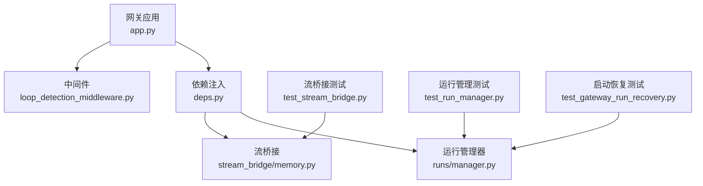
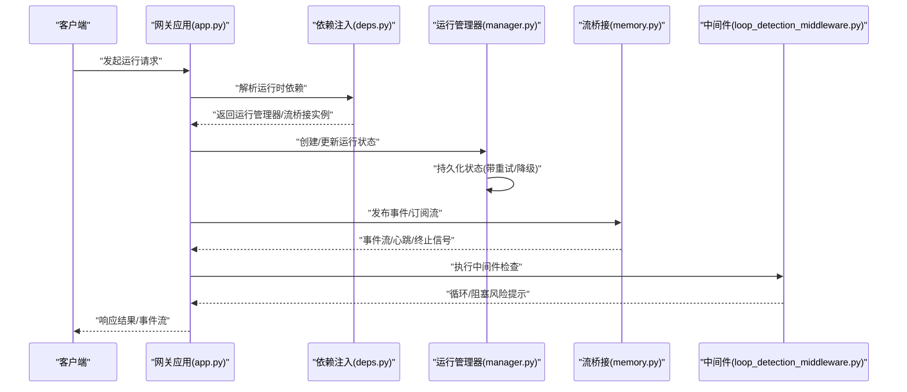
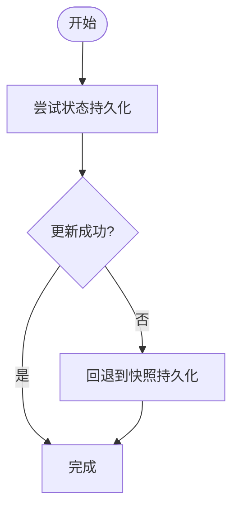
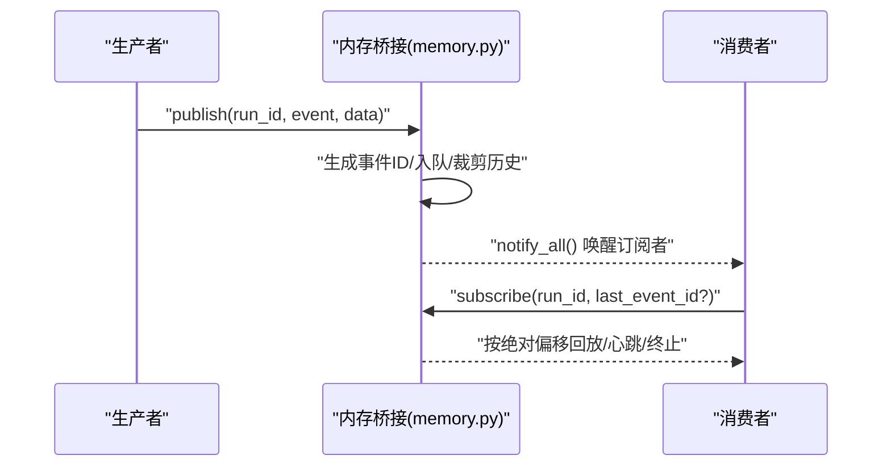
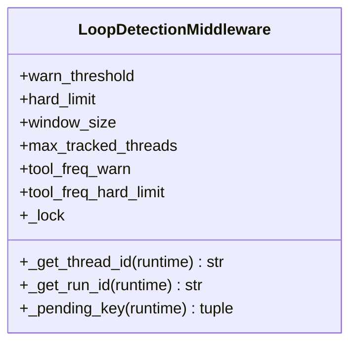
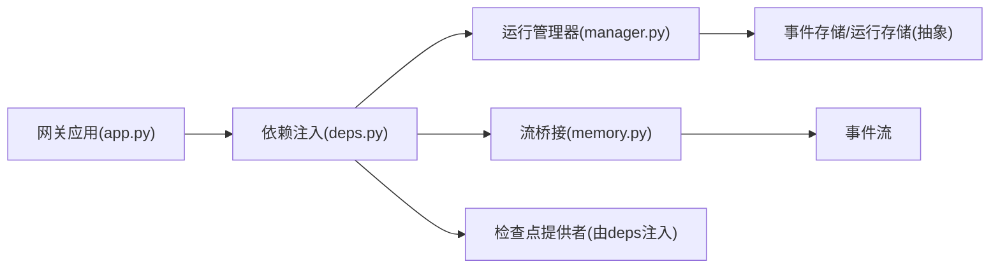

# 运行时错误

<cite>
**本文引用的文件**
- [deps.py](file://backend/app/gateway/deps.py)
- [app.py](file://backend/app/gateway/app.py)
- [auth_middleware.py](file://backend/app/gateway/auth_middleware.py)
- [memory.py](file://backend/packages/harness/deerflow/runtime/stream_bridge/memory.py)
- [manager.py](file://backend/packages/harness/deerflow/runtime/runs/manager.py)
- [loop_detection_middleware.py](file://backend/packages/harness/deerflow/agents/middlewares/loop_detection_middleware.py)
- [test_stream_bridge.py](file://backend/tests/test_stream_bridge.py)
- [test_run_manager.py](file://backend/tests/test_run_manager.py)
- [test_gateway_run_recovery.py](file://backend/tests/test_gateway_run_recovery.py)
- [blocking_io_static.py](file://backend/tests/support/detectors/blocking_io_static.py)
- [README.md](file://backend/README.md)
</cite>

## 目录
1. [简介](#简介)
2. [项目结构](#项目结构)
3. [核心组件](#核心组件)
4. [架构总览](#架构总览)
5. [详细组件分析](#详细组件分析)
6. [依赖关系分析](#依赖关系分析)
7. [性能考量](#性能考量)
8. [故障排查指南](#故障排查指南)
9. [结论](#结论)
10. [附录](#附录)

## 简介
本指南聚焦于 Deer Flow 后端在运行时可能遇到的各类错误与异常，包括运行管理器异常、事件存储错误、流桥接问题、中间件执行失败等。文档提供错误堆栈分析、异常捕获与处理、状态恢复机制等排查方法，并结合并发执行、资源竞争与状态不一致等运行时挑战，给出监控、日志分析与自动恢复策略。

## 项目结构
后端采用分层与模块化组织：网关层负责路由与依赖注入；运行时（runtime）封装运行管理、事件存储、流桥接等核心能力；测试用例覆盖运行时行为与边界条件。下图展示与运行时错误诊断直接相关的模块关系。

**图表来源**
- [app.py:1-20](file://backend/app/gateway/app.py#L1-L20)
- [deps.py:150-210](file://backend/app/gateway/deps.py#L150-L210)
- [manager.py:200-230](file://backend/packages/harness/deerflow/runtime/runs/manager.py#L200-L230)
- [memory.py:25-77](file://backend/packages/harness/deerflow/runtime/stream_bridge/memory.py#L25-L77)
- [loop_detection_middleware.py:235-264](file://backend/packages/harness/deerflow/agents/middlewares/loop_detection_middleware.py#L235-L264)
- [test_stream_bridge.py:1-336](file://backend/tests/test_stream_bridge.py#L1-L336)
- [test_run_manager.py:260-321](file://backend/tests/test_run_manager.py#L260-L321)
- [test_gateway_run_recovery.py:99-116](file://backend/tests/test_gateway_run_recovery.py#L99-L116)

**章节来源**
- [app.py:1-20](file://backend/app/gateway/app.py#L1-L20)
- [deps.py:150-210](file://backend/app/gateway/deps.py#L150-L210)

## 核心组件
- 运行管理器（RunManager）
  - 负责运行记录的创建、状态持久化与恢复协调，具备重试与降级策略，避免因存储异常导致状态丢失或不一致。
- 流桥接（StreamBridge）
  - 提供内存事件流桥接，支持事件发布、订阅、心跳与历史回放，具备缓冲区上限与偏移管理，保障并发消费者一致性。
- 中间件（LoopDetectionMiddleware）
  - 检测工具调用循环风险，支持线程级与运行级隔离、阈值配置与锁保护，防止阻塞事件循环。
- 依赖注入（deps.py）
  - 统一构建运行时组件（运行管理器、事件存储、流桥接、检查点提供者），确保运行时上下文一致与可替换性。
- 网关应用（app.py）
  - 应用入口，加载依赖并挂载路由，为运行时错误诊断提供统一入口。

**章节来源**
- [manager.py:201-228](file://backend/packages/harness/deerflow/runtime/runs/manager.py#L201-L228)
- [memory.py:25-77](file://backend/packages/harness/deerflow/runtime/stream_bridge/memory.py#L25-L77)
- [loop_detection_middleware.py:235-264](file://backend/packages/harness/deerflow/agents/middlewares/loop_detection_middleware.py#L235-L264)
- [deps.py:159-194](file://backend/app/gateway/deps.py#L159-L194)
- [app.py:1-20](file://backend/app/gateway/app.py#L1-L20)

## 架构总览
下图展示运行时错误诊断的关键交互路径：请求进入网关，经依赖注入构建运行时组件，运行管理器协调状态持久化，流桥接承载事件流，中间件进行运行期安全检测，测试用例验证边界行为。

**图表来源**
- [app.py:1-20](file://backend/app/gateway/app.py#L1-L20)
- [deps.py:159-194](file://backend/app/gateway/deps.py#L159-L194)
- [manager.py:201-228](file://backend/packages/harness/deerflow/runtime/runs/manager.py#L201-L228)
- [memory.py:25-77](file://backend/packages/harness/deerflow/runtime/stream_bridge/memory.py#L25-L77)
- [loop_detection_middleware.py:235-264](file://backend/packages/harness/deerflow/agents/middlewares/loop_detection_middleware.py#L235-L264)

## 详细组件分析

### 运行管理器（RunManager）异常与恢复
- 异常场景
  - 存储写入失败：状态更新抛出异常，记录警告并尝试快照持久化。
  - 启动恢复：对“孤儿运行”进行标记或错误状态转换，避免覆盖较新的终端状态。
- 处理策略
  - 最终一致：优先状态更新，失败则回退到全量快照，保证数据可恢复。
  - 幂等与去重：通过运行 ID 与时间窗口判定，避免重复恢复。
- 关键实现参考
  - 状态持久化与回退：[manager.py:201-228](file://backend/packages/harness/deerflow/runtime/runs/manager.py#L201-L228)
  - 启动恢复与冲突规避：[test_run_manager.py:260-321](file://backend/tests/test_run_manager.py#L260-L321)、[test_gateway_run_recovery.py:99-116](file://backend/tests/test_gateway_run_recovery.py#L99-L116)

**图表来源**
- [manager.py:201-228](file://backend/packages/harness/deerflow/runtime/runs/manager.py#L201-L228)

**章节来源**
- [manager.py:201-228](file://backend/packages/harness/deerflow/runtime/runs/manager.py#L201-L228)
- [test_run_manager.py:260-321](file://backend/tests/test_run_manager.py#L260-L321)
- [test_gateway_run_recovery.py:99-116](file://backend/tests/test_gateway_run_recovery.py#L99-L116)

### 流桥接（StreamBridge）事件流与并发
- 异常场景
  - 缓冲区溢出：超过上限后丢弃旧事件并调整起始偏移，慢消费者需从正确绝对偏移继续。
  - 终止信号缺失：并发多运行共享桥接实例时，每个运行应独立收到终止信号。
  - Last-Event-ID 不匹配：回放缓冲时若找不到 ID，回退到最早保留事件。
- 处理策略
  - 有界历史：固定队列大小，保证内存占用可控。
  - 条件变量通知：事件到达时广播唤醒订阅者。
  - 绝对偏移与相对偏移结合：确保回放一致性。
- 关键实现参考
  - 内存桥接与事件 ID 生成：[memory.py:25-77](file://backend/packages/harness/deerflow/runtime/stream_bridge/memory.py#L25-L77)
  - 测试覆盖（心跳、回放、并发终止）：[test_stream_bridge.py:1-336](file://backend/tests/test_stream_bridge.py#L1-L336)

**图表来源**
- [memory.py:25-77](file://backend/packages/harness/deerflow/runtime/stream_bridge/memory.py#L25-L77)
- [test_stream_bridge.py:142-214](file://backend/tests/test_stream_bridge.py#L142-L214)

**章节来源**
- [memory.py:25-77](file://backend/packages/harness/deerflow/runtime/stream_bridge/memory.py#L25-L77)
- [test_stream_bridge.py:1-336](file://backend/tests/test_stream_bridge.py#L1-L336)

### 中间件执行失败与阻塞检测
- 异常场景
  - 循环检测阈值超限：工具调用频率过高触发警告或硬限制。
  - 线程隔离失效：运行上下文缺少线程 ID 时回退到默认标识。
  - 并发修改无锁：需确保内部变更使用锁保护。
- 处理策略
  - 线程级与运行级隔离：以 (thread_id, run_id) 作为键空间。
  - 阈值可配置：支持全局与工具粒度的告警/硬限制。
  - 锁保护：对共享状态的变更加锁，保证线程安全。
- 关键实现参考
  - 线程/运行键提取与锁属性断言：[loop_detection_middleware.py:235-264](file://backend/packages/harness/deerflow/agents/middlewares/loop_detection_middleware.py#L235-L264)
  - 测试覆盖（阈值、回退、锁存在性）：[test_loop_detection_middleware.py:532-565](file://backend/tests/test_loop_detection_middleware.py#L532-L565)

**图表来源**
- [loop_detection_middleware.py:235-264](file://backend/packages/harness/deerflow/agents/middlewares/loop_detection_middleware.py#L235-L264)

**章节来源**
- [loop_detection_middleware.py:235-264](file://backend/packages/harness/deerflow/agents/middlewares/loop_detection_middleware.py#L235-L264)
- [test_loop_detection_middleware.py:532-565](file://backend/tests/test_loop_detection_middleware.py#L532-L565)

### 依赖注入与运行时上下文
- 关键点
  - 统一构建运行时组件（运行管理器、事件存储、流桥接、检查点提供者），便于替换与测试。
  - 在网关中注入运行时上下文，确保中间件与服务层共享一致的用户上下文与运行上下文。
- 参考实现
  - 依赖注入与组件工厂：[deps.py:159-194](file://backend/app/gateway/deps.py#L159-L194)
  - 用户上下文设置/重置（中间件）：[auth_middleware.py:28](file://backend/app/gateway/auth_middleware.py#L28)

**章节来源**
- [deps.py:159-194](file://backend/app/gateway/deps.py#L159-L194)
- [auth_middleware.py:28](file://backend/app/gateway/auth_middleware.py#L28)

## 依赖关系分析
- 组件耦合
  - 网关通过依赖注入与运行时解耦，降低对具体实现的耦合度。
  - 运行管理器与流桥接通过运行 ID 解耦多个并发运行。
- 外部依赖
  - 事件存储与数据库：运行管理器对持久化的抽象接口，便于替换不同后端。
  - 测试探测器：静态扫描阻塞 IO，辅助定位潜在阻塞风险。

**图表来源**
- [app.py:1-20](file://backend/app/gateway/app.py#L1-L20)
- [deps.py:159-194](file://backend/app/gateway/deps.py#L159-L194)
- [manager.py:201-228](file://backend/packages/harness/deerflow/runtime/runs/manager.py#L201-L228)
- [memory.py:25-77](file://backend/packages/harness/deerflow/runtime/stream_bridge/memory.py#L25-L77)

**章节来源**
- [deps.py:159-194](file://backend/app/gateway/deps.py#L159-L194)
- [manager.py:201-228](file://backend/packages/harness/deerflow/runtime/runs/manager.py#L201-L228)
- [memory.py:25-77](file://backend/packages/harness/deerflow/runtime/stream_bridge/memory.py#L25-L77)

## 性能考量
- 阻塞 IO 检测
  - 使用静态扫描工具识别可能阻塞事件循环的同步调用，优先重构为异步实现。
  - 参考：[blocking_io_static.py:840-877](file://backend/tests/support/detectors/blocking_io_static.py#L840-L877)
- 缓冲区与回放
  - 控制流桥接队列上限，避免内存膨胀；合理设置心跳间隔，平衡保活与开销。
- 并发与锁
  - 中间件内部变更需加锁；运行管理器的状态持久化采用重试与回退策略，减少抖动。

**章节来源**
- [blocking_io_static.py:840-877](file://backend/tests/support/detectors/blocking_io_static.py#L840-L877)
- [memory.py:25-77](file://backend/packages/harness/deerflow/runtime/stream_bridge/memory.py#L25-L77)
- [loop_detection_middleware.py:235-264](file://backend/packages/harness/deerflow/agents/middlewares/loop_detection_middleware.py#L235-L264)

## 故障排查指南

### 运行管理器异常
- 症状
  - 状态更新失败、重启后孤儿运行未正确标记、启动恢复覆盖新状态。
- 排查步骤
  - 检查运行管理器的日志与异常信息，确认是否触发了持久化回退。
  - 对比“最新线程状态”与“待恢复运行”，确保不会覆盖终端状态。
- 参考实现
  - 状态持久化与回退：[manager.py:201-228](file://backend/packages/harness/deerflow/runtime/runs/manager.py#L201-L228)
  - 启动恢复测试用例：[test_run_manager.py:260-321](file://backend/tests/test_run_manager.py#L260-L321)、[test_gateway_run_recovery.py:99-116](file://backend/tests/test_gateway_run_recovery.py#L99-L116)

**章节来源**
- [manager.py:201-228](file://backend/packages/harness/deerflow/runtime/runs/manager.py#L201-L228)
- [test_run_manager.py:260-321](file://backend/tests/test_run_manager.py#L260-L321)
- [test_gateway_run_recovery.py:99-116](file://backend/tests/test_gateway_run_recovery.py#L99-L116)

### 事件存储错误
- 症状
  - 事件写入失败、回放不完整、Last-Event-ID 无法匹配。
- 排查步骤
  - 检查事件存储后端可用性与连接参数。
  - 核对事件 ID 格式与回放缓冲策略，必要时回退到最早保留事件。
- 参考实现
  - 流桥接事件 ID 生成与回放：[memory.py:25-77](file://backend/packages/harness/deerflow/runtime/stream_bridge/memory.py#L25-L77)
  - 回放与心跳测试：[test_stream_bridge.py:142-214](file://backend/tests/test_stream_bridge.py#L142-L214)

**章节来源**
- [memory.py:25-77](file://backend/packages/harness/deerflow/runtime/stream_bridge/memory.py#L25-L77)
- [test_stream_bridge.py:142-214](file://backend/tests/test_stream_bridge.py#L142-L214)

### 流桥接问题
- 症状
  - 订阅者错过事件、心跳频繁、并发运行互相干扰、终止信号缺失。
- 排查步骤
  - 确认队列上限与起始偏移计算逻辑，确保慢消费者能从正确位置继续。
  - 验证并发任务组中的每个运行独立收到终止信号。
- 参考实现
  - 内存桥接与条件通知：[memory.py:25-77](file://backend/packages/harness/deerflow/runtime/stream_bridge/memory.py#L25-L77)
  - 并发与终止测试：[test_stream_bridge.py:285-325](file://backend/tests/test_stream_bridge.py#L285-L325)

**章节来源**
- [memory.py:25-77](file://backend/packages/harness/deerflow/runtime/stream_bridge/memory.py#L25-L77)
- [test_stream_bridge.py:285-325](file://backend/tests/test_stream_bridge.py#L285-L325)

### 中间件执行失败
- 症状
  - 工具调用频率过高触发警告、线程 ID 缺失导致回退、并发修改未加锁。
- 排查步骤
  - 检查中间件配置（阈值、窗口大小、工具覆盖规则）。
  - 确认运行上下文中包含 thread_id；若缺失，系统会回退到默认标识。
  - 断言中间件内部存在锁对象，确保共享状态变更受保护。
- 参考实现
  - 键提取与锁断言：[loop_detection_middleware.py:235-264](file://backend/packages/harness/deerflow/agents/middlewares/loop_detection_middleware.py#L235-L264)
  - 测试用例：[test_loop_detection_middleware.py:532-565](file://backend/tests/test_loop_detection_middleware.py#L532-L565)

**章节来源**
- [loop_detection_middleware.py:235-264](file://backend/packages/harness/deerflow/agents/middlewares/loop_detection_middleware.py#L235-L264)
- [test_loop_detection_middleware.py:532-565](file://backend/tests/test_loop_detection_middleware.py#L532-L565)

### 并发执行、资源竞争与状态不一致
- 症状
  - 多运行共享桥接实例时事件错乱、状态更新竞态、回放偏移不一致。
- 排查步骤
  - 使用运行 ID 严格隔离事件流与回放缓冲。
  - 在共享状态变更处加锁，确保原子性。
  - 对持久化操作采用重试与回退策略，避免部分更新。
- 参考实现
  - 条件变量与通知：[memory.py:25-77](file://backend/packages/harness/deerflow/runtime/stream_bridge/memory.py#L25-L77)
  - 锁保护与线程键：[loop_detection_middleware.py:235-264](file://backend/packages/harness/deerflow/agents/middlewares/loop_detection_middleware.py#L235-L264)
  - 状态持久化回退：[manager.py:201-228](file://backend/packages/harness/deerflow/runtime/runs/manager.py#L201-L228)

**章节来源**
- [memory.py:25-77](file://backend/packages/harness/deerflow/runtime/stream_bridge/memory.py#L25-L77)
- [loop_detection_middleware.py:235-264](file://backend/packages/harness/deerflow/agents/middlewares/loop_detection_middleware.py#L235-L264)
- [manager.py:201-228](file://backend/packages/harness/deerflow/runtime/runs/manager.py#L201-L228)

### 运行时监控与日志分析
- 建议
  - 在运行管理器持久化失败时输出结构化日志（运行 ID、异常类型、重试次数）。
  - 在流桥接回放缓冲缺失 Last-Event-ID 时记录警告日志并提供回退策略。
  - 在中间件触发阈值告警时记录工具名、频率与运行上下文。
- 参考实现
  - 运行管理器警告与回退：[manager.py:201-228](file://backend/packages/harness/deerflow/runtime/runs/manager.py#L201-L228)
  - 流桥接回放警告：[memory.py:25-77](file://backend/packages/harness/deerflow/runtime/stream_bridge/memory.py#L25-L77)

**章节来源**
- [manager.py:201-228](file://backend/packages/harness/deerflow/runtime/runs/manager.py#L201-L228)
- [memory.py:25-77](file://backend/packages/harness/deerflow/runtime/stream_bridge/memory.py#L25-L77)

### 自动恢复策略
- 启动恢复
  - 对孤儿运行进行标记或错误状态转换，避免覆盖更晚的终端状态。
- 持久化回退
  - 当状态更新失败时，回退到全量快照持久化，确保可恢复。
- 参考实现
  - 启动恢复测试：[test_run_manager.py:260-321](file://backend/tests/test_run_manager.py#L260-L321)、[test_gateway_run_recovery.py:99-116](file://backend/tests/test_gateway_run_recovery.py#L99-L116)
  - 持久化回退：[manager.py:201-228](file://backend/packages/harness/deerflow/runtime/runs/manager.py#L201-L228)

**章节来源**
- [test_run_manager.py:260-321](file://backend/tests/test_run_manager.py#L260-L321)
- [test_gateway_run_recovery.py:99-116](file://backend/tests/test_gateway_run_recovery.py#L99-L116)
- [manager.py:201-228](file://backend/packages/harness/deerflow/runtime/runs/manager.py#L201-L228)

## 结论
通过运行管理器的持久化回退、流桥接的有界历史与绝对偏移、中间件的阈值与锁保护，以及启动恢复策略，Deer Flow 在运行时具备较强的容错与自愈能力。配合静态阻塞 IO 检测与结构化日志，可有效定位与缓解运行时异常，提升系统稳定性与可观测性。

## 附录
- 快速参考
  - 运行管理器：状态持久化与回退策略
  - 流桥接：事件 ID 生成、回放与并发终止
  - 中间件：阈值配置、线程隔离与锁保护
  - 依赖注入：组件工厂与运行时上下文

**章节来源**
- [manager.py:201-228](file://backend/packages/harness/deerflow/runtime/runs/manager.py#L201-L228)
- [memory.py:25-77](file://backend/packages/harness/deerflow/runtime/stream_bridge/memory.py#L25-L77)
- [loop_detection_middleware.py:235-264](file://backend/packages/harness/deerflow/agents/middlewares/loop_detection_middleware.py#L235-L264)
- [deps.py:159-194](file://backend/app/gateway/deps.py#L159-L194)
- [README.md](file://backend/README.md)