# 部署问题排查指南

<cite>
**本文档引用的文件**
- [backend/Dockerfile](file://backend/Dockerfile)
- [frontend/Dockerfile](file://frontend/Dockerfile)
- [docker/docker-compose.yaml](file://docker/docker-compose.yaml)
- [docker/docker-compose-dev.yaml](file://docker/docker-compose-dev.yaml)
- [.agent/skills/smoke-test/scripts/check_docker.sh](file://.agent/skills/smoke-test/scripts/check_docker.sh)
- [.agent/skills/smoke-test/scripts/health_check.sh](file://.agent/skills/smoke-test/scripts/health_check.sh)
- [.agent/skills/smoke-test/scripts/deploy_docker.sh](file://.agent/skills/smoke-test/scripts/deploy_docker.sh)
- [.agent/skills/smoke-test/scripts/deploy_local.sh](file://.agent/skills/smoke-test/scripts/deploy_local.sh)
- [.agent/skills/smoke-test/scripts/check_local_env.sh](file://.agent/skills/smoke-test/scripts/check_local_env.sh)
- [scripts/doctor.py](file://scripts/doctor.py)
- [scripts/deploy.sh](file://scripts/deploy.sh)
- [scripts/cleanup-containers.sh](file://scripts/cleanup-containers.sh)
- [scripts/wait-for-port.sh](file://scripts/wait-for-port.sh)
- [backend/docs/AUTH_TEST_DOCKER_GAP.md](file://backend/docs/AUTH_TEST_DOCKER_GAP.md)
- [backend/docs/SETUP.md](file://backend/docs/SETUP.md)
- [backend/docs/CONFIGURATION.md](file://backend/docs/CONFIGURATION.md)
</cite>

## 目录
1. [简介](#简介)
2. [项目结构](#项目结构)
3. [核心组件](#核心组件)
4. [架构概览](#架构概览)
5. [详细组件分析](#详细组件分析)
6. [依赖分析](#依赖分析)
7. [性能考虑](#性能考虑)
8. [故障排除指南](#故障排除指南)
9. [结论](#结论)
10. [附录](#附录)

## 简介

 Deer Flow 是一个基于 Docker 容器化的 AI 助手平台，提供了完整的开发、测试和生产部署解决方案。本指南专注于部署过程中的常见问题排查，涵盖 Docker 容器启动失败、端口冲突、网络连接问题、权限错误等场景。

## 项目结构

项目采用多模块架构，包含后端服务、前端应用、Docker 容器化配置和自动化部署脚本：

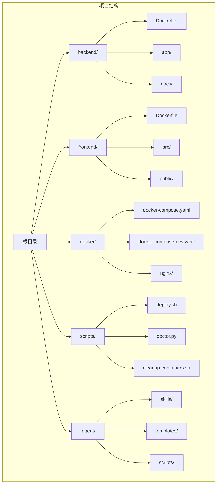

**图表来源**
- [backend/Dockerfile](file://backend/Dockerfile)
- [frontend/Dockerfile](file://frontend/Dockerfile)
- [docker/docker-compose.yaml](file://docker/docker-compose.yaml)

**章节来源**
- [backend/Dockerfile](file://backend/Dockerfile)
- [frontend/Dockerfile](file://frontend/Dockerfile)
- [docker/docker-compose.yaml](file://docker/docker-compose.yaml)

## 核心组件

### Docker 容器配置

项目提供了完整的容器化解决方案，包括生产环境和开发环境的配置：

#### 后端服务容器
后端服务使用多阶段构建，优化镜像大小和安全性：

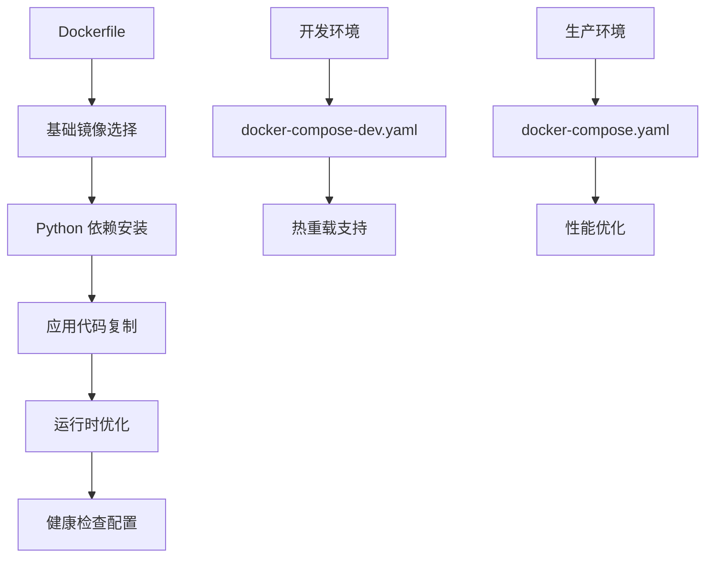

**图表来源**
- [backend/Dockerfile](file://backend/Dockerfile)
- [docker/docker-compose-dev.yaml](file://docker/docker-compose-dev.yaml)
- [docker/docker-compose.yaml](file://docker/docker-compose.yaml)

#### 前端应用容器
前端应用采用 Next.js 框架，支持静态资源优化和缓存策略：

**章节来源**
- [backend/Dockerfile](file://backend/Dockerfile)
- [frontend/Dockerfile](file://frontend/Dockerfile)
- [docker/docker-compose.yaml](file://docker/docker-compose.yaml)

## 架构概览

Deer Flow 采用微服务架构，通过 Docker Compose 统一管理多个服务容器：

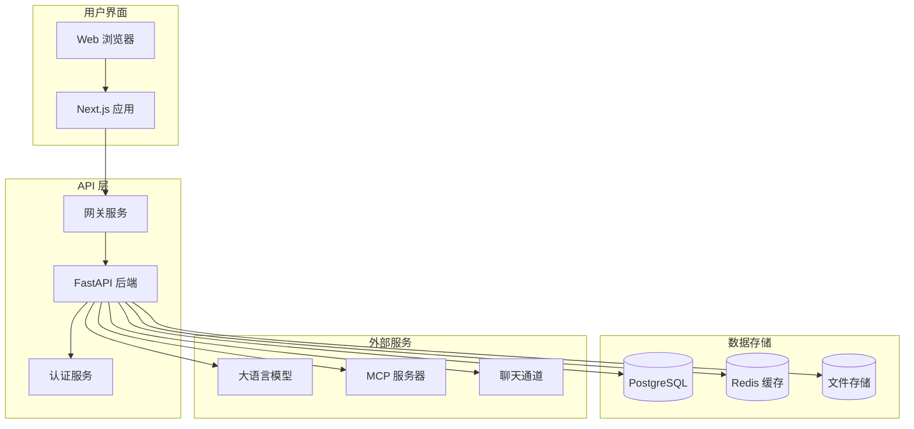

**图表来源**
- [docker/docker-compose.yaml](file://docker/docker-compose.yaml)
- [backend/app/gateway/app.py](file://backend/app/gateway/app.py)

## 详细组件分析

### 自动化部署脚本系统

项目提供了完整的自动化部署工具链，支持多种部署场景：

#### 部署脚本架构
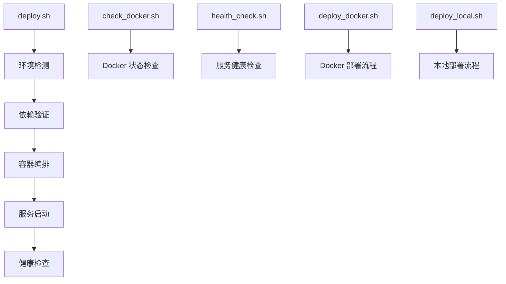

**图表来源**
- [scripts/deploy.sh](file://scripts/deploy.sh)
- [.agent/skills/smoke-test/scripts/check_docker.sh](file://.agent/skills/smoke-test/scripts/check_docker.sh)
- [.agent/skills/smoke-test/scripts/health_check.sh](file://.agent/skills/smoke-test/scripts/health_check.sh)

#### Docker 环境检查脚本
该脚本负责验证 Docker 环境的完整性：

**章节来源**
- [.agent/skills/smoke-test/scripts/check_docker.sh](file://.agent/skills/smoke-test/scripts/check_docker.sh)
- [.agent/skills/smoke-test/scripts/health_check.sh](file://.agent/skills/smoke-test/scripts/health_check.sh)

### 健康检查机制

系统实现了多层次的健康检查，确保服务可用性：

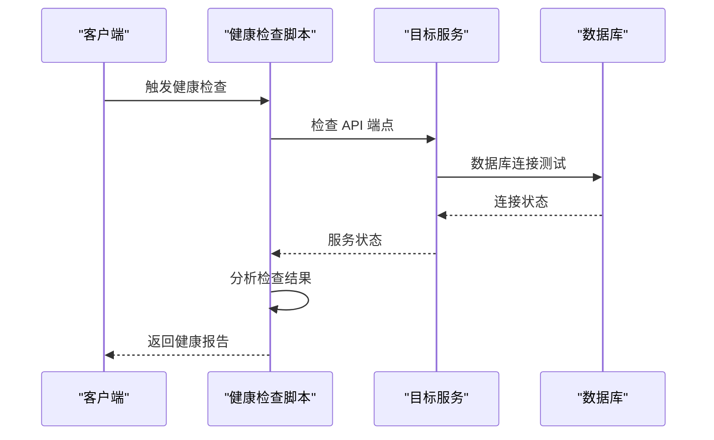

**图表来源**
- [.agent/skills/smoke-test/scripts/health_check.sh](file://.agent/skills/smoke-test/scripts/health_check.sh)

**章节来源**
- [.agent/skills/smoke-test/scripts/health_check.sh](file://.agent/skills/smoke-test/scripts/health_check.sh)

## 依赖分析

### 服务间依赖关系

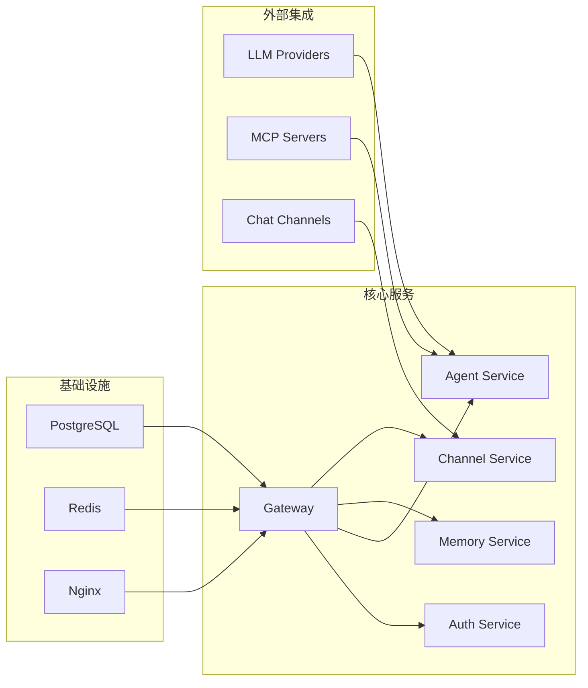

**图表来源**
- [docker/docker-compose.yaml](file://docker/docker-compose.yaml)
- [backend/app/gateway/routers/__init__.py](file://backend/app/gateway/routers/__init__.py)

### 环境依赖验证

系统提供了全面的环境依赖检查机制：

**章节来源**
- [scripts/doctor.py](file://scripts/doctor.py)
- [scripts/check.sh](file://scripts/check.sh)

## 性能考虑

### 容器优化策略

项目采用了多项性能优化措施：

1. **多阶段构建**：减少最终镜像大小
2. **缓存优化**：利用 Docker 缓存提高构建速度
3. **资源限制**：为容器设置合理的资源配额
4. **连接池管理**：优化数据库和外部服务连接

### 资源监控

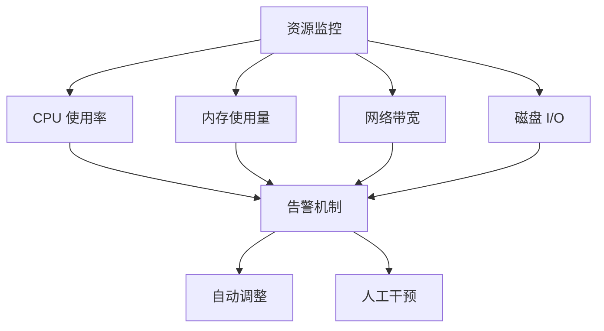

## 故障排除指南

### Docker 容器启动失败排查

#### 常见启动问题及解决方案

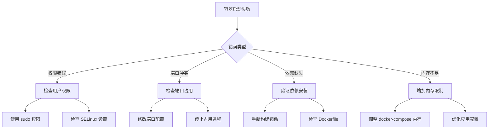

**图表来源**
- [.agent/skills/smoke-test/scripts/check_docker.sh](file://.agent/skills/smoke-test/scripts/check_docker.sh)

#### 诊断步骤

1. **检查容器状态**
   ```bash
   docker ps -a
   docker logs <container_name>
   ```

2. **验证依赖服务**
   ```bash
   docker-compose ps
   docker-compose logs
   ```

3. **检查资源使用**
   ```bash
   docker stats --no-stream
   ```

**章节来源**
- [.agent/skills/smoke-test/scripts/check_docker.sh](file://.agent/skills/smoke-test/scripts/check_docker.sh)
- [scripts/cleanup-containers.sh](file://scripts/cleanup-containers.sh)

### 端口冲突问题

#### 端口分配策略

```mermaid
flowchart TD
A[端口冲突检测] --> B[默认端口检查]
B --> C{端口是否被占用}
C --> |是| D[修改端口配置]
C --> |否| E[继续部署]
D --> F[更新 docker-compose.yaml]
F --> G[重启服务]
E --> H[验证端口连通性]
H --> I[netstat -tulpn | grep :<port>
```

**图表来源**
- [docker/docker-compose.yaml](file://docker/docker-compose.yaml)

#### 端口检查命令

**章节来源**
- [docker/docker-compose.yaml](file://docker/docker-compose.yaml)
- [scripts/wait-for-port.sh](file://scripts/wait-for-port.sh)

### 网络连接问题

#### 网络诊断流程

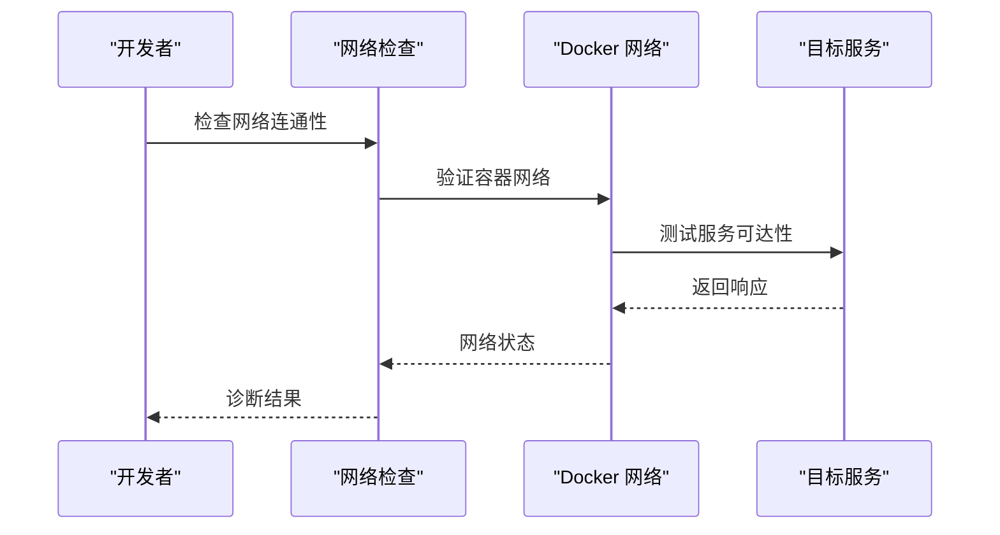

**图表来源**
- [docker/docker-compose.yaml](file://docker/docker-compose.yaml)

#### 网络问题排查

1. **检查 Docker 网络**
   ```bash
   docker network ls
   docker network inspect deerflow_default
   ```

2. **验证服务端口**
   ```bash
   docker-compose port gateway 8080
   ```

3. **测试网络连通性**
   ```bash
   curl http://localhost:<port>
   telnet localhost <port>
   ```

**章节来源**
- [docker/docker-compose.yaml](file://docker/docker-compose.yaml)

### 权限错误问题

#### 权限问题诊断

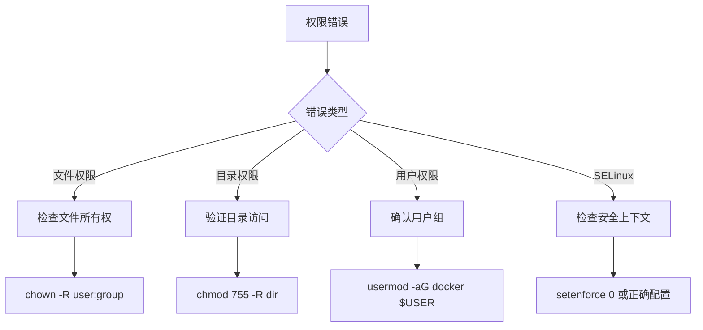

**图表来源**
- [.agent/skills/smoke-test/scripts/check_docker.sh](file://.agent/skills/smoke-test/scripts/check_docker.sh)

#### 权限修复步骤

**章节来源**
- [.agent/skills/smoke-test/scripts/check_docker.sh](file://.agent/skills/smoke-test/scripts/check_docker.sh)

### 认证测试环境差异

#### Docker 环境差异处理

项目文档专门记录了认证测试在 Docker 环境中的特殊考虑：

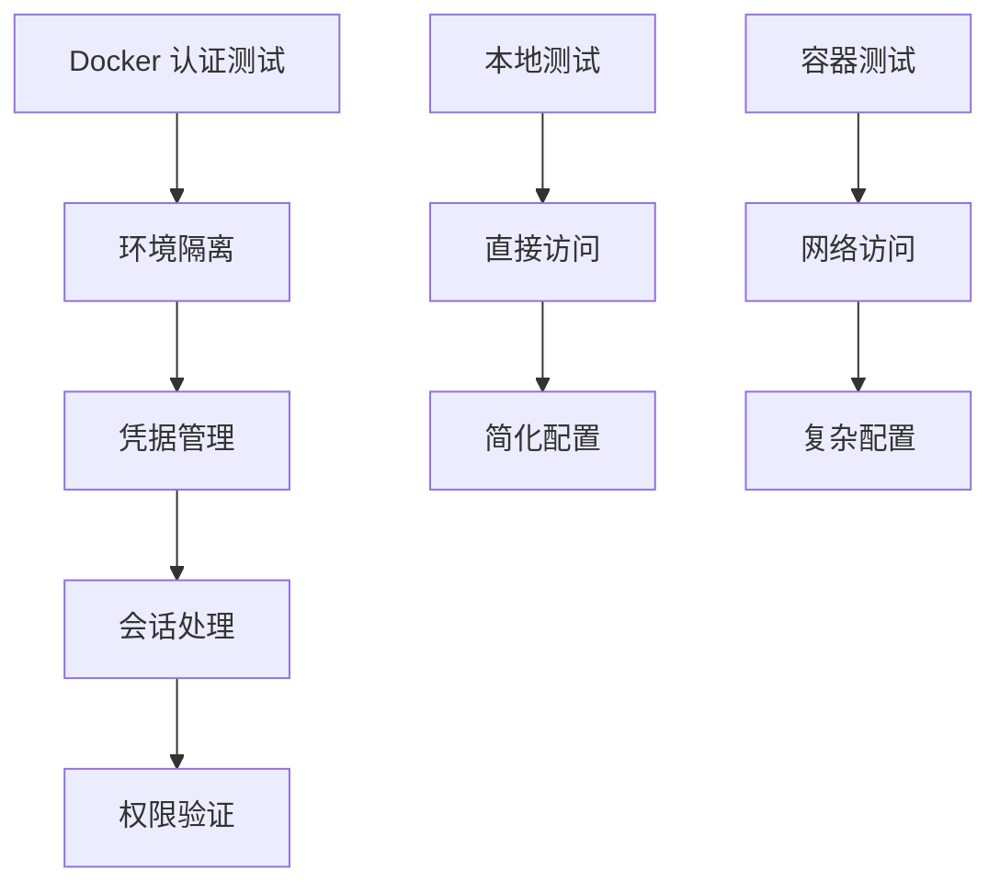

**图表来源**
- [backend/docs/AUTH_TEST_DOCKER_GAP.md](file://backend/docs/AUTH_TEST_DOCKER_GAP.md)

**章节来源**
- [backend/docs/AUTH_TEST_DOCKER_GAP.md](file://backend/docs/AUTH_TEST_DOCKER_GAP.md)

### 自动化诊断脚本使用

#### doctor.py 脚本功能

该脚本提供了全面的系统诊断能力：

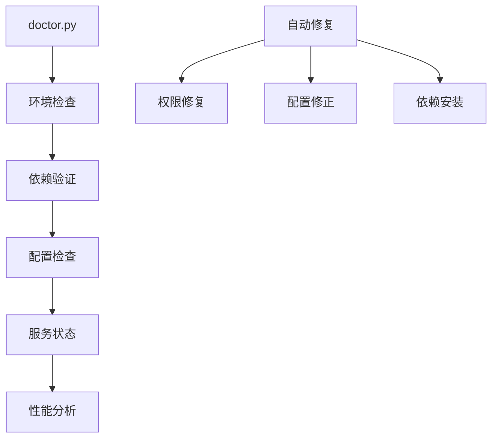

**图表来源**
- [scripts/doctor.py](file://scripts/doctor.py)

#### 脚本使用方法

**章节来源**
- [scripts/doctor.py](file://scripts/doctor.py)

## 结论

Deer Flow 项目提供了完善的部署问题排查解决方案。通过自动化脚本、健康检查机制和详细的故障排除指南，可以有效解决大部分部署过程中遇到的问题。建议在部署前使用 doctor.py 脚本进行全面检查，并建立标准化的故障排除流程。

## 附录

### 快速参考清单

#### 部署前检查
- [ ] Docker 环境验证
- [ ] 端口可用性检查
- [ ] 文件权限验证
- [ ] 网络连通性测试

#### 常用命令
- `docker-compose up -d` - 启动服务
- `docker-compose down` - 停止服务
- `docker logs <service>` - 查看日志
- `docker exec -it <container> bash` - 进入容器

#### 故障排除工具
- [check_docker.sh](file://.agent/skills/smoke-test/scripts/check_docker.sh) - Docker 环境检查
- [health_check.sh](file://.agent/skills/smoke-test/scripts/health_check.sh) - 服务健康检查
- [doctor.py](file://scripts/doctor.py) - 系统诊断工具
- [cleanup-containers.sh](file://scripts/cleanup-containers.sh) - 容器清理工具