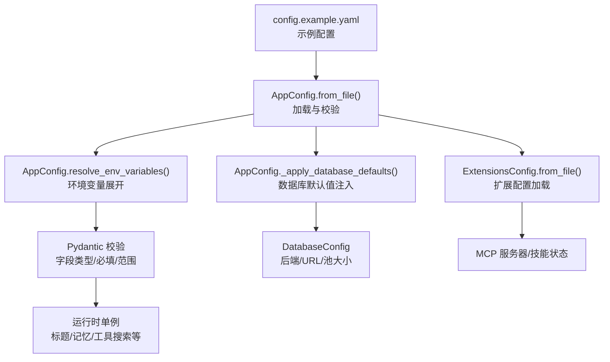
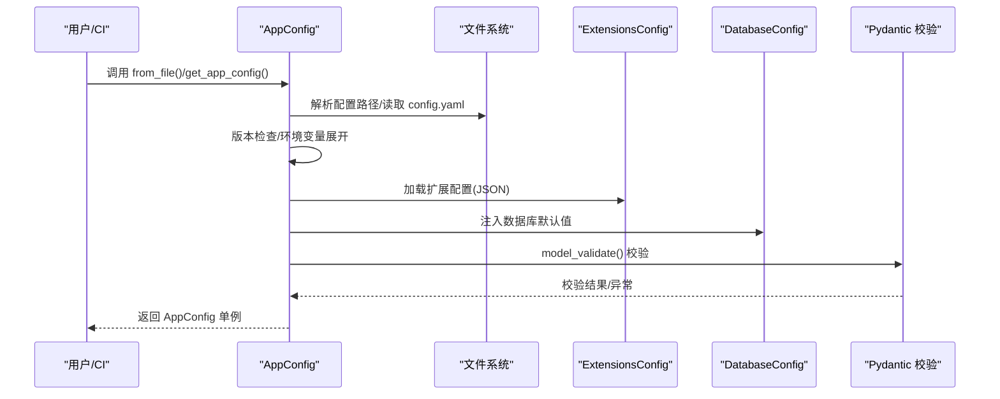
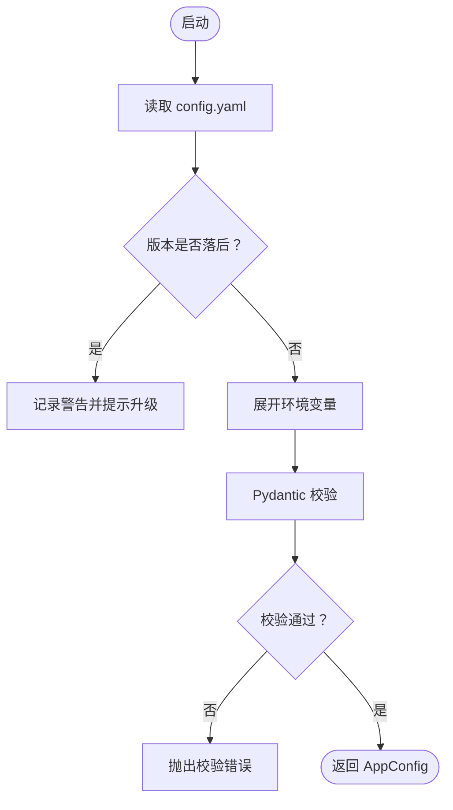
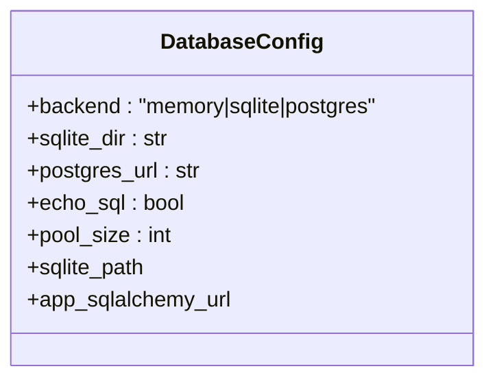
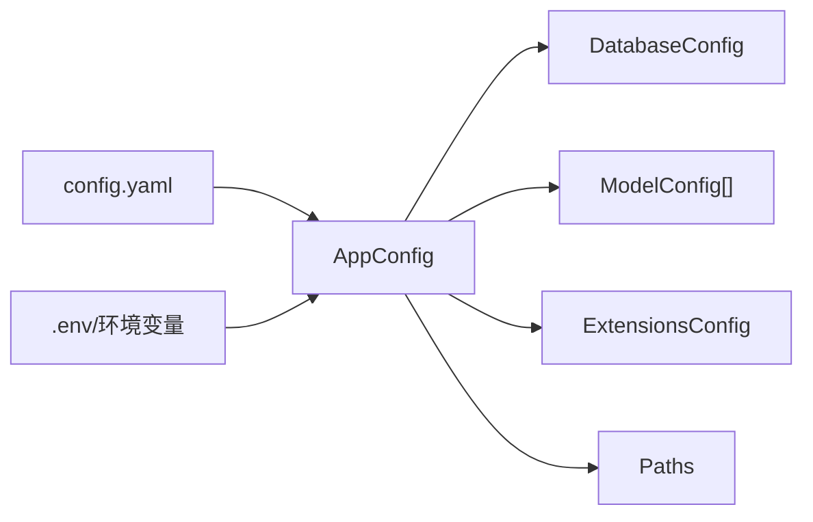

# 配置问题

<cite>
**本文引用的文件**
- [config.example.yaml](file://config.example.yaml)
- [CONFIGURATION.md](file://backend/docs/CONFIGURATION.md)
- [app_config.py](file://backend/packages/harness/deerflow/config/app_config.py)
- [database_config.py](file://backend/packages/harness/deerflow/config/database_config.py)
- [model_config.py](file://backend/packages/harness/deerflow/config/model_config.py)
- [extensions_config.py](file://backend/packages/harness/deerflow/config/extensions_config.py)
- [extensions_config.example.json](file://extensions_config.example.json)
- [paths.py](file://backend/packages/harness/deerflow/config/paths.py)
- [reload_boundary.py](file://backend/packages/harness/deerflow/config/reload_boundary.py)
- [test_app_config_env_expand.py](file://backend/tests/test_app_config_env_expand.py)
</cite>

## 目录
1. [简介](#简介)
2. [项目结构](#项目结构)
3. [核心组件](#核心组件)
4. [架构总览](#架构总览)
5. [详细组件分析](#详细组件分析)
6. [依赖关系分析](#依赖关系分析)
7. [性能考量](#性能考量)
8. [故障排查指南](#故障排查指南)
9. [结论](#结论)
10. [附录](#附录)

## 简介
本文件聚焦于 DeerFlow 的配置问题排查与最佳实践，覆盖以下主题：
- 配置文件格式验证与版本校验
- 参数校验失败与常见字段错误
- 数据库连接配置错误定位
- 模型提供商配置问题（含思维/推理支持、响应 API、网关基地址等）
- 环境变量、路径与权限配置排查
- 扩展配置（MCP 服务器）与热更新/重载边界

目标是帮助运维与开发人员快速定位并修复配置类问题，减少停机时间。

## 项目结构
- 配置入口与解析：应用通过统一的 AppConfig 加载 config.yaml，并在启动时进行版本检查、环境变量展开、默认值注入与单例化管理。
- 数据库配置：统一后端（内存/SQLite/Postgres），并为检查点与应用数据共享同一后端。
- 路径与权限：集中式路径管理，确保沙箱挂载目录具备可写权限。
- 扩展配置：MCP 服务器与技能状态独立于主配置文件，按需加载。
- 热重载边界：明确哪些配置项需要重启才能生效，避免误判。

图表来源
- [app_config.py:200-238](file://backend/packages/harness/deerflow/config/app_config.py#L200-L238)
- [app_config.py:333-372](file://backend/packages/harness/deerflow/config/app_config.py#L333-L372)
- [database_config.py:40-103](file://backend/packages/harness/deerflow/config/database_config.py#L40-L103)
- [extensions_config.py:142-167](file://backend/packages/harness/deerflow/config/extensions_config.py#L142-L167)

章节来源
- [app_config.py:170-238](file://backend/packages/harness/deerflow/config/app_config.py#L170-L238)
- [database_config.py:40-103](file://backend/packages/harness/deerflow/config/database_config.py#L40-L103)
- [extensions_config.py:142-167](file://backend/packages/harness/deerflow/config/extensions_config.py#L142-L167)

## 核心组件
- AppConfig：负责加载、校验与缓存配置；支持热重载与运行时作用域覆盖；内置配置版本检查与环境变量展开。
- DatabaseConfig：统一数据库后端选择与连接参数，生成 SQLAlchemy URL。
- ModelConfig：模型条目定义，包括提供商类路径、模型名、思维/推理支持、响应 API 开关等。
- ExtensionsConfig：MCP 服务器与技能状态配置，支持 JSON 文件与环境变量展开。
- Paths：集中式路径与权限管理，确保沙箱挂载目录具备可写权限。
- ReloadBoundary：定义“需要重启”的配置边界，避免误判。

章节来源
- [app_config.py:90-154](file://backend/packages/harness/deerflow/config/app_config.py#L90-L154)
- [database_config.py:40-103](file://backend/packages/harness/deerflow/config/database_config.py#L40-L103)
- [model_config.py:4-52](file://backend/packages/harness/deerflow/config/model_config.py#L4-L52)
- [extensions_config.py:75-87](file://backend/packages/harness/deerflow/config/extensions_config.py#L75-L87)
- [paths.py:82-310](file://backend/packages/harness/deerflow/config/paths.py#L82-L310)
- [reload_boundary.py:45-75](file://backend/packages/harness/deerflow/config/reload_boundary.py#L45-L75)

## 架构总览
下图展示配置从磁盘到运行时的关键流转与校验点。

图表来源
- [app_config.py:200-238](file://backend/packages/harness/deerflow/config/app_config.py#L200-L238)
- [app_config.py:288-331](file://backend/packages/harness/deerflow/config/app_config.py#L288-L331)
- [app_config.py:333-372](file://backend/packages/harness/deerflow/config/app_config.py#L333-L372)
- [extensions_config.py:142-167](file://backend/packages/harness/deerflow/config/extensions_config.py#L142-L167)
- [database_config.py:276-286](file://backend/packages/harness/deerflow/config/database_config.py#L276-L286)

## 详细组件分析

### 配置文件格式验证与版本校验
- 配置版本检查：启动时比较本地 config.yaml 与示例文件中的 config_version，若落后则发出警告并提示升级合并。
- YAML 安全解析：使用安全解析器加载，避免任意对象注入。
- 环境变量展开：支持 $VAR 与 ${VAR} 两种语法，缺失时抛出明确错误，便于快速定位。

图表来源
- [app_config.py:288-331](file://backend/packages/harness/deerflow/config/app_config.py#L288-L331)
- [app_config.py:333-372](file://backend/packages/harness/deerflow/config/app_config.py#L333-L372)
- [CONFIGURATION.md:5-16](file://backend/docs/CONFIGURATION.md#L5-L16)

章节来源
- [app_config.py:288-331](file://backend/packages/harness/deerflow/config/app_config.py#L288-L331)
- [app_config.py:333-372](file://backend/packages/harness/deerflow/config/app_config.py#L333-L372)
- [CONFIGURATION.md:5-16](file://backend/docs/CONFIGURATION.md#L5-L16)

### 参数校验失败与默认值注入
- 列表字段空值处理：当某节为空但存在注释时，YAML 解析为 null，框架会将其转换为空列表以避免后续报错。
- 数据库默认值：若未显式配置 database 节，自动注入默认后端与 SQLite 目录。
- 模型字段：name/use/model 等为必填；思维/推理支持、响应 API、视觉支持等为可选布尔或字典。

章节来源
- [app_config.py:155-168](file://backend/packages/harness/deerflow/config/app_config.py#L155-L168)
- [app_config.py:276-286](file://backend/packages/harness/deerflow/config/app_config.py#L276-L286)
- [model_config.py:7-35](file://backend/packages/harness/deerflow/config/model_config.py#L7-L35)

### 数据库连接配置错误定位
- 后端选择：memory/sqlite/postgres 三选一；生产推荐 Postgres。
- 连接 URL：Postgres 使用 $VAR 引用 .env；SQLite 默认路径位于运行时家目录下。
- SQLAlchemy URL：根据后端自动生成，确保驱动后缀正确。
- 常见错误：
  - 缺少 $VAR 或变量未导出
  - URL 格式不正确（缺少 asyncpg 前缀或协议）
  - 连接池大小与并发不匹配
  - WAL/锁等待超时导致写入阻塞

图表来源
- [database_config.py:40-103](file://backend/packages/harness/deerflow/config/database_config.py#L40-L103)

章节来源
- [database_config.py:40-103](file://backend/packages/harness/deerflow/config/database_config.py#L40-L103)

### 模型提供商配置问题
- 提供商类路径：必须指向可用的 LangChain 或适配器类，如 patched_*。
- 思维/推理支持：需声明 supports_thinking/supports_reasoning_effort，并在 when_thinking_enabled/when_thinking_disabled 中传参。
- 响应 API：OpenAI 兼容网关可启用 responses API 并指定输出版本。
- 视觉支持：supports_vision 控制图像输入能力。
- 网关基地址：base_url 必须与提供商文档一致，且注意路径后缀（如 /v1）。
- 示例参考：config.example.yaml 与 CONFIGURATION.md 提供多厂商示例与注意事项。

章节来源
- [model_config.py:10-51](file://backend/packages/harness/deerflow/config/model_config.py#L10-L51)
- [config.example.yaml:36-486](file://config.example.yaml#L36-L486)
- [CONFIGURATION.md:20-136](file://backend/docs/CONFIGURATION.md#L20-L136)

### 扩展配置（MCP 服务器与技能）
- 文件格式：JSON；支持 extensions_config.json 与历史 mcp_config.json。
- 环境变量展开：$VAR 将被替换为空字符串（避免下游收到字面量）。
- 传输类型：stdio/sse/http；兼容 transport 字段别名。
- OAuth：可选令牌注入，支持 client_credentials/refresh_token。
- 技能状态：按名称启用/禁用，默认对 public/custom 技能启用。

章节来源
- [extensions_config.py:75-87](file://backend/packages/harness/deerflow/config/extensions_config.py#L75-L87)
- [extensions_config.py:142-167](file://backend/packages/harness/deerflow/config/extensions_config.py#L142-L167)
- [extensions_config.py:170-201](file://backend/packages/harness/deerflow/config/extensions_config.py#L170-L201)
- [extensions_config.example.json:1-34](file://extensions_config.example.json#L1-L34)

### 环境变量、路径与权限
- 环境变量：
  - $VAR 与 ${VAR} 展开；缺失时抛错。
  - 常用变量：API 密钥、DEER_FLOW_PROJECT_ROOT、DEER_FLOW_CONFIG_PATH、DEER_FLOW_HOME、DEER_FLOW_SKILLS_PATH 等。
- 路径：
  - base_dir 优先级：构造函数 > DEER_FLOW_HOME > 项目根默认。
  - 线程/用户/代理目录布局清晰；沙箱虚拟路径前缀为 /mnt/user-data。
- 权限：
  - 确保线程工作区/上传/输出目录具备 0o777 权限，避免容器内写入失败。

章节来源
- [app_config.py:333-372](file://backend/packages/harness/deerflow/config/app_config.py#L333-L372)
- [paths.py:108-146](file://backend/packages/harness/deerflow/config/paths.py#L108-L146)
- [paths.py:280-301](file://backend/packages/harness/deerflow/config/paths.py#L280-L301)
- [CONFIGURATION.md:351-373](file://backend/docs/CONFIGURATION.md#L351-L373)

### 配置热更新与重载边界
- 热重载：
  - AppConfig 支持基于文件修改时间的自动重载；可通过 reload_app_config() 强制刷新。
  - 运行时作用域覆盖：push_current_app_config()/pop_current_app_config() 可临时切换配置。
- 需要重启的边界（startup-only）：
  - database、checkpointer、run_events、stream_bridge、sandbox、log_level 等。
  - 变更这些字段通常需要重启进程以重建引擎/客户端/通道等基础设施。

章节来源
- [app_config.py:427-498](file://backend/packages/harness/deerflow/config/app_config.py#L427-L498)
- [reload_boundary.py:45-75](file://backend/packages/harness/deerflow/config/reload_boundary.py#L45-L75)

## 依赖关系分析
- 配置加载链路：config.yaml → AppConfig → 各子配置模块（数据库/模型/工具/扩展等）。
- 环境变量依赖：所有 $VAR/${VAR} 在解析阶段统一展开，失败即刻报错。
- 扩展配置独立：extensions_config.json 与 config.yaml 分离，按需加载。

图表来源
- [app_config.py:200-238](file://backend/packages/harness/deerflow/config/app_config.py#L200-L238)
- [database_config.py:40-103](file://backend/packages/harness/deerflow/config/database_config.py#L40-L103)
- [extensions_config.py:142-167](file://backend/packages/harness/deerflow/config/extensions_config.py#L142-L167)
- [paths.py:82-146](file://backend/packages/harness/deerflow/config/paths.py#L82-L146)

章节来源
- [app_config.py:200-238](file://backend/packages/harness/deerflow/config/app_config.py#L200-L238)
- [extensions_config.py:142-167](file://backend/packages/harness/deerflow/config/extensions_config.py#L142-L167)

## 性能考量
- 数据库连接池：合理设置 pool_size，避免高并发下的连接争用。
- SQLite 写入阻塞：WAL 模式可缓解读写冲突，但长时间写入仍可能因锁等待超时失败。
- 工具输出预算：tool_output 配置可降低大输出带来的上下文膨胀与 IO 压力。
- 日志级别：仅调整 log_level 不影响基础设施，无需重启即可生效。

## 故障排查指南

### 通用排查步骤
- 确认配置文件位置与加载顺序：DEER_FLOW_CONFIG_PATH > 项目根 config.yaml > 兼容路径。
- 检查 config_version 是否落后，必要时执行升级合并。
- 检查环境变量是否正确导出，尤其是 $VAR 与 ${VAR}。
- 若涉及扩展配置，确认 extensions_config.json 存在且为有效 JSON。

章节来源
- [CONFIGURATION.md:374-386](file://backend/docs/CONFIGURATION.md#L374-L386)
- [app_config.py:170-198](file://backend/packages/harness/deerflow/config/app_config.py#L170-L198)
- [app_config.py:288-331](file://backend/packages/harness/deerflow/config/app_config.py#L288-L331)
- [extensions_config.py:142-167](file://backend/packages/harness/deerflow/config/extensions_config.py#L142-L167)

### 配置文件格式与版本问题
- 症状：启动时报“配置过期”警告或首次运行崩溃。
- 处理：
  - 使用示例文件进行版本比对与字段合并。
  - 确保 YAML 语法正确，避免空节被解析为 null。

章节来源
- [CONFIGURATION.md:5-16](file://backend/docs/CONFIGURATION.md#L5-L16)
- [app_config.py:288-331](file://backend/packages/harness/deerflow/config/app_config.py#L288-L331)

### 环境变量未解析或缺失
- 症状：出现“未找到环境变量”错误。
- 处理：
  - 确认 .env 或进程环境已导出对应变量。
  - 使用 $VAR 或 ${VAR} 语法；确保变量名无空格且非空。
  - 可参考测试用例验证展开行为。

章节来源
- [app_config.py:333-372](file://backend/packages/harness/deerflow/config/app_config.py#L333-L372)
- [test_app_config_env_expand.py:8-30](file://backend/tests/test_app_config_env_expand.py#L8-L30)

### 数据库连接错误
- 症状：连接失败、认证错误、URL 格式不正确。
- 处理：
  - 检查 backend 与 postgres_url（或 sqlite_dir）配置。
  - 确认 $VAR 已正确展开为完整 URL。
  - 生产环境使用 Postgres 并设置合理的 pool_size。

章节来源
- [database_config.py:40-103](file://backend/packages/harness/deerflow/config/database_config.py#L40-L103)

### 模型提供商配置问题
- 症状：调用失败、思维/推理内容丢失、视觉输入无效。
- 处理：
  - 确认 use 类路径正确，思维/推理开关与提供商要求一致。
  - 对需要思考/推理的模型，按示例配置 when_thinking_enabled/when_thinking_disabled。
  - OpenAI 兼容网关需设置 base_url 与 /v1 路径后缀。

章节来源
- [model_config.py:10-51](file://backend/packages/harness/deerflow/config/model_config.py#L10-L51)
- [config.example.yaml:36-486](file://config.example.yaml#L36-L486)
- [CONFIGURATION.md:20-136](file://backend/docs/CONFIGURATION.md#L20-L136)

### 扩展配置（MCP 服务器）问题
- 症状：MCP 服务无法发现、认证失败、传输类型不生效。
- 处理：
  - 确认 extensions_config.json 存在且为有效 JSON。
  - 检查 transport/type、command/args、url/headers、oauth 配置。
  - 环境变量 $VAR 将被展开为空字符串，确保下游有兜底策略。

章节来源
- [extensions_config.py:142-167](file://backend/packages/harness/deerflow/config/extensions_config.py#L142-L167)
- [extensions_config.example.json:1-34](file://extensions_config.example.json#L1-L34)

### 路径与权限问题
- 症状：沙箱写入失败、目录不存在、权限不足。
- 处理：
  - 确认 DEER_FLOW_HOME 或构造函数 base_dir 正确。
  - 使用 ensure_thread_dirs() 创建并赋予 0o777 权限。
  - 检查虚拟路径 /mnt/user-data 下的相对路径是否越界。

章节来源
- [paths.py:108-146](file://backend/packages/harness/deerflow/config/paths.py#L108-L146)
- [paths.py:280-301](file://backend/packages/harness/deerflow/config/paths.py#L280-L301)
- [paths.py:311-345](file://backend/packages/harness/deerflow/config/paths.py#L311-L345)

### 热更新与重载边界
- 症状：修改某些配置后未生效。
- 处理：
  - 若变更涉及 database/checkpointer/run_events/stream_bridge/sandbox/log_level，需重启进程。
  - 否则可调用 reload_app_config() 或使用运行时作用域覆盖。

章节来源
- [reload_boundary.py:45-75](file://backend/packages/harness/deerflow/config/reload_boundary.py#L45-L75)
- [app_config.py:471-484](file://backend/packages/harness/deerflow/config/app_config.py#L471-L484)

## 结论
- 配置问题的根因多集中在：版本落后、环境变量缺失、数据库 URL/驱动不正确、模型提供商开关与网关基地址不匹配、扩展配置 JSON 语法错误、路径权限不足以及热重载边界误判。
- 建议流程：先核对版本与环境变量，再检查数据库与模型配置，最后验证路径与权限，并结合热重载边界判断是否需要重启。

## 附录

### 配置文件模板对比与检查清单
- 模板来源：config.example.yaml 与 CONFIGURATION.md
- 检查要点：
  - config_version 是否最新
  - models 列表是否为空（框架会将其转为空列表，但需确保至少配置一个）
  - database.backend 与 postgres_url/sqlite_dir
  - sandbox.use 与 mounts（如使用）
  - tools/tool_groups 是否按需启用
  - extensions_config.json 语法与 $VAR 展开

章节来源
- [config.example.yaml:1-120](file://config.example.yaml#L1-L120)
- [CONFIGURATION.md:18-136](file://backend/docs/CONFIGURATION.md#L18-L136)