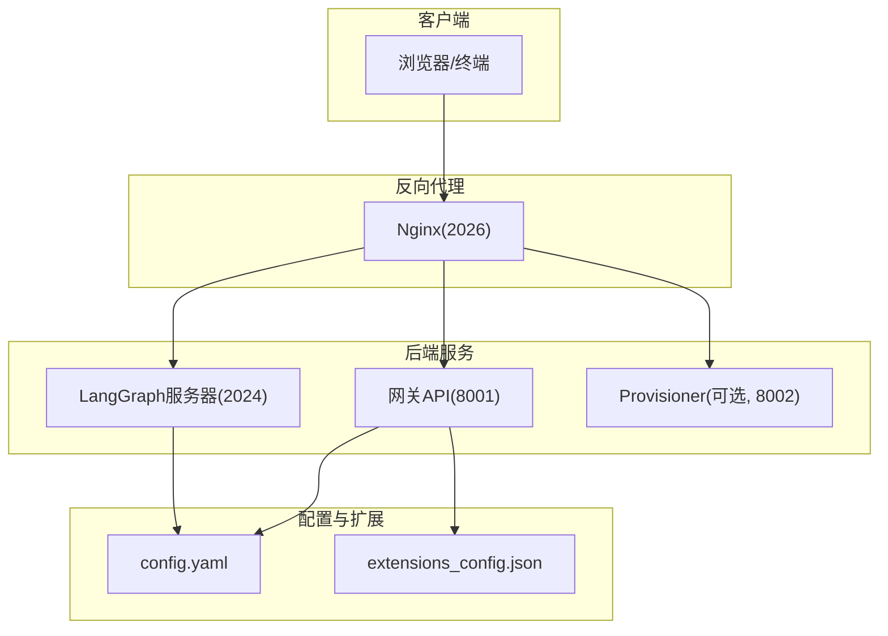
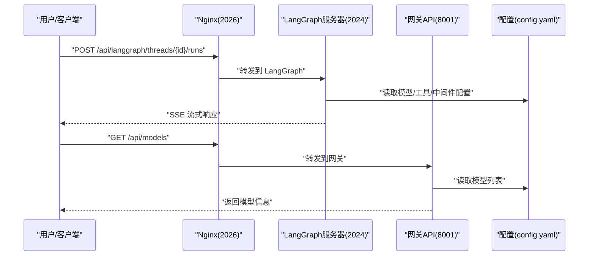
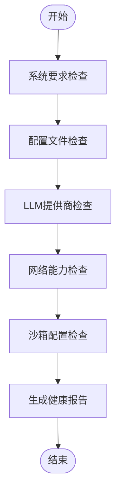
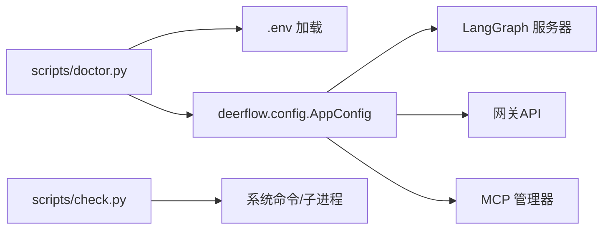

# 故障排除和FAQ

<cite>
**本文引用的文件**
- [README.md](file://README.md)
- [Install.md](file://Install.md)
- [backend/docs/CONFIGURATION.md](file://backend/docs/CONFIGURATION.md)
- [backend/docs/SETUP.md](file://backend/docs/SETUP.md)
- [backend/docs/ARCHITECTURE.md](file://backend/docs/ARCHITECTURE.md)
- [scripts/doctor.py](file://scripts/doctor.py)
- [scripts/check.py](file://scripts/check.py)
- [config.example.yaml](file://config.example.yaml)
- [CONTRIBUTING.md](file://CONTRIBUTING.md)
</cite>

## 目录
1. [简介](#简介)
2. [项目结构](#项目结构)
3. [核心组件](#核心组件)
4. [架构总览](#架构总览)
5. [详细组件分析](#详细组件分析)
6. [依赖关系分析](#依赖关系分析)
7. [性能考虑](#性能考虑)
8. [故障排除指南](#故障排除指南)
9. [结论](#结论)
10. [附录](#附录)

## 简介
本文件面向使用 DeerFlow 的开发者与运维人员，提供系统化的故障排除与常见问题解答（FAQ）。内容覆盖安装与环境准备、配置校验、运行时异常、性能瓶颈排查、部署与网络配置、安全加固、问题分类与解决流程、社区支持与问题报告模板、以及预防性维护建议。所有建议均基于仓库内现有脚本、文档与示例配置进行提炼与总结。

## 项目结构
DeerFlow 采用前后端分离与反向代理统一入口的多服务架构：前端通过 Nginx 聚合到后端网关与 LangGraph 服务器，后端包含模型工厂、工具系统、沙箱执行、技能加载、MCP 集成等模块。开发与部署同时支持 Docker 与本地两种模式，并提供一键健康检查与依赖检测脚本。

图示来源
- [backend/docs/ARCHITECTURE.md:1-51](file://backend/docs/ARCHITECTURE.md#L1-L51)
- [CONTRIBUTING.md:126-137](file://CONTRIBUTING.md#L126-L137)

章节来源
- [backend/docs/ARCHITECTURE.md:1-51](file://backend/docs/ARCHITECTURE.md#L1-L51)
- [CONTRIBUTING.md:126-137](file://CONTRIBUTING.md#L126-L137)

## 核心组件
- 健康检查与依赖检测：提供跨平台依赖检查与综合健康检查脚本，自动识别系统要求、配置版本、模型与工具可用性、沙箱模式与前端环境状态。
- 配置系统：集中于 config.yaml，支持模型、工具、沙箱、技能、标题生成、摘要、内存、MCP 扩展等配置项；提供配置升级与定位策略。
- 运行时架构：LangGraph 作为核心代理运行时，网关负责非代理类 API；Nginx 提供统一入口与路由转发。
- 沙箱执行：支持本地直连与容器隔离两种模式，容器模式在生产中更推荐以提升安全性。
- MCP 与技能：通过 extensions_config.json 管理 MCP 服务器，技能目录按公共与自定义区分，支持延迟加载与搜索。

章节来源
- [scripts/check.py:60-166](file://scripts/check.py#L60-L166)
- [scripts/doctor.py:632-722](file://scripts/doctor.py#L632-L722)
- [backend/docs/CONFIGURATION.md:1-370](file://backend/docs/CONFIGURATION.md#L1-L370)
- [backend/docs/ARCHITECTURE.md:53-127](file://backend/docs/ARCHITECTURE.md#L53-L127)

## 架构总览
下图展示请求从浏览器进入，经 Nginx 路由至 LangGraph 或网关，再由配置驱动各子系统协同工作的整体流程。

图示来源
- [backend/docs/ARCHITECTURE.md:344-380](file://backend/docs/ARCHITECTURE.md#L344-L380)

章节来源
- [backend/docs/ARCHITECTURE.md:344-380](file://backend/docs/ARCHITECTURE.md#L344-L380)

## 详细组件分析

### 健康检查与依赖检测
- 依赖检测脚本会检查 Node.js、pnpm、uv、nginx 是否存在及版本是否满足最低要求，并输出可执行命令提示。
- 综合健康检查脚本 doctor.py 会：
  - 校验系统要求（Python 版本、Node.js、pnpm、uv、nginx）
  - 检查 .env 与前端 .env 是否存在
  - 校验 config.yaml 存在性、版本、可加载性、模型配置数量
  - 检查 LLM API 密钥与认证路径（含 CLI 认证文件）
  - 校验工具链（网络搜索/抓取）可用性与密钥设置
  - 检查沙箱配置与容器运行时可用性
  - 输出汇总状态与修复建议

图示来源
- [scripts/check.py:60-166](file://scripts/check.py#L60-L166)
- [scripts/doctor.py:632-722](file://scripts/doctor.py#L632-L722)

章节来源
- [scripts/check.py:60-166](file://scripts/check.py#L60-L166)
- [scripts/doctor.py:632-722](file://scripts/doctor.py#L632-L722)

### 配置系统与升级
- 配置版本：config.example.yaml 中的 config_version 字段用于跟踪配置变更；当本地版本落后时，启动会提示升级。
- 配置定位优先级：代码指定路径 > 环境变量 DEER_FLOW_CONFIG_PATH > 当前工作目录 backend/config.yaml > 项目根目录 deer-flow/config.yaml。
- 常见配置项：模型、工具组、工具、沙箱、技能、标题生成、摘要、内存、MCP 扩展等。
- 升级与回退：提供 make config-upgrade 自动合并新字段并保留用户值，同时生成 .bak 备份。

章节来源
- [backend/docs/CONFIGURATION.md:5-16](file://backend/docs/CONFIGURATION.md#L5-L16)
- [backend/docs/SETUP.md:42-50](file://backend/docs/SETUP.md#L42-L50)
- [config.example.yaml:10-15](file://config.example.yaml#L10-L15)

### 运行时架构与数据流
- 请求路由：Nginx 将 /api/langgraph/* 转发至 LangGraph 服务器，其他 /api/* 转发至网关，静态资源转发至前端。
- 中间件链：线程数据初始化、上传处理、沙箱获取、上下文压缩、标题生成、计划任务、图像处理、澄清处理等。
- 文件上传与清理：网关接收上传并转换文档，随后在对话删除时清理本地 DeerFlow 管理的文件夹。
- 配置热重载：MCP 配置通过文件时间戳检测变化，动态重新初始化 MCP 客户端。

章节来源
- [backend/docs/ARCHITECTURE.md:53-127](file://backend/docs/ARCHITECTURE.md#L53-L127)
- [backend/docs/ARCHITECTURE.md:412-425](file://backend/docs/ARCHITECTURE.md#L412-L425)
- [backend/docs/ARCHITECTURE.md:427-443](file://backend/docs/ARCHITECTURE.md#L427-L443)

### 沙箱执行与隔离
- 本地沙箱：直接在宿主机执行，适合开发；默认禁用 host bash 以避免安全风险。
- 容器沙箱：在 Docker/Apple Container 中隔离执行，生产推荐；支持挂载与并发限制。
- Provisioner 模式：在本地 k3s 集群中为每个沙箱分配独立 Pod，适合高隔离与可扩展场景。

章节来源
- [backend/docs/CONFIGURATION.md:203-232](file://backend/docs/CONFIGURATION.md#L203-L232)
- [backend/docs/CONFIGURATION.md:518-588](file://backend/docs/CONFIGURATION.md#L518-L588)

### MCP 与技能系统
- MCP：通过 extensions_config.json 管理服务器，支持 stdio/SSE/HTTP 传输；按文件时间戳缓存与失效。
- 技能：公共与自定义目录分离，按需加载；可通过自定义代理配置限制加载范围。

章节来源
- [backend/docs/ARCHITECTURE.md:267-303](file://backend/docs/ARCHITECTURE.md#L267-L303)
- [backend/docs/ARCHITECTURE.md:305-342](file://backend/docs/ARCHITECTURE.md#L305-L342)

## 依赖关系分析
- 脚本依赖：doctor.py 依赖 dotenv 加载 .env，导入 deerflow.config.AppConfig 读取配置；check.py 仅依赖系统命令与子进程。
- 配置依赖：LangGraph 与网关均依赖 config.yaml；MCP 依赖 extensions_config.json。
- 运行时依赖：容器沙箱依赖 Docker/Apple Container；本地沙箱依赖 host 文件系统与 bash（需显式启用）。

图示来源
- [scripts/doctor.py:87-91](file://scripts/doctor.py#L87-L91)
- [scripts/check.py:23-29](file://scripts/check.py#L23-L29)
- [backend/docs/ARCHITECTURE.md:53-127](file://backend/docs/ARCHITECTURE.md#L53-L127)

章节来源
- [scripts/doctor.py:87-91](file://scripts/doctor.py#L87-L91)
- [scripts/check.py:23-29](file://scripts/check.py#L23-L29)
- [backend/docs/ARCHITECTURE.md:53-127](file://backend/docs/ARCHITECTURE.md#L53-L127)

## 性能考虑
- 缓存与热重载：MCP 工具按文件时间戳缓存；配置按文件变更热重载；技能解析一次性缓存。
- 流式传输：SSE 实现实时响应，降低首 token 时间，提升长任务可见性。
- 上下文管理：摘要中间件在接近阈值时自动压缩历史，保留近期消息，减少 token 使用。
- 资源建议：开发与评审环境建议至少 4vCPU/8GB，生产或多人评审建议 8vCPU/16GB 起步；Linux + Docker 推荐用于持久化服务。

章节来源
- [backend/docs/ARCHITECTURE.md:466-485](file://backend/docs/ARCHITECTURE.md#L466-L485)
- [README.md:207-220](file://README.md#L207-L220)
- [CONTRIBUTING.md:80-91](file://CONTRIBUTING.md#L80-L91)

## 故障排除指南

### 一、安装与环境问题
- 症状：依赖缺失或版本不满足
  - 可能原因：未安装 Node.js/pnpm/uv/nginx，或版本过低
  - 修复步骤：运行 make check 或 scripts/check.py，根据输出安装/升级对应工具；必要时启用 Corepack 或使用包管理器镜像源
- 症状：Linux 下 Docker 权限被拒绝
  - 可能原因：当前用户不在 docker 组
  - 修复步骤：将用户加入 docker 组并重新登录；验证 docker ps；重试 make docker-* 命令

章节来源
- [scripts/check.py:60-166](file://scripts/check.py#L60-L166)
- [CONTRIBUTING.md:92-124](file://CONTRIBUTING.md#L92-L124)

### 二、配置错误
- 症状：找不到 config.yaml 或加载失败
  - 可能原因：文件不存在、位置不正确、版本落后、语法错误
  - 修复步骤：确保 config.yaml 在项目根目录；运行 make doctor 检查版本与可加载性；使用 make config-upgrade 合并新字段；参考 backend/docs/SETUP.md 定位优先级
- 症状：模型未配置或 API 密钥未设置
  - 可能原因：models 列表为空、环境变量未导出或拼写错误
  - 修复步骤：运行 make setup 或手动编辑 config.yaml；在 .env 中设置对应密钥；使用 doctor.py 检查密钥是否被识别
- 症状：网络搜索/抓取工具不可用
  - 可能原因：未配置工具或缺少 API 密钥
  - 修复步骤：运行 make setup 配置所需工具；在 .env 中添加相应密钥；确认 provider 可用

章节来源
- [backend/docs/SETUP.md:42-50](file://backend/docs/SETUP.md#L42-L50)
- [backend/docs/CONFIGURATION.md:346-370](file://backend/docs/CONFIGURATION.md#L346-L370)
- [scripts/doctor.py:288-337](file://scripts/doctor.py#L288-L337)
- [scripts/doctor.py:442-528](file://scripts/doctor.py#L442-L528)

### 三、运行时异常
- 症状：沙箱无法启动或容器运行时不可用
  - 可能原因：未安装 Docker/Apple Container；端口占用；镜像不可达
  - 修复步骤：安装并启动容器运行时；检查端口占用；预拉取镜像；确认 provisioner_url（如使用）
- 症状：本地沙箱启用 bash 但被禁用
  - 可能原因：LocalSandboxProvider 默认禁用 host bash
  - 修复步骤：仅在完全可信的单用户本地工作流中启用 allow_host_bash；否则切换到容器沙箱
- 症状：MCP 工具未生效
  - 可能原因：extensions_config.json 未更新或文件时间戳未变化
  - 修复步骤：修改后保存文件；等待 mtime 变化触发重新初始化；或重启相关服务

章节来源
- [scripts/doctor.py:546-614](file://scripts/doctor.py#L546-L614)
- [backend/docs/CONFIGURATION.md:203-232](file://backend/docs/CONFIGURATION.md#L203-L232)
- [backend/docs/ARCHITECTURE.md:427-443](file://backend/docs/ARCHITECTURE.md#L427-L443)

### 四、部署与网络配置
- 症状：Docker 开发环境构建缓慢
  - 可能原因：网络受限导致镜像/包下载慢
  - 修复步骤：设置 UV_INDEX_URL 与 NPM_REGISTRY 环境变量后再执行 make docker-init 或 make docker-start
- 症状：生产部署端口冲突或权限不足
  - 可能原因：端口被占用或权限不足
  - 修复步骤：释放端口或调整映射；确保进程有足够权限访问端口与卷

章节来源
- [CONTRIBUTING.md:73-78](file://CONTRIBUTING.md#L73-L78)
- [README.md:221-251](file://README.md#L221-L251)

### 五、IM 渠道与外部集成
- 症状：Telegram/Slack/飞书/微信/企业微信等渠道无法接收消息
  - 可能原因：未正确配置 bot_token/app_id/app_secret；回调地址或容器服务名错误；未启用 Socket Mode/长连接
  - 修复步骤：按 README.md 中对应渠道的配置与密钥设置；在 Docker Compose 中使用容器服务名而非 localhost；确认事件订阅与权限范围

章节来源
- [README.md:362-521](file://README.md#L362-L521)

### 六、安全加固与合规
- 症状：公网暴露导致安全风险
  - 可能原因：未做 IP 白名单、未启用强鉴权网关、未做网络隔离
  - 修复步骤：配置 IP 白名单、启用反向代理强鉴权、将服务置于专用 VLAN；遵循 README.md 的安全建议

章节来源
- [README.md:713-730](file://README.md#L713-L730)

### 七、问题分类与解决流程
- 安装与环境类：使用 scripts/check.py 与 doctor.py 快速定位缺失工具与版本问题
- 配置类：使用 doctor.py 的配置检查项逐项核对；必要时使用 make config-upgrade
- 运行时类：结合 doctor.py 的沙箱与工具检查项；查看日志定位具体模块
- 部署类：核对 Docker 权限、端口与镜像；在 Linux 上修正 docker 组权限
- 安全类：按 README.md 的安全建议实施加固措施

章节来源
- [scripts/check.py:60-166](file://scripts/check.py#L60-L166)
- [scripts/doctor.py:632-722](file://scripts/doctor.py#L632-L722)
- [README.md:713-730](file://README.md#L713-L730)

### 八、社区支持与问题报告
- 获取帮助：
  - 查看现有 Issues 与 Discussions
  - 阅读 backend/docs/ 与 README.md 文档
  - 在 GitHub 讨论区提问
- 问题报告模板（建议结构）：
  - 环境信息：操作系统、Docker/本地模式、Node.js/uv/nginx 版本
  - 配置信息：config.yaml 关键片段（脱敏敏感字段）、是否使用 Docker 沙箱
  - 复现步骤：最小可复现操作序列
  - 期望行为与实际行为
  - 日志与错误截图/输出
  - 已尝试的修复步骤

章节来源
- [CONTRIBUTING.md:332-336](file://CONTRIBUTING.md#L332-L336)

### 九、预防性维护
- 定期运行 make doctor 保持健康状态
- 使用 make config-upgrade 保持 config.yaml 与 config.example.yaml 同步
- 生产环境使用容器沙箱并定期更新镜像
- 对外暴露接口启用鉴权与白名单策略
- 监控资源使用，按性能建议逐步扩容

章节来源
- [scripts/doctor.py:632-722](file://scripts/doctor.py#L632-L722)
- [backend/docs/CONFIGURATION.md:337-344](file://backend/docs/CONFIGURATION.md#L337-L344)
- [README.md:207-220](file://README.md#L207-L220)

## 结论
通过系统化的健康检查、严格的配置管理、清晰的运行时架构与完善的社区支持，DeerFlow 能够在开发与生产环境中稳定运行。遇到问题时，建议优先使用内置脚本快速定位，再依据本文提供的分类与流程逐一排查，最终结合社区资源获得进一步支持。

## 附录

### A. 常用命令与入口
- 一键安装与检查：make check、make install、make setup、make doctor
- Docker 开发：make docker-init、make docker-start、make docker-stop、make docker-logs
- 本地开发：make dev、make gateway、make nginx
- 配置管理：make config、make config-upgrade

章节来源
- [Install.md:36-87](file://Install.md#L36-L87)
- [CONTRIBUTING.md:56-71](file://CONTRIBUTING.md#L56-L71)
- [CONTRIBUTING.md:165-181](file://CONTRIBUTING.md#L165-L181)