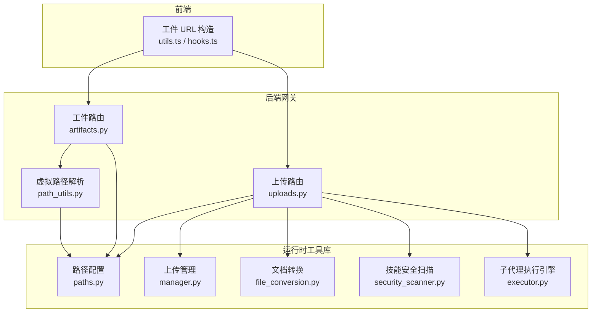
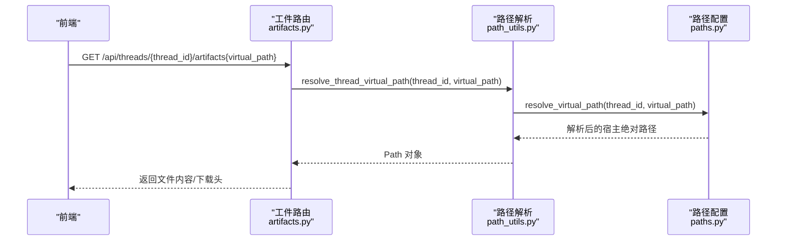
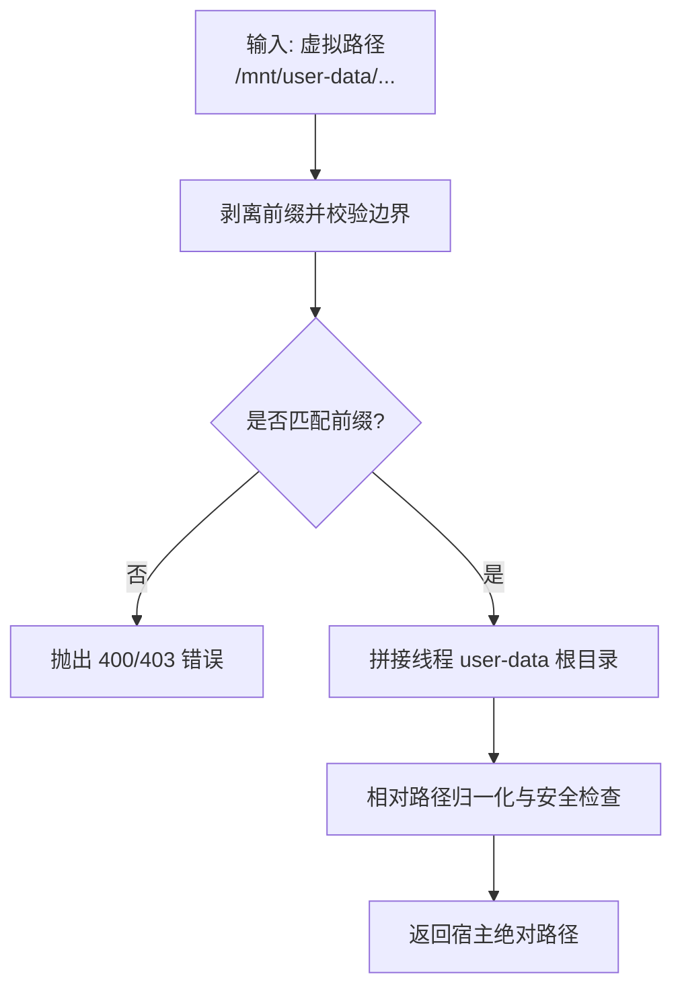
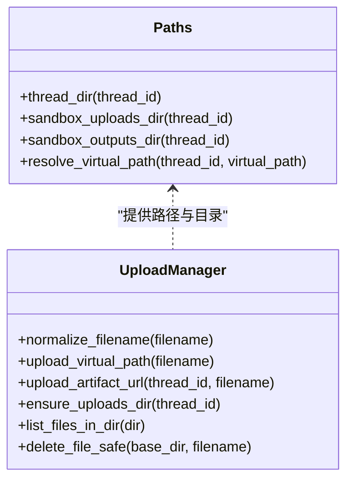
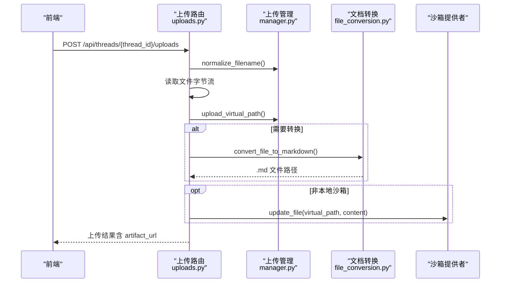
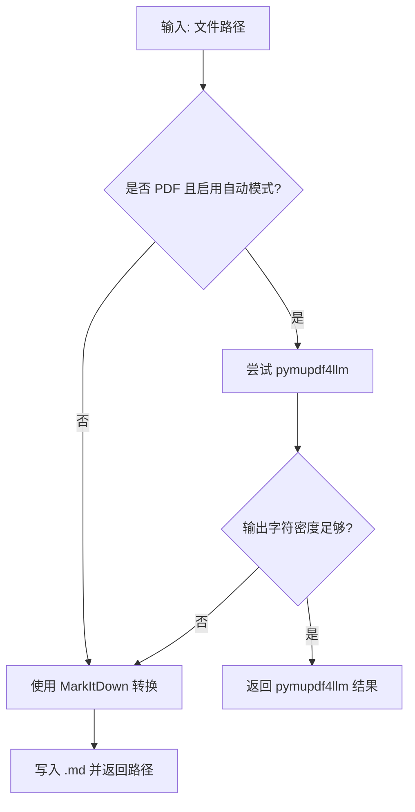
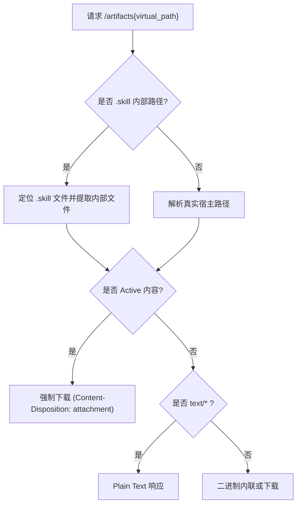
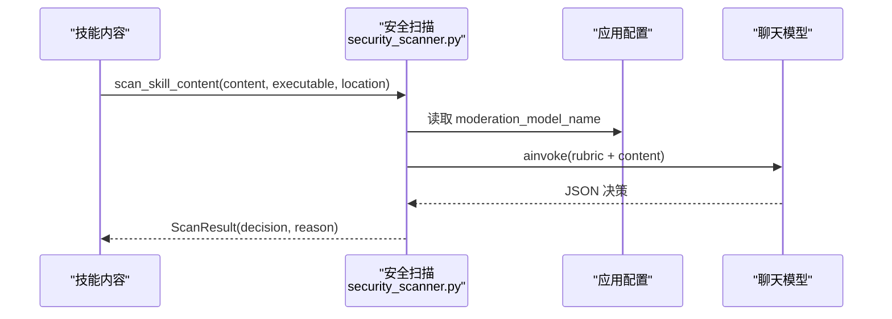
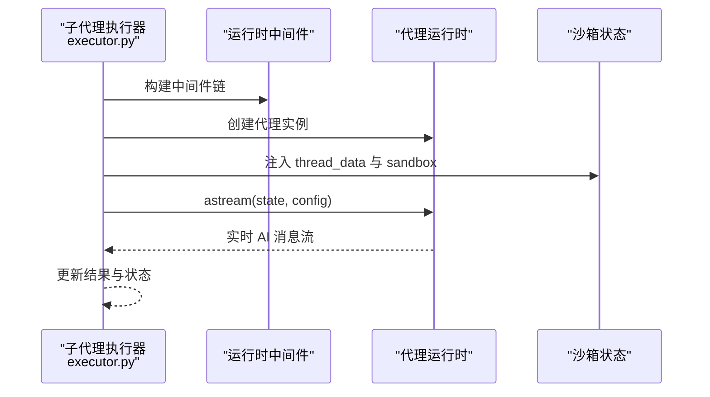
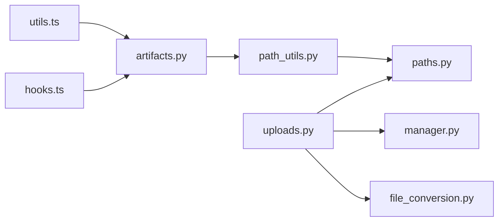

# 文件和工件管理

<cite>
**本文引用的文件**
- [artifacts.py](file://backend/app/gateway/routers/artifacts.py)
- [uploads.py](file://backend/app/gateway/routers/uploads.py)
- [manager.py](file://backend/packages/harness/deerflow/uploads/manager.py)
- [file_conversion.py](file://backend/packages/harness/deerflow/utils/file_conversion.py)
- [path_utils.py](file://backend/app/gateway/path_utils.py)
- [paths.py](file://backend/packages/harness/deerflow/config/paths.py)
- [FILE_UPLOAD.md](file://backend/docs/FILE_UPLOAD.md)
- [GUARDRAILS.md](file://backend/docs/GUARDRAILS.md)
- [security_scanner.py](file://backend/packages/harness/deerflow/skills/security_scanner.py)
- [executor.py](file://backend/packages/harness/deerflow/subagents/executor.py)
- [utils.ts](file://frontend/src/core/artifacts/utils.ts)
- [hooks.ts](file://frontend/src/core/artifacts/hooks.ts)
- [file-validation.ts](file://frontend/src/core/uploads/file-validation.ts)
- [权限控制.md](file://docs/权限控制.md)
</cite>

## 目录
1. [简介](#简介)
2. [项目结构](#项目结构)
3. [核心组件](#核心组件)
4. [架构总览](#架构总览)
5. [详细组件分析](#详细组件分析)
6. [依赖分析](#依赖分析)
7. [性能考虑](#性能考虑)
8. [故障排查指南](#故障排查指南)
9. [结论](#结论)
10. [附录](#附录)

## 简介
本文件面向 DeerFlow 的文件与工件管理系统，围绕以下主题展开：
- 文件系统设计与虚拟路径映射机制
- 工件存储策略、命名规则与访问控制
- 文件上传处理流程（大小限制、格式校验、安全扫描）
- 文档转换系统（格式支持、转换算法、质量保障）
- 文件操作安全机制（权限控制、路径验证、恶意内容过滤）
- 文件管理最佳实践（存储优化、备份策略、清理机制）
- 工件与代理执行的集成方式

## 项目结构
后端采用“网关 + 运行时工具库”的分层设计：
- 网关层负责对外 API（上传、工件访问），并进行路径解析与安全校验
- 运行时工具库提供路径配置、上传管理、文件转换、安全扫描等纯业务能力
- 前端通过统一的工件 URL 访问后端提供的静态内容

**图表来源**
- [artifacts.py:1-182](file://backend/app/gateway/routers/artifacts.py#L1-L182)
- [uploads.py:1-202](file://backend/app/gateway/routers/uploads.py#L1-L202)
- [path_utils.py:1-29](file://backend/app/gateway/path_utils.py#L1-L29)
- [paths.py:1-307](file://backend/packages/harness/deerflow/config/paths.py#L1-L307)
- [manager.py:1-202](file://backend/packages/harness/deerflow/uploads/manager.py#L1-L202)
- [file_conversion.py:1-316](file://backend/packages/harness/deerflow/utils/file_conversion.py#L1-L316)
- [security_scanner.py:1-69](file://backend/packages/harness/deerflow/skills/security_scanner.py#L1-L69)
- [executor.py:1-677](file://backend/packages/harness/deerflow/subagents/executor.py#L1-L677)
- [utils.ts:1-27](file://frontend/src/core/artifacts/utils.ts#L1-L27)
- [hooks.ts:1-43](file://frontend/src/core/artifacts/hooks.ts#L1-L43)

**章节来源**
- [artifacts.py:1-182](file://backend/app/gateway/routers/artifacts.py#L1-L182)
- [uploads.py:1-202](file://backend/app/gateway/routers/uploads.py#L1-L202)
- [paths.py:1-307](file://backend/packages/harness/deerflow/config/paths.py#L1-L307)

## 核心组件
- 虚拟路径与线程隔离：通过统一的虚拟路径前缀与线程目录，实现沙箱内一致的文件视图与宿主侧隔离存储
- 上传管理：提供安全的文件名规范化、路径遍历防护、列表与删除能力
- 文档转换：支持 PDF/PPT/Excel/Word 的 Markdown 转换，具备自动模式与阈值控制
- 工件访问：根据 MIME 类型与内容特征选择内联显示或强制下载，保障 Active 内容安全
- 安全扫描：对技能内容与上传内容进行安全审查，支持可插拔的守卫护栏中间件
- 子代理执行：在受控环境中执行子任务，结合工具过滤与超时控制

**章节来源**
- [paths.py:53-282](file://backend/packages/harness/deerflow/config/paths.py#L53-L282)
- [manager.py:1-202](file://backend/packages/harness/deerflow/uploads/manager.py#L1-L202)
- [file_conversion.py:1-316](file://backend/packages/harness/deerflow/utils/file_conversion.py#L1-L316)
- [artifacts.py:1-182](file://backend/app/gateway/routers/artifacts.py#L1-L182)
- [security_scanner.py:1-69](file://backend/packages/harness/deerflow/skills/security_scanner.py#L1-L69)
- [executor.py:1-677](file://backend/packages/harness/deerflow/subagents/executor.py#L1-L677)

## 架构总览
下图展示从前端到后端的端到端工件访问与上传流程。

**图表来源**
- [artifacts.py:79-182](file://backend/app/gateway/routers/artifacts.py#L79-L182)
- [path_utils.py:10-29](file://backend/app/gateway/path_utils.py#L10-L29)
- [paths.py:248-282](file://backend/packages/harness/deerflow/config/paths.py#L248-L282)

## 详细组件分析

### 文件系统设计与虚拟路径映射
- 虚拟路径前缀：统一为 /mnt/user-data，沙箱内挂载该根目录，便于 Agent 以一致路径访问
- 线程隔离：每个 thread_id 映射到独立的 user-data 目录，包含 workspace、uploads、outputs 三类子目录
- 路径解析：严格要求虚拟路径以 /mnt/user-data 开头，且相对路径仅允许在 user-data 下，防止越界访问
- 宿主路径生成：提供 host_* 方法用于 Docker 绑定挂载，保持 Windows 路径风格

**图表来源**
- [paths.py:248-282](file://backend/packages/harness/deerflow/config/paths.py#L248-L282)

**章节来源**
- [paths.py:53-282](file://backend/packages/harness/deerflow/config/paths.py#L53-L282)

### 工件存储机制
- 存储策略
  - 线程目录优先：先写入线程 uploads/outputs 目录作为权威存储
  - 沙箱同步：非本地沙箱时同步到 /mnt/user-data 下，确保运行时可见
- 命名规则
  - 文件名规范化：去除路径组件、拒绝反斜杠、长度限制、冲突去重
  - 虚拟路径：/mnt/user-data/uploads/{filename}
  - 工件 URL：/api/threads/{thread_id}/artifacts/mnt/user-data/uploads/{filename}
- 访问控制
  - 通过虚拟路径解析与线程隔离实现访问控制
  - Active 内容（HTML/XHTML/SVG）强制下载，避免脚本执行风险

**图表来源**
- [paths.py:137-216](file://backend/packages/harness/deerflow/config/paths.py#L137-L216)
- [manager.py:33-202](file://backend/packages/harness/deerflow/uploads/manager.py#L33-L202)

**章节来源**
- [manager.py:33-202](file://backend/packages/harness/deerflow/uploads/manager.py#L33-L202)
- [FILE_UPLOAD.md:193-213](file://backend/docs/FILE_UPLOAD.md#L193-L213)

### 文件上传处理流程
- 多文件上传：multipart/form-data，支持批量文件
- 安全与合规
  - 文件名规范化与长度限制
  - 路径遍历检测
  - 自动文档转换开关（默认关闭）
- 转换与同步
  - 可选文档转 Markdown（PDF/PPT/Excel/Word）
  - 非本地沙箱时同步到 /mnt/user-data
  - 设置文件可写位以兼容沙箱写入
- 列表与删除：列出当前线程 uploads 目录，删除文件并清理配套 .md

**图表来源**
- [uploads.py:85-165](file://backend/app/gateway/routers/uploads.py#L85-L165)
- [manager.py:178-188](file://backend/packages/harness/deerflow/uploads/manager.py#L178-L188)
- [file_conversion.py:138-167](file://backend/packages/harness/deerflow/utils/file_conversion.py#L138-L167)

**章节来源**
- [uploads.py:85-165](file://backend/app/gateway/routers/uploads.py#L85-L165)
- [manager.py:144-176](file://backend/packages/harness/deerflow/uploads/manager.py#L144-L176)
- [FILE_UPLOAD.md:17-98](file://backend/docs/FILE_UPLOAD.md#L17-L98)

### 文档转换系统
- 支持格式：PDF、PPT、PPTX、XLS、XLSX、DOC、DOCX
- 转换策略
  - 自动模式：优先尝试 pymupdf4llm，若输出稀疏则回退 MarkItDown
  - 大文件（>1MB）使用线程池异步转换，避免阻塞事件循环
  - 提供 outline 提取与标题清洗，支持 SEC 结构化标题识别
- 输出：生成同名 .md 文件，保存在同目录

**图表来源**
- [file_conversion.py:105-136](file://backend/packages/harness/deerflow/utils/file_conversion.py#L105-L136)

**章节来源**
- [file_conversion.py:26-167](file://backend/packages/harness/deerflow/utils/file_conversion.py#L26-L167)

### 工件访问与安全
- MIME 类型与内容特征
  - Active 内容（HTML/XHTML/SVG）强制下载
  - 文本文件优先内联显示，二进制文件默认下载
  - 基于内容采样的文本探测，避免伪装
- .skill 归档支持
  - 支持从 .skill ZIP 中提取内部文件，带缓存头
- 前端 URL 构造
  - 统一的 artifact URL 生成与下载参数

**图表来源**
- [artifacts.py:79-182](file://backend/app/gateway/routers/artifacts.py#L79-L182)

**章节来源**
- [artifacts.py:16-182](file://backend/app/gateway/routers/artifacts.py#L16-L182)
- [utils.ts:4-19](file://frontend/src/core/artifacts/utils.ts#L4-L19)

### 安全机制
- 路径安全
  - 虚拟路径解析严格校验前缀与边界，拒绝越界
  - 上传管理对文件名与路径进行遍历检测
- 内容安全
  - Active 内容强制下载，避免脚本执行
  - 文档转换默认关闭，降低不受信任内容解析风险
- 审查与守卫
  - 技能内容安全扫描：基于 LLM 的分类决策
  - 守卫护栏中间件：在工具调用前进行策略评估（可插拔）

**图表来源**
- [security_scanner.py:38-68](file://backend/packages/harness/deerflow/skills/security_scanner.py#L38-L68)

**章节来源**
- [paths.py:248-282](file://backend/packages/harness/deerflow/config/paths.py#L248-L282)
- [manager.py:99-109](file://backend/packages/harness/deerflow/uploads/manager.py#L99-L109)
- [security_scanner.py:1-69](file://backend/packages/harness/deerflow/skills/security_scanner.py#L1-L69)
- [GUARDRAILS.md:1-386](file://backend/docs/GUARDRAILS.md#L1-L386)

### 与代理执行的集成
- 子代理执行引擎
  - 支持工具过滤（允许/禁止）、超时控制、并发限制
  - 通过线程 ID 获取沙箱状态与线程数据，构建初始状态
  - 支持取消与后台任务管理
- 工件发现与展示
  - 前端自动选择首个工件面板，便于用户浏览
  - 工件 URL 解析与缓存策略，减少重复提取

**图表来源**
- [executor.py:169-325](file://backend/packages/harness/deerflow/subagents/executor.py#L169-L325)

**章节来源**
- [executor.py:128-443](file://backend/packages/harness/deerflow/subagents/executor.py#L128-L443)
- [hooks.ts:28-42](file://frontend/src/core/artifacts/hooks.ts#L28-L42)

## 依赖分析
- 组件耦合
  - artifacts.py 依赖 path_utils.py 与 paths.py，确保路径解析与线程隔离
  - uploads.py 依赖 manager.py、file_conversion.py、paths.py 与沙箱提供者
  - 前端工件工具依赖后端统一的 URL 构造
- 外部依赖
  - 文档转换依赖 markitdown 与可选的 pymupdf4llm
  - 守卫护栏中间件支持内置与自定义提供者

**图表来源**
- [artifacts.py:1-14](file://backend/app/gateway/routers/artifacts.py#L1-L14)
- [uploads.py:1-25](file://backend/app/gateway/routers/uploads.py#L1-L25)
- [paths.py:1-10](file://backend/packages/harness/deerflow/config/paths.py#L1-L10)
- [manager.py:1-12](file://backend/packages/harness/deerflow/uploads/manager.py#L1-L12)
- [file_conversion.py:1-24](file://backend/packages/harness/deerflow/utils/file_conversion.py#L1-L24)
- [utils.ts:1-19](file://frontend/src/core/artifacts/utils.ts#L1-L19)
- [hooks.ts:1-7](file://frontend/src/core/artifacts/hooks.ts#L1-L7)

**章节来源**
- [artifacts.py:1-14](file://backend/app/gateway/routers/artifacts.py#L1-L14)
- [uploads.py:1-25](file://backend/app/gateway/routers/uploads.py#L1-L25)
- [paths.py:1-10](file://backend/packages/harness/deerflow/config/paths.py#L1-L10)
- [manager.py:1-12](file://backend/packages/harness/deerflow/uploads/manager.py#L1-L12)
- [file_conversion.py:1-24](file://backend/packages/harness/deerflow/utils/file_conversion.py#L1-L24)
- [utils.ts:1-19](file://frontend/src/core/artifacts/utils.ts#L1-L19)
- [hooks.ts:1-7](file://frontend/src/core/artifacts/hooks.ts#L1-L7)

## 性能考虑
- 文档转换
  - 大文件（>1MB）使用线程池异步转换，避免阻塞事件循环
  - PDF 转换采用两阶段策略，减少无效解析
- 工件访问
  - .skill 内部文件提取增加缓存头，降低重复 ZIP 解压开销
  - 文本探测与 MIME 类型判断减少不必要的 I/O
- 上传同步
  - 非本地沙箱时设置文件可写位，避免权限不一致导致的重试与失败

[本节为通用指导，无需特定文件来源]

## 故障排查指南
- 文件上传失败
  - 检查文件大小是否超过 Nginx 限制
  - 确认 Gateway 日志与磁盘空间
  - 核对 uploads.auto_convert_documents 配置
- 文档转换失败
  - 确认 markitdown 安装与可用性
  - 某些损坏/加密文档可能无法转换，但原文件仍会保存
- 工件无法访问
  - 校验虚拟路径前缀与线程隔离
  - Active 内容强制下载，检查 download 参数
- 守卫护栏不生效
  - 确认配置项 guardrails.enabled 与 provider 设置
  - 检查中间件链顺序与异常处理策略

**章节来源**
- [FILE_UPLOAD.md:235-297](file://backend/docs/FILE_UPLOAD.md#L235-L297)
- [GUARDRAILS.md:353-386](file://backend/docs/GUARDRAILS.md#L353-L386)

## 结论
DeerFlow 的文件与工件管理通过“虚拟路径 + 线程隔离 + 安全扫描 + 可插拔守卫护栏”的组合，实现了安全、可控、可扩展的文件生命周期管理。上传与转换流程兼顾性能与可靠性，工件访问在保证安全的前提下提供灵活的展示策略。配合子代理执行引擎，系统能够稳定支撑复杂代理任务中的文件与工件协同。

[本节为总结性内容，无需特定文件来源]

## 附录
- 前端文件上传校验
  - macOS .app 包上传拦截提示，避免浏览器直接上传打包应用
- 权限控制参考
  - RBAC + ABAC 的策略模型与示例策略，可用于企业级授权

**章节来源**
- [file-validation.ts:1-34](file://frontend/src/core/uploads/file-validation.ts#L1-L34)
- [权限控制.md:1-461](file://docs/权限控制.md#L1-L461)