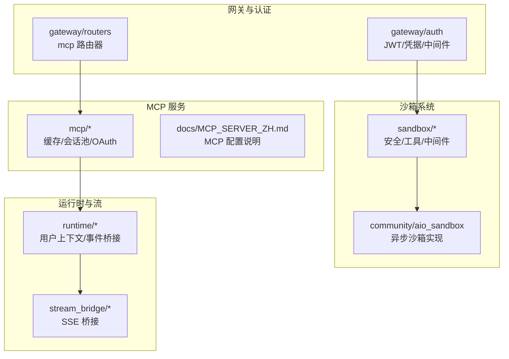
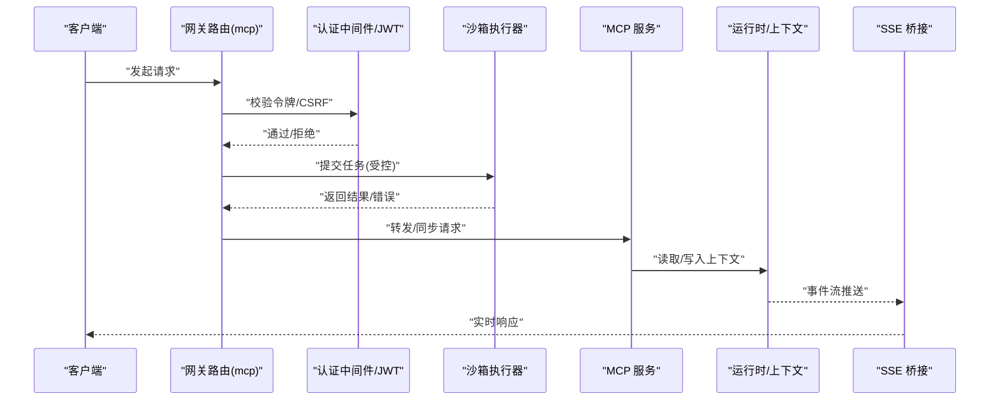
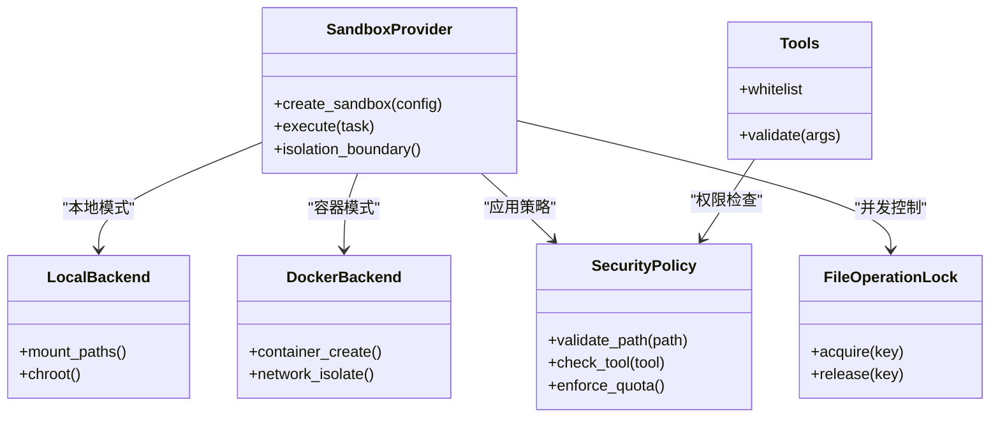
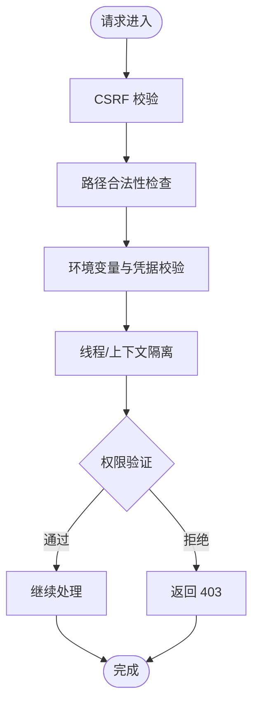
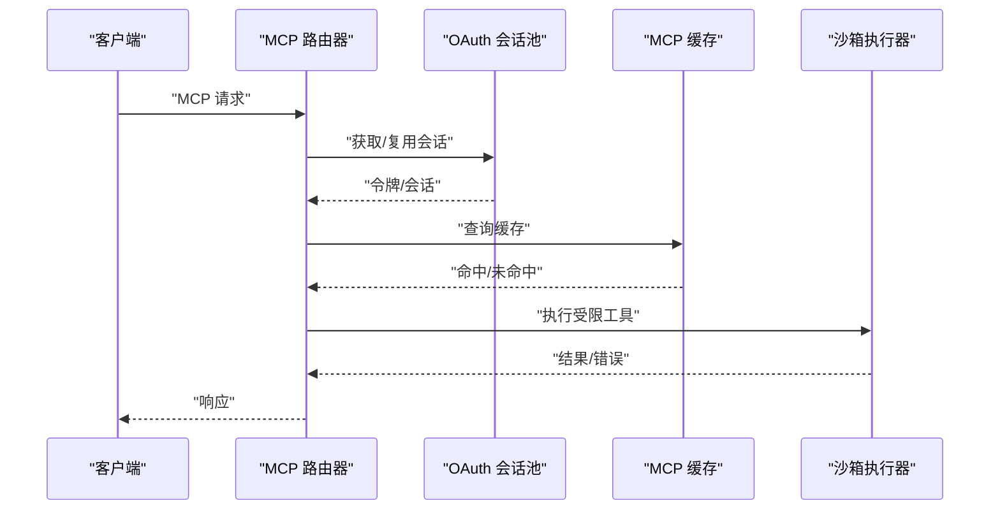
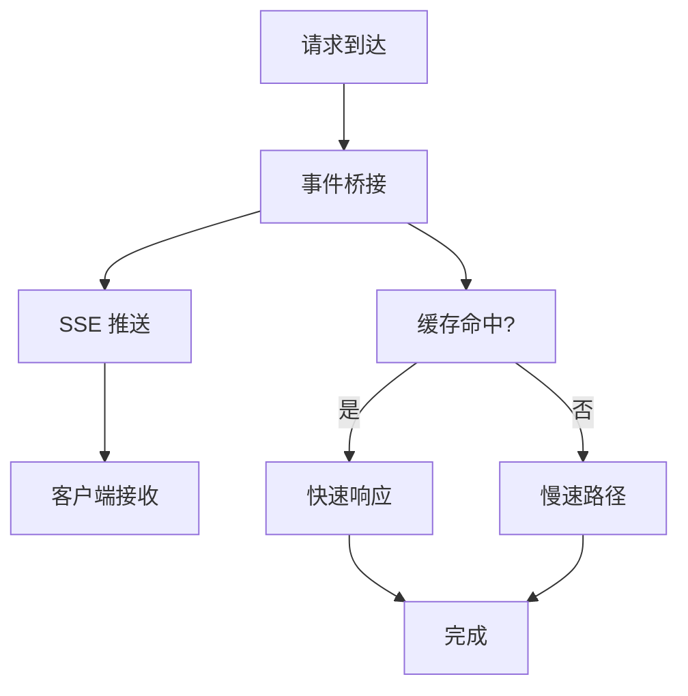
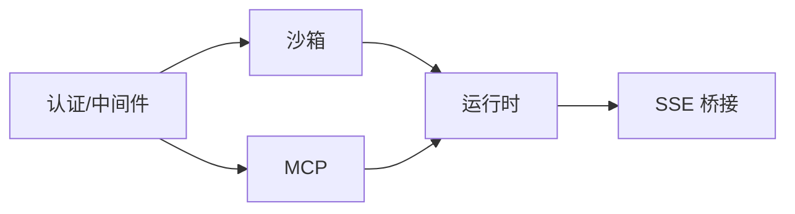

# 安全与性能

<cite>
**本文引用的文件**
- [sandbox_config.py](file://backend/packages/harness/deerflow/config/sandbox_config.py)
- [security.py](file://backend/packages/harness/deerflow/sandbox/security.py)
- [file_operation_lock.py](file://backend/packages/harness/deerflow/sandbox/file_operation_lock.py)
- [sandbox.py](file://backend/packages/harness/deerflow/sandbox/sandbox.py)
- [sandbox_provider.py](file://backend/packages/harness/deerflow/sandbox/sandbox_provider.py)
- [middleware.py](file://backend/packages/harness/deerflow/sandbox/middleware.py)
- [tools.py](file://backend/packages/harness/deerflow/sandbox/tools.py)
- [aio_sandbox.py](file://backend/packages/harness/deerflow/community/aio_sandbox/aio_sandbox.py)
- [aio_sandbox_local_backend.py](file://backend/packages/harness/deerflow/community/aio_sandbox/aio_sandbox_local_backend.py)
- [aio_sandbox_provider.py](file://backend/packages/harness/deerflow/community/aio_sandbox/aio_sandbox_provider.py)
- [jwt.py](file://backend/app/gateway/auth/jwt.py)
- [credential_file.py](file://backend/app/gateway/auth/credential_file.py)
- [providers.py](file://backend/app/gateway/auth/providers.py)
- [models.py](file://backend/app/gateway/auth/models.py)
- [auth_middleware.py](file://backend/app/gateway/auth_middleware.py)
- [csrf_middleware.py](file://backend/app/gateway/csrf_middleware.py)
- [path_utils.py](file://backend/app/gateway/path_utils.py)
- [mcp.py](file://backend/app/gateway/routers/mcp.py)
- [mcp_server.py](file://backend/docs/MCP_SERVER_ZH.md)
- [streaming.md](file://backend/docs/STREAMING.md)
- [cache.py](file://backend/packages/harness/deerflow/mcp/cache.py)
- [session_pool.py](file://backend/packages/harness/deerflow/mcp/session_pool.py)
- [oauth.py](file://backend/packages/harness/deerflow/mcp/oauth.py)
- [user_context.py](file://backend/packages/harness/deerflow/runtime/user_context.py)
- [stream_bridge_config.py](file://backend/packages/harness/deerflow/config/stream_bridge_config.py)
- [stream_bridge.py](file://backend/packages/harness/deerflow/runtime/stream_bridge/stream_bridge.py)
- [blocking_io_detection.md](file://backend/docs/BLOCKING_IO_DETECTION.md)
- [SANDBOX_MEMORY_PROFILING.md](file://backend/docs/SANDBOX_MEMORY_PROFILING.md)
</cite>

## 目录
1. [引言](#引言)
2. [项目结构](#项目结构)
3. [核心组件](#核心组件)
4. [架构总览](#架构总览)
5. [详细组件分析](#详细组件分析)
6. [依赖关系分析](#依赖关系分析)
7. [性能考量](#性能考量)
8. [故障排查指南](#故障排查指南)
9. [结论](#结论)
10. [附录](#附录)

## 引言
本技术文档聚焦于 DeerFlow 的安全与性能设计，围绕以下主题展开：沙箱隔离机制（本地沙箱与 Docker 沙箱）、API 安全措施（线程隔离、文件验证、环境变量管理）、MCP 服务器安全配置与进程隔离、以及性能优化策略（缓存、SSE 实时流传输、上下文管理）。文档旨在帮助开发者与运维人员在保障系统安全的前提下，实现稳定高效的运行。

## 项目结构
后端采用 Python/FastAPI 构建，核心安全与性能相关模块集中在以下路径：
- 安全沙箱：backend/packages/harness/deerflow/sandbox 及 community/aio_sandbox
- 网关与认证：backend/app/gateway 下的 auth、routers、middleware
- MCP 服务：backend/packages/harness/deerflow/mcp 与 backend/docs/MCP_SERVER_ZH.md
- 运行时与流桥接：backend/packages/harness/deerflow/runtime 与 stream_bridge
- 文档与策略：backend/docs 下的安全与性能相关文档

**图表来源**
- [sandbox.py](file://backend/packages/harness/deerflow/sandbox/sandbox.py)
- [aio_sandbox.py](file://backend/packages/harness/deerflow/community/aio_sandbox/aio_sandbox.py)
- [mcp.py](file://backend/app/gateway/routers/mcp.py)
- [cache.py](file://backend/packages/harness/deerflow/mcp/cache.py)
- [user_context.py](file://backend/packages/harness/deerflow/runtime/user_context.py)
- [stream_bridge.py](file://backend/packages/harness/deerflow/runtime/stream_bridge/stream_bridge.py)

**章节来源**
- [sandbox_config.py](file://backend/packages/harness/deerflow/config/sandbox_config.py)
- [sandbox.py](file://backend/packages/harness/deerflow/sandbox/sandbox.py)
- [aio_sandbox.py](file://backend/packages/harness/deerflow/community/aio_sandbox/aio_sandbox.py)

## 核心组件
- 沙箱安全与隔离：通过安全边界定义、路径遍历防护、文件操作锁与工具白名单实现。
- API 安全：JWT 认证、凭据管理、CSRF 中间件、路径工具与权限模型。
- MCP 服务器：OAuth 会话池、缓存与安全配置，结合进程隔离与资源限制。
- 性能优化：SSE 实时流桥接、用户上下文管理、阻塞 I/O 检测与内存剖析。

**章节来源**
- [security.py](file://backend/packages/harness/deerflow/sandbox/security.py)
- [file_operation_lock.py](file://backend/packages/harness/deerflow/sandbox/file_operation_lock.py)
- [tools.py](file://backend/packages/harness/deerflow/sandbox/tools.py)
- [jwt.py](file://backend/app/gateway/auth/jwt.py)
- [credential_file.py](file://backend/app/gateway/auth/credential_file.py)
- [csrf_middleware.py](file://backend/app/gateway/csrf_middleware.py)
- [path_utils.py](file://backend/app/gateway/path_utils.py)
- [mcp.py](file://backend/app/gateway/routers/mcp.py)
- [cache.py](file://backend/packages/harness/deerflow/mcp/cache.py)
- [session_pool.py](file://backend/packages/harness/deerflow/mcp/session_pool.py)
- [oauth.py](file://backend/packages/harness/deerflow/mcp/oauth.py)
- [user_context.py](file://backend/packages/harness/deerflow/runtime/user_context.py)
- [stream_bridge.py](file://backend/packages/harness/deerflow/runtime/stream_bridge/stream_bridge.py)

## 架构总览
下图展示了从网关到沙箱、MCP 与运行时的整体交互，强调安全边界与数据流：

**图表来源**
- [mcp.py](file://backend/app/gateway/routers/mcp.py)
- [auth_middleware.py](file://backend/app/gateway/auth_middleware.py)
- [jwt.py](file://backend/app/gateway/auth/jwt.py)
- [sandbox.py](file://backend/packages/harness/deerflow/sandbox/sandbox.py)
- [user_context.py](file://backend/packages/harness/deerflow/runtime/user_context.py)
- [stream_bridge.py](file://backend/packages/harness/deerflow/runtime/stream_bridge/stream_bridge.py)

## 详细组件分析

### 沙箱隔离机制
- 安全边界与路径遍历防护
  - 通过安全策略与路径工具限制访问范围，防止越权路径解析。
  - 文件操作锁确保并发场景下的原子性与一致性。
- 本地沙箱与 Docker 沙箱
  - 提供统一接口与能力抽象，支持按需切换与回退。
  - 异步沙箱实现降低阻塞风险，提升吞吐。
- 工具与权限
  - 工具白名单与权限扫描，避免高危命令与路径操作。
  - 中间件审计记录，便于追踪与溯源。

**图表来源**
- [sandbox_provider.py](file://backend/packages/harness/deerflow/sandbox/sandbox_provider.py)
- [sandbox.py](file://backend/packages/harness/deerflow/sandbox/sandbox.py)
- [security.py](file://backend/packages/harness/deerflow/sandbox/security.py)
- [file_operation_lock.py](file://backend/packages/harness/deerflow/sandbox/file_operation_lock.py)
- [tools.py](file://backend/packages/harness/deerflow/sandbox/tools.py)
- [aio_sandbox_local_backend.py](file://backend/packages/harness/deerflow/community/aio_sandbox/aio_sandbox_local_backend.py)
- [aio_sandbox_provider.py](file://backend/packages/harness/deerflow/community/aio_sandbox/aio_sandbox_provider.py)

**章节来源**
- [sandbox_config.py](file://backend/packages/harness/deerflow/config/sandbox_config.py)
- [security.py](file://backend/packages/harness/deerflow/sandbox/security.py)
- [file_operation_lock.py](file://backend/packages/harness/deerflow/sandbox/file_operation_lock.py)
- [tools.py](file://backend/packages/harness/deerflow/sandbox/tools.py)
- [middleware.py](file://backend/packages/harness/deerflow/sandbox/middleware.py)
- [aio_sandbox.py](file://backend/packages/harness/deerflow/community/aio_sandbox/aio_sandbox.py)
- [aio_sandbox_local_backend.py](file://backend/packages/harness/deerflow/community/aio_sandbox/aio_sandbox_local_backend.py)
- [aio_sandbox_provider.py](file://backend/packages/harness/deerflow/community/aio_sandbox/aio_sandbox_provider.py)

### API 安全措施
- 线程隔离与 CSRF 防护
  - 中间件链路中集成 CSRF 校验，减少跨站请求风险。
  - 用户上下文隔离，避免共享状态引发的竞态问题。
- 文件验证与环境变量管理
  - 路径工具对上传与存储路径进行严格校验，防止目录穿越。
  - 凭据文件与认证提供者集中管理敏感信息，最小化暴露面。
- JWT 与权限模型
  - 基于 JWT 的无状态认证，配合权限模型实现细粒度授权。

**图表来源**
- [csrf_middleware.py](file://backend/app/gateway/csrf_middleware.py)
- [path_utils.py](file://backend/app/gateway/path_utils.py)
- [credential_file.py](file://backend/app/gateway/auth/credential_file.py)
- [jwt.py](file://backend/app/gateway/auth/jwt.py)
- [models.py](file://backend/app/gateway/auth/models.py)
- [user_context.py](file://backend/packages/harness/deerflow/runtime/user_context.py)

**章节来源**
- [csrf_middleware.py](file://backend/app/gateway/csrf_middleware.py)
- [path_utils.py](file://backend/app/gateway/path_utils.py)
- [credential_file.py](file://backend/app/gateway/auth/credential_file.py)
- [jwt.py](file://backend/app/gateway/auth/jwt.py)
- [models.py](file://backend/app/gateway/auth/models.py)
- [user_context.py](file://backend/packages/harness/deerflow/runtime/user_context.py)

### MCP 服务器安全配置与进程隔离
- OAuth 会话池与缓存
  - 通过会话池复用连接，降低延迟；缓存减少重复请求。
- 安全配置与进程隔离
  - 服务器配置文档明确了访问控制、超时与资源限制参数。
  - 结合沙箱的进程隔离能力，确保外部工具调用不越界。

**图表来源**
- [mcp.py](file://backend/app/gateway/routers/mcp.py)
- [oauth.py](file://backend/packages/harness/deerflow/mcp/oauth.py)
- [session_pool.py](file://backend/packages/harness/deerflow/mcp/session_pool.py)
- [cache.py](file://backend/packages/harness/deerflow/mcp/cache.py)
- [mcp_server.py](file://backend/docs/MCP_SERVER_ZH.md)

**章节来源**
- [mcp.py](file://backend/app/gateway/routers/mcp.py)
- [oauth.py](file://backend/packages/harness/deerflow/mcp/oauth.py)
- [session_pool.py](file://backend/packages/harness/deerflow/mcp/session_pool.py)
- [cache.py](file://backend/packages/harness/deerflow/mcp/cache.py)
- [mcp_server.py](file://backend/docs/MCP_SERVER_ZH.md)

### 性能优化策略
- 缓存机制
  - MCP 缓存与会话池降低外部服务调用开销，提升响应速度。
- SSE 实时流传输
  - 运行时事件桥接与 SSE 桥接实现低延迟实时反馈。
- 上下文管理
  - 用户上下文隔离与生命周期管理，避免资源泄漏与状态污染。
- 阻塞 I/O 检测与内存剖析
  - 提供检测脚本与剖析文档，定位性能瓶颈并指导优化。

**图表来源**
- [stream_bridge.py](file://backend/packages/harness/deerflow/runtime/stream_bridge/stream_bridge.py)
- [stream_bridge_config.py](file://backend/packages/harness/deerflow/config/stream_bridge_config.py)
- [cache.py](file://backend/packages/harness/deerflow/mcp/cache.py)
- [streaming.md](file://backend/docs/STREAMING.md)

**章节来源**
- [cache.py](file://backend/packages/harness/deerflow/mcp/cache.py)
- [session_pool.py](file://backend/packages/harness/deerflow/mcp/session_pool.py)
- [user_context.py](file://backend/packages/harness/deerflow/runtime/user_context.py)
- [stream_bridge.py](file://backend/packages/harness/deerflow/runtime/stream_bridge/stream_bridge.py)
- [stream_bridge_config.py](file://backend/packages/harness/deerflow/config/stream_bridge_config.py)
- [streaming.md](file://backend/docs/STREAMING.md)
- [blocking_io_detection.md](file://backend/docs/BLOCKING_IO_DETECTION.md)
- [SANDBOX_MEMORY_PROFILING.md](file://backend/docs/SANDBOX_MEMORY_PROFILING.md)

## 依赖关系分析
- 组件耦合与内聚
  - 沙箱模块与 MCP、运行时松耦合，通过清晰接口交互。
  - 认证与中间件形成横切关注点，贯穿请求链路。
- 外部依赖与集成点
  - 外部 MCP 服务通过 OAuth 与会话池对接，具备可替换性。
  - 沙箱后端可切换至 Docker，满足不同隔离需求。

**图表来源**
- [auth_middleware.py](file://backend/app/gateway/auth_middleware.py)
- [sandbox.py](file://backend/packages/harness/deerflow/sandbox/sandbox.py)
- [mcp.py](file://backend/app/gateway/routers/mcp.py)
- [user_context.py](file://backend/packages/harness/deerflow/runtime/user_context.py)
- [stream_bridge.py](file://backend/packages/harness/deerflow/runtime/stream_bridge/stream_bridge.py)

**章节来源**
- [auth_middleware.py](file://backend/app/gateway/auth_middleware.py)
- [sandbox.py](file://backend/packages/harness/deerflow/sandbox/sandbox.py)
- [mcp.py](file://backend/app/gateway/routers/mcp.py)
- [user_context.py](file://backend/packages/harness/deerflow/runtime/user_context.py)
- [stream_bridge.py](file://backend/packages/harness/deerflow/runtime/stream_bridge/stream_bridge.py)

## 性能考量
- 缓存优先级与失效策略：根据业务热点选择合适的 TTL 与淘汰策略，避免缓存穿透与雪崩。
- SSE 与背压：合理设置事件队列长度与推送频率，防止客户端拥塞。
- 上下文生命周期：缩短无效上下文存在时间，定期清理临时状态。
- 阻塞 I/O 识别：使用检测脚本识别阻塞点，必要时引入异步或并行化。
- 内存剖析：结合沙箱内存剖析文档，定位异常增长与泄漏点。

[本节为通用性能建议，无需特定文件引用]

## 故障排查指南
- 沙箱执行失败
  - 检查安全策略与路径校验日志，确认是否触发越权或禁用工具。
  - 查看文件操作锁冲突与并发竞争情况。
- MCP 响应异常
  - 核对 OAuth 会话池状态与缓存命中率，排查外部服务波动。
- SSE 推送中断
  - 检查事件桥接队列与客户端断连处理，确认心跳与重连机制。
- 认证与 CSRF 问题
  - 核对 JWT 令牌签名与过期时间，确认 CSRF Token 生成与携带。

**章节来源**
- [security.py](file://backend/packages/harness/deerflow/sandbox/security.py)
- [file_operation_lock.py](file://backend/packages/harness/deerflow/sandbox/file_operation_lock.py)
- [oauth.py](file://backend/packages/harness/deerflow/mcp/oauth.py)
- [session_pool.py](file://backend/packages/harness/deerflow/mcp/session_pool.py)
- [stream_bridge.py](file://backend/packages/harness/deerflow/runtime/stream_bridge/stream_bridge.py)
- [auth_middleware.py](file://backend/app/gateway/auth_middleware.py)
- [csrf_middleware.py](file://backend/app/gateway/csrf_middleware.py)

## 结论
DeerFlow 在安全与性能方面形成了以“沙箱隔离+API 安全+MCP 服务+运行时优化”为核心的体系：通过严格的路径与工具管控、JWT/CSRF 与上下文隔离保障 API 安全；借助 MCP 缓存与会话池、SSE 桥接与阻塞 I/O 检测实现高效稳定的运行体验。建议在生产环境中结合配置文档与剖析工具持续优化，确保安全边界清晰、性能指标可控。

[本节为总结性内容，无需特定文件引用]

## 附录
- 安全最佳实践
  - 最小权限原则：仅授予必需工具与路径访问。
  - 多层防护：路径校验、工具白名单、文件锁与中间件审计。
  - 凭据管理：集中存储、轮换与最小暴露。
- 性能调优建议
  - 合理设置缓存 TTL 与失效策略，监控命中率。
  - 使用异步沙箱与 SSE 降低等待时间。
  - 定期进行阻塞 I/O 检测与内存剖析，及时发现并修复瓶颈。

[本节为通用建议，无需特定文件引用]