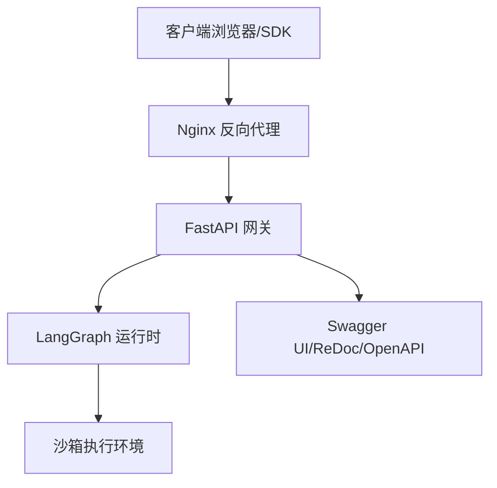
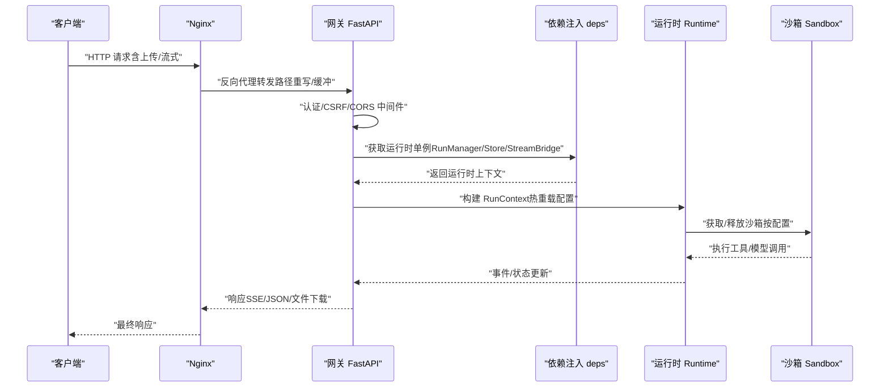
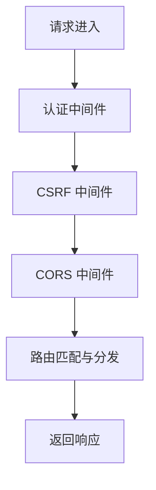
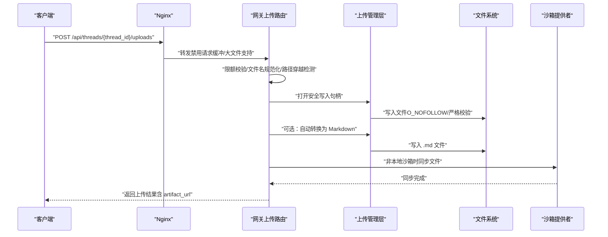
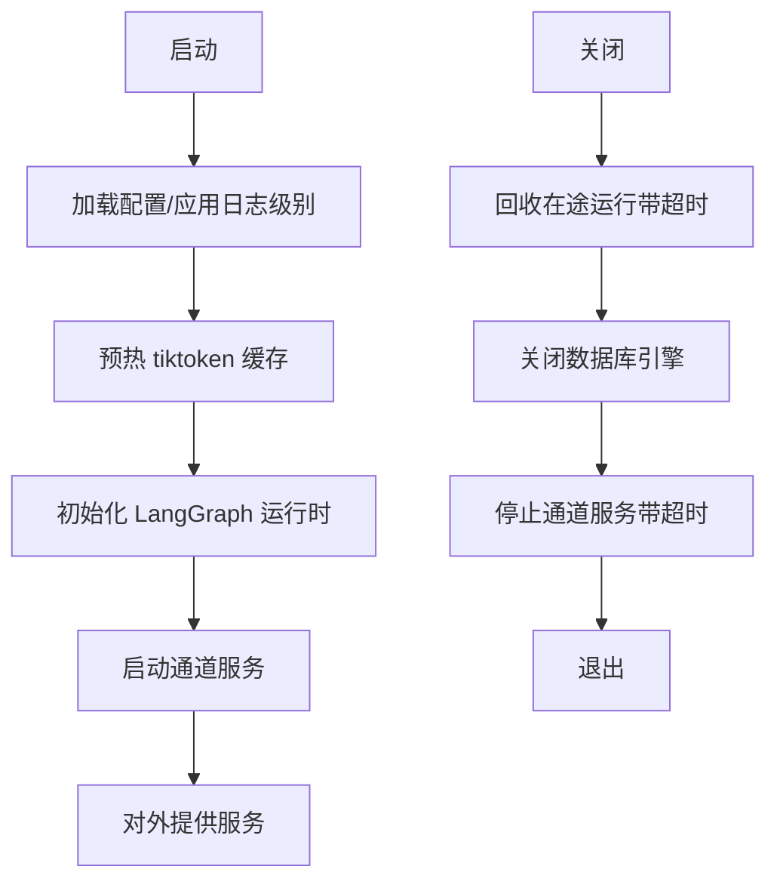
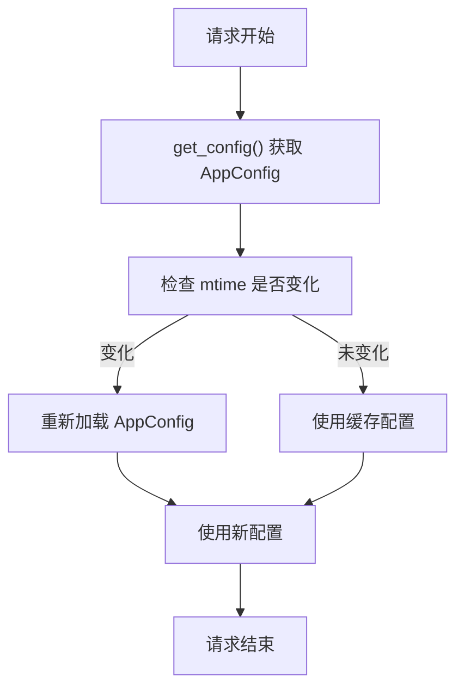
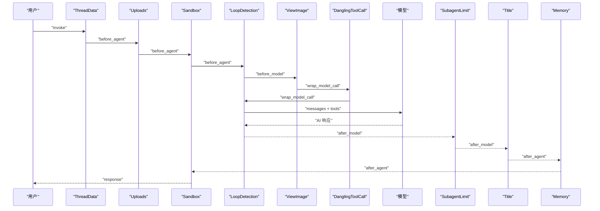
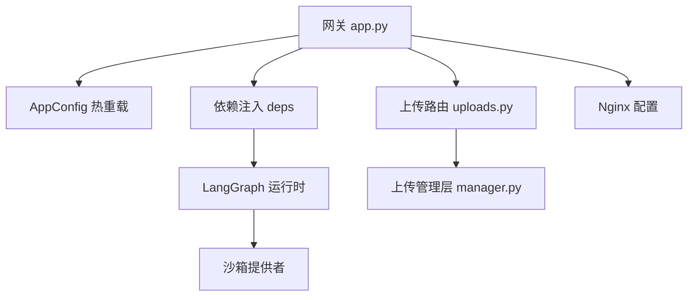

# 数据流

<cite>
**本文引用的文件**
- [backend/app/gateway/app.py](file://backend/app/gateway/app.py)
- [backend/app/gateway/routers/uploads.py](file://backend/app/gateway/routers/uploads.py)
- [backend/packages/harness/deerflow/uploads/manager.py](file://backend/packages/harness/deerflow/uploads/manager.py)
- [docker/nginx/nginx.conf](file://docker/nginx/nginx.conf)
- [backend/docs/FILE_UPLOAD.md](file://backend/docs/FILE_UPLOAD.md)
- [backend/docs/middleware-execution-flow.md](file://backend/docs/middleware-execution-flow.md)
- [backend/packages/harness/deerflow/runtime/__init__.py](file://backend/packages/harness/deerflow/runtime/__init__.py)
- [backend/packages/harness/deerflow/config/app_config.py](file://backend/packages/harness/deerflow/config/app_config.py)
- [backend/app/gateway/deps.py](file://backend/app/gateway/deps.py)
- [backend/docs/CONFIGURATION.md](file://backend/docs/CONFIGURATION.md)
- [backend/app/gateway/auth/errors.py](file://backend/app/gateway/auth/errors.py)
- [backend/packages/harness/deerflow/guardrails/middleware.py](file://backend/packages/harness/deerflow/guardrails/middleware.py)
</cite>

## 目录
1. [简介](#简介)
2. [项目结构](#项目结构)
3. [核心组件](#核心组件)
4. [架构总览](#架构总览)
5. [详细组件分析](#详细组件分析)
6. [依赖分析](#依赖分析)
7. [性能考虑](#性能考虑)
8. [故障排查指南](#故障排查指南)
9. [结论](#结论)
10. [附录](#附录)

## 简介
本技术文档围绕 DeerFlow 数据流展开，系统性阐述从客户端到 Nginx 反向代理、再到网关 API 与嵌入式代理运行时的完整请求处理路径。重点覆盖以下主题：
- 请求处理流程：客户端 → Nginx → 网关 API → 运行时（LangGraph）→ 沙箱执行
- 文件上传处理流程：安全校验、限额控制、权限与路径隔离、自动文档转换、沙箱同步
- 线程清理与运行时生命周期：启动/关闭钩子、运行任务回收、通道服务停止
- 配置热重载边界与实现：AppConfig 的 mtime 监控、字段热重载范围、启动时单例冻结
- 数据在各组件间的传递方式、格式转换与验证机制
- 错误处理策略与异常场景处置

## 项目结构
DeerFlow 后端采用“网关 + 运行时 + 代理”的分层架构：
- 网关层（FastAPI）：统一入口、认证/授权、CORS/CSRF、路由挂载
- 运行时层（LangGraph）：运行生命周期管理、事件桥接、检查点、状态持久
- 代理层（Nginx）：反向代理、路径重写、长连接/流式支持、上传缓冲与超时
- 客户端（前端）：通过统一入口访问 API 与文档

图表来源
- [docker/nginx/nginx.conf:21-241](file://docker/nginx/nginx.conf#L21-L241)
- [backend/app/gateway/app.py:241-413](file://backend/app/gateway/app.py#L241-L413)

章节来源
- [docker/nginx/nginx.conf:21-241](file://docker/nginx/nginx.conf#L21-L241)
- [backend/app/gateway/app.py:241-413](file://backend/app/gateway/app.py#L241-L413)

## 核心组件
- 网关应用与生命周期
  - 应用创建、中间件注册（认证、CSRF、CORS）、路由挂载、健康检查
  - 生命周期钩子：启动阶段加载配置、预热缓存、初始化运行时、启动通道服务；关闭阶段回收运行、停止通道服务
- 运行时与依赖注入
  - LangGraph 运行时引擎（事件存储、检查点、运行管理器、流桥接）通过上下文管理器在生命周期内创建与销毁
  - 依赖获取器（deps）提供运行期单例访问，区分“热重载字段”与“启动时单例”
- 文件上传子系统
  - 路由层：多文件上传、限额校验、自动转换、沙箱同步
  - 管理层：路径安全校验、文件名规范化、唯一性冲突处理、删除与配套 Markdown 清理
- 配置系统
  - AppConfig：YAML 解析、环境变量替换、版本校验、热重载边界、运行时上下文切换
- 中间件执行流
  - 运行时中间件链：before/after 钩子、wrap_model_call、wrap_tool_call 的洋葱式管线
- 安全与错误
  - 认证错误码与结构化响应
  - Guardrail 中间件：工具调用前置审核，fail-closed/fail-open 控制

章节来源
- [backend/app/gateway/app.py:161-240](file://backend/app/gateway/app.py#L161-L240)
- [backend/app/gateway/deps.py:144-237](file://backend/app/gateway/deps.py#L144-L237)
- [backend/packages/harness/deerflow/config/app_config.py:439-484](file://backend/packages/harness/deerflow/config/app_config.py#L439-L484)
- [backend/docs/middleware-execution-flow.md:26-162](file://backend/docs/middleware-execution-flow.md#L26-L162)
- [backend/app/gateway/auth/errors.py:13-46](file://backend/app/gateway/auth/errors.py#L13-L46)
- [backend/packages/harness/deerflow/guardrails/middleware.py:20-99](file://backend/packages/harness/deerflow/guardrails/middleware.py#L20-L99)

## 架构总览
下图展示从客户端到运行时的关键交互路径与职责划分。

图表来源
- [docker/nginx/nginx.conf:42-65](file://docker/nginx/nginx.conf#L42-L65)
- [backend/app/gateway/app.py:334-352](file://backend/app/gateway/app.py#L334-L352)
- [backend/app/gateway/deps.py:278-296](file://backend/app/gateway/deps.py#L278-L296)
- [backend/packages/harness/deerflow/runtime/__init__.py:8-13](file://backend/packages/harness/deerflow/runtime/__init__.py#L8-L13)

章节来源
- [docker/nginx/nginx.conf:42-65](file://docker/nginx/nginx.conf#L42-L65)
- [backend/app/gateway/app.py:334-352](file://backend/app/gateway/app.py#L334-L352)
- [backend/app/gateway/deps.py:278-296](file://backend/app/gateway/deps.py#L278-L296)
- [backend/packages/harness/deerflow/runtime/__init__.py:8-13](file://backend/packages/harness/deerflow/runtime/__init__.py#L8-L13)

## 详细组件分析

### 组件一：请求处理与路由
- 中间件链
  - 认证中间件：拒绝未认证的非公开路径
  - CSRF 中间件：双提交 Cookie 保护
  - CORS 中间门：与网关允许源保持一致
- 路由挂载
  - 模型、MCP、内存、技能、制品、上传、线程、代理、建议、渠道、兼容助手、认证、反馈、线程运行、无状态运行等
- 健康检查
  - /health 返回健康状态

图表来源
- [backend/app/gateway/app.py:334-352](file://backend/app/gateway/app.py#L334-L352)
- [backend/app/gateway/app.py:353-398](file://backend/app/gateway/app.py#L353-L398)

章节来源
- [backend/app/gateway/app.py:334-398](file://backend/app/gateway/app.py#L334-L398)

### 组件二：文件上传处理流程
- 客户端上传
  - multipart/form-data，支持多文件
  - 网关侧默认限制：最多 10 个文件、单文件 50 MiB、总 100 MiB
- 安全校验
  - 文件名规范化与路径穿越检测
  - 写入前禁止符号链接目标，确保不覆盖外部路径
- 存储与权限
  - 线程隔离目录：backend/.deer-flow/threads/{thread_id}/user-data/uploads/
  - 为沙箱可读性添加组/其他读权限；在 AIO 沙箱模式下为可写性临时放宽
- 自动转换
  - 可选启用 uploads.auto_convert_documents，将 PDF/PPT/Excel/Word 转换为 Markdown
- 沙箱同步
  - 非本地沙箱时，将文件同步至 /mnt/user-data/uploads/*，保证运行时可见
- 列表与删除
  - 列表返回文件元数据与 artifact_url
  - 删除时清理配套 Markdown

图表来源
- [backend/app/gateway/routers/uploads.py:213-346](file://backend/app/gateway/routers/uploads.py#L213-L346)
- [backend/packages/harness/deerflow/uploads/manager.py:118-217](file://backend/packages/harness/deerflow/uploads/manager.py#L118-L217)
- [docker/nginx/nginx.conf:122-136](file://docker/nginx/nginx.conf#L122-L136)

章节来源
- [backend/app/gateway/routers/uploads.py:213-346](file://backend/app/gateway/routers/uploads.py#L213-L346)
- [backend/packages/harness/deerflow/uploads/manager.py:118-217](file://backend/packages/harness/deerflow/uploads/manager.py#L118-L217)
- [backend/docs/FILE_UPLOAD.md:17-103](file://backend/docs/FILE_UPLOAD.md#L17-L103)
- [docker/nginx/nginx.conf:122-136](file://docker/nginx/nginx.conf#L122-L136)

### 组件三：线程清理与运行时生命周期
- 启动阶段
  - 加载 AppConfig 并应用日志级别
  - 预热 tiktoken 缓存
  - 初始化 LangGraph 运行时（流桥接、运行管理器、检查点、存储）
  - 启动 IM 渠道服务
- 关闭阶段
  - 回收在途运行（RunManager.shutdown，带超时保护）
  - 关闭数据库引擎
  - 停止 IM 渠道服务（带超时保护）

图表来源
- [backend/app/gateway/app.py:161-240](file://backend/app/gateway/app.py#L161-L240)
- [backend/app/gateway/deps.py:48-72](file://backend/app/gateway/deps.py#L48-L72)

章节来源
- [backend/app/gateway/app.py:161-240](file://backend/app/gateway/app.py#L161-L240)
- [backend/app/gateway/deps.py:48-72](file://backend/app/gateway/deps.py#L48-L72)

### 组件四：配置热重载与边界
- AppConfig 热重载
  - 基于文件 mtime 的变更检测，重新加载配置
  - 支持环境变量替换与版本校验
- 字段热重载边界
  - 运行时单例（引擎、沙箱提供者、通道、日志处理器）在启动时冻结，需重启生效
  - 请求时通过 get_config() 获取最新 AppConfig，确保运行期字段即时生效
- 上下文切换
  - 运行期可推入/弹出 ContextVar 覆盖，用于测试或特殊场景

图表来源
- [backend/packages/harness/deerflow/config/app_config.py:439-484](file://backend/packages/harness/deerflow/config/app_config.py#L439-L484)
- [backend/app/gateway/deps.py:108-142](file://backend/app/gateway/deps.py#L108-L142)

章节来源
- [backend/packages/harness/deerflow/config/app_config.py:439-484](file://backend/packages/harness/deerflow/config/app_config.py#L439-L484)
- [backend/app/gateway/deps.py:108-142](file://backend/app/gateway/deps.py#L108-L142)
- [backend/docs/CONFIGURATION.md:378-386](file://backend/docs/CONFIGURATION.md#L378-L386)

### 组件五：运行时中间件执行流
- 中间件链顺序与执行语义
  - before_agent 正序、after_agent 反序
  - before_model/after_model/ wrap_model_call/ wrap_tool_call 在每轮对话中循环
- 关键中间件
  - ThreadData：创建线程目录
  - Uploads：扫描上传文件并注入消息
  - Sandbox：获取/释放沙箱
  - LoopDetection：循环/排队检测与 pending warning 管理
  - Guardrail：工具调用前置审核
  - ToolErrorHandling：工具异常转为 ToolMessage
  - Memory：记忆入队
  - Title/SubagentLimit/Clarification 等

图表来源
- [backend/docs/middleware-execution-flow.md:86-162](file://backend/docs/middleware-execution-flow.md#L86-L162)

章节来源
- [backend/docs/middleware-execution-flow.md:26-162](file://backend/docs/middleware-execution-flow.md#L26-L162)

### 组件六：安全与错误处理
- 认证错误
  - 统一的错误码枚举与结构化响应体
  - 令牌过期/无效/用户不存在等场景
- Guardrail 审核
  - 同步/异步评估，fail-closed/fail-open 可配置
  - 拒绝时返回错误 ToolMessage，允许时透传

章节来源
- [backend/app/gateway/auth/errors.py:13-46](file://backend/app/gateway/auth/errors.py#L13-L46)
- [backend/packages/harness/deerflow/guardrails/middleware.py:20-99](file://backend/packages/harness/deerflow/guardrails/middleware.py#L20-L99)

## 依赖分析
- 组件耦合
  - 网关依赖 AppConfig（热重载）、运行时单例（冻结于启动快照）
  - 上传路由依赖上传管理层（路径安全、文件名规范化、转换）
  - 运行时依赖 LangGraph 提供的 Store/Checkpointer/StreamBridge
- 外部依赖
  - Nginx：路径重写、SSE/流式支持、上传缓冲与超时
  - 沙箱提供者：本地/容器/远程（通过 provisioner）三种模式

图表来源
- [backend/app/gateway/app.py:161-240](file://backend/app/gateway/app.py#L161-L240)
- [backend/app/gateway/deps.py:144-237](file://backend/app/gateway/deps.py#L144-L237)
- [backend/app/gateway/routers/uploads.py:16-29](file://backend/app/gateway/routers/uploads.py#L16-L29)
- [backend/packages/harness/deerflow/uploads/manager.py:1-16](file://backend/packages/harness/deerflow/uploads/manager.py#L1-L16)
- [docker/nginx/nginx.conf:42-65](file://docker/nginx/nginx.conf#L42-L65)

章节来源
- [backend/app/gateway/app.py:161-240](file://backend/app/gateway/app.py#L161-L240)
- [backend/app/gateway/deps.py:144-237](file://backend/app/gateway/deps.py#L144-L237)
- [backend/app/gateway/routers/uploads.py:16-29](file://backend/app/gateway/routers/uploads.py#L16-L29)
- [backend/packages/harness/deerflow/uploads/manager.py:1-16](file://backend/packages/harness/deerflow/uploads/manager.py#L1-L16)
- [docker/nginx/nginx.conf:42-65](file://docker/nginx/nginx.conf#L42-L65)

## 性能考虑
- 流式与长连接
  - Nginx 禁用代理缓冲、设置 X-Accel-Buffering=no，支持 SSE/长连接
  - 超时参数（connect/send/read）均设为 600s，适配长时间运行请求
- 上传性能
  - 禁用请求缓冲，避免权限与阻塞问题；client_max_body_size 100M
  - 上传写入采用分块读取（8KB），边读边写，降低内存峰值
- 运行时回收
  - 关闭阶段先回收在途运行，避免检查点池提前关闭导致的异常
- 预热与缓存
  - 启动阶段预热 tiktoken 缓存，避免首次请求阻塞

章节来源
- [docker/nginx/nginx.conf:55-65](file://docker/nginx/nginx.conf#L55-L65)
- [docker/nginx/nginx.conf:131-136](file://docker/nginx/nginx.conf#L131-L136)
- [backend/app/gateway/app.py:184-202](file://backend/app/gateway/app.py#L184-L202)
- [backend/app/gateway/deps.py:48-72](file://backend/app/gateway/deps.py#L48-L72)

## 故障排查指南
- 文件上传失败
  - 检查是否超过限额（max_files/max_file_size/max_total_size）
  - 确认 Gateway 服务可用、磁盘空间充足
  - 查看 Gateway 日志定位具体错误
- 文档转换失败
  - 确认已安装 markitdown；查看日志中的具体错误
  - 某些损坏/加密文档可能无法转换，但原文件仍会保存
- Agent 看不到上传文件
  - 确认 UploadsMiddleware 已注册
  - 核对 thread_id 与上传目录
  - 非本地沙箱需确认上传接口成功完成沙箱同步
- 认证相关错误
  - 使用统一错误码与结构化响应体，便于前端/SDK 识别与处理
- Guardrail 拒绝工具调用
  - 检查 fail-closed/fail-open 配置；查看拒绝原因与策略 ID

章节来源
- [backend/docs/FILE_UPLOAD.md:253-274](file://backend/docs/FILE_UPLOAD.md#L253-L274)
- [backend/app/gateway/auth/errors.py:13-46](file://backend/app/gateway/auth/errors.py#L13-L46)
- [backend/packages/harness/deerflow/guardrails/middleware.py:20-99](file://backend/packages/harness/deerflow/guardrails/middleware.py#L20-L99)

## 结论
本文梳理了 DeerFlow 的数据流路径与关键组件职责，明确了从客户端到运行时的完整链路、文件上传的安全与性能设计、运行时生命周期与配置热重载机制。通过中间件执行流与错误处理策略，系统在安全性、可观测性与可维护性之间取得平衡。建议在生产环境中：
- 明确配置热重载边界，避免对启动单例类字段进行热修改
- 合理设置上传限额与超时参数，结合 Nginx 与网关策略
- 在非本地沙箱场景下关注文件同步与权限位设置
- 使用 Guardrail 与中间件链强化工具调用安全与稳定性

## 附录
- API 与文档端点
  - /docs、/redoc、/openapi.json（受 enable_docs 控制）
  - /health 健康检查
- 上传端点参考
  - POST /api/threads/{thread_id}/uploads
  - GET /api/threads/{thread_id}/uploads/limits
  - GET /api/threads/{thread_id}/uploads/list
  - DELETE /api/threads/{thread_id}/uploads/{filename}

章节来源
- [backend/app/gateway/app.py:399-408](file://backend/app/gateway/app.py#L399-L408)
- [backend/docs/FILE_UPLOAD.md:17-103](file://backend/docs/FILE_UPLOAD.md#L17-L103)