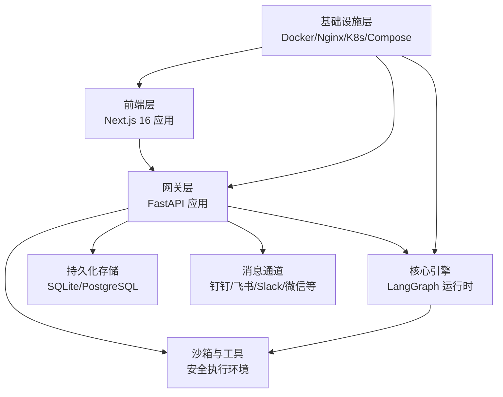
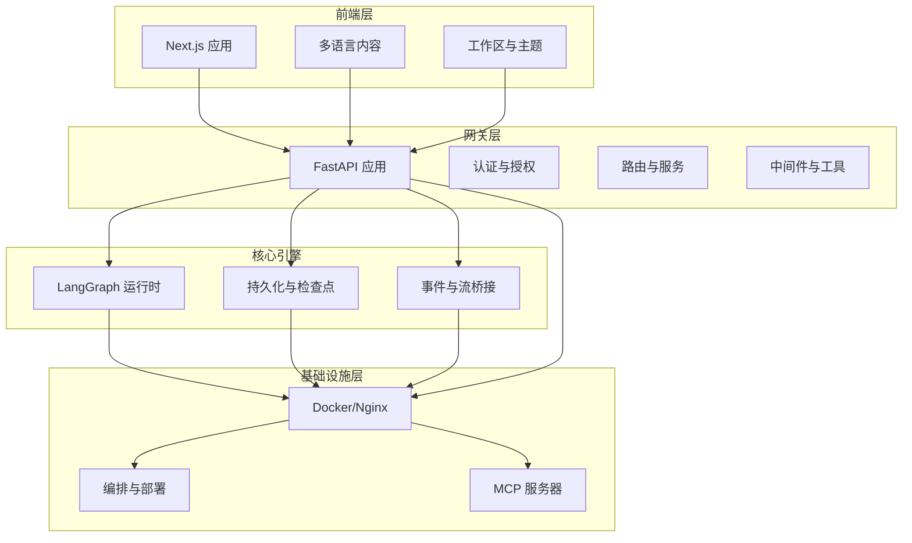
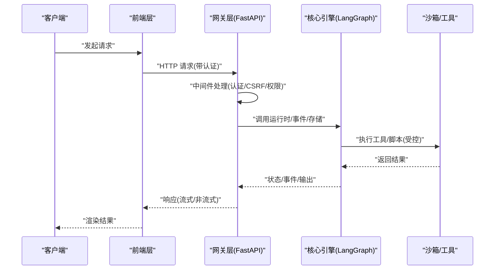
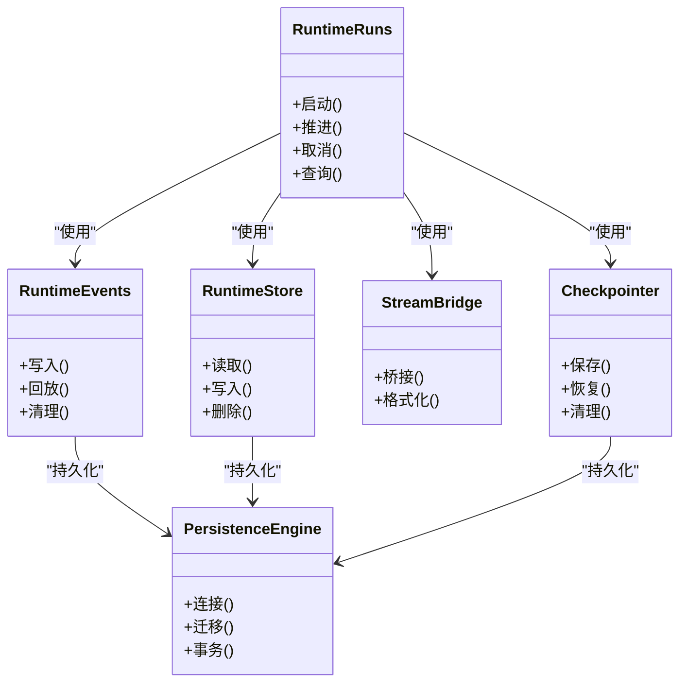
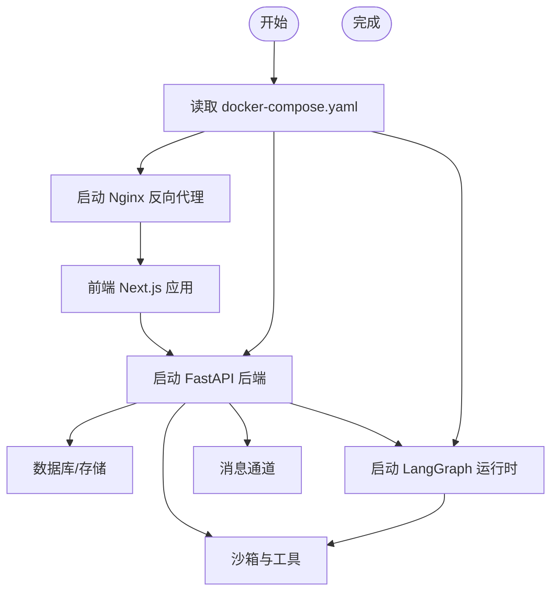
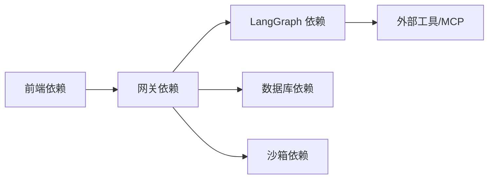

# 架构概览

<cite>
**本文引用的文件**
- [backend/app/gateway/app.py](file://backend/app/gateway/app.py)
- [backend/docs/ARCHITECTURE.md](file://backend/docs/ARCHITECTURE.md)
- [backend/langgraph.json](file://backend/langgraph.json)
- [frontend/package.json](file://frontend/package.json)
- [backend/packages/harness/pyproject.toml](file://backend/packages/harness/pyproject.toml)
- [backend/pyproject.toml](file://backend/pyproject.toml)
- [docker/docker-compose.yaml](file://docker/docker-compose.yaml)
- [docker/provisioner/Dockerfile](file://docker/provisioner/Dockerfile)
- [docker/nginx/nginx.conf](file://docker/nginx/nginx.conf)
- [scripts/deploy.sh](file://scripts/deploy.sh)
- [scripts/start-daemon.sh](file://scripts/start-daemon.sh)
- [backend/app/channels/manager.py](file://backend/app/channels/manager.py)
- [backend/app/gateway/routers/agents.py](file://backend/app/gateway/routers/agents.py)
- [backend/app/gateway/routers/threads.py](file://backend/app/gateway/routers/threads.py)
- [backend/app/gateway/routers/runs.py](file://backend/app/gateway/routers/runs.py)
- [backend/app/gateway/routers/memory.py](file://backend/app/gateway/routers/memory.py)
- [backend/app/gateway/routers/skills.py](file://backend/app/gateway/routers/skills.py)
- [backend/app/gateway/routers/artifacts.py](file://backend/app/gateway/routers/artifacts.py)
- [backend/app/gateway/routers/uploads.py](file://backend/app/gateway/routers/uploads.py)
- [backend/app/gateway/routers/models.py](file://backend/app/gateway/routers/models.py)
- [backend/app/gateway/routers/auth.py](file://backend/app/gateway/routers/auth.py)
- [backend/app/gateway/auth/jwt.py](file://backend/app/gateway/auth/jwt.py)
- [backend/app/gateway/auth/providers.py](file://backend/app/gateway/auth/providers.py)
- [backend/app/gateway/auth/local_provider.py](file://backend/app/gateway/auth/local_provider.py)
- [backend/app/gateway/auth/credential_file.py](file://backend/app/gateway/auth/credential_file.py)
- [backend/app/gateway/auth/middleware.py](file://backend/app/gateway/auth/middleware.py)
- [backend/app/gateway/authz.py](file://backend/app/gateway/authz.py)
- [backend/app/gateway/pagination.py](file://backend/app/gateway/pagination.py)
- [backend/app/gateway/services.py](file://backend/app/gateway/services.py)
- [backend/app/gateway/utils.py](file://backend/app/gateway/utils.py)
- [backend/packages/harness/deerflow/runtime/__init__.py](file://backend/packages/harness/deerflow/runtime/__init__.py)
- [backend/packages/harness/deerflow/runtime/runs/__init__.py](file://backend/packages/harness/deerflow/runtime/runs/__init__.py)
- [backend/packages/harness/deerflow/runtime/events/__init__.py](file://backend/packages/harness/deerflow/runtime/events/__init__.py)
- [backend/packages/harness/deerflow/runtime/store/__init__.py](file://backend/packages/harness/deerflow/runtime/store/__init__.py)
- [backend/packages/harness/deerflow/runtime/stream_bridge/__init__.py](file://backend/packages/harness/deerflow/runtime/stream_bridge/__init__.py)
- [backend/packages/harness/deerflow/runtime/checkpointer/__init__.py](file://backend/packages/harness/deerflow/runtime/checkpointer/__init__.py)
- [backend/packages/harness/deerflow/persistence/engine.py](file://backend/packages/harness/deerflow/persistence/engine.py)
- [backend/packages/harness/deerflow/persistence/base.py](file://backend/packages/harness/deerflow/persistence/base.py)
- [backend/packages/harness/deerflow/tools/tools.py](file://backend/packages/harness/deerflow/tools/tools.py)
- [backend/packages/harness/deerflow/subagents/registry.py](file://backend/packages/harness/deerflow/subagents/registry.py)
- [backend/packages/harness/deerflow/subagents/executor.py](file://backend/packages/harness/deerflow/subagents/executor.py)
- [backend/packages/harness/deerflow/skills/parser.py](file://backend/packages/harness/deerflow/skills/parser.py)
- [backend/packages/harness/deerflow/skills/installer.py](file://backend/packages/harness/deerflow/skills/installer.py)
- [backend/packages/harness/deerflow/guardrails/builtin.py](file://backend/packages/harness/deerflow/guardrails/builtin.py)
- [backend/packages/harness/deerflow/guardrails/middleware.py](file://backend/packages/harness/deerflow/guardrails/middleware.py)
- [backend/packages/harness/deerflow/guardrails/provider.py](file://backend/packages/harness/deerflow/guardrails/provider.py)
- [backend/packages/harness/deerflow/sandbox/sandbox.py](file://backend/packages/harness/deerflow/sandbox/sandbox.py)
- [backend/packages/harness/deerflow/sandbox/security.py](file://backend/packages/harness/deerflow/sandbox/security.py)
- [backend/packages/harness/deerflow/sandbox/tools.py](file://backend/packages/harness/deerflow/sandbox/tools.py)
- [backend/packages/harness/deerflow/models/factory.py](file://backend/packages/harness/deerflow/models/factory.py)
- [backend/packages/harness/deerflow/models/openai_codex_provider.py](file://backend/packages/harness/deerflow/models/openai_codex_provider.py)
- [backend/packages/harness/deerflow/models/claude_provider.py](file://backend/packages/harness/deerflow/models/claude_provider.py)
- [backend/packages/harness/deerflow/models/vllm_provider.py](file://backend/packages/harness/deerflow/models/vllm_provider.py)
- [backend/packages/harness/deerflow/tracing/factory.py](file://backend/packages/harness/deerflow/tracing/factory.py)
- [backend/packages/harness/deerflow/tracing/metadata.py](file://backend/packages/harness/deerflow/tracing/metadata.py)
- [backend/packages/harness/deerflow/config/app_config.py](file://backend/packages/harness/deerflow/config/app_config.py)
- [backend/packages/harness/deerflow/config/memory_config.py](file://backend/packages/harness/deerflow/config/memory_config.py)
- [backend/packages/harness/deerflow/config/tool_config.py](file://backend/packages/harness/deerflow/config/tool_config.py)
- [backend/packages/harness/deerflow/config/sandbox_config.py](file://backend/packages/harness/deerflow/config/sandbox_config.py)
- [backend/packages/harness/deerflow/config/model_config.py](file://backend/packages/harness/deerflow/config/model_config.py)
- [backend/packages/harness/deerflow/config/tracing_config.py](file://backend/packages/harness/deerflow/config/tracing_config.py)
- [backend/packages/harness/deerflow/config/skills_config.py](file://backend/packages/harness/deerflow/config/skills_config.py)
- [backend/packages/harness/deerflow/config/token_usage_config.py](file://backend/packages/harness/deerflow/config/token_usage_config.py)
- [backend/packages/harness/deerflow/config/run_events_config.py](file://backend/packages/harness/deerflow/config/run_events_config.py)
- [backend/packages/harness/deerflow/config/checkpointer_config.py](file://backend/packages/harness/deerflow/config/checkpointer_config.py)
- [backend/packages/harness/deerflow/config/loop_detection_config.py](file://backend/packages/harness/deerflow/config/loop_detection_config.py)
- [backend/packages/harness/deerflow/config/guardrails_config.py](file://backend/packages/harness/deerflow/config/guardrails_config.py)
- [backend/packages/harness/deerflow/config/title_config.py](file://backend/packages/harness/deerflow/config/title_config.py)
- [backend/packages/harness/deerflow/config/summarization_config.py](file://backend/packages/harness/deerflow/config/summarization_config.py)
- [backend/packages/harness/deerflow/config/skill_evolution_config.py](file://backend/packages/harness/deerflow/config/skill_evolution_config.py)
- [backend/packages/harness/deerflow/config/safety_finish_reason_config.py](file://backend/packages/harness/deerflow/config/safety_finish_reason_config.py)
- [backend/packages/harness/deerflow/config/stream_bridge_config.py](file://backend/packages/harness/deerflow/config/stream_bridge_config.py)
- [backend/packages/harness/deerflow/config/subagents_config.py](file://backend/packages/harness/deerflow/config/subagents_config.py)
- [backend/packages/harness/deerflow/config/tool_output_config.py](file://backend/packages/harness/deerflow/config/tool_output_config.py)
- [backend/packages/harness/deerflow/config/tool_search_config.py](file://backend/packages/harness/deerflow/config/tool_search_config.py)
- [backend/packages/harness/deerflow/config/extensions_config.py](file://backend/packages/harness/deerflow/config/extensions_config.py)
- [backend/packages/harness/deerflow/config/agents_config.py](file://backend/packages/harness/deerflow/config/agents_config.py)
- [backend/packages/harness/deerflow/config/agents_api_config.py](file://backend/packages/harness/deerflow/config/agents_api_config.py)
- [backend/packages/harness/deerflow/config/database_config.py](file://backend/packages/harness/deerflow/config/database_config.py)
- [backend/packages/harness/deerflow/config/acp_config.py](file://backend/packages/harness/deerflow/config/acp_config.py)
- [backend/packages/harness/deerflow/config/runtime_paths.py](file://backend/packages/harness/deerflow/config/runtime_paths.py)
- [backend/packages/harness/deerflow/config/reload_boundary.py](file://backend/packages/harness/deerflow/config/reload_boundary.py)
- [backend/packages/harness/deerflow/config/paths.py](file://backend/packages/harness/deerflow/config/paths.py)
- [backend/packages/harness/deerflow/config/skill_evolution_config.py](file://backend/packages/harness/deerflow/config/skill_evolution_config.py)
- [backend/packages/harness/deerflow/config/skill_evolution_config.py](file://backend/packages/harness/deerflow/config/skill_evolution_config.py)
- [backend/packages/harness/deerflow/config/skill_evolution_config.py](file://backend/packages/harness/deerflow/config/skill_evolution_config.py)
- [backend/packages/harness/deerflow/config/skill_evolution_config.py](file://backend/packages/harness/deerflow/config/skill_evolution_config.py)
- [backend/packages/harness/deerflow/config/skill_evolution_config.py](file://backend/packages/harness/deerflow/config/skill_evolution_config.py)
- [backend/packages/harness/deerflow/config/skill_evolution_config.py](file://backend/packages/harness/deerflow/config/skill_evolution_config.py)
- [backend/packages/harness/deerflow/config/skill_evolution_config.py](file://backend/packages/harness/deerflow/config/skill_evolution_config.py)
- [backend/packages/harness/deerflow/config/skill_evolution_config.py](file://backend/packages/harness/deerflow/config/skill_evolution_config.py)
- [backend/packages/harness/deerflow/config/skill_evolution_config.py](file://backend/packages/harness/deerflow/config/skill_evolution_config.py)
- [backend/packages/harness/deerflow/config/skill_evolution_config.py](file://backend/packages/harness/deerflow/config/skill_evolution_config.py)
- [backend/packages/harness/deerflow/config/skill_evolution_config.py](file://backend/packages/harness/deerflow/config/skill_evolution_config.py)
- [backend/packages/harness/deerflow/config/skill_evolution_config.py](file://backend/packages/harness/deerflow/config/skill_evolution_config.py)
- [backend/packages/harness/deerflow/config/skill_evolution_config.py](file://backend/packages/harness/deerflow/config/skill_evolution_config.py)
- [backend/packages/harness/deerflow/config/skill_evolution_config.py](file://backend/packages/harness/deerflow/config/skill_evolution_config.py)
- [backend/packages/harness/deerflow/config/skill_evolution_config.py](file://backend/packages/harness/deerflow/config/skill_evolution_config.py)
- [backend/packages/harness/deerflow/config/skill_evolution_config.py](file://backend/packages/harness/deer......)
</cite>

## 目录
1. [引言](#引言)
2. [项目结构](#项目结构)
3. [核心组件](#核心组件)
4. [架构总览](#架构总览)
5. [详细组件分析](#详细组件分析)
6. [依赖分析](#依赖分析)
7. [性能考量](#性能考量)
8. [故障排查指南](#故障排查指南)
9. [结论](#结论)
10. [附录](#附录)

## 引言
本架构文档面向DeerFlow项目的分层架构与组件关系，覆盖前端层（Next.js 16）、网关层（FastAPI）、核心引擎（LangGraph）与基础设施层的设计原则、技术决策、权衡与约束。文档同时提供系统上下文图与组件分解图，阐述数据流与集成模式，并讨论安全性、监控与灾难恢复等横切关注点。技术栈、第三方依赖与版本兼容性要求在附录中给出。

## 项目结构
- 前端层：基于Next.js 16的应用，采用App Router与TypeScript，提供多语言内容与工作区交互界面。
- 网关层：基于FastAPI的Python后端，提供REST API路由、认证授权、中间件与服务编排。
- 核心引擎：LangGraph运行时与持久化配置，支撑智能体状态管理、检查点与事件流。
- 基础设施层：Docker容器化部署，Nginx反向代理，Kubernetes/Compose编排，以及沙箱与安全策略。

图表来源
- [backend/app/gateway/app.py:1-200](file://backend/app/gateway/app.py#L1-L200)
- [backend/langgraph.json:1-200](file://backend/langgraph.json#L1-L200)
- [docker/docker-compose.yaml:1-200](file://docker/docker-compose.yaml#L1-L200)
- [docker/nginx/nginx.conf:1-200](file://docker/nginx/nginx.conf#L1-L200)

章节来源
- [backend/docs/ARCHITECTURE.md:1-200](file://backend/docs/ARCHITECTURE.md#L1-L200)
- [frontend/package.json:1-200](file://frontend/package.json#L1-L200)
- [backend/pyproject.toml:1-200](file://backend/pyproject.toml#L1-L200)

## 核心组件
- 前端应用（Next.js 16）
  - 路由与页面：App Router组织页面与布局，支持多语言与演示资源。
  - 组件体系：AI元素、UI组件库、工作区与主题提供器。
  - 工具链：TypeScript、ESLint、Prettier、Playwright测试。
- 网关服务（FastAPI）
  - 应用入口与中间件：认证、CSRF、权限控制、分页与通用工具。
  - 路由模块：agents、threads、runs、memory、skills、artifacts、uploads、models、auth等。
  - 认证与授权：JWT、本地提供者、凭证文件、权限模型。
  - 服务编排：运行时生命周期、事件桥接、流式传输。
- 核心引擎（LangGraph）
  - 运行时：runs、events、store、stream_bridge、checkpointer。
  - 持久化：数据库引擎与基础抽象。
  - 配置：应用、内存、工具、沙箱、模型、追踪、技能、令牌用量等。
- 基础设施
  - 容器与编排：Docker Compose与Kubernetes配置，Nginx反向代理。
  - 部署脚本：一键部署与守护进程启动。
  - MCP服务器：SQLServer、RAG知识库、标签验证等外部能力接入。

章节来源
- [backend/app/gateway/app.py:1-200](file://backend/app/gateway/app.py#L1-L200)
- [backend/packages/harness/deerflow/runtime/__init__.py:1-200](file://backend/packages/harness/deerflow/runtime/__init__.py#L1-L200)
- [backend/packages/harness/deerflow/persistence/engine.py:1-200](file://backend/packages/harness/deerflow/persistence/engine.py#L1-L200)
- [docker/docker-compose.yaml:1-200](file://docker/docker-compose.yaml#L1-L200)

## 架构总览
分层架构遵循“前端-网关-引擎-基础设施”的清晰边界：
- 前端层负责用户交互与状态展示，通过Next.js的SSR/CSR与API路由与网关通信。
- 网关层提供统一认证、鉴权、路由与业务编排，屏蔽底层实现细节。
- 核心引擎以LangGraph为核心，管理智能体状态、检查点与事件流，确保可恢复与可观测。
- 基础设施层提供容器化、反向代理、编排与安全策略，保障可用性与弹性。

图表来源
- [backend/app/gateway/app.py:1-200](file://backend/app/gateway/app.py#L1-L200)
- [backend/langgraph.json:1-200](file://backend/langgraph.json#L1-L200)
- [docker/docker-compose.yaml:1-200](file://docker/docker-compose.yaml#L1-L200)

## 详细组件分析

### 前端层（Next.js 16）
- 技术选型：App Router、TypeScript、Tailwind CSS、MDX、i18n。
- 页面与布局：多语言路由、博客、工作区、Mock API与演示资源。
- 组件与样式：AI元素、UI组件库、主题提供器与全局样式。
- 测试与工具：ESLint、Prettier、Playwright端到端测试与单元测试配置。
- 性能与体验：按需加载、静态生成与流式渲染结合，提升首屏与交互性能。

章节来源
- [frontend/package.json:1-200](file://frontend/package.json#L1-L200)

### 网关层（FastAPI）
- 应用入口与生命周期：应用工厂、中间件注册、依赖注入与服务初始化。
- 认证与授权：
  - JWT与本地提供者：凭证文件、密码处理、重置管理员。
  - 权限模型：内部认证、权限控制与CSRF保护。
- 路由模块：
  - agents、threads、runs、memory、skills、artifacts、uploads、models、auth等。
  - 分页与通用工具：分页参数、路径工具与通用辅助函数。
- 服务编排：运行时生命周期、事件桥接、流式传输与序列化。
- 中间件：认证中间件、CSRF中间件、动态上下文与守卫护栏中间件。

图表来源
- [backend/app/gateway/app.py:1-200](file://backend/app/gateway/app.py#L1-L200)
- [backend/app/gateway/auth/middleware.py:1-200](file://backend/app/gateway/auth/middleware.py#L1-L200)
- [backend/packages/harness/deerflow/runtime/runs/__init__.py:1-200](file://backend/packages/harness/deerflow/runtime/runs/__init__.py#L1-L200)

章节来源
- [backend/app/gateway/app.py:1-200](file://backend/app/gateway/app.py#L1-L200)
- [backend/app/gateway/routers/agents.py:1-200](file://backend/app/gateway/routers/agents.py#L1-L200)
- [backend/app/gateway/routers/threads.py:1-200](file://backend/app/gateway/routers/threads.py#L1-L200)
- [backend/app/gateway/routers/runs.py:1-200](file://backend/app/gateway/routers/runs.py#L1-L200)
- [backend/app/gateway/routers/memory.py:1-200](file://backend/app/gateway/routers/memory.py#L1-L200)
- [backend/app/gateway/routers/skills.py:1-200](file://backend/app/gateway/routers/skills.py#L1-L200)
- [backend/app/gateway/routers/artifacts.py:1-200](file://backend/app/gateway/routers/artifacts.py#L1-L200)
- [backend/app/gateway/routers/uploads.py:1-200](file://backend/app/gateway/routers/uploads.py#L1-L200)
- [backend/app/gateway/routers/models.py:1-200](file://backend/app/gateway/routers/models.py#L1-L200)
- [backend/app/gateway/routers/auth.py:1-200](file://backend/app/gateway/routers/auth.py#L1-L200)
- [backend/app/gateway/auth/jwt.py:1-200](file://backend/app/gateway/auth/jwt.py#L1-L200)
- [backend/app/gateway/auth/providers.py:1-200](file://backend/app/gateway/auth/providers.py#L1-L200)
- [backend/app/gateway/auth/local_provider.py:1-200](file://backend/app/gateway/auth/local_provider.py#L1-L200)
- [backend/app/gateway/auth/credential_file.py:1-200](file://backend/app/gateway/auth/credential_file.py#L1-L200)
- [backend/app/gateway/auth/middleware.py:1-200](file://backend/app/gateway/auth/middleware.py#L1-L200)
- [backend/app/gateway/authz.py:1-200](file://backend/app/gateway/authz.py#L1-L200)
- [backend/app/gateway/pagination.py:1-200](file://backend/app/gateway/pagination.py#L1-L200)
- [backend/app/gateway/services.py:1-200](file://backend/app/gateway/services.py#L1-L200)
- [backend/app/gateway/utils.py:1-200](file://backend/app/gateway/utils.py#L1-L200)

### 核心引擎（LangGraph）
- 运行时模块：
  - runs：运行生命周期管理与状态推进。
  - events：事件存储与回放。
  - store：键值存储与会话元数据。
  - stream_bridge：流式传输桥接。
  - checkpointer：检查点与恢复。
- 持久化：数据库引擎与基础抽象，支持迁移与隔离。
- 配置体系：应用、内存、工具、沙箱、模型、追踪、技能、令牌用量、循环检测、守卫护栏、标题生成、摘要、技能演进、安全终止原因、流桥接、子代理、工具输出预算、工具搜索、扩展、代理与代理API、数据库、ACP、运行时路径、重载边界、路径、技能演进等配置模块。

图表来源
- [backend/packages/harness/deerflow/runtime/runs/__init__.py:1-200](file://backend/packages/harness/deerflow/runtime/runs/__init__.py#L1-L200)
- [backend/packages/harness/deerflow/runtime/events/__init__.py:1-200](file://backend/packages/harness/deerflow/runtime/events/__init__.py#L1-L200)
- [backend/packages/harness/deerflow/runtime/store/__init__.py:1-200](file://backend/packages/harness/deerflow/runtime/store/__init__.py#L1-L200)
- [backend/packages/harness/deerflow/runtime/stream_bridge/__init__.py:1-200](file://backend/packages/harness/deerflow/runtime/stream_bridge/__init__.py#L1-L200)
- [backend/packages/harness/deerflow/runtime/checkpointer/__init__.py:1-200](file://backend/packages/harness/deerflow/runtime/checkpointer/__init__.py#L1-L200)
- [backend/packages/harness/deerflow/persistence/engine.py:1-200](file://backend/packages/harness/deerflow/persistence/engine.py#L1-L200)

章节来源
- [backend/langgraph.json:1-200](file://backend/langgraph.json#L1-L200)
- [backend/packages/harness/deerflow/runtime/__init__.py:1-200](file://backend/packages/harness/deerflow/runtime/__init__.py#L1-L200)
- [backend/packages/harness/deerflow/persistence/engine.py:1-200](file://backend/packages/harness/deerflow/persistence/engine.py#L1-L200)
- [backend/packages/harness/deerflow/config/app_config.py:1-200](file://backend/packages/harness/deerflow/config/app_config.py#L1-L200)
- [backend/packages/harness/deerflow/config/memory_config.py:1-200](file://backend/packages/harness/deerflow/config/memory_config.py#L1-L200)
- [backend/packages/harness/deerflow/config/tool_config.py:1-200](file://backend/packages/harness/deerflow/config/tool_config.py#L1-L200)
- [backend/packages/harness/deerflow/config/sandbox_config.py:1-200](file://backend/packages/harness/deerflow/config/sandbox_config.py#L1-L200)
- [backend/packages/harness/deerflow/config/model_config.py:1-200](file://backend/packages/harness/deerflow/config/model_config.py#L1-L200)
- [backend/packages/harness/deerflow/config/tracing_config.py:1-200](file://backend/packages/harness/deerflow/config/tracing_config.py#L1-L200)
- [backend/packages/harness/deerflow/config/skills_config.py:1-200](file://backend/packages/harness/deerflow/config/skills_config.py#L1-L200)
- [backend/packages/harness/deerflow/config/token_usage_config.py:1-200](file://backend/packages/harness/deerflow/config/token_usage_config.py#L1-L200)
- [backend/packages/harness/deerflow/config/run_events_config.py:1-200](file://backend/packages/harness/deerflow/config/run_events_config.py#L1-L200)
- [backend/packages/harness/deerflow/config/checkpointer_config.py:1-200](file://backend/packages/harness/deerflow/config/checkpointer_config.py#L1-L200)
- [backend/packages/harness/deerflow/config/loop_detection_config.py:1-200](file://backend/packages/harness/deerflow/config/loop_detection_config.py#L1-L200)
- [backend/packages/harness/deerflow/config/guardrails_config.py:1-200](file://backend/packages/harness/deerflow/config/guardrails_config.py#L1-L200)
- [backend/packages/harness/deerflow/config/title_config.py:1-200](file://backend/packages/harness/deerflow/config/title_config.py#L1-L200)
- [backend/packages/harness/deerflow/config/summarization_config.py:1-200](file://backend/packages/harness/deerflow/config/summarization_config.py#L1-L200)
- [backend/packages/harness/deerflow/config/skill_evolution_config.py:1-200](file://backend/packages/harness/deerflow/config/skill_evolution_config.py#L1-L200)
- [backend/packages/harness/deerflow/config/safety_finish_reason_config.py:1-200](file://backend/packages/harness/deerflow/config/safety_finish_reason_config.py#L1-L200)
- [backend/packages/harness/deerflow/config/stream_bridge_config.py:1-200](file://backend/packages/harness/deerflow/config/stream_bridge_config.py#L1-L200)
- [backend/packages/harness/deerflow/config/subagents_config.py:1-200](file://backend/packages/harness/deerflow/config/subagents_config.py#L1-L200)
- [backend/packages/harness/deerflow/config/tool_output_config.py:1-200](file://backend/packages/harness/deerflow/config/tool_output_config.py#L1-L200)
- [backend/packages/harness/deerflow/config/tool_search_config.py:1-200](file://backend/packages/harness/deerflow/config/tool_search_config.py#L1-L200)
- [backend/packages/harness/deerflow/config/extensions_config.py:1-200](file://backend/packages/harness/deerflow/config/extensions_config.py#L1-L200)
- [backend/packages/harness/deerflow/config/agents_config.py:1-200](file://backend/packages/harness/deerflow/config/agents_config.py#L1-L200)
- [backend/packages/harness/deerflow/config/agents_api_config.py:1-200](file://backend/packages/harness/deerflow/config/agents_api_config.py#L1-L200)
- [backend/packages/harness/deerflow/config/database_config.py:1-200](file://backend/packages/harness/deerflow/config/database_config.py#L1-L200)
- [backend/packages/harness/deerflow/config/acp_config.py:1-200](file://backend/packages/harness/deerflow/config/acp_config.py#L1-L200)
- [backend/packages/harness/deerflow/config/runtime_paths.py:1-200](file://backend/packages/harness/deerflow/config/runtime_paths.py#L1-L200)
- [backend/packages/harness/deerflow/config/reload_boundary.py:1-200](file://backend/packages/harness/deerflow/config/reload_boundary.py#L1-L200)
- [backend/packages/harness/deerflow/config/paths.py:1-200](file://backend/packages/harness/deerflow/config/paths.py#L1-L200)

### 基础设施层
- 容器与编排：Docker Compose定义服务拓扑，Nginx作为反向代理与静态资源服务。
- 部署脚本：一键部署与守护进程启动，支持开发与生产环境。
- MCP服务器：SQLServer、RAG知识库、标签验证等外部能力接入，增强工具生态。
- 消息通道：钉钉、飞书、Slack、Telegram、微信企业微信等渠道集成，支持文件附件与富媒体。

图表来源
- [docker/docker-compose.yaml:1-200](file://docker/docker-compose.yaml#L1-L200)
- [docker/nginx/nginx.conf:1-200](file://docker/nginx/nginx.conf#L1-L200)
- [scripts/deploy.sh:1-200](file://scripts/deploy.sh#L1-L200)
- [scripts/start-daemon.sh:1-200](file://scripts/start-daemon.sh#L1-L200)

章节来源
- [docker/docker-compose.yaml:1-200](file://docker/docker-compose.yaml#L1-L200)
- [docker/nginx/nginx.conf:1-200](file://docker/nginx/nginx.conf#L1-L200)
- [scripts/deploy.sh:1-200](file://scripts/deploy.sh#L1-L200)
- [scripts/start-daemon.sh:1-200](file://scripts/start-daemon.sh#L1-L200)
- [backend/app/channels/manager.py:1-200](file://backend/app/channels/manager.py#L1-L200)
- [mcp_servers/sqlserver_mcp_server.py:1-200](file://mcp_servers/sqlserver_mcp_server.py#L1-L200)
- [mcp_servers/rag_kb_server.py:1-200](file://mcp_servers/rag_kb_server.py#L1-L200)
- [mcp_servers/label_verification_mcp_server.py:1-200](file://mcp_servers/label_verification_mcp_server.py#L1-L200)

## 依赖分析
- 前端依赖：Next.js、React、TypeScript、Tailwind CSS、MDX、i18n、测试框架与构建工具。
- 后端依赖：FastAPI、Pydantic、SQLAlchemy、Alembic、uvicorn、langgraph、langfuse、mcp-server等。
- 配置与工具：ruff、pytest、coverage、black、isort、mypy等。
- 基础设施：Docker、Nginx、Kubernetes/Compose、外部MCP服务器。

图表来源
- [frontend/package.json:1-200](file://frontend/package.json#L1-L200)
- [backend/pyproject.toml:1-200](file://backend/pyproject.toml#L1-L200)
- [backend/packages/harness/pyproject.toml:1-200](file://backend/packages/harness/pyproject.toml#L1-L200)

章节来源
- [frontend/package.json:1-200](file://frontend/package.json#L1-L200)
- [backend/pyproject.toml:1-200](file://backend/pyproject.toml#L1-L200)
- [backend/packages/harness/pyproject.toml:1-200](file://backend/packages/harness/pyproject.toml#L1-L200)

## 性能考量
- 前端性能：按需加载、静态生成、流式渲染与缓存策略，减少首屏时间与带宽占用。
- 网关性能：异步I/O、中间件最小化、分页与批量操作、连接池与超时控制。
- 引擎性能：LangGraph检查点与事件流优化、内存与磁盘缓存、并发运行与资源配额。
- 基础设施：容器资源限制、反向代理缓存、负载均衡与健康检查、自动扩缩容。

## 故障排查指南
- 认证与授权
  - JWT过期或无效：检查令牌生成与刷新流程，确认密钥与算法配置。
  - 权限不足：核对权限模型与角色映射，确认中间件顺序与拦截规则。
- 路由与服务
  - 404/405错误：检查路由注册与方法匹配，确认路径参数与查询参数。
  - 500错误：查看服务日志与异常堆栈，定位具体处理器与依赖。
- 运行时与事件
  - 运行卡死或中断：检查检查点与事件回放，确认状态一致性与恢复策略。
  - 事件丢失：核对事件存储与清理策略，确认持久化配置与事务边界。
- 沙箱与工具
  - 执行失败：检查沙箱安全策略与工具白名单，确认资源限制与超时设置。
  - 权限问题：核对文件操作锁与虚拟路径映射，确认隔离与审计日志。
- 基础设施
  - 容器无法启动：检查镜像版本与环境变量，确认端口与卷挂载。
  - 反向代理异常：核对Nginx配置与上游健康检查，确认SSL与缓存设置。

章节来源
- [backend/app/gateway/auth/jwt.py:1-200](file://backend/app/gateway/auth/jwt.py#L1-L200)
- [backend/app/gateway/auth/providers.py:1-200](file://backend/app/gateway/auth/providers.py#L1-L200)
- [backend/app/gateway/auth/middleware.py:1-200](file://backend/app/gateway/auth/middleware.py#L1-L200)
- [backend/packages/harness/deerflow/runtime/checkpointer/__init__.py:1-200](file://backend/packages/harness/deerflow/runtime/checkpointer/__init__.py#L1-L200)
- [backend/packages/harness/deerflow/runtime/events/__init__.py:1-200](file://backend/packages/harness/deerflow/runtime/events/__init__.py#L1-L200)
- [backend/packages/harness/deerflow/sandbox/security.py:1-200](file://backend/packages/harness/deerflow/sandbox/security.py#L1-L200)
- [backend/packages/harness/deerflow/sandbox/tools.py:1-200](file://backend/packages/harness/deerflow/sandbox/tools.py#L1-L200)
- [docker/docker-compose.yaml:1-200](file://docker/docker-compose.yaml#L1-L200)
- [docker/nginx/nginx.conf:1-200](file://docker/nginx/nginx.conf#L1-L200)

## 结论
DeerFlow采用清晰的分层架构，前端Next.js负责用户体验，网关FastAPI提供统一入口与业务编排，LangGraph作为核心引擎保障状态与事件的可靠性，基础设施层提供容器化与反向代理支持。通过完善的认证授权、中间件与守卫护栏机制，系统在功能完整性与安全性之间取得平衡；通过配置化的运行时与持久化策略，系统具备良好的可维护性与可扩展性。

## 附录
- 技术栈与版本
  - 前端：Next.js 16、React、TypeScript、Tailwind CSS、MDX、i18n、ESLint、Prettier、Playwright。
  - 后端：FastAPI、Pydantic、SQLAlchemy、Alembic、uvicorn、langgraph、langfuse、mcp-server等。
  - 基础设施：Docker、Nginx、Kubernetes/Compose、外部MCP服务器。
- 第三方依赖与兼容性
  - 依赖管理：前端使用package.json，后端使用pyproject.toml与uv.lock。
  - 版本锁定：后端使用uv锁文件确保依赖一致性。
- 安全性
  - 认证：JWT与本地提供者，支持凭证文件与密码策略。
  - 授权：内部认证、权限模型与CSRF保护。
  - 沙箱：文件操作锁、虚拟路径映射与安全策略。
- 监控与可观测性
  - 追踪：LangFuse集成与自定义追踪工厂。
  - 日志：运行时日志与审计日志。
- 灾难恢复
  - 检查点：LangGraph检查点与事件回放。
  - 持久化：数据库引擎与迁移工具。
  - 备份：容器卷与配置备份策略。

章节来源
- [frontend/package.json:1-200](file://frontend/package.json#L1-L200)
- [backend/pyproject.toml:1-200](file://backend/pyproject.toml#L1-L200)
- [backend/packages/harness/pyproject.toml:1-200](file://backend/packages/harness/pyproject.toml#L1-L200)
- [backend/packages/harness/deerflow/tracing/factory.py:1-200](file://backend/packages/harness/deerflow/tracing/factory.py#L1-L200)
- [backend/packages/harness/deerflow/tracing/metadata.py:1-200](file://backend/packages/harness/deerflow/tracing/metadata.py#L1-L200)
- [backend/packages/harness/deerflow/runtime/checkpointer/__init__.py:1-200](file://backend/packages/harness/deerflow/runtime/checkpointer/__init__.py#L1-L200)
- [backend/packages/harness/deerflow/persistence/engine.py:1-200](file://backend/packages/harness/deerflow/persistence/engine.py#L1-L200)